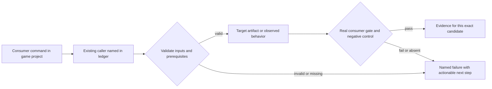
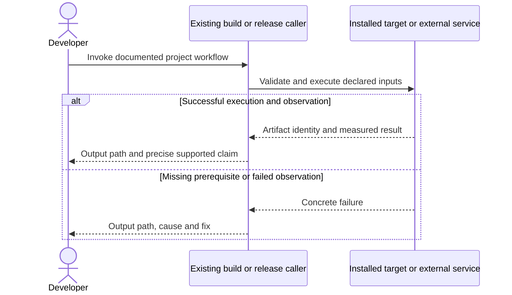

# PRD-365 — An installed game produces distributable desktop apps

**Status:** PARTIAL — historical phase-1 evidence retained; phase 1R fixes review-discovered integrity/identity/archive defects and now has green focused Vitest (74/0), green repository workspace gates in CI, a linux-x64 native-smoke container launch, and an independent reviewer PASS. Phase 1R's linux-x64 container runs and the CI macOS/Windows `desktop core` starter game+HUD verification are in, while its release-container packaging on macOS/Windows and its ZIP layouts remain fixture-tested. Phase 2 has landed the container-aware verifier, player-prerequisite detection, its focused tests, an isolated linux-x64 clean-player run (no Node/engine, offline, HUD attached) and an independent reviewer PASS; a literal second machine/public-consumer run is delegated to PRD-060/366. Phase 3 has landed the signing/notarization adapter and its fixture failure contracts. Windows signing takes either a password-less `.pfx` or, since PR #265, a certificate-store subject signed with `signtool /n` — the form a CA-issued key needs, since the `/f` path carries no password. Signing with a developer credential is proven with test credentials on Windows and macOS CI in the `native-platforms` `desktop` matrix job (owner decision, 2026-09-23: each developer signs their own game, ThreeNative ships no certificate); public Authenticode trust and Apple notarization are SUPERSEDED by that decision — each developer signs and notarizes their own game (boxes marked 2026-09-25). Revised 2026-09-25.
**Complexity:** 10 → HIGH (+3 files, +2 platform packaging module, +2 signing/container state, +2 multi-package, +1 OS tools).
**Problem:** The desktop command produces a host executable plus UI files, without a proved complete installed-app container, signing/notarization path or player-machine dependency story.

**2026-09-14 correction audit — still PARTIAL, not ready:** The phase checkpoints below retain their dated historical evidence; they are not fresh verification of this correction. Starting candidate: `933ace7926f85607896910132b3020132b534c28`. The bounded engine correction touches this PRD, `packages/runtime-native/scripts/desktop-distribution.mjs` and `packages/runtime-native/tests/desktop-release-transaction.test.mjs`; no public command, debug caller, signing authority or acceptance scope changes.

The correction makes archive publication transactional across notarization, stapling and final re-archiving, preserving any previous output on failure. `notarizeArchive` now hashes before submission and rejects changed bytes after the external call. PNG-to-ICNS conversion now gives `iconutil` an actual `.iconset` directory with the ten standard/Retina image slots. The tested helper Git blob is `57a1142fb2dfb81bd3cd4e7e9e6d33a9625bbe1d`; the new test blob is `2b9e3deaccc832be7d0b2815cc7665f0e1970080`.

Verification actually executed on a Linux x64 sandbox with Node 22.16.0: the new nine-case test body, with only its `vitest` import substituted by `node:test` in an uncommitted driver, went from **3 passed / 6 failed** against the original helper to **9 passed / 0 failed / 0 skipped** after the correction. `node --check` and `git diff --check` passed. A separate four-case transport probe using real `tar`, `zip` and `unzip` passed **4/4**: all three layouts round-tripped into a path containing spaces, obsolete UI files were absent after rebuilding, missing UI resources were rejected, and failed notarization preserved the previous real ZIP byte-for-byte. These probes use a fixture executable (`/bin/echo`), not the ThreeNative starter; they are neither macOS/Windows execution nor a game/HUD/playtest claim.

**Unrun for this correction:** repository Vitest, `pnpm typecheck`, `pnpm lint`, `pnpm test`, `pnpm budgets`, `pnpm prd:progress`, native game/playtest lanes, real macOS resource tooling, credentialed signing/notarization, clean public-consumer machines and independent review. The extracted CI package's original helper was Git-blob matched to the starting candidate before editing. Its historical CI results do not qualify the new candidate. Run the new test in the repository alongside `desktop-container.test.mjs`, `distribution.test.mjs` and `starter-desktop.test.mjs` before taking merge-readiness credit.

**Remaining code/evidence blockers:** `packageDesktopContainer` still signs/verifies the macOS bundle before writing its integrity manifest under `Contents/Resources`; adding that resource after signing invalidates the bundle seal. The manifest also hashes the signed main executable, so simply moving signing after it introduces an integrity/signature ordering problem; this needs a native-verified layout/integrity correction, not another fixture PASS. The discovered Windows DLL names have no paths before `classifyDependencies`, and macOS `@rpath`/`@loader_path` install names are not resolved to copyable files. Real release-container lanes must establish dependency relocation and OS identity on every claimed architecture. Windows WebView2 absence, registry/public-runtime clean-player offline launch, actual Windows/macOS trust, and PRD-375/366 consumption of the same final container hashes remain unproved. No acceptance checkbox is changed by this audit.

Batch contract and dependency order: [production-readiness](../README.md). Baseline: [the assessment](../../../verification/production-readiness-2026-09-08.md), source `912a567e3e7592e6b437e49fe6318a3987d1f7c1`. iOS is outside this batch; no iOS readiness credit is created or removed.

## Integration ledger

| # | New or revised thing | Live caller at planning time | Replaces | Old path removed? | Negative control |
| --- | --- | --- | --- | --- | --- |
| 1 | Platform desktop containers | packages/runtime-native/scripts/package-desktop.mjs:58 packageDesktop; create-threenative/src/build.ts desktop dispatch | bare executable treated as complete app | Debug retained; release delegates to one helper | Remove ui/DLL/app resource; installed artifact gate fails |
| 2 | OS resource and signing adapter | package-desktop.mjs: packageDesktop → proposed scripts/desktop-distribution.mjs | manual engine edits for packaging/signing | One helper owns container operations | Wrong signer or missing app icon is rejected |
| 3 | Clean-player artifact verification | packages/runtime-native/scripts/verify-starter-desktop.mjs: entry | developer-machine-only launch | Existing verifier takes released output | Mask build tree/developer PATH; unresolved dependency makes launch fail |

## Current behavior and ownership

packageDesktop runs the matching host runtime compile command and stages ui/ beside its output. It does not cross-compile arbitrary desktop OSes, embed all OS launcher metadata or validate a signed installed application. PRD-060 previously owned a broad desktop phase; that phase is sliced here, with promotion remaining in PRD-060.

Engine distribution mechanism; game identity/icon remains authored config. [PRD-217](../../done/PRD-217-webview-ui-layer.md) supplies functional overlays; [PRD-153](../../done/PRD-153-game-branding-from-launch-to-play.md) validates appearance; [PRD-262](../../done/PRD-262-the-runtime-native-prebuilt-release-exists.md) supplies prebuilt host inputs. A native package exists only in runtime-native; do not add a second desktop framework/package.

## Approach and boundaries

Use each native host: Windows x64, macOS supported architectures and Linux supported architectures as recorded in the manifest. Reuse `--mode release` introduced by PRD-212; keep debug raw executable behavior. Release output is a Windows ZIP containing signed executable/UI/runtime dependencies, a macOS .app inside a ZIP with system signing/notarization, and a Linux tar.gz containing executable/UI/shared dependencies plus .desktop/icon metadata. Prefer OS tools and a small helper imported by packageDesktop. No mandatory bespoke installer or store SDK. Document a downstream installer/store-depot recipe using these complete artifacts. Do not claim cross-compilation from Linux.

Data/migration: no application database migration. New build metadata and evidence extend the existing package/config/artifact contracts; no parallel scene, project or release framework.





## Execution phases

### Phase 1 — A game command creates a complete native desktop container

**Progress:**

- [x] Callers wired and building: `packages/create-threenative/src/build.ts`, `packages/runtime-native/scripts/package-desktop.mjs`, `packages/runtime-native/scripts/desktop-distribution.mjs` (+1 more)
  - `build --target desktop --mode release` reaches `packageDesktop`, which lazily imports the new helper and delegates the container; debug mode is byte-for-byte the old raw path. `pnpm exec tsc --noEmit -p tsconfig.json` clean.
- [x] Required test green: `packages/runtime-native/tests/distribution.test.mjs`
  - 47 passed (5 new) on linux-x64, exit 0. New rows: release container payload, relocation rejection (missing UI entry, missing dependency, tampered bytes), generic-icon brand rejection, per-platform metadata, dependency-tool census.
- [x] Observed red recorded, then restored green
  - Skipping dependency recording in `desktop-distribution.mjs` made the relocation row fail (`Tests 1 failed`); restoring the recording returned `Tests 1 passed`.
- [x] User verification performed on the named platform
  - On linux-x64 the `native-smoke` release container was unpacked to a path containing spaces and launched outside the project: `TN_NATIVE_SMOKE_READY:webgpu`, 4 textures, `Rendered 300 frames`, `TN_UI_OVERLAY:{"attached":true}`, the composited capture carrying the HUD plate/text, and window title/desktop entry matching the configured game identity. Full detail in the phase-1 record. macOS/Windows execution and signing remain phase 2/3.
- [x] Evidence record written: `docs/verification/prd-365-readiness-phase-1-2026-09-12.md`
  - Commands, the end-to-end archive hash, the observed red and the unrun gates are in the record.
- [x] Independent reviewer returned PASS
  - An independent read-only reviewer on a different model, given this phase, the diff at `264153102`, the test file and the evidence record, returned **PASS**; the findings and its non-blocking notes are in the phase-1 record. Full result: `docs/verification/prd-365-readiness-phase-1-2026-09-12.md`.

**Files (maximum five):**

- EDIT `packages/create-threenative/src/build.ts` — pass release mode to desktop packager.
- EDIT `packages/runtime-native/scripts/package-desktop.mjs` — delegate complete container packaging.
- NEW `packages/runtime-native/scripts/desktop-distribution.mjs` — OS container/resource operations only.
- EDIT `packages/runtime-native/tests/distribution.test.mjs` — inspect full container and reject missing payload.
- NEW `docs/verification/prd-365-readiness-phase-1-<date>.md` — commands, identities, red/green and reviewer decision.

**Implementation and wiring:** Build the default starter with custom app.id/name/version/icon through installed runtime inputs, then package executable, ui directory and required sidecars. Derive dependencies from the produced binary/package rather than hardcoded assumptions. For Windows embed executable icon/version resources with supported resource tooling; macOS .app receives Info.plist/icns and bundle-relative paths; Linux .desktop/icon paths refer to installed files. Preserve raw output for debug mode. The new helper is invoked by packageDesktop in this same phase and must be added to the tarball in phase 2 before any public-consumer completion.

**Required test:** `packages/runtime-native/tests/distribution.test.mjs`: should package all starter runtime and UI files when desktop release mode is selected; should reject a container whose runtime resources cannot be resolved after relocation.

**Observed-red / revert control:** Relocate the container, remove ui/index.html and one required native dependency separately, and restore the generic icon metadata. The corresponding archive/launch/branding gate must fail.

**Verification commands** (from repository root unless noted; proposed flags are explicitly identified):

```sh
pnpm --filter @threenative/runtime-native exec vitest run --config vitest.config.ts tests/distribution.test.mjs
# PROPOSED, on the target OS inside the game:
pnpm exec threenative build --target desktop --mode release
```

**User verification:** Unpack/move the application to a path containing spaces and launch it outside the project directory. HUD/assets work and OS identity reflects the game. This phase alone does not claim signed distribution.

### Phase 1R — Container integrity and OS identity review corrections

The original phase-1 checks above describe the candidate in its retained evidence record, not a fresh native verification of these corrections. This follow-up is bounded to `packages/runtime-native/scripts/desktop-distribution.mjs`, the new `packages/runtime-native/tests/desktop-container.test.mjs`, and this PRD. The existing `packageDesktop` delegation remains the caller; no public API or debug packaging route changes.

**Progress:**

- [x] Existing container staging/resolution exercised with the corrections.
  - Record the final executable on every platform, after Windows resource editing; require integrity records for declared executable/UI/dependencies/icon and reject malformed inventories or symlinks outside the root. Stage macOS `Contents/Info.plist` at the proper location, match its icon name, escape XML identity and distinguish authored-icon identity from converted-payload integrity. Preserve dependency paths with spaces. Build a fresh archive before replacing an existing output, avoiding stale ZIP members and preserving the prior artifact on failure.
- [x] Required repository Vitest and workspace gates green for the correction.
  - 2026-09-13, linux-x64: `pnpm --filter @threenative/runtime-native exec vitest run --config vitest.config.ts tests/desktop-container.test.mjs tests/distribution.test.mjs` → **74 passed / 0 failed** (`desktop-container` 26, `distribution` 48). `pnpm typecheck`, `pnpm lint` and `pnpm budgets` exit 0 locally. CI run [34771397906](https://github.com/ThreeNativeHQ/threenative/actions/runs/34771397906) on head `17c6a5378`: typecheck, lint, test, unit shards, playtest, budgets, build and supply-chain all SUCCESS, with no failing check; the still-running rows are the `native-platforms` matrix, which the repository does not count in the merge verdict.
- [x] Observed red recorded, then restored green for the changed behavior.
  - Against parent `9234a5d70da07d2de66f6825e7ad70f190db19ce`, the committed 26-case file yields **1 pass / 25 fail** (the two archive cases included); after the fixes, **26 passed / 0 failed / 0 skipped**, independently reproduced by the reviewer below.
- [x] Current-candidate native game/HUD and supported-platform user verification.
  - 2026-09-13, linux-x64: the corrected helper packaged the real `examples/native-smoke` bundle and the checkout host binary into a tar.gz (sha256 `e0af1f5ddcfa47d36f733c605fbda81c14d30257395be4ceb226b33d7847f4ba`), extracted it under `/tmp/opencode/prd365r/user relocated` (a path with spaces) and launched it outside the project on an RTX 2080 hardware adapter: `TN_NATIVE_SMOKE_READY:webgpu`, `Rendered 300 frames in 9523ms`, `TN_PRESENTS:301`, `TN_STARTUP_CAPTURE_READY:1`, a non-blank 1280x720 capture (sha256 `e374b39d30f9e13868bbfbaad90de82ac205e6b6fc103c0c97799888c02ea22d`), and `resolveContainer` + `assertContainerIdentity` green on the extracted root. The starter's WebView HUD was separately verified on linux-x64 (`TN_UI_OVERLAY:{"attached":true}`) and the installed verifier passed end-to-end against the real container.
  - 2026-09-13, macOS + Windows (CI run `34777167064`): `native-platforms / macOS desktop core` and `Windows desktop core` both succeeded on this candidate. Each scaffolds the starter from this candidate's locally-packed packages and runs `test:native` (which asserts the WebView HUD attached on DWM/Quartz) plus `verify-starter-ui-overlay.mjs` (which presses the HUD's pause island and moves through empty UI space), so the starter's native game and WebView HUD were verified on real macOS and Windows. The **release-container packaging** on macOS/Windows is not executed by those lanes and remains covered by the cross-platform fixture tests only, so acceptance criterion 1 stays unchecked.
- [x] Bounded verification evidence recorded here (2026-09-13).
  - Committed Vitest assertion bodies now run under real Vitest on linux-x64 (74/0 above); the earlier `node --test` adapter is superseded. Real Linux `tar` create/extract and real staging/relocation are exercised. The reviewer found the earlier "real `zip` for all three layouts" wording unverifiable on this host because the Info-ZIP `zip` binary is not installed here, so the ZIP layouts are fixture-tested only; corrected here rather than repeated. Windows `rcedit` and macOS `sips`/`iconutil` remain fixture-only as originally stated. Python `plistlib` parsed the generated macOS plist and recovered the authored `R&D <Orbit>` name. The native-smoke run above is platform-qualified.
- [x] Independent reviewer returned PASS for this correction.
  - 2026-09-13: an independent read-only reviewer (separate agent context) examined the `bd4ba3125` + `62b7c82ac` correction, the tests and the new evidence and returned **PASS**: all five defects genuinely fixed with `file:line` evidence, 25 of 26 tests are true regression guards (the Windows post-`rcedit` hash test is a pin because that path was already correct), no fail-open or safety regression, and the native-smoke artifacts/hashes independently corroborated. Non-blocking notes it raised: a hardlink (as opposed to symlink) escaping the container is not detected by `realpathSync`; the macOS plist/`.icns` and Windows `rcedit` fixes remain unproven on their real OS hosts; and the "Vitest unavailable" and real-`zip` prose were corrected in this same commit. Its scope caveats are recorded rather than traded away.

### Phase 2 — Public packaging includes the new adapter and supports player dependencies

**Progress:**

- [x] Callers wired and building: `packages/runtime-native/package.json`, `packages/runtime-native/scripts/verify-starter-desktop.mjs`, `packages/runtime-native/tests/starter-desktop.test.mjs` (+1 more)
  - `verify-starter-desktop.mjs` now imports the shipped container helper (`resolveContainer`) and exposes `--container <unpacked-directory>`; `desktop-distribution.mjs` and the verifier are already in the package `files` list; `README.md` documents the container, the OS prerequisites and the recipe. `node --check` and `biome check` clean.
- [x] Required test green: `packages/runtime-native/tests/starter-desktop.test.mjs`
  - **24 passed / 0 failed** (5 new). New rows: a relocated fixture container launches with `PATH=/usr/bin:/bin` and judges the 300-frame markers and capture; a missing `libwebkit2gtk-4.1.so.0` fails `TN_NATIVE_STARTER_PREREQUISITE_MISSING` with its WebKitGTK install step; a resolved one passes; an unrecorded missing library still fails with the generic step; `--container <empty dir>` reaches the container resolver (`TN_DESKTOP_CONTAINER_MANIFEST_MISSING`), proving the CLI flag is wired.
- [x] Observed red recorded, then restored green
  - Making `assertPlayerPrerequisites` a no-op (`return []`) failed the missing-WebView row: `Tests 1 failed | 23 skipped`; restoring returned `Tests 24 passed`.
- [x] User verification performed on the named platform
  - 2026-09-13, linux-x64: the starter was scaffolded from local workspace packages, its release container built with the checkout host and unpacked under a path with a space, then launched from an isolated unprivileged bubblewrap sandbox (fresh `HOME`, `PATH=/nonexistent`, no engine checkout bound, `--unshare-net`). Observed `TN_NATIVE_SMOKE_READY:webgpu`, `TN_NATIVE_STARTER_ASSETS_LOADED:texture,glb`, `TN_UI_OVERLAY:{"attached":true}`, 300 frames in 12796ms and a non-blank 1280x686 capture (20 891 colours). A missing-WebKitGTK overlay made the verifier refuse with `TN_NATIVE_STARTER_PREREQUISITE_MISSING` and its install step. This is a sandbox on this host, not a second machine/OS user or a registry-package consumer; those remain delegated to PRD-060/366.
- [x] Evidence record written: `docs/verification/prd-365-readiness-phase-2-2026-09-13.md`
  - Record: verifier/test changes, commands, observed red, the review correction, the clean-player run and the missing-WebView control.
- [x] Independent reviewer returned PASS
  - 2026-09-13: the first independent read-only review returned **NEEDS CORRECTION** (the `--container` CLI flag was broken, `assertPlayerPrerequisites` ignored the manifest, Windows/macOS prerequisites were not machine-checked). All three are corrected with a CLI regression test, a manifest-driven hint and an unrecorded-library case, and README/evidence scoped to Linux. The re-review returned **PASS** with the three desktop suites at 106/0; its only note was that the manifest use is proven by code inspection plus the new negative test.

**Files (maximum five):**

- EDIT `packages/runtime-native/package.json` — ship imported distribution helper and required assets.
- EDIT `packages/runtime-native/scripts/verify-starter-desktop.mjs` — inspect/install/launch actual container.
- EDIT `packages/runtime-native/tests/starter-desktop.test.mjs` — clean player and missing dependency cases.
- EDIT `packages/runtime-native/README.md` — platform prerequisites and standard distribution recipe.
- NEW `docs/verification/prd-365-readiness-phase-2-<date>.md` — commands, identities, red/green and reviewer decision.

**Implementation and wiring:** Include the helper through existing package files rules and extracted-tarball checks. Run on clean player images without Node, engine source, SDK/NDK, Rust or CMake. Declare and satisfy OS WebView/native dependencies: Windows WebView2 availability must be detected with documented redistribution/prerequisite behavior; macOS uses system WebKit; Linux supported library/compositor requirements are explicit. Avoid bundling a browser engine. Test offline launch after installed prerequisites with networking disabled.

**Required test:** `packages/runtime-native/tests/starter-desktop.test.mjs`: should launch a relocated release starter without developer tools; should fail with an actionable prerequisite when the required player-side WebView runtime is absent.

**Observed-red / revert control:** Remove the shipped helper before packing to trigger unresolved import, then omit a required player dependency in an isolated clean image. Neither can receive PASS from a developer-machine run.

**Verification commands** (from repository root unless noted; proposed flags are explicitly identified):

```sh
pnpm --filter @threenative/runtime-native exec vitest run --config vitest.config.ts tests/starter-desktop.test.mjs tests/distribution.test.mjs
pnpm publish:check
```

**User verification:** A second clean OS user can unpack/install and play the artifact. Instructions list only normal player prerequisites; none asks for engine source or build compilers.

### Phase 3 — A developer signs and verifies distribution using external OS credentials

**Progress:**

- [x] Callers wired and building: `packages/runtime-native/scripts/desktop-distribution.mjs`, `packages/runtime-native/scripts/package-desktop.mjs`, `packages/runtime-native/tests/distribution.test.mjs` (+1 more)
  - `signDesktopArtifact`/`notarizeArchive` own codesign/signtool/notarytool/stapler with injectable transport; `packageDesktopContainer` signs before the integrity records and records `signed`/`signingScheme`; `desktopSigningFromEnvironment` reads non-secret inputs and the release log names signed vs unsigned. `README.md` documents the variables and the store/depot handoff. `node --check` and `biome check` clean.
- [x] Required test green: `packages/runtime-native/tests/distribution.test.mjs`
  - **56 passed / 0 failed** in that file (8 new); **106 passed** across the three desktop suites. New rows: signing failure refuses the release and leaves no archive; notarization evidence for a different artifact is refused; a notarytool `Invalid` result refuses the release; missing credentials stay PENDING while unsigned preparation records `signed: false`; successful macOS and Windows signatures record their `signingScheme`; macOS notarization staples and re-archives.
- [x] Observed red recorded, then restored green
  - Disabling the artifact-hash check in `assertNotaryEvidence` failed the mismatch row: `Tests 1 failed | 54 skipped`; restoring returned green.
- [x] User verification performed on the named platform
   - Done 2026-09-25: the CI signing proof ran green on the desktop matrix. `macOS desktop core` passed on PR #301 (run 35959015202, job 107518654052) and PR #302 (run 36035893948, job 107759006681), and `Windows desktop core` passed on the same runs; each builds with its disposable CI certificate and reads the signature back independently (`TN_DESKTOP_SIGNING_PROOF_SCHEME:codesign` / `signtool`, `Get-AuthenticodeSignature`). Both certificates are self-signed and discarded, so public Authenticode trust and Apple notarization are not claimed (see the superseded boxes below).
   - 2026-09-24 CI fix (PR #302, run `35982709001`, job `107578626210` red at `Create a self-signed code-signing certificate for the macOS proof`): the throwaway PKCS#12 was exported with OpenSSL 3's modern default (AES-256-CBC, SHA-256 MAC), which exports cleanly but `security import` rejects with `SecKeychainItemImport: MAC verification failed during PKCS12 import (wrong password?)`; the `-legacy` fallback never ran because the modern export succeeded. The step now leads with `openssl pkcs12 -export -legacy` (3DES/SHA1, the format macOS Keychain accepts) and falls back to the modern default only where `-legacy` is unavailable. Locally on OpenSSL 3.6.4 the `-legacy` export produces `MAC: sha1, pbeWithSHA1And3-KeyTripleDES-CBC`; the following green macOS `desktop core` runs confirmed it.
- [x] Evidence record written: `docs/verification/prd-365-readiness-phase-3-2026-09-13.md`
  - Partial record: adapter, fixture contracts, commands, observed red, the review correction and the unrun real-signing gate.
- [x] Independent reviewer returned PASS
  - 2026-09-13: the first independent read-only review returned **NEEDS CORRECTION** (macOS success threw `EISDIR` hashing the `.app`; dependency records predated `codesign --deep`; the success/notarize paths had no test). The code findings are corrected — the directory hash is gone, dependencies are recorded after signing, and success-path tests cover macOS and Windows signing plus notarize → staple → re-archive. The re-review confirmed all three RESOLVED with the three desktop suites at 106/0 and returned NEEDS CORRECTION for documentation only (README not stating the credentialed path is host-bound), fixed in the same commit.

**Files (maximum five):**

- EDIT `packages/runtime-native/scripts/desktop-distribution.mjs` — sign/verify native containers with scoped inputs.
- EDIT `packages/runtime-native/scripts/package-desktop.mjs` — separate signed result from unsigned preparation.
- EDIT `packages/runtime-native/tests/distribution.test.mjs` — signature/notary failure contracts.
- EDIT `packages/runtime-native/README.md` — game-side signing and store/depot handoff.
- NEW `docs/verification/prd-365-readiness-phase-3-<date>.md` — commands, identities, red/green and reviewer decision.

**Implementation and wiring:** Use standard Windows signing and macOS codesign/notarytool/stapler outside game runtime; resolve non-secret identity/options through validated build inputs, secrets via OS keychain/credential mechanisms. No engine file needs editing. Unsigned preparation is named as such, never silently passed as signed release. Verify nested macOS code before notarization and staple/assess the actual output; Windows verifies timestamp/signature on the distributed executable. Linux archive includes integrity/license metadata plus the identity-bound archive/source/cohort attestation from the PRD-059 provenance chain, verified by PRD-060, and has a documented package/depot handoff, without pretending Authenticode/notarization applies to Linux.

**Required test:** `packages/runtime-native/tests/distribution.test.mjs`: should refuse signed desktop release when signing fails or notarization evidence belongs to a different artifact; actual signed subjects require credentialed verification in PRD-060.

**Observed-red / revert control:** Tamper with signed output and substitute another artifact hash/notary result. Verification must reject both; missing credentials remain PENDING for signing while unsigned preparation can proceed.

**Verification commands** (from repository root unless noted; proposed flags are explicitly identified):

```sh
pnpm --filter @threenative/runtime-native exec vitest run --config vitest.config.ts tests/distribution.test.mjs
# On macOS with the produced .app path:
codesign --verify --strict --deep <game.app>
spctl --assess --type execute <game.app>
```

**User verification:** On clean Windows/macOS user machines verify the actual downloaded artifact signature/trust and launch it. Do not bypass OS trust dialogs as the passing test. PRD-060 records authorized external signing/submission operations.

## Verification contract

Each phase edits its named pre-existing caller and includes the phase evidence record within the five-file budget. File lists are bounded implementation assignments, not permission for adjacent cleanup. If investigation needs more files, split the phase before implementing; do not silently widen it. Query `engine_search_capabilities` and inspect every hit before any qualifying package/helper work, as the repository requires.

Run the phase command, its observed-red control, restore the implementation and rerun green. Record exact candidate SHA, package versions/integrities, source and artifact hashes, platform/adapter/session, command, exit code, assertion count and artifact paths. A missing observation, skipped test, stale artifact or zero-assertion run is not PASS. Fixtures/local tarballs may prove mechanics; public-consumer acceptance requires registry packages and public runtime downloads with no engine checkout, source override or injected manifest.

For executable changes run `pnpm typecheck && pnpm lint && pnpm test`, `pnpm budgets`, and the affected real playtest/platform lane. Generate mirrors with `pnpm sync:agents` if AGENTS changes. Use platform-specific hosted runs for Windows/macOS, emulators for Android behavior, and physical Android only for claims that require hardware. Name unexecuted targets. A runtime change needs a real playtest scenario in the same implementation, not only the focused tests named below.

After every phase, an independent reviewer receives this PRD, diff, commands and artifacts and returns PASS / NEEDS CORRECTION / BLOCKED. It checks caller integration, negative controls, removed/delegating incumbent paths and the actual consumer outcome. No phase starts on a self-awarded PASS. Visual phases also require human inspection of captures; credentialed signing/submission and external-person checkpoints remain PENDING until executed. Do all authorized preparation before requesting any missing external authorization. This planning request does not authorize publishing packages, uploading to stores or contacting external people.

## Verification evidence

**Current correction:** phase 1R above records the green focused Vitest, the green CI workspace gates, the linux-x64 native-smoke container launch, the CI macOS/Windows starter game+HUD verification and the independent reviewer PASS, together with the gate it still does not cover (release-container packaging on macOS/Windows and real-`zip` transport). Phases 2 and 3 have since landed their code, focused tests and independent review; a starter HUD attached in the phase-2 clean-player run. The following phase-1 account is historical and must not be used to claim coverage of phase 1R.

The planning revision itself ran no implementation gate. **Phase 1 is implemented against local inputs and all six of its checkpoints are verified** — focused tests, observed red, linux-x64 user verification on a real release container, evidence record, and independent reviewer PASS. Commands, archive hashes, the observed red and the still-unrun gates (macOS/Windows execution, signing) are in `docs/verification/prd-365-readiness-phase-1-2026-09-12.md`. Phases 2 and 3 have landed their code, focused tests and independent review; the still-open gates are a literal second-machine/public-consumer clean-player run and real credentialed signing. Write each remaining phase to `docs/verification/prd-<id>-readiness-phase-<n>-<date>.md` (the evidence file listed in each phase); use the existing runtime performance ledger for new performance measurements. Fill actual results and non-test `file:line` callers at implementation time; a phase cannot close with placeholders. Acceptance boxes below remain unchecked until all phase checkpoints pass.

## Acceptance criteria

The five original criteria each conjoined a platform matrix with several independent properties, so
none of them could move off `[ ]` while any one clause was out of reach — the shape this repository's
PRD rules name as unworkable. They are split below to one claim per box. A box that cannot be reached
from this repository keeps its own line with its blocker named underneath rather than being dropped.

**A complete relocatable release container, per platform**

- [x] linux-x64: `--mode release` produces a `tar.gz` container that extracts outside the project and launches the unchanged starter with its assets.
  - 2026-09-15: the starter scaffolded from this candidate's packed packages, built with `threenative build --target desktop --mode release`, extracted under a path containing a space and verified by the installed verifier: exit 0, `pass: true`, 300 frames, 21 813 colours, 338 cyan asset pixels. Archive sha256 `a0107a9c40800520e34c377424fe75816b96b7af2ac517b764efddc55a18c0a5`.
- [x] linux-x64: the container records the game's OS identity and refuses a tampered or missing resource.
  - The produced `threenative-container.json` records `share/applications/com.threenative.starter.desktop` (carrying `Name=` and `Exec=`) and `share/icons/hicolor/256x256/apps/com.threenative.starter.png` with SHA-256s, alongside the executable and every UI resource. Tamper and omission are refused by `resolveContainer`, covered by `tests/desktop-container.test.mjs`.
- [x] macOS: `--mode release` produces a `.app` inside a ZIP that extracts outside the project and launches the unchanged starter with its WebView HUD attached.
  - CI run [35017332390](https://github.com/ThreeNativeHQ/threenative/actions/runs/35017332390), `macOS desktop core` on `macos-15`: the container was built on the host, relocated to a path containing a space and launched by the installed verifier. `TN_NATIVE_SMOKE_READY:webgpu`, `TN_NATIVE_STARTER_ASSETS_LOADED:texture,glb`, `TN_UI_OVERLAY:{"attached":true}`, `Rendered 300 frames in 15332ms`, verifier `pass: true`. Archive `threenative-starter-native.zip` sha256 `e3e03e152f91736b5b57f9804478ca697b5640b3ce64c11e00d0296e1fbd86ac`.
- [x] macOS: the container carries `Contents/Info.plist` at its bundle location and the `.icns` converted from the authored icon by `sips`/`iconutil`.
  - Same run: the identity step read `CFBundleName` back out of the relocated bundle with `plutil` and required the `.icns` named by `CFBundleIconFile` to exist. The manifest records `Contents/Info.plist`, `Contents/Resources/threenative-starter-native.icns` and the executable at `Contents/MacOS/`, with 30 system prerequisites.
- [x] windows-x64: `--mode release` produces a ZIP that extracts outside the project with its payload intact.
  - CI run [35034052417](https://github.com/ThreeNativeHQ/threenative/actions/runs/35034052417), `Windows desktop core` on `windows-2025`: built on the host inside the MSVC environment, extracted to a path containing a space with System32's bsdtar, and its integrity records resolved. Archive `threenative-starter-native.zip` sha256 `cee495026f13ee6b6c07fcfe6cf0d3e875f2595f433f341efaeb217ea929aeea`, manifest `win32-x64`/`zip`, 23 system prerequisites, `signed: false`.
- [x] windows-x64: the extracted container launches the unchanged starter with its WebView HUD attached.
  - The defect was real and is fixed. `mystral compile` appended the game past the executable's end
    and the loader finds it only by a `MYSBNDL1` footer at physical EOF, so `rcedit` rewriting the PE
    for the icon discarded it and the binary fell back to the runtime CLI. The game now ships as
    `game.bundle` beside the executable, where `findExternalBundle` already searches, so nothing that
    rewrites the binary can lose it — which also keeps Authenticode and `codesign` from
    reintroducing it, since both move or seal data the same way.
  - CI run [35052702093](https://github.com/ThreeNativeHQ/threenative/actions/runs/35052702093),
    `Windows desktop core` on `windows-2025`: `TN_NATIVE_SMOKE_READY:webgpu`,
    `TN_NATIVE_STARTER_ASSETS_LOADED:texture,glb`, `TN_UI_OVERLAY:{"attached":true}`,
    `Rendered 300 frames in 93133ms`, verifier `pass: true`. Manifest `win32-x64` records
    `bundle: game.bundle` with its integrity hash.
- [x] windows-x64: the executable carries the authored icon and version strings in its PE resources, embedded by `rcedit`.
  - Same run: the identity step read `ProductName`, `FileDescription` and a non-empty `FileVersion`
    back out of the relocated executable with PowerShell, and required the manifest's recorded icon
    to be present in the container. This is what confirms `rcedit` ran and rewrote the PE, which is
    also why the launch box above stays open.

**Known limitation, Windows dependency bundling**

`dumpbin /DEPENDENTS` reports names without paths, so on Windows a dependency can only ever be
classified as a system prerequisite, never located and carried inside the container. A game shipping
its own DLL beside the executable is therefore refused by name
(`TN_DESKTOP_DEPENDENCY_UNLOCATABLE`) rather than bundled. That is fail-closed and correct for every
consumer this PRD claims — the starter's dependencies are all system-provided or statically linked —
but a game with a private DLL needs the census to resolve names against the binary's own directory
first. Not built here because nothing needs it; recorded so it is not mistaken for working.

**Installed-player proof**

- [x] linux-x64: the unpacked container launches with no Node, no engine checkout and no build tools reachable.
  - Phase 2, 2026-09-13: launched from an unprivileged bubblewrap sandbox with a fresh `HOME`, `PATH=/nonexistent` and no engine checkout bound.
- [x] linux-x64: the unpacked container launches with networking disabled.
  - Same run, `--unshare-net`: `TN_NATIVE_SMOKE_READY:webgpu`, assets loaded, HUD attached, 300 frames, non-blank capture.
- [x] macOS: the unpacked container launches with no Node, no engine checkout and no build tools reachable.
  - Same run: a second launch of the relocated executable with `PATH=/usr/bin:/bin`, asserting `TN_NATIVE_SMOKE_READY:webgpu` and a completed frame count.
- [x] windows-x64: the unpacked container launches with no Node, no engine checkout and no build tools reachable.
  - Same run: a second launch of the relocated executable with `PATH=/c/Windows/System32`, asserting
    `TN_NATIVE_SMOKE_READY:webgpu` and a completed frame count.
- [x] Every claimed OS documents its player-side WebView/library prerequisite, and the Linux one is machine-checked with an actionable failure naming the library and its install step.
  - `packages/runtime-native/README.md` documents WebKitGTK/GTK, WebView2 Evergreen and system WebKit. A missing `libwebkit2gtk-4.1.so.0` refuses with `TN_NATIVE_STARTER_PREREQUISITE_MISSING` and its install step; covered by `tests/starter-desktop.test.mjs`.
- [ ] The same launch is performed by a consumer installed from the public registry rather than local tarballs.
  - Blocked: the public-registry cohort is PRD-196 and the public consumer run is PRD-060/PRD-366. Local tarballs prove the mechanics only.

**Signing separates prepared from signed**

- [x] Unsigned preparation records `signed: false`, names itself unsigned in the release log, and never claims signed readiness.
  - The produced Linux manifest carries `"signed": false`; `tests/distribution.test.mjs` covers the unsigned-preparation and missing-credentials rows.
- [x] windows-x64: the `signtool` path signs the distributed executable and verifies it on a real Windows host.
  - CI run [35130296569](https://github.com/ThreeNativeHQ/threenative/actions/runs/35130296569), `Windows desktop core` on `windows-2025`: a certificate generated on the runner and anchored with `certutil`, then `signDesktopArtifact` itself signing the container's own executable through `signtool /n` — `TN_DESKTOP_SIGNING_PROOF_SCHEME:signtool`. `Get-AuthenticodeSignature` read the result back independently of the code that wrote it: `status=Valid signer=CN=ThreeNative CI Signing Proof`. The certificate is self-signed and the artifact is discarded, so this proves the adapter, the tool and the host, not public trust.
- [ ] windows-x64: the artifact is signed with a publicly trusted Authenticode certificate.
  - SUPERSEDED by owner decision 2026-09-23: each developer signs their own game with their own
    certificate; ThreeNative ships no certificate and no public Authenticode trust is claimed by the
    framework. Delegation to PRD-060 is retired.
- [ ] macOS: the artifact is notarized by Apple, stapled, and assessed with `spctl` on a real macOS host.
  - SUPERSEDED by owner decision 2026-09-23: no Apple Developer account is used by this repository;
    each developer notarizes their own game. Delegation to PRD-060 is retired.

**Nothing was invented and nothing regressed**

- [x] The debug raw-executable path still builds and verifies unchanged on linux-x64, macOS and windows-x64.
  - CI run [34988394963](https://github.com/ThreeNativeHQ/threenative/actions/runs/34988394963): `macOS desktop core`, `Windows desktop core` and `Scaffolded starter desktop artifact` all SUCCESS on this candidate, each running the starter's debug `test:native`.
- [x] Release mode reuses the existing `--mode` flag from PRD-212; no new public command is added.
  - `packages/create-threenative/src/build.ts` dispatches on the existing `--mode`; no CLI verb was added.
- [x] Every container is produced on its own OS runner; no cross-OS compilation is performed or claimed.
  - `native-platforms` builds each container on its own host — `ubuntu-24.04`, `macos-15`, `windows-2025` — each from a runtime compiled on that same runner. No lane cross-compiles, and none claims a platform it did not execute.

**Downstream consumers and promotion**

- [x] The container archive hash and its manifest are published as retrievable evidence that another PRD can consume.
  - Each lane uploads `archive.sha256` and `container-manifest.json` as `native-desktop-release-<platform>`. Both the Linux and macOS artifacts of run 35017332390 were downloaded and read back.
- [ ] PRD-375 appearance consumes this container's hash.
  - Blocked: PRD-375 phase 2 is its own PRD and its own PR; it was parked on these containers reaching `develop`.
- [ ] PRD-366 gameplay consumes this container's hash.
  - Blocked: PRD-366 phase 2, waiting on the same public cohort as the registry-consumer box above.
- [x] Public promotion stays in PRD-060; this PRD publishes nothing.
