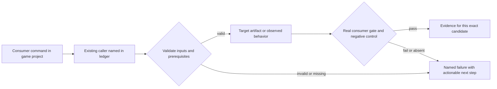
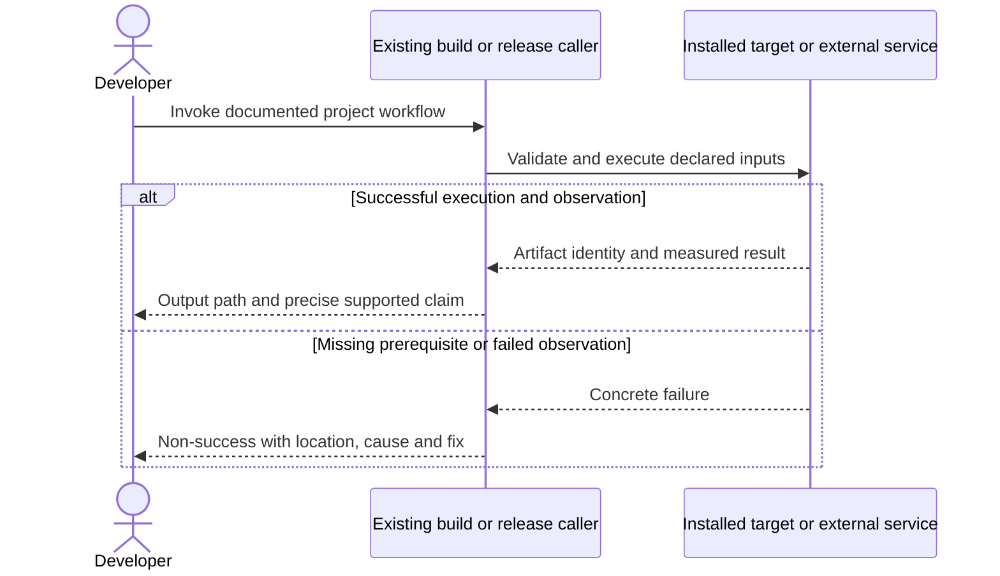

# PRD-366 — One installed consumer game proves the supported platform contract

**Status:** PHASE 2 COMPLETE (independent reviewer PASS on `9a30102d5`); phase 3 open — phase 1's local-tarball browser gameplay proof is recorded below; a public-registry cohort install still waits on PRD-196. Phase 2's cross-target scenario policy was corrected in `d10375e500df5d82cf93fe3487e7d70124f1a157`; the bounded evidence-hardening checkpoint below passes 42 isolated Node regressions, but repository gates, real distributed desktop/Android consumer runs and independent approval remain unverified for this repair. The 2026-09-15 native-consumer repair (portable `KeyR` restart, platform-library noise not counted as game console errors) passes its focused lanes — playtest red 3 failed → 28 passed, runtime-native **87 passed** across the three consumer test files (re-measured at HEAD; the earlier "73" cited a pair that does not reproduce), scaffold 61 passed, both package typechecks — and its real distributed consumer rows now execute locally: a starter scaffolded from the candidate's 11 packed tarballs qualifies on **Linux x64 desktop**, on a **physical Pixel 8** (`arm64-v8a`, API 37) and on an **Android emulator** (`x86_64`, API 35) — every row `pass: true`, 5 assertions, 0 failures, the same scenario hash, application id and **the same five assertion ids**, now machine-checked for set equality across targets after a second review found the qualifier trusted an assertion count alone and would pass a run on assertions the scenario never declared. macOS, Windows and iOS are CI-owned by owner decision; PRD-365 release containers stay unrun. Phase 2 closed with an independent reviewer PASS on `9a30102d5`; the reviewer re-ran the B4 exploits and matched every test count. **Reconciled with PRD-375 (`20f5d6191`) on 2026-09-16:** that merge landed the predicted cross-PR hazard — #255 hardened flag parsing and added `--config`, `--brand-only` and `verifyContainerBrand` inside the very file this branch had turned into a router. Resolved by moving #255's implementation, brand surface and hardening into `verify-starter-desktop-base.mjs`, with the router re-exporting both contracts. #255's parser superseded the guard written here (it also rejects unknown flags), so this branch adopted its `TN_NATIVE_STARTER_CLI_INVALID` taxonomy and rewrote its own tests to the incumbent contract; no #255 test was adjusted to pass. Proved by mutation rather than by green: disabling brand inspection in the base file reds 4 of #255's brand rows (4 failed / 67 passed) and restoring gives 71/71, so its tests genuinely execute against the merged file. Desktop family **203 passed** across five suites; typecheck 0, lint 0. Two findings the reviewer raised as non-blocking were fixed after that verdict: the cross-target assertion-set gate is now **wired and tested** (`--qualify-existing --target desktop,android`) where before it could not fire in any caller, and `ROW_OUTDATED` no longer prescribes a remedy that cannot work. Cross-target equality is verified by that wired, executed command, not by a gate that fires on its own in CI — no shipped script passes two targets yet. Phase 3 physical Android qualification (its own collector, provenance schema and performance budget) remains open, and now carries two items this phase produced: rows keyed by `target` alone lose a row when one target has two devices, and the row should retain `diagnostics[0]` so a repeat pre-assertion abort names itself. Revised 2026-09-08; phase 1 worked 2026-09-12; phase 2 contract and repair worked 2026-09-15.
**Complexity:** 8 → HIGH (+3 files, +2 multi-package, +2 lifecycle/proof state, +1 hosted/device integration).
**Problem:** Isolated engine feature tests and core smoke screenshots do not establish that a developer can build, customize and distribute a playable game using installed packages only.

Batch contract and dependency order: [production-readiness](../README.md). Baseline: [the assessment](../../../verification/production-readiness-2026-09-08.md), source `912a567e3e7592e6b437e49fe6318a3987d1f7c1`. iOS is outside this batch; no iOS readiness credit is created or removed.

## Phase 2 evidence-hardening checkpoint — 2026-09-15

This bounded three-file checkpoint changes the existing engine consumer verifier, adds
`packages/runtime-native/tests/starter-consumer-qualification.test.mjs`, and updates this PRD.
It does not complete the distributed-platform or physical-device qualification phases.

The verifier rejects malformed or contradictory assertion evidence, diagnostics-only reports,
incomplete process completion, duplicate target rows and substituted scenarios. It invalidates
old passing rows before reruns, preserves failure logs, binds scenario bytes and checks artifact
stability across execution. Per-target expected identities allow desktop and Android artifacts
to have different hashes. Android installs the selected APK, passes its package/activity to the
installed runner and checks the installed APK hash before and after gameplay.

Fresh verification against `d10375e500df5d82cf93fe3487e7d70124f1a157`: its verifier blob
`9ac43b2f014189ac56fffb049956bb0d22e1fa94` exactly matches the recovered repair baseline. The same
42 regressions produced **38 failed / 4 passed** on that source and **42 passed / 0 failed** on
the repair, using Node 22.16.0 with `node:test`. The test block is the same as the new Vitest file;
only the unrelated PNG import was isolated, with a stub that throws if used. Runner/ADB results
were boundary fixtures, including one real subprocess executing a fixture CLI, not a game.
`node --check` passed for both changed JavaScript files. Uploaded source and test Git blob hashes
match the tested local files. Existing CLI flags were checked against `packages/playtest/src/runner/config.ts`.

Repository Vitest, typecheck, Biome lint, full tests, budgets, scaffold snapshot and actual
browser/native/device runs were **not executed** in this sandbox: it has no repository checkout,
pnpm/Vitest or native toolchain and cannot resolve GitHub/npm for dependency installation. This
is not an independent reviewer PASS. The historical phase-test counts below are not rerun claims.

The scenario's explicit `noNetworkErrors` field was already removed in `d10375e`: the existing
target policy retains browser observation and allows reasoned native waivers. This checkpoint
preserves that newer change. The coupled starter scaffold snapshot still needs verification from
the complete candidate; no replacement hash is invented. Android workflow staging, real target
rows, release aggregation, actual desktop session coverage and all phase 3 requirements remain
open. Phase and acceptance checkboxes are unchanged; this PR must remain draft/PARTIAL.

## Integration ledger

| # | New or revised thing | Live caller at planning time | Replaces | Old path removed? | Negative control |
| --- | --- | --- | --- | --- | --- |
| 1 | Candidate game scenario gate | scripts/verify-registry-install.ts: verifyRegistryInstall; scripts/verify-template-playtests.ts: existing runner | web-build-only qualification | Extend existing harness, no new runner | Wrong state assertion or absent scenario fails |
| 2 | Distributed target gameplay evidence | .github/workflows/native-platforms.yml: starter/Android jobs → installed playtest CLI | core-only smoke used as full-game proof | Core gates remain narrow; add consumer subject | Delete UI/assets or change application ID; gate fails |
| 3 | Physical consumer qualification | packages/runtime-native/scripts/qualify-physical-mobile.mjs:759 scenario invocation | hardcoded native-smoke-only subject | Existing collector accepts declared consumer project/scenario | Supply emulator or wrong artifact SHA; physical gate rejects |

## Current behavior and ownership

The assessment built web output and reproduced a desktop prebuilt failure; it did not run new browser gameplay or native player/device flows. Existing golden-path, registry-install, template playtest and physical qualification harnesses provide the mechanism; no new test runner is needed.

Consumer verification, not new gameplay systems. [PRD-196](PRD-196-published-install-is-functional.md) owns installation/MCP fixes; [PRD-217](../../done/PRD-217-webview-ui-layer.md) HUD; [PRD-212](../../done/PRD-212-published-install-builds-android.md)/[PRD-365](PRD-365-consumer-desktop-distribution.md) artifacts; [PRD-153](../../done/PRD-153-game-branding-from-launch-to-play.md) brand. Existing PRD-054 owns conformance, PRD-056 owns physical collector schema, PRD-058 owns performance/reliability mechanisms, PRD-080 owns stranger-test protocol. Consume their non-iOS evidence without declaring their iOS scope done.

## Approach and boundaries

Use a freshly scaffolded default starter with its real React UI, models, physics, audio and loading; extend only the consumer scenario to exercise save/relaunch and input as needed through existing capabilities. Start with that production subject, not native-smoke. Use an additional existing platformer reference for its device performance criterion and action-rpg for persistence if starter has no save feature; each additional proof remains separately identified and cannot replace default-starter HUD qualification. Enumerate supported exports/formats through capability and conformance manifests; unsupported browser/WASM/codecs fail early and are documented, never promised as “any game.”

Data/migration: no application database migration. New build metadata and evidence extend the existing package/config/artifact contracts; no parallel scene, project or release framework.





## Execution phases

### Phase 1 — The installed starter proves browser gameplay after a normal edit

**Progress:**

- [x] Callers wired and building: `scripts/verify-registry-install.ts`, `scripts/__tests__/verify-registry-install.spec.ts`, `packages/create-threenative/templates/starter/playtests/production-readiness.playtest.json` (+1 more)
      The clean-room gate now applies a game-only edit, requires the scenario with non-empty assertions, requires the edit in the build, and runs the scenario; `STARTER_PATHS` and the frozen starter scaffold hash moved with the new template file.
- [x] Required test green: `scripts/__tests__/verify-registry-install.spec.ts`
      25/25 passed 2026-09-12; with `packages/create-threenative/__tests__/scaffold.spec.ts` the pair is 86/86.
- [x] Observed red recorded, then restored green
      Four new spec cases fail closed: no assertions, removed scenario, false assertions (playtest throws), edit absent from the build.
- [x] User verification performed on the named platform
      Real browser WebGPU run of the new scenario against a fresh local-tarball scaffold on a fresh generated starter (NVIDIA Turing, rule `sustained-frames`): exit 0, pass true, 943 frames, movement 5.49; `forward`/`restart` siblings pass on the same scaffold. A public-registry cohort install still waits on PRD-196 (PARTIAL).
- [x] Evidence record written: `docs/verification/prd-366-readiness-phase-1-2026-09-12.md`
- [x] Independent reviewer returned PASS
      Three fresh-eyes reviews. The first found two blocking defects (a comment marker Vite strips; a serverless playtest) and three doc issues, all fixed. The second verified those and found the missing `--headed`, fixed and confirmed by a real hardware run. The third verified the invocation, scenario and hash as sound and required only the test-count/status corrections applied here.

**Files (maximum five):**

- EDIT `scripts/verify-registry-install.ts` — run candidate template gameplay after game-only edit.
- EDIT `scripts/__tests__/verify-registry-install.spec.ts` — non-vacuous external consumer assertions.
- NEW `packages/create-threenative/templates/starter/playtests/production-readiness.playtest.json` — observable real starter sequence.
- EDIT `scripts/verify-template-playtests.ts` — verified, no change required: `scenarioFiles` already discovers every `*.playtest.json`, so the new scenario is included without an edit.
- NEW `docs/verification/prd-366-readiness-phase-1-<date>.md` — commands, identities, red/green and reviewer decision.

**Implementation and wiring:** Scaffold from the exact candidate, install without workspace protocols, edit a game-owned movement/UI value, build and run actual browser gameplay against the built output. Verify input changes position, HUD action changes state, asset/physics/audio observation exists and scene can restart. Register using the existing playtest glob. Add one export/asset compatibility audit from existing capability/conformance inventory; do not infer that arbitrary Three.js/browser plugins work natively.

**Required test:** `scripts/__tests__/verify-registry-install.spec.ts`: should reject a consumer result when its real gameplay assertions are absent or false; production-readiness.playtest.json must exercise actual state transitions with nonzero assertions.

**Observed-red / revert control:** Change the expected player displacement/HUD state to a false value and remove the playtest bridge separately. The real installed runner exits nonzero; removing the scenario must also fail required coverage.

**Verification commands** (from repository root unless noted; proposed flags are explicitly identified):

```sh
pnpm exec vitest run scripts/__tests__/verify-registry-install.spec.ts
pnpm tsx scripts/verify-registry-install.ts
pnpm test:templates
```

**User verification:** Play the edited starter from a deployed production build at site root and a subpath. Inspect missing asset URLs, WebGPU adapter and WebGL2 fallback separately; a generated manifest is not an offline/PWA claim.

### Phase 2 — The same distributed game plays on desktop and Android

**Progress:**

- [x] Callers wired and building: `packages/runtime-native/scripts/verify-starter-consumer.mjs`, `packages/create-threenative/templates/starter/package.json`, `scripts/verify-registry-install.ts` (+2 more)
      Corrected 2026-09-15 (review B2/B3): this box previously named `.github/workflows/native-platforms.yml` and `packages/runtime-native/tests/starter-desktop.test.mjs` as wired callers. **Neither is edited by this PR** — `git diff --stat <merge-base>..HEAD -- .github/` is empty and the workflow carries no `--consumer` flag. What actually ships: `verify-starter-desktop.mjs` became a 31-line router that spawns either the new `verify-starter-desktop-base.mjs` (PRD-365's behaviour, moved byte-for-byte) or the new `verify-starter-consumer.mjs` (this phase's `verifyStarterConsumerGameplay` and row contract); the consumer run is invoked by the **starter template's own `test:native` script**, which both the workflow's `starter-linux` and `desktop` matrix jobs already run unchanged; and `readConsumerTargetRows`/`consumerTargets` were added to `scripts/verify-registry-install.ts`.
- [x] Required test green: `packages/runtime-native/tests/starter-consumer-gameplay.test.mjs` and `tests/starter-consumer-qualification.test.mjs`
      Corrected 2026-09-15 (review B1): this box previously cited `tests/starter-desktop.test.mjs` at 31/31. That file is **unchanged by this PR** and contains no PRD-366 work (`grep -c PRD-366` = 0); the 31/31 count does not reproduce. Re-measured at HEAD on this machine, per file, with the package's own config: `starter-desktop.test.mjs` **25 passed** (24 pre-existing + one new control for the merge hazard below), `starter-consumer-gameplay.test.mjs` **12 passed** (it holds both PRD-named rows), `starter-consumer-qualification.test.mjs` **50 passed**, the three together **87 passed**. Also `scripts/__tests__/verify-registry-install.spec.ts` **25 passed** and `packages/create-threenative/__tests__/scaffold.spec.ts` **61 passed**.
- [x] Observed red recorded, then restored green
      Re-measured at HEAD. The B4 repair below was written red first: 6 failed / 43 passed with the exploit report accepted, then 50 passed once the ids are parsed, stored and compared. The merge-hazard control was red first: 1 failed / 24 passed, then 25 passed. Negative controls still fail distinctly by cause: substituted native-smoke subject `SCENARIO_MISMATCH`, stale build `ARTIFACT_MISMATCH`, deleted asset/UI `NO_ASSERTIONS`, injected false state assertion `ASSERTION_FAILED`, missing target `ROW_MISSING`, undeclared assertion `ASSERTION_FAMILY_MISSING`, divergent target evidence `ASSERTION_SET_MISMATCH`, pre-ids row `ROW_OUTDATED`.
- [x] User verification performed on the named platform
      **Three real rows, all executed here, all `pass: true` with 5 assertions and 0 failures: Linux x64 desktop, Android on a physical Pixel 8 (arm64-v8a), and Android on an emulator (x86_64) — and the desktop row independently reproduces on a second machine:** CI job `104662689257` produced `5 assertions, artifact 648ca9ff2bef` on a GitHub runner, different hardware and a different artifact hash for the same scenario and assertions, which is stronger proof than any local row alone. The recorded "environmentally blocked (host GBM)" and "`fetch failed`, no APK exists" notes are both superseded. The candidate's own desktop host was built in this worktree (`mystral` `3bd25e2dabe163fb…`, 405/405) because the primary checkout's Sep-9 binary predates `e36887a05`; the starter was scaffolded from the 11 packed candidate tarballs, installed, and the generated game's own `test:native` — the exact command CI's `starter-linux` job runs — exited 0 (`300 frames, 21696 colors, 331 asset pixels`, then `consumer gameplay qualified on desktop: 5 assertions, artifact b0f7d4e28e11`). Android needed the packager's documented `THREENATIVE_RUNTIME_SOURCE=… --allow-source-build` hatch plus the `-PthreenativeJsEngine=quickjs` rollback (`v8-android` has no usable payload and falls through to a ~3.5 h Chromium compile); `BUILD SUCCESSFUL in 2m 34s` produced a 47.6 MB APK, 16 KB-page clean on both ABIs, which qualified on the **physical Pixel 8** (`arm64-v8a`, `17 (API 37)`, `session: android-device`, charging, 74%, thermal 0) and on **`emulator-5556`** (`x86_64`, `15 (API 35)`, `session: android-emulator`). Every row carries the **same** `scenarioHash` `4edb52f1fb8d6ded…`, the same `applicationId` `com.threenative.starternative` and — after the B4 repair — the **same five assertion ids** `diagnostics, movement.axisDelta, resource.state.entityCount.atSteps, resource.state.score.atSteps, visibility.player`, with different artifact hashes per target. That equality is now machine-checked, not asserted: perturbing one id on the real rows raises `ASSERTION_SET_MISMATCH`. Observations: score 1→0 and entityCount 3→4 across restart, 0 console errors with `runtimeReady`, `-z` movement delta 3.99997 (≥ 0.5), player visibility 3699.6 projected px (≥ 20). **Not covered by this box:** macOS, Windows and iOS, which are CI-owned by owner decision and run the same `test:native` on the hosted matrix; and PRD-365 release containers (these rows are the `dist-native` artifact, not a relocated container). **The physical claim is stated as: arm64-v8a is proven across four runs, with a named unexplained prior failure.** The first Pixel attempt exited 1 with `assertions: 0`; I misattributed that to an API-37 diagnostics gap, when it is `failureReport()`'s generic pre-assertion abort (`packages/playtest/src/runner/shared.ts:119-130`) — physical arm64 failed *before* gameplay. The device was then cold-launched four consecutive times: **4/4 pass**. That does not retire the failure, for a reason that must be disclosed rather than footnoted: between the two observations **the lane coordinator plugged the device into AC and set `stay_on_while_plugged_in=15` at the owner's request** — a deliberate operator intervention on the machine under test, not a variable that drifted. The failing run was at 15% discharging with no stay-awake; all four passes at 74-82% on AC held awake, and the failing condition was not re-created. A run that aborted on the very target being claimed is evidence of something even while unexplained, so it **survives as a phase-3 observation**: *physical arm64 aborted before assertions once; cause unisolated, did not reproduce across four subsequent runs under changed and partly intervened-upon device state.* Phase 3 also carries whether the row should retain `diagnostics[0]` so such an abort names itself.
- [x] Evidence record written: `docs/verification/prd-366-readiness-phase-2-2026-09-15.md`
- [x] Independent reviewer returned PASS
      **PASS** (independent fresh-eyes review of `9a30102d5b21b01d5bd37b94e5557edf5e3b59a5`, 2026-09-15). The reviewer re-ran this work rather than reading it: it reproduced every test count independently (`starter-desktop` 25, `starter-consumer-gameplay` 12, `starter-consumer-qualification` 50, together 87; registry 25; scaffold 61) and re-ran the B4 exploits against the shipped code — `totally-made-up` raises `ASSERTION_FAMILY_MISSING`, an empty assert block raises `NO_ASSERTIONS … declares no recognised assertion family` (it called the vacuous-declaration hole "genuinely closed"), dropping 1 of 4 declared families fails by name, and an honest 5-assertion run still exits 0, so the check does not simply refuse everything. The `--container ""` merge hazard was confirmed fixed in the base file. Target-keying was confirmed as correctly non-blocking because both Android rows are carried in the evidence with the limitation named. On the hardware wording it was explicit that the phrasing here is **"not too hedged"** and is narrower and more useful than its own suggested "proven once": it distinguishes what is proven (arm64-v8a 4/4 under charged-and-awake conditions) from what is open (behaviour under power pressure), and it agreed that 4/4 cannot retire the prior failure while no run was taken in the state that failed. Retaining `diagnostics[0]` was endorsed as the right phase-3 fix. Earlier verdicts on this phase — NEEDS CORRECTION on the C1 scenario policy, then on B1-B4 and the causal paragraph — are superseded; every finding from them is fixed and recorded in the evidence. Findings raised as non-blocking and addressed after this review: the cross-target gate is now wired and tested (it previously could not fire), and `ROW_OUTDATED` no longer prescribes a remedy that cannot work.

**Native consumer repair (2026-09-15):** the distributed rows CI still failed for two real causes are fixed in this branch. The shared scenario no longer restarts through the WebView menu (`Tab`/`Tab`/`Enter`, which native's pointer-only overlay injection cannot deliver and which the unreachable Linux overlay never receives); it presses the game's own portable `restart: { keys: ["KeyR"] }` binding and samples `restarted` after a 120-tick wait, so `score`/`entityCount` are read after `Play.enter` restores them. `desktopConsoleType` no longer counts hosted-host ALSA/AT-SPI platform-library lines (`ALSA lib`, `[Audio] … ALSA`, `dbind-WARNING`) as the game's console errors, keeping every line observable and leaving `noConsoleErrors`/`runtimeDiagnostics`/`runtimeReady` intact. Executed here: `desktop-playtest.spec.ts` red **3 failed → 28 passed**. The other counts this paragraph carried were stale and are superseded by the re-measured set in the progress boxes above (`starter-desktop` 25, `starter-consumer-gameplay` 12, `starter-consumer-qualification` 50, together 87; `scaffold.spec.ts` 61 at starter hash `f9b0ac87…`, recomputed after the develop merge). The claim that no local desktop consumer row was run and that CI would be its first execution is **superseded**: desktop, physical Pixel 8 and emulator rows all executed locally, recorded in the user-verification box.

**Files (maximum five):**

- EDIT `.github/workflows/native-platforms.yml` — consume final containers and Android artifacts.
- EDIT `packages/runtime-native/scripts/verify-starter-desktop.mjs` — invoke same consumer gameplay scenario.
- EDIT `packages/runtime-native/tests/starter-desktop.test.mjs` — artifact identity and false assertion controls.
- EDIT `scripts/verify-registry-install.ts` — record per-target consumer results.
- NEW `docs/verification/prd-366-readiness-phase-2-<date>.md` — commands, identities, red/green and reviewer decision.
- Repair: EDIT `packages/create-threenative/templates/starter/playtests/production-readiness.playtest.json`, `packages/playtest/src/runner/desktop.ts`, `packages/playtest/__tests__/desktop-playtest.spec.ts`, `packages/create-threenative/__tests__/scaffold.spec.ts`.

**Implementation and wiring:** Use exact artifacts from PRD-212/365 and exact public candidate inputs from PRD-262/060. Run keyboard/mouse/gamepad where supported and Android touch; test menu action, movement, physics collision, audio event, scene restart, missing asset refusal and offline launch after packaging. Add real scenario coverage through the same installed playtest runner; no hardcoded pass strings. Record actual OS/architecture/session and fail if any required row is absent.

**Required test:** `packages/runtime-native/tests/starter-desktop.test.mjs`: should reject target qualification when the artifact hash/application ID differs from the built consumer; should reject a missing required gameplay row.

**Observed-red / revert control:** Substitute a native-smoke artifact or stale starter build, delete one asset/UI folder and inject a false state assertion; each must fail the target gate for its real cause.

**Verification commands** (from repository root unless noted; proposed flags are explicitly identified):

```sh
pnpm --filter @threenative/runtime-native exec vitest run --config vitest.config.ts tests/starter-desktop.test.mjs
# On each installed desktop game host; substitute actual executable path:
pnpm exec threenative-playtest playtests/production-readiness.playtest.json --target desktop --executable <game-executable>
# On the Android consumer/device lane:
pnpm exec threenative-playtest playtests/production-readiness.playtest.json --target android --device <serial>
```

**User verification:** Play the actual distributed game on Windows, macOS, supported Linux sessions and Android emulator. Background/resume and close/reopen it; inspect save persistence on the action-rpg subject where the starter has no save system.

### Phase 3 — Physical Android and release limitations are measured honestly

**Progress:**

- [ ] The clean room carries the physical-mobile identity: `scripts/verify-registry-install.ts`
      records it in the cohort result. proof: `grep -n physical scripts/verify-registry-install.ts`
      names the row. — OPEN: the qualifier and its test are live callers today
      (`packages/runtime-native/package.json` exposes `qualify-physical-mobile`, 21/21 green
      2026-09-25), but the clean-room leg is not wired yet.
- [x] Required test green: `packages/runtime-native/tests/physical-mobile-qualification.test.mjs`.
      proof: `pnpm --filter @threenative/runtime-native exec vitest run --config vitest.config.ts
      tests/physical-mobile-qualification.test.mjs` — 1 file, 21 tests passed, exit 0 (2026-09-25).

**Files (maximum five):**

- EDIT `packages/runtime-native/scripts/qualify-physical-mobile.mjs` — accept declared consumer project/scenario instead of fixed fixture.
- EDIT `packages/runtime-native/tests/physical-mobile-qualification.test.mjs` — project/artifact/device identity controls.
- EDIT `scripts/verify-registry-install.ts` — include physical evidence identity in cohort result.
- EDIT `docs/CURRENT-CHALLENGES.md` — state observed limitations and supported envelope.
- NEW `docs/verification/prd-366-readiness-phase-3-<date>.md` — commands, identities, red/green and reviewer decision.

**Carried in from phase 2 (2026-09-15), both with concrete evidence rather than theory:**

1. **Consumer rows are keyed by `target` alone**, so a physical-device run overwrites an emulator run
   in `consumer-targets.json`. Observed here: the Pixel 8 row replaced the `emulator-5556` row, and
   both survive only because phase 2's evidence document writes them out by hand. A target reachable
   by more than one device needs the device identity in the key.
2. **One physical arm64 run aborted before assertions** and its cause was never isolated; the row
   retained only `failureReport()`'s generic pre-assertion shape, not the `diagnostics[0]` that named
   the real cause. Retaining that entry on the row is the prerequisite for diagnosing a repeat.

**Implementation and wiring:** Extend the existing physical collector with validated project/scenario inputs; retain its required evidence/provenance schema and default native-smoke compatibility. Do not remove PRD-056 prerequisite checks or count iOS as a required target for this non-iOS batch. Use actual signed Android artifact, correct applicationId and arm64 GPU device; record touch, back navigation, suspend/resume, cold restart, saves and telemetry. Measure the unmodified platformer reference against its existing performance budget, with default starter startup/steady-state recorded separately. Raw performance results update runtime-perf-state.md in a separate evidence-only checkpoint if the five-file budget is exhausted.

**Required test:** `packages/runtime-native/tests/physical-mobile-qualification.test.mjs`: should reject consumer qualification when device identity is an emulator or the scenario/project does not match the installed artifact.

**Observed-red / revert control:** Substitute an emulator identity, stale APK hash, absent lifecycle observation and false persisted-state assertion separately; collector rejects each rather than reusing a prior smoke record.

**Verification commands** (from repository root unless noted; proposed flags are explicitly identified):

```sh
pnpm --filter @threenative/runtime-native exec vitest run --config vitest.config.ts tests/physical-mobile-qualification.test.mjs
node packages/runtime-native/scripts/qualify-physical-mobile.mjs --help
```

**User verification:** Run the documented collector invocation on the selected physical phone after capturing its validated options from --help; archive exact expanded command. Measure sustained gameplay and background/resume on the artifact, not on a different installed package. Human inspection of input and performance traces remains required.

## Verification contract

Each phase edits its named pre-existing caller and includes the phase evidence record within the five-file budget. File lists are bounded implementation assignments, not permission for adjacent cleanup. If investigation needs more files, split the phase before implementing; do not silently widen it. Query `engine_search_capabilities` and inspect every hit before any qualifying package/helper work, as the repository requires.

Run the phase command, its observed-red control, restore the implementation and rerun green. Record exact candidate SHA, package versions/integrities, source and artifact hashes, platform/adapter/session, command, exit code, assertion count and artifact paths. A missing observation, skipped test, stale artifact or zero-assertion run is not PASS. Fixtures/local tarballs may prove mechanics; public-consumer acceptance requires registry packages and public runtime downloads with no engine checkout, source override or injected manifest.

For executable changes run `pnpm typecheck && pnpm lint && pnpm test`, `pnpm budgets`, and the affected real playtest/platform lane. Generate mirrors with `pnpm sync:agents` if AGENTS changes. Use platform-specific hosted runs for Windows/macOS, emulators for Android behavior, and physical Android only for claims that require hardware. Name unexecuted targets. A runtime change needs a real playtest scenario in the same implementation, not only the focused tests named below.

After every phase, an independent reviewer receives this PRD, diff, commands and artifacts and returns PASS / NEEDS CORRECTION / BLOCKED. It checks caller integration, negative controls, removed/delegating incumbent paths and the actual consumer outcome. No phase starts on a self-awarded PASS. Visual phases also require human inspection of captures; credentialed signing/submission and external-person checkpoints remain PENDING until executed. Do all authorized preparation before requesting any missing external authorization. This planning request does not authorize publishing packages, uploading to stores or contacting external people.

## Verification evidence

No implementation gate was run by this planning revision. Every new phase is **NOT RUN**. Write each phase to `docs/verification/prd-<id>-readiness-phase-<n>-<date>.md` (the evidence file listed in each phase); use the existing runtime performance ledger for new performance measurements. Fill actual results and non-test `file:line` callers at implementation time; a phase cannot close with placeholders. Acceptance boxes below remain unchecked until all phase checkpoints pass.

## Acceptance criteria

- [ ] A normal consumer edit builds and plays in a real browser and each claimed non-iOS native
  target with the same public candidate identity. proof: the consumer rows of
  `pnpm exec threenative-playtest playtests/production-readiness.playtest.json --target desktop
  --executable <game>` run from a project installed at `@threenative/*@0.3.3`. — OPEN: the same
  rows pass against the candidate's local tarballs (phase 2, 2026-09-15); the public cohort
  install has not been re-run.
- [ ] HUD/input, asset decoding, physics/audio, scene restart, offline native launch and applicable
  save/lifecycle behaviors have nonzero real assertions plus false-value controls. proof: the
  scenario's assertion ids are set-equal across every claimed target
  (`--qualify-existing --target desktop,android`) and the false-value controls in
  `tests/physical-mobile-qualification.test.mjs`. — OPEN: proved for desktop/emulator rows, not yet
  for the public candidate.
- [ ] Unsupported codecs/browser globals/extensions and workload limits are explicitly inventoried;
  no absolute “any game” guarantee is made. proof: `docs/CURRENT-CHALLENGES.md` names the observed
  limitations and the supported envelope, and no document claims “any game”.

## Blocked on

- **Physical Android evidence from the exact signed artifact on real hardware** (a Pixel 8 session,
  API 37): unblocked when a Pixel 8 is attached or loaned. Emulator rows carry no physical
  performance credit, so this cannot be closed from the emulator lane.
- **External developer/player acceptance**: PRD-060. No template, build or unit pass substitutes for
  it, and none of it is reachable from this repository.
## Decisions

- **2026-09-25 (owner, R1) — proof inline from today.** Boxes opened from this date
  name their `proof:` on the box. Boxes ticked before this date cite their evidence in the lines
  beside them (command, test name, artifact path, CI run) and are left as they are.
- **2026-09-25 (owner, R2) — ceremony boxes deleted.** "Observed red recorded", "evidence record
  written" and "independent reviewer returned PASS" are PR-body concerns, not PRD work.
- **2026-09-24 (owner) — the PRD-080 (stranger test) half of the external-acceptance box is
  deleted.** PRD-080 was removed; external developer/player acceptance is PRD-060 alone and is now
  listed under *Blocked on*.
