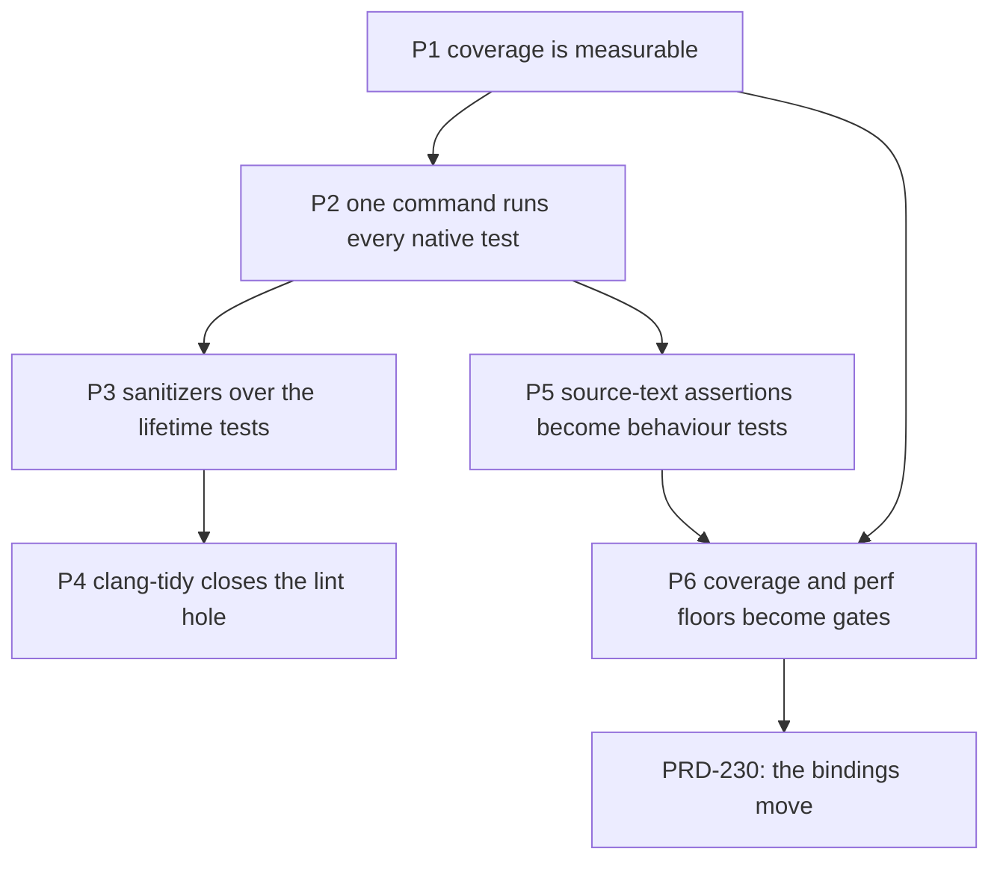

# PRD-229 — the native host is provable before it is moved

**Status:** PARTIAL — filed 2026-08-28. **Phases 1–4 and 6 landed on 2026-08-28 under commits
that do not cite this PRD**, which is why this document read "no phase has executed" until the
reconciliation of 2026-08-29 below. **Phase 5 is the one open phase, and it is the one that
actually protects [PRD-230](./PRD-230-the-webgpu-bindings-move-one-surface-at-a-time.md).**
Every number below is measured at `7b729e2d` unless it says otherwise.

**Goal, in the owner's words: harden it first, so we catch the regression if we do some shit.**
`packages/runtime-native` is a core module. **This PRD moves no product code at all.** It builds
the instrument that would notice if moving code broke something, and proves that instrument can go
red. The moving is [PRD-230](./PRD-230-the-webgpu-bindings-move-one-surface-at-a-time.md), which
does not start until this one is green.

This is the first PRD of [the runtime-native refactor batch](./README.md).

**Complexity:** +3 (10+ files) +2 (per-frame state and lifetime logic) +2 (package + root gate +
CI lane) = **7 → HIGH mode.** Mandatory checkpoint after every phase.

## Why this order and not the obvious one

The obvious batch splits `bindings.cpp` (7,768 lines) first. That batch fails, for a reason that is
measurable today:

**There is no instrument that would notice.** The package has **zero** coverage instrumentation,
**zero** sanitizer build options, and **zero** CTest registrations for its 25 C++ test executables.
The suite that does exist is 73 vitest files, of which **27 read C++ source text and assert on it**
— `bindings.cpp` is named 35 times, `runtime.cpp` 33 times.
`tests/raytracing-contract.test.mjs` locates `static js::JSValueHandle js_traceRays(` by string
index and asserts a refusal appears before a backend call; it executes no native code at all. Those
tests pass on a file that never compiled, and they go red when a symbol is *renamed* while staying
green when its *behaviour* breaks. That is exactly backwards for a refactor.

So the refactor's real cost is not the C++. It is that the current suite fails on the safe changes
and sleeps through the dangerous ones.

## The problem, measured

| Metric | Value | Source |
| --- | ---: | --- |
| C++ in `src/` + `include/` | 45,318 lines | `find … \| wc -l` |
| Package total (census-counted) | 103,500 lines | `docs/verification/native-runtime-census-2026-08-16.md` |
| Native LOC review trigger | 50,000 | same doc — **2.07× over** |
| `src/webgpu/bindings.cpp` | 7,768 lines | `wc -l` |
| Its incremental compile | **16 s** (1 TU; a normal file is 1 s) | `ninja` single-object rebuild |
| Commits touching it in 90 days | 60 | `git log --name-only` |
| `BindingsState` fields | ~100, one struct | `src/webgpu/bindings_state.h:175-315` |
| Opaque handler names | 87 × `tnWebgpuHandlerNN` | `grep -oE` |
| `#if`/`#ifdef`/`#else` in `bindings.cpp` | 217 | `grep -c` |
| … in `context.cpp` | 122 | `grep -c` |
| C++ test executables | 25 | `CMakeLists.txt` |
| `add_test` registrations | **0** | `grep -c add_test` |
| Sanitizer / coverage build options | **0** | `grep -n 'sanitize\|coverage' CMakeLists.txt` |
| Vitest files asserting on C++ source text | **27 of 73** | `grep -l` |
| Exact 6-line clone rate across `src/` | 2% | window-hash clone scan |
| Handlers indexing `args[N]` with no arity guard | **0 of 87** | AST-ish scan (this part is healthy — keep it) |

**Baseline C++ line coverage: 39.19%** of instrumented executable lines in the `tn-linux`
configuration — measured 2026-08-28 in a scouting run, recorded in
[native-coverage-scouting-2026-08-28](../../verification/native-coverage-scouting-2026-08-28.md).
Nothing had ever measured it before that run, which was itself the finding.

| Subsystem | Instrumented lines | Line % |
| --- | ---: | ---: |
| `src/webgpu/` | 7,174 | **33.77%** (`bindings.cpp` alone: **32.14%**) |
| `src/js/` | 2,665 | 39.47% |
| `src/runtime.cpp` | 2,583 | 50.45% |
| `src/canvas/` | 1,357 | 60.06% |
| `src/audio/` | 1,283 | 56.66% |
| `src/platform/` | 945 | 21.90% |
| `src/webtransport/` | 818 | **9.90%** |
| `src/http/` | 400 | 12.75% |
| everything else | 1,316 | 47–100% |
| **TOTAL** | **18,541** | **39.19%** |

That scouting run is not Phase 1 — it has no script, no gate and no negative control — but it
settles two things the plan would otherwise have guessed at: the toolchain works here and the number
is 39%. Its apparent configuration blocker was subsequently attributed to a stale executable and
a real packed-stream wrapper regression, then repaired before Phase 1.

### The denominator trap this PRD must not fall into

The `tn-linux` preset compiles with `TN_ENABLE_RAYTRACING=OFF`, `TN_ENABLE_VIDEO=OFF`,
`TN_ENABLE_DEBUG_SERVER=OFF`, `TN_ENABLE_NATIVE_GLTF=OFF`, `TN_ENABLE_NATIVE_PHYSICS=OFF`. That is
`src/raytracing/` (5,014 lines), `src/video/` (2,139), `src/debug/` (739) and `src/gltf/` (475)
**not compiled at all in the default lane** — 8,367 lines that a naive coverage run would simply
omit from its report and thereby flatter every percentage.

**Rule for this PRD: "not compiled in this configuration" is a third state, reported by name,
never folded into either "covered" or "uncovered".** A coverage number that cannot say which of the
three a file is in is rejected.

The scouting run also found two silent-pass mechanisms already live in the C++ suite, both of which
Phase 2 must close: `threenative-handle-lifetime-test` **encodes a skip as exit code `77`**
(`SKIP: quickjs is not compiled in`), invisible to any runner checking only for zero; and
`threenative-physics-actuation-bindings-test` **does not link at all** in `tn-linux`, which today
looks the same as "not run".

### Phase 1 prerequisite, attributed and repaired

`threenative-render-pass-class-table-test` appeared to pass only because the original
`build/tn-linux` executable predated its rebuilt object files. Clean gcc/clang and Debug/Release
builds all reproduced the three failures. Bisect identified `fa72e6b3`: the packed frame-op stream
installed render- and compute-pass methods as per-instance closures. The prerequisite repair moves
those methods to shared receiver-aware prototypes. The JavaScript contract, clean GCC/Release
native class-table contract, and frame-op replay contract are green; see
[native-class-table-baseline-repair-2026-08-28](../../verification/native-class-table-baseline-repair-2026-08-28.md).

## Solution

Six phases, none of which touch product code. They are worth landing **even if the refactor is
never done** — which is the test of whether they are the right first move.



**Key decisions:**

- **Coverage toolchain: clang source-based coverage** (`-fprofile-instr-generate
  -fcoverage-mapping`, `llvm-profdata` + `llvm-cov`). Present on this machine: clang 22.1.8,
  `/usr/bin/llvm-cov`, `/usr/bin/llvm-profdata`. The shipping build stays gcc; coverage is a
  **separate build directory**, never a change to how the product compiles.
  **This decision is provisional.** The scouting run used clang at `-O0` and one contract failed
  there that passes under gcc/Release. If attribution lands on the compiler, the toolchain switches
  to gcc + `gcov`/`gcovr` so that the instrumented build differs from the shipping build in
  instrumentation only. Phase 1 records which way it went and why.
- **A tenth build directory is accepted, reluctantly.** `build/` already holds nine. Consolidating
  them is real work and is explicitly *not* in this PRD; adding `build/tn-linux-coverage` and
  `build/tn-linux-asan` alongside them, and documenting the matrix, is.
- **Perf is gated on `render.p50`, never on desktop fps.** The desktop lane presents through Xvfb,
  whose present throttle pins fps and hides work. The device lane owns fps verdicts.

**Data changes:** none. No schema, no wire format, no public API.

## Integration Ledger

Filled with real non-test `file:line` during implementation. A `TBD` at phase end means the phase
is incomplete.

| # | New thing | Live caller (`file:line`, non-test) | Replaces | Old path removed? | Negative control |
|---|---|---|---|---|---|
| 1 | `TN_ENABLE_COVERAGE` CMake option | `CMakeLists.txt` option block; `scripts/measure-native-coverage.mjs` | nothing — no coverage existed | n/a | configuring with it OFF produces no `.profraw`; the script fails loudly instead of reporting 0% |
| 2 | `scripts/measure-native-coverage.mjs` | `package.json` → `native:coverage`; CI native lane | nothing | n/a | dropping one executable from the run list lowers the reported number |
| 3 | `enable_testing()` + 25 `add_test` rows | `CMakeLists.txt`; `package.json` → `native:test:cpp` | 25 hand-written vitest shell-out wrappers | wrappers thinned to those asserting more than exit code | breaking one executable's assertion makes `ctest` report `1 failed` |
| 4 | `TN_ENABLE_SANITIZERS` CMake option | `CMakeLists.txt`; `package.json` → `native:test:asan`; CI lane | nothing | n/a | a deliberate use-after-free in a scratch test is reported by ASan, then reverted |
| 5 | `.clang-tidy` + `.clang-format` | `CMakeLists.txt` (`CMAKE_CXX_CLANG_TIDY`); `scripts/check-quality.ts` stops reporting the hole | the `lint-coverage-hole` finding | finding disappears from `pnpm quality` | introducing a `bugprone-use-after-move` violation fails the build |
| 6 | `scripts/check-native-coverage.ts` | `scripts/check-budgets.ts` (`pnpm budgets`) | nothing | n/a | lowering a floor by hand without evidence fails; deleting a test drops coverage and fails |
| 7 | Behaviour tests replacing text assertions | the executables they drive, via `ctest` | the source-text half of 27 vitest files | those assertions deleted in the same commit | renaming the C++ symbol keeps them green; breaking the behaviour makes them red |

Rows for the renames, the state split and the per-surface TUs live in
[PRD-230](./PRD-230-the-webgpu-bindings-move-one-surface-at-a-time.md).

### Reachability

**How is this reached?** `pnpm budgets` (existing gate, already in CI), `pnpm quality` (existing
reporter), a CI native lane, and the developer commands `native:coverage`, `native:test:cpp`,
`native:test:asan`. None of it is user-facing; the trigger is every commit that touches
`packages/runtime-native`.

**Full flow:** an agent edits native C++ → `pnpm budgets` runs `check-native-coverage.ts` → the
per-subsystem floor recorded in `docs/verification/` is compared against a fresh `native:coverage`
run → a drop fails the gate and names the subsystem that lost coverage.

**What does this replace?** The source-text half of 27 vitest files (row #7), and the hand-written
executable wrappers (row #3). Both are deleted or thinned in the commit that replaces them — two
live mechanisms for one proof means the weaker one survives.

## Execution phases

Every phase: max 5 files, at least one pre-existing file edited, one automated checkpoint
(`prd-work-reviewer`) before the next phase starts.

---

#### Phase 1: Coverage is a number — one command prints it, per subsystem

**Files:**
- `CMakeLists.txt` — EDIT: `TN_ENABLE_COVERAGE` option adding `-fprofile-instr-generate
  -fcoverage-mapping` to compile and link
- `scripts/measure-native-coverage.mjs` — NEW: configure/build/run/merge/report, writes the record
- `package.json` — EDIT: `native:coverage` script
- `tests/native-coverage.test.mjs` — NEW: the report is well-formed, fails closed, counts zero-hit files
- `docs/verification/native-coverage-2026-08-28.md` — NEW: the record

**Implementation:**
- [x] **First: attribute the render-pass class-table failure.** Clean gcc/clang and Debug/Release
      builds all failed; the reported gcc/Release pass was stale. Bisect found the packed-stream
      wrapper regression, which was repaired before this phase.
- [ ] Option is OFF by default and changes nothing about the shipping build.
- [ ] The script builds every registered test executable, runs each with a distinct
      `LLVM_PROFILE_FILE`, merges with `llvm-profdata`, reports with `llvm-cov report`.
- [ ] The report is emitted **per subsystem** (`src/webgpu/`, `src/js/`, `src/platform/`, …), not
      as one package-wide percentage that hides everything.
- [ ] Every file compiled into the coverage build appears in the report, **including files with
      zero hits**. Files excluded by the configuration are listed separately as
      `NOT COMPILED (tn-linux)` with their line counts.
- [ ] A target that cannot link in this configuration is reported **blocked by name**, never
      dropped. (`threenative-physics-actuation-bindings-test` needs `TN_ENABLE_NATIVE_PHYSICS=ON`
      and does not link in `tn-linux`; it is the known first instance.)

**Wiring:** `package.json` gains `native:coverage`; the record lands in `docs/verification/`.

**Tests required:**

| Test file | Test name | Assertion | Negative control (must be observed red) |
|---|---|---|---|
| `tests/native-coverage.test.mjs` | `should report a zero-hit file as 0%, not omit it` | a file known to have no test appears with `0.00%` | delete the zero-hit handling → the file vanishes from the report and the test reds |
| `tests/native-coverage.test.mjs` | `should fail when the profile data is missing` | absent `.profdata` throws | point the script at an empty directory → must throw, never report 0% |
| `tests/native-coverage.test.mjs` | `should name uncompiled subsystems separately` | `src/raytracing/` is `NOT COMPILED`, not `0% covered` | flip `TN_ENABLE_RAYTRACING=ON` → it must move into the covered table |
| `tests/native-coverage.test.mjs` | `should name every executable that failed to link` | the blocked list is non-empty and explicit | remove the blocked-reporting branch → red |

**Revert check:** remove `TN_ENABLE_COVERAGE` from `CMakeLists.txt` → `native:coverage` fails with a
named error, and `tests/native-coverage.test.mjs` reds.

**User verification:** `pnpm --filter @threenative/runtime-native native:coverage` prints a
per-subsystem table and writes the record. Paste it into the evidence section.

---

#### Phase 2: One command runs every native test

**Files:**
- `CMakeLists.txt` — EDIT: `enable_testing()` + `add_test` for all 25 executables
- `package.json` — EDIT: `native:test:cpp` → `ctest --output-on-failure`
- `tests/native-contract-lane.test.mjs` — EDIT: assert the registered test set equals the
  `add_executable` set, so no executable can be silently unregistered
- `docs/verification/native-coverage-2026-08-28.md` — EDIT: record the runner change

**Implementation:**
- [ ] Every `threenative-*-test` target gets an `add_test` row, with its build-directory and
      configuration requirement recorded.
- [ ] Targets excluded by configuration are **reported blocked by name** — the conformance
      registry's rule, applied to the C++ tests.
- [ ] Phase 1's script switches to `ctest` as its runner, so coverage and correctness cannot drift
      onto different test sets.

**Tests required:**

| Test file | Test name | Assertion | Negative control |
|---|---|---|---|
| `tests/native-contract-lane.test.mjs` | `should register every built test executable with CTest` | set equality, `add_executable` vs `add_test` | add an `add_executable` without `add_test` → red |
| — (manual, recorded) | `ctest reports a real failure` | breaking one assertion yields `1 failed` | observed and pasted |

**Revert check:** delete one `add_test` row → the set-equality test reds.

---

#### Phase 3: ASan + UBSan over the lifetime tests

**Files:**
- `CMakeLists.txt` — EDIT: `TN_ENABLE_SANITIZERS` option
- `package.json` — EDIT: `native:test:asan`
- `tests/native-sanitizer-lane.test.mjs` — NEW: the lane exists, ran, and names what it ran
- `docs/verification/native-sanitizer-lane-2026-08-28.md` — NEW: the record

**Implementation:**
- [ ] `-fsanitize=address,undefined -fno-omit-frame-pointer`, separate build dir
      `build/tn-linux-asan`.
- [ ] The lane runs at minimum `handle_lifetime`, `shutdown_lifetime`, `dom_dispatch_lifetime`,
      `webgpu_bindings_reentrancy`, `bindings_creation`, `frame_op_stream_replay` — the six that
      already exercise the handle and re-entrancy paths this PRD is about to disturb.
- [ ] Known-noisy third-party frames (V8, Dawn) get a **narrow, dated suppression file with a
      reason per entry**, never a blanket `detect_leaks=0`.

**Tests required:**

| Test file | Test name | Assertion | Negative control |
|---|---|---|---|
| `tests/native-sanitizer-lane.test.mjs` | `should fail the lane when a test trips ASan` | non-zero exit, report surfaced | insert a deliberate use-after-free into a scratch test, observe the ASan report, paste it, revert |
| `tests/native-sanitizer-lane.test.mjs` | `should name every executable the lane did not run` | blocked list explicit | drop one from the list → red |

**Revert check:** disable the option → the lane script fails with a named error rather than passing
on zero tests.

---

#### Phase 4: Close the C++ lint hole

**Files:**
- `.clang-format` — NEW: matches the existing style; this phase does **not** reformat the tree
- `.clang-tidy` — NEW: scoped to `bugprone-*`, `cppcoreguidelines-pro-type-member-init`,
  `performance-*`, and `readability-identifier-naming` for the names Phase 7 introduces
- `CMakeLists.txt` — EDIT: `CMAKE_CXX_CLANG_TIDY` behind an option, off in the shipping build
- `scripts/check-quality.ts` — EDIT: the `lint-coverage-hole` finding for
  `packages/runtime-native/src` becomes conditional on the config being absent
- `docs/verification/native-lint-baseline-2026-08-28.md` — NEW: the baselined findings

**Implementation:**
- [ ] Baseline every existing finding; the gate fails on **new** findings only. A whole-tree
      reformat is explicitly out of scope — it would bury Phases 7–9 in noise.

**Tests required:**

| Test file | Test name | Assertion | Negative control |
|---|---|---|---|
| `tests/native-lint-config.test.mjs` | `should report no lint-coverage-hole for the native src tree` | `pnpm quality` output lacks the finding | delete `.clang-tidy` → the finding returns |
| — (manual, recorded) | `a new bugprone violation fails the build` | introduce `use-after-move`, observe red, revert | pasted |

**Revert check:** `pnpm quality` regains the `lint-coverage-hole` finding.

---

#### Phase 5: The source-text assertions become behaviour tests

**This is the phase that actually protects the refactor.** Everything before it builds instruments;
this one converts the tests that would otherwise red on safe changes and sleep through unsafe ones.

**Scope, ordered by what Phases 7–9 will touch:**
1. the `bindings.cpp` assertions (35 references)
2. the `bindings_state.h` and registration-table assertions
3. `runtime.cpp`'s (33 references) — **only** those covering the WebGPU seam; the DOM/fetch shims
   stay as they are, this PRD does not move them

**Files per commit:** one vitest file + the executable it now drives + `CMakeLists.txt` + the
record. **Repeat the phase per test file**; each is its own checkpoint.

**Implementation per file:**
- [ ] Identify what the text assertion was *really* protecting — a refusal gate, an ordering, an
      install-once property.
- [ ] Write an executable test asserting that behaviour through the test binary's observable output.
- [ ] **Delete the text assertion in the same commit.**

**Tests required (the pattern, applied to each):**

| Test file | Test name | Assertion | Negative control |
|---|---|---|---|
| `tests/<name>.test.mjs` | `should <behaviour> when <condition>` | drives the executable, asserts observable output | **two controls, both required**: (a) rename the C++ symbol → test stays **green**; (b) break the behaviour → test goes **red**. A test that fails (a) is a text assertion wearing a costume. |

**Revert check:** for each converted property, disabling the C++ path reds a pre-existing test.

**Exit criterion (consumer-scoped):** *every property Phases 7–9 could break is asserted by a test
that survives a rename and fails on a behaviour change.* Not "the tests were converted".

---

#### Phase 6: The floors become gates

**Files:**
- `scripts/check-native-coverage.ts` — NEW: compares fresh coverage against recorded per-subsystem floors
- `scripts/check-budgets.ts` — EDIT: calls it, so `pnpm budgets` owns it
- `docs/verification/native-coverage-2026-08-28.md` — EDIT: the floors, per subsystem
- `docs/verification/runtime-perf-state.md` — EDIT: the pre-refactor `render.p50` and `TN_HOST_GAP`
  sub-phase baseline (perf records consolidate here by owner decision, 2026-08-27)
- `package.json` — EDIT: wire the perf baseline command used for the A/B

**Implementation:**
- [ ] Coverage floor **per subsystem**, not one global number.
- [ ] **Perf baseline before any code moves**: desktop `render.p50` and the `TN_HOST_GAP`
      sub-phases (`drain`, `replay`, `present`, `gpuDrain`, `poll`, `other`), captured at the
      current HEAD, recorded with the exact command and machine state.
- [ ] Regression budget stated as a number: **`render.p50` may not rise more than 2%** against the
      recorded baseline, and no `TN_HOST_GAP` sub-phase may change its share by more than 2 points.
      A phase that exceeds it is reverted, not explained.
- [ ] Desktop fps is **not** a gate — the Xvfb present throttle pins it. Device fps is Phase 10.

**Tests required:**

| Test file | Test name | Assertion | Negative control |
|---|---|---|---|
| `scripts/__tests__/check-native-coverage.spec.ts` | `should fail when a subsystem drops below its floor` | non-zero exit, names the subsystem | feed it a report one point under a floor → red |
| `scripts/__tests__/check-native-coverage.spec.ts` | `should fail when the report is stale` | regenerate-or-fail | delete the report, re-run → must fail, never pass on the old copy |

**Revert check:** remove the call from `check-budgets.ts` → the spec asserting `pnpm budgets` runs
it reds.

---

## Acceptance criteria

Consumer-scoped. Each is checkable by someone who did not write the code.

- [ ] **A developer who breaks `queue.writeBuffer` in C++ sees a red test naming that behaviour** —
      not a red grep, and not a green suite. (Phase 5)
- [ ] **A developer who renames a C++ function sees no red at all.** (Phase 5, control (a))
- [ ] **`pnpm budgets` fails when native coverage drops**, naming the subsystem that lost it. (Phase 6)
- [ ] **A use-after-free introduced anywhere in the six lifetime paths is reported by name before
      the change lands.** (Phase 3)
- [ ] **The pre-refactor perf baseline is recorded and reproducible** — `render.p50` and every
      `TN_HOST_GAP` sub-phase, with the exact command — so PRD-230 has something to be measured
      against. (Phase 6)
- [ ] **`pnpm parity` reports the same conformance rows green as before the refactor**, with no row
      newly blocked. (Every phase)

**Integration gates (unchecked = not done):**

- [ ] Integration Ledger has zero `TBD` cells
- [ ] Every new exported symbol has a non-test consumer (census pasted)
- [ ] Revert check passed per phase
- [ ] Every `Replaces` row's old path deleted or delegating — in particular, **no vitest file still
      asserts on the source text of a file this PRD moved**
- [ ] Every gate observed red at least once, with the mutation named
- [ ] `pnpm census` regenerated in the commit that changes native line counts

## Risks, and what makes this PRD fail

| Risk | Mitigation |
| --- | --- |
| **The tree is under active perf work** — `bindings.cpp` took 60 commits in 90 days. | Every phase here is additive: new options, new scripts, new gates. Nothing in this PRD conflicts with a perf lane. That is deliberate, and it is why the hardening is separated from the moving. |
| **Coverage theatre** — a number that rises while proving nothing. | Per-subsystem floors, zero-hit files counted, uncompiled files named separately, blocked targets named, and every gate carries an observed red. |
| **The sanitizer lane drowns in third-party noise and gets disabled.** | Narrow dated suppressions with a reason each; a blanket suppression is a phase failure. |
| **Scope creep.** | Out of scope by name: moving any product code (PRD-230), the backend-dialect adapter (PRD-231), the profiling extraction (PRD-232), `runtime.cpp`'s shims (PRD-233), the `scripts/` tier (PRD-234), the build-directory matrix (PRD-235), and any whole-tree reformat. |

## Verification evidence

Filled during implementation. Nothing here is claimed until it has executed and been pasted.

### Pre-phase scouting run — 2026-08-28
- **Executed.** 24 of 25 test executables built and run under clang source-based coverage;
  **39.19%** line coverage of the `tn-linux` configuration.
  Record: [native-coverage-scouting-2026-08-28](../../verification/native-coverage-scouting-2026-08-28.md).
- Negative controls observed: **none.** This run proves the toolchain and the number, not the
  instrument. Phase 1 still owes every control in its table.
- Findings carried into Phase 1: the render-pass class-table configuration failure, the exit-77
  skip, and the unlinkable physics target.

### Reconciliation against the tree — 2026-08-29

The five instrument phases were implemented on 2026-08-28 by lanes that did not reference this
PRD, so its evidence section went on reading NOT RUN while `pnpm budgets` was already enforcing
the gates it asks for. Every artifact each phase names is present, and every test each phase's
table requires exists by name.

| Phase | Landed in | Artifacts | Required tests present |
| --- | --- | --- | --- |
| 1 — coverage is a number | `d81ed380` | `TN_ENABLE_COVERAGE`, `scripts/measure-native-coverage.mjs`, `native:coverage`, `tests/native-coverage.test.mjs`, [the record](../../verification/native-coverage-2026-08-28.md) | 9, against 4 required |
| 2 — one command runs every test | `84640c6a` (PRD-223, predates this PRD) | `enable_testing()`, `native:test:cpp`, `tests/native-contract-lane.test.mjs` | set-equality assertion present |
| 3 — ASan + UBSan | `1e530c4a` | `TN_ENABLE_SANITIZERS`, `native:test:asan`, `tests/native-sanitizer-lane.test.mjs`, [the record](../../verification/native-sanitizer-lane-2026-08-28.md) | 2, both required |
| 4 — close the C++ lint hole | `dabfc35d`, record `70e5ce3f` | `.clang-tidy`, `.clang-format`, `tests/native-lint-config.test.mjs`, [the baseline](../../verification/native-lint-baseline-2026-08-28.md) | 1, the required automated one |
| 5 — text assertions become behaviour tests | — | — | **NOT DONE** |
| 6 — the floors become gates | `c90c390b` | `scripts/check-native-coverage.ts` called from `scripts/check-budgets.ts`, 15 per-subsystem floors including `src/webgpu/` at 33.82% | 5, against 2 required |

Negative controls that were observed and pasted at the time, in their own records: Phase 1's
compiler control and legacy-shape control (`RED observed: legacy wrapper shape rejected`), and
Phase 3's `heap-use-after-free` from `prd229-asan-negative.cpp`. Phase 4's manual control — a new
`bugprone` violation failing the build — is **not** recorded and is still owed.

**This reconciliation is a documentation repair for phases 2–5; phases 1 and 6 were re-executed.**
On 2026-08-29 `packages/runtime-native/third_party/` was absent from this checkout, so no C++
target compiled and `pnpm budgets` was red on a stale coverage digest. After `pnpm native:build`
restored the deps (706 MB):

```text
pnpm --filter @threenative/runtime-native native:coverage   → exit 0
pnpm budgets                                                 → exit 0
```

The regenerated record reproduces the committed numbers exactly — TOTAL 33.90%, every per-subsystem
floor unchanged — so Phase 1's instrument and Phase 6's gate are confirmed working, not just
present. Phases 2–5 remain claimed from disk and from their own records.

**Bug found and fixed while re-running it.** The record's hand-authored `## Floor changes` section —
the ratchet-release history for `src/runtime.cpp` 39.50% → 38.88% — sat *inside* the
`native-coverage-generated` markers, so every regeneration deleted it silently. It now lives below
the end marker, and a full re-run was observed leaving it intact.

### Phase 5 — the one open phase

Measured 2026-08-29, unchanged from the filing:

| Source-text references from vitest files | At filing | 2026-08-29 |
| --- | ---: | ---: |
| `src/webgpu/bindings.cpp` | 35 | **37**, across 17 test files |
| `src/runtime.cpp` | 33 | **56**, across 19 test files |

`tests/frame-op-stream.test.mjs` is the representative shape: it `readFileSync`s `bindings.cpp` and
asserts against the text, so it reds on a safe rename and stays green through a behaviour change.
These are the assertions PRD-230 would trip over, and converting them is its remaining
prerequisite.
