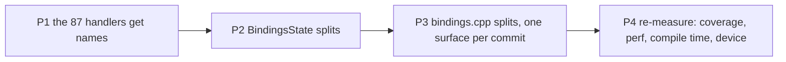

# PRD-230 — the WebGPU bindings move, one surface at a time

**Status:** PROPOSED — filed 2026-08-28. **Blocked on [PRD-229](./PRD-229-the-native-host-is-provable-before-it-is-moved.md)
by design, not by circumstance.** Not one line of this PRD may be implemented until PRD-229's six
phases are green, because every verification step below names an instrument PRD-229 builds.

Second PRD of [the runtime-native refactor batch](./README.md).

**Goal: `src/webgpu/bindings.cpp` stops being one 7,768-line file with 87 anonymous handlers and a
~100-field state struct — with no behaviour change and no performance regression, proved rather
than asserted.**

**Complexity:** +3 (10+ files) +2 (per-frame state, struct layout, cache behaviour) +2 (touches
the file the active perf lane edits weekly) = **7 → HIGH mode.**

## The problem, measured

At `7b729e2d`, from
[the refactor analysis](../../reports/runtime-native-refactor-analysis-2026-08-28.md):

| Metric | Value |
| --- | ---: |
| `src/webgpu/bindings.cpp` | 7,768 lines |
| Its incremental compile (one TU) | **16 s** (a normal file is 1 s) |
| Handlers named `tnWebgpuHandlerNN` | **87** |
| `BindingsState` fields, one struct | ~100 |
| Commits touching the file in 90 days | 60 |
| Its line coverage (measured 2026-08-28) | **32.14%** |
| Functions over 150 lines in the file | 6 |

The 87 numbered names are an artifact of
[PRD-205](../done/PRD-205-webgpu-bindings-register-from-a-table-and-get-linted.md)'s
lambda-to-static-function extraction and of PRD-222/224's class-table work. The extraction was
right; the numbering was never a design. An agent grepping `GPUQueue.writeBuffer` in this package
finds nothing today.

`BindingsState` is why the file cannot simply be cut into pieces: device handles, swapchain state,
the sRGB presentation bridge, screenshot capture, canvas-2D compositing, eight resource registries
with their id counters, frame-op-stream replay bookkeeping and twelve profiling counters all live
in one struct, so every candidate module needs the whole thing. **Phase 2 is the load-bearing one.**

## Solution

Three behaviour-preserving moves, in an order where each is verifiable on its own, then a
re-measure. **No function body is edited in this PRD.** Renames change identifiers; splits move
whole functions. A change that needs to alter logic is out of scope and gets its own PRD.

**Key decisions:**

- **Purity is asserted mechanically, not promised.** Phase 1 passes only if `git diff -w
  --word-diff` shows identifier changes and nothing else. Phase 3 passes only if the diff reads as
  moves.
- **`render.p50` within 2% of PRD-229's recorded baseline**, and no `TN_HOST_GAP` sub-phase shifting
  its share by more than 2 points. Desktop fps is not a gate — the Xvfb present throttle pins it.
- **One surface per commit in Phase 3**, each with its own checkpoint, so a regression is bisectable
  to one surface rather than to a 7,768-line rewrite.

**Data changes:** none. No field is added, removed, renamed in meaning, or given a different
default; no public API, wire format or JS-visible shape changes.

## Integration Ledger

| # | New thing | Live caller (`file:line`, non-test) | Replaces | Old path removed? | Negative control |
|---|---|---|---|---|---|
| 1 | Renamed handler symbols (87) | `installWebGPUBindingTables` registration rows | `tnWebgpuHandlerNN` | yes, same commit | `git diff -w --word-diff` shows identifier changes only |
| 2 | `BindingsState` sub-structs | every `bindings.cpp` accessor | the flat ~100-field struct | yes, same commit | the compiler, plus PRD-229 Phase 5's behaviour tests |
| 3 | Per-surface `bindings_*.cpp` TUs | `CMakeLists.txt` `target_sources` | monolith sections | yes, per surface | per-surface behaviour tests stay green; single-TU compile time drops |

### Reachability

Every symbol here is already reached — this PRD moves code that the frame loop calls on every
frame. The wiring question is inverted: the risk is not dead code, it is a *live* path changing
behaviour while the suite stays green. That is what PRD-229 exists to prevent, and why this PRD
cannot start before it.

## Execution phases

Every phase: at least one pre-existing file edited, one automated checkpoint
(`prd-work-reviewer`) before the next starts.

---

#### Phase 1: The 87 handlers get their names back

**Only starts when PRD-229 is green.** Every phase here is a behaviour-preserving move under the
instruments PRD-229 built.

**Files:** `src/webgpu/bindings.cpp` (EDIT), the record. One commit.

**Implementation:**
- [ ] Each `tnWebgpuHandlerNN` takes the name of the surface and method its registration row already
      declares — `handleGpuQueueWriteBuffer`, `handleHtmlCanvasElementGetContext`, and so on. The
      mapping is derivable from the `bindingTable({…})` row that references it.
- [ ] `readability-identifier-naming` from PRD-229 Phase 4 keeps the new convention.

**Verification (mechanical — this is the point of the phase):**
- [ ] `git diff -w --word-diff` contains **identifier changes only** — no reordered, added or
      removed statements. Pasted into the record.
- [ ] Every PRD-229 Phase 5 behaviour test green; `ctest` green; ASan lane green.
- [ ] Coverage unchanged within noise. A rename cannot change coverage; a drop means something else
      moved.

**Revert check:** the phase changes no behaviour, and that is asserted rather than assumed — the
identifier-only diff check above is the assertion.

---

#### Phase 2: `BindingsState` becomes cohesive sub-structs

**Files:** `src/webgpu/bindings_state.h` (EDIT), `src/webgpu/bindings.cpp` (EDIT),
`src/webgpu/registration_table.cpp` / `wrapper_factories.cpp` (EDIT as needed), the record.
One commit.

**Implementation:**
- [ ] Group the ~100 fields into `ResourceRegistries`, `PresentationState`, `FrameProfiling`,
      `ScreenshotCapture`, `Canvas2DComposite`; device and engine handles stay at the top level.
- [ ] Access becomes `state->registries.textureRegistry`. The compiler finds every site.
- [ ] `#if TN_ANDROID_JS_PROFILE` members move inside `FrameProfiling`, so the struct's conditional
      shape stops leaking into the top level.
- [ ] **No field is added, removed, renamed in meaning, or given a different default.** Field
      *placement* changes; field *identity* does not.

**Verification:** PRD-229 Phase 5 behaviour tests, `ctest`, ASan lane, coverage floors, and the perf A/B
against the PRD-229 Phase 6 baseline. Struct layout affects cache behaviour, so the A/B is **mandatory
here**, not optional.

**Revert check:** the PRD-229 Phase 5 tests cover every property the state struct serves; reverting the
split leaves them green (it is a pure refactor) while a *wrong* split reds them.

---

#### Phase 3: `bindings.cpp` splits, one surface per commit

**Not one phase — one commit per surface, each with its own checkpoint.** Ordered so the most
independent surfaces move first and the most churned move last:

1. `bindings_canvas2d_composite.cpp` — the 325-line compositor, most self-contained
2. `bindings_screenshot.cpp`
3. `bindings_presentation.cpp` — surface acquire, sRGB bridge, present
4. `bindings_resources.cpp` — buffer/texture/view/sampler creation and registries
5. `bindings_pipelines.cpp` — shader modules, pipelines, bind groups
6. `bindings_commands.cpp` — encoder, render and compute passes
7. `bindings_frame_stream.cpp` — packed replay
8. `bindings.cpp` — what remains: install tables, device/adapter, state lifecycle

**Files per commit:** the new TU, `bindings.cpp`, `CMakeLists.txt` (`target_sources`), the record.

**Implementation per commit:**
- [ ] Functions move **verbatim**. If a body must change to compile, the change is a shared header
      declaration or a namespace qualification — never logic.
- [ ] The diff is reviewed as move-only: `git diff -M --stat` should show moves dominating.

**Verification per commit:** `ctest`, ASan lane, PRD-229 Phase 5 behaviour tests, coverage floors, the perf
A/B — and the payoff measurement: **single-TU compile time, recorded per commit**, starting from the
measured 16 s.

**Revert check:** each surface's behaviour tests exist before its move (PRD-229 Phase 5 ordered them that
way); reverting a move leaves them green, breaking a move reds them.

---

#### Phase 4: Re-measure, and say what did not run

**Files:** `docs/verification/native-coverage-*.md` (EDIT), `runtime-perf-state.md` (EDIT),
`native-runtime-census-2026-08-16.md` (EDIT via `pnpm census` — generated, never retyped), this
PRD's evidence section.

- [ ] Coverage after vs before, per subsystem.
- [ ] `render.p50` and `TN_HOST_GAP` shares after vs before, same command, same machine.
- [ ] Single-TU compile times after vs before.
- [ ] **Device lane**: a Pixel 8 run is the only thing that can speak to fps. If no device run
      happens, this PRD records **"no device result claimed"** and stays open on that row rather
      than closing on desktop evidence.

## Acceptance criteria

Consumer-scoped.

- [ ] **An agent grepping `GPUQueue.writeBuffer` in `packages/runtime-native/src` finds the handler
      that implements it.** (Phase 1)
- [ ] **A developer editing one WebGPU surface rebuilds one TU, not 7,768 lines** — compile time
      recorded per surface, against the measured 16 s. (Phase 3)
- [ ] **`render.p50` after the last split is within 2% of PRD-229's recorded pre-refactor
      baseline**, and no `TN_HOST_GAP` sub-phase moved more than 2 points of share. (Phases 2–4)
- [ ] **`pnpm parity` reports the same conformance rows green as before the batch**, with no row
      newly blocked. (Every phase)
- [ ] **Native line coverage did not drop** — the PRD-229 floors hold at every phase. (Every phase)
- [ ] **The ASan lane is green at every phase**, so no move introduced a lifetime bug that exit
      codes would have hidden. (Every phase)

**Integration gates (unchecked = not done):**

- [ ] Integration Ledger has zero `TBD` cells
- [ ] Revert check passed per phase
- [ ] Every gate observed red at least once, with the mutation named
- [ ] `pnpm census` regenerated in the commit that changes native line counts
- [ ] No vitest file still asserts on the source text of a file this PRD moved

## Risks, and what makes this PRD fail

| Risk | Mitigation |
| --- | --- |
| **The tree is under active perf work** — 60 commits in 90 days on this file, 23 on `bindings_state.h`. A wide mechanical diff rots in hours. | Each phase lands as a single commit in one sitting, on a day the perf lane is paused. Coordinate with PRD-227/228 before starting. |
| **A "pure refactor" that is not pure.** | Phase 1's identifier-only diff check; Phase 3's move-only diff review; behaviour tests exist before each move, never after. |
| **Struct-layout perf regression in Phase 2.** | Mandatory perf A/B at that phase; 2% budget; revert rather than explain. |
| **A surface split that quietly changes initialization order.** | One surface per commit, each with the full gate set, so the regression is bisectable to one move. |
| **Starting before PRD-229 is green.** | This is the failure mode the batch exists to prevent. A phase started early has no instrument and its green means nothing. |

## Verification evidence

Filled during implementation. Nothing is claimed until it has executed and been pasted.

### Phases 1–4
- NOT RUN
