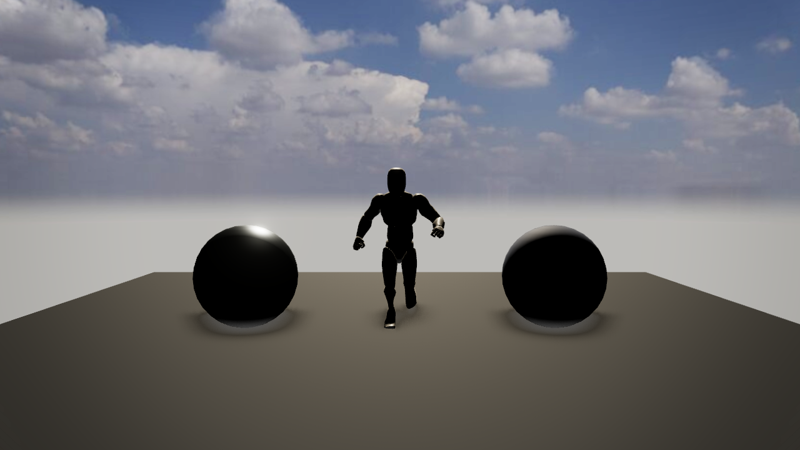
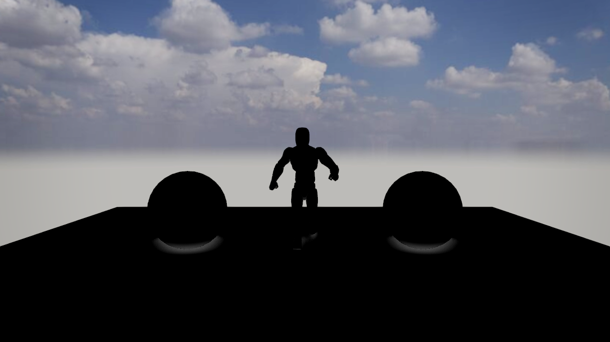
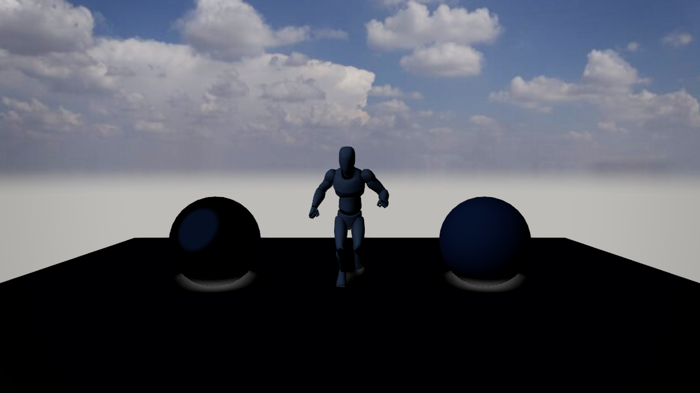
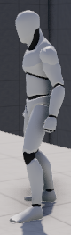
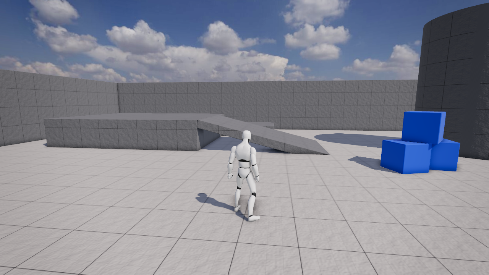

# PRD-345 — a backlit subject is not a hole in the sky

**Status:** PARTIAL — generated material defaults integrated across conventional templates; twelve final matched web desktop pairs are palette-stable, including corrected racing. A controller-owned shared render graph removes the shooter's per-material-graph performance regression in the isolated causal study (`docs/benchmark/prd345/shooter-causes1/`); integrated gameplay/performance re-qualification, all-template/full-root/native appearance and rain admission remain open. Originally filed 2026-09-03, measured at `43d03e6a`. Batch:
[docs/PRDs/AAA-visuals](aaa-visuals-notes.md). **Ships as generated user source, not as a package** — it
decides how things look, and rule 1(b) vetoes 1(a) at any size. Source studied:
[TheLongSilence](https://github.com/achimala/TheLongSilence) `src/gfx/greeble.js:37`, the
`HULL_LIGHT` block and its environment note.

**Priority:** P2 — Open boxes apply the convention to starter source and required templates, then native qualification.
**Goal: the templates stop shipping two lighting failures that every game built from them
inherits** — a backlit subject that collapses to a flat silhouette, and an environment map so dark
that image-based lighting silently contributes nothing and every surface reads as painted clay.

**Complexity:** two material additions and one report, in ten template `src/render/` folders =
**LOW-MEDIUM**. The work is breadth and the `AGENTS.md` rows, not depth.

## The problem, measured at `43d03e6a`

### 1. `MeshStandardMaterial` has no grazing term in its diffuse lobe

So a subject lit from behind returns very nearly zero across its whole facing side, however bright
the key is, and reads as a hole cut in the background. A real backlit object never does that: light
wraps the limb and scatters off the dust and the paint at the edge. The reference calls this "the
difference between a spacecraft and a hole in the starfield" and fixes it with one Fresnel lobe
gated on how far behind the subject the key is — a dot product and a power, costing nothing.

Backlight is not an exotic setup. It is a sunset, a doorway, a headlight, a fire behind a character:
the shots a game is screenshotted in.

### 2. A dark environment makes IBL return zero, and nothing says so

`scene.environment` set to a near-black generated sky — which is what a night scene, a space scene or
an interior produces — makes three's IBL path return zero however high `envMapIntensity` is set.
Every material then falls back on its diffuse term alone and the whole game reads flat and chalky.
The failure is silent: the code is correct, the map is present, the intensity is set, and the image
is wrong. This is the same family as the TSL post stages that silently no-op, already recorded here.

The templates' `worldEnvironment.ts` sets an environment; nothing measures whether it contributes.

### 3. This is look, so it ships as source

A grazing wrap term and an ambient fill decide how every surface in the game appears. Rule 1(b) is
unambiguous: generated source in `src/render/`, at any size, with a named override on the same object
and honest reporting when overridden.

## What ships

### `src/render/lighting.ts` in every template, as generated source

- **A grazing wrap term**, added to the templates' shared material setup: one Fresnel lobe, gated on
  the key light being behind the subject, tinted by the key. Off by default is *not* the shape —
  conventions ship on, with a named override (`rimGain: 0`) on the same object.
- **An analytic ambient floor** for when the environment is dark: the game names its two dominant
  sources — a key direction with a colour, and a fill direction with a colour and an angular size —
  and the material adds a cheap analytic term from them. The reference's insight is that this is not
  an approximation of a degenerate sky, it *is* that sky: one disc plus a void, costing a reflect
  and two dot products. A generated template's sky is exactly as analytic.
- **Defaults that are a dim cool ambient rather than nothing**, so a subject has something to catch
  before the game writes its own values.

### The report — `TN_ENVIRONMENT_CONTRIBUTION`

Printed by the templates' `worldEnvironment.ts`: the mean radiance of the environment map actually
in use, and whether IBL is therefore contributing. A near-zero value prints the reason and names the
analytic fill as the thing carrying the ambient instead. **Turning the convention off must not turn
its measurement off** — `rimGain: 0` still reports.

### `AGENTS.md` rows

Both conventions get a row in each template's `AGENTS.md`, and the override name goes beside them. A
convention missing from the templates' `AGENTS.md` does not exist. Note the word budget lives in the
instruction-budget vitest spec, not in `pnpm budgets` — check it before adding prose.

## What does not ship

- Nothing in `packages/`. Not a helper, not a shared constant, not a "rim" utility. The moment a
  package owns a lighting term the framework owns the look.
- No area lights, no clustered lighting, no IBL replacement.

## Implementation phases (2026-10-03 qualification)

Current starter source deliberately uses one sun plus photographed IBL, without an ambient or
hemisphere stacked over it. Some other templates already have explicit rim/fill lights. This
work must qualify the material convention against that actual source and each template's palette,
not substitute the historical four-light description for current code. Tracker G09 is row 13,
P1, PRD-345. The workbook remains unchanged.

### Phase 1 — isolated material and measurement qualification

- [x] Implement bounded game-owned grazing/backlight and directional analytic-fill terms with explicit `rimGain`/fill overrides, preserving original emissive and material maps. proof: retained `docs/verification/prd345/qualification.json`, CPU fidelity/live-control checks, real WebGPU positive/zero controls; generated defaults remain separately open
- [x] Measure the environment actually in use and report contribution even with overrides zero; unsupported measurement must report unknown, never invent a mean or infer black from an unreadable image. proof: real 4096×2048 sky GPU estimate 0.547838 versus full-source oracle 0.547144; near-black/override marker controls and `docs/verification/prd345/actual-starter-proof.json.gz`; unsupported/timeouts fail closed

### Phase 2 — admit measured generated defaults

- [ ] Apply only qualified conventions to the actual starter/material source and all required templates, preserving per-template appearance, low/mobile/software fallbacks and named overrides. proof: matched per-template screenshots and actual frame/startup cost
  - 2026-10-04: the twelve material templates now build **one controller-owned render graph** (`src/render/backlightControls.ts` owns `validateControls`/`resolveKey`; `backlightMaterial.ts` caches one graph per controls object in a `WeakMap` so every converted material references the same graph) instead of a per-material graph. The isolated 21-launch causal study at the unchanged 1920×1080 / 33 ms limit measured per-material current 46.93 ms (0/6 pass) against shared graph 30.43 ms (3/3 pass), with copy-only (29.37 ms) and material-emissive-only (28.90 ms) controls also passing and runtime-zero/compiled-rim-only controls failing. Evidence: `docs/benchmark/prd345/shooter-causes1/` (raw reports, source identities, PNG hashes). Integrated gameplay/performance re-qualification, the snow threshold and native remain open, so this box stays open.
- [x] Add the concise convention/override rows to generated instructions with mirrors kept in sync. proof: all thirteen template rows, explicit rain exception, primary-docs/instruction-budget seventeen tests and scaffold/doc eighty-three tests pass; unchanged instruction caps

2026-10-05 PR #440 merged-source checkpoint (`develop` 45565868): independent review identified a second-camera layer error, reproduced by a regression test in the shared key callbacks. The callbacks now pass actual `NodeFrame.camera` to key resolution in all twelve material templates and the matching fixture. The existing test failed before the fix and the camera/matrix/lifecycle suite passes 31/31; merged scaffold/compiler contracts pass 101/101 with all thirteen hashes measured through the real generator. The ordinary JS/DTS build passes. Fresh serial hardware NVIDIA Turing WebGPU difficult-lighting captures pass the unchanged decoded-PNG qualifier: enabled edge/body p99 52/2 versus zero-rim 7/0; fill-black fails only the two intended tone assertions, and omitted reporting fails the marker verifier. Actual camera world/inverse/projection matrices are now recorded. Local evidence is retained at `artifacts/pr440-acceptance/`; images remain unpublished pending the user's sharing decision. Failed startup wrappers and one unobserved black-fill launch remain retained beside its observed retry. This verifies the corrected graph's isolated controls; integrated template gameplay/performance, repeated startup and native admission remain open.

2026-10-05 integrated checkpoint: all six fresh unchanged 33 ms runs are **RED**: shooter p95 112.9/144.5/88.9 ms, snow 59.8/48.6/51.8 ms; one shooter also fails minimum FPS. Host/resource and source differences prevent code-causality attribution. Typecheck/lint/docs/budgets and 35 latest-base CPU contracts pass. Full root/all-template/startup/native qualification remains open. See [merged-source acceptance and retained report seals](../../verification/prd345/pr440-acceptance-2026-10-05.md). No further timing is admitted until a comparable window is available.

### Phase 3 — clean starter and platform validation

- [ ] Verify generated clean starters/simple scenes and template visual gates including dark environment/no-sun and backlit character controls. proof: `pnpm test:templates`, tone crops and red-green captures
- [ ] Complete required root and native qualification without claiming unexecuted targets. proof: `pnpm typecheck && pnpm lint && pnpm test` and targeted native fixture
  - 2026-10-04 interim, open: typecheck and lint pass. `pnpm test` stops in runtime-native (21 reds, native host binaries not built here). Root vitest 8007 pass, 4 red under load 35-50: template typecheck passes in isolation, `generated-shooter-input.spec.ts` red twice and not yet attributed.

## Qualification design

The initial scope is isolated generated Three.js source and fixtures. No engine look helper,
core composer, dependency/Three patch, scaffold generator or exposure source changes are admitted.
`MeshStandardNodeMaterial` is the upstream portable TSL counterpart of the current standard
material: use its existing PBR/normal/maps and preserve `materialEmissive`. WebGPU does not offer
`onBeforeCompile` as a portable way to augment a standard material, so a WebGL-only shader string
patch is excluded. Conversion and material identity/animation must be checked, especially for
the starter mannequin's skinned material, before integration.

The proposed grazing term uses the view/normal Fresnel edge with a gate for the key behind the
subject, tinted by the authored key. It must not brighten a front-lit face, discard the original
emissive, or make all orientations equally bright. The analytic fill uses game-authored key/fill directions, colours and fill angular size,
with a roughness-aware reflected response as well as directional diffuse. Its black-colour
override is named alongside gain. This is needed for the metallic mannequin as well as the
dielectric props. Use live key uniforms so moving/removing the key removes its contribution.
The analytic fill is directional and low gain;
its black override must remove the effect while keeping the measured report. Bright photographed
IBL is the existing baseline, so stacking a fill that flattens it is a rejection condition.

The report requires actual linear-radiance samples of `scene.environment`, including active
intensity and texture color space. A hard-coded asset mean, requested exposure, an unreadable
HTML image, or a background mean is not that measurement. First qualify known byte/float
DataTextures deterministically. For arbitrary photographed environments, a small once-at-setup
GPU sample/readback needs explicit capability and startup-cost proof; unsupported platforms
must report unknown and retain the qualified conservative fallback. No native readback/buffer
contract edits are in this lane. The full original reporting criterion stays open until proven. Source mean describes available
scene radiance, not the contribution of every material: explicit material environment maps and
`envMapIntensity` need separate treatment. Missing, measured-dark, measured-bright and unreadable
sources remain distinct. Existing rain/snow authored fill is retained; never stack a generic floor
over it without measurement.

Material qualification includes the actual loaded animated mannequin, not just exported prop
materials. Cache converted supported standard materials to preserve sharing and array slots,
retain upstream skinning/normal/PBR paths, and verify maps/transparency/sidedness/emissive/disposal.
Unsupported physical/custom/basic materials remain intact with honest exclusions.

The CPU path refuses unreadable, unsupported or over-budget textures; the photographed JPEG
remains unknown. Real WebGPU runs now qualify the actual animated starter mannequin at fixed
poses. Regional `assert.tone` adds physical PNG crops and same-image reference comparisons;
legacy whole-frame assertions retain their existing metrics and acquisition path. Native regional
capture remains unimplemented and fails closed. The actual starter integration below is qualified on web desktop WebGPU; all-template/native acceptance remains open.

### Retained visual and red-green proof

All captures use the same character, camera `[0, 1.35, 6]`, content and 1280 × 720 buffer on web
WebGPU, NVIDIA Turing. The fixed end pose is 90 ticks / 1.5 seconds; the rest capture preserves
that pose. Crop coordinates were frozen before assertion captures in the fixture's
`proof-crops.json`. The retained report aliases preserve decoded RGBA hashes and identify
byte-identical end/rest images; compressed reports retain their full original fields.

| Control | Before | Enabled |
| --- | --- | --- |
| Backlit character, measured black IBL, authored sun |  |  |
| No sun, measured black IBL |  |  |

Run `node --import tsx packages/create-threenative/__tests__/fixtures/backlight-defaults/qualify.mjs docs/verification/prd345`.
Result: PASS actual decoded-PNG/report agreement and strict scene/camera/pose provenance.
Enabled rim edge/body p99 is 52/2 (margin 50, required 30); zero rim is 7/0 and fails exactly
`tone.0.compare` and `tone.1.compare`. The bounded paired-image `TN_RIM_CONTRIBUTION` report
prints for both arms: available edge uplift 45, body uplift 2, margin uplift 43. This is a fixture
pixel measurement, not a runtime BRDF energy claim. Enabled no-sun fill p1/p99 is 0/43; black
fill is 0/0 and fails exactly the two p99 assertions. The strict serialized
`TN_ENVIRONMENT_CONTRIBUTION` verifier passes the actual zero-radiance map and fails the omitted
marker with `TN_ENVIRONMENT_MARKER_MISSING_OR_DUPLICATE`; measurement survives named overrides.
Full reports and qualification are retained in [the evidence bundle](../../verification/prd345/qualification.json).

Actual engine GPU timestamp windows 3–5 average about 11.36 ms baseline and 12.10 ms enabled
(+0.74 ms / about 6.5%). Each window spans 60 frames with 7–8 fresh timestamp samples. These
cost runs use the initial static pose. Private-display FPS, shader compilation completion,
startup, native/mobile and per-template cost remain unqualified. Initial broad rim was rejected
for floor wash; the retained selective rim gates that response by surface orientation. Front-lit,
bright photographed IBL, dark and missing environment control runs pass their fixture gates.

Use one matched backlit subject/camera/content/resolution for baseline, enabled rim, and
`rimGain: 0`; a second matched dark-environment/no-sun pair for enabled fill and black fill.
Retain silhouette-edge/body crop coordinates before inspecting results. Repeat front-lit/bright
IBL control to reject washout. Record draw/compile/startup and actual GPU timestamp windows,
with existing material cost as baseline. No default is admitted from a metric alone.

### Actual generated starter defaults (first tranche)

`starter/src/render/lighting.ts` now names editable `rimGain: 0.12`, dim cool fill and its black
colour/gain overrides. The authored sun and photographed sky remain intact. Supported standard
materials are converted after the cloned animated character, arena and props attach; maps,
emissive and material sharing remain borrowed. Physical/custom/node materials remain original.
Original assignments restore on quality fallback and exit, including in-place array edits.
The convention is admitted only for high-tier web desktop hardware WebGPU. Native, mobile,
software and WebGL fallback preserve original materials, even when high is pinned. This is generated
editable game source; there is no core engine appearance hook or bare-engine automatic-look claim.

A once-at-load 64×32 GPU estimate reads the actual environment in linear space, with spherical
weights and active intensity. It restores renderer state before awaiting readback, times out after
1000 ms without blocking boot, and defers scratch disposal until pending GPU work settles. Successful
estimates cache weakly by renderer/texture and complete source provenance. Unknown results retry;
changed versions, source image, colour space, mapping or intensity invalidate old admission.
The starter sky is measured bright, so the analytic fill stays **off** rather than washing out its IBL.

Actual clean starters were generated through `createProject`, with identical cooked assets and
explicit local framework dependencies. Existing `camera.main` setup controls placed both arms at
`[-6, 1.45, -2.7]`, looking at `[-2, 1.25, 0]`, without changing lighting or advancing the tick-60
character pose. Camera, player transform, clock, render chain and adapter equality are checked.
The original front-lit opening is nearly unchanged; the photographed IBL makes the backlit change
subtle. These unscaled exact-pixel crops are x600/y285/w80/h263 from each 1280×720 full screenshot:

| Original generated starter | Material convention enabled by default |
| --- | --- |
|  |  |

[Retained measured camera/pose/source/startup proof](../../verification/prd345/actual-starter-proof.json.gz)
names full source PNG hashes. Full before/after frames also remain in the capture artifacts and
Library comparison. WebP crops are lossless and checked against original decoded RGBA. Five
materials convert; the custom finish-flag material is explicitly excluded. Both default views
submit 57 draws / 32,862 triangles. The actual sky estimate agrees with independent full JPEG
spherical-linear decode within 0.13%. Initial standalone sampling took 398.7 ms including first
compilation/readback. Matched single dev runs observed load-to-ready 1945.7 ms before / 2330.2 ms
after; these are observations, not repeatable performance statistics or first-frame acceptance.
[Hardware cached restart](../../verification/prd345/cached-restart.json.gz) reuses the same texture
with **zero additional readbacks** and retains the measured report; `game.goto` returned in 21.6 ms,
which is not a full-readiness timing claim.

Validation: full final clean generated starter TypeScript passes. Lifecycle 28/28, existing quality
40/40, looks 19/19 and primary-docs/instruction-budget 16/16 pass. Independent review caught and
verified repairs for array downshift/recovery edits, stale same-texture updates, live override
reporting, hung readback and actual WebGL-backend fallback. All thirteen scaffold fingerprints were measured by the existing gate after this isolated
extension; combined exposure bytes must be remeasured at merge. Required native execution,
final-head startup/per-frame budgets and complete templates/root gates remain unfinished; this
draft stays partial.

## Bounded startup and plural-template follow-up

The published starter checkpoint `bd5d9d599` has a balanced ABBA series of 80 fresh Chromium
launches, 40 per arm, with no failures and unchanged generated trees. Nearest-rank engine-readiness
p95 is 2664.5 → 2905.6 ms (+241.1 ms, 9.05%); scene-load-to-ready p95 is 2067.9 → 2289.6 ms.
Medians are 2548.55 → 2743.75 ms. This is an empirical fresh-process comparison: page/HTTP caches
are fresh, while OS and driver shader caches are uncontrolled. It proves no shader-cold or
compile-completion claim. The dynamic-enrollment/template extension requires its own final-head
qualification; these results describe the named published checkpoint only.
[Summary](../../benchmark/prd345/startup-p95-bd5d9d599/summary.json),
[all samples](../../benchmark/prd345/startup-p95-bd5d9d599/samples.json.gz), and
[frozen source manifests](../../benchmark/prd345/startup-p95-bd5d9d599/frozen-trees.json.gz)
retain every attempted launch and measured timeline.

Minimal now has a matched generated-source default-camera pair at 1280×720, hardware NVIDIA Turing
WebGPU, identical fixed clock/camera/backend/MSAA and cooked assets. Both source builds and
captures pass. Five standard materials are converted; actual bright photo IBL suppresses extra
fill. Pixel inspection retains the original sunny palette and avoids a floor wash; the effect in
this front-lit opening is subtle. The original difficult-backlight controls above remain the
isolated visible improvement proof.

| Minimal default opening | Before | After |
| --- | --- | --- |
| Matched generated source |  |  |

Eleven actual generated template pairs now pass strict matched readiness captures and retain
their authored palettes: minimal, starter, platformer, runner, shooter, snow, action-RPG, RTS,
tower-defense, puzzle and sailing. The full unscaled PNG pairs and complete source/runtime
manifests are [retained here](../../benchmark/prd345/template-matrix/README.md). Earlier
worker/WASM/readiness failures remain retained beside successful fresh retries; doctor results
were not treated as acceptance. Fixed gameplay clock does not fix wall-time flag/smoke phases,
which are disclosed and not claimed as improvements. Dynamic enrollment covers newly spawned
RTS armies, action-RPG loot, runner chunks and tower/enemy upgrade/recycling; thirty-three
lifecycle tests cover restoration, sharing and owned disposal.

The final runtime checkpoint `dca2d8d4b` now qualifies all twelve conventional matched boot
pairs. Racing controls traced the road/shadow regression to `updateWorldMatrix` inside the
render-time material callback: the identical expression with those two writes removed restores
the original road and shadows. Sampling-only and upstream material-copy controls independently
preserve baseline pixels. Callbacks now read the matrices maintained by the engine/game boundary;
34 focused lifecycle/matrix tests verify that rendering cannot mutate shared light matrices.
[Final full pairs and source/runtime manifests](../../benchmark/prd345/final-template-matrix/README.md)
and [retained rejected candidate and controls](../../benchmark/prd345/racing-regression/README.md)
preserve the causal evidence. Full gameplay acceptance remains distinct from these boot captures.

The current-source final ABBA startup series passes 80/80 launches, 40 per arm, with unchanged
source trees. Ready p95 is 2649.7 → 2831.0 ms (+181.3 ms, 6.84%); medians are 2560.3 → 2760.0 ms.
Scene-load-to-ready p95 is 2036.9 → 2241.7 ms (+204.8 ms). Fresh process/context/page and HTTP
cache are controlled; OS/filesystem and driver shader caches are not. This is not shader-cold,
compile-complete or a precise population-tail estimate.
[Summary and complete retained samples](../../benchmark/prd345/startup-p95-dca2d8d4b/summary.json).

Current-source difficult-lighting fixture qualification passes all six intended positive/negative
arms on NVIDIA Turing hardware WebGPU. Edge p99 is 53 with rim versus 7 without; body p99 is 2
versus 0. Zero-rim and black-fill controls fail only their intended tone assertions; omitted
report fails exactly the marker assertion. [Full frames and raw qualification](../../benchmark/prd345/final-fixture/README.md).
Actual GPU timestamp windows 3–5 measure dark fill 11.0467 → 11.7467 ms (+0.700 ms, 6.34%).
Backlit 11.6033 → 11.2267 ms is a noisy negative delta, not a speedup claim. Each arm has only
23 asynchronous timestamp samples across three 60-frame windows in one serial run.
[Raw cost windows](../../benchmark/prd345/final-cost/README.md).

Affected CPU verification passes 65 files / 1011 tests; root typecheck and lint pass. The isolated
native host and V8/QuickJS contract prerequisites build, and actual native unit tests pass
1531 with 62 skipped. None of those results admits native appearance. The initial full-root
attempt retained 21 missing-native-binary failures; the complete root gate must be rerun after
prerequisites and capture jobs finish. All thirteen generated gameplay gates and matched native
conservative-fallback capture are in progress; no unexecuted result is claimed.

The [explicit per-template mechanism map](../../benchmark/prd345/final-template-matrix/mechanisms.md)
distinguishes useful authored illumination from the requested new terms. Puzzle/tower additions
are disabled; runner/snow analytic fill is disabled. Their authored directional rim/hemisphere
sources are not mathematically equivalent to the grazing/disc expressions. This is an open
qualification requirement, not an automatic exception or a reason to stack duplicate ambient.
Isolated replacement candidates are not admitted defaults until actual behavior, palette and
performance proof passes.

Rain is a custom raymarched shader with authored flash rim/hemisphere fill and cloud render-target
reflections. Ordinary standard-material conversion does not apply; its cloud radiance remains
unknown until separately sampled. Its explicit instruction exception is not blanket all-template
acceptance. Native retains original materials and no GPU sampling; native appearance admission
remains unqualified. Bare-engine automatic material treatment is not claimed: the repository's
source-first architecture requires an explicit coherent policy change before package hooks.

## Acceptance criteria

- [x] **A backlit subject has a lit limb.** A playtest scenario poses a template's character between proof: `docs/verification/prd345/qualification.json; actual starter mannequin: edge-enabled-acceptance1 passes, edge-rim-zero-acceptance1 fails only tone margin; paired TN_RIM pixel uplift reported for both arms`
   the camera and the key light; `assert.tone` (PRD-341) over a crop of the silhouette edge asserts
   a p99 above the body's p99 by a stated margin.
   *Red-green:* set `rimGain: 0` in the scenario's setup; the same assertion fails, and the run still
   prints the measured rim contribution — the proof that measurement survives the override. Paste
   both.
- [x] **A dark environment is reported, not hidden.** A scenario with a near-black environment asserts proof: `docs/verification/prd345/qualification.json; marker positive passes; omitted marker fails exactly TN_ENVIRONMENT_MARKER_MISSING_OR_DUPLICATE; near-black DataTexture reports actual source mean0`
   `TN_ENVIRONMENT_CONTRIBUTION` names IBL as non-contributing and names the analytic fill.
   *Red-green:* delete the report; the marker assertion goes red.
- [x] **The scene is not flat without a sun.** The same scenario with the key light removed asserts, proof: `docs/verification/prd345/qualification.json; fill-enabled-acceptance1 passes p1/p99 range, fill-fill-black-acceptance1 fails exactly body p99 at0; key absent in both`
   via `assert.tone`, that `p1` and `p99` remain separated — a scene lit only by the fill still has
   range.
   *Red-green:* set the analytic fill to black; the range assertion goes red.
- [x] **Every template has both, and says so.** `scripts/__tests__/primary-docs.spec.ts` and the proof: `primary-docs and generated convention rows; 2026-10-04 primary-docs.spec.ts + instruction-budget.spec.ts 17/17 pass, spec asserts rimGain and fillGain in all 13 template AGENTS.md (rain included, custom shader exception stated)`
   templates' own gate assert each template's `AGENTS.md` names both conventions and both override
   names.
- [ ] **The templates gate is green on the templates that currently pass it.** Note the known red lane: proof: `complete template gate with explicit lane outcomes`
   the templates gate aborts at the first failing template, so the shooter's deterministic capture
   red will hide everything after it. Fix or skip past it deliberately and say which — never report
   a template as passing because the gate stopped before reaching it.

## Out of scope

Anything in `packages/`, and any change to the tonemapper — PRD-339 and PRD-343 own exposure and the
white point.

## Decisions

- 2026-10-09 (João, via the Unreal source review): Unreal treats a backlit subject from the exposure
  side as well. It meters a 64-bin luminance histogram and ignores the darkest 10% and brightest 10%
  (`UE 5.8.3: Engine/Source/Runtime/Engine/Private/Scene.cpp:494-496`,
  `Engine/Shaders/Private/PostProcessHistogramCommon.ush:89-90`). It also ships a bilateral-grid
  local exposure that can lift a dark subject against a bright sky without flattening the sky. That
  feature is neutral by default: both contrast scales are 1.0, and a project opts in by lowering
  them (`Scene.cpp:525-534`, `Engine/Source/Runtime/Engine/Private/SceneView.cpp:210-218`,
  `Engine/Shaders/Private/PostProcessLocalExposure.usf`). Neither enters
  this PRD: this PRD's scope is the material terms, and "Out of scope" above hands exposure to
  PRD-339. PRD-339 is done with mean metering, and it defers a histogram to "a separate PRD"
  (`done/PRD-339-the-frame-sets-its-own-exposure.md:106-107`). The Unreal evidence goes to that
  separate PRD. No box here changes.

Historical GPU evidence limitation: lease ownership is scoped to process TMPDIR; durable-temp runs used private namespaces and manual own-job serialization. Shared global exclusion was not established. See benchmark PRD-345 capture coordination notes; future timing uses an explicit outer shared lease. Original acceptance remains partial.
