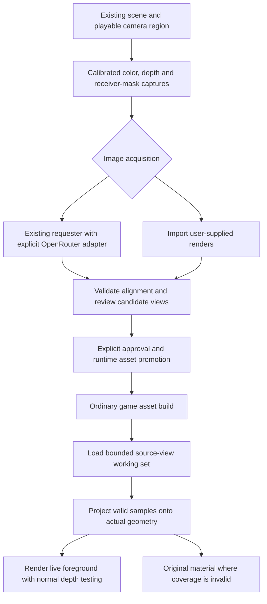

# PRD — AI View-Projected Environments

**Status:** NOT STARTED — experimental proposal; implementation and runtime validation have not begun.  
**Priority:** P3 — NOT STARTED and called experimental; capture contract and projective rendering are unrun specs.
**Date:** 2026-09-28  
**Repository:** `ThreeNativeHQ/threenative`  
**Intended path:** `docs/PRDs/authoring/PRD-ai-view-projected-environments.md`  
**Inspected baseline:** `develop` at `9ca18502207f107a83ca4acf6d44f7d30386aeee`  
**Delivery:** one draft PR targeting `develop`; retain this PR for implementation.  
**Scope:** generated authoring workflow and game-owned rendering source, not a new renderer or Studio feature.

## 1. Outcome

An agent takes an existing static ThreeNative scene, captures it from calibrated viewpoints, obtains realistic image-to-image renders through OpenRouter or imports user-supplied renders, and projects approved images back onto the original geometry. During play, the game selects valid source views using the player's camera position and orientation. Geometry, collision, navigation, foreground objects, and controls remain real and interactive.

**Generate during authoring; render ordinary assets during gameplay.** The finished game requires neither an AI subscription nor an API key. It must not request a new image when the player moves.

The inspiration is the user's description accompanying [the referenced X post](https://x.com/alexfredo87/status/2104637416791212493). The post could not be independently inspected because X returned HTTP 403. This PRD specifies the supplied idea, not a verified reconstruction of that author's implementation.

The first result is a small, walkable ruined concourse or room: original geometry, projected appearance, and coverage diagnostics can be compared from the same camera. It is deliberately not an arbitrary open-world reconstruction promise.

## 2. Codebase findings and reuse

These are static inspection findings at the baseline above, not test results.

| Existing surface | Observed behavior | Consequence for this PRD |
| --- | --- | --- |
| `packages/create-threenative/agent-files/scripts/reference.mjs` | Already calls OpenRouter chat completions, accepts one local `--reference`, checks advertised image capabilities, and records requests and output hashes. | Extend this requester rather than introducing an engine AI SDK or another provider stack. [R1] |
| The same requester | Environment-only API key; exclusive run lock; deadlines/request limits; atomic outputs; pending/completed/unknown/failed receipts; no blind retry; inline raster results. | Preserve the safety model and serialize requests within a run. Add multi-view identity and current API contracts. [R1] |
| `packages/create-threenative/__tests__/reference.spec.ts` | Uses a local HTTP fixture with canned capability and image-response shapes. | Existing fixtures are useful regression coverage, but do not establish live-provider compatibility. [R2] |
| `agent-docs/references/dream-loop.md` and PRD-371 | Target-driven authoring, actual-game captures, bounded iterations, and independent visual review. Generated targets stay out of runtime builds. | Keep reference targets separate. Introduce an explicit promotion operation for approved projection assets, without changing ordinary Dream Loop behavior. [R3] |
| `packages/core/src/renderer.ts` | `IRendererLike` exposes rendering, output graphs, compilation, telemetry, and storage-buffer readback. The inspected interface does not expose calibrated color/depth image capture. | Resolve capture through existing facilities first. A genuinely missing portable renderer seam is core work, not a game-side cast through private backends. [R4] |
| `packages/core/src/gpu-readback.ts` | Throttled GPU **storage-buffer** readback with sample age. | This is not a ready-made color/depth render-target exporter. [R5] |
| `packages/core/src/geometry-capture.ts` | Per-object geometry submission/cost inspection. | Useful for measuring the demo; it does not capture geometry-aligned images. [R6] |
| `packages/playtest/src/capture.ts`; playtest runner | PNG/non-blank checks and an existing scenario runner for browser and native targets. | Reuse visual guards, actual-input scenarios, and native execution; do not build another test harness. [R7] [R13] |
| `packages/create-threenative/src/index.ts` | Canonical files under `template-assets/` and generated game render source under `src/render/`. | Projection appearance remains editable generated source, not a core material preset. [R8] |

**Answer to the OpenRouter question:** authoring support exists. Multi-view asset acquisition, calibration, promotion, and runtime projection are new work relative to the inspected workflow. Repository code search returned incomplete results; the implementation must still query the capability manifest and inspect every relevant hit before adding code.

### Compatibility work, not an assumed provider rewrite

The existing requester uses `/api/v1/chat/completions`, a single reference, `modalities: ["image"]`, and a particular capability-response parser. Current OpenRouter documentation also describes a dedicated Image API with `/api/v1/images`, image-model discovery, endpoint-specific capabilities, `input_references`, and results containing `b64_json` plus `media_type`. These are different contracts. This does **not** prove the existing chat route is discontinued. [R1] [R10]

Add an explicitly selected, contract-tested Image API adapter to the existing authoring requester. Preserve the existing chat route for its callers; never switch routes after an ambiguous paid request. The projection recipe must explicitly select and qualify its route/model. Do not equate the user's name “Astra” with an OpenRouter model slug or assume the current hard-coded candidate is available.

Two concrete hardening requirements follow from the current code: completed-request reuse must occur before credential/deadline/new-request-budget gates, and reuse must compare the complete request fingerprint, not just a request ID and the saved output hash. The present ordering can reject a cached artifact when the request allowance is exhausted. [R1]

## 3. Boundaries and first-release scope

The first release supports opaque, static projection receivers in one bounded environment, perspective source cameras, and a declared walkable camera region. Seed the demonstration with six captures spanning at least three translated camera positions and different headings. Six is a fixture choice, not an engine-wide view-count rule. An authoring coverage report recommends extra views but cannot spend beyond the authorized allowance.

Moving characters, weapons, doors, particles, and interactive props remain conventionally rendered. Transparent, reflective, refractive, skinned, and deforming receivers are excluded initially. They may still appear as live objects. Collision and navigation always use geometry, never image interpretation.

The MVP must work with local imported images and deterministic synthetic fixtures without credentials. Live AI image quality is qualified separately using an explicitly authorized provider run. A preapproved, redistributable image set makes the installed demonstration usable without paid calls.

Browser WebGPU and **one named native desktop platform** are the initial feature-proof targets. This does not establish all-desktop or mobile support. Android, iOS, other desktop systems, and any WebGL fallback must report their actual qualification status. Changes to shared platform mechanisms must additionally pass the repository's applicable native conformance requirements.

Out of scope: live generative rendering; NeRF or Gaussian-splat training; inferred replacement geometry; destructible baked receivers; relighting baked illumination; seamless unlimited locomotion; VR/stereo qualification; automatic commercial-rights certification; a new Studio editor; a new engine scene format or package.

## 4. Authoring and runtime flow

The agent names eligible scene objects and the intended player region. The capture step records a frozen static-scene revision and calibrated views. The acquisition step sends only the selected captures and prompt, or accepts local outputs associated with those captures. The author reviews alignment and shared appearance before promotion.

The generated player loads only promoted assets. It selects candidate views for visible receiver regions, projects them per fragment, and renders live objects normally. Debug controls expose original, projected, selected-source, and invalid-coverage views. The player can translate, turn, open the live door, and move outside the supported region; it never becomes a slideshow.

## 5. Functional requirements

### Capture and image registration

**FR-1 — Frozen calibration.** Capture color, positive camera-space depth, and a receiver mask from the same geometry revision and source camera. Record the actual projection/view matrices, viewport dimensions, near/far values, pixel origin, and depth convention. Update transforms before capture; remove projection feedback, HUD, camera jitter, exposure adaptation, temporal-history artifacts, and moving subjects from source captures. Static non-receiver occluders still participate in visibility.

Store depth in metres as `-viewPosition.z` for the declared camera convention, with zero reserved for invalid pixels. A raw little-endian Float32 depth plane plus explicit dimensions is acceptable asset-local data. Read it without color conversion or interpolating across discontinuities. Do not interchange nonlinear device depth and linear camera depth. An implementation choosing another existing portable representation must document and test equivalent decoding.

**FR-2 — Preserve geometry in generation.** Prompts request the same camera, framing, major edges, openings, and object layout, changing appearance rather than structure. Each request contains that view's actual capture. Optional shared style/reference images are sent only when the selected endpoint supports their count. A depth/normal image is not guaranteed structural conditioning merely because a model accepts image inputs.

Require decoded raster dimensions. Same-aspect resampling is allowed only with a recorded transform applied consistently to color, masks, and calibration. Reject uncalibrated crops, aspect changes, rotations, and perspective edits. Overlay source edges for review. A generated door moved relative to the mesh must be rejected or locally masked out. Original-scene depth cannot repair hallucinated geometry in the generated image.

### OpenRouter, limits, and resumption

**FR-3 — Reuse the requester.** Preserve the original CLI's behavior for existing calls; add narrow opt-in adapter/parameter support and repeatable references rather than a generic agent framework. Capability checks cover image input/output, supported output settings, allowed reference count, and the selected provider route. Unsupported requirements stop before dispatch. Model substitution and provider fallback require explicit policy; the projection recipe disables silent fallback.

**FR-4 — Bound acquisition.** Reuse the run's request ledger and exclusive lock. Reserve an attempt before dispatch. Apply a wall-clock deadline, maximum image requests, payload/decoded-pixel limits, and an optional monetary ceiling. An unknown charge is never recorded as zero. If a reliable upper bound is unavailable, refuse a strict monetary-cap claim and require an explicit request-count allowance instead. Transport cancellation or ambiguous completion never causes an automatic paid retry.

Request identity binds scene/capture hashes, ordered references, prompt, model, route, dimensions/settings, and schema version. A changed input requires a new revision/identity. Completed byte-verified results can be reused offline after the allowance or deadline expires. Pending/unknown requests stay non-replayable until resolved explicitly. Revisions never overwrite approved outputs. No automatic API call runs during scaffold, build, test, or gameplay.

**FR-5 — Local import and promotion.** Associate imported files with capture IDs and validate them identically to provider results. Keep source captures, target images, prompts, and receipts in authoring storage. Approval explicitly selects which immutable candidates become runtime assets. Publish only those images, depth/masks, essential calibration, and sanitized provenance into the game asset directory. Do not package the entire authoring run. Existing Dream Loop targets remain excluded.

### Projected appearance and valid-view selection

**FR-6 — Geometry-anchored sampling.** For a world-space surface point `X`, compute source clip coordinates `q = P_source * V_source * vec4(X, 1)`, then perspective-divide and apply the recorded pixel/UV convention. Reject nonpositive clip `w`, out-of-frustum coordinates, invalid receiver pixels, and back/grazing-facing surfaces. Accept a source sample only when the point's source-camera depth agrees with the captured depth within a documented precision/footprint tolerance.

The selected camera's pose never becomes the live camera's pose. A projection texture must stick to its surface while the player translates. Reuse ordinary scene depth writing/testing so live objects occlude the environment correctly. Do not project an image through the front of a wall onto a hidden wall behind it.

**FR-7 — Stable selection.** Rank source candidates using camera position, viewing direction, region visibility, source coverage, and projected texel footprint; do not select by yaw alone. Select at most two source views per receiver region/fragment in the initial implementation. Apply validity tests before blending, and renormalize only valid contributors. Use hysteresis for candidate changes without retaining an invalid sample. Choose hysteresis from measured footprint/pose change with an explicit author override rather than one universal angle.

Blend only source pairs approved as sufficiently registered. Prefer a single source or original-material fallback over ghosting between inconsistent renders. Candidate transitions must respect the two-source sampling cap; an old pair plus a new pair is not an implicit four-source mode. Smooth invalid-coverage boundaries only within safe mask interiors.

**FR-8 — Safe fallback and invalidation.** An uncovered fragment uses the original appearance path. Missing, corrupted, unapproved, stale, or unsupported assets must not make geometry invisible. Scene/capture compatibility is checked at build/load; changes to receiver geometry, transforms, eligible set, or capture settings invalidate the relevant set. Avoid hashing an entire scene every frame. Moving a receiver requires explicit invalidation or opting it out; a silently stretched stale projection is not accepted behavior.

### Appearance, packaging, and security

**FR-9 — Prelit color is not albedo.** The generated image already contains lighting. Use an explicitly prelit appearance branch, not an unqualified PBR base-color replacement that lights it a second time. Convert color images from their declared color space, blend in linear space, and keep depth/masks non-color data. The sample uses fixed exposure and a controlled game-owned output chain to avoid applying a second photographic tone map. Conventional materials remain available for live objects and fallback. [R11] [R12]

No promise is made that a flashlight, changing sun, or explosion relights baked appearance physically. Shadows or fog already present in a render must not be blindly reapplied. More advanced hybrid lighting is a separate scope.

**FR-10 — Bounded resources.** Precompile before interactive play. Load a bounded working set asynchronously; preload the next useful source when budget allows. Account for GPU-decoded bytes, mipmaps, depth, masks, and in-flight replacement—not just compressed file sizes. Never wait for decoding, networking, or GPU readback inside the gameplay frame. Evict unused resources, retain original materials without destroying shared ownership, and dispose owned textures/materials on scene exit. Device-loss restoration reloads promoted assets, not the provider.

**FR-11 — Secrets and provenance.** Keep credentials in the Node authoring environment, never `VITE_*`, client code, native bundles, manifests, URLs, or logs. Send only named image inputs and prompt; require consent before uploading project imagery. Decode bounded raster responses; reject HTML/SVG, malformed images, extreme dimensions, and path/symlink escapes. Do not add arbitrary provider-returned URL downloads. Record supplied licensing/provenance and mark unknown rights honestly; do not claim automatic clearance.

## 6. Architecture and change map

Follow the existing ownership boundary: **appearance is generated game source; unavoidable platform mechanisms belong in core**. [R9]

| Location | Intended change |
| --- | --- |
| `packages/create-threenative/agent-files/scripts/reference.mjs` | Extend the existing requester with explicit API contracts, reference/settings support, request fingerprints, and safe offline reuse. |
| `packages/create-threenative/agent-files/scripts/project-views.mjs` — proposed | Small local authoring coordinator for validated capture records, requester invocation, import, and explicit promotion. Reuse the existing ledger; no new background service or engine CLI vocabulary. |
| `packages/create-threenative/template-assets/viewProjection.ts` — proposed | Canonical optional source copied into a participating game's `src/render/`; implement projective material/selection policy with the repository-pinned Three.js node/TSL APIs. Split only if actual complexity requires it. |
| `packages/create-threenative/agent-docs/references/view-projected-environments.md` — proposed | Agent recipe, quality limits, safe promotion, model qualification, and reproducible sample instructions. Link from existing visual authoring guidance without changing default game appearance. |
| `packages/create-threenative/src/index.ts` and publication/scaffold tests | Package and expose the optional workflow through the existing scaffold path. Do not force the shader or its assets into every game. |
| `packages/core/src/renderer.ts` — conditional | Only add a narrow portable capture/readback seam if capability lookup and existing capture facilities establish a real missing mechanism. Keep framing, pass appearance, and model logic outside core. |
| Existing playtest runner and native conformance registry | Add feature scenarios/cases, not a parallel harness. |
| User-like sandbox outside the repository | Install the package artifacts and run the walkable demonstration without workspace imports or patched package copies. |

Use TSL/node materials for the WebGPU path, not a WebGL-only `ShaderMaterial` solution. Backend portability of TSL is a foundation, not proof that ThreeNative's native implementation passes the feature. [R11]

The initial capture strategy should prefer the existing browser authoring/capture lane and use ordinary promoted assets for native playback. Native **authoring** is not required merely because native playback is required. Nevertheless, any shared renderer seam added must meet its own platform contract. Never treat `geometry-capture.ts` or storage-buffer `GPUReadback` as an existing multi-pass image exporter.

## 7. Asset-local data contract

This is metadata attached to a projection asset set, **not a new scene serializer**. It references existing scene/receiver identities and assets; it cannot create gameplay entities or redefine the engine scene graph.

| Record | Required information |
| --- | --- |
| Set | Schema version, immutable revision/content hash, source scene/receiver hash, eligible receiver bindings, authored camera region, supported appearance mode. |
| Source view | Stable view ID, view and projection matrices with element ordering, near/far, actual dimensions, pixel/UV origin, depth encoding/units, source color/depth/mask paths and hashes. |
| Candidate | Capture hash, output hash/dimensions/color space, registration transform if any, validity-mask hash, approved/rejected state, compatible blend-group ID. |
| Authoring provenance | Prompt/settings/reference hashes, provider/model/route, request ID and receipt state, reported usage or unknown, approval identity/time, declared license information. This stays out of the player unless specifically needed. |
| Runtime subset | Approved immutable image/depth/mask assets, necessary calibration and receiver bindings, compact integrity/version metadata, bounded residency policy. No prompts, absolute local paths, credentials, or raw response bodies. |

Invalid versions, matrices with nonfinite values, incompatible dimensions, duplicate IDs, missing required assets, or invalid paths fail authoring/build validation. Runtime asset failures report a named reason and retain the original scene.

State transitions are `captured → candidate → approved → promoted`, with rejected/stale alternatives. Provider `pending/unknown` is a separate acquisition state, never a valid texture state. A host-imported image has import provenance, not a fabricated OpenRouter receipt.

## 8. Quality and performance targets

The following are **proposed demo acceptance budgets**, not measured engine performance or immutable defaults.

| Measure | Initial target and measurement |
| --- | --- |
| Correct registration | Synthetic same-camera reference: landmark reprojection error no greater than one output pixel at the declared fixture resolution; evaluate on actual captures, not only matrix unit tests. |
| Novel-view exercise | At least 12 held-out camera poses containing translation, source-boundary crossing, a foreground occluder, and an excursion outside the covered region. |
| Valid coverage | At least 95% of the declared eligible-surface pixels on the interior demo route have valid coverage. Exclude sky and non-receivers explicitly; report outside-region fallback separately. |
| Working set | At most two source contributors per fragment; initial demo GPU asset budget 64 MiB including color mipmaps, depth, masks, and replacement overlap. A lower budget triggers smaller assets or fallback, not oversubscription. |
| CPU cost | Target incremental selection/update p95 at or below 0.5 ms on the named desktop test machine, with no per-frame full-scene asset hashing. |
| GPU cost | Target incremental render p95 at or below 2 ms at the declared 1920×1080 drawing-buffer size versus the same sample with projection disabled. Report unavailable timestamps as unavailable. |
| Gameplay | Target 60 presented frames/s on the named desktop machine when its original-scene baseline also meets that target; preserve the same resolution, route, and content between comparisons. |
| Steady-state stability | No continuing shader compilation or synchronous image decoding after warm-up; no owned-resource growth across 20 scene enter/exit cycles. |

Use short fixed-duration paired baseline/projection runs through the existing harness: warm-up, then a bounded steady window, three pairs. Record adapter, display mode, source/build identity, viewport, frame/CPU/GPU distributions, working-set bytes, and fallback fraction. Do not confuse loop ticks or virtual-display rates with presented FPS. Do not lower resolution or increase fallback silently to pass. [R7]

Mechanical image-difference tests establish registration and occlusion, not photorealism. A reviewed AI set must retain layout and shared appearance under motion. As an explicit visual rubric, require at least 8/10 across composition preservation, material continuity, transition stability, and overall finish, with no blocking ghosting or gameplay obstruction. A provider mock or non-blank frame does not satisfy that rubric. Human/provider qualification is recorded under Blocked on until obtained.

## 9. Implementation order

All new test/scenario filenames and optional source files below are **proposed deliverables**. Their commands name the proof to implement and run; none is claimed to exist or pass today. Query `engine_search_capabilities` and inspect `engine_capability_detail` results before new implementation, as required by the repository.

### Phase 1 — Capture and acquisition

- [ ] A calibrated capture-set contract round-trips source camera, depth, mask, and immutable identity correctly. proof: `pnpm exec vitest run packages/create-threenative/__tests__/view-projection-capture.spec.ts`.
- [ ] The existing requester satisfies the explicit image-acquisition contract, including offline reuse and non-replayable ambiguous attempts. proof: `pnpm exec vitest run packages/create-threenative/__tests__/reference.spec.ts packages/create-threenative/__tests__/view-projection-provider.spec.ts`.

### Phase 2 — Projected assets and playback

- [ ] Generated projective rendering satisfies per-fragment registration and source-visibility rules. proof: `pnpm exec vitest run packages/create-threenative/__tests__/view-projection-render.spec.ts` plus the real-render browser scenario in Phase 3.
- [ ] The playback working set remains bounded through source changes, stale assets, and scene disposal. proof: `pnpm exec vitest run packages/create-threenative/__tests__/view-projection-lifecycle.spec.ts`.
- [ ] Promotion produces an offline runtime asset set without leaking authoring inputs. proof: `pnpm exec vitest run packages/create-threenative/__tests__/view-projection-promotion.spec.ts`.

### Phase 3 — Playable proof

- [ ] The installed sandbox demonstrates correct browser WebGPU playback on the held-out route. proof: from the generated game, `npx @threenative/playtest playtests/ai-view-projection.playtest.json --target browser --url http://127.0.0.1:5173 --server-command "pnpm dev" --browser-recipe webgpu`.
- [ ] The same portable scenario passes on one explicitly named native desktop target. proof: from the generated game, `npx @threenative/playtest playtests/ai-view-projection.playtest.json --target desktop --executable "$TN_DESKTOP_EXECUTABLE" --host-arg run --host-arg dist/game.js` after building that exact game bundle for the selected host.

## Acceptance criteria

- [ ] A clean packaged/scaffolded installation exposes the complete opt-in workflow without workspace-only imports or changes to ordinary Dream Loop defaults. proof: `pnpm exec vitest run packages/create-threenative/__tests__/publication.spec.ts packages/create-threenative/__tests__/scaffold.spec.ts packages/create-threenative/__tests__/view-projection-installed.spec.ts`.

The portable scenario must observe movement, camera translation, depth/occlusion, source changes, fallback, actual pixels, and resource/performance telemetry. Browser-only network assertions belong in a separate `ai-view-projection-network.playtest.json`; a native runner without that observer must not silently skip them. A bundle audit independently verifies the absence of provider clients and credentials.

Required regression cases include changed-prompt cache reuse, an exhausted-budget cached artifact, timeout after dispatch, unsupported route/model settings, wrong aspect/crop, oversized raster decoding, a surface behind a source occluder, unregistered blend pairs, missing texture, stale receiver transform, device restoration, and scene disposal. Use deterministic local fixtures for CI; paid generation is never a CI prerequisite.

Keep phase and acceptance boxes synchronized in this PRD and its one PR. Run `pnpm prd:progress docs/PRDs/authoring/PRD-ai-view-projected-environments.md` before implementation and after each phase. Keep the feature experimental until its real-image qualification and scoped runtime evidence are available. Missing observations never count as a pass.

## Blocked on

Live-provider qualification needs the owner to select an available image-input/output model/route and authorize a bounded use of `OPENROUTER_API_KEY`. No key or paid request was used for this PRD. This blocks only live-provider evidence, not local fixtures, imported images, or implementation.

Visual qualification and redistributable sample images need an approved image set and owner review of its license/provenance and held-out camera playback. Until then, a synthetic mechanical demonstration is not advertised as a photorealistic result.

Desktop verification requires executing the built sample on a named native target. Availability has not been tested in this document-authoring session, so this is an unexecuted validation requirement, not a claimed hardware blocker. Additional desktop/mobile/VR targets remain outside the initial support claim.

## Decisions

2026-09-28 — The user requested the multi-angle generated-image workflow and asked to reuse OpenRouter support if present. Existing support was found in `reference.mjs`.

2026-09-28 — Proposed engineering choices, not separately owner-approved: offline generation; bounded static-scene MVP; geometry-aware projection rather than fullscreen image swapping; game-owned TSL appearance; explicit asset promotion; browser plus one named desktop proof; no new engine package or Studio dependency.

Rejected for this scope: fullscreen view swapping, because it cannot establish the required geometric interaction; unconstrained multi-view blending, because it can ghost incompatible generated geometry; training a radiance-field representation, because it is a different pipeline. Conventional UV baking remains a possible later alternative for view-independent appearance, not a dependency of this experiment.

## 10. Verification status of this PRD

Repository files and current provider/Three.js documentation were inspected. No product source was changed, no paid image was requested, and no scene, browser/native test, provider compatibility test, or performance benchmark was run while drafting this document. Implementation remains 0%.

Document-shape validation is distinct from implementation evidence. Full repository `pnpm check:docs`, the prose-only Vitest lane, and CI must be reported with their actual results when executed; they are not implied by creation of this file.

## Sources

Repository links are pinned to the inspected commit. External documentation was consulted on 2026-09-28.

[R1]: https://github.com/ThreeNativeHQ/threenative/blob/9ca18502207f107a83ca4acf6d44f7d30386aeee/packages/create-threenative/agent-files/scripts/reference.mjs
[R2]: https://github.com/ThreeNativeHQ/threenative/blob/9ca18502207f107a83ca4acf6d44f7d30386aeee/packages/create-threenative/__tests__/reference.spec.ts
[R3]: https://github.com/ThreeNativeHQ/threenative/blob/9ca18502207f107a83ca4acf6d44f7d30386aeee/packages/create-threenative/agent-docs/references/dream-loop.md
[R4]: https://github.com/ThreeNativeHQ/threenative/blob/9ca18502207f107a83ca4acf6d44f7d30386aeee/packages/core/src/renderer.ts
[R5]: https://github.com/ThreeNativeHQ/threenative/blob/9ca18502207f107a83ca4acf6d44f7d30386aeee/packages/core/src/gpu-readback.ts
[R6]: https://github.com/ThreeNativeHQ/threenative/blob/9ca18502207f107a83ca4acf6d44f7d30386aeee/packages/core/src/geometry-capture.ts
[R7]: https://github.com/ThreeNativeHQ/threenative/blob/9ca18502207f107a83ca4acf6d44f7d30386aeee/packages/playtest/AGENTS.md
[R8]: https://github.com/ThreeNativeHQ/threenative/blob/9ca18502207f107a83ca4acf6d44f7d30386aeee/packages/create-threenative/src/index.ts
[R9]: https://github.com/ThreeNativeHQ/threenative/blob/9ca18502207f107a83ca4acf6d44f7d30386aeee/AGENTS.md
[R10]: https://openrouter.ai/docs/guides/overview/multimodal/image-generation
[R11]: https://threejs.org/manual/pages/webgpurenderer
[R12]: https://threejs.org/manual/pages/color-management.html
[R13]: https://github.com/ThreeNativeHQ/threenative/blob/9ca18502207f107a83ca4acf6d44f7d30386aeee/packages/playtest/src/capture.ts

Related existing specification: [PRD-371 — Dream Loop authoring](https://github.com/ThreeNativeHQ/threenative/blob/9ca18502207f107a83ca4acf6d44f7d30386aeee/docs/PRDs/authoring/PRD-371-dream-loop-authoring.md). Filing and proof conventions: [docs/PRDs/AGENTS.md](https://github.com/ThreeNativeHQ/threenative/blob/9ca18502207f107a83ca4acf6d44f7d30386aeee/docs/PRDs/AGENTS.md).
