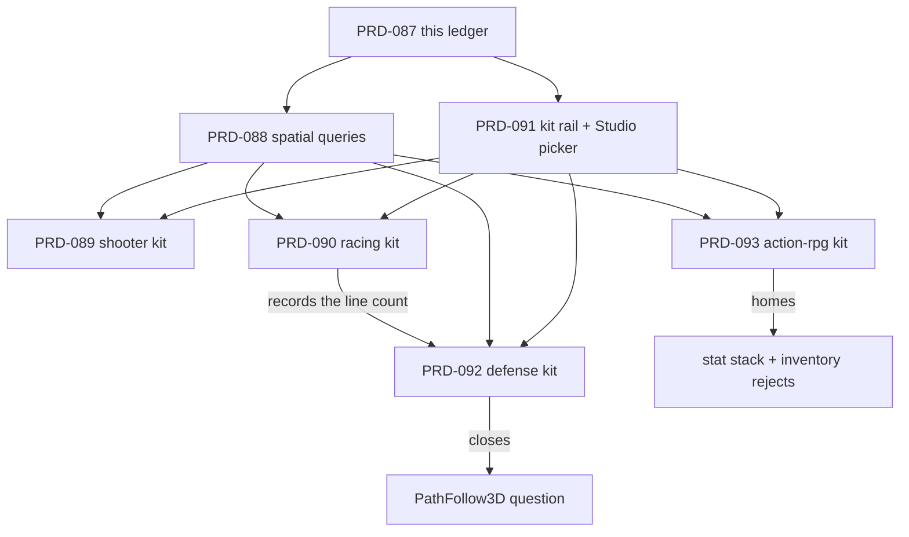

# PRD-087 — Genre borrow ledger: what seven shipped open-source games converge on, and which one of it belongs in the framework

**Status: PROPOSAL, 2026-08-12.** No code ran for this document. Every claim about an
external repository is a file listing or a source file fetched from GitHub on 2026-08-12 and
cited by path; every claim about this repo is a `grep` at `d54cb3b`. Nothing here is a
platform readiness claim.

**This is the parent of six PRDs.** It carries the method and the verdicts so none of them
re-argues these.

| PRD | Delivers | Depends on |
|---|---|---|
| [PRD-088](./PRD-088-physics-spatial-queries.md) | physics spatial queries — the one accepted package change | — |
| [PRD-091](./PRD-091-genre-kit-delivery-rail.md) | the kit registry, the fail-closed gate, the Studio picker | — |
| [PRD-089](./PRD-089-shooter-starter-kit.md) | `shooter` starter kit | 088, 091 |
| [PRD-090](./PRD-090-racing-starter-kit.md) | `racing` starter kit | 088, 091 |
| [PRD-092](./PRD-092-strategy-starter-kit.md) | `defense` starter kit; **closes the `PathFollow3D` question** | 088, 091, 090 |
| [PRD-093](./PRD-093-action-rpg-starter-kit.md) | `action-rpg` starter kit; **homes the two hardest rejects** | 088, 091 |

**Build order: 088 and 091 first, in parallel. Then 089, 090, 092, 093 in that order** — 092
consumes 090's measurement, and 093 is last because it is the largest.

## The question

The framework ships one genre template (`platformer`) and two generic ones (`minimal`,
`starter`). The open question is what a *second* and *third* genre would need that we do not
ship — and whether the answer is package code or generated user source.

## What ships at the end of this programme

**Five genre starter kits**, not five templates. The distinction is the deliverable:

| | Template (what we ship today) | Starter kit (what these PRDs ship) |
|---|---|---|
| What boots | a scene with a character in it | a game with a win condition and a fail condition |
| What the user does | walks around | plays, loses, wants another go |
| What they edit first | an entity, to make something happen | a system, to change something that already happens |
| Reachable from | `npx create-threenative --template <name>` | `npx`, **and the live Studio's picker** |
| Quality bar | boots | boots, plays, and clears the blind visual floor |

Every kit clears the same two gates, and neither is a new invention:

- **Functional** — a playtest that drives the real build through the game's own loop and
  asserts each transition. Not "it booted".
- **Looks good** — `scripts/visual-gate.ts` already encodes this and it is not vibes: the six
  `RENDER_LAYER_FILES` under `src/render/` each with a live importer, a palette of at most six
  named colours with exactly one `accent`, `materials.ts` and `sky.ts` importing `palette.js`,
  a key and a rim `DirectionalLight` plus a fill, `PCFSoftShadowMap`, `normalBias`, and
  `toneMapping` / `toneMappingExposure` / `setOutputNode` / `bloom(` in post — then a blind
  1–5 score at or above `VISUAL_SCORE_FLOOR = 4` (`scripts/visual-gate.ts:29`).

**Genre coverage, and the one deliberately left out.** Platformer ships today; shooter, racing,
tower defense and action-RPG are PRDs 089, 090, 092 and 093. **Survival/sandbox is surveyed
here and not built.** Luanti's `emerge.h`, `mapblock.h` and `mapgen/` are chunked world
streaming, which is a programme in its own right and overlaps the terrain work already
underway. Scoping it out is a decision with a reason, not an oversight.

Guessing that question wrong is the failure mode this repo already paid for once: v1 owned
materials, lights and post, and scored **worse** than vanilla Three.js on the blind rubric.
So the survey is deliberately not "what would be convenient". It is: **which capability do
several independent, shipped games in different genres each implement from scratch, and does
vanilla Three.js already answer it?** A capability that seven codebases each wrote by hand is
validated by seven shipping games. A capability only one wrote is a genre feature.

## 1. Why this is user value and not tidying

Today a user's agent can build a platformer, because we shipped that template and playtested
it. It cannot build a shooter. Not "would find it awkward" — **cannot**, in the literal
sense: there is no way to ask the physics world a question.

```
$ grep -n "castRay\|intersectRay\|intersectShape\|intersectPoint" packages/physics/src/index.ts
$   # no output. The public physics surface has no query of any kind.
```

`ScenePicker.raycast` (`packages/core/src/picking.ts:62`) is a **Three.js mesh raycast**. It
returns a `THREE.Intersection`, walks the scene graph, and knows nothing about collision
layers, sensors, or the capsule collider that is the actual shape of a character. It is the
right tool for "what did the user click". It is the wrong tool, and on native an
increasingly wrong tool, for "did this bullet hit anything".

The workaround is visible in our own generated source. `templates/platformer/src/entities/Chaser.ts`
holds a direct TypeScript reference to the player object and brute-forces distance in JS:

```ts
// templates/platformer/src/entities/Chaser.ts:44-46
const target = this.#player.mesh.position;
...
const targetDistance = position.distanceTo(target);
```

That works because the platformer has exactly one target, known at construction. It does not
generalise to *n* enemies, to line-of-sight, or to "the nearest hostile within 6 m" — the
verb every codebase below implements. **A framework that ships physics but no spatial query
has shipped the bodies and withheld the questions.**

## 2. Method

Seven codebases, chosen one per genre, each shipped and each readable. Listings fetched from
the GitHub contents API on 2026-08-12; the four marked ✱ also had a source file read.

| Genre | Repository | Path surveyed |
|---|---|---|
| 2D platformer | `SuperTux/supertux` | `src/object/` |
| Arena FPS | `id-Software/Quake-III-Arena` | `code/game/` |
| Kart racing | `supertuxkart/stk-code` ✱ | `src/karts/`, `src/tracks/`, `src/tracks/track_sector.hpp` |
| RTS | `OpenRA/OpenRA` ✱ | `OpenRA.Mods.Common/Traits/`, `Traits/AutoTarget.cs` |
| RTS | `0ad/0ad` | `binaries/data/mods/public/simulation/components/` |
| Action RPG | `flareteam/flare-engine` | `src/` |
| Survival / voxel | `luanti-org/luanti` ✱ | `src/`, `src/craftdef.h` |
| (control) | `godotengine/godot-demo-projects` | `3d/` |

Godot's demo set is the control, not a survey subject: it is where the borrowed vocabulary
comes from, and its `3d/` directory contains `kinematic_character`, `platformer`,
`truck_town`, `squash_the_creeps`, `waypoints`, `navigation`, `navigation_mesh_chunks` and
`voxel` — the same genre spread, arrived at independently.

Genre selection is scoped to what a 3D WebGPU-and-native framework can serve. The itch.io
jam literature puts Puzzle, Platformer, Interactive Fiction and Action at the top of
high-ranking submissions; Interactive Fiction and most Puzzle entries are not 3D-engine
work, so the six 3D-shaped genres above are what the survey covers.

## 3. What they converge on

A row is a capability. A cell is the file where that codebase implements it. **Convergence
across genres, not popularity within one, is the whole signal.**

| Capability | SuperTux | Quake III | SuperTuxKart | OpenRA | 0 A.D. | Flare | Luanti |
|---|---|---|---|---|---|---|---|
| **Spatial query** (ray / radius / shape) | sector collision | `g_weapon.c`, `g_combat.c` (`G_RadiusDamage`) | Bullet world | `Traits/AutoTarget.cs` → `FindActorsInCircle` | `Attack.js`, `UnitAI.js` | `HazardManager.cpp`, `Hazard.cpp` | `collision.cpp` |
| **Path / route following** | `object/path.cpp`, `path_object.cpp`, `circleplatform.cpp` | — | `tracks/bezier_curve.cpp`, `drive_graph.cpp` | `Traits/Mobile.cs` | `Formation.js` | `AStarContainer.cpp` | `pathfinder.cpp` |
| **Stat modifier stack** | — | `bg_misc.c` powerups | `karts/abstract_characteristic.cpp`, `combined_characteristic.cpp`, `max_speed.cpp` | `Traits/Multipliers/`, `Traits/Modifiers/` | `ModifiersManager.js`, `Auras.js`, `ValueModificationManager.js` | `EffectManager.cpp` | item groups |
| **Trigger volume** | `object/` triggers | `g_trigger.c` | `tracks/check_trigger.cpp` | `Traits/ProximityCapturable.cs` | `Trigger.js`, `TriggerPoint.js` | `EventManager.cpp` | `nodetimer.cpp` |
| **Spawn & respawn to a valid place** | checkpoints | `g_spawn.c` | `tracks/track_sector.cpp`, `karts/rescue_animation.cpp` | `Traits/ActorSpawner.cs` | `RallyPoint.js` | `EnemyGroupManager.cpp` | `player.cpp` |
| **Inventory / crafting** | — | `inv.h`, `bg_misc.c` | powerups | `Traits/Cargo.cs` | `Trader.js` | `ItemStorage.cpp`, `ItemManager.cpp` | `inventory.h`, `craftdef.h` |
| **Fog of war** | — | — | — | `Traits/AffectsShroud.cs`, `CreatesShroud.cs` | `Fogging.js`, `Visibility.js` | `FogOfWar.cpp` | — |

**Seven of seven implement a spatial query. Six of seven implement path or route following.
Five of seven implement a stat modifier stack. Three of seven implement fog of war.**

Two of those rows are already ours. Trigger volumes are `Area3D`; spawn-and-respawn is the
platformer template's `level/Checkpoints.ts`. They stay in the table as the control: the
method finds things we already agreed were framework-shaped, which is weak evidence it is
not just finding whatever it looks for.

## 4. Scoring, and the verdicts

Scored on the existing rubric in `docs/PRDs/OPPORTUNITY-AREAS.md` — Gap 30, Ceiling safety
25, Agent leverage 25, Cost fit 20.

| Candidate | Gap | Ceiling | Agent | Cost | **Total** | Verdict |
|---|---:|---:|---:|---:|---:|---|
| **Spatial queries** (`intersectRay`/`Shape`/`Point`) | 28 | 25 | 24 | 14 | **91** | **Build.** → PRD-088 |
| Deterministic rewind / resimulate | 26 | 20 | 20 | 8 | 74 | Defer. Next candidate after 088. |
| `Path3D` / `PathFollow3D` | 12 | 22 | 12 | 16 | 62 | Template. Promotion rule below. |
| Inventory + crafting registry | 30 | 12 | 10 | 6 | 58 | Reject as package. |
| Stat modifier stack | 30 | 10 | 8 | 6 | 54 | Reject as package. |
| Selection + command issuing | 8 | 18 | 10 | 14 | 50 | Reject. |
| Fog of war | 30 | 2 | 8 | 4 | 44 | **Reject, permanently.** |

### Why the rejects are rejects

**Fog of war is rule 3 in its purest form.** It is *literally* what a screenshot shows. Three
codebases implement it and all three implement it as rendering — a shroud texture, a
visibility mask, a palette effect. Owning it means owning the look. It ships as user source
in a strategy template or it does not ship.

**The stat modifier stack is the one that hurts to reject.** Five of seven converge on it,
and they converge on the same *shape*: a base value, an ordered set of additive and
multiplicative layers, each attributed to a source with a lifetime. SuperTuxKart splits it
across four files (`abstract_`, `combined_`, `cached_`, `xml_characteristic.cpp`) plus
`max_speed.cpp` for the time-limited case; 0 A.D. calls it `ModifiersManager` +
`ValueModificationManager` + `Auras`. That is real, validated convergence.

It is still gameplay. It has no Three.js surface, no native surface, and no answer to "what
is a stat" that is not a design decision about the user's game. A competent developer writes
the useful 80% — a `Map` of sources to `{add, mul}` and a reduce — in well under 20 lines.
Rule 1 forbids it and the table above is not an appeal.

**A reject with no home gets re-proposed every six months by whoever notices the same
convergence.** So both of the hard ones are given an address: the stat stack ships as
`src/stats/StatBlock.ts` in PRD-093's action-RPG kit, and its line count is recorded against
the "under 20 lines" claim made in this paragraph. If the built version lands well over that
**and** a second kit needs it, this row reopens with a number attached. One RPG needing stats
is not evidence — stats are what an RPG is.

**Inventory and crafting** is the same call with a different label. Luanti's `craftdef.h`
carries five recipe kinds, a six-level match priority and three hashing strategies — that is
Luanti's game design encoded, not plumbing every game repeats. It ships as
`src/items/Inventory.ts` in PRD-093. Crafting does not ship at all.

**Fog of war gets no home.** It is the one reject that is not homeless by accident: every line
a user would need is already under their own `src/render/`, and no kit ships it, because a
kit that shipped it would be teaching the framework to own the look.

**Selection and command issuing** fails on Gap. `ScenePicker` already answers "what is under
the pointer", and marquee selection is `Frustum.setFromProjectionMatrix` plus a loop, which
Three.js ships.

### The promotion rule for `Path3D`

`PathFollow3D` scores 62 because Three.js already ships the hard half: `CatmullRomCurve3`,
`getPointAt` and the arc-length reparameterisation behind `getUtoTmapping`. What is missing
is progress state and a rotation mode — roughly 40 lines. Six of seven codebases implement
it, which argues for it; the 20-line rule and a thin Gap argue against.

**It is resolved by measurement rather than by argument, and the three sites are already
named:**

| Site | Where | Which PRD writes it |
|---|---|---|
| 1 | `templates/platformer/src/entities/Chaser.ts:22-24` — a hand-rolled waypoint route | already on disk |
| 2 | the racing kit's driveline | PRD-090, which **records the reusable line count** |
| 3 | the defense kit's attacker route | PRD-092, which **executes the rule** |

**If the recorded count is over 20 lines, PRD-092 promotes `PathFollow3D` into
`@threenative/core` and deletes all three copies in the same commit. Under 20, rule 1 closes
the question permanently and PRD-092 records the number that closed it.** Two copies is a
coincidence; three is a tax. Nothing is built on speculation, the trigger is countable, and it
is scheduled into a phase rather than left to be noticed.

## 5. Integration Ledger

This PRD ships documentation only. Its integration obligation is that its verdicts bind.

| # | New thing | Live consumer | Replaces | Old path removed? | Negative control |
|---|---|---|---|---|---|
| 1 | This ledger | all six children cite it instead of re-deriving | ad-hoc genre guessing | n/a | a child PRD that proposes a rejected row without new evidence is rejected on sight |
| 2 | The `PathFollow3D` promotion rule | site 3 is PRD-092, which executes it in a named phase | "does this feel worth it" | n/a | fewer than three sites and the rule forbids the promotion |
| 3 | Addresses for the two hard rejects | PRD-093 ships both as kit source and records the line count | homeless rejects that get re-proposed | n/a | a package gains a `StatBlock` or an `Inventory` → the reject was overturned without evidence |
| 4 | The starter-kit bar in §"What ships" | every kit PRD's acceptance criteria | "template" meaning whatever the author felt like | n/a | a kit that boots to a walkable scene with no win condition fails its own criteria |

## 6. Execution phases



### Phase 0 — Ratify or amend the verdicts

**Outcome:** the table in §4 is either accepted as written or amended with a reason recorded
in this file. **Gate:** owner decision. No code.

### Phase 1 — The two rails, in parallel

**Outcome:** PRD-088 lands spatial queries on web and native; PRD-091 lands the kit registry,
the fail-closed gate and the Studio picker. **Gate:** each PRD's own acceptance criteria.
These are independent of each other and both block everything downstream.

### Phase 2 — Four kits, in order

**Outcome:** PRD-089, 090, 092 and 093 each ship a playable, gated genre kit.
**Gate:** `pnpm test:templates` green and blind score ≥ 4 for each; `pnpm studio:probe
--browser` lists all of them.

**The order is load-bearing in one place only:** 092 must follow 090, because it consumes the
number 090 records. The rest is size, smallest first.

**Phase 2 also tests Phase 1.** If any kit has to edit the CLI or a gate script to ship, the
rail in PRD-091 did not work and that is a finding, not a shrug.

## 7. Verification strategy

A survey cannot be run, so it is falsifiable instead of verifiable. Each cell in §3 is a path
in a public repository; a wrong cell is a wrong path and anyone can check it in one fetch.
The two claims about *this* repo are the ones that carry weight, and both are `grep`s at
`d54cb3b` reproduced verbatim in §1.

The rubric scores are judgement, and are labelled as judgement. They are not evidence and
must not be cited as if they were.

## 8. Acceptance criteria

- [ ] Every external file path cited in §3 resolves in the named repository.
- [ ] Both `grep` results in §1 reproduce at `d54cb3b`.
- [ ] The verdict table names a home for every surveyed capability — no row is left "maybe".
- [ ] Each reject carries the rule that rejects it **and an address**: a kit file, or an
      explicit "nowhere, and here is why".
- [ ] The `PathFollow3D` promotion rule states a countable trigger, names all three sites, and
      names the PRD phase that executes it.
- [ ] Every child PRD in the table above exists, and its stated dependencies match this file.
- [ ] Each of the five genres ships a kit that is playable and clears the blind visual floor,
      or is explicitly scoped out here with a reason — survival/sandbox is the only one.
- [ ] No section of `CHARTER.md` is cited by number anywhere in this file.
