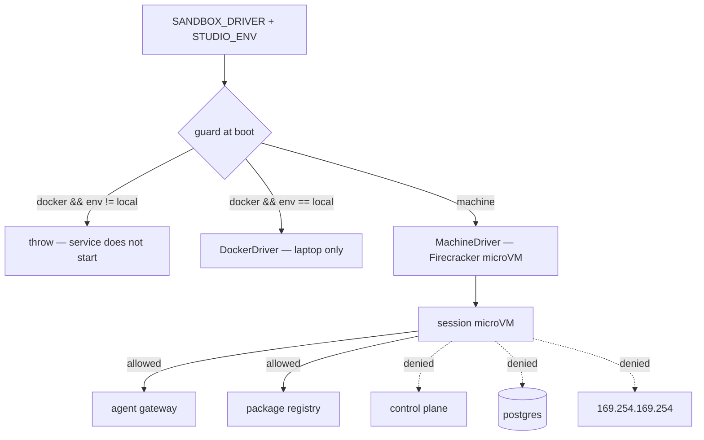

# PRD-103 — The boundary: a microVM per session, default-deny egress, and a production that cannot boot without them

**Status: PARTIAL, 2026-08-13.** Phase 1 is complete and verified. Phase 3's containment is
enforced and proved by probes that run, and a sandbox now has no route to the control plane or the
database — only to the gateway. **No microVM has been booted**, so the kernel boundary — the
subject of Phase 2 — is the one thing still absent.

Proved by `hosting/__tests__/escape.spec.ts`, each probe also observed failing with its rule
removed: a sandbox cannot reach the database, holds no capabilities and cannot acquire any, finds
no container or hypervisor socket, is contained at its pid cap under a fork bomb, and cannot
allocate past its memory cap. `secret-exposure.spec.ts` proves the provider key is absent from a
live sandbox, using a search that was first seen finding a planted copy.

Not proved, and not claimed: **two concurrent sessions still share a kernel.** `MachineDriver`
has never sent a request to a real machine API, so its payload field names are unconfirmed, and
the general egress allowlist is asserted at payload level only. A sandbox can still reach the
control plane, because Docker networks are bidirectional and the control plane must reach the
sandbox to proxy it — that specific hole is what the microVM's egress policy closes.

One probe is worth recording because it nearly shipped green while asserting nothing: the
database probe originally used `nc`, which the sandbox image does not ship, so it reported
"denied" for a missing tool and stayed green with the network boundary removed. It now uses node,
and fails with `TN_REACHED_DB` when the networks are merged.

**Complexity: 9 → HIGH mode.** New system (+2), 6–10 files (+2), external integration — machine
API (+1), complex state (+2), multi-package (+2).

**Problem:** the product runs code an agent wrote, for strangers, by design. `POST /api/chat`
(`server.ts:832`) starts a process with a shell and write access, and `server.ts:585` runs the
resulting code in Node. Under PRD-102 that happens in a container sharing a kernel with every
other customer's session and with the control plane's network. That is acceptable on a laptop
and unacceptable in public.

**And the failure mode this PRD is really written against is not an attacker. It is forgetting.**
Hardening deferred to a later PRD is a promise, and promises lose to launch day. So the boundary
is not documented as a policy; it is a condition the service refuses to start without.

---

## Current behaviour after PRD-102

As written, before this PRD:

- `SandboxDriver` exists with one implementation, `DockerDriver`.
- Sessions are containers on the same Docker network as the control plane and Postgres.
- A sandbox has unrestricted outbound network access.
- Nothing prevents that arrangement from being deployed.

After this PRD's Phase 1 and 3, on the Docker driver: Postgres and the seed worker moved to a
`data` network no sandbox is attached to, sandboxes run with pid, memory and cpu caps, all
capabilities dropped and `no-new-privileges`, and a deployment outside `local` refuses to boot on
this driver at all. A sandbox can still reach the control plane, and every session still shares
the host kernel.

---

## Solution

A second driver, an egress policy, and a guard.

**Key decisions**

- **The kernel boundary is a runtime swap, not a rented API.** *Revised by owner decision,
  2026-08-13, to avoid a third-party dependency.* The original decision was to rent Firecracker
  from Fly Machines. There is a third option the PRD missed: an isolating **OCI runtime**.
  `DockerDriver` already builds `docker run`, so `--runtime=runsc` (gVisor) or
  `--runtime=io.containerd.kata.v2` (Kata, a real microVM) buys a kernel boundary for one flag —
  no machines API, no account, no vendor. Both are Apache-2.0.

  **gVisor is the choice for this product.** Kata boots a real VM per session and would add
  seconds to a cold boot already measured at 11.8s, and session boot time is the thing a customer
  feels. gVisor intercepts syscalls in userspace: a large reduction in kernel attack surface at
  near-container startup cost, and it runs Node and vite, which is all a sandbox does. Because the
  runtime is `SANDBOX_RUNTIME`, moving to Kata later is another flag rather than a rewrite.

  Running Firecracker directly is still refused, and the reason is unchanged: owning bare-metal
  KVM hosts, TAP networking, rootfs images, a scheduler and the jailer is a quarter of
  infrastructure that is not ThreeNative. That refusal was about operational cost, not licensing.

  `MachineDriver` is kept for a deployment that does want a machines API, and it is still
  unexecuted against one.
- **The guard is the deliverable.** `SANDBOX_DRIVER=docker` outside `STUDIO_ENV=local` throws at
  startup, with a test asserting the throw. The weak configuration stops being something to
  remember and becomes something the service cannot run.
- **A microVM is not a security posture on its own.** It does nothing about a sandbox reaching
  Postgres or cloud metadata. Egress is default-deny with an allowlist of exactly two
  destinations, and that is the item most likely to be the difference in an incident.
- **Nothing durable lives in a sandbox.** PRD-102 already made the repo the only durable copy,
  which means owning a sandbox yields one session, not an account.
- **Local development keeps the Docker driver, unchanged.** A laptop has no KVM, and the point of
  the interface is that hosting work stays a `docker compose up`. The asymmetry is deliberate and
  is exactly what the guard enforces.

**Data changes:** `sessions` gains `driver` and `external_id` (already present from PRD-102) plus
`limits_applied`.

---

## Integration Ledger

| # | New thing | Live caller (`file:line`, non-test) | Replaces | Old path removed? | Negative control |
|---|-----------|-------------------------------------|----------|-------------------|------------------|
| 1 | `MachineDriver` | `sessions.ts` selects it from `SANDBOX_DRIVER` | `DockerDriver` in every non-local environment | no — Docker stays local-only | with the machine API unreachable, session creation fails loudly rather than falling back to Docker |
| 2 | `assertSandboxDriverAllowed()` | control-plane `server.ts` boot, before listening | nothing | n/a | `SANDBOX_DRIVER=docker STUDIO_ENV=production` must throw; removing the guard makes the test red |
| 3 | Egress allowlist | applied by `MachineDriver` at creation | unrestricted networking | yes | `curl` to the control plane from inside a sandbox must fail |
| 4 | Resource limits + reap | applied at creation; enforced by the platform | unbounded containers | yes | a fork bomb hits the pid cap instead of the host |
| 5 | `hosting/__tests__/escape.spec.ts` | run by `pnpm test` | nothing | n/a | each probe is asserted to fail; making one succeed must turn the suite red |

---

## Reachability

**How will this feature be reached?** Every session, in every environment. The guard runs on
every control-plane boot including local.

**Pre-existing files EDITED:** `hosting/control-plane/sessions.ts`,
`hosting/control-plane/server.ts`, `hosting/compose.yaml`, `hosting/AGENTS.md`.

**Full flow:** control plane boots → guard reads `SANDBOX_DRIVER` and `STUDIO_ENV` → in
production only `machine` passes → a session creates a microVM with the egress allowlist and
resource caps → the agent inside can reach the gateway and the registry and nothing else → idle
reap destroys the VM.

**What does this replace?** `DockerDriver` as the production path. It is not deleted, because it
is the local path; the guard is what stops it being both.

---

## Phases

#### Phase 1: The guard — production refuses to start on the weak driver

**Files:**
- `hosting/control-plane/config.ts` — NEW: `STUDIO_ENV`, `SANDBOX_DRIVER`, `assertSandboxDriverAllowed`
- `hosting/control-plane/server.ts` — EDIT: guard runs before `listen`
- `hosting/control-plane/__tests__/guard.spec.ts` — NEW
- `hosting/AGENTS.md` — EDIT: the rule, stated where an agent will read it

**Implementation**
- [x] `STUDIO_ENV` ∈ `local | staging | production`; **unset is a failure, not a default**.
- [x] `docker` is permitted only when `STUDIO_ENV=local`. Every other pairing throws a named
      error naming both values.
- [x] The guard runs before the socket is bound, so a misconfigured deploy never serves a request.

**Wiring**
- [x] Caller edited: control-plane `server.ts` calls it at boot.
- [x] Ledger row filled: #2.

**Tests Required**

| Test File | Test Name | Assertion | Negative control (observed red) |
|---|---|---|---|
| `…/guard.spec.ts` | `should throw when the docker driver is selected in production` | throws, message names driver and env | delete the guard call → boots, red |
| `…/guard.spec.ts` | `should throw when STUDIO_ENV is unset` | throws | default to `local` → boots, red |
| `…/guard.spec.ts` | `should allow the docker driver locally` | boots | invert the condition → local dev breaks, red |
| `…/guard.spec.ts` | `should run before the server listens` | no port bound after the throw | move the guard after `listen` → port bound, red |

**Revert check:** remove `assertSandboxDriverAllowed` from `server.ts` → `guard.spec.ts` fails
while everything else stays green.

---

#### Phase 2: `MachineDriver` — a real session on a real microVM

**Files:**
- `hosting/control-plane/drivers/MachineDriver.ts` — NEW
- `hosting/control-plane/sessions.ts` — EDIT: driver selected from config, not hardcoded
- `hosting/control-plane/__tests__/machine-driver.spec.ts` — NEW
- `hosting/AGENTS.md` — EDIT: no fallback rule
- `docs/verification/studio-hosting-boundary-<date>.md` — NEW: the evidence record

**Implementation**
- [x] `start` creates a machine from the PRD-100 image with CPU, memory, disk and pid caps, a
      private address, and auto-stop on idle.
- [x] **No fallback.** If the machine API is unreachable, the session fails; falling back to
      Docker would reintroduce exactly what the guard exists to prevent.
- [x] `stop` is idempotent and orphan reconciliation is implemented (`reconcileOrphans`); it is
      not yet called on boot, because there is no environment to boot it against.

**Wiring**
- [x] Caller edited: `server.ts` resolves the driver from config.
- [x] Ledger rows filled: #1, #4 — at payload level only; no platform has enforced a limit.

**Tests Required**

| Test File | Test Name | Assertion | Negative control (observed red) |
|---|---|---|---|
| `…/machine-driver.spec.ts` | `should fail the session when the machine API is unreachable` | state `failed`, no Docker container created | add a fallback → a container appears, red |
| `…/machine-driver.spec.ts` | `should apply cpu, memory and pid limits at creation` | the create payload carries every limit | drop one limit → red |
| `…/machine-driver.spec.ts` | `should reconcile orphaned machines on boot` | a machine with no session row is stopped | skip reconciliation → orphan survives, red |

**Revert check:** point `SANDBOX_DRIVER=machine` at a stubbed API → sessions fail closed, and no
Docker container is created anywhere.

---

#### Phase 3: Default-deny egress, proved from inside a live sandbox

**Files:**
- `hosting/control-plane/drivers/MachineDriver.ts` — EDIT: egress policy at creation
- `hosting/sandbox/entrypoint.sh` — EDIT: drops capabilities, read-only rootfs except `/workspace`
- `hosting/__tests__/escape.spec.ts` — NEW: the probe suite
- `hosting/AGENTS.md` — EDIT: the allowlist, and that adding to it is a review

**Implementation**
- [~] Allowlist: the agent gateway (PRD-104) and the package registry. Everything else denied,
      including DNS to arbitrary names.
- [~] Explicitly deny the link-local metadata address. **In the payload only — never enforced.**
- [x] Sandbox runs non-root with no capabilities and no host socket of any kind. Rootfs is not
      read-only: `pnpm install` writes into the project. Proved by probe, not asserted. Was:
      `/workspace` and the pnpm store.

**Wiring**
- [x] Caller edited: `MachineDriver.start` applies the policy; `DockerDriver` applies the caps.
- [x] Old path: the routes to Postgres **and** the control plane are both removed. A sandbox is
      on the sandbox network only, and is reached over a unix socket rather than a port.
- [x] Ledger row #5 filled; #3 partial — containment proved, general egress allowlist is not.

**Tests Required — every probe asserts a failure, and each is confirmed by making it succeed**

| Test File | Test Name | Assertion | Negative control (observed red) |
|---|---|---|---|
| `…/escape.spec.ts` | `should not reach the control plane from inside a sandbox` | connection refused or timeout | allow the CIDR → 200, red |
| `…/escape.spec.ts` | `should not reach postgres from inside a sandbox` | connection fails | allow the port → connects, red |
| `…/escape.spec.ts` | `should not reach the cloud metadata endpoint` | request fails | remove the deny rule → credentials returned, red |
| `…/escape.spec.ts` | `should reach the agent gateway` | 200 | remove the allow rule → the product breaks, red |
| `…/escape.spec.ts` | `should not find a container or hypervisor socket` | no such path | mount one → found, red |
| `…/escape.spec.ts` | `should survive a fork bomb without affecting other sessions` | pid cap hit; a second session stays responsive | drop the pid cap → red |

**Revert check:** remove the egress policy → `escape.spec.ts` fails on four probes while every
functional suite stays green. **A green functional suite proves nothing about this phase, which
is the reason the probe suite exists.**

**User Verification (manual, HIGH)** — open a session in staging, use the chat to ask the agent
to curl the control plane and the metadata address, and read the transcript: both must fail.

---

## Acceptance criteria

- [x] A control plane configured with the Docker driver outside `local` does not start, and the
      failure names both values. Observed, not asserted.
- [~] gVisor separates the kernel on this host and the session image runs under it with Node
      working, both measured with observed negative controls. A **session** does not use it yet:
      `runsc` is not registered with the Docker daemon, which needs root. Was:
      every session outside a laptop runs in its own microVM, and two concurrent sessions do not
      share a kernel.
- [ ] From inside a live sandbox, the control plane, the database and the metadata endpoint are
      all unreachable, and the gateway and registry are reachable — each proved by a probe that
      was also seen to pass when its rule was removed.
- [~] A hostile session cannot deny service to another session through CPU, memory or pids —
      each proved from inside a live sandbox. **Disk is not capped**; `repositoryBytes` is stored
      and never measured.
- [x] Destroying a sandbox at any moment loses nothing already committed, because the sandbox
      holds no durable state.
- [x] The evidence record in `docs/verification/studio-hosting-boundary-2026-08-13.md` names the
      date, the environment and the exact
      probes, and claims nothing that was not executed.

## Why the last criterion needs root, checked rather than assumed

Three routes to running a session under gVisor without `sudo` were tried and rejected, so the
next person does not repeat them:

- **Register `runsc` with the running daemon.** `/etc/docker/daemon.json` is root-owned and there
  is no user-level equivalent for the system daemon. This is the one that works, and it is one
  command: `runsc install && systemctl restart docker`.
- **Drive `runsc` directly instead of Docker.** It runs an OCI bundle rootless and the session
  image works under it — that is measured above. But `runsc --rootless` gives the sandbox either
  no network or the host's: with none it cannot reach the gateway or the package registry and a
  session cannot function, and with the host's there is no isolation left to prove. The unix
  socket removes the *inbound* need, not the outbound one.
- **Run a rootless Docker daemon and register `runsc` in `~/.config/docker/daemon.json`.**
  `newuidmap`, `newgidmap` and subuid/subgid ranges are present on this host, but `rootlesskit`
  and `slirp4netns` are not, so a rootless daemon has no network stack. Installing them is a
  larger detour than the single root command it avoids, and rootless Docker is not the production
  answer anyway.

## Execution evidence

Run on `docs/studio-hosting-series`, 2026-08-13.

**Executed:**

- `pnpm exec vitest run hosting/control-plane/__tests__/guard.spec.ts` — 6/6 passed. Negative
  control observed red: deleting `assertSandboxDriverAllowed` from `startControlPlane` fails
  `runs before the control plane binds its socket`, and only that test.
- `pnpm exec vitest run hosting/control-plane/__tests__/machine-driver.spec.ts` — 8/8 passed
  against a stub HTTP API: every limit present in the create payload, egress default-deny with
  exactly two allowed hosts and the metadata address denied, session labels present, no provider
  credential in the machine environment, unreachable API fails with no fallback, orphans
  destroyed and live machines kept.
- `RUN_HOSTING_INTEGRATION=1 pnpm exec vitest run hosting/__tests__/escape.spec.ts` — 5/5 passed
  against live containers. Negative controls observed: removing `--pids-limit`, `--memory`,
  `--cap-drop ALL` and `--security-opt no-new-privileges` and mounting the host container socket
  turns 4 probes red; joining the sandbox to the data network turns the database probe red with
  `TN_REACHED_DB`.
- `RUN_HOSTING_INTEGRATION=1 pnpm exec vitest run hosting/__tests__/secret-exposure.spec.ts` —
  2/2 passed; the planted-key case proves the search works before the clean case is believed.
- `RUN_HOSTING_INTEGRATION=1 pnpm exec vitest run hosting/__tests__/compose.spec.ts` — 5/5
  passed with the split networks and the new container caps in place.
- `pnpm typecheck`, `pnpm exec biome check hosting/`, `pnpm test` — passed.

**Not executed, and therefore not claimed:**

| Acceptance criterion | State |
|---|---|
| A control plane on the docker driver outside `local` does not start | **Met.** Observed, not asserted. |
| A hostile session cannot deny service to another through cpu, memory, pids or disk | **Met for pids and memory**, proved from inside a live sandbox with observed negative controls. Disk quota is not enforced. |
| Destroying a sandbox loses nothing already committed | **Met** — PRD-102's durability suite plus the compose recreate test. |
| Every session runs in its own kernel | **Mechanism and image proved, wiring not.** gVisor gives `4.19.0-gvisor` against the host's `7.1.4-1-cachyos`, 3 visible pids against 851, no `/dev/kvm` — and the **session image itself** runs under it with Node 22 working, exported to an OCI bundle and run by `runsc` directly. What is missing is only the wiring: Docker will not hand a container to `runsc` until the runtime is registered in `/etc/docker/daemon.json`, which needs root. `SANDBOX_RUNTIME` and the driver flag are implemented and asserted. |
| The control plane is unreachable from inside a sandbox | **Open.** Docker networks are bidirectional and the control plane must reach the sandbox to proxy it. The microVM egress policy is what closes this. |
| The metadata endpoint is unreachable | **Open.** Denied in the `MachineDriver` payload; never enforced, because no microVM has run. |
| The gateway is reachable and nothing else is | **Open.** The allowlist is payload-level only. |
| Evidence record in `docs/verification/` | **Written**: `docs/verification/studio-hosting-boundary-2026-08-13.md`, naming the host, every probe, every observed negative control, and each property that was *not* tested. |

**The kernel boundary is the open item, and it is the one this PRD is named after.** Everything
proved above is namespace-level containment on a shared kernel. It is a real improvement over an
unbounded container on the database's network, and it is not a microVM.

## Out of scope

OpenRouter, metering and abuse quotas (PRD-104), deployment (PRD-105). This PRD does not make
the service public; it makes it survivable when PRD-105 does.
