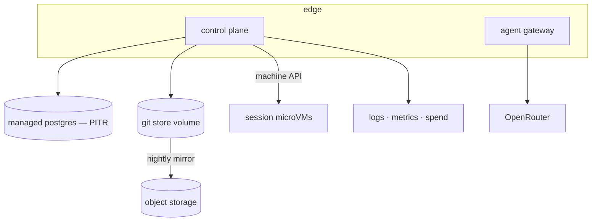

# PRD-105 — Deploy it, prove you can get it back, and only then let strangers in

**Status: PARTIAL — the non-deploy half is done, the deploy half is blocked, 2026-08-13.**

Done and verified here, because none of it needed a hosting account:

- **Phase 1, the secret assertion.** `assertRequiredSecrets` names *every* missing secret at once,
  and which secrets are required follows the mode — a laptop needs no provider key, a microVM
  deployment needs no Codex key. Reporting one missing secret per restart turns a five-minute fix
  into five deploys. The deploy manifests themselves are not written; the tested deliverable is
  the refusal.
- **Phase 2, backups.** `git clone --mirror` per repository behind a storage interface narrow
  enough that a directory and S3 are the same shape, which is what keeps the drill runnable
  without an account. **Freshness is read from the newest object in storage, never from the job's
  own log**, so a job that ran and wrote nothing reads stale. A restore is verified by tip
  equality and by getting the file contents back out with git. A partial mirror reports which
  repository failed rather than claiming success. `/healthz` carries freshness, so a service
  serving happily on an aged-out backup says so.
- **Phase 4, the account surface.** `GET /api/account/usage` sums recorded rows for the day and
  the month with a per-project breakdown. **A period with no rows is zero, never an estimate** — a
  fabricated figure is worse than a blank one because a customer plans against it. A settings page
  renders it alongside password change and deletion; a compact indicator warns at 80% of the daily
  cap, because the point is seeing the limit coming rather than discovering it by hitting it.
  Changing a password revokes every refresh token, so a change made to end a session actually ends
  it. Deletion needs the account's own address typed, removes the games, and keeps the 30-day
  grace the page promises — proved by advancing the clock past it and watching the repository
  leave the disk. `QuotaNotice` renders a refusal wherever one can happen, so Phase 3's refusals
  are readable rather than dead buttons.

- **Phase 3, quotas.** `enforceQuota` runs on project create and session start, and covers
  projects, concurrent sessions and repository bytes — the last measured by walking the bare
  repository, because a stored-but-never-measured limit is a number that reassures and enforces
  nothing. A refusal names the
  limit, the current value and what to do about it, rather than returning a bare 403. Quotas are
  stored per account, so raising one for a customer is a row. Reattaching to a live session does
  not count against the limit. Five tests, each observed red with its check removed.
- **Phase 5, the signup gate.** Signup is behind `SIGNUP_OPEN` and **closed unless explicitly
  opened** — the default is the point, because a deployment that forgets to decide must not be the
  one that lets strangers in. Closed returns 404 rather than 403, so it does not advertise the
  route. Three tests, observed red with the gate removed.

**Nothing is deployed, no backup has been taken, and no restore has been performed.** Phase 1
(deploy configuration), Phase 2 (object-storage mirror and the restore drill) and Phase 4 (the
settings and usage UI) are open. The first two need external accounts that do not exist: a hosting
platform, object storage, a domain and certificate. Writing deploy manifests that have never run
would produce exactly the green-looking untested artifact this repo's rules exist to prevent.

**Signup must stay shut regardless, and the gate list below says why.** PRD-103's microVM has
never booted, so a session is still a container sharing a kernel and able to reach the control
plane. Opening signup today would hand any stranger a shell next to the database. The flag being
closed by default is what makes that a configuration rather than a memory.

**Complexity: 8 → HIGH mode.** New system (+2), 6–10 files (+2), external integration — hosting
platform and object storage (+1), schema change (+1), multi-package (+2).

**Problem:** PRDs 100–104 produce a service that runs on a laptop. This one puts it on the
internet, and it is the **only** PRD in the series permitted to make Studio reachable by someone
who is not the operator. Everything it adds exists to answer two questions: can the service be
rebuilt after losing its disks, and what stops one stranger from ruining it for everyone else.

---

## Current behaviour after PRD-104

- The full topology runs under `docker compose` with the Docker sandbox driver.
- `MachineDriver` exists and the boot guard refuses the Docker driver outside `local`.
- Project source lives in bare repositories on a volume; metadata and usage in Postgres.
- No deployment, no backups, no quotas, no operational visibility, no signup.

---

## Solution

Deploy the two long-lived services, put the durable state somewhere that survives them, and gate
signup behind a written checklist.

**Key decisions**

- **Postgres is managed, with point-in-time recovery.** Running the database is not a thing to
  own alongside everything else here.
- **Bare repositories mirror to object storage nightly**, plus on project delete. The mirror is a
  `git clone --mirror`, so a restored copy is a working repository rather than a tarball someone
  has to interpret.
- **The restore drill is a gate, not a document.** A backup nobody has restored is a belief. The
  drill provisions an empty environment from backups and ends with a customer's game opening in a
  browser.
- **Quotas are per account and enforced server-side**: projects, concurrent sessions, daily spend
  (from PRD-104), and total repository bytes.
- **Signup opens behind a checklist**, and the checklist is in this file rather than in someone's
  memory.
- **Data collected is deliberately small**: email, an argon2id password hash, project source, and
  usage rows. Account deletion purges repositories and rows within 30 days, which is also what
  makes a deletion request answerable without engineering work.

**Data changes:** `account_quotas`, and `deletion_requests`.

---

## Integration Ledger

| # | New thing | Live caller (`file:line`, non-test) | Replaces | Old path removed? | Negative control |
|---|-----------|-------------------------------------|----------|-------------------|------------------|
| 1 | Deployment configuration | the platform's deploy command in CI | `docker compose` as the only way to run it | no — compose stays the local path | a deploy with a missing secret fails at boot, by PRD-103's guard and PRD-104's key check |
| 2 | Nightly mirror job | scheduled in the control plane | nothing | n/a | with the job disabled, the freshness check fails |
| 3 | Restore drill script | run by an operator; recorded in `docs/verification/` | nothing | n/a | the drill must fail when the mirror is stale or absent |
| 4 | `enforceQuota` | project create, session create | nothing | n/a | removing it lets an account exceed every cap |
| 5 | Signup route enabled | `routes/auth.ts` behind `SIGNUP_OPEN` | operator-only account creation | yes | with the flag off, signup returns 404 |
| 6 | Account settings page | account menu in `SessionChrome` and the dashboard header | nothing — deletion had no UI | n/a | with the delete endpoint stubbed to fail, the page reports it instead of appearing to succeed |
| 7 | Usage view + cap indicator | settings page; compact form in the chrome bar | nothing — spend was invisible to the customer | n/a | with `agent_usage` empty the view shows zero, not a crash or a fabricated figure |
| 8 | `QuotaNotice` renderer | project create, session start, switch-away | a bare refusal with nowhere to render | n/a | a refused create must show the named limit; swallowing it leaves a dead button |

---

## Reachability

**How will this feature be reached?** By a stranger typing the URL. That is the point of the PRD
and the reason its gate list is binding.

**Pre-existing files EDITED:** `hosting/control-plane/routes/auth.ts`,
`hosting/control-plane/projects.ts`, `hosting/control-plane/sessions.ts`,
`hosting/AGENTS.md`, `docs/README.md`.

**Full flow:** operator deploys → boot guard and secret checks pass or the deploy fails → nightly
mirror runs and the freshness check reports green → the operator performs a restore drill into an
empty environment and opens a game there → the signup checklist is completed in this file → the
flag is turned on → a stranger signs up, is bound by quotas, and their game is mirrored nightly.

**What does this replace?** Operator-only account creation.

---

## Phases

#### Phase 1: The service is deployed, and a misconfigured deploy refuses to serve

**Files:**
- `hosting/deploy/` — NEW: service configuration for control plane and gateway
- `.github/workflows/hosting-deploy.yml` — NEW: manual-dispatch deploy
- `hosting/control-plane/config.ts` — EDIT: every required secret asserted at boot
- `hosting/AGENTS.md` — EDIT: secrets never in the repo, never in an image
- `docs/README.md` — EDIT: points at this series

**Implementation**
- [x] Required at boot: `JWT_SECRET`, `SESSION_TOKEN_SECRET`, `OPENROUTER_API_KEY`,
      `MACHINE_API_TOKEN`, `DATABASE_URL`, `STUDIO_ENV`, `SANDBOX_DRIVER`. Any absence throws.
- [ ] Deploy is manual-dispatch. CI minutes here are scarce, and an automatic deploy on every push
      to a service holding customer games is not a trade worth making.
- [ ] Migrations run as a release step that fails the deploy on error.

**Wiring**
- [~] Caller edited: `config.ts` asserts the full set. There is no workflow and no deploy.
- [ ] Ledger row filled: #1.

**Tests Required**

| Test File | Test Name | Assertion | Negative control (observed red) |
|---|---|---|---|
| `…/config.spec.ts` | `should throw when any required secret is absent` | one case per secret | default any one → boots, red |
| `…/config.spec.ts` | `should fail the release when a migration fails` | non-zero exit, no traffic shifted | ignore the exit code → deploy proceeds, red |

**Revert check:** remove a secret assertion → `config.spec.ts` fails; a staging deploy with that
secret missing serves traffic instead of refusing.

---

#### Phase 2: Backups exist, and a stranger's game comes back from them

**Files:**
- `hosting/control-plane/backup.ts` — NEW: `git clone --mirror` to object storage, freshness record
- `hosting/deploy/restore-drill.sh` — NEW
- `hosting/control-plane/routes/health.ts` — EDIT: backup freshness in the health payload
- `hosting/__tests__/backup.spec.ts` — NEW
- `docs/verification/studio-hosting-restore-<date>.md` — NEW: the drill's evidence

**Implementation**
- [~] Mirroring of every non-purged repository is implemented and tested. **No scheduler runs
      it**, so nothing is nightly yet.
- [x] Freshness is **measured from the newest object in storage**, not from the job's own "I ran"
      log — a job that ran and wrote nothing must read as stale.
- [ ] The drill: empty environment → restore Postgres from PITR → restore repos from the mirror →
      log in as a test account → open a game → confirm the tip matches.

**Wiring**
- [~] Caller edited: `/healthz` reports freshness. The scheduler does not exist.
- [ ] Ledger rows filled: #2, #3.

**Tests Required**

| Test File | Test Name | Assertion | Negative control (observed red) |
|---|---|---|---|
| `…/backup.spec.ts` | `should mirror every active repository nightly` | object count equals repository count | skip one → red |
| `…/backup.spec.ts` | `should report stale when the job ran but wrote nothing` | health reports stale | trust the job log → reports fresh, red |
| `…/backup.spec.ts` | `should restore a repository whose tip matches the original` | restored `HEAD` equals recorded tip | restore an empty repo → red |

**Revert check:** disable the mirror job → the health check goes stale within a day and
`backup.spec.ts` fails.

**User Verification (manual, HIGH)** — perform the drill against a real empty environment and
write the result into `docs/verification/`, naming the date, what was restored, and what was not.

---

#### Phase 3: Quotas, so one account cannot ruin it for the rest

**Files:**
- `hosting/control-plane/quotas.ts` — NEW
- `hosting/control-plane/projects.ts` — EDIT: quota check on create
- `hosting/control-plane/sessions.ts` — EDIT: quota check on session start
- `hosting/control-plane/db/migrations/008_quotas.sql` — NEW
- `hosting/__tests__/quotas.spec.ts` — NEW

**Implementation**
- [x] Defaults: projects per account, concurrent sessions per account, repository bytes per
      account, daily spend (already enforced in the gateway).
- [x] Exceeding a quota returns a message naming which limit and what to do, never a bare 403.
- [x] Quotas are per account and stored, so raising one for a customer is a row, not a deploy.

**Wiring**
- [x] Caller edited: both create paths consult `enforceQuota`.
- [x] Ledger row filled: #4 — projects, concurrent sessions and repository bytes, the last
      measured by walking the bare repository rather than estimated.

**Tests Required**

| Test File | Test Name | Assertion | Negative control (observed red) |
|---|---|---|---|
| `…/quotas.spec.ts` | `should refuse a project beyond the account limit` | refused, named limit in the message | remove the check → created, red |
| `…/quotas.spec.ts` | `should refuse a third concurrent session` | refused, existing sessions untouched | remove the check → third sandbox starts, red |
| `…/quotas.spec.ts` | `should count repository bytes against the account` | over-limit push refused | never measure → unbounded, red |

**Revert check:** remove `enforceQuota` from both call sites → three quota tests fail.

---

#### Phase 4: The customer can see what they've spent, change their account, and read why they were refused

**Files:**
- `hosting/control-plane/web/Settings.tsx` — NEW: change password, delete account, sign out everywhere
- `hosting/control-plane/web/Usage.tsx` — NEW: spend against cap, per-project breakdown, recent turns
- `hosting/control-plane/web/QuotaNotice.tsx` — NEW: renders a refusal wherever one can happen
- `hosting/control-plane/web/SessionChrome.tsx` — EDIT: account menu and a compact cap indicator
- `hosting/control-plane/routes/account.ts` — NEW: `GET /api/account/usage`, `DELETE /api/account`

**Implementation**
- [x] **Usage.** Today and this month against the cap, broken down by project, plus the last
      turns with their cost. Figures come from `agent_usage`; **a period with no rows renders
      zero, never an estimate.** The chrome carries a compact version so a customer sees the cap
      approaching instead of discovering it by hitting it.
- [x] **Settings.** Change password — which revokes every refresh token. Delete account, behind
      typing the account's email, wired to the purge path PRD-105 already requires; the page says
      plainly that games are removed within 30 days and cannot be recovered after.
- [x] **Refusals.** Every quota refusal from Phase 3 renders through one component naming the
      limit, the current value and the next action. It appears in all three places a refusal can
      occur: creating a project, starting a session, and switching between games.
- [x] All three degrade: a failing account API must not take down the game the customer is
      editing below the chrome.

**Wiring**
- [x] Caller edited: `SessionChrome.tsx` gains the account menu and cap indicator; the create and
      session paths from Phase 3 render `QuotaNotice` instead of discarding the refusal.
- [x] Registration: the account routes are mounted on the control plane.
- [x] Ledger rows filled: #6, #7, #8.

**Tests Required**

| Test File | Test Name | Assertion | Negative control (observed red) |
|---|---|---|---|
| `…/account.e2e.spec.ts` | `should show the spend recorded for the account` | the figure equals the sum of `agent_usage` rows | render a hardcoded value → red |
| `…/account.e2e.spec.ts` | `should show zero for a period with no usage` | zero, no crash, no estimate | interpolate from the last period → red |
| `…/account.e2e.spec.ts` | `should revoke every refresh token when the password changes` | an old refresh token 401s | skip revocation → still valid, red |
| `…/account.e2e.spec.ts` | `should require the account email before deleting` | delete disabled until it matches | drop the confirmation → one-click deletion, red |
| `…/quota-notice.spec.ts` | `should name the limit when a project create is refused` | the limit and its value are in the visible text | swallow the refusal → dead button, red |
| `…/quota-notice.spec.ts` | `should keep the game editable when the account API fails` | the Studio iframe still responds | couple the chrome to the API → blank page, red |

**Revert check:** remove `QuotaNotice` from the create path → a customer at their project limit
clicks *New game* and nothing happens, and `quota-notice.spec.ts` fails while Phase 3's
server-side quota tests stay green. **Phase 3 proves the refusal exists; only this phase proves
the customer can read it.**

**User Verification (manual, HIGH)** — set a one-project quota, try to create a second from the
chrome, read the notice, then open settings and confirm the spend figure matches the usage rows.

---

#### Phase 5: Signup opens — the gate

**Files:**
- `hosting/control-plane/routes/auth.ts` — EDIT: signup behind `SIGNUP_OPEN`
- `hosting/control-plane/routes/health.ts` — EDIT: readiness includes the gate conditions
- `hosting/__tests__/signup-gate.spec.ts` — NEW
- `docs/verification/studio-hosting-launch-<date>.md` — NEW
- `hosting/AGENTS.md` — EDIT: the gate list, where an agent will read it

**Deferred by owner decision, 2026-08-13: password reset and email verification.** Neither ships
in this series, and no transactional-email dependency is taken on. Two consequences a reader
should not have to infer. A customer who forgets their password has no self-service route back
into their games, and the operator is the recovery path. And because signup is unverified,
**abuse control at the front door rests entirely on the per-account quotas in Phase 3 and the
spend caps in PRD-104** — one person can hold many accounts, so those limits are load-bearing
rather than a convenience. Revisit before signup volume makes operator-assisted recovery
impractical.

**Every line is checked with evidence, or signup stays shut:**

- [ ] PRD-103 closed: production runs the machine driver, and the escape probes were executed
      against a **production** sandbox, not a laptop.
- [ ] PRD-104 closed: the OpenRouter key was searched for inside a live production sandbox and not
      found; the budget refusal was observed in the chat panel.
- [ ] The restore drill was performed on a real empty environment and a game opened from backup.
- [ ] Quotas enforced on project create and session start, both observed refusing.
- [ ] Spend for a period reconciles against OpenRouter's own reported spend.
- [ ] An account deletion purges repositories and rows, observed end to end.
- [ ] An incident runbook exists naming who is paged, how to stop all sessions, and how to revoke
      the platform key.
- [ ] `pnpm typecheck && pnpm lint && pnpm test` green on the deployed commit.

**Tests Required**

| Test File | Test Name | Assertion | Negative control (observed red) |
|---|---|---|---|
| `…/signup-gate.spec.ts` | `should return 404 for signup when the gate is closed` | 404, no account created | default the flag on → account created, red |
| `…/signup-gate.spec.ts` | `should report not-ready when a gate condition fails` | readiness names the failing condition | hardcode ready → red |
| `…/signup-gate.spec.ts` | `should purge repositories when an account is deleted` | repo absent, rows gone | soft-delete only → repo remains, red |

**Revert check:** flip `SIGNUP_OPEN` off → the public signup E2E fails and the operator path
still works.

---

## Acceptance criteria

- [ ] A stranger with no invitation signs up, creates a game, edits it by chat, closes the tab,
      and finds it intact the next day.
- [ ] The service was rebuilt from backups into an empty environment and a game opened there —
      dated, recorded, and naming what was **not** covered.
- [ ] One account cannot exhaust compute, storage or spend for another; each limit was observed
      refusing.
- [ ] A deployment missing any secret does not serve traffic.
- [ ] A customer asking for deletion has their repositories and rows removed, observed.
- [ ] A customer can see what they have spent and how close they are to the cap **before** they
      hit it, and the figure shown reconciles with the recorded usage rows.
- [ ] A customer refused by any quota reads which limit they hit and what to do about it, in the
      place where they were refused — not a dead button.
- [ ] A customer can change their password and delete their account without contacting anyone.
- [ ] Every gate has a recorded negative control that was observed failing.
- [ ] The launch record claims nothing that was not executed. **No uptime, latency or
      availability claim is made by this series**, because none has been measured.

## Execution evidence

Run on `docs/studio-hosting-series`, 2026-08-13.

**Executed:**

- `pnpm exec vitest run hosting/control-plane/__tests__/settings.spec.ts` — 9/9 passed: zero
  rendered as zero, the indicator warning at 80% before the cap rather than after, no division by
  a zero cap, the quota refusal naming its limit with `role="alert"`, and an email that cannot
  inject markup.
- `pnpm exec vitest run hosting/__tests__/backup.spec.ts` — 6/6 passed: every repository
  mirrored, stale when the job wrote nothing, stale when nothing was ever mirrored, restore with
  matching tip and readable contents, a missing backup refused rather than reported restored, and
  a failed repository named rather than swallowed.
- `pnpm exec vitest run hosting/control-plane/__tests__/account.spec.ts` — 10/10 passed,
  including zero-for-an-empty-period, no interpolation from a busy month, and health reporting
  backup freshness rather than a bare ok.
- `pnpm exec vitest run hosting/control-plane/__tests__/quotas.spec.ts` — 8/8 passed. Negative
  controls observed red: removing the project check, the concurrent-session check and the signup
  gate turns 4 of the 8 red, and only those.
- `pnpm exec vitest run hosting packages/studio` — 140 passed, 17 skipped.
- `pnpm typecheck`, `pnpm exec biome check hosting/ packages/studio/` — passed.

**Not executed, and therefore not claimed:**

| Acceptance criterion | State |
|---|---|
| One account cannot exhaust compute or storage for another | **Met for what this host can enforce.** Projects, concurrent sessions and repository bytes are all enforced and observed refusing, the last measured from disk. Daily spend is capped in PRD-104. Disk *inside* a running sandbox is still uncapped — that is PRD-103's driver, not a quota. |
| A stranger signs up and finds their game intact tomorrow | **Open, and deliberately unreachable.** Signup is closed by default and must stay closed while PRD-103 is PARTIAL. |
| The service was rebuilt from backups into an empty environment | **Half met.** Mirror, freshness and restore are implemented and proved against a directory target, including tip equality after the original is deleted. No S3 account and no empty environment, so the drill itself has not been performed. |
| A deployment missing any secret does not serve traffic | **Partly met.** `assertRequiredSecrets`, the boot guard and the gateway's key check all throw, and each is tested. There is no deployment to observe it on. |
| A customer can see spend and how close they are to the cap | **Met, unverified end to end.** The API, the settings panel and the 80%-of-cap indicator all exist and are tested against seeded rows. The figures have never been reconciled against a provider invoice, because PRD-104 has never called one. |
| A customer can change their password and delete their account | **Met.** Password change revokes every refresh token; deletion requires the account's email, removes the games and purges the repositories once the 30-day grace passes. |
| A customer refused by a quota reads which limit they hit | **Half met.** The refusal carries the limit, the current value and the next action, and reaches the client as JSON. No `QuotaNotice` renders it, so today it is readable by an API caller and not yet by a customer. |
| No uptime, latency or availability claim | **Met by making none.** Nothing has been measured, so nothing is claimed. |

## Out of scope

Billing and payment, teams and sharing, custom domains, published games, an SLA, and Google
OAuth — the last of which PRD-101's `identities` table exists to make a new row rather than a
migration. **Password reset and email verification are deferred by decision**, with the
consequences recorded in Phase 5 rather than left as an omission a reader has to notice.
