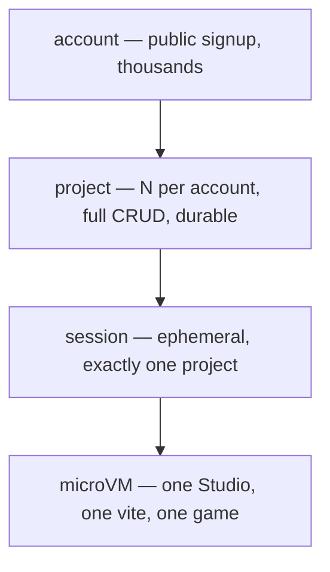
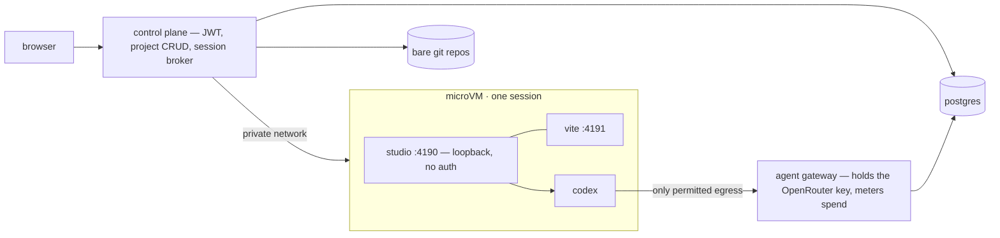

# The Studio hosting series

**This series describes work that no longer lives in this repository.** On 2026-08-16 Studio
became the paid product; its source and the `hosting/` service moved to a private repository
(PRD-129), and this repository is entirely MIT with no editor in it. The series stays here as the
record of how the hosting path was designed and what was and was not proved. Read every path and
command below as pointing at the private repository, not this one.

**Status: 100–102 COMPLETE; 103 PARTIAL; 104 COMPLETE; 105 PARTIAL, 2026-08-16.** The product half of the series runs
on `docs/studio-hosting-series`: a container image, accounts and projects, and a session broker
that opens a live Studio and pushes every commit to the durable repository. Nothing in 103, 104
or 105 has run — no microVM has booted, no egress policy is applied, no OpenRouter request has
been made, nothing is deployed, and **no security property claimed for those three has been
tested**. What exists reaches the operator only; signup is not open to strangers.

Six PRDs, PRD-100 through PRD-105. They exist because `@threenative/studio` today is a
**loopback single-project developer tool** and the product being asked for is a **public
multi-tenant service** where any stranger signs up, creates as many games as they want, and
vibe-codes them in a browser.

| PRD | What a user gets | Depends on | Status |
|---|---|---|---|
| [100](../done/PRD-100-studio-sandbox-image.md) | Studio runs inside a container against a cloned repo, identical loop to `pnpm studio` | — | COMPLETE |
| [101](../done/PRD-101-accounts-and-project-crud.md) | Sign up, log in, create/rename/fork/delete games; they survive a restart | — | COMPLETE |
| [102](../done/PRD-102-session-broker.md) | A live Studio with preview, and create/load/rename/delete of games from inside it | 100, 101 | COMPLETE |
| [103](./PRD-103-sandbox-boundary.md) | Every session runs in its own microVM with default-deny egress; production cannot boot without it | 102 | PARTIAL — guard + containment proved, no microVM booted |
| [104](../done/PRD-104-codex-openrouter-gateway.md) | Chat is answered by Codex over OpenRouter, on a platform key the sandbox never sees, metered per user | 102 | COMPLETE |
| [105](./PRD-105-production-lane.md) | Deployed, backed up, restorable; account settings and visible spend; open to public signup | 103, 104 | PARTIAL — quotas + signup gate done; deploy blocked |

**The service is not deployable today and must not be.** 103's containment is real and proved by
probes that run — a sandbox cannot reach the database, holds no capabilities, and is capped on
pids and memory. Its *kernel* boundary is not: no microVM has booted, so two sessions still share
a kernel, and a sandbox can still reach the control plane. Everything here is operator-only until
that changes, and 105 does not start before it does.

100–102 build the product. 103 and 104 are what make it survivable in public. 105 is the only
PRD that exposes it to strangers, and it does not start until 103 and 104 are both closed.

---

## The three nouns, because collapsing them is the design error



- **Account.** Anyone signs up. Email and password against a JWT session in PRD-101, with a
  separate `identities` table from day one so Google OAuth is a new row rather than a migration
  of who a user is.
- **Project.** A game. Each account owns many. Metadata in Postgres, source in a bare git repo
  per project. Create, rename, fork, delete, list. **Nothing executes** — this is an ordinary
  web application, which is why it ships before any sandboxing exists.
- **Session.** One account opening one project. A microVM boots, clones that project's repo,
  runs one Studio pinned to that one game. Checkpoints push back to the bare repo. Idle, and the
  VM dies while the repo survives. Two projects open at once is two VMs.

**One project per sandbox is what makes public signup survivable, not what limits the product.**
A Studio process holding many customers' projects means one escape reads every game on the box.

---

## Studio is not modified into a multi-tenant server, and it is not forked

`packages/studio/src/server.ts:936` binds `127.0.0.1`. That single line is the entire security
model of the local tool, and it is the correct one: there is no authentication on any route,
`PUT /api/file` (`server.ts:814`) writes arbitrary project paths, and `POST /api/chat`
(`server.ts:832`) runs an agent with write access and a shell. Exposed on a public interface,
that is unauthenticated remote code execution.

The series therefore **changes none of it**. Studio stays loopback-only, single-project, and
unauthenticated. Every hosted concern lives outside the sandbox:



**The VM boundary is the authentication boundary.** Studio never learns that tenants exist, so
`@threenative/studio` gains no security code, and the hosted product runs the same published
package a local user runs. Two copies of Studio would be a fork, and a fork diverges silently.

Where a hosted requirement genuinely needs a change *in* Studio — PRD-104's Codex provider
configuration is the one known case — it lands in the package and ships to local users too.

---

## Where the code lives

A new top-level `hosting/` tree, **not** `packages/`.

```
hosting/
  compose.yaml          the production topology, on a laptop
  control-plane/        JWT auth, project CRUD, session broker, preview proxy
  gateway/              OpenRouter proxy: platform key, metering, budget caps
  sandbox/              the session image and its entrypoint
  drivers/              docker (local) and machine (production)
```

Three reasons, all mechanical:

1. **It is not a framework package.** A package exists only when it carries a dependency the
   others must not inherit. A control plane carries Postgres, a container API and an HTTP
   framework that no game should ever inherit — and it is never published, so it is an
   application, not a package.
2. **The framework LOC review trigger counts `packages/*/src`.** Putting a SaaS backend there
   would inflate the number that exists to tell you whether the *framework* is growing, and a
   number routed around is worse than no number.
3. **The PRD directory has no file-count cap.** `pnpm budgets` reports current counts and LOC
   triggers; lifecycle folders keep active proposals, blocked work, and completed records
   distinguishable.

`hosting/` needs its own `AGENTS.md`, added in PRD-100, because the rules for a deployed service
are not the rules for a framework.

---

## What "public" adds, and where each item is answered

| Public-signup risk | Answered by |
|---|---|
| Agent-written code executes on your machines by design — this is RCE as a feature | [103](./PRD-103-sandbox-boundary.md): microVM per session, non-root, disposable filesystem |
| A sandbox reaching the control plane, Postgres, or cloud metadata at `169.254.169.254` | [103](./PRD-103-sandbox-boundary.md): default-deny egress, allowlist of gateway and registry only |
| A stranger burning the platform OpenRouter key | [104](../done/PRD-104-codex-openrouter-gateway.md): key never in the sandbox, per-account budget, hard cutoff |
| Miners and abuse consuming compute | [103](./PRD-103-sandbox-boundary.md) caps and idle reap; [105](./PRD-105-production-lane.md) quotas |
| Losing a customer's game | [101](../done/PRD-101-accounts-and-project-crud.md) git as source of truth; [105](./PRD-105-production-lane.md) restore drill |

---

## The one decision that stops "we will harden it later"

Hardening deferred to a later PRD is a promise, and promises lose to launch day. So the boundary
is not a promise; it is a condition the control plane refuses to start without.

PRD-102 introduces the `SandboxDriver` seam with a Docker implementation, and PRD-103 adds the
`machine` implementation for production microVMs plus a guard that throws at boot when the Docker
driver is selected outside a local environment. The negative control is a test asserting the throw. The
weak configuration is not something to remember to avoid; it is something the service cannot run.

The microVM boundary is **rented, not built**. Firecracker as a service (Fly Machines, or E2B or
Modal on the same driver interface) gives the per-session kernel boundary for a config value.
Self-hosting the VMM means owning bare-metal KVM hosts, TAP networking, rootfs images, a
scheduler and the jailer — a quarter of infrastructure work that is not ThreeNative, and whose
predictable outcome is shipping the container path "just for the beta."

**A microVM is not a security posture on its own.** It does nothing about egress or about a key
sitting in an environment variable the agent can read. Those stay non-optional in 103 and 104.

---

## Agent configuration: Codex, and OpenRouter only in production

Studio already speaks Codex — `agentProtocol.ts:14` builds the `codex exec --json` invocation,
and `--agent codex` selects it.

- **Development** uses the operator's own Codex install, unchanged. No gateway, no metering, no
  OpenRouter. This is the loop you already have.
- **Production** points Codex at the gateway, which forwards to OpenRouter with the platform key
  and records spend against the account.

The known obstacle, found while reading the code and owned by PRD-104: `agentProtocol.ts:35`
passes `--ignore-user-config`, so a `~/.codex/config.toml` describing an OpenRouter provider is
ignored by construction. The provider has to be injected through `-c` overrides or environment,
and that is a change inside `@threenative/studio` rather than something the hosting layer can
work around.

---

## What this series does not do

- **No GUI that writes a scene.** Studio proceeds as an agent editing plain TypeScript; a visual
  scene editor stays closed, and hosting does not reopen it.
- **No change to games, templates, the native runtime, or any framework package** beyond the
  single Codex provider change in PRD-104.
- **No claim about mobile, device, or native readiness.** Nothing here executes on a phone.
- **No billing.** PRD-104 meters spend and enforces a cap; charging money is not in the series.
- **No SLA.** PRD-105 deploys the service and proves a restore; it does not promise uptime.

Two facts a reader should carry out of this folder: **nothing here has been built**, and **no
stranger has played a ThreeNative game for five minutes yet** — the blocked test in
[PRD-080](../BLOCKED/requires-external-person/PRD-080-five-minute-stranger-test.md). This series describes the shape a public
Studio would take, so that the day it is started the answer is a plan rather than a quarter of
design.
