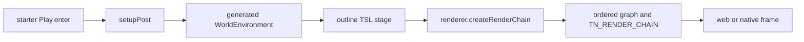

# PRD-347 — game-authored post stages enter the measured chain

**Status:** PROPOSED — filed 2026-09-03 against `fa647b34`. Parent batch:
[stylized-components](./README.md). Source studied:
[`cortiz2894/stylized-components`](https://github.com/cortiz2894/stylized-components) at
`c0c02c47971e70b214a25de01ac9633e7608fc84`, especially
`src/components/outline/OutlineFilter.tsx:10-198` and
`src/components/painterlyStarter/PainterlyStarter.tsx:52-72` (MIT). Nothing copied.

**Goal: a generated game can put its own TSL post stage into the existing ordered, tiered and
reported render chain without teaching the engine that stage's visual vocabulary.** The first live
consumer is a scale-stable ink outline in the starter's generated `src/render/` source.

**Complexity:** +2 touches 6–10 files, +2 changes ordering/state validation, +2 crosses core and the
generated template = **6 → MEDIUM mode**.

## 1. Problem and incumbent census

`RenderChain` claims that every stage factory comes from the game, but `createStageDefinitions()`
throws unless `stage.name` is one of the engine's fifteen names, and `normalizeRequestedStages()`
sorts through the same closed constant. A game can replace the implementation of `bloom`; it cannot
add `outline`, `colourGrade`, or any other authored node and retain the chain's quality drops,
availability reasons, velocity provisioning, lifecycle or observation.

| Existing thing | Relationship |
| --- | --- |
| `RenderChain` | Keep it. Open its stage identifier and ordering seam; do not create a second composer. |
| `WorldEnvironment` in each template | Keep it as the generated owner of stage factories and look values. Starter becomes the first caller. |
| `RENDER_CHAIN_STAGE_ORDER` | Remains the canonical order for built-ins. Custom stages explicitly anchor before or after a named stage. |
| Three.js TSL `pass`, depth and output nodes | Use directly in generated source. No `postprocessing` or GLSL compatibility layer. |
| Upstream `OutlineEffect` | Algorithm reference only. Its WebGL effect class, React wrapper and Leva controls are refused. |

The defect is engine-layer because a portable game cannot use the chain's reporting/quality seam
without pretending its effect is a built-in. The outline is game-layer because its colour,
threshold, thickness and source decide how the frame looks.

## 2. Integration ledger

`→impl` must become a real non-test `file:line` before a phase closes.

| # | New thing | Live caller (`file:line`, non-test) | Replaces | Old path removed? | Negative control |
| --- | --- | --- | --- | --- | --- |
| 1 | Open stage identifier plus `before`/`after` anchor | `RenderChain.#apply:→impl` resolves every supplied stage before building the graph | Closed-name rejection in `render/chain.ts:528-553` | yes | restore the closed-name guard; starter outline request throws |
| 2 | Deterministic dependency ordering | same constructor/apply path, reached by every `renderer.createRenderChain()` | filtering solely through `RENDER_CHAIN_STAGE_ORDER` | yes | introduce an anchor cycle; construction throws with all stage ids |
| 3 | Custom ids in `TN_RENDER_CHAIN` and playtest observation | `packages/core/src/playtest.ts:→impl` reads the renderer report generated by the starter run | reports that can name built-ins only | yes | drop `outline` from the report; scenario fails closed |
| 4 | Generated `outline` TSL stage | starter `worldEnvironment.ts:→impl`, reached by `setupPost()` from `Play.enter` | no incumbent outline | n/a | force strength to zero; edge-region capture assertion fails |
| 5 | Tier ownership | starter `quality.ts:→impl` requests or drops `outline` by authored tier | hidden always-on effect | n/a | request it on `off`; report assertion fails |
| 6 | Cross-target consumer | the same scaffolded starter source in web and packed Linux desktop playtests | upstream WebGL/R3F-only proof | n/a | add a browser branch; source/hash conformance fails |

## 3. Reachability and API contract



The public type change is deliberately small:

```ts
interface IRenderChainStage {
  readonly name: string;
  readonly before?: string;
  readonly after?: string;
  readonly build: (input: unknown, context: IRenderChainStageContext) => unknown;
  // existing availability, tier and velocity members remain
}
```

- Built-ins need no anchor and retain `RENDER_CHAIN_STAGE_ORDER` exactly.
- A non-built-in supplies exactly one of `before` or `after`. Anchors may name a built-in or another
  supplied stage. Same-anchor siblings retain the supplied array order.
- Blank ids, duplicates, missing anchors, both anchors, cycles and requested ids with no supplied
  definition throw before any output node is installed. No partial chain is allowed.
- `RenderChainStageName` remains the built-in union for callers that want it;
  `RenderChainStageId = RenderChainStageName | (string & {})` names report/request values without
  adding visual names to core.
- Velocity stays explicit. A custom stage opts into the existing `requiresVelocity`; its spelling
  never silently activates velocity.

## 4. Execution phases

### Phase 0 — the current chain proves it cannot carry the consumer

**User-visible outcome:** the existing starter-look scenario has a red assertion naming the missing
`outline` stage, and the verification record pins the baseline frame and stage report.

**Files (4):**

- `packages/create-threenative/templates/starter/src/render/worldEnvironment.ts` — EDIT TEMPORARILY: request a no-op `outline` stage through the real chain.
- `packages/create-threenative/templates/starter/playtests/look.playtest.json` — EDIT: require `outline` in the observed chain.
- `packages/create-threenative/__tests__/looks.spec.ts` — EDIT: collect the generated-source caller.
- `docs/verification/prd-347-custom-render-stage-2026-09-03.md` — NEW: paste command, failure and current capture hash.

**Required red:** `unknown render-chain stage 'outline'`; a blank or non-starting scene is the wrong
red. Revert only the temporary no-op after recording it.

### Phase 1 — one ordered extension seam and one live outline

**User-visible outcome:** a freshly scaffolded starter has a subtle, scale-stable outline authored
entirely in `src/render/`, and `TN_RENDER_CHAIN` names it.

**Files (5):**

- `packages/core/src/render/chain.ts` — EDIT: validate identifiers and topologically resolve anchors.
- `packages/core/src/index.ts` — EDIT: export the widened stage-id type and document the authored-stage situation.
- `packages/core/__tests__/render-chain.spec.ts` — EDIT: ordering, stability and fail-closed cases.
- `packages/create-threenative/templates/starter/src/render/outline.ts` — NEW: TSL Sobel stage; no presets or React.
- `packages/create-threenative/templates/starter/src/render/worldEnvironment.ts` — EDIT: construct and request the stage from the existing setup path.

**Tests and observed controls:**

| Test | Pass condition | Mutation that must go red |
| --- | --- | --- |
| `should keep built-ins canonical while anchoring authored stages` | built-ins unchanged; `outline` at its declared edge | ignore `after`; order differs |
| `should preserve supplied order for siblings on one anchor` | stable array order | sort custom ids alphabetically |
| `should reject invalid authored stage graphs before installing output` | blank, duplicate, missing anchor, both anchors and cycle throw; `setOutputNode` untouched | skip cycle validation |
| starter caller census | `worldEnvironment.ts` imports and requests `outline` | remove request; template test fails |

### Phase 2 — tier, visual assertion and clean-install proof

**User-visible outcome:** high/medium tiers show the authored ink, low/off omit it by name, and a
clean installed starter proves both results.

**Files (5):**

- `packages/create-threenative/templates/starter/src/render/quality.ts` — EDIT: authored tier policy and cost note.
- `packages/create-threenative/templates/starter/playtests/look.playtest.json` — EDIT: chain and edge-region assertions.
- `packages/create-threenative/__tests__/looks.spec.ts` — EDIT: ownership and caller checks.
- `packages/core/src/playtest.ts` — EDIT only if the widened id is not already preserved unchanged.
- `docs/verification/prd-347-custom-render-stage-2026-09-03.md` — EDIT: green output, capture and controls.

Use `pnpm sandbox --genre starter --name prd-347-outline --template starter`. The scenario drives the
real game; a direct unit call to the stage is not integration proof. Inspect the high and off
captures. The edge assertion must use the player/ridge region, not whole-frame non-blank pixels.

### Phase 3 — the generated source crosses the native boundary unchanged

**User-visible outcome:** packed Linux desktop and web render the same generated outline source and
both reports name the same stage order.

**Files (5 maximum):** existing desktop conformance registry or starter target scenario — EDIT;
its collected case — EDIT/NEW; capability docs generated from `index.ts` — EDIT by build;
`docs/verification/prd-347-custom-render-stage-2026-09-03.md` — EDIT; this PRD — EDIT with evidence.

The proof compares source hash and ordered stage ids, then uses target-specific captures only for
non-blank/edge presence. It does not claim pixel identity between adapters. Android and iOS may be
recorded `UNVERIFIED`; the implementation cannot contain a platform branch.

## 5. Acceptance criteria

- [ ] A custom stage id no longer has to impersonate a built-in, while all built-in-only order tests
      remain byte-for-byte equivalent in result.
- [ ] Invalid stage graphs fail before `setOutputNode`; no unknown stage or cycle is silently dropped.
- [ ] A generated starter reaches `outline` through its pre-existing `Play.enter → setupPost →
      WorldEnvironment` flow, and the playtest observes it in `TN_RENDER_CHAIN`.
- [ ] Ink colour, threshold, thickness and enablement exist only in generated `src/render/` /
      `quality.ts`; core contains none of them.
- [ ] Zeroing outline strength makes the edge-region visual assertion red; removing the request
      makes the chain assertion red; both failures are pasted.
- [ ] Clean-install web and packed Linux desktop execute the same generated source and report the
      same ordered stage ids.
- [ ] `pnpm tsx scripts/count-loc.ts` shows the extension seam is shorter across outline plus the
      PRD-348 consumers than parallel composer/report/tier plumbing in each game; otherwise delete it.
- [ ] `pnpm typecheck && pnpm lint && pnpm test`, `pnpm test:templates`, and the targeted playtests pass.

## Out of scope

No engine-owned outline API, effect preset catalog, R3F adapter, Leva panel, WebGL fallback composer,
arbitrary render-pass resource scheduler, or default stages for templates other than the starter.
