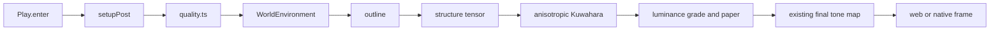

# PRD-348 — painterly paint is generated source and pays for its pixels

**Status:** PROPOSED — filed 2026-09-03 against `fa647b34`. Parent batch:
[stylized-components](./README.md). Depends on [PRD-347](./PRD-347-game-authored-post-stages-enter-the-measured-chain.md).
Source studied: [`cortiz2894/stylized-components`](https://github.com/cortiz2894/stylized-components)
at `c0c02c47971e70b214a25de01ac9633e7608fc84`, particularly `src/components/kuwahara/`,
`src/components/watercolor/` and `src/components/painterlyStarter/PainterlyStarter.tsx` (MIT).
Nothing copied.

**Goal: the starter's high tier can produce a recognisably painterly frame from editable generated
TSL source, while every lower tier and every report says exactly which part of that cost it paid.**

**Complexity:** +2 touches 6–10 files, +2 adds a two-pass half-float algorithm, +2 coordinates
scratch-target lifecycle and tier transitions = **6 → MEDIUM mode**.

## 1. Problem and decision

The upstream painterly result is not one shader. It is outline → anisotropic Kuwahara → luminance
grade/paper. The Kuwahara stage first writes a structure tensor, then samples eight sectors around
every pixel. At the upstream default radius five that is about 200 colour fetches per pixel; its
showcase uses radius nine at DPR 1. Copying the JSX or allowing DPR 2 would turn a useful look into
an unbounded phone tax.

This PRD ports the algorithmic ideas, not the component API:

- generated `src/render/kuwahara.ts` owns brush radius, anisotropy, scratch format and TSL nodes;
- generated `src/render/watercolor.ts` owns luminance steps, saturation, shadow tint and procedural
  paper;
- starter `quality.ts` owns whether each stage runs and its pixel/radius budget;
- the existing `RenderChain` owns ordering, drops, lifecycle and reports after PRD-347;
- the existing `WorldEnvironment` final output transform remains the only ACES/AgX/Neutral tone
  map. Upstream's private `wcACES()` is deliberately not ported.

No `Kuwahara3D`, `PainterlyPreset`, material class, colour, paper texture or default enters core.

## 2. Integration ledger

`→impl` is replaced with a real non-test `file:line` during implementation.

| # | New thing | Live caller (`file:line`, non-test) | Replaces | Old path removed? | Negative control |
| --- | --- | --- | --- | --- | --- |
| 1 | Generated structure-tensor + Kuwahara stage | starter `worldEnvironment.ts:→impl`, requested after `outline` by `setupPost()` | no incumbent paint stage | n/a | transpose the kernel transform; directional-flow assertion fails |
| 2 | Generated watercolour/paper stage | same world environment after paint and before final output transform | no incumbent grade | n/a | bind a black/uninitialised paper source; non-black-frame gate fails |
| 3 | Tier/radius/resolution budget | starter `quality.ts:→impl` read on every `setupPost()` | no measured paint budget | n/a | run showcase radius at DPR 2/mobile tier; frame-budget gate fails |
| 4 | Independent stage observations | existing playtest bridge reads `TN_RENDER_CHAIN` | one all-or-nothing “painterly” claim | n/a | omit `watercolor`; requested/applied assertion fails |
| 5 | Generated-project authoring guidance | starter `AGENTS.md:→impl` tells the game's agent that paint and paper are deletable render source | upstream README/Leva as ambient docs | yes | delete guidance; template-doc test fails |
| 6 | Web/native proof | same scaffolded starter source in web and packed Linux desktop | upstream WebGL-only evidence | n/a | browser-only texture or GLSL import fails native build/conformance |

## 3. Reachability and order

The first proof subject is the actual generated starter: its player, fused rock ridge, lit ground,
shadow boundaries and moving camera. A torus knot demo is rejected because it proves the filter but
not its integration with the source users receive.

## 4. Algorithm and failure contract

- Structure tensor uses half-float scratch data; 8-bit clips squared gradient sums and silently
  flattens the orientation field.
- The filter samples original scene colour plus the tensor. Feeding the prior filtered frame back
  in causes accumulating smear and fails the deterministic fixed-frame hash.
- Kernel transform is rotation × anisotropic scale applied matrix × vector. The upstream source
  documents that vector × matrix transposes the operation and produces screen-aligned strokes.
- Radius is a positive bounded integer. Resolution scale is `(0,1]`. Non-finite controls, missing
  input, unsupported scratch format and allocation failure throw/refuse with a named reason; they
  never return a literal “applied”.
- The paper field is generated deterministically before first use. Strength zero is an exact no-op;
  a missing source cannot multiply the frame to black.
- Luminance is quantised without quantising RGB channels independently, preserving hue. Tone map is
  excluded from this stage so the established output transform remains last.

## 5. Execution phases

### Phase 0 — price the real starter before admitting the look

**User-visible outcome:** fixed-camera A/B captures and pass timings decide whether the painterly
look is worth shipping at any tier. Failure closes this PRD as DECLINED with no generated paint code.

**Files (5):**

- `packages/create-threenative/templates/starter/src/render/worldEnvironment.ts` — EDIT TEMPORARILY: local challenger wired into the real chain.
- `packages/create-threenative/templates/starter/src/render/quality.ts` — EDIT TEMPORARILY: candidate radii/scales.
- `packages/create-threenative/templates/starter/playtests/look.playtest.json` — EDIT: fixed route, tone and stage observations.
- `docs/PRDs/stylized-components/PRD-348-painterly-paint-is-generated-source-and-pays-for-its-pixels.md` — EDIT: pin accepted budgets.
- `docs/verification/prd-348-painterly-admission-2026-09-03.md` — NEW: A/B, adapter, pixels, pass cost and verdict.

Measure DPR 1 and 2 at 1280×720, radii 3/5/9, full and half-resolution scratch, after 60 warm-up
and 120 steady frames. Record GPU adapter and use PRD-342's pass-cost method if it has landed;
otherwise record that ablation as `UNVERIFIED`, not zero. Admission requires blinded preference for
the challenger and a tier combination that stays inside the starter's existing target frame budget.

### Phase 1 — directional paint, with its internal values observable

**User-visible outcome:** high-tier starter surfaces form stable brush-like regions that follow
image contours; low/off are named drops.

**Files (5):**

- `packages/create-threenative/templates/starter/src/render/kuwahara.ts` — NEW: tensor and paint nodes plus disposal.
- `packages/create-threenative/templates/starter/src/render/worldEnvironment.ts` — EDIT: live stage construction and anchors.
- `packages/create-threenative/templates/starter/src/render/quality.ts` — EDIT: admitted radius and resolution scale by tier.
- `packages/create-threenative/__tests__/looks.spec.ts` — EDIT: ownership, no raw GLSL/dependency, caller and disposal checks.
- `packages/create-threenative/templates/starter/playtests/look.playtest.json` — EDIT: stage, tone and contour-region assertions.

| Gate | Pass condition | Observed red required |
| --- | --- | --- |
| Tensor orientation | known diagonal edge yields the expected signless axis | use raw gradients; opposite sides cancel |
| Kernel direction | anisotropic result differs from isotropic in the expected rotated region | transpose multiplication order |
| No feedback | same fixed frame/seed hashes identically after repeated renders | sample last filtered output |
| Tier report | high applies; lower tier drop reason names tier | hard-code stage on |
| Disposal | scratch target and nodes release exactly once | remove release path; lifecycle test fails |

### Phase 2 — paper and value treatment complete the authored look

**User-visible outcome:** the admitted tiers add deterministic paper tooth and value grouping without
double tone mapping or changing hue at every step.

**Files (5):**

- `packages/create-threenative/templates/starter/src/render/watercolor.ts` — NEW: deterministic paper and TSL grade.
- `packages/create-threenative/templates/starter/src/render/worldEnvironment.ts` — EDIT: stage after paint, before final output transform.
- `packages/create-threenative/templates/starter/src/render/quality.ts` — EDIT: independent enablement/cost notes.
- `packages/create-threenative/__tests__/looks.spec.ts` — EDIT: one tone map, deterministic source, exact no-op.
- `packages/create-threenative/templates/starter/playtests/look.playtest.json` — EDIT: independent stage and tone bounds.

Negative controls: quantise RGB separately and observe hue-drift failure; add the upstream private
ACES function and observe the one-tone-map test fail; zero paper strength and observe exact no-op;
replace paper with black and observe the blank/dark-frame guard fail.

### Phase 3 — clean install, authored guidance and native

**User-visible outcome:** a cold agent can find and edit the look, and the unchanged generated
source renders on web and packed Linux desktop.

**Files (5 maximum):** starter `AGENTS.md` — EDIT; generated `CLAUDE.md` via `pnpm sync:agents`;
existing starter target/conformance case — EDIT; verification record — EDIT; this PRD — EDIT.

Build a clean `pnpm sandbox` starter from tarballs. Its README/evidence names paint feature → this
PRD → gameplay/camera route → `renderChain`/tone/perf observation. Run green, mutate each stage to
red, restore exactly, inspect mid-route captures, then run the same scaffolded source on packed
Linux desktop. Android/iOS remain explicitly `UNVERIFIED` unless executed.

## 6. Acceptance criteria

- [ ] The actual scaffolded starter, not a gallery route, visibly uses the generated paint chain on
      at least one admitted tier and reports `outline`, `kuwahara`, and `watercolor` independently.
- [ ] Core owns none of those names, parameters or algorithms; deleting generated paint files and
      their `WorldEnvironment` rows returns the pre-change starter without a package edit.
- [ ] The tensor is measured half-float, kernel direction has an observed transpose red, and no
      prior filtered frame feeds the next.
- [ ] Paint cost is recorded by physical pixels, radius, scale and adapter after steady-state
      warm-up; no mobile/default tier inherits the showcase radius by accident.
- [ ] The output has one tone map. Luminance quantisation preserves hue within the recorded bound,
      and paper strength zero is an exact no-op.
- [ ] Each stage has an observed report red and visual red; whole-frame non-blank alone is not proof.
- [ ] Clean-install web and packed Linux desktop execute the same generated source; unsupported
      targets refuse by name rather than silently showing the bare frame as “applied”.
- [ ] `pnpm typecheck && pnpm lint && pnpm test`, `pnpm test:templates`, `pnpm budgets`, and targeted
      web/native playtests pass with output pasted into the verification record.

## Out of scope

No reusable painterly package, preset list, R3F components, Leva controls, `postprocessing`
dependency, raw GLSL path, material replacement, browser-only fallback, or rollout to every template.
Other templates adopt authored variants only through later visual PRDs with their own A/B and budget.
