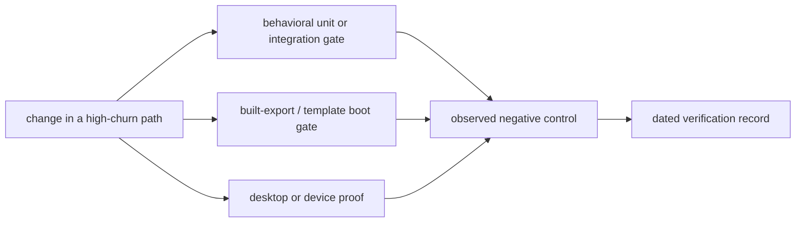

# PRD-326 — High-churn paths fail before regressions ship

**Status:** PROPOSED, filed 2026-09-02 against `5879799d`

**Complexity:** 3 (10+ files) + 2 (multi-package) = **5 → MEDIUM mode**

**Owner:** unassigned

**Source:** fix-commit churn since June, recorded false-green incidents, and the current specs
behind the most-fixed files

## 1. Context

**Problem:** The paths with the highest fix churn still have tests that bypass their live wiring,
mock the risky platform arm, or assert source text, so known regression shapes can ship through a
green suite.

**Files analyzed:**

- `packages/core/src/{game,renderer,playtest}.ts` and their existing specs
- `packages/playtest/src/runner/{cli,runner,androidRunner,bridgeClient,runner-support}.ts`
- `packages/playtest/__tests__/fixtures/app.html` and the runner/bridge specs
- `packages/runtime-native/src/webgpu/{bindings,context}.cpp` and native contract tests
- `scripts/check-capability-docs.ts`, its spec, and `capabilities.json`

### Measured risk

Files touched by at least three `fix:` commits, excluding tests and workflows:

| Fixes | File | Gap in the current proof |
| ---: | --- | --- |
| 30 | `packages/playtest/src/runner/runner.ts` | the fixture does not exercise delayed `runtime.startup` through the real runner |
| 23 | `packages/core/src/game.ts` | renderer doubles are four-key literals and several specs inspect source text |
| 18 | `packages/runtime-native/src/webgpu/bindings.cpp` | contract tests audit text; no windowed surface path executes |
| 12 | `packages/playtest/src/scenario.ts` | no gap found; keep its existing coverage |
| 10 | `packages/playtest/src/assertions.ts` | evaluators are covered, but batch exit-code aggregation is not |
| 9 | `packages/runtime-native/src/webgpu/context.cpp` | requested-feature construction is checked; granted-feature reporting is not |
| 9 | `packages/physics/src/plugin.ts` | web uses real Rapier; the native unit arm is entirely mocked |

Two `game.ts` fixes landed without behavioral regression tests: render-cadence compute behind the
loader (`16c946b2`) and `compileSettled` (`8cf0bc48`). The entity-drift fix (`a6392695`) changed
scenario JSON only. Three consecutive stderr-summary fixes changed no spec. This is the same
false-green family recorded by PRD-075, PRD-304, the minimal-template white frame, and the
platformer budget spec that pinned a false measurement.

### Incumbent census and boundaries

- [PRD-293](./PRD-293-gameplay-and-compute-agree-about-startup.md) owns the policy for when gameplay
  and compute start. Phase 1 here supplies its missing frame-level regression trace; it must not
  choose a second startup policy.
- `startupReady.ts` and `startup-ready.spec.ts` already prove the helper's arithmetic and terminal
  errors. Phase 2 proves the live runner and Android runner actually call it before sampling.
- `check-capability-docs.ts` already validates manifest documentation. Phase 4 extends its proof to
  imports from built package exports; it does not create another manifest.
- Existing playtest, conformance, template, and native-physics harnesses are the entry points. This
  PRD adds no package, public API, renderer abstraction, or appearance decision.

## 2. Solution

1. Start with the five cheap, highest-yield behavioral gates: startup trace, batch exit codes,
   startup wait wiring, scene retargeting, and built-export resolution.
2. Then cover timeout wiring, GPU timestamp propagation, contact/entity observations, and native
   feature reporting.
3. Replace source-text and impossible-production tests with behavioral contracts.
4. Finish with the display/device proofs that unit tests cannot provide.

**Key decisions:**

- Test externally observable behavior or live wiring; do not add new source-text assertions.
- Use the hardest real subject available: the opaque startup layer, a two-pass output graph, all
  manifest import paths, the six unbooted templates, and real Rust physics.
- A newly exposed product defect is fixed in its owning package in the same phase as the red test.
- Missing observations, malformed capabilities, ambiguous pass graphs, and unavailable target
  behavior fail closed with an existing named error or a new explicit one.

**Data changes:** None.

## 3. Integration Ledger

Implementation fills every `TBD` with the final non-test or test-runner `file:line`. For a gate,
the live caller is the repository command that collects it; a spec that is not collected is dead.

| # | New gate or corrected behavior | Live caller at implementation | Replaces | Negative control |
| ---: | --- | --- | --- | --- |
| 1 | startup frame trace | `pnpm test` → core Vitest config (`TBD`) | source-text startup checks | invert the startup compute guard; trace fails |
| 2 | batch exit code is worst-of | `pnpm test` → playtest Vitest config (`TBD`) | no batch-level proof | return the last code; `[fail, pass]` fails |
| 3 | runner waits for advertised startup | browser and Android runner call sites (`TBD`) | helper-only proof | delete either call site; first sample occurs while collapsing |
| 4 | output graph retargets on `goto` | renderer frame path (`TBD`) | vacuous `{}` output-node fixture | retain scene A; scene-B assertion fails |
| 5 | manifest imports resolve from `dist` | root capability-doc gate (`TBD`) | `dist`-to-`src` rewrite as sole proof | remove one export-map entry; import gate fails |
| 6 | bridge operations use their intended timeout | `BridgeClient` transport calls (`TBD`) | arithmetic-only proof | omit the third `advance` argument; recorded call fails |
| 7 | positive GPU time reaches a frame window | game loop → frame budget (`TBD`) | cadence test with timestamp `0` | suppress timestamp assignment; `gpuMs` stays absent |
| 8 | contacts and entity drift use observed entities | playtest bridge and runner report (`TBD`) | shallow lookup and zero fallback | restore shallow lookup/zero fallback; assertions fail |
| 9 | requested and reported native features agree | native context initialization (`TBD`) | builder-only source audit | omit one requested feature from reporter; set equality fails |
| 10 | behavioral core contracts replace text checks | core runtime entry points (`TBD`) | four `readFileSync(...).toContain` tests | invert behavior while preserving text; behavioral gate fails |
| 11 | fixture limits and capabilities match production | fixture served by runner (`TBD`) | hand-copied limits and impossible capability | drift either producer; deep equality/validation fails |
| 12 | six currently unbooted templates load a real frame | template test command (`TBD`) | build-only coverage | inject a boot exception/blank canvas; smoke fails |
| 13 | native surface and physics execute real backends | desktop/device harnesses (`TBD`) | source audit and mocked native physics | swap an argument or perturb floor contact; target proof fails |

## 4. Reachability

**How will this work be reached?**

- [ ] Entry points: `pnpm test`, `pnpm test:templates`, desktop conformance, and native target
  playtests.
- [ ] Pre-existing collectors edited: the owning Vitest suites, template verifier, conformance
  registry/runner, and native physics parity verifier.
- [ ] Registration: every new spec matches an existing test glob; every target proof is selected by
  an existing command and appears in its test count or registry report.

**Is this user-facing?** No. It is release evidence triggered by repository gates. The user-visible
effect is that a regression is rejected before a game or agent consumes it.

**Full flow:** an engineer changes a high-churn path → the owning standard command executes the new
gate → the gate observes the live caller/backend → a regression exits non-zero with a named cause →
the phase records both the seeded red and repaired green under `docs/verification/`.

**What does this replace?** Source-text assertions, helper-only tests, hand-copied fixture values,
and mocked platform claims named in Phases 1–7. Existing useful tests remain.

## 5. Execution phases

#### Phase 1: Startup, batch verdicts, and startup waits become observable

**Outcome:** A premature compute/world frame, a collapsed batch exit code, or a skipped startup wait
fails the normal suite.

**Files (max 5):**

- `packages/core/__tests__/game.spec.ts` — EDIT: captured-frame startup trace
- `packages/playtest/__tests__/cli-usage.spec.ts` — EDIT: multi-scenario and lock-timeout cases
- `packages/playtest/__tests__/fixtures/app.html` — EDIT: delayed/stuck startup modes
- `packages/playtest/__tests__/runner.spec.ts` — EDIT: browser runner ordering and stuck startup
- `packages/playtest/__tests__/device-playtest.spec.ts` — EDIT: Android runner ordering

**Implementation:**

- [ ] Drive captured `requestAnimationFrame` callbacks with an opaque canvas layer and a loader with
  children; record `[computeDispatched, worldRendered, overlayRendered]` for every frame.
- [ ] Assert zero compute before `startup.ready`, compute on the first ready frame, and an overlay
  frame strictly before the first world frame, following PRD-293's chosen startup policy.
- [ ] Call `main(argv)` with `[pass, fail]`, `[pass, framebuffer-window-not-reached]`, and a thrown
  `CaptureLockTimeoutError`; assert returned codes and `process.exitCode` are `1`, `2`, and `75`.
- [ ] Serve `runtime.startup` as `collapsing` for N polls; assert browser and Android take their first
  `sample()` only after readiness, while a permanently collapsing fixture fails
  `TN_PLAYTEST_STARTUP_NOT_READY`.

**Wiring:** Fill ledger rows 1–3 and confirm both runner call sites invoke the existing startup-wait
helper. No second readiness implementation is allowed.

**Required negative controls:** invert the compute guard; replace worst-of aggregation with last
code; remove each startup-wait call site independently. Observe all four reds before restoring.

**Checkpoint:** run the affected core and playtest specs, then the automated PRD checkpoint with the
integration audit. Continue only on PASS.

#### Phase 2: Renderer scene changes and GPU timing reach the frame report

**Outcome:** Post-processing follows `goto`, and a resolved positive GPU timestamp appears in the
same frame-budget surface games and playtests read.

**Files (max 5):**

- `packages/core/src/renderer.ts` — EDIT only if the new red exposes missing fail-closed behavior
- `packages/core/__tests__/renderer.spec.ts` — EDIT: explicit two-pass graph and `worldPass`
- `packages/core/__tests__/gpu-timestamp-resolve-cadence.spec.ts` — EDIT: positive/rejected results
- `packages/core/__tests__/game-frame-budget-surface.spec.ts` — EDIT: window propagation

**Implementation:**

- [ ] Install two `isPassNode` descendants plus an explicit `worldPass`; render scene A then B and
  assert `worldPass.scene === sceneB`.
- [ ] Make the ambiguous two-pass/no-`worldPass` path throw a named error or emit an asserted warning;
  it must never silently retain scene A.
- [ ] Resolve a positive `info.render.timestamp` and assert `frameBudgetWindow().gpuMs` equals it.
- [ ] Reject timestamp resolution and prove `gpuMs` remains absent while N frames still complete.

**Wiring:** Fill ledger rows 4 and 7. The test must drive renderer/game entry points rather than call
`findSoleOutputPass` or the frame-budget accumulator directly.

**Required negative controls:** retain scene A after retarget; feed only timestamp `0`; let a rejected
promise escape. Each mutation must fail its intended assertion.

**Checkpoint:** affected core specs plus automated integration review.

#### Phase 3: Published capabilities and bridge timeouts prove their live contracts

**Outcome:** Every capability import handed to an agent resolves from built package exports, and
long advances receive the calculated transport timeout.

**Files (max 5):**

- `scripts/check-capability-docs.ts` — EDIT: validate built import paths without rewriting to `src`
- `scripts/__tests__/check-capability-docs.spec.ts` — EDIT: built-package export fixture
- `packages/playtest/__tests__/bridgeClient.spec.ts` — EDIT: transport call recording
- `packages/playtest/src/runner/bridgeClient.ts` — EDIT only if the seeded red finds drift

**Implementation:**

- [ ] For every distinct `importPath` in `capabilities.json`, import the built package and assert each
  declared `symbol` is an own key.
- [ ] Fail with the import path and symbol; never fall back from `dist` to `src` for this gate.
- [ ] Record `(method, arg, timeoutMs)` on a fake `IBridgeTransport`; assert a 600-tick `advance` uses
  `advanceTimeoutMs(600)` while `sample`, `ready`, and `describe` use the default timeout.

**Wiring:** Fill ledger rows 5–6. The manifest check must run from a pre-existing root gate after
packages build, or state its build prerequisite explicitly and fail when `dist` is missing.

**Required negative controls:** remove one symbol from a package export map; omit the transport's
third argument. Both standard commands must turn red.

**Checkpoint:** targeted script/playtest specs, `pnpm build`, the capability-doc command, and the
automated integration review.

#### Phase 4: Playtest observations cannot disappear or become invented zeroes

**Outcome:** Nested physics bodies, bounded contact history, and late-appearing entities produce
truthful observations across scene changes.

**Files (max 5):**

- `packages/core/src/playtest.ts` — EDIT: fix only defects exposed by the behavioral cases
- `packages/core/__tests__/playtest.spec.ts` — EDIT: nested body, `goto`, and bounded burst cases
- `packages/playtest/src/runner/runner-support.ts` — EDIT: fix only observed fallback defects
- `packages/playtest/__tests__/movement-evidence.spec.ts` — EDIT: first-observed drift cases

**Implementation:**

- [ ] Register a body at `entity.physics.rigidBody`; assert the contact names the registered entity.
- [ ] Assert `goto` clears prior contacts and a burst never exceeds
  `PLAYTEST_PROTOCOL_LIMITS.maxEventsPerDrain`.
- [ ] With the subject absent at warmup and displaced after appearing, measure first-observed to
  last-observed distance and report `observed: true`.
- [ ] An entity seen once reports `observed: false`; movement assertions fail instead of accepting
  an invented zero distance.

**Wiring:** Fill ledger row 8. Drive the real bridge sample/report builders, not extracted math.

**Required negative controls:** restore one-level indexing, preserve history across `goto`, and
default missing windows to zero. Each produces a distinct red.

**Checkpoint:** affected core/playtest specs plus automated integration review.

#### Phase 5: Native WebGPU's requested and reported feature contracts cannot drift

**Outcome:** All three context initialization paths request, unpack, and report the same feature
state.

**Files (max 5):**

- `packages/runtime-native/src/webgpu/context.cpp` — EDIT: synchronize reporter if the test is red
- `packages/runtime-native/tests/webgpu-bindings-contract.test.mjs` — EDIT: set equality and three
  call-site blocks

**Implementation:**

- [ ] Parse the requested-feature builder and `reportGrantedFeatures`; assert set equality,
  including `TextureAdapterSpecificFormatFeatures`.
- [ ] Assert the three initialization call sites carry the same required-feature unpack contract,
  including `hasTimestampQuery_`.
- [ ] Prefer extracting one shared non-appearance helper if exact block comparison would preserve
  three live implementations; do not broaden the public API.

**Wiring:** Fill ledger row 9 and identify all three non-test initialization callers.

**Required negative controls:** omit the texture feature from the reporter and remove
`hasTimestampQuery_` from only the windowed branch; observe separate failures.

**Checkpoint:** native contract test plus automated integration review. Do not claim a runtime
platform from this source contract alone.

#### Phase 6: Vacuous core and fixture contracts are removed

**Outcome:** Behavioral inversions and protocol drift fail even when source strings and copied
fixtures remain unchanged.

**Files (max 5):**

- `packages/core/__tests__/game.spec.ts` — EDIT: delete/replace its source-text assertion
- `packages/core/__tests__/probe-volume.spec.ts` — EDIT: replace two source-text assertions
- `packages/core/__tests__/input.spec.ts` — EDIT: replace its source-text assertion
- `packages/core/__tests__/playtest.spec.ts` — EDIT: real bridge reports only registered capabilities
- `packages/playtest/__tests__/fixtures/app.html` — EDIT: derive or verify protocol limits

**Implementation:**

- [ ] Replace four `readFileSync(...).toContain(...)` cases with behavior through public/internal
  runtime entry points; delete any check already covered by a stronger phase gate.
- [ ] Replace the contributed `runtime.example` case with the real core bridge's
  `describe().capabilities`, passed through `unknownPlaytestCapabilities`, yielding `[]` unknowns.
- [ ] Import `PLAYTEST_PROTOCOL_LIMITS` into the fixture build path, or assert fixture and production
  producers deep-equal so drift fails loudly.

**Wiring:** Fill ledger rows 10–11. Every replacement runs under an existing collected suite.

**Required negative controls:** invert each behavior while retaining its old source token; change
one production protocol limit without updating the fixture.

**Checkpoint:** affected core/playtest specs plus automated integration review.

#### Phase 7: Real boot, surface, and physics paths close the platform gaps

**Outcome:** The six previously unlaunched templates render, the windowed surface presents twice,
native physics agrees on feet-on-floor, and a stalled loop preserves fixed-step physics.

**Files (max 5 per slice):** This phase is implemented as four checkpointed slices; no slice may
touch more than five files.

1. **Template boot:** edit `scripts/verify-template-playtests.ts` and its existing spec/CI caller to
   scaffold each of the six uncovered templates, run `vite build`, load 60 frames, require zero
   console errors, and reject a blank canvas.
2. **Windowed WebGPU:** edit the existing native conformance registry/runner and windowed context
   test to acquire/present two frames with non-null views and no device error.
3. **Native physics:** edit the existing native physics parity verifier/registry and port the real
   `character.spec.ts` feet-on-floor subject to the Rust host; assert agreement, not merely that web
   JSON exists.
4. **Loop stall:** edit the existing loop/physics integration spec to inject a 500 ms stall; every
   `simulation.step` remains `1/60`, with no one-step gravity jump.

**Wiring:** Fill ledger rows 12–13 with each command, selected case, and backend. A target not
executed is `UNVERIFIED`, never passed.

**Required negative controls:** inject a template boot exception and blank frame; swap windowed
surface arguments; perturb native floor contact; forward wall-clock delta to physics. Record each
target's red before its green.

**Checkpoint:** automated integration review after each slice. Windowed and native-physics slices
also require the relevant desktop/device execution and a dated evidence record.

## 6. Verification and evidence

Each phase writes one run record under `docs/verification/` containing the baseline SHA, exact
command, exit code, collected test count, seeded mutation, red output, restored green output, and
targets actually executed.

- [ ] Targeted specs pass after each phase and were observed red under their named mutation.
- [ ] `pnpm typecheck && pnpm lint && pnpm test` exits 0 after the final slice.
- [ ] `pnpm test:templates` exits 0 and names all templates it booted.
- [ ] `pnpm budgets` exits 0; `pnpm quality` records the source-text assertion reduction.
- [ ] Native evidence names desktop, Android device/emulator, or iOS explicitly; no result is
  generalized to an unexecuted platform.

## 7. Acceptance criteria

- [ ] Deleting or bypassing each of the 13 ledger items breaks an existing collected command or
  live target flow; no gate exists only as an uncollected file.
- [ ] The startup trace protects PRD-293's single chosen policy without creating a second policy.
- [ ] Batch verdicts preserve the worst exit code, including exit `75` for capture-lock timeout.
- [ ] Scene transitions retarget explicit post-processing world passes and reject ambiguity.
- [ ] Built capability imports, bridge timeouts, GPU time, contacts, drift, native feature reporting,
  template boot, surfaces, and native physics all have observed negative controls.
- [ ] The four source-text assertions and the impossible `runtime.example` production contract are
  removed or replaced by stronger behavioral proof.
- [ ] The Integration Ledger contains zero `TBD` cells, and all automated checkpoints pass.

## 8. Explicit exclusions

- Do not redesign startup semantics here; PRD-293 owns that decision.
- Do not change renderer appearance, template look, physics tuning, or assertion thresholds to make
  a gate green.
- Do not introduce a new test runner, scene format, capability manifest, or native renderer.
- Do not call a source-text native contract a platform execution.
- Do not edit `examples/abyss-vanilla/`.
