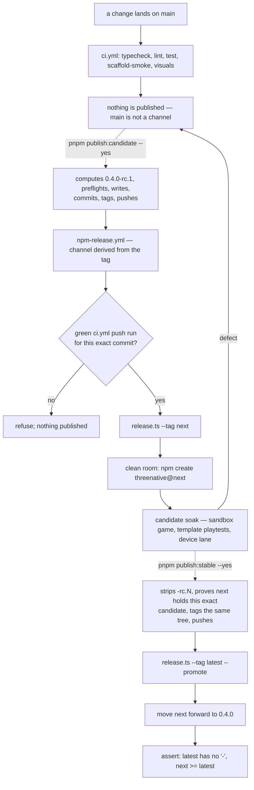

# PRD-302 — The release-candidate channel: a version strangers can try before it becomes the version they get

**Status:** OPEN, filed 2026-08-31 against `1c2f1550`. Planning only. Every §1 number is a read of
the tree and of `registry.npmjs.org` at that commit, taken the same day. No publish was performed.

**Outcome:** ThreeNative can publish a version that only people who asked for it receive. `npm
install @threenative/core` keeps resolving the last stable release; `npm install
@threenative/core@next` resolves the candidate. A candidate that turns out broken costs nothing to
abandon, because nobody's `^0.4.0` ever resolved to it. Today there is no such thing: `pnpm
release` has one destination, and every publish is instantly what every consumer gets.

**Depends on:** nothing. Every piece it modifies is already live and green — `pnpm publish:check`,
`scripts/release.ts`, `npm-release.yml`, `native-release.yml`, `verify-registry-install.ts`.

**Unblocks:** the registry half of
[PRD-060](../BLOCKED/requires-release-credentials/PRD-060-promoted-consumer-distribution.md), which
names a "release-candidate/evidence system" among its blocked prerequisites and cannot rehearse a
promotion policy that does not exist.

**Complexity: 8 → HIGH mode.** +3 (10+ files), +2 (multi-package: every manifest in the publish
set), +2 (two CI release lanes plus an external registry), +1 (an action that cannot be undone —
an npm version is immutable and a wrongly-moved `latest` tag is visible to every consumer within
seconds).

**Blast radius (phase-gated).**
Phase 1: `scripts/version-set.ts` (new), `scripts/__tests__/`, root `package.json`, every
`packages/*/package.json` version field, `packages/create-threenative/templates/*/package.json`.
Phase 2: `scripts/release.ts`, `scripts/check-publish-state.ts`, `scripts/__tests__/`.
Phase 3: `.github/workflows/npm-release.yml`, `.github/workflows/native-release.yml`.
Phase 4: `scripts/verify-registry-install.ts`, `scripts/__tests__/`.
Phase 5: `scripts/publish-channel.ts` (new), `scripts/__tests__/`, root `package.json`.
Phase 6: `docs/architecture/RELEASING.md` (new), `docs/README.md`, `README.md`, `AGENTS.md`,
`packages/create-threenative/{AGENTS.md,README.md}`, `packages/core/README.md`,
`packages/runtime-native/AGENTS.md`, `scripts/__tests__/release-docs.spec.ts` (new),
`docs/verification/` — the full list and its gates are §5.

---

## 1. Context

### The problem, stated once

`scripts/release.ts:189-200` builds the publish argv:

```ts
run("pnpm", ["--filter", name, "publish", "--no-git-checks", "--access", "public", ...])
```

There is no `--tag`. npm's default is `latest`. So the instant `pnpm release --yes` finishes, every
`npm install @threenative/core` on earth resolves to whatever just went up. There is no channel a
version can sit on while it is being tried, and no version string that a caret range refuses to
match. The only two states a change can be in are *unpublished* and *what everybody gets*.

That has already cost a release. PRD-119 records that 0.2.0 took four publishes instead of one, and
two of the extra three were defects found only after the artifact was public — a `create-threenative`
that was a no-op when installed, and a peer range that made `npm install` die with ERESOLVE. Both
were then unfixable in place: npm versions are immutable, so the repair is a new version and the
broken ones stay on the registry forever, deprecated. A candidate channel is the difference between
finding that on `0.4.0-rc.1`, which nobody's range matches, and finding it on `0.4.0`, which
everybody's does.

### What the registry actually holds, 2026-08-31

| Package | Local version | Registry `latest` | Other dist-tags |
|---|---|---|---|
| `@threenative/core` | 0.3.0 | 0.3.0 | none |
| `@threenative/assets` | 0.3.0 | 0.3.0 | none |
| `@threenative/physics` | 0.3.0 | 0.3.0 | none |
| `@threenative/playtest` | 0.3.0 | 0.3.0 | none |
| `@threenative/runtime-native` | 0.3.0 | 0.3.0 | none |
| `@threenative/ui` | 0.3.0 | 0.3.0 | none |
| `create-threenative` | 0.2.3 | — | none |
| `threenative-engine-mcp` | 0.2.0 | — | none |

`npm view @threenative/core dist-tags --json` → `{"latest":"0.3.0"}`. One tag, one channel, and two
packages already drifting out of step with the other six.

### Files analysed

- `scripts/release.ts:189-200` — the publish argv, no `--tag`
- `scripts/release.ts:126-133` — flag allow-list; an unknown flag is `TN_RELEASE_UNKNOWN_FLAG`
- `scripts/release.ts:31-73` — `releaseOrder`, dependency-ordered, already correct for any channel
- `scripts/release.ts:85-104` — `waitForRegistry`, polls until the exact version is readable
- `scripts/release.ts:206-210` — the clean-room step, `verify-registry-install.ts`
- `scripts/check-publish-state.ts:671` — `lookup(item.name)` with **no version argument**
- `scripts/check-publish-state.ts:645-647` — `if (facts.version !== item.version) return undefined`
- `scripts/check-publish-state.ts:96-121` — `npmLookup`; `npm view <pkg> version` resolves `latest`
- `scripts/verify-registry-install.ts:401` — `["create", "threenative@latest", …]`, hardcoded
- `.github/workflows/npm-release.yml:9-11` — `on: push: tags: - "v*"`
- `.github/workflows/npm-release.yml:88-97` — refuses to publish unless the matching native release
  is neither draft nor prerelease
- `.github/workflows/native-release.yml:4-6` — `on: push: tags: - "runtime-native-v*"`
- `.github/workflows/native-release.yml:24-35` — tag must equal `runtime-native-v${manifest.version}`
- `packages/runtime-native/scripts/install-prebuilt.mjs:73-75` — `releaseManifestUrl` builds the
  download URL from the package version
- `scripts/check-version-pins.ts` — templates must pin the workspace versions exactly

### Six concrete holes, each of which turns an RC into an incident

1. **Every publish is `latest`.** `release.ts:189-200`. An RC published today replaces the stable
   release for every consumer. Severity: this alone makes the channel impossible.
2. **The clean room verifies the wrong artifact.** `verify-registry-install.ts:401` runs `npm create
   threenative@latest`. After an RC publish that installs the *stable* scaffolder, passes, and
   reports the RC as verified. A false green on the one gate that exists to catch false greens.
3. **The drift check silently disables itself on a prerelease.** `check-publish-state.ts:671` looks
   up `latest`; `:645` returns "no finding" whenever the registry's version differs from the
   manifest's. While the tree declares `0.4.0-rc.1` and `latest` is `0.3.0`, those never match, so
   "you edited `src/` after publishing rc.1" is unmeasurable — and the failure surfaces as a mid-run
   403 with some packages already published and some not.
4. **The npm lane fires on `v0.4.0-rc.1`.** `npm-release.yml:11` globs `v*`. The RC tag would trigger
   the existing publish-to-`latest` path. The channel has to be derived from the tag, not assumed.
5. **The native gate is inverted for candidates.** `npm-release.yml:88-97` refuses when the matching
   `runtime-native-v*` release `isPrerelease`. An RC's native release *should* be a GitHub
   prerelease. As written, the correct state fails the gate and the wrong state passes it.
6. **Nothing writes a version.** There is no bump command anywhere in `scripts/`. Versions are
   hand-edited across eight manifests plus every template pin that `check-version-pins.ts` enforces.
   An `rc.1 → rc.2 → rc.3` loop is that edit three times, by hand, with a gate that only tells you
   afterwards.

---

## 2. Solution

### 2.1 The naming decision

Two channels. Nothing else.

| Channel | dist-tag | Version shape | What it means | How a consumer opts in |
|---|---|---|---|---|
| Stable | `latest` | `0.4.0` | Supported. What an unqualified install gets. | `npm install @threenative/core` |
| Candidate | `next` | `0.4.0-rc.1` | Intended to become `0.4.0` unchanged. Try it, report on it. | `npm install @threenative/core@next` |

**Why prerelease *versions* and not just a tag.** `0.4.0-rc.1` is a semver prerelease, and the range
`^0.4.0` does **not** match it. That single property is what makes the channel safe: a consumer
cannot arrive on a candidate by accident, from a caret range, from a lockfile refresh, or from a
transitive dependency. A tag alone would not give that — `npm dist-tag add @threenative/core@0.4.0
next` still leaves `0.4.0` matchable by every range in the world.

**Why `rc.N` and not `rc1`, `beta`, or a date.** The dot separates the identifier from the counter,
so semver compares the counter numerically: `0.4.0-rc.10 > 0.4.0-rc.9`. Without the dot it is a
string compare and `rc10 < rc9`. A date stamp (`0.4.0-20260831`) sorts correctly but says nothing
about intent, and two candidates on one day collide. One identifier, `rc`, is enough while the
framework is pre-1.0: `alpha`/`beta`/`rc` is a three-stage ladder for a release cadence this project
does not have yet, and every extra stage is another lane to keep green.

**Why `next` and not `rc` as the tag name.** `next` is the convention React, Vite and Node use, it
survives the eventual arrival of a `beta` stage without renaming, and — the operational reason —
one candidate tag means one tag to move and one tag to assert. A tag per stage multiplies the
promotion steps, and a stale `rc` tag pointing at an abandoned candidate is indistinguishable from a
live one.

**Two laws, both asserted by a gate, never by a habit:**

- `latest` never resolves to a version containing `-`. A prerelease on `latest` is the whole failure
  this PRD exists to prevent.
- `next` is always `>=` `latest`. After a stable promotion `next` is moved forward to the stable
  version, so `@next` never hands anyone something older than an unqualified install.

**Promotion is a publish, not a retag.** `0.4.0` is published from the *same commit* as the final
`0.4.0-rc.N`, with only version fields differing — the diff between them is exactly what
`pnpm version:set` writes and nothing else. `npm dist-tag add @threenative/core@0.4.0-rc.3 latest`
is rejected by law 1 above, and would in any case be useless: `^0.4.0` still would not match, and
`create-threenative`'s templates would pin a prerelease into every scaffolded game.

**Lockstep versioning, decided here.** All eight packages carry the same version and move together,
candidate and stable alike. `create-threenative` goes to `0.4.0-rc.1` with the rest rather than
`0.2.4-rc.1`. Reasons: the templates pin exact versions, so a scaffolded game's manifest is only
legible if the numbers agree; `release.ts` already publishes "one consistent tree in one run" by
design; and "which RC am I on" must have one answer, not eight. The cost is version numbers that
move without their package's source moving, which is a cosmetic cost and the reason most
multi-package frameworks accept it. *Alternative rejected:* independent per-package versions, which
would require an RC counter per package and make the drift check in §1 hole 3 eight separate
questions.

### 2.2 Who pulls the trigger

**Two commands, one each. Neither channel fires on a merge, and neither publishes locally — the
commands cut and push a tag, and CI does the rest.**

```sh
pnpm publish:candidate --yes   # 0.3.0 → 0.4.0-rc.1, or 0.4.0-rc.1 → 0.4.0-rc.2
pnpm publish:stable --yes      # 0.4.0-rc.3 → 0.4.0, and only ever that
```

| Step | Actor | Where |
|---|---|---|
| `pnpm publish:candidate --yes` — computes the version, preflights, writes, commits, tags, pushes | operator | local |
| preflight, publish to `next`, native prerelease, clean room | nobody | `npm-release.yml`, `native-release.yml` |
| judge the soak | operator | — |
| `pnpm publish:stable --yes` — strips the `-rc.N`, same checks, tags, pushes | operator | local |
| publish to `latest`, move `next` forward, assert the two laws | nobody | `npm-release.yml` |

Each command is dry until `--yes`, matching `release.ts`: it prints the version it computed, the
tag it will create and the channel that tag implies, then stops. `--yes` runs it through the push,
and the push is what starts CI.

**Neither command takes a version argument, and that is the point.** `publish:candidate` derives
the next version from the manifests — a stable current version bumps the minor and starts at
`rc.1`, a candidate current version increments the counter — with `--major` and `--patch` as the
only overrides. `publish:stable` derives nothing at all: it strips the prerelease suffix from
whatever candidate the tree carries. A version nobody typed is a version nobody can mistype, which
is the same rule `check-version-pins.ts` and the generated publish-set block already enforce
elsewhere.

**`publish:stable` refuses to run on a tree that is not a candidate.** No `-rc.N` in the manifests
means there is nothing to promote, and the command exits rather than inventing a stable version.
This is the strongest rule in the PRD and it is nearly free: **`latest` can only ever receive a
version that went through `next` first.** A direct-to-stable publish stops being something to
remember not to do and becomes something the tooling cannot express.

It also verifies the promotion is real before tagging: the candidate must actually be on the
registry under `next`, at that exact version, and the tree must be at the same commit that shipped
it. Promotion is the same tree with a different version string, and the command proves that rather
than trusting it.

`npm-release.yml:47-57` already refuses to publish unless a **completed, successful `ci.yml` push
run on `main` exists for that exact commit**. Both commands query the same thing locally, before
making any commit, so a red or missing CI run costs a printed message instead of a pushed tag and a
failed lane. `release.ts` can still publish from a workstation — it drops `--provenance` and prints
that it did — but that is the break-glass path, not the lane.

**The trigger is a pushed tag, not a `workflow_dispatch` button.** `npm-release.yml:12-18` already
carries a dispatch input, and it stays exactly what it is today: `dry_run`, defaulting to `true`,
for rehearsing the preflight without publishing. It does not become the release button. A dispatch
release has to learn the version from somewhere, and both answers are worse than a tag: an input box
is a hand-typed version that nothing recomputes — the exact defect class `check-version-pins.ts`,
`alpha:bar` and the generated publish-set block exist to eliminate — while reading it from the
manifests leaves nothing in git marking what shipped. A tag is a permanent object naming the exact
tree, and `native-release.yml:24-35` already asserts the tag equals `runtime-native-v${manifest.
version}`. Push the wrong tag and the lane refuses before anything is published.

**The two channels differ only in where they land.** Both publish unattended once the tag is
pushed: same workflow, same `release.ts`, same gates, different `--tag`. No approval step, no
GitHub Environment, no second pair of eyes — there is one operator and a self-approved click is
ceremony, not review.

What keeps an automated actor from moving `latest` is therefore not a button but §2.2's refusal
rule: `pnpm publish:stable` cannot run on a tree that is not already a soaked candidate, so the
worst an agent can do is promote a version that already went through `next` and survived the soak.
That is a much smaller blast radius than the rule costs to enforce, and it needs no configuration
outside the repository.

### 2.3 Flow

Solid arrows are automatic. Dashed arrows are the only two places a person acts, and both are a
command.



### 2.4 Key decisions

- [ ] The channel is derived from the tag, never passed by a human at the CI prompt: `v<semver>`
      with a `-` → `next`; without → `latest`. A human choosing the channel is how a candidate
      becomes `latest` at 2am.
- [ ] `release.ts` gains `--tag <latest|next>` and **requires** it when the version is a prerelease.
      No default. `TN_RELEASE_CHANNEL_MISMATCH` when a prerelease version meets `--tag latest`, and
      when a stable version meets `--tag next` without `--promote`.
- [ ] The matching native GitHub release must be a **prerelease** for a candidate and a **full
      release** for a stable — the existing gate's condition, parameterised by channel rather than
      hardcoded to one side.
- [ ] `pnpm version:set <version>` is the only writer of version fields. It writes all eight
      manifests and every template pin in one pass, and refuses a version that does not parse as
      semver or that moves backwards.
- [ ] `version:set --tag` also makes the commit and the annotated git tag, so the four hand steps
      that can disagree with each other — write, commit, tag, push — become one that cannot. The
      tag string is computed from the version it just wrote, never typed.
- [ ] `pnpm publish:candidate` and `pnpm publish:stable` are the operator surface; `version:set`
      and `release.ts` are what they call. Neither takes a version argument. Dry until `--yes`.
- [ ] `publish:stable` **refuses a tree that is not a candidate**, so `latest` can only ever receive
      a version that went through `next` first. Direct-to-stable is not a discipline to remember;
      it is unrepresentable.
- [ ] `publish:stable` verifies before tagging that the candidate is on the registry under `next`
      at that exact version and that `HEAD` is the commit that shipped it. Promotion is the same
      tree with a different version string, proven rather than assumed.
- [ ] `workflow_dispatch` on `npm-release.yml` stays a **dry run only**. The release button is
      `git push --follow-tags`. Reasons in §2.2.
- [ ] **No approval gate on either channel.** Both publish unattended once the tag lands. The guard
      on `latest` is `publish:stable`'s candidate-only refusal, not a click (§2.2).
- [ ] A broken candidate is abandoned, never repaired in place: `rc.N+1`, plus `npm deprecate` on
      the broken one naming its successor. The 0.2.x deprecations in PRD-119 are the precedent.
- [ ] No `--force`, no escape hatch on either channel law. A gate with a flag that turns it off is
      the gate this repository keeps rediscovering it does not have.

---

## 3. Integration Ledger

| # | New thing | Live caller (`file:line`, non-test) | Replaces | Old path removed? | Negative control |
|---|---|---|---|---|---|
| 1 | `scripts/version-set.ts` + `pnpm version:set [--tag]` | root `package.json` scripts; invoked by the operator for both channels | hand-editing 8 manifests + template pins, then hand-typing a `git tag` that can disagree with them | hand-editing stays *possible* but `pnpm budgets` (`check-version-pins`) already fails a partial edit | run it with one manifest write suppressed → `check-version-pins` red; let the tag string be typed rather than derived → the disagreeing-tag test goes red |
| 2 | `--tag <channel>` on `release.ts` | `scripts/release.ts:189` publish argv — TBD line | the implicit `latest` default | **the untagged publish call is deleted in Phase 2** | drop `--tag` from the argv → the channel test asserting `next` goes red |
| 3 | `channelFor(version)` | `release.ts` argv parse — TBD; `npm-release.yml` tag step | nothing | n/a | feed it `0.4.0-rc.1` expecting `latest` → `TN_RELEASE_CHANNEL_MISMATCH` |
| 4 | Version-aware drift lookup | `check-publish-state.ts:671` | `lookup(item.name)` with no version | replaced | publish rc.1, edit `src/`, re-run `publish:check` → must be **red**; today it is green |
| 5 | `assertChannelInvariants()` | post-publish step in `release.ts` — TBD | nothing | n/a | point `latest` at a `-rc.` version in the fixture → red |
| 6 | `--channel` on the clean room | `verify-registry-install.ts:401` | `threenative@latest`, hardcoded | replaced | run the candidate clean room against a registry where only stable exists → must fail, not silently verify stable |
| 7 | Channel-parameterised native-release gate | `npm-release.yml:88-97` | the `isPrerelease == false` hardcode | replaced | candidate tag + full (non-pre) native release → must fail |
| 8 | `docs/architecture/RELEASING.md` + `scripts/__tests__/release-docs.spec.ts` | linked from `README.md`, `/AGENTS.md` and `docs/README.md`'s architecture list | release knowledge that lives only in `release.ts` comments | comments stay (they explain *why*); the doc says *how* | delete the docs-map link → row 3 of the new spec goes red; name a fictional `pnpm release:rc` → `primary-docs.spec.ts` goes red |
| 9 | `pnpm publish:candidate` (`scripts/publish-channel.ts`) | root `package.json` scripts; the operator's entry point | the four-step `version:set` → commit → tag → push sequence done by hand | the hand sequence stays possible; the command is the documented path | make it accept a `<version>` argument → the derive test goes red |
| 10 | `pnpm publish:stable` (same script, `stable` mode) | root `package.json` scripts | a hand-pushed `v0.4.0` tag with no candidate behind it | replaced as the documented path; a hand-pushed stable tag still works and is still gated by CI and the tag↔manifest check | run it on a stable tree → must throw `TN_PUBLISH_NOT_A_CANDIDATE`; remove the check and it invents `0.4.1`, red |

### Reachability

**How is this reached?** An operator runs `pnpm version:set`, commits, and pushes a tag. GitHub
Actions does the rest. The consumer-visible surface is two npm dist-tags.

**Pre-existing files edited to call it:** `scripts/release.ts` (already the single guarded release
path), `scripts/check-publish-state.ts` (already run by both the CI gate job and `release.ts:154`),
`scripts/verify-registry-install.ts` (already the final release step), both release workflows.

**Is this user-facing?** Yes — `npm install @threenative/core@next` and `npm create
threenative@next` are the new public surface, and `README.md` must say so or they do not exist.

**What does this replace?** The implicit `latest` on every publish, deleted in Phase 2. Two publish
paths must not coexist.

---

## 4. Execution phases

#### Phase 0: Red first — prove all six holes on the current tree

**Files (1):** `docs/verification/release-channel-baseline-<date>.md` — NEW

**Implementation:**

- [ ] Paste `npm view <pkg> dist-tags --json` for all eight packages — one tag, or E404
- [ ] Paste `grep -n '"publish"' -A6 scripts/release.ts` showing no `--tag`
- [ ] Against a local verdaccio (or `npm pack` + a fixture registry lookup), publish a fake
      `0.4.0-rc.1`, then run `pnpm publish:check` after editing `packages/core/src/` — record that
      it reports **green**, which is hole 3
- [ ] Record `verify-registry-install.ts:401` resolving `@latest` while a candidate exists
- [ ] No repository code changes in this phase

**User verification:** the file exists, and every claim in it is a pasted command and its output.

---

#### Phase 1: `pnpm version:set` — one command writes every version

**Files (5):**

- `scripts/version-set.ts` — NEW
- `scripts/__tests__/version-set.spec.ts` — NEW
- root `package.json` — EDIT: `"version:set": "tsx scripts/version-set.ts"`
- `packages/*/package.json` — EDIT: the eight version fields, brought to lockstep at `0.4.0-rc.1`
- `packages/create-threenative/templates/*/package.json` — EDIT: pins follow

**Implementation:**

- [ ] Parse and validate semver strictly; reject anything `check-version-pins.ts` would then reject
- [ ] Refuse a version lower than the current one (`TN_VERSION_BACKWARDS`) — a downgrade publish is
      not recoverable
- [ ] Write all eight manifests and every template pin in one pass; a partial write throws before
      any file is written, never after some
- [ ] Print the diff it intends to make and require `--yes` to apply, matching `release.ts`'s shape
- [ ] Bring `create-threenative` (0.2.3) and `threenative-engine-mcp` (0.2.0) into lockstep here
- [ ] `--tag`: after a successful write, commit exactly those files and create the **annotated** tag
      `v<version>`, computed from the version just written and never typed. Refuse when the tree has
      unstaged changes outside the written set, when the tag already exists, or when `HEAD` is not
      `main` — a tag on the wrong branch publishes a tree CI never gated
- [ ] `--tag` never pushes. `git push --follow-tags` stays the operator's deliberate last act

**Wiring:**

- [ ] Registration: root `package.json` scripts, and `docs/architecture/RELEASING.md` in Phase 6
- [ ] Ledger rows filled: #1

**Tests required:**

| Test file | Test name | Assertion | Negative control (must be observed red) |
|---|---|---|---|
| `version-set.spec.ts` | `should write every publishable manifest to the same version` | all 8 equal | omit one from the write set: red |
| `version-set.spec.ts` | `should write every template pin to the new version` | pins match | skip the template pass: `check-version-pins` red |
| `version-set.spec.ts` | `should refuse a version that moves backwards` | throws `TN_VERSION_BACKWARDS` | remove the comparison: `0.3.0` after `0.4.0-rc.1` accepted, red |
| `version-set.spec.ts` | `should refuse a non-semver string` | throws | remove validation: `0.4.x` accepted, red |
| `version-set.spec.ts` | `should write nothing when one manifest is unwritable` | no file changed | make the write non-atomic: partial state, red |
| `version-set.spec.ts` | `should tag the version it just wrote` | in a fixture repo, `--tag` leaves `v0.4.0-rc.1` annotated at `HEAD`, and the tag string equals the manifests' version | let the tag string be an argument instead of derived: a disagreeing tag is accepted, red |
| `version-set.spec.ts` | `should refuse to tag off main` | throws; no commit, no tag | remove the branch check: a tag lands on a lane branch, red |
| `version-set.spec.ts` | `should refuse to tag when the tag already exists` | throws before committing | remove the check: `git tag` fails *after* the commit, leaving a half-done state, red |
| `version-set.spec.ts` | `should never push` | no `git push` in the recorded argv | add one: red |

**Revert check:** revert `version-set.ts`'s template pass → `pnpm budgets` goes red on
`check-version-pins`.

**User verification:** in a throwaway clone, `pnpm version:set 0.4.0-rc.1 --tag --yes` then
`git show --stat v0.4.0-rc.1` → exactly the manifests and template pins, nothing else, and
`git tag --list 'v*'` names it. `pnpm budgets` green. Nothing pushed.

---

#### Phase 2: The channel reaches the publish call

**Files (4):**

- `scripts/release.ts` — EDIT: `--tag`, `channelFor`, `assertChannelInvariants`, `--promote`
- `scripts/check-publish-state.ts` — EDIT: version-aware drift lookup (hole 3)
- `scripts/__tests__/release.spec.ts` — EDIT/NEW
- `scripts/__tests__/check-publish-state.spec.ts` — EDIT

**Implementation:**

- [ ] `channelFor(version)`: `-` present → `next`, absent → `latest`. Pure, exported, tested alone
- [ ] `--tag <latest|next>` required whenever the version is a prerelease; mismatch throws
      `TN_RELEASE_CHANNEL_MISMATCH` before anything is published
- [ ] Pass `--tag` through to every `pnpm publish` in the loop. **Delete the untagged call** — one
      publish path, not two
- [ ] `--promote`: publishes a stable version *and* moves `next` forward to it via `npm dist-tag
      add`, so law 2 holds after promotion
- [ ] `assertChannelInvariants()` runs after the last publish and before the clean room, reading
      the registry back: `latest` contains no `-`; `next` semver-`>=` `latest`; both resolve
- [ ] Drift lookup: pass the manifest's declared version to `lookup`, so
      `0.4.0-rc.1` already on the registry with `src/` moved since is a **fail**, not a silent pass

**Wiring:**

- [ ] Caller edited: `release.ts` `main()` (already the single guarded path), `versionFinding` at
      `check-publish-state.ts:671` (already live in both the gate job and `release.ts:154`)
- [ ] Old path: the untagged publish argv **deleted**
- [ ] Ledger rows filled: #2, #3, #4, #5

**Tests required:**

| Test file | Test name | Assertion | Negative control (must be observed red) |
|---|---|---|---|
| `release.spec.ts` | `should derive next from a prerelease version` | `channelFor("0.4.0-rc.1") === "next"` | invert the check: red |
| `release.spec.ts` | `should refuse a prerelease published to latest` | throws `TN_RELEASE_CHANNEL_MISMATCH` | delete the guard: publishes to latest, red |
| `release.spec.ts` | `should pass --tag to every publish in the order` | every recorded argv contains `--tag` | drop it from one package's argv: red |
| `release.spec.ts` | `should refuse when latest resolves to a prerelease` | `assertChannelInvariants` throws | fixture `latest: 0.4.0-rc.1`: must throw |
| `release.spec.ts` | `should refuse when next is older than latest` | throws | fixture `next: 0.3.0`, `latest: 0.4.0`: must throw |
| `check-publish-state.spec.ts` | `should fail when a published prerelease has source commits after it` | `severity: "fail"` | restore `lookup(item.name)`: green, red-by-absence — paste it |

**Revert check:** restore the untagged publish argv → the `--tag` test and the mismatch test both go
red.

**User verification:** `pnpm tsx scripts/release.ts --tag next` (dry, no `--yes`) prints the release
order and the channel, packs every package, publishes nothing.

---

#### Phase 3: Both CI lanes learn the channel

**Files (2):**

- `.github/workflows/npm-release.yml` — EDIT
- `.github/workflows/native-release.yml` — EDIT

**Implementation:**

- [ ] npm lane: derive the channel from `github.ref_name` in one step, export it, and pass
      `--tag "$CHANNEL"` to `release.ts`. The `v*` glob stays; the behaviour behind it forks
- [ ] npm lane: the native-release gate becomes channel-parameterised — candidate requires
      `isDraft == false && isPrerelease == true`; stable requires `isDraft == false && isPrerelease
      == false`. Both directions fail closed
- [ ] native lane: a `runtime-native-v<version>-rc.N` tag creates the GitHub release with
      `--prerelease`; a stable tag creates a full release. The existing tag↔manifest equality check
      at `:24-35` already covers the prerelease string and needs no change — assert that with a case
- [ ] The green-CI-on-main precondition applies to both channels unchanged. A candidate is not a
      lower bar; it is a narrower audience
- [ ] One publish job, not two. The channel is the only thing that varies, and it is already an
      argument — a second job would duplicate the whole step to change one flag
- [ ] `workflow_dispatch` keeps its single `dry_run` input and gains nothing. It is not the release
      button

**Wiring:**

- [ ] Registration: both workflows are already tag-triggered; no new trigger
- [ ] Ledger rows filled: #7

**Tests required:**

| Test file | Test name | Assertion | Negative control |
|---|---|---|---|
| `scripts/__tests__/release-workflow.spec.ts` | `should derive the channel from the tag in the npm lane` | the workflow's derivation expression, run over `v0.4.0-rc.1` and `v0.4.0`, yields `next`/`latest` | invert one case: red |
| `scripts/__tests__/release-workflow.spec.ts` | `should require a prerelease native release for a candidate` | the gate condition, evaluated for both channels × both release states, passes exactly 2 of 4 | keep the `isPrerelease == false` hardcode: 4-way table wrong, red |
| `scripts/__tests__/release-workflow.spec.ts` | `should keep workflow_dispatch dry by default` | the only dispatch input is `dry_run`, `default: true` | add a `channel` input: red — the channel is derived, never chosen |

*Note:* the workflow YAML is asserted by parsing it in a spec rather than by running Actions — the
same shape `scripts/__tests__/primary-docs.spec.ts` uses to keep prose honest. A live dry run
(`workflow_dispatch`, `dry_run: true`) is recorded in Phase 5's verification file as the real proof.

**Revert check:** restore the hardcoded `isPrerelease == false` → the 4-way table test goes red.

---

#### Phase 4: The clean room installs the channel that was published

**Files (2):**

- `scripts/verify-registry-install.ts` — EDIT
- `scripts/__tests__/verify-registry-install.spec.ts` — EDIT

**Implementation:**

- [ ] `--channel <latest|next>`, required — no default, because the default is the bug at `:401`
- [ ] `npm create threenative@<channel>` and assert the resolved version string matches the channel:
      a `next` run whose scaffolder reports no `-` in its version is a **failure**, not a pass
- [ ] Assert the scaffolded `package.json` pins the candidate versions, not the stable ones — this
      is what proves the template pins travelled
- [ ] The existing zero-`file:`/zero-`link:` lockfile assertion is unchanged and still the thing
      that separates "installed from the registry" from "looked like it did"
- [ ] `release.ts:206` passes the channel it just published

**Wiring:**

- [ ] Caller edited: `release.ts` clean-room step (already live)
- [ ] Old path: the hardcoded `@latest` **deleted**
- [ ] Ledger rows filled: #6

**Tests required:**

| Test file | Test name | Assertion | Negative control |
|---|---|---|---|
| `verify-registry-install.spec.ts` | `should refuse a channel-less invocation` | throws | restore the default: accepts, red |
| `verify-registry-install.spec.ts` | `should fail when the next channel resolves a stable scaffolder` | step `ok: false` | remove the version-shape assertion: passes on stable, red |
| `verify-registry-install.spec.ts` | `should assert scaffolded pins match the published channel` | pins contain `-rc.` on `next` | drop the assertion: a stale-pin scaffold passes, red |

**Revert check:** restore `threenative@latest` → the channel test goes red.

---

#### Phase 5: `pnpm publish:candidate` and `pnpm publish:stable` — the operator surface

**Files (3):**

- `scripts/publish-channel.ts` — NEW: both commands, one script, two modes
- `scripts/__tests__/publish-channel.spec.ts` — NEW
- root `package.json` — EDIT: `"publish:candidate"`, `"publish:stable"`

**Implementation:**

- [ ] `nextCandidateVersion(current)`: a stable current version bumps the minor and starts at
      `rc.1` (`0.3.0` → `0.4.0-rc.1`); a candidate increments the counter (`0.4.0-rc.1` →
      `0.4.0-rc.2`). `--major` and `--patch` are the only overrides. Pure, exported, tested alone
- [ ] `stableVersion(current)`: strips the prerelease suffix, and **throws
      `TN_PUBLISH_NOT_A_CANDIDATE` when there is none** — the rule that makes direct-to-stable
      unrepresentable
- [ ] Shared preconditions, all checked *before* any file is written, each with its own error code:
      on `main`; clean tree; `ci.yml` green for `HEAD` (same `gh run list` query the workflow uses);
      `pnpm publish:check` green; the computed tag does not already exist
- [ ] `publish:stable` additionally proves the promotion: `npm view <pkg>@next version` equals the
      candidate in the tree for every package in the publish set, and `HEAD` is the commit that
      candidate's tag points at. A promotion of a tree that never shipped is refused
- [ ] Both call `version:set --tag` for the write, so there is one writer of version fields and one
      creator of tags, not three
- [ ] Dry by default: print computed version, tag, channel, and every precondition with its result,
      then stop. `--yes` runs it through `git push --follow-tags`
- [ ] Print the channel the tag implies, from `channelFor` — so the operator reads `next` or
      `latest` before deciding, rather than inferring it from the version string

**Wiring:**

- [ ] Caller edited: none — these are new entry points that call the already-live `version:set`
      (Phase 1), `channelFor` (Phase 2) and `publish:check`
- [ ] Registration: root `package.json` scripts; `docs/architecture/RELEASING.md` in Phase 6
- [ ] Old path: none deleted. The hand sequence remains valid and remains gated by CI, the tag↔
      manifest check — this phase removes the *need* to remember it, not the ability to do it
- [ ] Ledger rows filled: #10, #11

**Tests required:**

| Test file | Test name | Assertion | Negative control (must be observed red) |
|---|---|---|---|
| `publish-channel.spec.ts` | `should start a candidate series from a stable version` | `0.3.0` → `0.4.0-rc.1` | bump patch instead: red |
| `publish-channel.spec.ts` | `should increment an existing candidate` | `0.4.0-rc.1` → `0.4.0-rc.2` | reset to `rc.1`: red, and it would collide with a published version |
| `publish-channel.spec.ts` | `should refuse to promote a tree that is not a candidate` | throws `TN_PUBLISH_NOT_A_CANDIDATE` | remove the check: invents `0.4.1` from `0.4.0`, red |
| `publish-channel.spec.ts` | `should refuse a version argument` | throws | accept one: the derive tests become bypassable, red |
| `publish-channel.spec.ts` | `should refuse when next does not hold the candidate in the tree` | throws | stub `next` at an older rc: must throw |
| `publish-channel.spec.ts` | `should refuse when ci.yml is not green for HEAD` | throws, no commit | remove the query: a tag is pushed that the lane will reject, red |
| `publish-channel.spec.ts` | `should write and push nothing without --yes` | no commit, no tag, no push in the recorded argv | make `--yes` the default: red |

**Revert check:** delete `stableVersion`'s prerelease check → `should refuse to promote a tree that
is not a candidate` goes red, and a stable tree would tag `v0.4.1` with no candidate behind it.

**User verification:**

- Action: on a candidate tree, `pnpm publish:stable` with no `--yes`
- Expected: it prints `0.4.0-rc.3 → 0.4.0`, tag `v0.4.0`, channel `latest`, every precondition and
  its result, and exits having touched nothing. `git status` clean, `git tag --list 'v0.4.0'` empty.

---

#### Phase 6: The channel is documented, and one candidate is actually shipped

Every surface in §5 is edited in **this phase**, in the same commit as the run it describes. A
release channel nobody can find is a release channel that does not exist.

**Files (10):**

- `docs/architecture/RELEASING.md` — NEW: the two channels, the two laws, who triggers what (§2.2), the two commands, promotion, and what to do when a candidate is bad
- `docs/README.md` — EDIT: link `RELEASING.md` in the architecture list, or nothing reaches it
- `README.md` — EDIT: `npm create threenative@next` beside the existing `pnpm create threenative my-game` at `:13`
- `AGENTS.md` — EDIT: **Commands** gains `pnpm version:set`, `pnpm publish:candidate`, `pnpm publish:stable`, and one clause on which channel each reaches
- `packages/create-threenative/AGENTS.md` — EDIT: a `PRIMARY_DOCS` entry; the scaffolder is what `@next` is installed *through*
- `packages/create-threenative/README.md` — EDIT: the npm page for `npm create threenative`
- `packages/core/README.md` — EDIT: the npm page a stranger lands on first
- `packages/runtime-native/AGENTS.md` — EDIT: the native release is a GitHub **prerelease** on a candidate tag
- `scripts/__tests__/release-docs.spec.ts` — NEW: the three derived assertions in §5
- `docs/verification/release-candidate-<version>-<date>.md` — NEW: the real run

**Implementation:**

- [ ] Write `RELEASING.md` first; every other doc links to it rather than restating it
- [ ] `RELEASING.md` names only commands the manifests ship — `primary-docs.spec.ts` enforces it
- [ ] Run `pnpm sync:agents`; CI runs `--check` and a stale `CLAUDE.md` mirror fails the suite
- [ ] Ship `0.4.0-rc.1` for real with `pnpm publish:candidate --yes` → both lanes → clean room on `next`
- [ ] Soak it: scaffold from `@next` in a sandbox outside the repo, run the template playtests
      against the scaffolded game, and run the desktop native lane against the prebuilt from the
      GitHub prerelease. Record what ran and what did not
- [ ] Record `npm view <pkg> dist-tags --json` for all eight afterwards: `latest` still `0.3.0`,
      `next` `0.4.0-rc.1`. That table *is* the proof the channel works
- [ ] Do **not** run `pnpm publish:stable` in this PRD. Promotion is exercised once, against the soak
      result, as its own decision with its own evidence file

**Wiring:**

- [ ] Ledger rows filled: #8

**Tests required:**

| Test file | Test name | Assertion | Negative control (must be observed red) |
|---|---|---|---|
| `release-docs.spec.ts` | `should document every channel the release tooling can publish to` | every member of `release.ts`'s exported channel list appears in `README.md` and `RELEASING.md` | add a third channel to the list without documenting it: red |
| `release-docs.spec.ts` | `should document every release command the root manifest ships` | every root script matching `publish:*` or `version:set` is named in `RELEASING.md` | add `publish:canary` to `package.json` only: red |
| `release-docs.spec.ts` | `should link every architecture document from the docs map` | each file in `docs/architecture/` is linked from `docs/README.md` — green for all 7 today | add `RELEASING.md` without the map entry: red |
| `scripts/__tests__/primary-docs.spec.ts` | existing | `RELEASING.md` names no command the manifests do not ship | add a fictional `pnpm release:rc`: red |
| `scripts/__tests__/sync-agent-docs.spec.ts` | existing | the `CLAUDE.md` mirrors match their `AGENTS.md` sources | edit `AGENTS.md` and skip `pnpm sync:agents`: red |

**Revert check:** delete the `RELEASING.md` link from `docs/README.md` → the docs-map test goes red.
Delete `publish:stable` from `RELEASING.md` while leaving the script → the command test goes red.

**User verification:**

- Action: in an empty directory outside the repo, `npm create threenative@next my-game` then
  `cat my-game/package.json`
- Expected: every `@threenative/*` pin reads `0.4.0-rc.1`; and in a second directory, `npm create
  threenative my-game-stable` pins `0.3.0`.

---

## 5. Documentation requirement

**A release channel nobody can find is a release channel that does not exist.** Every surface below
is edited in Phase 6, in the same commit as the run it describes — not as a follow-up, not as a
"docs pass later". Three of them are enforced by a test that derives its expectations from the code,
so a channel or command added after this PRD cannot ship undocumented either.

| Surface | What must change | Enforced by |
|---|---|---|
| `docs/architecture/RELEASING.md` (new) | The whole thing: two channels, two laws, §2.2's trigger model, both commands, promotion, and what to do when a candidate is bad | `release-docs.spec.ts` rows 1–2; `primary-docs.spec.ts` for command honesty |
| `docs/README.md` | A link in the architecture list — all 7 existing docs are linked, and an eighth that is not is unreachable | `release-docs.spec.ts` row 3 |
| `README.md` | `npm create threenative@next` beside the existing `pnpm create threenative my-game` at `:13`, and one sentence on what `next` means | `release-docs.spec.ts` row 1 |
| `AGENTS.md` **Commands** | `pnpm version:set`, `pnpm publish:candidate`, `pnpm publish:stable`, and which channel each reaches | `release-docs.spec.ts` row 2; `primary-docs.spec.ts` |
| `packages/create-threenative/AGENTS.md` | A `PRIMARY_DOCS` entry already. The scaffolder is what `@next` gets installed *through* | `primary-docs.spec.ts` |
| `packages/create-threenative/README.md`, `packages/core/README.md` | The two npm package pages a stranger actually lands on. `core/README.md:45` already names `pnpm create threenative my-game` and needs its `@next` sibling | reviewed, not gated — see below |
| `packages/runtime-native/AGENTS.md` | The native release is a GitHub **prerelease** on a candidate tag, and `install-prebuilt.mjs` resolves it by exact version | reviewed, not gated |
| `CLAUDE.md` mirrors | Regenerated by `pnpm sync:agents` | `sync-agent-docs.spec.ts`, and CI runs `--check` |
| `docs/verification/release-candidate-<version>-<date>.md` (new) | The run: what executed, what did not, and the `dist-tags` table | the PRD's own acceptance criteria |

**The three derived assertions** (`scripts/__tests__/release-docs.spec.ts`, new in Phase 6). Each
reads its expectation from code rather than from a list somebody maintains — the same shape as the
generated publish-set block in `npm-release.yml` and the generated `capabilities.json`:

1. Every channel `release.ts` can publish to is named in `README.md` and `RELEASING.md`. The
   deferred `canary` of §2.2 therefore cannot land silently — adding it to the channel list turns
   the docs red until it is written up.
2. Every root `package.json` script matching `publish:*` or `version:set` is named in
   `RELEASING.md`. A new release command is undocumented for exactly as long as the suite is red.
3. Every file in `docs/architecture/` is linked from `docs/README.md`. Green for all seven today,
   so it starts with no debt and keeps `RELEASING.md` reachable.

`primary-docs.spec.ts` already covers the opposite direction — a doc may not name a command the
manifests do not ship — so between the two, prose and executables cannot drift apart in either
direction.

**The three package READMEs and `runtime-native/AGENTS.md` are reviewed, not gated.** A test that
asserted every package README mentions `@next` would be eight near-identical edits enforced for
their own sake; the two front doors are what a stranger reads, and they are named explicitly above
so the review is a check against a list rather than a judgement call. `publish:check` already
refuses to publish a package whose README is missing from its `files` list, which is the property
that actually matters.

**This phase is not optional.** Per `docs/PRDs/AGENTS.md`, this PRD moves to `done/` in the commit
that finishes its acceptance evidence, and criteria 10–12 in §7 are documentation criteria. A green
channel with no documentation is an incomplete PRD, not a shipped one.

---

## 6. Risks

| Risk | Why it bites here | Mitigation |
|---|---|---|
| A candidate lands on `latest` | Irreversible in practice — consumers pick it up within seconds, and the repair is another publish plus deprecations, as 0.2.x already showed | `channelFor` derives the channel from the version; `assertChannelInvariants` reads the registry back and fails the run; both are tested with a red |
| A partly-published run | `waitForRegistry` already blocks on visibility, but a mid-run failure still leaves some packages up and some not | Unchanged from today, and improved: the version-aware drift check (hole 3) now catches the "rc.1 exists and source moved" case *before* the loop starts, instead of as a 403 halfway through |
| Lockstep churns versions whose source did not move | Six packages get a number they did not earn | Accepted, named in §2.1. The alternative — eight independent RC counters — was rejected for a worse failure mode |
| The native prebuilt 404s on a candidate | `install-prebuilt.mjs` builds its URL from the package version, so `0.4.0-rc.1` needs `runtime-native-v0.4.0-rc.1` to exist | Phase 3 makes the native lane create it as a GitHub prerelease; the npm lane's channel-parameterised gate refuses to publish without it. `--allow-missing-prebuilt` remains available and remains a named, printed decision |
| Nobody uses `@next`, so the soak proves nothing | A candidate channel with no candidate testers is ceremony | Phase 5 makes the *repository itself* the first consumer: a sandbox game scaffolded from `@next`, not from tarballs. That is a real install through the real registry, and it is the same lane a stranger takes |

---

## 7. Acceptance criteria

1. **`pnpm version:set 0.4.0-rc.1 --yes` writes all eight manifests and every template pin, and
   `pnpm budgets` is green afterwards.** Red-green: revert the template pass →
   `check-version-pins.ts` fails; paste both.
2. **A prerelease version cannot be published to `latest`.** `pnpm tsx scripts/release.ts --tag
   latest` on a `-rc.` tree throws `TN_RELEASE_CHANNEL_MISMATCH` before any publish. Red-green:
   delete the guard → the dry run reaches the publish loop; paste it.
3. **`publish:check` is red when a published prerelease's source has moved.** Today it is green;
   §Phase 0 records that green, and Phase 2 records the red. Red-green: restore
   `lookup(item.name)` → green returns; paste both.
4. **The clean room installs the channel that was published.** A `next` run that resolves a
   stable scaffolder fails. Red-green: restore the `@latest` hardcode → the candidate run passes
   against stable; paste it.
5. **`0.4.0-rc.1` is on the registry under `next`, and `latest` is still `0.3.0`.**
   `npm view <pkg> dist-tags --json` for all eight, pasted in
   `docs/verification/release-candidate-0.4.0-rc.1-<date>.md`.
6. **A game scaffolded from `@next` pins the candidate; a game scaffolded unqualified pins the
   stable.** Both `package.json` files pasted in the same verification file.
7. **`npm install @threenative/core` in a fresh directory resolves `0.3.0`, not the candidate.**
   The one-line proof that no consumer was moved. Pasted.
8. **`pnpm publish:stable` refuses a tree with no candidate in it.** On `main` at `0.3.0` it throws
   `TN_PUBLISH_NOT_A_CANDIDATE` and writes nothing. Red-green: delete the check → it computes
   `0.4.1` and offers to tag it; paste both.
9. **`pnpm publish:candidate` with no `--yes` touches nothing.** It prints the computed version,
   the tag, the channel and every precondition, then exits. `git status` clean and
   `git tag --list` unchanged afterwards. Pasted.
10. **Every surface in §5 is edited, in the same commit as the run.** `git show --stat` on that
    commit names all ten files. A missing one is a failed criterion, not a follow-up.
11. **The three derived doc assertions are green, and each has an observed red.** Red-green: remove
    the `RELEASING.md` link from `docs/README.md`, and separately delete `publish:stable` from
    `RELEASING.md` while leaving the script in `package.json`. Paste both reds and the green.
12. **`pnpm sync:agents --check` is green after the `AGENTS.md` edits.** Red-green: edit
    `AGENTS.md` without regenerating → the mirror check fails; paste it.

**Not claimed by this PRD:** a real `pnpm publish:stable` run promoting `0.4.0-rc.1` to `0.4.0`
(the command and its refusals are proven; the promotion itself is exercised separately, against the
soak result); code signing, notarization, or SBOM (PRD-060's lane); a mobile or iOS candidate claim;
any statement about a `1.0`.
