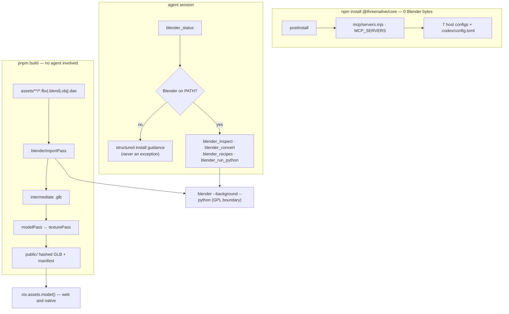
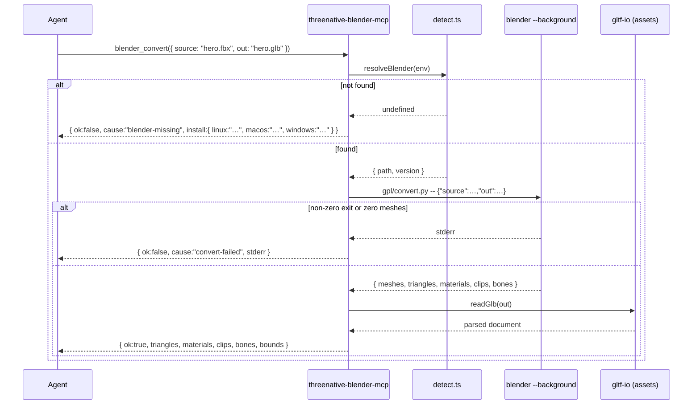

# PRD-346 — A downloaded `.fbx` becomes a running ThreeNative character

**Status: PROPOSED.** No phase executed. No gate run. Nothing in this file is evidence.

**Complexity: 8 → HIGH mode.** More than 10 files (+3), a new package and MCP server from scratch
(+2), changes across `core`, `assets`, `create-threenative` and `scripts` (+2), and an external
executable integration (+1). Every phase requires an automated checkpoint; Phase 3 and Phase 4 also
require a manual checkpoint, because their output is geometry a human has to look at.

**Owner decisions taken by the implementing agent on 2026-09-03, at the owner's explicit
delegation** (`your call to all decisions`). Each is recorded inline where it binds:

1. `blender_run_python` **ships**. It grants the agent no privilege it does not already hold
   through Bash, and an escape hatch that is refused is an escape hatch the agent routes around.
2. The ROADMAP boundary is **stated in this file and mirrored into `ROADMAP.md`**: ThreeNative
   drives Blender as a separate process and never reimplements any part of it.
3. Blender is **never bundled and never silently downloaded.** Detect-and-guide is the default;
   consent lives in the agent's conversation with the user, not in `npm postinstall`.

---

## 1. Context

**Problem:** `asset_search_sources`, `fab_download_free_asset` and `asset_import_unreal` hand an
agent `.fbx` and `.blend` files today, and this repository contains no path that turns one into a
GLB a ThreeNative game can load. The file lands in the assets directory, `compileAssets` classifies
it as `"other"`, copies it through untouched, and the build reports success.

**Files analyzed:**

- `packages/core/mcp/servers.mjs` — `MCP_SERVERS`, `MCP_PACKAGES`, `SERVER_FORMATS`,
  `mergeMcpServers`, `CODEX_MCP_SERVERS`
- `packages/core/mcp/install.mjs` — `MCP_HOSTS`, `ensureHostMcpConfigs`, `installTarget`
- `packages/core/mcp/launch.mjs` — `packageDirectory`, `serverEntry`, `launchMcpServer`
- `packages/core/scripts/postinstall.mjs`, `packages/core/package.json`
- `packages/engine-mcp/package.json` — the in-repo MCP package precedent
- `packages/assets/src/compile.ts` (`KIND_BY_EXTENSION` at `:295`, `assetKind` at `:871`),
  `packages/assets/src/pass-chain.ts`, `packages/assets/src/passes/`
- `packages/create-threenative/src/index.ts` (`REQUIRED_MCP_SERVERS` at `:500`),
  `packages/create-threenative/src/doctor.ts` (`MCP_SERVER_SPECS` at `:100`)
- `scripts/verify-golden-path.ts` (`:33-35`), `scripts/check-budgets.ts` (`:28`, `:37`)
- `packages/core/__tests__/mcp-install.spec.ts`,
  `packages/create-threenative/__tests__/scaffold-mcp.spec.ts`, `.../template.spec.ts`,
  `.../doctor.spec.ts`
- `docs/PRDs/done/PRD-295-fab-unreal-to-threenative-assets.md`,
  `packages/create-threenative/agent-docs/references/finding-assets.md`
- `docs/strategy/ROADMAP.md:155`, `docs/architecture/AGENT-INTERFACE.md:9-12`

**Current behavior:**

- Three MCP servers (`threenative-assets`, `threenative-sculpt`, `threenative-engine`) auto-wire
  into seven project-scoped host configs on `@threenative/core` postinstall. Silent, idempotent,
  non-interactive.
- `launchMcpServer` resolves the server package from `node_modules` and falls back to
  `npx --yes <pkg>@<version>`, so wiring a server costs no install bytes.
- `grep -il fbx packages/assets/src packages/core/src` returns nothing. There is no importer.
- `scripts/sync-mcp-configs.ts` (`pnpm sync:mcp`) **already derives** every template's host configs
  from `MCP_SERVERS` — 10 templates × 7 hosts. `pnpm sync:mcp --check` exits 0 on the tree today.
  **Nothing runs it.** `grep -rn "sync:mcp" scripts/ci-fast.sh .github/workflows packages/*/__tests__`
  finds only an unrelated path listing in `temp-dir-guard.spec.ts`. A generator with no gate is a
  generator that goes stale silently.
- Two hand-typed parallel lists of the same three servers survive the generator:
  `REQUIRED_MCP_SERVERS` (`create-threenative/src/index.ts:500`) and `MCP_SERVER_SPECS`
  (`create-threenative/src/doctor.ts:100`).
- Template trees are hash-gated by `scaffold.spec.ts`, so the regenerated configs move those hashes.
- PRD-295 established the external-executable vocabulary this PRD reuses verbatim:
  `THREENATIVE_<TOOL>_PATH` then `PATH`, with `THREENATIVE_TOOLCHAIN_AUTOINSTALL=0` as the opt-out.

---

## 2. Solution

**Approach:**

- A new in-repo package `packages/blender-mcp`, published as `threenative-blender-mcp`, following
  `packages/engine-mcp` exactly. A Node stdio MCP server. It contains no Blender.
- It drives Blender headlessly: `blender --background --python <script> -- <json>`. No GUI, no
  addon install, no socket, no running application. Deterministic, testable, CI-shaped.
- Five tools: `blender_status`, `blender_inspect`, `blender_convert`, `blender_recipes`,
  `blender_run_python`.
- Wired as the fourth entry in `MCP_SERVERS`, from which all seven host formats and the Codex TOML
  already derive.
- The conversion capability is **not reachable only from the MCP**. It lands as a pass in
  `@threenative/assets`, so an `.fbx` dropped into a game's assets directory compiles on
  `pnpm build` whether an agent is present or not.

### Why the framework owns this (rules 1 and 5)

- **Rule 1(a) — could the game write this portably itself?** No. Locating a GPL binary across
  Linux, macOS and Windows, spawning it with a script on stdin-safe argv, parsing its output, and
  failing closed when it is absent is a platform seam. A game that wrote it would write it once per
  game.
- **Rule 1(b) — does it decide how anything looks?** No, and this is load-bearing. Conversion,
  inspection, decimation, UV unwrap and rig retarget all **preserve what an artist already
  authored**; none of them picks a geometry, material, colour, texture, curve or timing. Ambient
  occlusion baking *computes* from geometry rather than choosing an appearance. Any recipe that
  would author a new look ships as adaptable text under `blender_recipes`, which the agent reads
  and edits into its own game, never as a decision the package makes.
- **Rule 5 — why a package.** It carries the MCP SDK and, more importantly, a **GPL process
  boundary** that `@threenative/core` must not inherit. See Licensing below.
- **Rule 2 — the kill switch.** The alternative to this package is every game hand-writing
  cross-platform Blender discovery and a bpy harness, or shipping unusable `.fbx` files. Scored by
  `scripts/count-loc.ts` in Phase 5.

### The ROADMAP boundary

`docs/strategy/ROADMAP.md:155` lists **a Blender replacement** as not on the roadmap. This PRD does
not reopen it and Phase 5 writes the boundary into that file:

> ThreeNative drives Blender as a separate process. It never reimplements modelling, sculpting,
> shading, rigging or rendering, ships no geometry-authoring UI in `packages/`, and adds no bpy
> feature. When Blender is absent the framework says so and does less; it never substitutes.

### Licensing (a decision, not a note)

Blender is **GPLv2-or-later**. Two consequences bind the design:

- The binary is **resolved, never bundled, linked, imported, or vendored** —
  `THREENATIVE_BLENDER_PATH`, then `PATH`, then the platform's conventional install locations.
  Identical to the FabCLI boundary PRD-295 set.
- Python that runs inside Blender against `bpy` is treated as GPL-covered. The Node server stays
  **MIT**; every `.py` file ships from `packages/blender-mcp/gpl/` carrying a **GPL-2.0-or-later**
  header and a `LICENSE.GPL` beside it, and `packages/blender-mcp/README.md` states the split.
  Phase 2 gates this with a test that fails on a `.py` under `gpl/` without the header.

### Acquisition: detect-and-guide

`npm postinstall` has no TTY, so it cannot ask. Consent belongs in the agent's chat, at the moment
the user learns why 350 MB is wanted. Therefore:

- Install cost of this PRD: **zero Blender bytes**, unconditionally.
- The first `blender_*` call on a machine without Blender returns a structured, actionable result —
  not an exception — naming the platform's install command and offering to proceed.
- `blender_status` is the tool that answers "can I do this at all", and every other tool routes its
  missing-Blender path through the same result shape.
- `threenative doctor` reports Blender as **`warn`, never `fail`**. A game with no `.fbx` in it
  needs no Blender and must stay green.
- `THREENATIVE_TOOLCHAIN_AUTOINSTALL=0` (existing vocabulary, not new) suppresses even the offer.
  There is no autoinstall default here: PRD-295's tools are a few megabytes, Blender is two orders
  of magnitude larger, and that gap is the entire reason to ask.

### Architecture



**Key decisions:**

- [ ] MCP SDK: `@modelcontextprotocol/sdk`, matching `packages/engine-mcp`. No new transport.
- [ ] Error strategy: **fail closed, return structured**. A missing Blender, an unreadable source,
      or a non-zero Blender exit becomes a tool result with `ok: false` and a named cause. Malformed
      tool input throws. An empty conversion — zero meshes out — is a failure, never a success with
      an empty GLB.
- [ ] Reused: `packages/assets/src/gltf-io.ts` reads every produced GLB in the gates, so the
      assertions run through the same reader the runtime uses. `packages/core/mcp/launch.mjs` is
      reused unchanged. `mergeMcpServers` already derives all seven formats.
- [ ] No new CLI vocabulary. `pnpm sync:mcp` is the only added script.

**Data changes:** `KIND_BY_EXTENSION` in `packages/assets/src/compile.ts:295` gains `fbx`, `blend`,
`obj`, `dae` → `"model"`. One new manifest field on a model entry: `importedFrom` (the source
extension), so a report can say a GLB was converted rather than authored.

---

## 3. Sequence flow



---

## Integration Ledger

Filled with real non-test `file:line` during implementation. Any `TBD` at phase end means the phase
is incomplete.

| # | New thing | Live caller (`file:line`, non-test) | Replaces | Old path removed? | Negative control |
|---|-----------|-------------------------------------|----------|-------------------|------------------|
| 1 | `sync:mcp --check` gate | TBD — `scripts/ci-fast.sh` and a spec in `scaffold-mcp.spec.ts` | an ungated generator nothing runs | n/a, the generator stays | hand-edit one template `.zed/settings.json` → gate red |
| 1b | `REQUIRED_MCP_SERVERS` / `MCP_SERVER_SPECS` derived | TBD — `create-threenative/src/index.ts:500`, `src/doctor.ts:100` | two hand-typed lists of the same three servers | both replaced by derivations | change `MCP_PACKAGES.sculpt.version` → doctor version-agreement red |
| 2 | `packages/blender-mcp` server | TBD — `packages/core/mcp/servers.mjs` `MCP_SERVERS`; `install.mjs:ensureHostMcpConfigs` writes it to 7 hosts | nothing | n/a, new | delete `mcp/blender.mjs` → `mcp-install.spec.ts` "names a shim this package actually ships" red |
| 3 | `blender_status` | TBD — `scaffold-mcp.spec.ts` launches every `MCP_SERVERS` entry; `verify-golden-path.ts` tool snapshot | nothing | n/a, new | rename the tool → golden-path `blender-mcp-tools.json` mismatch red |
| 4 | `blenderImportPass` | TBD — `packages/assets/src/compile.ts` pass chain | `.fbx` falling through as `assetKind "other"` | passthrough deleted for these 4 extensions | remove the pass → the `.fbx` fixture compiles to a copied `.fbx` again, model count 0 |
| 5 | `KIND_BY_EXTENSION` fbx/blend/obj/dae | TBD — `packages/assets/src/compile.ts:871` `assetKind` | same | same | revert the map entries → fixture reports `other`, pass never runs |
| 6 | `blender_convert` / `blender_inspect` | TBD — `blenderImportPass` calls the same bridge module; MCP tool is the second caller | nothing | n/a, new | stub the bridge to return `ok:true` with no file → gate red on missing GLB |
| 7 | `blender_recipes` / `blender_run_python` | TBD — `blender-mcp-tools.json`; each recipe executed by its own fixture gate | nothing | n/a, new | corrupt one recipe's bpy → its fixture gate red |
| 8 | doctor Blender check | TBD — `packages/create-threenative/src/doctor.ts` checks list | nothing | n/a, new | point `THREENATIVE_BLENDER_PATH` at a non-existent file → check reports `warn`, report still passes |

### Reachability

**How will this feature be reached?**

- [x] Entry points: (a) MCP `tools/call` from any of seven hosts; (b) `compileAssets` pass chain,
      run by `pnpm build` and the asset watcher, with no agent involved.
- [x] Pre-existing files edited to call it: `packages/core/mcp/servers.mjs`,
      `packages/assets/src/compile.ts`, `packages/create-threenative/src/doctor.ts`,
      `packages/create-threenative/src/index.ts`.
- [x] Registration: `MCP_SERVERS` → `mergeMcpServers` → seven host configs + Codex TOML, all
      already derived from that one object.

**Is this user-facing?**

- [x] Internal/tooling. The user-visible consequence is a character appearing in the game; the
      trigger is an `.fbx` in the assets directory or an agent tool call. No UI component.

**Full flow (the one the acceptance criteria are written about):**

1. Agent calls `fab_download_free_asset` and receives `hero.fbx` with a skeleton and clips.
2. Agent writes it into `assets/`, then runs the game's build.
3. `compileAssets` classifies it as `"model"` and `blenderImportPass` converts it to GLB.
4. `modelPass` and `texturePass` optimize it as they do any authored GLB.
5. `ctx.assets.model("hero")` loads it and the character animates on screen.

**What does this replace?**

- [x] Replaces: the `assetKind "other"` passthrough for `fbx|blend|obj|dae` in
      `packages/assets/src/compile.ts` — deleted for those extensions in Phase 3.

---

## 4. Execution phases

### Choose the hardest real subject first

**Proof subject (Phase 3, the earliest proving phase): a real Fab or Sketchfab `.fbx` character
with a skeleton, more than one animation clip, more than one material, and embedded textures** —
committed as a fixture with its licence recorded. Not a cube, not a single static mesh.

Rejected as proof subjects: a generated cube (exercises no skeleton, no clips, no materials, no
texture packing), and a `.obj` (has no skeleton or animation by format).

---

#### Phase 1: The config generator gets a gate, and the last two hand-typed lists are derived

**Pre-existing state, verified 2026-09-03:** `scripts/sync-mcp-configs.ts` already writes all
10 templates × 7 host configs from `MCP_SERVERS`, and `pnpm sync:mcp --check` exits 0. This phase
does **not** rebuild it. It closes the two gaps that would let Phase 2's fourth server land wrong:
nothing runs `--check`, and two lists are still typed by hand.

**Files (4):**

- `scripts/ci-fast.sh` — EDIT: run `pnpm sync:mcp --check`.
- `packages/create-threenative/__tests__/scaffold-mcp.spec.ts` — EDIT: a spec asserting every
  template's host configs equal the generator's output, so a local `pnpm test` catches drift too.
- `packages/create-threenative/src/index.ts` — EDIT: `REQUIRED_MCP_SERVERS` (`:500`) derived from
  `MCP_SERVERS` instead of retyped.
- `packages/create-threenative/src/doctor.ts` — EDIT: `MCP_SERVER_SPECS` (`:100`) derived from
  `MCP_SERVERS` and `MCP_PACKAGES` instead of retyped.

**Implementation:**

- [ ] The spec reuses `ensureHostMcpConfigs` the way the script does — no second derivation.
- [ ] Both derivations keep their existing version-agreement assertions; doctor still asserts that
      `MCP_PACKAGES`, `core/package.json` and the spec list agree.
- [ ] Preserve doctor's `threenative-engine` special case: its `packageName` is `@threenative/core`,
      not `threenative-engine-mcp`, because core bundles engine discovery.

**Wiring:**

- [ ] Caller edited: `scripts/ci-fast.sh` invokes `--check`; `scaffold-mcp.spec.ts` asserts equality
- [ ] Registration: added to the pre-push fast lane
- [ ] Old path: two hand-typed lists deleted, replaced by derivations
- [ ] Ledger rows filled: #1, #1b

**Tests required:**

| Test file | Test name | Assertion | Negative control (must be observed red) |
|---|---|---|---|
| `scaffold-mcp.spec.ts` | `should keep every template host config equal to the generator output` | all 10 × 7 files match | hand-edit one template `.zed/settings.json`, re-run → red |
| `doctor.spec.ts` | (existing version-agreement tests) | still pass against derived specs | change `MCP_PACKAGES.sculpt.version` → red |
| `scaffold.spec.ts` | (existing tree-hash tests) | unchanged this phase — the generator is already current, so **no hash may move** | if a hash moves here, the generator disagreed with the tree and that is a finding, not a rebase |

**Revert check:** revert the `scaffold-mcp.spec.ts` gate → hand-editing a template config passes
`pnpm test` again, which is the defect this phase closes. Revert the `index.ts` derivation →
`REQUIRED_MCP_SERVERS` no longer references `MCP_SERVERS` and the caller census finds one fewer
consumer.

**Negative-control note:** `pnpm sync:mcp --check` was observed exiting 0 on the untouched tree
before this phase. A gate must be green on a correct tree and red on a broken one; only the pair
proves it measures anything.

**User verification:** add a stray key to `templates/minimal/.cursor/mcp.json` → `pnpm sync:mcp
--check` non-zero naming that file; `pnpm sync:mcp` restores it.

---

#### Phase 2: The fourth server is wired, starts on a machine with no Blender, and says so honestly

**Proof subject: a machine with Blender absent.** This is the hard case, not the easy one — a server
that only works where Blender happens to be installed is the failure this phase exists to prevent.

**Files (5):**

- `packages/blender-mcp/package.json` — NEW: mirrors `packages/engine-mcp/package.json`.
- `packages/blender-mcp/src/detect.ts` — NEW: `resolveBlender(env)` — `THREENATIVE_BLENDER_PATH`,
  then `PATH`, then conventional per-platform locations; returns path + version or `undefined`.
- `packages/blender-mcp/src/index.ts` — NEW: stdio server; `blender_status` only.
- `packages/core/mcp/blender.mjs` — NEW: the shim, identical in shape to `sculpt.mjs`.
- `packages/core/mcp/servers.mjs` — EDIT: fourth `MCP_SERVERS` entry + `MCP_PACKAGES.blender`.

Plus, as generated output rather than hand edits: `packages/core/package.json` gains the dependency,
and `pnpm sync:mcp` rewrites the 10 × 7 template configs (which does move the `scaffold.spec.ts`
tree hashes — recompute in the same commit).

**Implementation:**

- [ ] `blender_status` returns `{ available, path?, version?, install: { linux, macos, windows } }`
      and **never throws** when Blender is absent.
- [ ] Version parsed from `blender --version`; a Blender older than the pinned floor reports
      `available: false` with `cause: "blender-too-old"`.
- [ ] `packages/blender-mcp/gpl/` created with `LICENSE.GPL` and a header-lint test, ready for
      Phase 3's scripts.
- [ ] `scripts/check-budgets.ts`: confirm `packages/blender-mcp` is admissible — it is not in
      `EXTERNAL_MCPS` (`:37`), so the vendoring gate does not fire; record the LOC delta.

**Wiring:**

- [ ] Caller edited: `packages/core/mcp/servers.mjs` — `mergeMcpServers` writes it to all 7 hosts
- [ ] Registration: `.mcp.json`, `.codex/config.toml`, `.cursor/`, `.vscode/`, `.gemini/`,
      `opencode.json`, `.zed/` — all derived, none typed
- [ ] Old path: n/a, new behavior
- [ ] Ledger rows filled: #2, #3

**Tests required:**

| Test file | Test name | Assertion | Negative control (must be observed red) |
|---|---|---|---|
| `packages/core/__tests__/mcp-install.spec.ts` | `should declare four ThreeNative servers` | key order `[assets, sculpt, engine, blender]` | delete the entry → red |
| `packages/core/__tests__/mcp-install.spec.ts` | `should name a shim this package actually ships` (existing) | `mcp/blender.mjs` exists | rename the shim → red |
| `packages/create-threenative/__tests__/scaffold-mcp.spec.ts` | `should list blender tools with no Blender installed` | launches the server with `PATH` scrubbed of blender; `tools/list` contains `blender_status` | make the server exit when Blender is missing → red |
| `packages/blender-mcp/__tests__/detect.spec.ts` | `should report unavailable when no Blender exists` | `available:false`, install guidance for all three platforms, **no throw** | make `resolveBlender` throw → red |
| `packages/blender-mcp/__tests__/licensing.spec.ts` | `should carry a GPL header on every gpl/*.py` | every file matches the header | strip one header → red |

**Revert check:** remove the `MCP_SERVERS` entry → `scaffold-mcp.spec.ts`, which launches every
server in `MCP_SERVERS`, no longer probes it **and** the new four-server assertion in
`mcp-install.spec.ts` goes red. Both are pre-existing files.

**Explicitly guarded silent-pass:** `scaffold-mcp.spec.ts` launches the real server over stdio and
reads a real `tools/list`. It must not be replaced by an assertion over `MCP_SERVERS`, which would
be a self-comparison — the object asserting about itself.

**User verification:** `npx create-threenative demo && cat demo/.mcp.json` → four servers. Start the
host with no Blender installed → `threenative-blender` connects, `blender_status` returns install
guidance, no red server in the host UI.

---

#### Phase 3: A real Fab `.fbx` character compiles to a GLB the game loads and animates

**Files (5):**

- `packages/blender-mcp/gpl/convert.py` — NEW (GPL-2.0-or-later): import → validate → export GLB,
  emitting a JSON summary on stdout's last line.
- `packages/blender-mcp/src/bridge.ts` — NEW: spawn, argv, JSON parse, fail-closed on zero meshes.
- `packages/blender-mcp/src/index.ts` — EDIT: `blender_inspect` and `blender_convert`.
- `packages/assets/src/passes/blender-import.ts` — NEW: `blenderImportPass`.
- `packages/assets/src/compile.ts` — EDIT: `KIND_BY_EXTENSION` (`:295`) gains the four extensions;
  the pass runs ahead of `modelPass`.

**Implementation:**

- [ ] The MCP tool and the asset pass call **one** bridge module. Two conversion implementations is
      the additive-migration anti-pattern and is rejected at checkpoint.
- [ ] Zero meshes out, or a non-zero Blender exit, is a failure with `stderr` attached — never a
      success with an empty GLB.
- [ ] With no Blender, `blenderImportPass` **fails the compile** with the install guidance. An
      `.fbx` placed in the assets directory is an explicit request; silently copying it through is
      the bug this phase deletes.
- [ ] Fixture committed with its source URL and licence in
      `packages/assets/__tests__/fixtures/blender/README.md`.

**Wiring:**

- [ ] Caller edited: `packages/assets/src/compile.ts` pass chain
- [ ] Registration: `KIND_BY_EXTENSION` → `assetKind` (`:871`) → the chain
- [ ] Old path: the `"other"` passthrough for these four extensions is **deleted**
- [ ] Ledger rows filled: #4, #5, #6

**Tests required:**

| Test file | Test name | Assertion | Negative control (must be observed red) |
|---|---|---|---|
| `packages/assets/__tests__/blender-import.spec.ts` | `should convert a rigged fbx to a loadable glb` | read via `gltf-io`: ≥2 materials, ≥2 animation clips, bone count > 0, triangles within 1% of the reported source | delete `blenderImportPass` from the chain → the fixture emits a copied `.fbx`, model count 0 |
| `packages/assets/__tests__/blender-import.spec.ts` | `should fail the compile when Blender is absent` | `THREENATIVE_BLENDER_PATH=/nonexistent` → compile rejects, message names the install step | make it warn-and-copy instead → red |
| `packages/assets/__tests__/blender-import.spec.ts` | `should fail when conversion produces no meshes` | empty-scene fixture → rejects | make it write an empty GLB and return ok → red |
| `packages/blender-mcp/__tests__/convert.spec.ts` | `should report the same counts blender_inspect reported` | inspect counts == convert counts for the same fixture | patch one path to a constant → red |

**Revert check:** revert the four `KIND_BY_EXTENSION` entries → the fixture is classified `"other"`,
the pass never runs, and the pre-existing compile test that now expects a model output goes red.

**Guarded silent-pass:** the assertion must read the produced GLB through
`packages/assets/src/gltf-io.ts` — the reader the runtime uses — not through the JSON summary the
Python script printed. A summary asserting about itself is manufactured evidence.

**Baseline requirement:** run the new gate at `HEAD~1`. It **must** fail. A conversion gate that
passes before the converter exists is measuring nothing.

**Checkpoint: automated + manual.** Manual: load the compiled GLB in a template and confirm the
character is posed, textured, and animating — the six-preset lesson is that automated metrics pass
things a human can see are wrong.

---

#### Phase 4: Recipes and the escape hatch — repair, unwrap, bake, retarget

**Files (5):**

- `packages/blender-mcp/gpl/recipes/` — NEW: `decimate.py`, `unwrap.py`, `bake_ao.py`,
  `retarget.py`, each GPL-headed and each parameterized from JSON argv.
- `packages/blender-mcp/src/recipes.ts` — NEW: the registry; `blender_recipes` lists, reads and
  runs them.
- `packages/blender-mcp/src/index.ts` — EDIT: `blender_recipes`, `blender_run_python`.
- `packages/blender-mcp/src/bridge.ts` — EDIT: arbitrary-script path sharing the same spawn,
  timeout and fail-closed handling.
- `packages/create-threenative/agent-docs/references/finding-assets.md` — EDIT: the loop from a
  downloaded `.fbx` to a running character.

**Implementation:**

- [ ] `blender_run_python` runs a caller-supplied bpy script against named input and output paths,
      with a timeout, and returns stdout, stderr and exit code. **It is not sandboxed and does not
      claim to be** — the agent already has Bash; this tool adds a working Blender environment and
      discoverability, not privilege. The tool description says exactly that.
- [ ] `blender_recipes` returns the script **text**, so an agent can read a working recipe and adapt
      it rather than writing bpy cold. Same shape as sculpt's grimoire.
- [ ] Each recipe is executed by its own fixture gate with a numeric assertion — `decimate` reduces
      triangles by the requested ratio ±2%; `unwrap` produces a UV layer where none existed;
      `bake_ao` writes a texture whose mean luminance differs from a flat baseline; `retarget`
      produces clips whose bone tracks target the destination armature's names.
- [ ] Appearance boundary held: no recipe assigns a colour, material or light. `bake_ao` computes
      occlusion from geometry; a recipe that would author a look is documentation only.

**Wiring:**

- [ ] Caller edited: `finding-assets.md` names the loop, so `template.spec.ts`'s
      documented-tools gate covers it
- [ ] Registration: recipes registered in `recipes.ts`, listed by `blender_recipes`
- [ ] Old path: n/a, new behavior
- [ ] Ledger rows filled: #7

**Tests required:**

| Test file | Test name | Assertion | Negative control (must be observed red) |
|---|---|---|---|
| `packages/blender-mcp/__tests__/recipes.spec.ts` | `should decimate to the requested ratio` | triangles within ±2% of target | set the ratio to 1.0 and expect reduction → red |
| `packages/blender-mcp/__tests__/recipes.spec.ts` | `should unwrap a mesh that had no UVs` | UV layer count 0 → 1 | run against an already-unwrapped mesh → the gate must still distinguish, else rewrite it |
| `packages/blender-mcp/__tests__/recipes.spec.ts` | `should retarget clips onto the destination armature` | every track resolves to a destination bone name | swap in the source armature → red |
| `packages/blender-mcp/__tests__/run-python.spec.ts` | `should run a recipe through blender_run_python identically` | same output digest as `blender_recipes` running it | make the escape hatch ignore its script argument → red |
| `packages/blender-mcp/__tests__/run-python.spec.ts` | `should report a failing script rather than reporting success` | non-zero exit surfaces with stderr | swallow the exit code → red |

**Revert check:** delete `recipes.ts` → `blender_recipes` disappears from `tools/list` and the
`blender-mcp-tools.json` golden-path snapshot mismatches.

**Checkpoint: automated + manual.** Manual: eyeball a decimated and an AO-baked mesh. Pixel metrics
never replace looking.

---

#### Phase 5: Discoverable — doctor, tool snapshot, docs, boundary, kill switch

**Files (5):**

- `packages/create-threenative/blender-mcp-tools.json` — NEW: the tool snapshot, captured from a
  live `tools/list` against the published tarball.
- `scripts/verify-golden-path.ts` — EDIT: fourth entry at `:33-35`.
- `packages/create-threenative/src/doctor.ts` — EDIT: Blender check, `warn` never `fail`.
- `docs/architecture/AGENT-INTERFACE.md` — EDIT: four servers at `:9-12`.
- `docs/strategy/ROADMAP.md` — EDIT: the boundary clause at `:155`.

Plus `pnpm sync:agents` regenerating CLAUDE.md mirrors, and `pnpm tsx scripts/count-loc.ts` recorded.

**Implementation:**

- [ ] `blender-mcp-tools.json` captured the way `sculpt-mcp-tools.json` was: from a clean install of
      the published tarball, not from the workspace source. A snapshot taken from the source is a
      self-comparison.
- [ ] doctor's Blender check reports `ok` with the version when present, `warn` with the install
      command when absent, and never fails the report.
- [ ] `pnpm quality`, `pnpm budgets`, and the instruction-budget word caps re-run — the docs edits
      touch AGENTS-governed files.

**Wiring:**

- [ ] Caller edited: `doctor.ts` checks list; `verify-golden-path.ts` server table
- [ ] Registration: golden-path CI matrix now probes four servers
- [ ] Old path: n/a
- [ ] Ledger rows filled: #8

**Tests required:**

| Test file | Test name | Assertion | Negative control (must be observed red) |
|---|---|---|---|
| `doctor.spec.ts` | `should warn, not fail, when Blender is absent` | `status: "warn"`, `report.pass === true` | change it to `fail` → red |
| `doctor.spec.ts` | `should report the version when Blender resolves` | version string surfaces | stub the probe to return undefined → red |
| `template.spec.ts` | `should document only tools the pinned blender MCP serves` | every `` `blender_*` `` in the docs is in the snapshot | document a non-existent tool → red |
| `scripts/__tests__/primary-docs.spec.ts` | (existing) | README/architecture name only shipped commands | leave `AGENT-INTERFACE.md` at three servers → red |

**Revert check:** revert the `verify-golden-path.ts` entry → the golden-path matrix stops probing
`threenative-blender` and `verify-golden-path.spec.ts`'s server-count assertion goes red.

**User verification:** `npx threenative doctor --text` in a scaffolded project with no Blender →
exit 0 with one Blender warning. Install Blender, re-run → the warning becomes `ok` with a version.

---

## 5. Checkpoint protocol

Automated after every phase, via `prd-work-reviewer`, with the integration audit in the prompt:

```
Also audit integration, independent of whether tests pass:
1. Integration Ledger: is every row filled with a real non-test file:line?
2. Caller census: grep each new exported symbol — any non-test consumer?
3. Did this phase edit at least one pre-existing file?
4. Revert check: if the new code were removed, what pre-existing test or flow would break?
   If nothing, report FAIL.
5. Incumbent: is the `.fbx` "other" passthrough deleted, or still live?
6. Negative controls: was each new gate observed failing? Check for uncollected test files,
   self-comparisons (a Python summary asserting about itself; MCP_SERVERS asserting about
   MCP_SERVERS), and assertions the previous commit already satisfied.
7. Two implementations: does exactly one module spawn Blender, called by both the MCP tool and
   the asset pass?
Report FAIL on any of these even when the full suite is green.
```

Manual additionally on Phase 3 and Phase 4 — both produce geometry a human must look at.

---

## 6. Verification strategy

Repo gates, in the order they must be run and pasted:

```sh
pnpm typecheck && pnpm lint && pnpm test
pnpm sync:mcp --check
pnpm budgets
pnpm tsx scripts/count-loc.ts
pnpm sync:agents --check
node packages/playtest/dist/runner/cli.js <scenario>.playtest.json \
  --url http://127.0.0.1:5173 --server-command "<dev command>" --browser-recipe webgpu
```

**Integration proof (not satisfied by any test above):**

```sh
# 1. Caller census — every new symbol has a non-test consumer
grep -rn "blenderImportPass\|resolveBlender\|blender_convert" packages scripts \
  --include=*.ts --include=*.mjs | grep -v node_modules | grep -v "/dist/" \
  | grep -v "__tests__" | grep -v ".spec."
# Expected: hits in compile.ts and servers.mjs that are not the definitions

# 2. Incumbent check — the passthrough is gone
grep -n "KIND_BY_EXTENSION" -A 14 packages/assets/src/compile.ts
# Expected: fbx, blend, obj, dae present and mapped to "model"

# 3. Two-implementation check — exactly one spawner
grep -rn "spawn\|execFile" packages/blender-mcp/src packages/assets/src \
  | grep -i blender
# Expected: one module

# 4. Baseline check — the Phase 3 gate must fail at HEAD~1
git stash && pnpm --filter @threenative/assets test blender-import; git stash pop
# Expected: RED
```

**Silent-pass mechanisms specifically guarded here:**

| Mechanism | Control |
|---|---|
| `MCP_SERVERS` asserting about `MCP_SERVERS` | `scaffold-mcp.spec.ts` launches the real server over stdio and reads a real `tools/list` |
| Python summary asserting about itself | every count re-read through `packages/assets/src/gltf-io.ts` |
| Tool snapshot taken from workspace source | `blender-mcp-tools.json` captured from a clean install of the published tarball |
| Gate already green before the change | Phase 3's gate run at `HEAD~1` and observed red |
| Vacuous fixture | the fixture is a rigged, multi-material, multi-clip character; a cube is rejected as a proof subject |
| Envelope ≠ state | zero meshes out is a failure, never `ok:true` beside an empty GLB |
| Test never collected | each new spec file's count checked in the vitest file list, not just exit 0 |

**Evidence file:** `docs/verification/PRD-346.md`, one section per phase, pasted output not summaries.

---

## 7. Acceptance criteria

Consumer-scoped. Each is only satisfiable by code that runs.

- [ ] **A rigged `.fbx` downloaded through the asset MCP animates in a running ThreeNative game**,
      loaded via `ctx.assets.model()`, proved by a playtest scenario — not by "the converter
      round-trips a file".
- [ ] **A game with an `.fbx` in its assets directory and no Blender installed fails its build with
      the install command in the message**, rather than shipping an unusable file.
- [ ] **A scaffolded project on a machine with no Blender starts all four MCP servers**, and
      `blender_status` returns install guidance instead of a dead server in the host UI.
- [ ] **`threenative doctor` passes on a project that has no `.fbx` and no Blender**, with one
      warning.
- [ ] **An agent that needs an operation no named tool covers can perform it** — proved by running
      a shipped recipe through `blender_run_python` and getting the recipe's own result.
- [ ] **Adding a fifth MCP server tomorrow requires one edit to `MCP_SERVERS` plus
      `pnpm sync:mcp`, and a hand-edited template config is caught** — proved by running the
      generator from one source edit, and by hand-breaking one config and watching CI go red.
- [ ] **A decimated mesh and an AO-baked mesh were looked at by a human** and recorded in
      `docs/verification/PRD-346.md`.

**Binary done checks:**

- [ ] All five phases complete
- [ ] All specified tests pass
- [ ] `pnpm typecheck && pnpm lint && pnpm test` green, output pasted
- [ ] `pnpm budgets` green; `count-loc.ts` delta recorded
- [ ] All automated checkpoints passed; manual checkpoints passed for Phases 3 and 4
- [ ] Internal-only feature — no UI required, explicitly marked

**Integration gates (any unchecked ⇒ not done):**

- [ ] Integration Ledger has zero `TBD` cells
- [ ] Every new exported symbol has a non-test consumer (census pasted)
- [ ] Revert check passed for each phase
- [ ] The `.fbx` `"other"` passthrough is deleted, not merely bypassed
- [ ] Every gate has an observed negative control, recorded red
- [ ] The capability was proved on a rigged multi-material multi-clip character, not a cube

---

## 8. Out of scope

| Excluded | Why |
|---|---|
| Bundling or auto-downloading Blender | GPLv2+ distribution boundary, and 350 MB is not an install cost this framework imposes |
| A GUI socket / Blender addon | Untestable in CI, requires a running app and an install step; headless is the agent-shaped transport |
| Any geometry-authoring UI in `packages/` | ROADMAP boundary; ThreeNative drives Blender, never replaces it |
| Recipes that choose a look | Rule 3 — appearance belongs to the game, in `src/render/` |
| macOS and Windows install guidance verified on the metal | Guidance ships for all three; only the platform it is run on may be claimed as proved |
| `.usd`, `.abc`, `.max` | Not produced by the asset sources this repo integrates; add when a source hands one over |

---

## 9. Risks

| Risk | Mitigation |
|---|---|
| Blender version drift changes bpy APIs under the recipes | Pin a floor version; `blender_status` reports `blender-too-old`; recipes gated on the pinned version in CI |
| CI has no Blender, so Phase 3–4 gates never run there | Gates skip **loudly** with a named reason and are marked advisory, following the native-platform lane's convention; a skipped gate is never reported as a pass |
| The 70-file regeneration collides with another agent's lane | Phase 1 lands and commits on its own before Phase 2 touches `MCP_SERVERS` |
| Scaffold hashes move for all 10 templates in Phase 2 | Expected and mechanical; recompute in the same commit, as `3eb977f4` did. In **Phase 1** no hash may move — if one does, the generator disagreed with the shipped tree |
| A fourth server slows host startup | `blender_status` does no work until called; detection is lazy |

---

*Filed 2026-09-03.*
