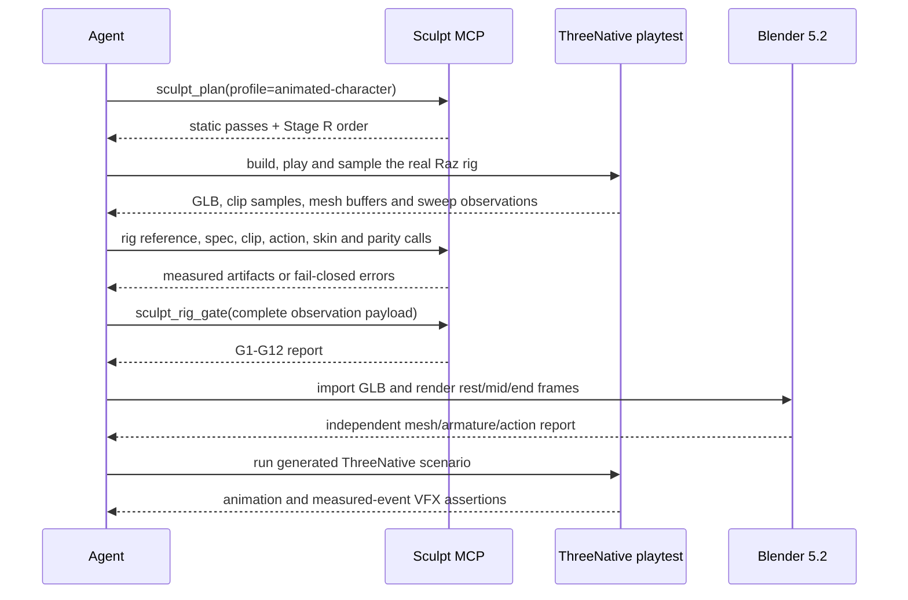

# PRD-346 — an animated sculpt proves it moves before it ships

**Status:** PROPOSED (2026-09-03)
**Owner:** `threenative-sculpt-mcp` / `create-threenative`
**Complexity: 10 → HIGH mode** (10+ files +3, new Stage R modules +2, complex
gate state +2, multi-package/repository release +2, upstream integration +1).

**Upstream baseline:** [`img2threejs` v1.5.2](https://github.com/img2threejs/img2threejs/releases/tag/v1.5.2),
tag target `d6815db757c1eb435ae55f91fb375a7a98ddf28b`, released 2026-09-03.

## 1. Problem

`threenative-sculpt-mcp@0.1.1` can plan and visually gate a reference-guided static sculpt, but it
cannot prove that a character's rig binds, its clips move the intended skeleton, its skin survives
motion, or an effect fires at a measured animation event. The retained upstream revision
`9fbd0ca5bbcc3b13bebe712745d6784d33db0b85` predates v1.5.2's Stage R pipeline.

This is the silent failure v1.5.2 exists to catch: a clip, mixer and action can all exist while no
vertex moves. A green static screenshot is not evidence that an animated character works.

### Current behavior

- The generated project launches five sculpt tools from a pure-Node MCP.
- `sculpt_plan` ends at the eight static passes; there is no `animated-character` route.
- The main engine already owns runtime animation, attachment and VFX mechanisms through
  `AnimationPlayer`, `attachToBone`, `GPUParticles3D` and the clip/bone diagnostics.
- Upstream v1.5.2 adds deterministic rig reference, clip measurement, skin conditioning, action
  design, mesh parity and G1–G12 gates. Its prose still calls these G1–G10 in places, but the tagged
  executable also contains G11 mesh parity and G12 rig-reference integrity; the executable wins.
- Upstream explicitly has no particle subsystem, VFX registry or VFX gate. Its VFX contribution is
  a measured-event workflow, not a reusable look.

### Layer decision

The executable Stage R authoring logic belongs in the clean sibling repository
`../threenative-sculpt-mcp`. It does not belong in the dirty `../threenative-asset-mcp`: nothing is
being discovered or downloaded. The main engine changes only after the external package is
published, to refresh its exact dependency pin, live tool-surface record and generated guidance.

No Python process ships to a generated project. The v1.5.2 algorithms are ported to TypeScript and
remain pure Node. Python 3.10 is upstream's implementation language, not part of ThreeNative's
end-user contract.

## 2. Solution

### Public MCP surface

The five existing calls remain compatible. Seven calls are added, for a total of twelve:

| Call | Input | Output | Failure behavior |
| --- | --- | --- | --- |
| `sculpt_plan` | existing reference and intent, plus optional profile (`generic`, `character`, or `animated-character`) | existing passes plus ordered Stage R steps and relevant resources | unreadable reference or unavailable profile resource is an MCP error |
| `sculpt_rig_reference` | GLB path, optional skin index, landmark bone names, sample count | skin-ordered joints, inverse binds, clip/channel roster, deform-vs-technical counts, optional sampled clips | ambiguous multiple skins, missing landmarks or unsupported interpolation fails closed |
| `sculpt_rig_spec_gate` | rig payload object | structural validation report | missing nodes, weights, indices, clips or index-space evidence is an MCP error |
| `sculpt_clip_measure` | v1.5.2 sampled-clip payload | measurements, classification, honest name, loop decision and scale tripwire for every clip | malformed samples fail; joint scaling returns an error result carrying the full report |
| `sculpt_action_design` | operation plus chains, sampled clip or gait parameters | resolved chains, walk/run target acceptance, foot-slide report or synthesized gait tracks | unknown band, mirrored/ambiguous chains or missing stance evidence fails closed |
| `sculpt_skin_condition` | positions, part IDs, four influences per vertex, joint count, figure height and optional radius | conditioned binding, loss report and R2 gate | invalid shape, lossy overflow above the upstream threshold or invalid weights fails closed |
| `sculpt_mesh_parity` | `freeze` with mesh buffers, or `verify` with manifest and post-bind buffers | packed-buffer hashes or a located first difference; `skinIndex`/`skinWeight` additions are reported but legal | absent comparison half, changed position/normal/UV/index, removed mesh or new visible geometry fails closed |
| `sculpt_rig_gate` | complete Stage R observation payload and optional named sweep thresholds | all G1–G12 results without short-circuiting | any `fail` or `unevaluated` gate makes the MCP result an error while preserving all twelve results |

The new names are borrowed directly from img2threejs's Stage R vocabulary. There is no
`sculpt_generate`, `sculpt_emit_runtime` or `sculpt_vfx` call.

### Upstream function coverage

| v1.5.2 owner | ThreeNative owner | Coverage decision |
| --- | --- | --- |
| `glb_rig_reference.py` | `sculpt_rig_reference` | Port the GLB parser, skin ordering, correspondence and clip sampler |
| `validate_rig_payload.py` | `sculpt_rig_spec_gate` | Port the structural validator separately from visual and pose gates |
| `clip_features.py` | `sculpt_clip_measure` | Port measurement, multi-label classification, inferred-name honesty and loop rule |
| `action_design.py` | `sculpt_action_design` | Port chain resolution, medial/lateral check, walk/run bands, gait synthesis and foot slide |
| `skin_conditioning.py` | `sculpt_skin_condition` | Port proximity blending and its explicit hole/crease trade report |
| `mesh_parity.py` | `sculpt_mesh_parity` | Port packed-byte freezing and comparison; do not compare JSON text |
| `rig_gates.py` | `sculpt_rig_gate` | Port all tagged gates G1–G12 and their upstream constants |
| `emit_animation_runtime.py` | existing `@threenative/core` capabilities | Do not port a second controller. Route to `AnimationPlayer`, `normaliseToMetres`, `attachToBone` and the scene update loop |
| `docs/standard-prompts/vfx.md` | technique-safe MCP resource plus generated guidance | Route measured events into game-owned `GPUParticles3D` geometry, materials and process functions |

This is a deliberate adaptation, not a claim of byte-identical source. `NOTICE` records the exact
upstream tag and maps every ported file.

### Architecture

```mermaid
flowchart LR
    A[Generated project's agent] -->|tools/call| S[threenative-sculpt-mcp 0.2.0]
    S --> P[Node-native Stage R ports]
    A -->|writes game-owned source| R[src/render]
    R --> C[@threenative/core AnimationPlayer and GPUParticles3D]
    C --> H[@threenative/playtest real browser]
    H -->|sampled clips, buffers, sweep evidence| S
    H --> G[exported Raz GLB]
    G --> B[Blender background verification]
    S --> E[G1-G12 report]
    B --> V[Blender report and rendered frames]
    E --> Q[release evidence]
    V --> Q
```

### Runtime boundary

The MCP analyzes files and JSON evidence. It does not launch a browser, mutate a scene or choose an
appearance. The generated project's existing playtest path owns browser execution. The game's
`src/render/` owns materials, particle geometry, effect colour, timing curves and composition.

The runtime mapping is explicit:

- `AnimationPlayer` plays and advances the clips.
- `clipTrackBindings`, `clipBoneCoverage` and `clipPoseError` provide live Three.js observations.
- `attachToBone` anchors an effect without magic coordinates.
- `GPUParticles3D` supplies pooling/dispatch while every appearance input remains game-owned.
- `normaliseToMetres` supplies the display scale; the MCP continues measuring in figure heights.

### Error contract

Every new handler returns structured content on success and a structured MCP error on invalid or
incomplete evidence. A gate report is never shortened to its first failure. Unknown input fields
are rejected. Empty clips, empty gate sets, missing pre/post parity halves, missing G10 controls and
unreadable GLBs cannot produce a successful result.

## 3. Sequence flow



## 4. Integration ledger

Every `TBD` becomes a real non-test `file:line` during implementation. A phase with a remaining
`TBD` is incomplete.

| # | New thing | Live caller (`file:line`, non-test) | Replaces | Old path removed? | Negative control |
| --- | --- | --- | --- | --- | --- |
| 1 | animated-character plan | `../threenative-sculpt-mcp/src/index.ts:TBD`, reached by MCP `tools/call` | static-only plan result | static route retained for non-animated work | remove Stage R insertion; MCP plan test and Raz transcript fail |
| 2 | `sculpt_rig_reference` | `../threenative-sculpt-mcp/src/index.ts:TBD` registration calls port | manual reading of GLB JSON | yes | truncate Raz GLB; call fails before reporting a skin |
| 3 | `sculpt_rig_spec_gate` | `../threenative-sculpt-mcp/src/index.ts:TBD` | no executable rig-payload validation in MCP | n/a | delete `skinIndex`; call fails naming it |
| 4 | `sculpt_clip_measure` | `../threenative-sculpt-mcp/src/index.ts:TBD` | agent guesses clip names/loops | yes in generated guidance | perturb final hip sample; loop decision changes |
| 5 | `sculpt_action_design` | `../threenative-sculpt-mcp/src/index.ts:TBD` | agent guesses gait bands and chains | yes in generated guidance | swap left/right anchors; medial/lateral gate fails |
| 6 | `sculpt_skin_condition` | `../threenative-sculpt-mcp/src/index.ts:TBD` | no seam-conditioning MCP path | n/a | malformed weight sum fails R2 |
| 7 | `sculpt_mesh_parity` | `../threenative-sculpt-mcp/src/index.ts:TBD` | visual-only assumption that rigging preserved geometry | yes | nudge one position float; report locates mesh/attribute/index and both values |
| 8 | `sculpt_rig_gate` | `../threenative-sculpt-mcp/src/index.ts:TBD` | no combined Stage R verdict | n/a | omit G10; report contains `G10=unevaluated` and `ok=false` |
| 9 | v1.5.2 package pin | `packages/core/mcp/sculpt.mjs` → `packages/core/mcp/servers.mjs:TBD` | `0.1.1` | yes | restore `0.1.1`; live surface equality test fails |
| 10 | updated generated workflow | generated project skill/reference copied by create-threenative | five-call static loop | static branch retained | invent or omit one tool name; template surface test fails |
| 11 | Blender/Raz release proof | `../threenative-sculpt-mcp/package.json:TBD` release-verification script | toy-only unit fixtures | n/a | remove one action from exported GLB; Blender count and MCP roster disagree |

### Reachability

**Entry point:** an agent host launches `@threenative/core/mcp/sculpt.mjs`, which launches the exact
published sculpt-MCP version and serves `tools/call` over stdio.

**Full flow:** reference image → animated-character plan → game-owned model/rig source → real
browser observations → MCP Stage R calls → G1–G12 → Blender import/render → browser playtest.

**User-facing:** yes; the user is the authoring agent. Observable output is a character that moves,
an effect that fires at the measured event, and retained JSON/PNG/GLB evidence proving both.

## 5. Execution phases

Each phase is a vertical slice, edits at least one existing file, and is checkpointed before the
next phase. No phase touches more than five files.

### Phase 1 — the plan reaches Stage R

**Outcome:** a real MCP call for Raz returns the eight existing passes followed by the ordered
animated-character rig steps and v1.5.2 resources.

**Files:** `src/constants.ts` EDIT · `src/index.ts` EDIT · `test/mcp.spec.ts` EDIT ·
`grimoire/readiness/animation_contract.md` NEW · `NOTICE` EDIT, all in the sculpt-MCP repository.

**Implementation:**

- Add the backwards-compatible profile input and exact Stage R ordering.
- Sync the animation contract from tag `d6815db`; record its provenance.
- Route animation/VFX intents to the animation contract without serving concrete appearance code.

**Red:** the new MCP test expects `mesh-freeze` and `rig-gates`; current `sculpt_plan` returns
neither. Paste the failing assertion before implementation.

**Green:** call `sculpt_plan` through an MCP client and assert exact ordered steps/resources.

### Phase 2 — clips and authored actions are measured

**Outcome:** MCP callers can classify all Raz clips, decide loops honestly and check the real walk
clip against the walk band without guessing names or intent.

**Files:** `src/clip-features.ts` NEW · `src/action-design.ts` NEW ·
`test/clip-features.spec.ts` NEW · `test/action-design.spec.ts` NEW · `src/index.ts` EDIT.

**Implementation:** port the tagged algorithms/constants, not their CLI parsing. Preserve
multi-label classifications, inferred-name flags, `poseReturn: null`, scale tripwire, topology-based
chain resolution, foot slide and walk/run target bands.

**Negative controls:** the pinned v1.5.1 legacy loop case must fail the new rule; swapped anchors
must fail; absent stance must be `unevaluated`; joint scaling must never return a clean report.

### Phase 3 — the GLB's own index spaces are authoritative

**Outcome:** one actual call reads the exported Raz GLB and reports its skin-ordered 41-bone rig and
25 embedded clips; structural validation rejects an animation payload addressing another skeleton.

**Files:** `src/glb-rig-reference.ts` NEW · `src/rig-payload.ts` NEW ·
`test/glb-rig-reference.spec.ts` NEW · `test/rig-payload.spec.ts` NEW · `src/index.ts` EDIT.

**Implementation:** port binary GLB/accessor reading, inverse-bind provenance, supported
interpolation handling, landmark sampling, correspondence and rig-payload validation. Resolve MCP
landmark bone names to node indices only when exactly one node matches; ambiguity fails.

**Negative controls:** truncated BIN chunk, two skins with no selection, duplicate landmark name,
unsupported interpolation and one unmatched procedural bone all fail.

### Phase 4 — seam conditioning is executable

**Outcome:** a multi-part adversarial body closes background-visible seam pixels while the report
keeps the crease cost visible.

**Files:** `src/skin-conditioning.ts` NEW · `test/skin-conditioning.spec.ts` NEW ·
`test/fixtures/multipart-seam.json` NEW · `src/index.ts` EDIT.

**Proof subject:** the upstream-style overlapping multi-part seam fixture. Raz is the production
release subject but is already one merged shell, so it cannot exercise proximity blending. Raz
closes end-to-end integration in Phase 9; this adversarial fixture closes the one requirement Raz
cannot contain.

**Negative controls:** out-of-range index, zero weight sum, order-dependent write and a reduction
above the discarded-weight threshold fail.

### Phase 5 — rigging may only add

**Outcome:** pre-bind Raz buffers freeze and post-bind buffers verify byte-identical while legal
`skinIndex`/`skinWeight` additions are reported.

**Files:** `src/mesh-parity.ts` NEW · `test/mesh-parity.spec.ts` NEW · `src/index.ts` EDIT.

**Implementation:** hash packed numeric bytes, retain frozen buffers in the manifest, report the
first differing element and treat added visible geometry separately from legal skin attributes.

**Negative controls:** one nudged float, one removed mesh, one new mesh and a changed index each
produce a distinct failure. Reformatting JSON stays green.

### Phase 6 — one report runs every Stage R gate

**Outcome:** `sculpt_rig_gate` returns all G1–G12 results for one call, and succeeds only when every
gate says `pass`.

**Files:** `src/rig-gates.ts` NEW · `test/rig-gates.spec.ts` NEW · `src/index.ts` EDIT.

**Implementation:** port the tagged gate table and named constants; import thresholds from their
owning modules instead of duplicating them. G10 requires a measured baseline and a frame count equal
to `clips × times × sides × azimuths`. No gate short-circuits another.

**Negative controls:** run twelve mutations, one per gate. Each must change only its target gate to
`fail` or `unevaluated`; the overall call must become an MCP error while retaining twelve results.

### Phase 7 — VFX and runtime use ThreeNative's existing mechanisms

**Outcome:** a generated agent is sent from measured clip events to game-owned VFX without a second
animation controller or an MCP-owned appearance.

**Files:** `grimoire/readiness/vfx.md` NEW · `src/index.ts` EDIT · `test/grimoire.spec.ts` EDIT ·
`README.md` EDIT · `NOTICE` EDIT in the sculpt-MCP repository.

**Implementation:** adapt v1.5.2's VFX prompt into a technique resource that names
`AnimationPlayer`, `attachToBone` and `GPUParticles3D`. Retain its rule that timings come from a real
mixer and appearance remains authored. The resource-safety scan continues rejecting concrete
paste-ready materials and shaders.

**Negative control:** add a fenced concrete material recipe to the served resource; the existing
safety test must fail.

### Phase 8 — the package proves itself before publication

**Outcome:** one command drives the built stdio server, exports Raz, invokes Blender and writes a
machine-readable release report before `0.2.0` is published.

**Files:** `scripts/export-raz-glb.ts` NEW · `scripts/verify-blender.py` NEW ·
`scripts/verify-release.mts` NEW · `package.json` EDIT · `README.md` EDIT.

The scripts take a separately cloned showcase root and never vendor Raz into the npm package.
`package.json` adds `tsx` as a pinned development-only verifier dependency and exposes
`verify:release`; neither is present in the published runtime path. Publishing is forbidden until
the verifier passes.

**Negative controls:** delete one clip before export; Blender and MCP roster equality fails. Nudge a
post-freeze vertex; parity and G11 fail. Omit the G10 baseline; the final call reports
`G10=unevaluated`.

### Phase 9 — prove the real Raz browser/Blender flow and publish

**Outcome:** the v1.5.2 showcase subject works through all actual MCP calls, Blender and a browser
playtest; only then is `threenative-sculpt-mcp@0.2.0` published.

**Files:** `docs/verification/prd-346-img2threejs-v1.5.2.md` NEW · this PRD EDIT.

The proof uses showcase commit `ca7a8ac2a9c1207ac01b0316cece12b7cace4d28`, whose Raz build has
one 286,108-triangle skinned mesh, 41 bones and 25 clips. The G10 sweep covers all 25 clips × 4
times × 2 sides × 2 azimuths = 400 frames for both the pre-bind control and final rig; a five-pose
spot check is not accepted. Raz is one merged shell, so seam conditioning is verified separately
with the adversarial multipart fixture from Phase 4 rather than pretending Raz exercises that path.

Blender 5.2.0 LTS is currently installed at `/home/joao/.local/bin/blender`. The evidence records
the resolved executable and version rather than relying on that path on another machine.

**Publication gates:** `pnpm typecheck`, `pnpm test`, `pnpm build`, `pnpm pack --dry-run`, the
release verifier, `npm whoami`, then `npm publish --access public`. The registry tarball is installed
into a clean temporary directory and the release verifier is rerun against it.

### Phase 10 — refresh the main engine's library pin and live surface

**Outcome:** a newly generated ThreeNative project receives the published twelve-tool server and
the animated-character workflow without installing anything manually.

**Files:** `packages/core/package.json` EDIT · `packages/core/mcp/servers.mjs` EDIT ·
`packages/create-threenative/sculpt-mcp-tools.json` EDIT from live `tools/list` · `pnpm-lock.yaml`
EDIT · `packages/create-threenative/__tests__/template.spec.ts` EDIT.

The recorded surface comes from the installed registry tarball, never README text. Restore either
pin to `0.1.1` as the negative control; set equality and dependency equality must fail.

### Phase 11 — generated instructions and repository gates agree

**Outcome:** the project's authoring agent can discover the exact new calls, the ThreeNative
runtime mapping and the Blender/release evidence path.

**Files:** `packages/create-threenative/agent-docs/references/sculpt-from-a-reference.md` EDIT ·
`packages/create-threenative/__tests__/scaffold-mcp.spec.ts` EDIT ·
`docs/verification/prd-346-img2threejs-v1.5.2.md` EDIT · this PRD EDIT.

Run `pnpm sync:agents --check`; the reference is copied as primary documentation and does not add
tool names absent from the recorded live surface.

## 6. Self-verification runbook

This runbook is part of the product acceptance, not optional release notes.

### 6.1 Build exact sources

```sh
git -C ../threenative-sculpt-mcp status --short
PRD346_SHOWCASE_DIR=$(mktemp -d /tmp/img2threejs-showcase-prd346.XXXXXX)
git clone https://github.com/img2threejs/img2threejs-showcase.git "$PRD346_SHOWCASE_DIR"
git -C "$PRD346_SHOWCASE_DIR" checkout ca7a8ac2a9c1207ac01b0316cece12b7cace4d28
pnpm --dir "$PRD346_SHOWCASE_DIR" install --frozen-lockfile
pnpm --dir ../threenative-sculpt-mcp typecheck
pnpm --dir ../threenative-sculpt-mcp test
pnpm --dir ../threenative-sculpt-mcp build
```

Expected: clean checkout before work; exact showcase commit; all sculpt-MCP tests collected and
green. Before accepting the green, insert one deliberate failing assertion and confirm Vitest
collects that file, then revert only that assertion.

### 6.2 Export Raz and verify it in Blender

```sh
mkdir -p artifacts/prd-346
pnpm --dir ../threenative-sculpt-mcp exec tsx scripts/export-raz-glb.ts \
  --showcase "$PRD346_SHOWCASE_DIR" \
  --out "$PWD/artifacts/prd-346/raz.glb"

blender --background --factory-startup \
  --python ../threenative-sculpt-mcp/scripts/verify-blender.py -- \
  "$PWD/artifacts/prd-346/raz.glb" "$PWD/artifacts/prd-346/blender"
```

Required Blender outputs:

- `blender-report.json`: `meshCount=1`, `armatureCount=1`, `boneCount=41`, `actionCount=25`, no
  non-finite transforms, and every action has keyframes and a positive duration.
- `rest.png`, `walk-mid.png`, `uppercut-contact.png`: non-blank renders from three evaluated poses.
- `frame-hashes.json`: the three renders have distinct SHA-256 values; the posed frames cannot be
  byte-identical to rest.
- Blender's base mesh vertex/index digest matches its value before and after action evaluation.

Negative control: export with `--drop-clip preset:biped:uppercut`; `verify-blender.py` must exit
non-zero because `actionCount=24` and the named uppercut action is absent.

### 6.3 Invoke the actual MCP calls

`scripts/verify-release.mts` launches `node dist/server.js` over stdio with
`StdioClientTransport`. It must issue these calls, in this order, and write the complete requests
and responses to `artifacts/prd-346/mcp-transcript.json`:

```json
[
  {"name":"sculpt_plan","arguments":{"referencePath":"<showcase>/public/references/raz/reference.jpg","intent":"Rebuild Raz as an interactive animated ThreeNative character with measured strike VFX","profile":"animated-character"}},
  {"name":"sculpt_rig_reference","arguments":{"glbPath":"<artifacts>/raz.glb","landmarks":{"hip":"Hip","head":"Head","hand.l":"L_Hand","hand.r":"R_Hand","foot.l":"L_ToeBase","foot.r":"R_ToeBase"},"sampleCount":25}},
  {"name":"sculpt_rig_spec_gate","arguments":{"payload":"<structured output from sculpt_rig_reference plus exported binding>"}},
  {"name":"sculpt_clip_measure","arguments":{"payload":"<sampledClips from sculpt_rig_reference>"}},
  {"name":"sculpt_action_design","arguments":{"operation":"accept","intendedClass":"walk","clipName":"preset:biped:walk","payload":"<sampledClips from sculpt_rig_reference>"}},
  {"name":"sculpt_skin_condition","arguments":{"binding":"<multipart seam fixture binding>","figureHeight":"<measured fixture H>"}},
  {"name":"sculpt_mesh_parity","arguments":{"operation":"freeze","payload":"<pre-bind mesh buffers>"}},
  {"name":"sculpt_mesh_parity","arguments":{"operation":"verify","manifest":"<freeze structured output>","payload":"<post-bind mesh buffers>"}},
  {"name":"sculpt_rig_gate","arguments":{"payload":"<complete browser/MCP observation payload with G1-G12 inputs>"}}
]
```

Angle-bracket values above are artifact references resolved by the verifier, not literal strings
sent to the server. The transcript must contain twelve listed tools, nine successful calls, a
twelve-result final report, and no `unevaluated` gate.

Run it:

```sh
pnpm --dir ../threenative-sculpt-mcp verify:release -- \
  --server ../threenative-sculpt-mcp/dist/server.js \
  --showcase "$PRD346_SHOWCASE_DIR" \
  --glb "$PWD/artifacts/prd-346/raz.glb" \
  --blender-report "$PWD/artifacts/prd-346/blender/blender-report.json" \
  --out "$PWD/artifacts/prd-346"
```

### 6.4 Verify output in the real ThreeNative browser flow

The release verifier creates a temporary starter using the packed current engine, installs the
published or candidate sculpt-MCP tarball, copies `raz.glb`, and writes a scenario that:

- loads Raz and constructs `AnimationPlayer` from its real clips;
- plays `preset:biped:uppercut` and reports `advancedFrames > 5`;
- anchors a game-owned diagnostic particle burst with `attachToBone`;
- dispatches it from the measured uppercut event, not an eyeballed timeout;
- reports one and only one burst and a non-zero particle count after contact.

Run the actual scenario with a named WebGPU adapter:

```sh
pnpm --filter @threenative/playtest build
node packages/playtest/dist/runner/cli.js \
  artifacts/prd-346/sandbox/playtests/raz-animation.playtest.json \
  --url http://127.0.0.1:5173 \
  --server-command "pnpm --dir artifacts/prd-346/sandbox dev" \
  --browser-recipe webgpu
```

Expected output: exit `0`; hardware `adapter.info` recorded; uppercut clip named; animation frames
advance; exactly one measured-event burst; screenshot non-blank. The screenshot and playtest JSON
log are retained in `artifacts/prd-346/` and summarized in the verification document.

Negative controls, run separately and retained:

1. Change the clip name to a nonexistent clip → `AnimationPlayer` throws and the scenario fails.
2. Remove the measured event table → the VFX assertion fails; no timeout fallback is allowed.
3. Nudge one post-freeze position float → `sculpt_mesh_parity` and G11 fail.
4. Remove the G10 baseline → final result contains `G10=unevaluated` and exits non-zero.
5. Swap left/right anchors → G7 fails while the other complete gates still report.

### 6.5 Publish, reinstall, and refresh the engine

```sh
cd ../threenative-sculpt-mcp
npm whoami
npm publish --access public
npm view threenative-sculpt-mcp@0.2.0 version dist.tarball dist.shasum --json

cd ../threenative-engine
pnpm --filter @threenative/core add threenative-sculpt-mcp@0.2.0 --save-exact
pnpm sync:agents --check
pnpm typecheck && pnpm lint && pnpm test
pnpm test:playtest
pnpm test:templates
pnpm budgets
```

The registry tarball is then installed in a clean generated starter and `tools/list` is captured.
`packages/create-threenative/sculpt-mcp-tools.json` must be regenerated from that response and must
match the twelve names exactly. Never print `.npmrc`.

## 7. Verification strategy

| Risk | Proof | Observed-red requirement |
| --- | --- | --- |
| TypeScript port drifts from v1.5.2 | Golden fixtures run both the tagged Python module and TS port, assert distinct executable paths, then deep-compare JSON | change one TS threshold and see the differential fail |
| Registered tools are dead | built stdio server receives every actual call in §6.3 | remove one registration and see the transcript stop there |
| A gate passes on missing data | all G1–G12 missing-input cases | omit each block and see the matching gate become `unevaluated` and overall fail |
| Rigging damages geometry | freeze/verify real Raz buffers | nudge one float and see mesh/attribute/index/values in the failure |
| Blender and MCP inspect different assets | SHA-256 of `raz.glb` appears in both reports and is asserted equal | point Blender at the 24-clip control and see roster equality fail |
| Animation exists but does not move | real browser `advancedFrames`, G1 binding delta, distinct Blender renders | unbind one animation track and see G1/browser fail |
| VFX is scheduled by guess | measured event table is a required scenario input | delete table and see zero-burst assertion fail |
| Engine pin lies about served tools | clean registry install plus exact set equality | restore `0.1.1` and see seven tools missing |

Every phase runs an automated checkpoint review with the integration-ledger, caller-census,
revert-check, incumbent and negative-control audit. Phase 9 also requires manual inspection of the
three Blender frames and the ThreeNative screenshot.

## 8. Acceptance criteria

- [ ] A generated project's `sculpt_plan` selects `animated-character` and returns the complete
      static-plus-Stage-R order without manual skill installation.
- [ ] The actual calls in §6.3 succeed against the built and registry-installed `0.2.0` server,
      and the retained final report contains twelve evaluated, passing gates.
- [ ] Blender independently imports the exact Raz GLB and reports one mesh, one armature, 41 bones,
      25 non-empty actions and three distinct non-blank posed renders.
- [ ] The real ThreeNative browser advances the uppercut and fires exactly one diagnostic burst at
      its measured event; removing the event table fails the scenario.
- [ ] The multi-part seam fixture proves conditioning closes holes and reports creases; no Raz-only
      proof is misrepresented as testing a seam that its merged mesh does not contain.
- [ ] `threenative-sculpt-mcp@0.2.0` is published, installed from its registry tarball, and the main
      engine pins it in both `packages/core/package.json` and `packages/core/mcp/servers.mjs`.
- [ ] The live twelve-tool list, generated instructions, lockfile and installed server agree.
- [ ] `pnpm typecheck && pnpm lint && pnpm test`, `pnpm test:playtest`,
      `pnpm test:templates`, `pnpm budgets` and `pnpm sync:agents --check` pass, with output pasted
      into `docs/verification/prd-346-img2threejs-v1.5.2.md`.
- [ ] Every integration-ledger row has a real non-test caller and an observed negative control.
- [ ] The PRD moves to `docs/PRDs/done/` only in the commit that completes every box.

## 9. Explicit non-goals

- No changes to `threenative-asset-mcp`.
- No Python, Blender or browser dependency in the published sculpt-MCP runtime; Blender is a release
  verifier only.
- No second runtime animation controller, particle system or browser capture harness.
- No MCP-owned geometry, material, shader, colour palette or VFX preset.
- No claim that a single image reveals hidden geometry or that clip intent can be measured.

## 10. Verification evidence

Not yet executed. Phase evidence is appended here and in
`docs/verification/prd-346-img2threejs-v1.5.2.md`; a command not run is recorded as unverified.
