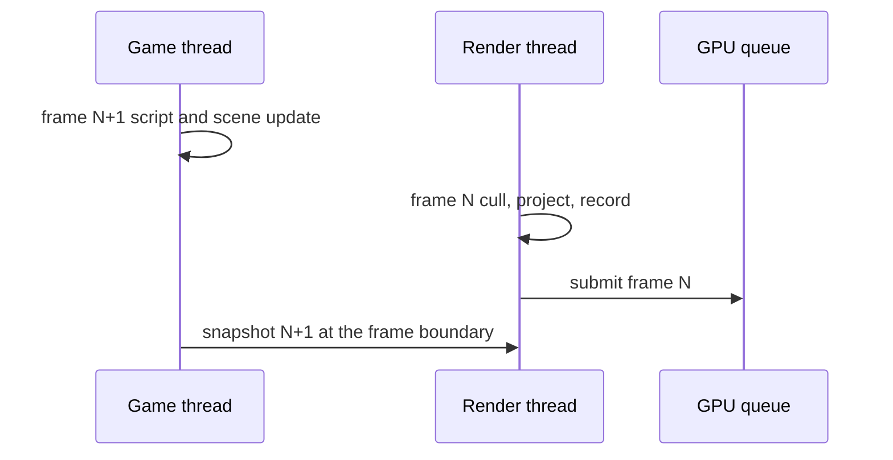

# PRD-574 — Native frames overlap game and render work on threads

**Status:** NOT STARTED
**Priority:** P2 — no measurement shows how much of a native frame a second thread could overlap (Phase 1 open); the thread split itself (Phases 2–3) waits on that number.
**Complexity:** 7 (HIGH) — 6–10 engine files (+2), a render thread is a new module (+2), frame snapshots shared across threads are concurrency (+2), the Android build carries it (+1); risk override: none
**Owner:** João
**Depends on:** [PRD-578](./PRD-578-the-engine-skips-work-that-did-not-change.md) Phase 1 (its single-thread lock shortcut must change before a second thread can release nodes), [PRD-573](./PRD-573-the-performance-bar-is-a-scorecard-on-named-scenes.md)
**Estimate:** Phase 1 ≈ 6 h; Phase 2 ≈ 40–60 h; Phase 3 ≈ 24–40 h. No quick win: Phase 1 measures and changes no frame.

## Context

Layer: engine (`packages/runtime-native/src/engine/` on `origin/feat/native-engine`). A game cannot
move engine work to another thread, so the engine owns this.

Native multithreading in the engine is not established (read 2026-10-09 at `76989167f`):

- Inside `src/engine/`, the only thread the engine creates is the package-load worker set,
  `world/admission/package_loads.h:94` (`std::vector<std::thread> workers_`).
- The legacy host has more threads, all outside the engine and all deleted with it by
  [PRD-535](../native-engine/PRD-535-n21-the-js-engine-is-deleted.md): presentation
  (`src/webgpu/presentation.cpp:308`), a 2-thread pipeline compile pool
  (`src/webgpu/bindings_pipelines.cpp:244-252`), async image decode
  (`src/webgpu/async_image_decode.cpp`), pipeline-cache persistence
  (`src/webgpu/bindings_pipeline_cache.cpp:228`), workers (`src/workers/worker_thread.cpp:48`) and
  audio decode.
- So game script, scene update (animation, transforms), cull, project, command recording and
  submit all run on one thread, one after another. No number says how long each stage is on native
  desktop, so no number says what a second thread would save.

### What Unreal does (UE 5.8.3, design reference only)

- A game thread, a rendering thread and an RHI thread run one frame apart. The game thread enqueues
  render commands (`Engine/Source/Runtime/RenderCore/Public/RenderingThread.h`,
  `ENQUEUE_RENDER_COMMAND`; started by `RenderCore/Private/RenderingThread.cpp:561`
  `StartRenderingThread`). The RHI thread is optional per platform
  (`RHI/Public/RHICommandList.h:158` `IsRunningRHIInSeparateThread`).
- Parallel work goes through a task graph (`Core/Public/Async/TaskGraphInterfaces.h`,
  `Core/Public/Tasks/Task.h`), for example visibility and mesh draw command setup
  (`Renderer/Private/SceneVisibility.cpp`, `Renderer/Private/MeshDrawCommands.cpp`).

## Solution

1. **Measure first (Phase 1).** The native player reports CPU p50 per stage: game script, scene
   update, cull and project, record, submit and present. The gate: continue only if the smaller of
   (game plus scene update) and (cull, project, record and submit) is at least 25% of the frame CPU
   p50 on `heterogeneous` or Midway desktop. Below that, record the decline under `## Decisions`.
2. **Render one frame behind (Phase 2).** At the frame boundary the game thread hands the render
   thread an immutable snapshot of the render records that changed (the `RenderDatabase` revision
   already marks them). The render thread culls, projects, records and submits frame N while the
   game thread runs frame N+1. Readbacks that game code waits on (raycasts against GPU data, pixel
   reads) keep their current blocking order. A `--single-thread` player flag and the Wasm build keep
   today's order, so both paths stay testable.
3. **Split cull and project into jobs (Phase 3)**, only if Phase 2 leaves the render thread as the
   longer side.

## Execution Phases

#### Phase 1: The stage split is measured
**Status:** NOT STARTED
**Files:** `src/engine/player/run.h`, `src/engine/renderer/renderer.cpp`, `packages/playtest/src/runner/perf.ts`
- [ ] The native player reports CPU p50 for the six stages, and the stages sum to the frame CPU p50 within 5%. proof: red-green case in `packages/playtest/__tests__/perf.spec.ts`, then `node packages/playtest/dist/runner/cli.js perf --executable <native player> --target desktop --text`
- [ ] The overlap gate is applied on `heterogeneous` and recorded under `## Decisions`, with the load average. proof: the same `perf` command over `pnpm bench:engines -- --arms native --workloads heterogeneous`

#### Phase 2: The render thread runs one frame behind
**Status:** NOT STARTED
**Files:** `src/engine/renderer/render_database.{h,cpp}`, `src/engine/renderer/renderer.{h,cpp}`, `src/engine/player/run.h`, `src/engine/animation/property_binding.cpp`, `cmake/NativeEngineCore.cmake`
- [ ] Threaded and `--single-thread` players render the same frames to the pixel over the `native-engine-batched-vs-unbatched` scenes. proof: red-green case in `ctest --test-dir packages/runtime-native/build/tn-linux -R native_engine_batched_vs_unbatched` run in both modes
- [ ] The threaded player is free of data races over 600 frames. proof: the same ctest in a ThreadSanitizer build (`-fsanitize=thread`), zero reports
- [ ] Frame CPU p50 falls against `--single-thread` in the same run. proof: `pnpm bench:engines -- --arms native --workloads heterogeneous` with both player modes in one invocation, threaded/single-thread ratio at most 0.8

#### Phase 3: Cull and project run as jobs, if Phase 2 earns it
**Status:** NOT STARTED
**Files:** `src/engine/scene/projected_cull.cpp`, `src/engine/renderer/visibility/camera_cull.cpp`, `src/engine/renderer/render_database.cpp`
- [ ] The decision is recorded under `## Decisions`: continue only if the render thread is the longer side after Phase 2. proof: the Phase 1 `perf` stage report on the threaded player
- [ ] Jobbed cull and project give the same cull reports and the same frame, and the render-thread CPU p50 falls in the same run. proof: `ctest --test-dir packages/runtime-native/build/tn-linux -R native_engine_camera_cull`, then the Phase 2 `bench:engines` A/B with ratio below 1.0

## Blocked on

- The Android claim needs the Pixel 8 attached, because thread scheduling on big and little cores differs from desktop. Unblocked when João attaches the device.
