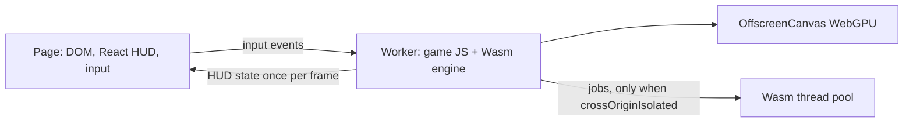

# PRD-575 — The web engine renders from a worker on Wasm threads

**Status:** NOT STARTED
**Priority:** P2 — decision 12 asks for a worker renderer and Wasm threads, and no measurement shows their cost or gain on Midway yet (Phase 1 open); the worker and thread phases wait on it.
**Complexity:** 8 (HIGH) — 6–10 files across the engine and the web host (+2), a worker host is a new module (+2), threads over shared memory are concurrency (+2), the Wasm build is its own release artifact (+2); risk override: none
**Owner:** João
**Depends on:** [PRD-574](./PRD-574-native-frames-overlap-game-and-render-work-on-threads.md) Phase 3 (the job split) for Phase 3 only. Phases 1–2 depend on nothing.
**Estimate:** Phase 1 ≈ 6 h; Phase 2 ≈ 40–60 h; Phase 3 ≈ 16–24 h. No quick win: Phase 1 measures, and Phase 2 is far past four hours.

## Context

Layer: engine and web host (`packages/runtime-native/src/engine/wasm/`, `packages/three-native/src/`
and the Wasm targets in `cmake/NativeEngineCore.cmake`, on `origin/feat/native-engine`). A game cannot
move the engine to a worker or turn on Wasm threads, so the framework owns this.

Decision 12 in `docs/architecture/NATIVE-ENGINE-DECISION.md` (on `origin/feat/native-engine`) says:
the renderer runs in a Web Worker on an `OffscreenCanvas`, and animation, culling and decode use Wasm
threads over `SharedArrayBuffer` where the host serves cross-origin isolation (COOP/COEP). Neither is
built (read 2026-10-09 at `76989167f`):

- The web engine (`tn-native-engine-web`, `cmake/NativeEngineCore.cmake:494`) links with
  `-sALLOW_MEMORY_GROWTH=1 -sMAXIMUM_MEMORY=4GB` and compiles with `-msimd128` (`:11-12`). No Wasm
  target links `-pthread`.
- The engine runs on the page's main thread with the game's JS, the DOM and the React HUD.
- The bench server already sends `Cross-Origin-Embedder-Policy: require-corp` and
  `Cross-Origin-Opener-Policy: same-origin` (`scripts/engine-load-test/browser.ts:166-167`). Whether
  Midway's dev and release servers send them is unverified.

### The web limits, as known today

| Limit | State | Source |
| --- | --- | --- |
| Wasm SIMD | on (`-msimd128`) | `NativeEngineCore.cmake:11-12` |
| Linear memory | 4 GB cap (`MAXIMUM_MEMORY=4GB`), 32-bit addresses | `NativeEngineCore.cmake:494` |
| Memory64 in our target browsers | unverified | — |
| Multi-draw-indirect | not in core WebGPU; an experimental Chromium feature exists (unverified) | — |
| Wasm threads | need `SharedArrayBuffer`, which needs COOP/COEP | decision 12 |
| Memory growth with threads | Emscripten warns that `-pthread` with `ALLOW_MEMORY_GROWTH` slows JS access to memory; the cost for this engine is unverified | — |

### What Unreal does (UE 5.8.3, design reference only)

The UE 5.8.3 source has no web platform (no HTML5 runtime module), so this PRD takes no web design
from it. The
threading model (a game thread and a render thread one frame apart, with tasks below them) is
in `Engine/Source/Runtime/RenderCore/Public/RenderingThread.h` and is the subject of PRD-574.

## Solution

1. **Measure (Phase 1).** Build the web engine with and without `-pthread` and compare Midway frame
   CPU busy in one run. Record which Midway servers send COOP/COEP. If the threaded build costs more
   than 2% on the single-thread path, record that under `## Decisions` and stop Phase 3.
2. **The engine and the game run in one dedicated worker (Phase 2).** Game script calls the engine
   about 812 times per frame, so the engine and the game share a thread. The page keeps the DOM, the
   React HUD and input, and forwards input events to the worker. HUD state crosses by
   `postMessage` once per frame. The canvas goes to the worker with `transferControlToOffscreen`.
   The worker mode is behind a flag until Phase 3.
3. **Jobs on Wasm threads (Phase 3).** The job split of PRD-574 Phase 3 (cull and project) and the
   animation evaluation run on a Wasm thread pool when `crossOriginIsolated` is true. Without it the
   engine runs single-threaded and the frame report says `threads: off (no COOP/COEP)`.

## Execution Phases

#### Phase 1: The cost of threads and the hosting rule are measured
**Status:** NOT STARTED
**Files:** `cmake/NativeEngineCore.cmake`, `scripts/profile-wasm-page.ts`
- [ ] A `-pthread` build of `tn-native-engine-web` runs Midway, and its single-thread frame CPU busy is recorded against the base build with the load average. proof: `pnpm profile:wasm-page -- --url <native Midway, pthread build> --control <native Midway, base build> --cpu-work --json` (the decision gate is subject/control at most 1.02)
- [ ] Each Midway server (dev and release build) is recorded with its `crossOriginIsolated` value, and the decision is recorded under `## Decisions`. proof: the `profile:wasm-page` JSON for each server reports `crossOriginIsolated`

#### Phase 2: The engine and the game run in a worker
**Status:** NOT STARTED
**Files:** `packages/three-native/src/browser-renderer.ts`, a worker host beside it, `src/engine/wasm/web_host.cpp`, `cmake/NativeEngineCore.cmake`
- [ ] With the worker flag on, the starter template's playtest scenario passes, input reaches the game, and the HUD updates. proof: red-green run of `pnpm test:templates` on the starter kit with the flag on
- [ ] Main-thread busy time per frame on Midway falls in worker mode, and frame p50 does not rise. proof: `pnpm profile:wasm-page -- --url <native Midway, worker mode> --control <native Midway, main-thread mode> --cpu-work` with subject/control main-thread busy below 0.5 and frame p50 at most 1.0
- [ ] Worker mode renders the same pose as main-thread mode and passes the visual judge. proof: headed `--browser-recipe webgpu` captures of both modes with `adapter.info` checked, a fresh judge subagent, verdict recorded here

#### Phase 3: Jobs run on Wasm threads, with an honest fallback
**Status:** NOT STARTED
**Files:** `src/engine/wasm/web_host.cpp`, `src/engine/scene/projected_cull.cpp`, `src/engine/animation/mixer.cpp`, `cmake/NativeEngineCore.cmake`
- [ ] Without COOP/COEP the engine runs single-threaded and reports `threads: off`, and with them it runs the job pool. proof: red-green case in `ctest --test-dir packages/runtime-native/build/wasm -R native_engine_wasm_browser_backend` for both isolation states
- [ ] Midway frame CPU busy falls with the pool against the worker-mode build without it. proof: `pnpm profile:wasm-page -- --url <native Midway, pool> --control <native Midway, worker mode> --cpu-work` with subject/control below 1.0

## Blocked on

- The React HUD crossing (once-per-frame `postMessage`) changes how a game's HUD reads game state. João confirms that contract before Phase 2 merges, because it reaches every template's `AGENTS.md`.
- The playtest harness reads the canvas from the page. Its capture of an `OffscreenCanvas` owned by a worker is unverified. If it fails, the harness change is its own PRD.
- The Android web column needs the Pixel 8 attached. Unblocked when João attaches the device.
