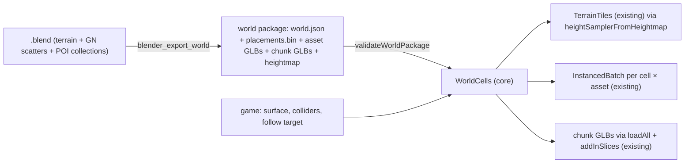

# PRD-448 — World cells: Blender-authored worlds, exported once and streamed by cell

**Status:** IN PROGRESS (Phase 3)
**Complexity:** 6 (MEDIUM); risk override: none. About 9 implementation files across `core` and `blender-mcp`, a new runtime module, and async residency (loads racing eviction).
**Owner:** unassigned (drafted by Claude, 2026-09-25)
**Depends on:** None. First consumer: Machinefall (private game), whose PRD-001 adopts this.

## Context

A game that authors a large outdoor world in Blender has no path into the runtime beyond "export one huge GLB". The pieces exist, but each game has to glue them together and own the hard part:

| Piece | Where | What it covers | What it leaves to every game |
| --- | --- | --- | --- |
| `TerrainTiles` | `packages/core/src/world-tiles.ts:1263` (options at `:54`) | Keeps heightfield tiles around a followed position. Handles LOD distances, skirts, tile/byte budgets and per-tile colliders. | Where `sampleHeight` comes from. Everything that isn't terrain. |
| `InstancedBatch` | `packages/core/src/instanced-batch.ts:60` | One draw for many copies of a mesh | Which instances exist where, and when to build or free a batch |
| `loadAll` / `addInSlices` | `packages/core/src/streaming.ts` | Parallel fetch and time-sliced attach | Deciding what to load and unload as the player moves |
| bpy recipes | `packages/blender-mcp/src/recipes.ts`, `gpl/recipes/` | Decimate, unwrap, bake AO, retarget on one model | Nothing exports a world: terrain, Geometry Nodes scatters, POI collections |

The architecture notes already say *"Game owns geography, residency, … streaming"*. The UE5 feature map ranks **F8 World Partition / HLOD** as "C — Next" (`threenative-ue5-feature-checklists-and-repository-reuse-map.md:32`) and lists "Cell packaging, streaming budget" as its missing parts.

**Motivating world (first consumer):**
- 2 × 2 km heightfield at 2 m spacing.
- About 50 k Geometry-Nodes-scattered trees across ~6 species, plus rocks and ground cover. Ground cover is dense only near the camera.
- About 3 k hand-placed POI objects: industrial yard, bridge, highway wrecks, cabins.
- Authored in one Blender 5.2 file.

Today it renders only inside Blender, and a single GLB of it would be several GB with no residency.

## Solution

Three reusable parts plus proof. None ships game content.

1. **World package v1**, a contract in `core`. A `world.json` manifest plus binary placement buffers:
   - `terrain`: heightmap as raw little-endian `uint16` (`heightmap.u16`, row-major, row `r` at `z = minZ + r·spacing`), world extent, height min/max, spacing. *Changed from 16-bit PNG on 2026-09-25: browsers and the native host decode PNG to 8 bits per channel and the only installed 16-bit decoder (`pngjs`) is Node-only, so a raw buffer is the one format every runtime reads unchanged.* Optional layer masks are passed through untouched to the game's `surface`, since surfaces stay game-owned.
   - `assets`: `id → { glb, lods[], bounds, maxDistance? }`. Ids are stable strings chosen by the author.
   - `cells`: square grid of `cellSize`. Each cell holds instance runs `{ asset, offset, count }` into `placements.bin` (position, yaw or quaternion, uniform scale; float32), plus `chunks` (GLBs of hand-placed geometry clipped to that cell).
   - `validateWorldPackage()` returns named errors: unknown asset, run out of buffer range, cell outside extent, version mismatch.
2. **Blender exporter**:
   - Recipe `export_world` in `blender-mcp/gpl/recipes/` (GPL, bpy), exposed as MCP tool `blender_export_world`, and runnable as `blender -b world.blend --python export_world.py -- --out <dir> --cell <m>`.
   - Conventions, all custom properties:
     - `tn_world_terrain` on the terrain object.
     - `tn_asset_id` on scatter sources. The object name is the fallback, with a warning.
     - `tn_world_chunk` on POI collections.
     - Hidden, excluded or `_`-prefixed collections are skipped.
   - Reads the **evaluated depsgraph instances at render density**, so viewport "share" tricks don't leak into the export.
   - Writes each referenced asset **once** as GLB, and reuses the existing `decimate` recipe for LODs.
   - Splits chunk collections by cell and samples the heightmap from the terrain mesh.
3. **`WorldCells` runtime** in `core`:
   - `new WorldCells({ url, surface, createCollider?, follow, rings, budgets })`, added to the scene like `TerrainTiles`.
   - Builds a `TerrainTiles` from the package through a new `heightSamplerFromHeightmap()`.
   - Per resident cell, builds one `InstancedBatch` per asset run and honours per-asset `maxDistance` (ground cover near only). Loads chunk GLBs through `loadAll` + `addInSlices`.
   - Evicts out-of-range cells: disposes batches and releases asset keys by refcount.
   - Hard budgets (resident cells, instances, bytes) report pressure instead of silently over-committing.
   - **Cancellation-safe:** a cell leaving range mid-load never attaches.
   - `stats()` reports resident cells, instances, loads in flight, evictions and failures for playtests.

**Out of scope:** HLOD/impostor generation (the rest of F8), server authority or networking of cells, virtual texturing, runtime terrain edits, and a built-in terrain splat material (surfaces stay game-owned).

**Risks:**
- Blender is not in every CI lane. Recipe tests run where Blender ≥ 4.2 is detected and report a skip otherwise. The runtime fixture is a committed, generated package, so runtime proof never needs Blender.
- Placement buffers for 50 k+ instances must not block the main thread. Parse per cell, not whole-file.

## Acceptance Criteria

- [x] AC-1 [local; actor: agent]: `validateWorldPackage` accepts the committed v1 fixture and rejects each malformed variant (unknown asset, out-of-range run, cell outside extent, wrong version) with its named error — Evidence: `world-fixture.spec.ts` (committed recipe output validates) + `world-package.spec.ts` malformed table, passing 2026-09-25.
- [x] AC-2 [local; actor: agent; needs Blender ≥ 4.2]: `blender_export_world` on the fixture `.blend` writes a package that validates. Its instance total equals the scatter's evaluated render-density count, each asset GLB is written exactly once, and a chunk collection spanning two cells lands in both — Evidence: `packages/blender-mcp/__tests__/export-world.spec.ts` on Blender 5.2: 3 586 render instances (viewport: 356), counted by a separate Blender process; `pine`/`rock`/`ground_cover` GLBs written once each (+ LOD1); `yard` chunks in cells (0,2) and (1,1); blender-mcp suite 41/41, 2026-09-25. Chunks are assigned by object origin, not clipped (`ponytail:` ceiling in the recipe).
- [x] AC-3 [local; actor: agent]: `TerrainTiles` built through `heightSamplerFromHeightmap` from an exported heightmap reproduces the source mesh heights within ±2 cm at 1 000 sampled points — Evidence: `packages/core/__tests__/world-heightmap.spec.ts` (101×101 grid, ~275 m range, quantised to uint16, heights read back through `TerrainTiles` tile fields), passing 2026-09-25.
- [ ] AC-4 [local; actor: agent]: `WorldCells` following a moving position keeps only in-ring cells resident. Leaving a cell disposes its batches and releases its asset keys (refcount back to 0). A `maxDistance` asset never appears beyond its distance — Evidence: pending.
- [ ] AC-5 [local; actor: agent]: moving out of range while a chunk load is in flight (delayed loader) leaves nothing attached and the key released; budget overflow reports pressure instead of throwing mid-frame — Evidence: pending.
- [ ] AC-6 [local; actor: agent]: a web (webgpu recipe) playtest flies across the fixture world through the public API. `stats()` shows cells entering and leaving, zero failed loads, and p95 frame time within the scenario's budget — Evidence: pending.
- [ ] AC-7 [local; actor: agent]: the same fixture scenario runs on the desktop native runtime with matching residency counts — Evidence: pending.
- [ ] AC-8 [local; actor: agent]: production-representative proof. The first consumer's 2 km package (≈50 k instances), exported by this recipe, validates and streams through `WorldCells` in that game's playtest with zero failed loads (evidence referenced from the consumer's PRD) — Evidence: pending.

## Integration Ledger

| Capability | Reachable consumer/trigger | Replaces / disposition | Evidence |
| --- | --- | --- | --- |
| World export | Agent/MCP `blender_export_world` → `packages/blender-mcp/src/index.ts` tool registry → `gpl/recipes/export_world.py`; or headless `blender -b … --python export_world.py` | Per-game ad-hoc bpy exporters (the first consumer's are deleted in its PRD) | AC-2 |
| World package contract | `validateWorldPackage` exported from `packages/core/src/index.ts`; called by `WorldCells.load` before anything attaches | New | AC-1 |
| Streamed world | Game adds `new WorldCells(…)` to its scene; driven per frame like `TerrainTiles` (`processCadence`) | Game-owned residency code in consumers; `TerrainTiles` stays the terrain owner and is composed, not forked | AC-4, AC-6, AC-8 |

## Execution Phases

#### Phase 1: Package contract, validator, heightmap sampler
**Status:** DONE (2026-09-25)
**ACs:** AC-1, AC-3
**Files:**
- `packages/core/src/world-package.ts`: types, `validateWorldPackage`, per-cell placement parsing.
- `packages/core/src/world-heightmap.ts`: `heightSamplerFromHeightmap`, `loadWorldHeightmap`.
- `packages/core/src/world.ts`: exports (the `@threenative/core/world` subpath, beside `TerrainTiles`).
- A generated fixture package under `packages/core/__tests__/fixtures/world-v1/`.

**Implementation:**
- JSON schema-shaped types.
- Placement runs are validated against the buffer byte length.
- The sampler reads the raw `uint16` heightmap (one `fetch`) and interpolates bilinearly in world units.

**Verification:** E1: `pnpm --filter @threenative/core test world-package world-heightmap`. Red first: the malformed-variant table, and height error against the source grid.
- [x] contract + validator — `world-package.spec.ts` + `world-heightmap.spec.ts` + `world-capabilities`/`packaging` specs: 37/37 pass (2026-09-25)
- [x] sampler — 1 000 seeded points against the float64 source grid, all within ±0.02 m
- [x] fixture committed (generated, CC0 primitives only): `packages/core/__tests__/fixtures/world-v1/`, 168 912 bytes, 16 cells, 3 586 instances, written by the Phase 2 recipe; `world-fixture.spec.ts` validates it from disk

**Checkpoint:** pending

#### Phase 2: Blender `export_world` recipe + MCP tool
**Status:** DONE (2026-09-25)
**ACs:** AC-2
**Files:**
- `packages/blender-mcp/gpl/recipes/export_world.py`.
- `packages/blender-mcp/src/recipes.ts`: recipe entry.
- `packages/blender-mcp/src/index.ts`: `blender_export_world` tool.
- `packages/blender-mcp/__tests__/export-world.spec.ts`.

**Implementation:**
- Depsgraph instance walk at render settings.
- Asset id resolution with warnings.
- One GLB per asset (LODs via `decimate`); chunk split per cell; heightmap sampled from the terrain mesh.
- The package writer emits the Phase 1 format.

**Verification:** E2: the spec runs the recipe on a tiny generated `.blend` when Blender is detected (skip reported otherwise) and asserts the AC-2 counts and chunk split, then validates the result with Phase 1's validator.
- [x] recipe: `gpl/recipes/export_world.py`. The render-mode depsgraph comes from a throwaway `RenderEngine` (`mode == 'RENDER'`), and every read happens inside `render()`. LOD1 reuses `decimate` through `_common.collapse_decimate`
- [x] MCP tool registered and invoked in the spec: `blender_export_world` is called through `handleToolCall` in `export-world.spec.ts`
- [x] fixture package regenerated by the recipe (proves AC-1's fixture is recipe output): `--cell 64` on `gpl/fixtures/make_world_fixture.py`'s `.blend`

**Checkpoint:** pending

#### Phase 3: `WorldCells` runtime
**Status:** NOT STARTED
**ACs:** AC-4, AC-5
**Files:**
- `packages/core/src/world-cells.ts`.
- `packages/core/src/index.ts`.
- `packages/core/__tests__/world-cells.spec.ts`.

**Implementation:**
- Ring-based residency around the follow target, with hysteresis to avoid thrash at cell edges.
- Batches built from per-cell placement slices.
- Chunk loads use a generation token, so a stale completion is dropped and released.
- Budgets and `stats()`. Terrain is delegated to `TerrainTiles` with the Phase 1 sampler.

**Verification:** E3: the spec drives a scripted follow path with a delayed asset loader and asserts the residency sets, the refcount returning to 0, the `maxDistance` filter, stale-load drop, and budget pressure.
- [ ] residency + batches
- [ ] chunk loads + cancellation
- [ ] budgets + stats

**Checkpoint:** pending

#### Phase 4: Proof on web, native and the first consumer
**Status:** NOT STARTED
**ACs:** AC-6, AC-7, AC-8
**Files:**
- A playtest scenario plus a fixture scene in the existing playtest fixtures (web and native).
- Docs: `docs/` world-streaming how-to.

**Implementation:** the fly-through scene uses only public exports. It records `stats()` samples and frame timing.

**Verification:**
- E4: web playtest (webgpu recipe).
- E5: desktop native run of the same scenario.
- E6: link to the consumer PRD's map-walk evidence.
- [ ] web scenario
- [ ] native scenario
- [ ] consumer evidence linked
- [ ] how-to doc

**Checkpoint:** pending
