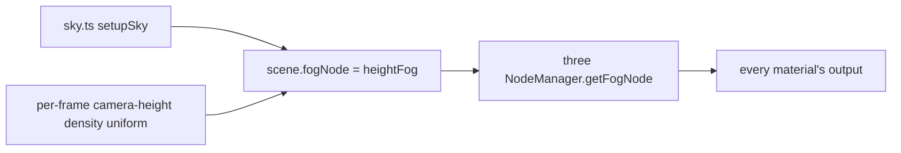

# PRD-560 — Height fog follows the ground, and the sun shows through it

**Status:** NOT STARTED
**Priority:** P2 — AC-1 and AC-2 are open: 11 of 13 templates still ship distance-only fog, so no default scene has ground mist or a sun-side horizon.
**Complexity:** 3 (LOW) — 11+ template files (3), no new module, no package change; risk override: none
**Owner:** João
**Depends on:** None. Keeps the stream-edge guarantee of [PRD-461](../done/open-world/PRD-461-view-distance-basics.md) (done) and coexists with the starter mist from [PRD-VQ-07](../done/PRD-VQ-07-volumetric-fog.md).

## Context

Eleven templates set `scene.fog = new FogExp2(colour, density)` in `src/render/sky.ts`: starter,
action-rpg, minimal, platformer, puzzle, racing, rts, runner, sailing, shooter and snow
(`rg -l FogExp2 packages/create-threenative/templates/*/src/render/sky.ts`, 2026-10-09).
Tower-defense uses linear `Fog`. Rain sets no fog.

`FogExp2` reads only the distance to the fragment. So:

- A valley and a ridge at the same distance get the same haze. A scene has no ground mist.
- The fog colour is one palette constant. The horizon toward the sun and the horizon away from it
  are the same colour.

A streaming game's distance fog carries a guarantee that this PRD must keep.
[PRD-461](../done/open-world/PRD-461-view-distance-basics.md) (DONE, PR #470) ships game-owned linear
fog that is opaque at the prop ring, so the stream edge is never visible. The rule is "fog `far` ≤
`ring · cellSize`", and the ground must end beyond it (`docs/guides/world-streaming.md:143-170`). The
example's source is `examples/abyss-framework/src/render/worldFog.ts`. A height term that replaced
that distance term would leave the stream edge bare wherever the view ray stays above the fog layer:
a ridge, or a camera in flight.

three 0.185.1 ships `exponentialHeightFogFactor` (`three/src/nodes/fog/Fog.js:73-82`). It is not the
physical integral: it multiplies the fragment's depth below a height by the view depth. A fragment
above that height gets no fog, even when the view ray crosses the dense layer. It also ignores the
camera height.

### What Unreal does (UE 5.8.3, read 2026-10-09)

Unreal's exponential height fog is a closed-form line integral, not a ray march:

- Density falls off exponentially with height above a fog height. The integral of that density
  along the straight camera-to-fragment ray has a closed form: the density at the camera, times
  `(1 - 2^-(falloff * rayDeltaZ)) / (falloff * rayDeltaZ)`, times the ray length. When the ray is
  nearly horizontal the quotient goes to 0/0, so a first-order Taylor term replaces it. The exponent
  is clamped at -127 so `exp2` stays finite.
  `UE 5.8.3: Engine/Shaders/Private/HeightFogCommon.ush:205-213`.
- The density at the camera does not change across the frame, so the CPU computes it once per frame.
  The CPU also clamps the camera height relative to the fog height and clamps the exponent to the
  float range, for precision. `UE 5.8.3: Engine/Source/Runtime/Renderer/Private/FogRendering.cpp:370-405`.
- Transmittance is `exp2(-integral)`, floored by `1 - maxOpacity`. A cutoff distance turns fog off
  past a range, so the sky is not fogged twice.
  `UE 5.8.3: Engine/Shaders/Private/HeightFogCommon.ush:394-407`.
- Directional inscattering adds the sun colour, weighted by
  `pow(saturate(dot(viewDir, sunDir)), exponent)`. It integrates the same density, but only over the
  part of the ray past an inscattering start distance. So the sun glow is a distant-haze effect and
  does not tint nearby objects.
  `UE 5.8.3: Engine/Shaders/Private/HeightFogCommon.ush:355-368`.
- Component defaults: density 0.02, height falloff 0.2, max opacity 1, start distance 0,
  inscattering exponent 4, inscattering start distance 100 m (10000 UE units).
  `UE 5.8.3: Engine/Source/Runtime/Engine/Private/Components/ExponentialHeightFogComponent.cpp:80-98`.
  Unreal works in centimetres. This PRD recalibrates the values in metres against each template's
  current eye-level haze. It does not copy them.

The fragment cost is two `exp2` calls, one division and one `pow`. There is no march, no texture and
no extra pass.

## Solution

**The look ships as generated source** (rule 1(b)): the fog decides how the scene looks, so each
template's `src/render/sky.ts` owns it. Nothing changes in `packages/`.

- **The height term adds to the distance term and never replaces it.** The final transmittance is
  `T_distance × T_height`. `T_distance` is the game's existing distance fog: the template's current
  `FogExp2` curve through three's `densityFogFactor`, or a streaming game's linear near/far through
  `rangeFogFactor`. Both are exported from `three/tsl` (`three/src/nodes/fog/Fog.js:40, 57`). The
  product is never more transparent than either factor alone. So wherever `T_distance` reaches 0,
  at fog `far` and at the prop-ring corner, the frame stays fully fogged, and the PRD-461 guarantee
  holds unchanged. The sun-inscatter colour mixes in with the same combined opacity.
- `sky.ts` builds a TSL fog node and assigns it to `scene.fogNode`. three's `NodeManager.getFogNode`
  (`three/src/renderers/common/nodes/NodeManager.js:578`) applies `scene.fogNode` per material, in the
  same place `FogExp2` applies today. Transparent materials receive fog, and the background does not.
- The node computes the closed-form integral above, with the Taylor fallback and the exponent clamp,
  in metres. A per-frame uniform carries the camera-height density term. The sun lobe uses the
  template's existing `SUN_DIRECTION`. The non-directional colour is the template's current fog
  colour (for example `palette.skyLow`), so the eye-level look does not change.
- The named controls in `sky.ts` are: `density`, `heightFalloff`, `fogHeight`, `maxOpacity`,
  `startDistance`, `sunExponent`, `sunStartDistance` and `cutoffDistance`. Each control has a
  comment that says which way to move it. The pure math is exported from `sky.ts`, so a node-env
  spec can check it.
- Each template keeps its current eye-level haze. At camera height and the current reference
  distance, the combined transmittance matches the old `FogExp2` transmittance within 2%. The
  `FogExp2` density is lowered to make room for the height term at eye level. It is never removed.
- **Coexistence with the starter mist:** `STARTER_MIST` already owns the fog while it is enabled
  (starter `AGENTS.md`). Height fog yields to it the same way `FogExp2` does today. Only one fog owner
  exists at a time.

Risks:

- three may not apply `scene.fogNode` on a node material that sets its own `fog: false`. Phase 1
  checks the starter's materials.
- The native host must compile the same TSL fog node. Phase 2 proves it on the desktop target.

## Acceptance Criteria

- [ ] AC-1 [local]: In the scaffolded starter, the height-fog frame is judged at or above the `FogExp2` frame by a fresh judge, and low ground reads hazier than a ridge at the same distance. proof: `pnpm visuals:ab --before <FogExp2 capture> --after <height-fog capture> --raters 3` — Evidence: pending.
- [ ] AC-2 [local]: At 1080p on the RTX 2080 browser WebGPU lane, height fog costs at most 0.1 ms GPU more than `FogExp2` in the same starter build. proof: `TN_FRAME_BUDGET` main-pass p50 delta from `node packages/playtest/dist/runner/cli.js perf` on both builds — Evidence: pending.

## Integration Ledger

| Capability | Reachable consumer/trigger | Replaces / disposition | Evidence |
|---|---|---|---|
| Height fog | scaffolded game → `setupSky()` in `templates/*/src/render/sky.ts` → `scene.fogNode` → three `NodeManager.getFogNode` → every material | Moves the `FogExp2` term of 11 templates into the node as `T_distance`, unchanged in shape. Tower-defense linear `Fog`, rain's no-fog and the PRD-461 streaming recipe stay unchanged. | AC-1, AC-2, Phase 1, Phase 3 |

## Execution Phases

#### Phase 1: Height fog in the starter
**Status:** NOT STARTED
**Files:** `packages/create-threenative/templates/starter/src/render/sky.ts`, `packages/create-threenative/templates/starter/src/render/heightFog.ts` (new: the template `__tests__/template.spec.ts` render-export rule needs each exported maths symbol to have a caller in another file, so the maths moved out of `sky.ts` and `sky.ts` keeps the look numbers), `packages/create-threenative/__tests__/height-fog.spec.ts` (new)
**Implementation:** Write the integral as a pure function, then the TSL node that uses it, and assign the node to `scene.fogNode`. Calibrate `density` and `heightFalloff` to the current eye-level haze.
- [x] The closed form matches a 4096-step numeric march within 1% for camera heights below, inside and above the layer, for rays from -89° to +89°, at exactly horizontal (the Taylor branch), and at the exponent clamp. proof: `pnpm exec vitest run packages/create-threenative/__tests__/height-fog.spec.ts` — 5/5 pass, 2026-10-09. The clamp case asserts finite and fully opaque, not equality: Unreal clamps the camera term only, so a march that clamps per sample differs by design.
- [x] The combined transmittance is never above the distance term alone. With PRD-461's recipe (linear near 128 m, far 256 m), it is 0 at fog `far` for a camera far above the layer. proof: `pnpm exec vitest run packages/create-threenative/__tests__/height-fog.spec.ts` — same 5/5 run.
- [ ] The starter template gate passes with height fog on, and the mist-enabled arm shows one fog owner. proof: `pnpm test:templates` (starter).

#### Phase 2: Phone cost and native
**Status:** NOT STARTED
**Files:** none beyond Phase 1, unless a defect needs a fix
- [ ] On the Pixel 8, the main pass of the height-fog starter costs at most 0.2 ms more than the `FogExp2` build. proof: `node packages/playtest/dist/runner/cli.js perf --logcat <serial>` on both Android builds.
- [ ] The desktop native host renders the starter with height fog and a non-blank screenshot. proof: `node packages/playtest/dist/runner/cli.js playtests/survives.playtest.json --target desktop` in a scaffolded starter.

#### Phase 3: Every FogExp2 template
**Status:** NOT STARTED
**Files:** `src/render/sky.ts` in action-rpg, minimal, platformer, puzzle, racing, rts, runner, sailing, shooter, snow; each template's `AGENTS.md` (and mirrors)
- [ ] The ten other templates use height fog. Each matches its old eye-level transmittance within 2%, and the template gate passes. proof: `pnpm test:templates`.
- [ ] Each template's `AGENTS.md` names the fog controls and the mist ownership rule, and the mirrors are in sync. proof: `pnpm sync:agents --check && pnpm exec vitest run scripts/__tests__/primary-docs.spec.ts scripts/__tests__/sync-agent-docs.spec.ts`.
