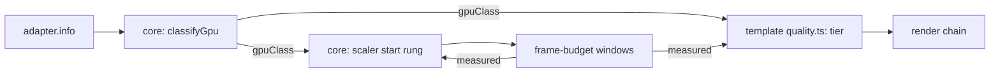

# PRD-563 — The first frame starts at the tier the GPU family can hold

**Status:** NOT STARTED
**Priority:** P2 — All boxes are open: a phone or a laptop iGPU starts at a tier picked by one `mobile` flag, then spends measured windows stepping to the tier it can hold.
**Complexity:** 5 (MEDIUM) — 11+ files, because each template's generated `quality.ts` takes the new input (3); new core module (+2); risk override: none
**Owner:** João (tier mapping in the templates), agent (implementation)
**Depends on:** None. Related: [PRD-549](../performance/PRD-549-the-engine-holds-60-fps-on-a-weak-gpu.md) (it fixes how fast the scaler reacts on a weak GPU; this PRD fixes where it starts, and duplicates none of its boxes), [PRD-294](../useful-defaults/PRD-294-a-software-rasteriser-should-not-run-the-high-tier-chain.md) (its software-adapter floor becomes one class of this table), [PRD-287](../useful-defaults/PRD-287-the-default-look-holds-the-phones-budget.md) (the measured ladder that refines the start).

## Context

Today the start point of the look and of the pixel count is a guess with two inputs:

- Each template's generated `src/render/quality.ts` picks the tier from `{ mobile, software, tier }`.
  The starter returns `low` for `software`, `low` for `mobile`, and `high` for everything else
  (`packages/create-threenative/templates/starter/src/render/quality.ts:52-71`).
- `RenderChain` with `tier: "auto"` starts at `high` and steps down on measured windows
  (`packages/core/src/render/chain.ts:304-306`).
- `ResolutionScaler` starts at rung 0, scale 1.0 (`packages/core/src/resolution-scaler.ts`, `RESOLUTION_SCALER.rungs`).
- The renderer already reads `adapter.info` (`architecture`, `description`, `device`, `vendor`)
  into an identity string and a software flag (`packages/core/src/renderer.ts:1074-1145`). Only
  the software flag reaches a template.

Effect: a Mali-G52 phone and a Mali-G715 phone get the same `low` look. A laptop with an Intel
iGPU gets the same `high` look and scale 1.0 as an RTX desktop. PRD-549 measured that case on
the LAN laptop's Iris Xe: Machinefall started at scale 1.0 with 4× MSAA, its main pass took
43–110 ms, and the scaler needed several windows after readiness to reach the 0.61 floor. Each wrong start costs measured
windows to correct, and each tier step can compile new pipelines.

**What Unreal does (UE 5.8.3, ideas only, no code copied):**

- `Engine/Config/BaseDeviceProfiles.ini:923-937` matches the Android GPU family string with a
  regular expression (for example "Adreno (TM) 7xx", "Mali-G71") to a device profile.
- Each family profile inherits one bucket: Adreno 5xx → Mid, Adreno 6xx → High, Adreno 7xx and
  8xx → Epic (`:1172-1211`); Mali-G710, G7xx and G9xx → Epic, an unknown newer Mali "Gx" → High
  (`:1374-1406`).
- Each bucket sets the scalability group levels and a content scale factor. `Android_Low` sets
  `r.MobileContentScaleFactor=0.8` and all groups to 0 (`:1033-1041`); `Android_Mid` sets 1.0 and
  groups to 1 (`:1049-1057`); `Android_High` sets groups to 2 (`:1065-1073`).
- On desktop, a short synthetic benchmark gives a CPU and a GPU performance index. Each group
  level comes from thresholds on the GPU index or on the smaller of the two
  (`Engine/Source/Runtime/Engine/Private/Scalability.cpp:205-222`,
  `Engine/Config/BaseScalability.ini:24-33`, thresholds 18 / 42 / 115).

We take the first idea (a family table for the start point) and skip the benchmark: our measured
ladder already does that job after the first window, at no startup cost.

## Solution

1. **Core classifies the adapter (mechanism).** A new `gpu-class.ts` maps the four `adapter.info`
   fields to one class: `software`, `mobile-low`, `mobile-mid`, `mobile-high`, `integrated`,
   `discrete` or `unknown`. One table, ordered rules, first match wins. The software rule is the
   existing `SOFTWARE_ADAPTER` test. The renderer reports `TN_GPU_CLASS` with the class, the
   matched rule and the raw fields. An adapter that no rule matches is `unknown`, and `unknown`
   keeps today's behaviour exactly.
2. **The template maps class to tier (look).** `resolveQualityTier` receives `gpuClass` beside
   `mobile` and `software`. The generated table is game source. The starter's first mapping:
   `software` and `mobile-low` → `low`, `mobile-mid` → `low`, `mobile-high` and `integrated` →
   `medium`, `discrete` → `high`, `unknown` → today's `mobile` rule.
3. **Core picks the starting scale (mechanism).** `ResolutionScaler` starts at a rung chosen
   from the class: `mobile-low` starts one rung down (0.85, near Unreal's 0.8 for its Low
   bucket), every other class starts at rung 0. The source reads `auto`. The first eligible window
   moves it either way, so measurement always wins over the table.
4. **Browsers may coarsen the fields.** Chrome reports `vendor` and `architecture` and can leave
   `description` empty. Each rule names the field it reads. A rule that needs a field the platform
   does not report never matches, so the result is `unknown`, never a wrong class.

Risk: a wrong rule caps a strong GPU. Phase 2 pins `discrete` and `unknown` to today's start
with a test, the same failure mode that PRD-294 names.

## Acceptance Criteria

- [ ] AC-1 [local]: A desktop RTX 2080 in browser WebGPU still starts at `high` and scale 1.0, and reports `TN_GPU_CLASS` `discrete`. proof: starter playtest `--browser-recipe webgpu`, `TN_GPU_CLASS` and `TN_RENDER_CHAIN` lines. — Evidence: pending.
- [ ] AC-3 [local]: On the LAN laptop's Iris Xe (Chrome WebGPU), the starter reports `TN_GPU_CLASS` `integrated` and starts at the `medium` tier. proof: starter playtest `--browser-recipe webgpu` on the laptop lane. — Evidence: pending.
- [ ] AC-2 [local]: The Android emulator native host reports its adapter fields and a class, and the starter runs to steady state. proof: starter playtest `--target android` on `emulator-5554`. — Evidence: pending.

## Blocked on

- The phone win (fewer tier and scale changes before the first steady window on a Mali or Adreno phone) needs a physical device on the device lane. Only `emulator-5554` was attached on 2026-10-09. — unblocked by João attaching the Pixel 8.

## Integration Ledger

| Capability | Reachable consumer/trigger | Replaces / disposition | Evidence |
|---|---|---|---|
| GPU class | `createRenderer` adapter read (`renderer.ts:1115-1145`) → `classifyGpu` → `TN_GPU_CLASS` | Software flag stays; it becomes the `software` class | AC-1 |
| Starting tier | template `resolveQualityTier({ gpuClass })` | `mobile` flag stays as the `unknown` fallback | Phase 2 |
| Starting scale | `ResolutionScaler` construction (`game.ts:1394`) | rung 0 stays for every class except `mobile-low` | Phase 2 |

## Execution Phases

#### Phase 1: Classify the adapter
**Status:** NOT STARTED
**Files:** `packages/core/src/gpu-class.ts` (new), `packages/core/src/renderer.ts`; `packages/core/__tests__/gpu-class.spec.ts`
- [ ] `classifyGpu` maps recorded `adapter.info` fixtures to classes: nvidia/turing → `discrete`, SwiftShader → `software`, an Intel iGPU → `integrated`, Mali-G715 → `mobile-high`, Mali-G52 → `mobile-low`, Adreno 5xx → `mobile-mid`, empty fields → `unknown`. proof: red-green `pnpm exec vitest run packages/core/__tests__/gpu-class.spec.ts`.
- [ ] The renderer prints `TN_GPU_CLASS` with class, rule and raw fields once per launch. proof: renderer spec with a stubbed adapter; the live lines are AC-1 and AC-2.

#### Phase 2: Start from the class
**Status:** NOT STARTED
**Files:** `packages/core/src/resolution-scaler.ts`, `packages/core/src/game.ts`, `packages/create-threenative/templates/*/src/render/quality.ts`; scaler and template specs
- [ ] Every template's `resolveQualityTier` takes `gpuClass`, and `unknown` returns exactly today's tier. proof: create-threenative template spec over all 13 generated `quality.ts` files.
- [ ] `ResolutionScaler` starts at the class rung, and the first measured down or up window still moves it. proof: red-green `pnpm exec vitest run packages/core/__tests__/resolution-scaler.spec.ts`.
- [ ] `discrete` and `unknown` start at `high` and scale 1.0. proof: same specs, one case each.

## Decisions

- 2026-10-09 (João, via the Unreal review request): take Unreal's family table, not its startup benchmark. Our frame-budget windows already measure the real game after the first window, and a benchmark would add startup time.
