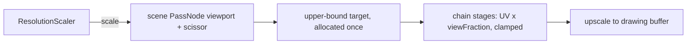

# PRD-564 — The resolution scale changes without reallocating a render target

**Status:** NOT STARTED
**Priority:** P2 — All boxes are open: each scale step resizes the drawing buffer and every pass target, so the controller keeps coarse rungs; Phase 1 has not yet measured that hitch.
**Complexity:** 6 (MEDIUM) — 6–10 files (2), temporal GPU state in the chain stages (+2), native host must draw the same sub-rectangle (+2); risk override: none
**Owner:** João (decline decision after Phase 1), agent (implementation)
**Depends on:** [PRD-384](../performance/PRD-384-adaptive-resolution-gpu-headroom.md) (the GPU-headroom policy this keeps unchanged). Related: [PRD-549](../performance/PRD-549-the-engine-holds-60-fps-on-a-weak-gpu.md) (it fixes the scaler's gates and adds an MSAA rung below the floor; this PRD changes what a scale step costs, and duplicates none of its boxes), [PRD-539](../rendering/PRD-539-low-resolution-temporal-reconstruction-quality-and-cost.md) (a reconstructor needs a scale that can change often and cheaply).

## Context

`ResolutionScaler` (`packages/core/src/resolution-scaler.ts`) picks one of 10 rungs, from 1.0 to
0.23. Its own comments say why the rungs are coarse: "every step reallocates render targets on
WebGPU, and fine granularity buys smoothness with hitches" (`:20-24`), and "the resize reallocates
every render target, which rebuilds pipelines" (`:72-73`).

The mechanism is `renderer.setSize()`. `setResolutionScale` stores the scale and calls the resize
handler (`packages/core/src/renderer.ts:650-660`). The handler resizes the drawing buffer to
`canvas × pixelRatio × scale` (`renderer.ts:1010-1031`). The swap chain shrinks, and every
`PassNode` target in the render chain follows it. The same code defers a resize while an
asynchronous compile holds a depth target (`renderer.ts:652-656`), because a resize then disposes
a texture that a pipeline build still reads.

PRD-549 measured how often the scaler steps on a weak GPU: on the LAN laptop's Iris Xe it went
1.0 → 0.61 within four windows of readiness. Each of those steps paid this reallocation.

PRD-384 already gives the controller the policy that Unreal also uses: a fresh GPU sample within
budget vetoes a down-step, so a CPU-bound or host-bound frame does not lose pixels. This PRD does
not change that policy. It changes what a step costs.

**What Unreal does (UE 5.8.3, ideas only, no code copied):**

- Scene textures are sized once for the **upper bound** of the resolution fraction, and each view
  renders into a rectangle inside them
  (`Engine/Source/Runtime/Renderer/Private/SceneRendering.cpp:3412-3460`). A fraction change moves
  the rectangle and allocates nothing.
- The allocated size rounds up to a multiple of 8, because many passes assume it
  (`Engine/Source/Runtime/RenderCore/Private/RenderUtils.cpp:1178-1192`).
- The fraction is continuous. The estimate is `sqrt(target / measured GPU time)` times the current
  fraction (quadratic model, `Engine/Source/Runtime/RenderCore/Private/DynamicRenderScaling.cpp:45-55`).
  An up-step is amortized: it moves only part of the way to the estimate (`:64-73`, default 0.9;
  `Engine/Source/Runtime/RenderCore/Public/DynamicRenderScaling.h:39-41`). A change smaller than
  2% is ignored (`kDefaultChangeThreshold = 0.02`).
- At least 8 frames separate two changes, so the temporal upsampler's sub-pixel history stays
  valid (`Engine/Source/Runtime/Engine/Private/DynamicResolution.cpp:76-80`, `:221`).
- Two consecutive over-budget GPU frames end the history scan. When every frame scanned was over
  budget, a panic changes the resolution at once and ignores the 8-frame period
  (`DynamicResolution.cpp:96-99`, `:299`, `:337-347`, `:406`).

three r185 already has the stock seam: `PassNode.setViewport()` and `setScissor()` set a viewport
and scissor on the pass target, scaled by its resolution scale
(`three/src/nodes/display/PassNode.js:884-915`, `:953`).

## Solution

1. **Measure first (Phase 1).** Force three scale steps on the starter and record the step frame,
   the next 30 frames, pipelines built and texture bytes reallocated. Continue only if the step
   frame exceeds 2× the window p50, or if a step builds any pipeline. Otherwise record the numbers
   under `## Decisions` and delete Phases 2–3 (R4).
2. **Allocate at the upper bound, draw into a sub-rectangle.** The drawing buffer stays at
   `canvas × pixelRatio`. The scene pass target is allocated once at that size, rounded up to a
   multiple of 8, and reallocated only when the canvas grows. The scaler sets the scene pass
   viewport and scissor to `scale × size`. A final upscale stage samples the sub-rectangle to the
   full drawing buffer.
3. **Every chain stage reads the sub-rectangle.** A stage receives `viewFraction` (the
   sub-rectangle size over the target size) as a uniform. It multiplies screen UVs by it and clamps
   each sample to `viewFraction − half a texel`, so a bilinear tap never reads outside the
   rectangle. Stages that `three` owns (TRAA, GTAO, SSGI, bloom) get a thin wrapper or a stock
   option where one exists. A stage that cannot honour the rectangle is named in
   `TN_RESOLUTION_SUBRECT` as `refused`, and the scaler then keeps today's reallocation path for
   that game. It never draws a wrong frame silently.
4. **Then allow finer steps.** With no reallocation, the controller may use a continuous fraction:
   size from `sqrt(target / gpuMs)`, quantize to 8 pixels, ignore changes under 2%, keep at least
   8 frames between changes, and amortize up-steps. PRD-384's veto and stall guards stay as they
   are. A temporal stage resets or rescales its history on a change. PRD-549's sample-count rung
   (4× → 1× MSAA) still reallocates the multisampled target; it is rare and stays as it is.

Layer: mechanism only, `packages/core` and the native host. No appearance parameter changes.

## Acceptance Criteria

- [ ] AC-1 [local]: On the starter in browser WebGPU (RTX 2080), a forced scale step allocates no texture and builds no pipeline, and the step frame stays within the window's p95. proof: `node packages/playtest/dist/runner/cli.js perf` with a forced-step scenario, `TN_FRAME_BUDGET` and the pipeline census. — Evidence: pending.
- [ ] AC-2 [local]: A frame at scale 0.72 through the sub-rectangle matches the same frame through today's reallocation path within the visual gate's threshold. proof: `pnpm visuals:ab`. — Evidence: pending.

## Integration Ledger

| Capability | Reachable consumer/trigger | Replaces / disposition | Evidence |
|---|---|---|---|
| Scale applied as a viewport | `game.ts` frame-budget window → `ResolutionScaler` → `renderer.setResolutionScale` (`renderer.ts:650`) | The `setSize` path stays as the fallback for a refused stage | AC-1 |
| Sub-rectangle sampling | `RenderChain` stage install (`render/chain.ts`) | Full-target sampling stays when the scale is 1.0 | AC-2 |

## Execution Phases

#### Phase 1: Price the resize
**Status:** NOT STARTED
**Files:** a forced-step playtest scenario under `packages/playtest`; no engine change
- [ ] Three forced steps (1.0 → 0.85 → 0.61 → 1.0) on the starter record the step frame, the next 30 frames, pipelines built and bytes reallocated, over 3 runs. proof: `node packages/playtest/dist/runner/cli.js perf` on the scenario, results under `## Decisions` with the continue or decline call.

#### Phase 2: Draw into the sub-rectangle
**Status:** NOT STARTED
**Files:** `packages/core/src/renderer.ts`, `packages/core/src/render/chain.ts`, `packages/core/src/render/velocity.ts`, `packages/core/src/resolution-scaler.ts`; core specs
- [ ] A scale change sets the scene pass viewport and scissor and allocates nothing; a canvas resize still reallocates once. proof: red-green `pnpm exec vitest run packages/core/__tests__/renderer*.spec.ts` with an allocation-counting renderer stub.
- [ ] Each built-in chain stage samples inside the sub-rectangle, and a stage without support reports `refused` and keeps the reallocation path. proof: red-green chain spec, one case per stage in `RENDER_CHAIN_STAGE_ORDER`.

#### Phase 3: Finer steps and native
**Status:** NOT STARTED
**Files:** `packages/core/src/resolution-scaler.ts`; `packages/runtime-native/conformance/scenes/shared/resolution-subrect.js` (new), `packages/runtime-native/conformance/registry.json`
- [ ] The controller takes continuous fractions (quantized to 8 px, 2% threshold, at least 8 frames apart, amortized up-steps), and PRD-384's existing scaler suites still pass. proof: red-green `pnpm exec vitest run packages/core/__tests__/resolution-scaler*.spec.ts`.
- [ ] The native desktop host draws the same sub-rectangle frame as the browser. proof: `pnpm parity --target desktop --only-tests resolution-subrect`.

## Decisions

- 2026-10-09 (João, via the Unreal review request): filed as a new PRD, not as a box in PRD-384. PRD-384 is a narrow GPU-headroom repair with one open box; this is a new mechanism with its own measurement gate.
