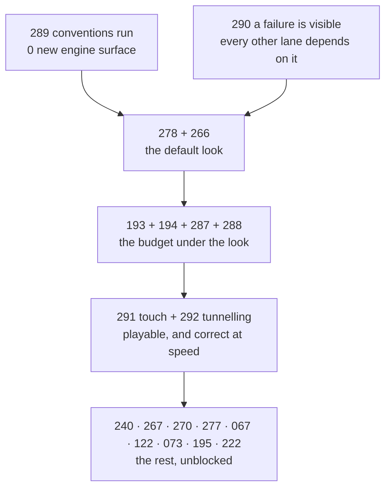

# Batch — useful defaults: value a developer gets without asking for it

**Status: OPEN — assembled 2026-08-30 against `c064b6a0`. PRD-289 through PRD-292 were recovered
and archived on 2026-09-02; the other fifteen keep the status they arrived with.**

Every PRD in this folder pays out to somebody who never read it. That is the whole admission test:
a game that asks for nothing still ends up better because the work was done. A gate that keeps this
repository honest is valuable and does not belong here. An instrument that measures a frame is
valuable and does not belong here. **Value that arrives at a stranger's `pnpm dev` belongs here.**

PRD-289 through PRD-292 were inventoried, recovered in one integration worktree, and archived;
the procedure and run history remain in [RESUME-2026-09-01.md](./RESUME-2026-09-01.md).

## What earns a place in this folder

All three clauses, not two:

1. **The value arrives unasked.** No config key to discover, no import to find, no paragraph of
   `AGENTS.md` to read first. A scaffolded game has it on the first run.
2. **The developer did not build it.** It is a default, a convention that runs itself, or a template
   that already ships the thing — not repo hygiene, not a CI lane, not a measurement harness.
3. **Turning it off is a named override on the same object, and turning it off does not turn its
   measurement off.** A default that cannot be refused is a decision taken away; a default whose
   refusal also silences its reporting is a decision taken away quietly.

Clause 3 is why several PRDs here spend an acceptance criterion on reporting rather than on
behaviour. It is not ceremony. It is the difference between a default and a policy.

## A filing note, stated plainly

`docs/PRDs/AGENTS.md` says `NOT STARTED`, `PARTIAL`, `OPEN`, `SCOPING` and `PROPOSED` PRDs stay in
their owning batch. Fifteen of the files here were moved out of `lighting/`, `performance/`,
`starter-kits/`, `feature-mining/HIGH/`, `batch-2026-08-30/` and the `docs/PRDs/` root on the
owner's instruction, which re-homes them rather than breaking the rule — this folder is now their
owning batch. Every inbound relative link was repointed and `pnpm check:docs` was re-run; the
`batch-2026-08-29` and `alpha-readiness` breakages it still reports predate this batch and belong to
another lane.

`batch-2026-08-30/` is dissolved. Its README is kept verbatim as
[ORIGIN-decent-defaults-2026-08-30.md](./ORIGIN-decent-defaults-2026-08-30.md) because it holds the
measured argument for rows 3 through 8 below and the owner ruling that unblocked PRD-266. Read it
before touching the visual half.

## The four new PRDs, and the tree fact behind each

| PRD | The fact it was filed on |
| --- | --- |
| [289 — the conventions the templates document also run in them](../done/PRD-289-the-conventions-the-templates-document-also-run-in-them.md) | `GroundSnap`, `normaliseToMetres`, `attachToBone` and `AnimationPlayer` appear in **7 of 7** templates' `AGENTS.md` and **0 of 7** templates' `src/`. `CharacterBody3D`, which a template cannot run without, appears in 8 source files. **DONE — 2026-09-02.** |
| [290 — a game that fails to start says why, on the screen](../done/PRD-290-a-game-that-fails-to-start-says-why-on-the-screen.md) | `GameCanvas.tsx:38` catches a rejected boot and writes the message to the DOM. `style.css:58` puts the launch card over it at `z-index: 9999`, and `main.ts` only removes that card once a `<canvas>` appears — which a pre-renderer failure never produces. **DONE — 2026-09-02.** |
| [291 — a template is playable with the input the device has](../done/PRD-291-a-template-is-playable-with-the-input-the-device-has.md) | One template ships 238 lines of touch controls and gates them on `isNative() && isMobile() && isTouchscreenAvailable()`, so no mobile **browser** ever sees them. The other six bind movement to keys only. **DONE — 2026-09-02.** |
| [292 — a fast body does not pass through a wall](../done/PRD-292-a-fast-body-does-not-pass-through-a-wall.md) | `grep -rn 'ccd\|continuous' packages/physics/src/` returns nothing. A game cannot enable continuous collision on either backend without editing package code. **DONE — 2026-09-02.** |

Each opens with a Phase 0 that can close it as DECLINED with a number. Three of the four are
template work with no new engine surface at all.

## Order, and why it is this order

| # | PRD | Status it arrived with | Why here |
| --- | --- | --- | --- |
| 1 | [289 — the conventions the templates document also run in them](../done/PRD-289-the-conventions-the-templates-document-also-run-in-them.md) | DONE — 2026-09-02 | Cheapest row on the table and the widest promise gap. Nothing to build; the exports exist and are tested. |
| 2 | [290 — a game that fails to start says why](../done/PRD-290-a-game-that-fails-to-start-says-why-on-the-screen.md) | DONE — 2026-09-02 | An invisible boot failure poisons every other row's evidence: a stuck launch card and a working game look identical in a capture. |
| 3 | [278 — every template ships the render chain, and says which stages ran](./PRD-278-every-template-ships-the-render-chain-and-says-what-ran.md) | SCOPING | The largest visual-default delta available, and charter-safe: it ships as generated source. Six templates, six integration problems. |
| 4 | [266 — the render chain names the tier it actually ran](./PRD-266-the-render-chain-names-the-tier-it-actually-ran.md) | PROPOSED | Unblocked by the owner ruling recorded in the origin memo. The spine of rows 5 and 6. |
| 5 | [193 — all templates model allocation-free ordinary frames](./PRD-193-all-templates-model-allocation-free-frames.md) + [194 — every template carries a real performance proof](./PRD-194-every-template-carries-a-real-performance-proof.md) | NOT STARTED | The regression net under row 3. Run **with** it, not after: five TSL stages across seven templates with no per-template proof is how a good default silently becomes a 30 fps one. |
| 6 | [287 — the default look holds the phone's budget](./PRD-287-the-default-look-holds-the-phones-budget.md) | OPEN | The device arm nothing else owns, plus the correction to the tier ladder's selection meter. |
| 7 | [288 — the first frame is not the compile bill](./PRD-288-the-first-frame-is-not-the-compile-bill.md) | OPEN | `warmup.ts` compiles the scene and never walks the post chain, so the chain's pipelines are built after the loading screen leaves. |
| 8 | [291 — a template is playable with the input the device has](../done/PRD-291-a-template-is-playable-with-the-input-the-device-has.md) | DONE — 2026-09-02 | A default look on a phone is worth nothing if the phone cannot move the character. |
| 9 | [292 — a fast body does not pass through a wall](../done/PRD-292-a-fast-body-does-not-pass-through-a-wall.md) | DONE — 2026-09-02 | The one row here that is engine surface rather than template source, and the one whose absence is invisible until it is expensive. |
| 10 | [270 — no lighting node ships web-only](./PRD-270-no-lighting-node-ships-web-only.md) | PROPOSED | A web-only default is not a default. Without it the native templates diverge on first `pnpm dev`. |
| 11 | [240 — text is not uppercase-only](./PRD-240-text-is-not-uppercase-only.md) | PROPOSED | Text renders as authored, on every target, for free. Mined; read its complexity note before starting. |
| 12 | [277 — merged geometry keeps its per-part tint](./PRD-277-merged-geometry-keeps-its-per-part-tint.md) | NOT STARTED | The convention shape exactly: the right thing happens, and a merge that would lose information refuses instead of doing it quietly. |
| 13 | [267 — screen-space GI ships in the templates](./PRD-267-screen-space-gi-ships-in-the-templates.md) | PROPOSED | Folds into row 3's per-template tuning. Kept here so it is not re-argued; run it inside 278 rather than as a second pass over the same seven files. |
| 14 | [073 — performance shipped by default](./PRD-073-performance-by-default.md) | PHASE 2 OPEN | The oldest statement of clause 2 in this repository. Phase 2 is the part still owed. |
| 15 | [195 — the performance default is discoverable and factual](./PRD-195-performance-default-is-discoverable-and-factual.md) | NOT STARTED | Clause 3 for the performance half: a default nobody can find, and whose stated workload is not the one that ran, is not a default. |
| 16 | [222 — returning from the background resumes instead of reloading](./PRD-222-return-from-background-resumes-instead-of-reloading.md) | PARTIAL | Every mobile player does this. Losing the run on a lock-screen press is a default nobody chose. |
| 17 | [067 — one config file, no native source](./PRD-067-game-app-config.md) | NOT STARTED | The abstraction row: a game declares its app shape once and never opens a platform file. |
| 18 | [122 — two specialized agent roles in every starter kit](./PRD-122-specialized-agent-roles.md) | PROPOSED | The framework's primary builder is an agent; a kit that ships the roles is free leverage for whoever scaffolds it. |

## What was considered and left out

- **`lighting/PRD-268`** (irradiance probe volume) and **`lighting/PRD-269`** (motion vectors) — the
  largest quality jumps available and both multi-week. Neither is a default until the chain is in
  the templates at all.
- **[`tech-debt-code-quality/PRD-203`](../tech-debt-code-quality/PRD-203-template-loading-screens-stop-drifting.md)**
  (template loading screens stop drifting) and **[`tooling/PRD-106`](../tooling/PRD-106-reference-image-generation.md)**
  (a project can obtain its own reference image) — real developer value, filed as hygiene and
  tooling rather than defaults. They are referenced from here but live in their owning categories.
- **`agent-leverage/PRD-123` and `PRD-124`** — a compatibility corpus and a repair benchmark. Both
  are instruments. They tell this repository how it is doing; they do not hand a stranger anything.
- **Everything in `BLOCKED/`.** A default blocked on a device that is not attached is not a default
  a stranger gets.

## Batch acceptance

- [ ] Every PRD above is DONE or explicitly DECLINED with the numbers that declined it.
- [ ] `pnpm typecheck && pnpm lint && pnpm test && pnpm budgets` exits 0.
- [ ] `pnpm test:templates` executes all seven generated projects, each on its default path with no
      flag set — the path a stranger takes.
- [ ] One physical-device run appears in `docs/verification/`, naming the serial, the thermal
      status and the adapter. An unexecuted target is recorded as `UNVERIFIED` and never inferred.
- [ ] `pnpm check:docs` is clean for every link this batch owns.
- [ ] Each of the four new PRDs has closed its Phase 0 question with a number, including the ones
      whose number closes them as DECLINED.
- [ ] The batch moves to `docs/PRDs/done/useful-defaults/` only when the last PRD closes. A blocked
      criterion is not completion.
