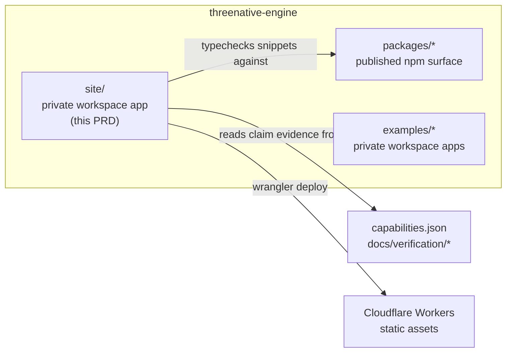
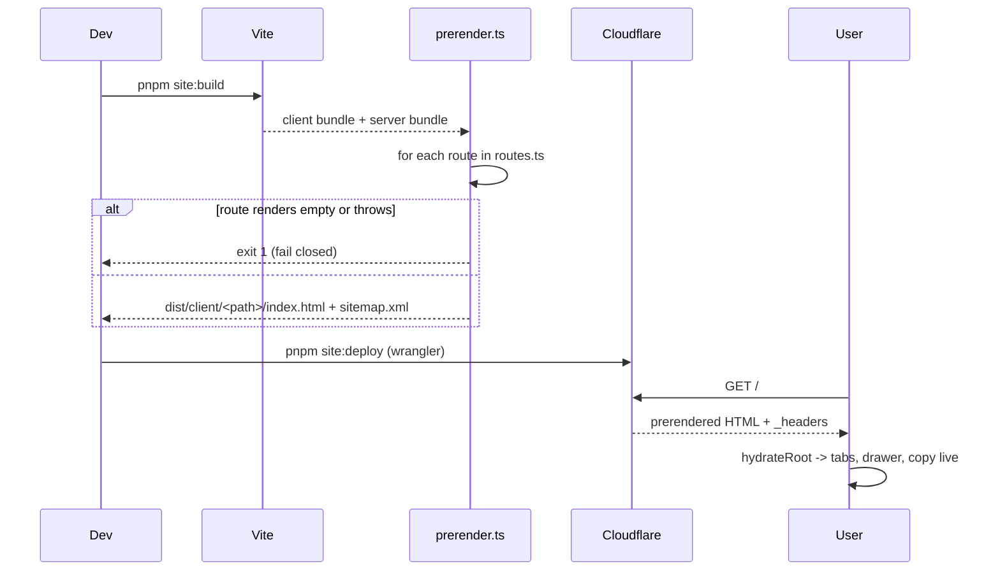

# PRD-331 — The website is a workspace app, not a package, and every claim on it is checkable

**Status: NOT STARTED, filed 2026-09-02.**

**Complexity: 9 → HIGH mode.** New system from scratch (+2), 10+ files (+3), multi-workspace
changes — `pnpm-workspace.yaml`, root scripts, CI (+2), external integration — Cloudflare
Workers/Wrangler (+1), complex state — none beyond UI store (+1 for the prerender/hydrate seam).

**Problem:** ThreeNative has no website. `threenative.dev` resolves to nothing, the README is the
only front door, and the first thing a human evaluating the framework sees is a GitHub file
listing. `REFERENCE.png` (repository root) is the approved visual target.

**And the failure mode this PRD is written against is not an ugly page. It is a lying one.** A
marketing site is the one surface in this repository with no compiler behind it. "Native
performance", "without WebView overhead", "ship everywhere" are load-bearing claims, and the hero
code sample is an API contract rendered as a picture. Both rot silently on the first refactor.
So the site does not merely *have* tests — its claims and its code samples are typed artifacts
that the root suite already runs, and a claim with no evidence pointer fails `pnpm test`.

---

## Decision already taken: `site/`, not `packages/site`

`packages/*` in this repository means *published npm surface*. Two live scripts fan out over it —
`scripts/verify-golden-path.ts:694` and `scripts/make-sandbox.ts:556` both run
`pnpm --filter ./packages/** build` — so a website there is compiled on every golden-path and
sandbox run for nothing, and it lands in the namespace the capability manifest and the publish
gate own. Nothing will ever `import` the site. It is a workspace *app*, exactly like
`examples/*`, which are already `"private": true` workspace members outside `packages/`.

The site therefore lives at the repository root as `site/`, is `"private": true`, and is named
`threenative-site` — deliberately **not** matching `@threenative/[a-z0-9-]+`, the pattern
`scripts/workspace-packages.ts:9` uses to decide what is a publishable package.



---

## Solution

**Approach**

- **Vite + React 19, prerendered to static HTML at build time, hydrated on the client.** A
  marketing site that ships as an empty `<div id="root">` is invisible to crawlers and to every
  LLM-backed search surface. Prerendering is ~50 lines (`site/scripts/prerender.ts` calling
  `renderToString` over `site/src/routes.ts`), not a framework. No Next, no Astro, no Vike — the
  repository's own rule about abstractions that cost more than the plain thing applies to us too.
- **Cloudflare static assets via Wrangler, no Worker script in v1.** `wrangler.jsonc` points
  `assets.directory` at `site/dist/client`; headers and redirects come from `site/public/_headers`
  and `site/public/_redirects`, which Workers Assets serves natively. A Worker is added only when
  something needs to run per-request, and nothing does yet.
- **Zustand for the small amount of cross-cutting UI state** — mobile nav open, code-sample tab,
  package-manager choice for the install command, copy-toast. One store, `site/src/store/ui.ts`.
  Anything a single component owns stays in `useState`.
- **Tailwind v4 with the reference's tokens declared once** in `site/src/styles/tailwind.css`
  under `@theme`. Colours below are eyedropped from `REFERENCE.png`, not guessed.
- **Content is typed data, not JSX prose.** `site/src/content/*` holds the nav model, the feature
  cards, the logo wall, and `claims.ts`. The header, mobile drawer, footer and sitemap all read
  the same route table, so a page cannot exist without appearing in navigation.

**Design tokens (measured from `REFERENCE.png`, dominant-colour sampling per region)**

| Token | Value | Sampled from |
| --- | --- | --- |
| `--color-tn-bg` | `#020407` | nav bar, hero, all bands |
| `--color-tn-surface` | `#0d1013` | code panel body |
| `--color-tn-surface-2` | `#101215` | code panel chrome / tab strip |
| `--color-tn-accent` | `#dffa51` | "Get Started" and "Install via CLI" fills |
| `--color-tn-fg` | `#ffffff` | headline |
| `--color-tn-fg-muted` | `#a6adb4` | hero subhead, feature copy — **confirm by eyedropper in Phase 1** |
| `--color-tn-border` | `#1a1e22` | card and divider strokes — **confirm by eyedropper in Phase 1** |

The two marked rows are the only unmeasured values in this PRD; Phase 1 replaces them with sampled
ones and the table is updated in the same commit.

**Key decisions**

- [ ] React 19 + `react-dom` from the workspace `catalog:` — same versions `packages/ui` peers on.
- [ ] Tailwind v4 (`catalog:` has `tailwindcss 4.3.3`); `@tailwindcss/vite` is added to the catalog.
- [ ] Zustand pinned in the catalog like every other shared dep (`scripts/check-version-pins.ts`
      is part of `pnpm budgets` and will fail an unpinned range).
- [ ] Error handling: the prerender script fails closed — a route that throws, or renders empty,
      aborts the build. A site that deploys a blank page is the failure this repository has already
      shipped once in a different lane.
- [ ] Reused: nothing from `packages/` is imported at runtime. The site links to the same docs
      the README does; the code snippets are typechecked *against* `@threenative/core` but the
      built site ships them as text.

**Data changes:** none. No database, no API, no forms in v1.

---

## Folder structure

```
site/
  package.json                  # private, name "threenative-site"
  wrangler.jsonc                # Cloudflare Workers static-assets config
  vite.config.ts                # react + @tailwindcss/vite; builds client and server bundles
  tsconfig.json                 # extends ../tsconfig.base.json, jsx: react-jsx
  index.html                    # single HTML shell, consumed by prerender
  public/
    _headers                    # CSP, HSTS, x-content-type-options
    _redirects                  # /docs -> docs host, legacy paths
    favicon.svg
    og/                         # per-route Open Graph images
  src/
    main.tsx                    # client entry: hydrateRoot
    entry-server.tsx            # renderToString(<App route>) for prerender
    app.tsx                     # route switch + <SiteHeader>/<SiteFooter> shell
    routes.ts                   # ONE route table: path, title, description, og, nav placement
    styles/
      tailwind.css              # @import "tailwindcss" + @theme tokens above
    store/
      ui.ts                     # zustand: mobileNavOpen, codeTab, packageManager, toast
    components/
      layout/
        SiteHeader.tsx          # logo, nav, search affordance, Sign in, Get Started
        NavDropdown.tsx         # Product / Solutions / Community menus
        MobileNav.tsx           # drawer, reads the same nav model
        SiteFooter.tsx
      ui/
        Button.tsx              # accent | outline | ghost variants
        Chip.tsx                # "Cross-platform runtime * WebGPU-first * Open source friendly"
        Card.tsx
        Icon.tsx                # bolt, hexagon, puzzle, devices, play, copy, search
      sections/
        Hero.tsx                # headline, subhead, CTA pair, chips, art
        HeroArt.tsx             # the ship/planet image, responsive + reduced-motion safe
        FeatureRow.tsx          # the four-column band
        CodeShowcase.tsx        # tabbed snippet panel + "Browse API ->"
        ShowcaseCard.tsx        # video still, play, "Built for modern 3D teams"
        LogoWall.tsx            # "TRUSTED BY INNOVATIVE TEAMS"
      code/
        CodeTabs.tsx            # TypeScript | React | CLI
        CodeBlock.tsx           # line numbers, static highlight
        CopyButton.tsx
    content/
      nav.ts                    # nav model, consumed by header + drawer + footer
      features.ts               # the four feature cards
      logos.ts                  # logo wall entries
      claims.ts                 # every product claim + its evidence pointer  <- gated
      snippets/
        hero-typescript.ts      # REAL source, typechecked against @threenative/core
        hero-react.tsx          # REAL source, typechecked against @threenative/ui
        hero-cli.sh             # the install command, asserted against create-threenative
    lib/
      seo.ts                    # <title>/<meta>/<link rel=canonical> per route
      snippets.ts               # reads the snippet files as text at build time
  scripts/
    prerender.ts                # routes.ts -> dist/client/<path>/index.html + sitemap.xml
  __tests__/
    claims.spec.ts              # every claim in claims.ts resolves to live evidence
    snippets.spec.ts            # every rendered snippet is a file that typechecks
    routes.spec.ts              # every route prerenders non-empty HTML with title + h1
    nav.spec.ts                 # every route appears in nav or is explicitly unlisted
```

**Routes in v1:** `/` only, plus `/404`. `Product`, `Solutions`, `Community`, `Pricing` and `Docs`
render in the nav as **outbound links or disabled-with-reason entries** — `routes.ts` marks each —
so the header matches the reference without shipping five empty pages. Filling them is PRD-332+.

---

## Integration Ledger

| # | New thing | Live caller (`file:line`, non-test) | Replaces | Old path removed? | Negative control |
|---|---|---|---|---|---|
| 1 | `site/` workspace member | `pnpm-workspace.yaml:1` packages list | nothing | n/a | removing the entry makes `pnpm --filter threenative-site build` fail with "no projects matched" |
| 2 | `pnpm site:dev` / `site:build` / `site:deploy` | root `package.json` scripts block | nothing | n/a | `scripts/__tests__/primary-docs.spec.ts` goes red if the README names a site command the manifest does not ship |
| 3 | `site/src/routes.ts` route table | `site/src/app.tsx` (render), `site/scripts/prerender.ts` (build), `SiteHeader.tsx` (nav), `prerender.ts` sitemap | nothing | n/a | deleting a route drops its `dist/client/<path>/index.html`; `routes.spec.ts` red |
| 4 | `site/src/store/ui.ts` | `MobileNav.tsx`, `CodeTabs.tsx`, `CopyButton.tsx` | nothing | n/a | store returning a frozen initial state leaves the mobile drawer shut; Playwright red |
| 5 | `site/src/content/claims.ts` | `Hero.tsx`, `FeatureRow.tsx` render claim text; `claims.spec.ts` gates it | README marketing prose (stays, now cross-checked) | n/a — README is the incumbent and remains | pointing a claim at a non-existent capability id fails `pnpm test` |
| 6 | `site/src/content/snippets/*` | `CodeShowcase.tsx` via `lib/snippets.ts`; `tsc` via `site/tsconfig.json` | hand-typed code in JSX (never written) | n/a | breaking a snippet's API call fails `pnpm --filter threenative-site typecheck` |
| 7 | `site/scripts/prerender.ts` | `site/package.json` `build` script | nothing | n/a | making it emit an empty body aborts the build (fail-closed) |
| 8 | `site/wrangler.jsonc` + deploy job | `.github/workflows/site.yml` | nothing | n/a | pointing `assets.directory` at a missing dir fails `wrangler deploy --dry-run` |

Every cell above is `TBD`-free at plan time only because the callers are named; **each row's
`file:line` is replaced with the real line during implementation.**

### Reachability

**How will this feature be reached?**
- Entry point: a browser requesting `https://<domain>/`, served by Cloudflare Workers static assets.
- Pre-existing files EDITED to call it: `pnpm-workspace.yaml`, root `package.json`,
  `pnpm-workspace.yaml` catalog block, `.github/workflows/` (new job file, plus the existing CI
  workflow gains the site typecheck), `README.md`.
- Registration: workspace glob + root script + CI job + Cloudflare project.

**Is this user-facing?** YES — it *is* the UI. Components listed in the folder structure.

**Full flow:**
1. A human hears about ThreeNative and opens the domain.
2. Cloudflare serves the prerendered `index.html` for `/`.
3. React hydrates; the code tabs, mobile nav and copy button become interactive.
4. Observable in: the rendered page, and in `wrangler deploy` output naming the deployed version.

**What does this replace?** Nothing — there is no website today. The README stays the canonical
text; `claims.ts` cross-checks the site's claims against the same evidence the README cites.

---

## Sequence flow



---

## Execution phases

### Phase 1 — Skeleton that deploys: one route, real tokens, `wrangler dev` serves it

**Files (max 5):**
- `pnpm-workspace.yaml` — **EDIT**: add `site` to the packages glob; add `zustand` and
  `@tailwindcss/vite` to the `catalog:` block
- `site/package.json` — NEW: private, `threenative-site`, scripts `dev`/`build`/`typecheck`/`test`
- `site/vite.config.ts` + `site/index.html` + `site/src/main.tsx` — NEW: React 19 client entry
- `site/src/styles/tailwind.css` — NEW: `@import "tailwindcss"` and the `@theme` token block
- `site/wrangler.jsonc` — NEW: `assets.directory = "./dist/client"`

**Implementation:**
- [ ] Eyedropper `--color-tn-fg-muted` and `--color-tn-border` from `REFERENCE.png` and replace
      the two marked rows in this PRD in the same commit.
- [ ] Root `package.json` gains `site:dev`, `site:build`, `site:deploy`.
- [ ] Render only the hero headline on `#020407` with the real type scale, to prove the token
      pipeline end to end.
- [ ] Confirm `pnpm budgets` still passes with a new non-`@threenative/*` workspace member; if
      `scripts/workspace-packages.ts` or `scripts/check-budgets.ts` needs `site` registered,
      register it here. *(Known hazard: package lists in this repo are enumerated in five or more
      places and drift when hand-maintained.)*

**Wiring:**
- [ ] Caller edited: `pnpm-workspace.yaml` includes `site`
- [ ] Registration: root `package.json` scripts
- [ ] Old path: n/a
- [ ] Ledger rows filled: #1, #2

**Tests required:**
| Test file | Test name | Assertion | Negative control (must be observed red) |
|---|---|---|---|
| `site/__tests__/routes.spec.ts` | `should prerender / to non-empty HTML with a title and an h1` | built `dist/client/index.html` contains `<h1>` and a non-default `<title>` | delete the route from `routes.ts` → red; stub the prerender to emit `<div id="root"></div>` → red |
| `scripts/__tests__/workspace-*.spec.ts` (existing) | existing workspace-package assertions | unchanged | rename `site` to `@threenative/site` → the publish/package gate must react; record which one |

**Revert check:** remove `site` from `pnpm-workspace.yaml` → `pnpm --filter threenative-site build`
fails, and the new root `site:build` script fails, which `primary-docs.spec.ts` also observes once
the README names it.

**User verification:**
- Action: `pnpm site:dev`, open the printed URL; then `pnpm site:build && pnpm --filter
  threenative-site exec wrangler dev`
- Expected: near-black page, the reference headline in white, correct lime on a test button; the
  wrangler-served build shows the same HTML with JavaScript disabled.

**Checkpoint:** automated (`prd-work-reviewer`) + **manual** — this phase changes pixels.

---

### Phase 2 — The header from the reference: nav model, dropdowns, mobile drawer

**Files:**
- `site/src/routes.ts` — **EDIT** (created Phase 1): route table gains nav placement + external flags
- `site/src/content/nav.ts` — NEW
- `site/src/components/layout/SiteHeader.tsx`, `NavDropdown.tsx`, `MobileNav.tsx` — NEW
- `site/src/store/ui.ts` — NEW (`mobileNavOpen`)
- `site/src/app.tsx` — **EDIT**: mounts the header above the route body

**Implementation:**
- [ ] Header matches the reference: cube mark + `ThreeNative` wordmark left; `Product`,
      `Solutions`, `Docs`, `Community`, `Pricing` centre, chevrons on the three that have menus;
      search affordance, `Sign in`, accent `Get Started` right.
- [ ] Desktop nav, mobile drawer and footer all read `nav.ts` — one model, three renderers.
- [ ] Keyboard: dropdowns open on `Enter`/`Space`, close on `Escape`, focus is trapped in the
      drawer, and every interactive element is reachable by `Tab`.

**Wiring:** caller `app.tsx` renders `<SiteHeader/>`; drawer state comes from the Zustand store.
Ledger rows #3, #4.

**Tests required:**
| Test file | Test name | Assertion | Negative control |
|---|---|---|---|
| `site/__tests__/nav.spec.ts` | `should render every nav entry that routes.ts marks as navigable` | header markup contains each entry's label | add a route with `nav: "primary"` and no label → red |
| `site/__tests__/nav.spec.ts` | `should never link a nav entry to a route that does not prerender` | every internal `href` has a prerendered file | point an entry at `/pricing` before it exists → red |
| `site/e2e/nav.spec.ts` (Playwright) | `should open the mobile drawer when the menu button is pressed` | drawer visible after click at 390px width | freeze the store's `mobileNavOpen` → red |

**Revert check:** empty `nav.ts` → `nav.spec.ts` red and the Playwright header test finds no links.

**User verification:** at 1440px the header matches `REFERENCE.png` top strip; at 390px the drawer
opens, traps focus, and closes on `Escape`.

**Checkpoint:** automated + **manual**.

---

### Phase 3 — Hero: headline, subhead, CTA pair, install command, chips, art

**Files:**
- `site/src/components/sections/Hero.tsx`, `HeroArt.tsx` — NEW
- `site/src/components/ui/Button.tsx`, `Chip.tsx` — NEW
- `site/src/components/code/CopyButton.tsx` — NEW
- `site/src/store/ui.ts` — **EDIT**: `packageManager`, `toast`
- `site/src/app.tsx` — **EDIT**: renders `<Hero/>`

**Implementation:**
- [ ] Copy is verbatim from the reference: "Build native 3D apps with the Three.js API"; the
      subhead; `>_ Install via CLI` (accent) and `Explore Features` (outline); the three chips.
- [ ] `Install via CLI` reveals the real command from `content/snippets/hero-cli.sh` with a
      package-manager switcher and a copy button that writes to the clipboard and shows a toast.
- [ ] `HeroArt` uses a responsive `<picture>` with AVIF/WebP, an explicit `width`/`height` to
      hold layout, and no animation under `prefers-reduced-motion`.
- [ ] The hero image is a licensed asset placed in `site/public/`; **its provenance is recorded in
      `site/public/og/CREDITS.md`.** The comp art in `REFERENCE.png` is a mock, not a licence.

**Wiring:** `app.tsx` renders `<Hero/>`; copy/toast state in the store. Ledger row #4.

**Tests required:**
| Test file | Test name | Assertion | Negative control |
|---|---|---|---|
| `site/__tests__/snippets.spec.ts` | `should render the install command from the file create-threenative documents` | rendered command string equals the file's contents and names `create-threenative` | change the CLI name in the snippet → red |
| `site/e2e/hero.spec.ts` | `should copy the install command when the copy button is pressed` | clipboard contains the command; toast visible | stub the store's copy action to a no-op → red |
| `site/__tests__/routes.spec.ts` | `should ship the hero headline in prerendered HTML` | `dist/client/index.html` contains the headline text | render the hero client-only → red |

**Revert check:** remove `<Hero/>` from `app.tsx` → the prerendered-headline assertion fails.

**User verification:** side-by-side against `REFERENCE.png` at 1536px; the CTA row, chip row and
art bleed match. LCP under 2.5s on a throttled Fast 3G profile.

**Checkpoint:** automated + **manual**.

---

### Phase 4 — The proof band: four features, the logo wall, and the claims gate

**Files:**
- `site/src/content/features.ts`, `logos.ts`, `claims.ts` — NEW
- `site/src/components/sections/FeatureRow.tsx`, `LogoWall.tsx` — NEW
- `site/src/components/ui/Icon.tsx` — NEW
- `site/__tests__/claims.spec.ts` — NEW
- `site/src/app.tsx` — **EDIT**

**Implementation:**
- [ ] The four cards from the reference: Native performance, Three.js API, Open & extensible,
      Ship everywhere — with the reference's copy and hairline dividers.
- [ ] **`claims.ts` is the point of this phase.** Each claim is
      `{ id, text, evidence: { kind: "capability", id } | { kind: "doc", path } }`. The spec
      resolves `capability` ids against `packages/create-threenative/capabilities.json` and `doc`
      paths against files on disk, and fails on any unresolved pointer, on a claim rendered in a
      component that is absent from `claims.ts`, and on a claim in `claims.ts` that nothing renders.
- [ ] The logo wall in v1 renders only organisations that have **given written permission**;
      until any have, it renders nothing and the section is omitted. `logos.ts` starts empty and
      `LogoWall.tsx` returns `null` for an empty list. Inventing customer logos on a real site is
      not a placeholder, it is a false statement about real companies.

**Wiring:** `app.tsx` renders `<FeatureRow/>`; `Hero.tsx` and `FeatureRow.tsx` read `claims.ts`.
Ledger row #5.

**Tests required:**
| Test file | Test name | Assertion | Negative control |
|---|---|---|---|
| `site/__tests__/claims.spec.ts` | `should resolve every claim to live evidence` | each `evidence` pointer resolves | point one at `capability: "does-not-exist"` → red |
| `site/__tests__/claims.spec.ts` | `should fail when a rendered claim is missing from claims.ts` | the union of rendered claim ids equals the file's ids | hardcode a fifth feature string in JSX → red |
| `site/__tests__/claims.spec.ts` | `should render no logo wall when logos.ts is empty` | `LogoWall` output is empty | add a logo without a `permission` field → red |

**Revert check:** delete `claims.ts` → three specs fail and `FeatureRow.tsx` does not compile.

**User verification:** the band matches the reference; no logo wall renders until permissions exist.

**Checkpoint:** automated + **manual**.

---

### Phase 5 — Code showcase: tabbed snippets that are real, typechecked source

**Files:**
- `site/src/content/snippets/hero-typescript.ts`, `hero-react.tsx`, `hero-cli.sh` — NEW
- `site/src/lib/snippets.ts` — NEW (build-time raw import)
- `site/src/components/code/CodeTabs.tsx`, `CodeBlock.tsx` — NEW
- `site/src/components/sections/CodeShowcase.tsx`, `ShowcaseCard.tsx` — NEW
- `site/tsconfig.json` — **EDIT**: snippets are inside the typechecked project; path aliases to
  `packages/*/src` mirror root `tsconfig.json`
- `site/src/app.tsx` — **EDIT**

**Proof subject:** the TypeScript snippet is **the exact ten lines in `REFERENCE.png`** —
`new App({ antialias: true })`, `app.width`/`app.height`, `app.setAnimationLoop`,
`app.renderer.render(scene, camera)` — against the real `@threenative/core`. That is the
production subject: it is the code a stranger will paste first. If those symbols do not exist with
those shapes, the site is corrected to the API, **never the reverse**, and the discrepancy is
recorded in this PRD.

**Implementation:**
- [ ] Panel chrome matches the reference: tab strip `TypeScript | React | CLI` with an accent
      underline on the active tab, copy button top-right, line numbers, `Browse API ->` footer.
- [ ] `ShowcaseCard`: still frame, play affordance, "Built for modern 3D teams", `Watch
      Showcase ->`. **The play button links to a real recording or the card is omitted** — a play
      button over a still that plays nothing is a lie in a screenshot's clothing.
- [ ] Active tab lives in the Zustand store so a deep link `?tab=react` can select it.

**Wiring:** `app.tsx` renders `<CodeShowcase/>`; snippets reach it through `lib/snippets.ts`.
Ledger rows #4, #6.

**Tests required:**
| Test file | Test name | Assertion | Negative control |
|---|---|---|---|
| `site/__tests__/snippets.spec.ts` | `should render exactly the bytes of the snippet file` | rendered text equals file contents | edit one file byte → red |
| `pnpm --filter threenative-site typecheck` | (compiler) | snippets compile against `@threenative/core` | call `app.setAnimationLoopp` → red |
| `site/e2e/code-tabs.spec.ts` | `should show the React snippet when the React tab is selected` | panel text changes | freeze `codeTab` in the store → red |

**Revert check:** rename `App` in `@threenative/core` → the site typecheck fails. That is the
whole point: the homepage breaks the build when the API moves.

**User verification:** all three tabs render, copy works, the panel matches the reference.

**Checkpoint:** automated + **manual**.

---

### Phase 6 — SEO, headers, CI, and the Cloudflare deploy

**Files:**
- `site/scripts/prerender.ts` — **EDIT**: emit `sitemap.xml` and `robots.txt`
- `site/src/lib/seo.ts` — NEW: per-route title, description, canonical, OG/Twitter
- `site/public/_headers`, `site/public/_redirects` — NEW
- `.github/workflows/site.yml` — NEW: typecheck + build + Lighthouse budget; deploy on `main`
- `README.md` — **EDIT**: names the site and the `pnpm site:*` commands

**Implementation:**
- [ ] `_headers`: `Content-Security-Policy`, `Strict-Transport-Security`,
      `X-Content-Type-Options: nosniff`, `Referrer-Policy`, long-lived immutable caching for
      hashed assets and `no-cache` for HTML.
- [ ] Deploy uses a scoped Cloudflare API token in repository secrets; PRs get a preview
      deployment, `main` gets production. The token is never echoed.
- [ ] `pnpm test` already fans out to workspace `test` scripts
      (`scripts/run-test-suite.sh` runs `pnpm -r --if-present run test`), so `site`'s vitest specs
      join the root suite automatically once `site/package.json` declares `test`. Confirm by
      counting the suite's files before and after.
- [ ] README wording must satisfy `scripts/__tests__/primary-docs.spec.ts` — it may only name
      commands that exist.

**Wiring:** ledger rows #2, #7, #8.

**Tests required:**
| Test file | Test name | Assertion | Negative control |
|---|---|---|---|
| `site/__tests__/routes.spec.ts` | `should give every route a unique title, description and canonical` | no duplicates, none empty | blank one description → red |
| `site/__tests__/routes.spec.ts` | `should list every prerendered route in sitemap.xml` | set equality | add a route, skip the sitemap → red |
| `.github/workflows/site.yml` | `wrangler deploy --dry-run` | exits 0 | point `assets.directory` at a missing dir → red |
| `scripts/__tests__/primary-docs.spec.ts` (existing) | existing | README commands exist | name `pnpm site:preview` in the README without shipping it → red |

**Revert check:** remove `site:build` from root `package.json` → the README assertion in
`primary-docs.spec.ts` fails.

**User verification:** open the deployed preview URL; view source and confirm the headline is in
the HTML; `curl -I` shows the security headers; Lighthouse ≥ 95 on Performance, Accessibility,
Best Practices and SEO for `/`.

**Checkpoint:** automated + **manual**.

---

## Verification strategy

**Integration proof (run at the final checkpoint, output pasted, not summarised):**

```bash
# 1. Caller census — the store, routes and claims all have non-test consumers
grep -rn "useUiStore\|from \"./routes\|content/claims" site/src --include=*.tsx --include=*.ts \
  | grep -v "__tests__" | grep -v ".spec."

# 2. Revert check — the homepage depends on the real engine API
#    rename App -> AppX in packages/core/src/index.ts, then:
pnpm --filter threenative-site typecheck        # MUST fail

# 3. The site's specs actually joined the root suite
vitest run --reporter=json 2>/dev/null | node -e "…count files under site/…"
#    Expected: site/__tests__/*.spec.ts present in the collected file list

# 4. Prerender is not shipping an empty shell
grep -c "Build native 3D apps" site/dist/client/index.html     # Expected: >= 1

# 5. The deployed artifact is the built artifact
pnpm --filter threenative-site exec wrangler deploy --dry-run
```

**Silent-pass mechanisms specifically guarded here:**

| Mechanism | Control |
| --- | --- |
| Site specs never collected by root vitest | Count collected files before and after Phase 6; plant a failing assertion and confirm the root run reports it |
| Prerender "passes" on a stale `dist/` | `rm -rf site/dist` and re-run; it must regenerate or fail loudly |
| Snippet test self-compares (reads the same string it renders) | Assert the snippet's resolved file path and that it is under `content/snippets/` |
| Claims gate satisfied by an empty `claims.ts` | Assert a minimum claim count equal to the rendered claims, and that the set is non-empty |
| Playwright "passes" with an unhydrated page | Assert an interaction result, never the presence of markup the prerender already emitted |

---

## Acceptance criteria

Consumer-scoped, all of them:

- [ ] A visitor with **JavaScript disabled** sees the headline, subhead, CTAs, feature band and
      code sample as text — verified by `curl` on the deployed URL.
- [ ] A visitor at 390px can open the nav, reach every destination, and copy the install command.
- [ ] The command copied from the hero, pasted into an empty directory, scaffolds a running
      project — run end to end once, on this machine, and pasted.
- [ ] The homepage code sample compiles against the published `@threenative/core`; renaming that
      API breaks the site build.
- [ ] Every claim rendered on the page resolves to a capability id or a verification document;
      inventing one fails `pnpm test`.
- [ ] No logo, testimonial, customer name or play button appears that does not correspond to a
      real, permitted, existing thing.
- [ ] `pnpm typecheck && pnpm lint && pnpm test` are green with `site/` in the workspace, and
      `pnpm budgets` is unchanged.
- [ ] Lighthouse ≥ 95 on all four categories for `/` on the deployed preview.
- [ ] Deployed by `wrangler` from CI, and the deployed HTML is byte-identical to the local build.

**Integration gates:**

- [ ] Integration Ledger has zero `TBD` cells
- [ ] Every new exported symbol has a non-test consumer (census pasted)
- [ ] Revert check passed (the `App` rename above)
- [ ] Every gate has a negative control that was observed failing
- [ ] Proved on the real subject: the actual `REFERENCE.png` snippet against the real package

---

## Explicitly out of scope

`Product`, `Solutions`, `Pricing` and `Community` pages; a documentation site; MDX; search;
authentication behind `Sign in`; analytics; a blog; i18n; a Worker script. Each is a later PRD.
The nav renders those entries as the reference shows them, marked in `routes.ts` as external or
pending, and **no entry links to a page that does not exist**.

## Open questions for the owner

1. **Domain** — `threenative.dev`? Is the Cloudflare zone already registered?
2. **`Sign in` / `Get Started`** — the reference shows both. Studio is a separate private product;
   does `Sign in` link to Studio, or is it hidden until Studio has a public entry point?
3. **Hero art** — commission, licence, or render one in ThreeNative itself? The last option is the
   strongest proof and the slowest.
4. **Logo wall and showcase video** — the reference shows eight logos and a play button. Both stay
   omitted under Phase 4/5 rules until real ones exist. Confirm that is acceptable for launch.
