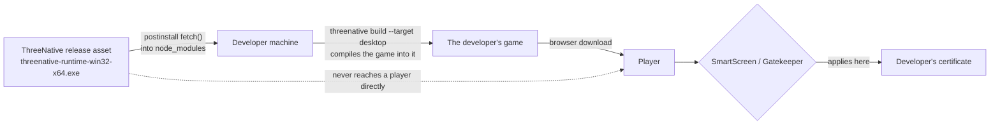

# Release signing and certificates

What ThreeNative signs, what it does not, and what a developer shipping a game needs.
Status as of 2026-09-11. Every "measured" row below was probed on that date, not inferred.

## The short version

**ThreeNative needs no code-signing certificate to publish its own release.** The engine's release
assets are prebuilt runtime binaries that a build script downloads into `node_modules`. They are
never double-clicked by a player, so neither SmartScreen nor Gatekeeper applies to them.

**A developer shipping a game needs their own certificate**, because the signature names the
publisher of the artifact a player downloads — and that artifact is their game, not our runtime. We
cannot sign it for them: a ThreeNative signature on someone else's game is misattribution, and CA
subscriber agreements only permit signing code you produce or control.

So signing is **per developer, per game**, not one certificate for the engine.

## Why the engine's own assets are exempt

Both OS gatekeepers key off *how the file arrived*, not merely what it is:

- **Windows SmartScreen** evaluates files carrying the Mark-of-the-Web (the `Zone.Identifier`
  alternate data stream), which browsers and mail clients attach. A `fetch()` in a Node postinstall
  script does not attach it.
- **macOS Gatekeeper** evaluates files carrying the `com.apple.quarantine` extended attribute, set
  by the downloading application. Again, a Node `fetch()` does not set it.

An unsigned engine binary pulled by `installPrebuilt` therefore executes without a prompt on either
OS. This is why the release can ship today with zero certificates.

> **Unverified.** The macOS half of this has not been executed on real hardware. On Apple Silicon
> every Mach-O must carry at least an ad-hoc signature to execute at all; the linker applies one by
> default, which *should* be sufficient for an unquarantined file. Until someone runs a downloaded
> `darwin-arm64` prebuilt on a real Mac, treat it as reasoning, not evidence. macOS is held out of
> the published cohort for exactly this reason — see the table below.

## What this repository signs today: nothing

`.github/workflows/native-release.yml` contains no `codesign`, `signtool`, `notarytool`, `attest` or
keystore step. Grepping the seven signing secret names across `.github/`, `scripts/` and `packages/`
returns two files, and neither performs a signing operation:

| File | What it does with them |
| --- | --- |
| `.github/workflows/release-candidate.yml` | Reads each as `secrets.X != ''` to derive an availability boolean |
| `packages/runtime-native/tests/native-platform-workflow.test.mjs` | Asserts that wiring exists |

Until PR #194, `scripts/release-candidate-gate.ts` required all eight credential booleans to be
`true` and returned `BLOCKED` exit 2 otherwise. Since only `NPM_TOKEN` is set, every candidate was
refused — **for the absence of credentials that no step in this repository consumes.** PR #194
replaces that flat list with a declared `releaseScope { platforms, signed }`, so an unsigned release
of a declared platform set can pass. Signing remains PRD-060's to build when it is actually wanted.

Measured 2026-09-11:

| Probe | Result |
| --- | --- |
| `gh secret list` | `NPM_TOKEN` only |
| `gh api .../actions/organization-secrets` | `{"total_count":0,"secrets":[]}` |
| `gh release list` | `quiche-owned-v1` only — no runtime release has ever been published |

## Platform status

| Platform | Published | Signed | Why |
| --- | --- | --- | --- |
| **Linux x64** | yes | no | Nothing to sign against. No OS gatekeeper. |
| **Windows x64** | yes | **no — shipping unsigned by decision** | SmartScreen *warns* on an unsigned download, it does not refuse. Acceptable for an engine runtime; revisit when there are Windows players. |
| **Android** | yes | no release keystore | A debug-signed APK installs by sideload. A release keystore is self-generated (`keytool`), costs nothing, and is only needed for Play Store upload. |
| **macOS arm64** | **no** | — | Held out of the published cohort. Gatekeeper's behaviour on our download path is reasoned but unverified, and unlike Windows a wrong answer means *refuses to run*, not *warns*. `UNPUBLISHED_PREBUILT_KEYS` in `packages/runtime-native/scripts/install-prebuilt.mjs`. The row still builds and verifies on every release run so it cannot rot. |
| **iOS** | separate lane | — | Untouched by this document. See `docs/PRDs/BLOCKED/requires-ios-ecossystem/`. |

## Pending certificates and what each would cost

None of these blocks a release today. They are listed so the decision is a decision and not a
discovery. Prices are approximate and were not re-verified at time of writing.

| Credential | Needed for | Cost | Notes |
| --- | --- | --- | --- |
| **Azure Trusted Signing** | Signed Windows binaries | ~$10/month | Cheapest legitimate path. Microsoft-operated, no hardware token, integrates with GitHub Actions. Identity verification required; individual accounts need roughly three years of verifiable history. |
| **OV code-signing certificate** | Signed Windows binaries | ~$200–400/year | Since the 2023 CA/Browser Forum change the private key must live on a FIPS 140-2 Level 2 HSM or hardware token, so a `.pfx` in a repository secret is no longer possible. Still warns until SmartScreen reputation accrues. |
| **EV code-signing certificate** | Signed Windows binaries | ~$300–600/year | Hardware token. Grants immediate SmartScreen reputation. |
| **Apple Developer Program** | Signed + notarized macOS and any iOS work | $99/year | Notarization is genuinely enforced by Gatekeeper for quarantined downloads — this is the one platform where "unsigned" has a real user-facing failure mode, not a warning. |
| **Android release keystore** | Play Store upload | free | `keytool -genkeypair`. Self-signed and self-managed; Play App Signing takes over from there. |
| **Sigstore / GitHub attestation** | Build provenance on release assets | free | GitHub OIDC via `actions/attest-build-provenance` with `id-token: write`. No purchased certificate. The `SIGSTORE_ID_TOKEN` secret the old gate demanded was never the mechanism. |

## What ThreeNative owes developers instead

Not a certificate — a **signing step in the build pipeline**, so a developer can sign their own
output:

- A documented post-build signing path per platform, or a `threenative build --target desktop`
  signing hook.
- Windows: `signtool sign /fd SHA256 /tr <timestamp-url> /td SHA256 <game>.exe`.
- macOS: `codesign --deep --options runtime --sign "<identity>"`, then `notarytool submit` and
  `stapler staple`.
- Android: the Gradle `signingConfigs` block, which `package-android.mjs` already generates around.

That work belongs to [PRD-365](PRDs/production-readiness/PRD-365-consumer-desktop-distribution.md)
(consumer desktop distribution), not to the release-publishing lane.

## Related

- [PRD-262](PRDs/production-readiness/PRD-262-the-runtime-native-prebuilt-release-exists.md) — the
  published runtime cohort, and the build tool helper that belongs in it.
- [PRD-060](PRDs/BLOCKED/requires-release-credentials/PRD-060-promoted-consumer-distribution.md) —
  candidate staging, npm promotion, and signing when it is wanted.
