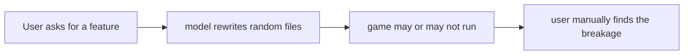
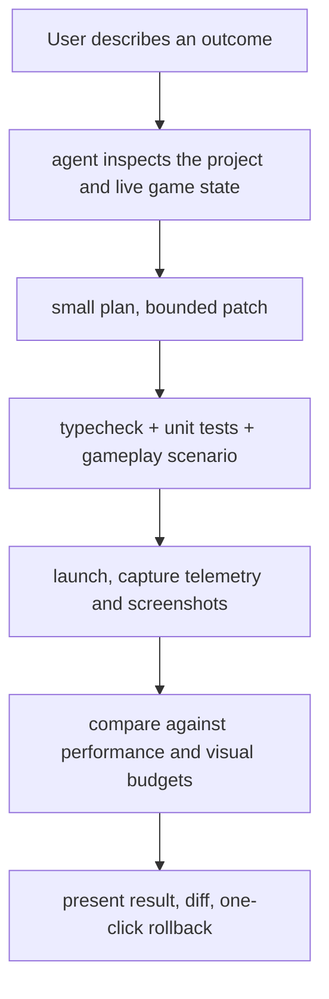

# Agent interface

**Status:** proposal, 2026-08-02; reconciled with the shipped surfaces 2026-08-21. The public CLI
stays limited to two familiar commands (`build`, `doctor`) plus the scaffolder, with no bespoke
vocabulary.

**What exists now that this file was written before.** The read-only half of the MCP layer this
document argues for has shipped: [`threenative-engine-mcp`](../../packages/engine-mcp/) serves
`engine_search_capabilities` and `engine_capability_detail` over the committed capability
manifest, and installing `@threenative/core` writes every project a `.mcp.json` wiring four
servers — `threenative-assets` (the externally pinned `threenative-asset-mcp`, launched through
a shim inside core), `threenative-sculpt`, `threenative-engine`, and `threenative-blender`
([`threenative-blender-mcp`](../../packages/blender-mcp/), which drives an installed Blender
headlessly so a downloaded `.fbx` becomes a GLB, and ships no Blender). What left is Studio: it
moved to a separate private repository (recorded in [`docs/README.md`](../README.md); PRDs
[084](../PRDs/done/PRD-084-threenative-studio.md),
[085](../PRDs/done/PRD-085-studio-wiring.md) and
[086](../PRDs/done/PRD-086-studio-self-improvement-loop.md) remain as history), and its
`scripts/studio-*` probes went with it. The owner's amendment stands either way: an agent edits
plain TypeScript — a GUI that writes a scene is still closed.

## The workflow this replaces



What it should be:



Steps 3 and 4 are the ones nobody else has, and both are half-built here already:
`pnpm typecheck`, `pnpm test`, and `@threenative/playtest` scenarios that drive a real
browser through a bridge.

## Model-agnostic by construction

The business must not depend on one provider. Expose ThreeNative through MCP, the CLI, a
stable tool protocol, editor extensions, bring-your-own key, and optional integrated
credits. Codex, Claude Code, Cursor and whatever comes next then drive the same
framework.

**The MCP layer is not the moat.** Unity and Roblox are both shipping agent access to
editor state; it is becoming an expected integration, like LSP. The value is the semantic
capability underneath it.

## Semantic tools, not just filesystem access

Every tool below must map onto surface that already exists, or onto surface a PRD is
committed to. Inventing agent-only vocabulary would repeat v1's worst mistake — 178
command forms and a 2,477-word root help, in a product whose founding constraint is that
models are bad at discovering novel APIs.

| Tool | Backed by | Exists? |
|---|---|---|
| `scene.inspect()` | `Registry.snapshot()`, `window.__THREENATIVE__` | **Yes** (PRD-006) |
| `tests.runScenario(name)` | `@threenative/playtest` runner + bridge | **Yes** |
| `profile.assertBudget(...)` | playtest observations + frame timing | **Yes**, as a scenario assertion: `performance: { maxDrawCalls, maxFrameMsP95, maxTriangles }` (`packages/playtest/src/assertions.ts`). It fails closed — a run with no performance bridge is a failure, not a pass. What is *not* built is a per-device budget profile, see [../product/PERFORMANCE-BUDGETS.md](../product/PERFORMANCE-BUDGETS.md) |
| `scene.addEntity(...)` | writes an entity class into `src/entities/` | No — and it should stay a **file edit**, not a runtime mutation |
| `assets.import(...)` | asset compiler | No — [../product/ASSET-PIPELINE.md](../product/ASSET-PIPELINE.md) |
| `release.build(...)` | `threenative build` today; a hosted release flow later | No — Cloud, ROADMAP Phase 4 |

The rule: an agent tool is a **stable, validated, auditable name for an operation the
user could do by hand**. When the operation is "write a TypeScript file," the tool writes
a TypeScript file. It does not introduce a scene format to mutate — the charter rejected
the IR, the compiler and the serialized scene format, and 25,898 LOC of compiler bought
nothing a model cannot do with a `.ts` file.

## Every change is a checkpoint

A generated change should carry:

- the requested outcome
- files changed
- scene and asset changes
- test results
- performance delta
- screenshots or captured frames
- a revert button

Far more trustworthy than a conversation transcript, and it produces evaluation data as a
side effect of normal use — without training anything.

## Automated playtesting is the differentiator

The runtime already supports deterministic input recording and replay. A scenario today
is plain data:

```ts
export const playScenario = {
  name: "move to the pickup and score",
  target: "web",
  schemaVersion: 1,
  steps: [
    { kind: "input", press: "ArrowRight", holdTicks: 120, release: true },
    { kind: "wait", waitTicks: 30, release: true },
  ],
  assert: {
    diagnostics: { noConsoleErrors: true, runtimeReady: true },
    hud: [{ id: "score", path: "#root", textIncludes: "1" }],
  },
} as const;
```

`holdTicks` rather than milliseconds is what makes it deterministic: the harness drives the
fixed-step clock instead of racing it. The deprecated `holdFrames` and `waitFrames` aliases are
still accepted for compatibility on fixed-step bridges.

Questions worth answering automatically, in rough order of value:

1. Can the player reach the exit, and is the level ever unwinnable or trap-able?
2. Did this edit reduce the frame rate, or blow a draw-call budget?
3. Does the game survive ten restarts, backgrounding, and resume?
4. Is a button outside the safe area on an iPhone?
5. Is it still playable on a low-end Android profile?

## The validator trap

The harness history records why this harness needed a fix before it was lifted: 19 validators
returned `undefined` on a wrong-typed value and 13 `.filter()` calls dropped them
silently. A misspelled `equals` type meant the assertion vanished and the scenario
**reported green while asserting nothing**.

That failure mode is the single most dangerous thing in an agent loop, because the agent
optimizes against the report. Any new assertion type must throw on malformed input, never
skip. A silently-inert check is worse than no check — it converts "unverified" into
"verified" without anyone deciding to.
