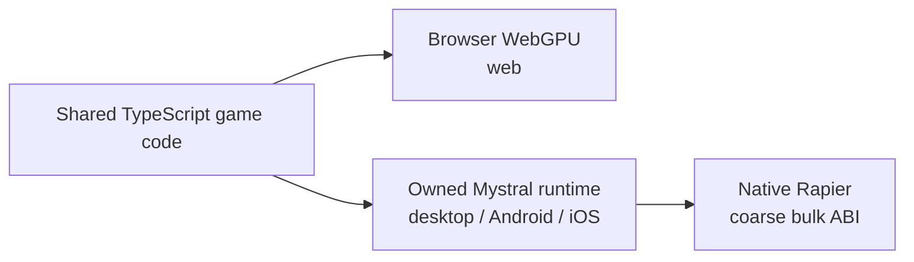
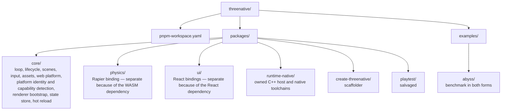
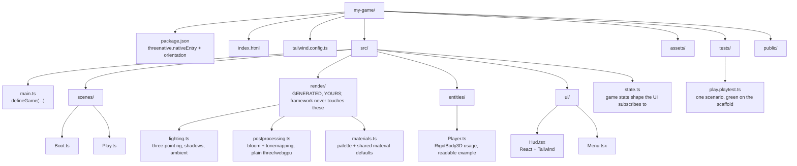

# ThreeNative — Charter

**Status:** binding, 2026-08-02. §7 is resolved; everything here holds until amended here.
**Amended 2026-08-17:** §3, §5, §5b and §11.1 — the 20-line rule is replaced by the two
questions in §11.1, and §5b splits mechanism from appearance. The kill switch (§11.2) and the
closed list (§2) are unchanged.
**Amended 2026-08-22:** §1 and §11 — performance is a shipped default bounded by §5b, §11.2 and
§10a, not a tuning pass left to each game.
**Supersedes:** `~/projects/threejs-to-bevy` (abandoned 2026-08-02, ~790k lines, 7 weeks).

---

## 1. What it is

**The application framework for Three.js games.** WebGPU by default, **web, desktop and
mobile from one codebase**, at a frame rate that does not apologise for the abstraction,
Godot-shaped conventions, React/Tailwind for UI, and vanilla Three.js on every surface
underneath.

### The thesis, in one paragraph

**Three.js is the most widely known 3D API in every model's weights. It is also a web
rendering library, and it stops where the web stops.** Every model can already write it;
none of them can make it leave the browser, hit native frame rates, or ship to a phone.
ThreeNative keeps the API the models know and removes the ceiling underneath it.

That is the whole bet, and it decides every argument in this document:

| Three.js gives us | Three.js costs us | What we build |
|---|---|---|
| An API in the training data of every frontier model | — | Keep it. Deviating spends the only asset we did not have to earn. |
| A renderer that works | Browser and webview only | An owned native host (§7): same code, three platforms |
| WebGPU, TSL, a real material system | Webview performance ceilings, no native path | Native runtime and native physics (§7, §10a) |
| — | No game layer: no loop, no input map, no physics bridge, no build | The plumbing (§3, §6) |

**Every deviation from Three.js's API is a withdrawal from an account we did not fund.**
That is why §5 borrows vocabulary instead of inventing it, why §5b refuses to own the look,
and why §3's kill switch exists. The framework is worth having only where Three.js is
genuinely absent — the game layer and the platform layer — and nowhere else.

**We ship the plumbing. The user's AI agent ships the gameplay.**

ThreeNative is to Three.js what Next.js is to React and NestJS is to Express. You don't
hand-roll SSR, routing and SEO on bare React — you write pages. You shouldn't hand-roll a
render loop, a physics bridge, an input map and a mobile build on bare Three.js either.

**It owns the wiring, never the work — and never the look (§5b).**

Three promises, all testable:

1. **Zero plumbing.** The 42% of every game that is identical boilerplate (§3) is
   already written, on web, desktop and device.
2. **Good-looking by default.** A freshly scaffolded game looks good before anyone
   touches it — delivered as editable generated source, never as framework config
   (§5b, §9b).
3. **The abstraction is not the bottleneck.** Whatever the platform can render, the
   framework gets out of the way of. Measured, not asserted — §10a.

One line: *R3F gives you a scene. ThreeNative gives you a game — on web, desktop and device.*

### Engine ships conventions by default

If a behaviour is the ordinary, expected answer for its situation — a character's feet meet
the floor, a weapon stays in the hand that holds it, an agent walks around a wall, one metre is
one metre — **the engine ships it working, on, and discoverable, before any game asks.**
The game's agent should reach that behaviour by doing nothing.

**Every convention carries a range, not a mandate.** A convention that cannot be turned off is a
cage, and a game that has to fork the engine to differ has been failed twice. Each one ships with:

1. **A default that is correct for the ordinary case** — on, with no option passed.
2. **A named override on the same object** — a documented field or option, never a fork, a
   patch, or a reimplementation. `grounded = false` is the convention working; a game rewriting
   grounding is the convention failing.
3. **Honest reporting when overridden** — turning a convention off must not turn its measurement
   off. A body that is deliberately airborne still reports its real clearance.

**Performance is one of those defaults, not a tuning pass the game is expected to discover.**
The §10a frame budget is the framework's to hold on the ordinary path: whatever the framework
owns arrives pooled, batched, culled and free of per-frame allocation, and the obvious way to
write a game here is the fast way. A game should have to work to make it slow, and a hitch that
appears in a template as scaffolded is an engine defect, not the game's tuning debt. The same
bounds apply as to every other convention — §5b (a performance default never decides how
anything looks), §11.2's kill switch (an optimisation costing more code than vanilla Three.js is
deleted like anything else), and §10a's measurement (a speed-up no `performance` assertion can
show is a claim, not a gain).

**A convention that is not in the templates' `AGENTS.md` does not exist.** The agent's field of
view is that file. Shipping a capability the doc omits is shipping nothing, and is a release
defect, not a docs chore.

**Framework, not engine.** A library you call (`three` — you own the loop); a framework
calls you (it owns loop and lifecycle, you fill in scenes and entities); an engine adds an
authoring environment — editor, asset pipeline, scene format — which §2 rules out. Godot's
*vocabulary* is borrowed (§11.4), never its architecture. The test: **your game lives in
`.ts` files you edit, not in a project a tool opens.**

---

## 2. What it is not

Every item here is something the previous attempt built, and something that helped kill it.
Read them against §1's thesis: each one spends the training-data advantage to buy a surface
the model then has to discover.

| Not building | Why |
|---|---|
| An IR, a compiler, a serialized scene format | Your game is TypeScript. The compiler was 25,898 LOC and bought nothing a model can't do with a `.ts` file. |
| A second *renderer* | 32% of v1's 1,707 commits went to a runtime no benchmark ever measured. §7's host is the deliberate exception and is bounded as one: it runs Three.js, it does not replace it. No custom renderer, no Three.js fork, no native `GLTFLoader`. The moment the host starts drawing, it has become v1. |
| A JSON/structured-source ECS | Cost **14x vanilla Three.js** on greenfield work (8.27x cost-weighted) *and* scored lower on playability and visuals. |
| An editor | Not in v1. The Studio dogfood found Share and Export did literally nothing. |
| A bespoke CLI vocabulary | 178 command forms, a 2,477-word root help. Models are worst at discovering novel API surfaces; that was the business model, inverted. |
| A recipe/preset/genre system | 0 of 7 presets ever reproduced their genre. H1–H4 of the recipe benchmark: all fail. |
| A code-first ECS (miniplex, bitECS) | Entities are plain classes (§9b). An ECS is gameplay architecture, and gameplay is the model's job. It also inverts §3's floor: it pays off *only* if the model adopts it. The part worth keeping — introspection — is PRD-006, at 1% of the cost. A game that wants one runs `pnpm add miniplex`; the framework neither ships nor fights it. |

> An LLM's greatest strength is writing code in languages already in its weights.
> Its greatest weakness is discovering bespoke API surfaces.
> — `threejs-to-bevy/docs/audits/ASSESSMENT-2026-07-24.md`

**This is the founding constraint.** Everything below is downstream of it.

---

## 3. Win condition

Not "cheaper than vanilla." That fight cannot be won — Opus is trained on vanilla
Three.js and gets better at it every release. v1 picked that fight and lost 14x.

**Four criteria instead:**

1. **Zero tax on the way in.** Writing a game in ThreeNative costs *the same* as
   vanilla. Parity is the target; any discount is a bonus.
2. **Same or better output.** The model's budget goes to gameplay and feel instead of
   bootstrapping, and — critically — the framework never constrains what it can
   express (§5b).
3. **Zero tax at runtime.** The framework costs no measurable frame time against the
   same scene written by hand. Parity again, measured against §10a's reference workload.
   *An abstraction that is free to write and expensive to run has moved the tax, not
   removed it.*
4. **What vanilla structurally cannot do.** One codebase reaches web, desktop and
   mobile. Still works after the 20th change. Has proof it isn't broken.

### The property that makes this unloseable

**The framework must win even when the AI ignores it.**

If a model writes raw `THREE.Mesh` calls and never touches `RigidBody3D`, it still got
the loop, the platform adapters, the asset pipeline, and playtest for free. The
framework's floor is vanilla. Design for that and the benchmark stops being a threat.

### The benchmark

**Control:** `examples/abyss/` — a real game built 2026-08-02 in vanilla
`three/webgpu`: 90k GPU particles via TSL compute, bloom, arcade loop, HUD.
**~400 lines. It works.**

| Portion | Lines | Kind |
|---|---:|---|
| Renderer init, WebGPU guard, failure UI | ~30 | plumbing |
| Resize / camera layout | ~15 | plumbing |
| Post-processing stack | ~5 | plumbing |
| Input (pointer, keys, capture, blur) | ~30 | plumbing |
| Game state, transitions, HUD sync | ~70 | plumbing |
| Loop scaffolding, dt clamp, fps | ~20 | plumbing |
| **TSL shader, entity behaviour, tuning** | **~230** | **the game** |

**~170 lines (42%) is plumbing identical in every game.** That is the entire
addressable surface. It will not be a 10x reduction; anyone promising that is selling
an engine.

### The kill switch

> **Any abstraction that costs more code than writing it in vanilla Three.js gets
> deleted, no matter how much work it took.**

`examples/abyss/` ships in both forms. CI publishes both line counts in the README.
**If the vanilla column wins a row, that row leaves the framework.** Binding and
non-negotiable — it is the one control v1 had that worked, and the one it stopped
obeying.

**Count every repetition, not one site.** A mechanism a single game writes more than twice
is plumbing, and the comparison is the framework's lines against the game's *total* across
every copy of it. The sandbox FPS build writes the same pooled-billboard-and-decay loop three
times — muzzle smoke, enemy smoke, impact puffs — for about 120 lines. Scored per site that
reads as break-even and the helper is rejected; scored honestly the vanilla column loses.
**Per-site scoring is how the kill switch turns into a rule against having a framework at
all**, which is the opposite of what it is for.

The switch stays prospectively permissive and retroactively ruthless. It is a delete
mechanism, not a gate on adding: that asymmetry is exactly what makes §11.1's two questions
safe to answer generously.

---

## 4. Substrate: vanilla Three.js core

**Decision: vanilla core. Zero React dependency in `@threenative/core`.**

1. **React's render model fights game loops.** Reconciliation is for state changes;
   games mutate 60×/sec. R3F's answer is `useFrame` + refs — imperative Three.js
   wearing JSX. The idiom you must teach is *"escape React here."*
2. **One-way door.** A vanilla core can be consumed from R3F. The reverse is impossible.
3. **Mobile is the differentiator and React adds risk there**, not leverage.

R3F genuinely wins on ecosystem — `@react-three/rapier` is already `RigidBody3D`,
`drei` is hundreds of solved problems, Fast Refresh is excellent. **R3F is deferred to
v2**, as a ~200-line `@threenative/react` binding over the same core. We lose nothing
and stay out of the one-way door.

Note this is unrelated to §6b: React renders the **UI**, never the scene graph.

---

## 5. Conventions, borrowed not invented

Godot node names. Every model already knows `RigidBody3D`, `Area3D`,
`CharacterBody3D`, `CollisionShape3D`. **Zero discovery cost** — the founding
constraint, satisfied by not inventing vocabulary.

```ts
import { RigidBody3D, Area3D, CollisionShape3D } from '@threenative/physics';

const crate = new RigidBody3D({
  mesh: crateMesh,                          // a real THREE.Mesh
  shape: CollisionShape3D.fromMesh(crateMesh),
  mass: 8,
});

const trigger = new Area3D({ shape: CollisionShape3D.box(2, 2, 2) });
trigger.on('bodyEntered', (other) => score(other));
```

`RigidBody3D` owns a Rapier body handle and syncs its transform onto the
`THREE.Object3D` you handed it. **~80 lines.** Not a simulation, not an entity, not a
component.

> **The two questions (§11.1):** could the game write this portably itself, and does it
> decide how anything looks? The framework owns what the game cannot write portably; the
> game owns everything that has an appearance. Size decides nothing either way.

`RigidBody3D` qualifies not because it is short but because a game cannot reach a Rapier
handle portably — the web arm is WASM and the native arm is a typed-array ABI, and §7
forbids the game from knowing which it got.

### The escape hatch is not an escape hatch

There is no wrapper type to unwrap. These *are* the objects:

```ts
ctx.renderer        // THREE.WebGPURenderer
ctx.scene           // THREE.Scene
ctx.camera.raw      // THREE.PerspectiveCamera
ctx.physics.world   // Rapier World
crate.body          // Rapier RigidBody
crate.mesh          // THREE.Mesh
```

Every Three.js tutorial, StackOverflow answer, and model completion from the last
decade applies unchanged inside a ThreeNative scene.

---

## 5b. The ownership boundary — the framework never owns the look

**The correction that matters most, and the one v1 got backwards.**

Legacy ThreeNative's output looked bad while vanilla + Opus looked good. The framework
did not *fail to add* visual quality — it **subtracted** it. The model could only
express what the schema allowed, so its visual repertoire was truncated to the
framework's vocabulary.

> **An abstraction that cannot express what vanilla expresses makes the output
> actively worse — not just costlier.**

| Framework may own | Framework must never own |
|---|---|
| Bootstrap, render loop, fixed timestep, independent CanvasLayer surface | Materials, shaders, TSL |
| Scene lifecycle, plugin wiring | Lighting, tonemapping, exposure |
| Input mapping, asset loading | Post-processing composition |
| Physics binding, platform adapters | Camera framing, composition |
| Test harness, UI state bridge | **Anything that decides how a screenshot looks** |

The visual layer is exactly where the model is strongest. Stay out of it entirely.

### Mechanism is not appearance

That right-hand column used to read *anything a screenshot shows*, and taken literally it
banned code this framework already ships and should ship. `GPUParticles3D`
(`packages/core/src/particles.ts`) owns storage buffers, compute dispatch and lifetime, and
takes `material`, `start` and `process` from the game. A screenshot shows its output. It owns
none of the look.

> **The framework may own the mechanism that puts something on screen** — pooling, lifetime,
> billboarding, instancing, dispatch, culling — **provided every parameter that decides how it
> looks comes from the game**: geometry, material, colour, texture, curve, timing constants.

**The test, and it is a hard veto:** can the game change the appearance completely without
editing framework code? If any answer is no, the whole thing ships as generated source in
`src/render/`. There is no partial credit and no "sensible default" that a game reaches through
a config option — `postprocessing: ['bloom']` is still the v1 mistake, and it is still removed.

This is a narrowing of what the framework may own by *kind*, not a widening by *degree*. The
failure it guards against is unchanged: v1's output looked bad because the model could only
express what the schema allowed. A mechanism with every appearance parameter supplied by the
game truncates nothing, because there is no vocabulary to be truncated to.

### Tracer streaks and sprite pixel data are mechanism

A shipped FPS game wrote both inside its own render folder, which is how the engine learns what
core is missing. `TracerPool3D` owns pooling, travel, fading and orientation for hitscan streaks;
the surface must come from the game and is cloned per slot so each streak fades independently, any
geometry beyond a neutral unit cylinder is the game's, and no colour, blending or fade feel is
decided in the package. `softCircleDataTexture` writes radial-alpha sprite pixels straight into a
`DataTexture` because canvas-painted images sample black under `WebGPURenderer` — the framework
owns the trap and the way around it, never where the sprite appears or what it shows. Both clear
the same veto as every mechanism above.

### "Looks good by default" and "never owns the look" are the same rule

These sound contradictory. They aren't — and reconciling them is the core design move.

Vanilla Three.js out of the box is untonemapped, flat-lit grey programmer art. A
scaffolded ThreeNative game must look good on the first `pnpm dev`, with no work. But
the moment that good look is *enforced by the framework*, it becomes the ceiling that
made v1's output worse than vanilla.

The resolution is entirely about **where the defaults live**:

- **Generated into `src/render/` = a floor.** The scaffold writes a real
  `lighting.ts` with a three-point rig in ordinary Three.js. The model reads it, edits
  it, deletes it. A starting point, not a constraint.
- **Hidden inside a package = a ceiling.** Now the model reaches it only through
  config options, and everything unanticipated is unreachable.

Same lighting rig, opposite outcomes. `postprocessing: ['bloom']` as a `defineGame`
option is the ceiling version — **that was a v1 mistake reappearing, and it is removed
from §6.**

So: the framework's visual contribution is a **good starting commit**, not a runtime.
`src/render/` is the entire product of "looks good by default", and deleting the
framework would leave that code working.

---

## 6. The API you have to know

**The entry point fits on one page on purpose, and that is the part that is bounded.**
`defineGame`, a scene with three optional methods, `ctx`, four CLI commands — a model that
reads only this page can write a working game, and if *that* stops fitting, something has
gone wrong.

The total exported surface is not bounded by page count. It is bounded by §11.1's two
questions and deleted by §11.2's kill switch, which are tests of kind. A page count is a size
proxy, and a size proxy rejects portable plumbing for being long while admitting a preset
system for being short. **What must never grow is the amount a model has to discover before
it can start** — that is v1's 178 command forms and 2,477-word root help, and it is a
property of the entry point, not of the export list.

```ts
// src/main.ts
import { defineGame } from '@threenative/core';
import { rapier } from '@threenative/physics';
import { Boot, Play } from './scenes';

export default defineGame({
  render: { webgpu: true },        // WebGL2 fallback automatic. Nothing visual here.
  plugins: [
    rapier({ gravity: [0, -9.81, 0], fixedStep: 1 / 60 }),
  ],
  scenes: { boot: Boot, play: Play },
  start: 'boot',
});
```

A scene is a class with three optional methods. That is the entire lifecycle.

```ts
// src/scenes/Play.ts
import { Scene, type Ctx } from '@threenative/core';
import { setupLighting } from '../render/lighting';       // generated, yours
import { setupPost } from '../render/postprocessing';     // generated, yours
import { follow } from '../camera/follow';                // generated, yours

export class Play extends Scene {
  async load(ctx: Ctx) { this.hero = await ctx.assets.model('hero.glb'); }

  enter(ctx: Ctx) {
    setupLighting(ctx.scene);
    setupPost(ctx.renderer.raw, ctx.scene, ctx.camera);
    ctx.add(this.hero);
  }

  update(ctx: Ctx, dt: number) {
    const move = ctx.input.vector('move');      // identical on key, pad, and touch
    if (ctx.input.justPressed('jump') && this.hero.body.grounded) this.hero.body.velocity.y = 8;
    this.hero.body.velocity.x = move.x * 5;
    this.hero.body.moveAndSlide(dt);
    follow(ctx.camera, this.hero.mesh, dt, { distance: 12, damping: 0.1 });
    ctx.state.set({ hull: this.hull });         // UI reads this; see §6b
  }
}
```

Four CLI commands, ever: `dev`, `build`, `test`, `ship`.

---

## 6b. UI — React + Tailwind, never the scene graph

React renders the HUD, menus, and overlays. It does not touch `THREE.Scene`. This is
the same split Bone Tide shipped: a shared TypeScript engine, with only the UI in React.

| Web | Desktop / Mobile |
|---|---|
| React 19 + react-dom | OPEN |
| Tailwind 4 | OPEN |

**The native UI stack is an open question, not a decision.** The runtime (§7) is a host
with no DOM and no React Native layer, so neither `react-dom` nor NativeWind applies, and
no HUD has yet been rendered on it by any means. The store rule below is host-independent
and holds on every target.

**The 60fps problem.** React must never re-render on the game loop. The bridge is a
plain external store the game writes to and React subscribes to:

```tsx
// src/ui/Hud.tsx
import { useGameState } from '@threenative/ui';

export function Hud() {
  const { hull, score } = useGameState();     // throttled; ~10Hz, not 60Hz
  return (
    <div className="pointer-events-none absolute inset-0 p-6 font-mono">
      <div className="text-cyan-300 text-4xl tabular-nums">{score}</div>
      <div className="mt-2 h-1 w-24 bg-slate-800">
        <div className="h-full bg-cyan-400" style={{ width: `${hull}%` }} />
      </div>
    </div>
  );
}
```

`ctx.state.set()` writes at whatever rate the game wants; the store coalesces and
notifies React on a throttle. **Zustand** backs it — small, well known, and
`useSyncExternalStore` semantics are already correct for this.

Tailwind is the right call here for the same reason Godot names are: it is
overwhelmingly present in model weights, so HUD work costs nothing in discovery. And
NativeWind means the same class strings work on device.

---

## 7. Cross-platform — the owned native runtime

**Write once, run everywhere.**



**One codebase reaches three platforms.** That is the product, not a bet — the question of
whether Three.js can run outside a browser is answered, on desktop and on the Android
emulator. What remains open is coverage, not viability, and the honest rows are listed at
the end of this section.

Mystral is absorbed as the owned `packages/runtime-native/` fork. Its C++/platform source
lives in one workspace package, while Dawn, V8, QuickJS, SDL3, wgpu-native and other
dependency trees stay downloaded into an untracked `third_party/`.

The framework supplies host-neutral TypeScript seams and an import-free bundle. The runtime
is a host, not a renderer: it must not own Three's renderer, fork Three.js, or replace the
JavaScript `GLTFLoader`. Exact Three.js compatibility must equal the workspace catalog.

Rapier cannot depend on WebAssembly on native. **The stated reason is now out of date and the rule
is unchanged.** It was that Android defaulted to QuickJS, which has no WebAssembly; PRD-130 made V8
the Android default on 2026-08-16 and V8 does implement WebAssembly. Nobody has measured
Rapier-as-WebAssembly on that path, iOS remains JSC, and the coarse ABI answers per-object call cost
independently of the engine — so the rule stands, but it now rests on an unmeasured claim rather than
an impossibility. **Whether to keep it is an owner decision this note does not take.**
Native physics is compiled into the runtime and exposed through a coarse, host-neutral
typed-array ABI. The TypeScript API stays in `@threenative/physics`, with bulk
`step`/`readVisibleTransforms` crossings rather than per-object frame calls.

### The user never has to know native exists

The test of "write once, run everywhere" is not that the same source *compiles* everywhere.
It is that a developer writes their game against the framework abstractions and plain
Three.js, never thinks about the target, and it behaves the same on all of them.

That forbids a second implementation of any public class. `CharacterBody3D` is one file. So
are `Area3D`, `RigidBody3D` and `CollisionShape3D`. An export condition may swap the
`PhysicsSimulation` backend beneath them; it may never swap a node, a scene, an entity or
anything else a game writes against. Two copies of a class are a fork, and a fork of gameplay
logic diverges silently — a feature added to one is simply missing from the other, and no gate
reports it.

Where a backend cannot honour part of the shared API, it **throws at construction**. Accepting
an option and discarding it is §11's fail-closed rule relocated from the harness into the
runtime, and it is worse there, because it surfaces as a gameplay bug on one platform only.

Both backends are proven by a single conformance suite: the same scenario, run against every
`PhysicsSimulation` implementation, asserting the same transforms. Absent that suite, "runs
everywhere" is a claim and not a gate. The 2026-08-08 course correction that recorded the
`@threenative/physics` node fork is closed: the fork was removed, each public class is one
file again, and only the `PhysicsSimulation` backend swaps on the export condition. The
standing gate is [`../PRDs/BLOCKED/requires-parity-rerun/PRD-054-write-once-run-anywhere.md`](../PRDs/BLOCKED/requires-parity-rerun/PRD-054-write-once-run-anywhere.md),
which owns the parity matrix and is open.

Release readiness requires, in order:

1. the unchanged core bundle renders 300+ frames on Android at the catalog Three version;
2. the device harness demonstrates all fail-closed negative controls;
3. native physics passes those device scenarios;
4. iOS simulator evidence exists;
5. the §10a parity rule holds — the native arm is not slower than the browser arm; and
6. physical-driver, arm64 physics and phone-performance debt is measured on real hardware.

Rows 1 and 2 are green. The binding execution record is PRD-047. A result may say
desktop-ready or Android-emulator plumbing-ready; **it must not say mobile-ready while
physics, iOS, performance or hardware rows are open.**

---

## 8. Salvage from `threejs-to-bevy`

| Package | LOC | State |
|---|---:|---|
| `playtest{,-core,-three}` | 4,582 | Already standalone. `examples/playtest-three-vanilla/` proves it runs on **plain Three.js with zero ThreeNative deps** |
| `asset-mcp` | 15,345 | Already published, MIT, own release lane. The version that resolves from the registry and that every template pins is **0.4.0**, exposing 32 tools recorded in `packages/create-threenative/asset-mcp-tools.json`. PRD-032's live-agent gate failed against it |
| `shader-portable` | 1,991 | TSL → WGSL/GLSL exporter, naga-validated |

**Blocking fix before lifting playtest.** The misspelled-key hole is closed
(`rejectUnknownKeys`, `scenario.ts:1102`, 17 call sites). But **19 validators
`return undefined` on a wrong-typed value and 13 `.filter()` calls drop them
silently**:

```json
"assert": { "states": [{ "entity": "player", "equals": true }] }
```

`equals` should be a string → the assertion is dropped → the scenario runs with zero
state assertions and reports green. Fix: make those validators `throw
invalidScenario(...)` and delete the filters. ~1 hour, before the lift.

---

## 9. Repository layout

### 9a. Packages — pnpm workspace, deliberately few

pnpm workspace is the right tool; **11 packages was not.** v1 had 27, and package
proliferation was a symptom of the disease. A 15k-LOC framework split 11 ways is
~1.4k LOC per package — all boilerplate, no boundary.

**Six framework packages today.** Package count is governed by §11.5's dependency-boundary
rule, not by a number to negotiate. Modularity comes from subpath exports, not from more
`package.json` files.



A package exists only when it carries a dependency the others must not inherit. That
rule produces exactly this list. `render/` is gone — §5b deleted its reason to exist.

```yaml
# pnpm-workspace.yaml
packages: ['packages/*', 'examples/*']

catalog:
  three: 0.185.1
  '@dimforge/rapier3d-compat': 0.19.3
  react: 19.2.0
  typescript: 5.9.3
  vite: 8.2.0
```

**pnpm catalogs are load-bearing, not style.** TSL's API changes between three releases
with no meaningful deprecation cycle. A catalog pins one `three` across every package
and example, so a bump is one line and one CI run. Packages declare `three: 'catalog:'`.
pnpm's strict peer resolution is also correct for a published framework — phantom
dependencies are a support burden.

### 9b. What `pnpm create threenative my-game` generates



**`src/render/` is the design's load-bearing folder.** It is ordinary Three.js written
into the user's repo, not framework config. The scaffold gives a good zero; the model
is free to rewrite all of it. That is §5b made concrete.

`entities/Player.ts` and `tests/play.playtest.ts` exist for the same reason: **the
scaffold is the documentation.** Models learn an API from the code in front of them,
not from a help page. v1 required discovery across 178 command forms — the worst
possible shape.

### 9c. Tech stack

Chosen by one rule: **pick what models already know.** Same constraint as Godot names
and Tailwind.

| Layer | Choice | Note |
|---|---|---|
| Package manager | **pnpm 10** + workspace + catalog | Given; catalogs pin `three` |
| Language | **TypeScript 5.9**, strict, ESM only, Node 20+ | |
| Rendering | **three 0.185.1** `three/webgpu` + TSL | Catalog-pinned; TSL churns |
| Physics | **@dimforge/rapier3d-compat** | `-compat` avoids bundler WASM config |
| UI | **React 19 + Tailwind 4** / NativeWind on device | §6b |
| UI state bridge | **zustand 5** | `useSyncExternalStore` semantics |
| Game build | **Vite 8** | Already proven on `examples/abyss` |
| Package build | **tsup** | esbuild, boring, widely known |
| Unit tests | **Vitest** | Vite-native |
| Playtest | **Playwright** | What the salvaged harness already uses |
| Lint + format | **Biome** | One tool, one config, replaces two + plugins |
| Releases | **Changesets** | Standard for pnpm monorepos |
| Native host | **owned Mystral fork** | Desktop/mobile only; **gated on §7** |
| CI | GitHub Actions | Must be green (§11.5) |

Biome over ESLint+Prettier is the one low-confidence call here — cheap to reverse.

---

## 10. Budgets

Two kinds, and the difference matters. **§10a is what we are trying to achieve. §10b is
what we refuse to spend achieving it.** A charter with only cost caps is a brake with no
steering wheel.

### 10a. Performance — the target, because "close to native" needs a number

**Reference workload:** the `platformer` template, unmodified, as scaffolded. It is the
heaviest starter, it already carries 14 playtest scenarios, and it is what a user actually
receives. A performance claim measured on a spinning cube is not a performance claim.

| Lane | Reference hardware | Budget |
|---|---|---|
| Web | Desktop Chrome, discrete GPU | **60 fps at 1080p**, 99th-percentile frame ≤ 33 ms |
| Desktop native | Same machine, same scene | **≥ the web arm** — see the parity rule below |
| Mobile | Mid-range Android phone (Snapdragon 7-series class) | **60 fps at 1080p**; hard floor 30 fps sustained |

**The parity rule is the real definition of "close to native," and it is the one gate
that is runnable today with no phone.**

> On the same machine and the same scene, the native arm must not be slower than the
> browser arm. If the owned runtime renders our own template worse than Chrome does,
> the runtime is a liability and §3's kill switch applies to it exactly as it applies
> to a helper function.

That comparison needs no hardware, no emulator and no iOS. It runs on the Linux host that
already produced the desktop evidence, and it is the strongest performance claim this
project can honestly make right now.

**Mobile numbers stay OPEN until physical hardware exists.** An emulator does not measure
frame rate — it fakes the GPU driver. A mobile fps figure sourced from an emulator is the
reporting failure `AGENTS.md` opens by naming.

**Both of those conditions moved, 2026-08-16, and neither budget above is met yet.** The
`performance` assertion kind landed and is fail-closed — `maxFrameMsP95`, `maxDrawCalls`,
`maxTriangles`, requiring the `runtime.performance` capability — so a timing number is now
verifiable rather than an intention. And a physical Pixel 8 has executed load tests against
Godot 4.7.1 on web, desktop and the phone
(`docs/verification/engine-load-test-summary-2026-08-15.md`). **That is benchmark evidence, not
the mobile budget**: the workload was a cube ladder rather than the `platformer` template, the
Android build was unsigned, and one run sat at 21% battery. The reference-workload rows in the
table above remain unmeasured, and the mobile row still needs the phone, the template, and a
charge condition somebody checked.

### 10b. Cost caps — what we refuse to spend

v1 had none and added ~250k lines in its final nine days while CI went 0-for-100. These
exist so that never recurs. **They are not the goal; they bound the price of the goal.**

| Budget | Limit | Kind | v1 |
|---|---:|---|---:|
| Framework source (excl. examples, salvage, native) | **15,000 LOC** | review trigger | 441,811 TS + 129,247 Rust |
| Native runtime source (excl. downloaded `third_party/`) | **100,000 LOC** | review trigger | — |
| Workspace packages | governed by §11.5, not by a number | rule | 27 |
| Untracked `third_party/` | **hard fail** if any file is tracked | hard | — |
| Default gate green with no C++ toolchain | **hard fail** otherwise | hard | — |

**Hard means CI fails. Review trigger means CI reports and a human justifies it in the
PRD** — crossing one is a conversation, not an outage. Both hard rows are invariants of
the native absorption (§7) and are not negotiable; they are what keeps a C++ runtime from
leaking into a TypeScript framework.

Exceeding a review trigger is not a signal to raise it. It is a signal to run the kill
switch (§3) over what was added and find out whether it earned its lines.

**A cap that gets routed around is worse than no cap** — it looks like discipline while
teaching that gates are negotiable, which is the same failure shape as a green check that
asserts nothing. Every limit above is either enforced by `pnpm budgets` or is not written
down. Nothing here counts documentation, command names, or pages of API: those are bounded
by §11.1 and §11.4, with evidence, or they are not bounded at all.

---

## 11. Rules

1. **The two questions.** Both must pass, and they replace the 20-line rule — see below.
2. **The kill switch.** Any abstraction costing more code than vanilla is deleted, counted
   across every repetition in one game (§3).
3. **Never own the look.** §5b. The framework may own mechanism; every appearance parameter
   comes from the game. Visual defaults ship as generated source, never as package config.
4. **Vocabulary is borrowed, never invented.** Godot for nodes, Three.js for rendering,
   Rapier for physics, Tailwind for UI. Where none of them has a name, borrowing is
   exhausted before inventing, and the invention is recorded as the discovery cost it is.
5. **A package exists only when it carries a dependency the others must not inherit.**
6. **CI green means something or it means nothing.** No merge while red. (v1: 0 passing in 100.)
7. **Write once, run everywhere.** §7. One implementation per public class. A backend swaps
   beneath the API, never a node the user writes against; what a backend cannot honour throws.
8. **Performance is a default, not a tuning pass.** §1. The framework holds §10a's budget on
   the path a game gets by doing nothing — pooled, batched, culled, allocation-free — and proves
   it with a `performance` assertion rather than an intention.

### 11.1 — the two questions, and what they do not open

The 20-line rule is retired as of 2026-08-17. It was a size ceiling standing in for a kind
test, and it failed in both directions: it rejected 15 lines of pointer-lock plumbing the game
**cannot write portably at any length**, while a preset system that would end the project fits
in the same 15 lines. Size was never the variable.

> **1. Could the game write this portably itself?** If no — it needs a browser global, a
> platform seam, or a backend the game must not know it got — the framework owns it, at any
> size.
>
> **2. Does it decide how anything looks?** If yes, it ships as generated source in
> `src/render/`, at any size.
>
> Something that passes both becomes framework code once one game writes it more than twice.

**These are ANDed, and question 2 is a veto.** Passing question 1 does not license owning an
appearance; the mechanism ships and the look stays in `src/render/`.

**Four things this does not loosen, and the fourth is new:**

1. **§2's closed list outranks both questions.** An IR, a scene format, an editor, a
   preset/genre/recipe system, a code-first ECS and a bespoke CLI vocabulary stay closed
   however cleanly they pass. That list is what killed v1; the 20-line rule was only ever a
   blunt proxy for it, and retiring the proxy does not retire the list.
2. **§11.2 applies retroactively to everything admitted here.** Generous on the way in is only
   safe because the way out is automatic and unsentimental.
3. **§10b's 15,000-line review trigger still bites.** Crossing it obliges a justification in
   the owning PRD and a kill-switch pass. A rule that admits more code does not raise the
   number it is measured against.
4. **Question 1 is settled by execution, not by intent.** Anything admitted for being
   unportable lands with proof it runs on the native arm — a conformance case or a playtest
   with `--target` — in the same commit. Admitting a helper *because* the game cannot write it
   portably, and then shipping it web-only, produces exactly the silent one-platform fork §7
   forbids, and does it with the charter's blessing. **That is the regression this amendment is
   most likely to cause, so it is the one gate that is not optional.**

The honest summary: this makes the framework's *boundary* clearer and its *ceiling* higher,
and leaves every mechanism that stops it becoming v1 exactly where it was.

---

## 12. Success and failure criteria

v1 spent seven weeks unable to answer whether it was working, because the decisive
experiment (`sustained-iteration-benchmark-2026-07-31.md`) was specified three times
and **never run**.

**ThreeNative succeeds if, and only if** — one criterion per pillar of §1's thesis:

1. **It still reads as Three.js.** The ThreeNative port of Abyss is no longer than 400
   lines, reads as ordinary Three.js, and **does not look worse than the vanilla
   control** (§5b). *Protects the training-data advantage.*
2. **It leaves the browser.** One unmodified game codebase builds and runs on web,
   desktop and a physical phone, each proven by a playtest run rather than a screenshot.
   *Removes the ceiling.*
3. **It is not slower for having done so.** §10a's parity rule holds on the reference
   workload: the native arm is not slower than the browser arm, and the mobile lane
   meets its frame budget on real hardware. *Removes the other ceiling.*
4. **Someone plays it.** One game is played by **a stranger for five minutes**, with a
   transcript. v1 never once did this — it was the open acceptance item at abandonment.

Criterion 4 is the only one that cannot be gamed by the team that wrote it, which is why
it is not negotiable and not first.

**ThreeNative fails, and is abandoned, if:**

- The Abyss port is longer than vanilla, or visibly worse; or
- A platform cannot be reached at all, and no host path is viable; or
- Reaching it costs the frame rate — a game that ships everywhere and runs well nowhere
  has solved the wrong half of §1; or
- Framework source passes its review trigger with no criterion above met.

**This document must be able to lose.** If the vanilla arm wins, the correct response
is to ship `playtest` and `asset-mcp` as standalone tools for vanilla Three.js and stop
there — a real product, and v1's own final recommendation:

> Keeps the moat, deletes the treadmill.

### PRD-005 benchmark status — VOID, 2026-08-02

The apparatus is published and wired into CI: frozen vanilla control, hand-ported
framework arm, deterministic LOC classifier, sealed prompt, blind scoring. The static LOC
comparison says **vanilla wins**; the live numbers are generated into the root README
between the `benchmark:loc` markers, never restated by hand.

The AI head-to-head itself is **VOID** — see `docs/benchmark/RESULTS-2026-08-02.md` for
what was and was not run. A void is neither a win nor a loss, so §12's abandon action is
not claimed. The next valid result keeps the sealed prompt hash and completes all six
repeats before either is declared.
