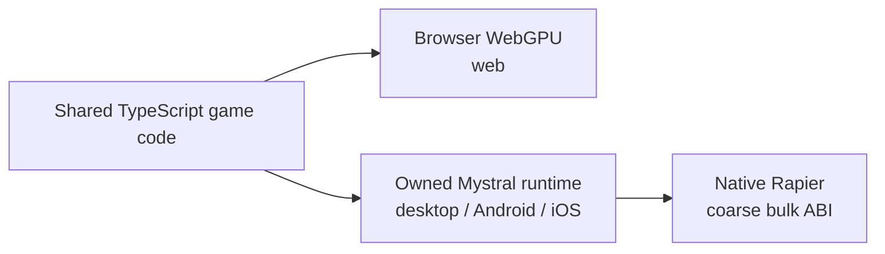
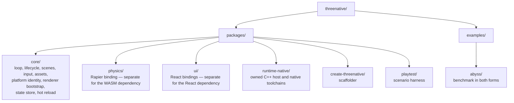
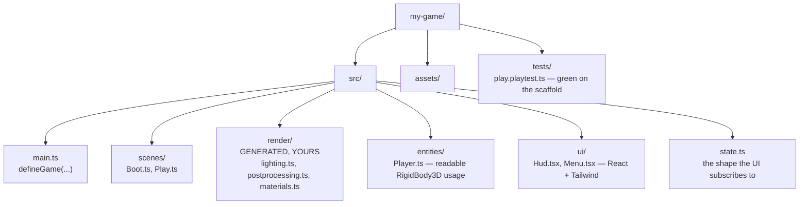

# ThreeNative — Charter

**Status:** binding. Everything here holds until amended here. The Charter says what the
framework is, what it refuses to be, and the rules that decide both. Open work and known
limitations live in [`CURRENT-CHALLENGES.md`](../CURRENT-CHALLENGES.md), not here.

**Amendment log:** [`CHARTER-HISTORY.md`](CHARTER-HISTORY.md).

---

## 1. What it is

**The application framework for Three.js games.** WebGPU by default, **web, desktop and mobile
from one codebase**, at a frame rate that does not apologise for the abstraction, Godot-shaped
conventions, React/Tailwind for UI, and vanilla Three.js on every surface underneath.

### The thesis, in one paragraph

**Three.js is the most widely known 3D API in every model's weights. It is also a web rendering
library, and it stops where the web stops.** Every model can already write it; none of them can
make it leave the browser, hit native frame rates, or ship to a phone. ThreeNative keeps the API
the models know and removes the ceiling underneath it.

| Three.js gives us | Three.js lacks | What we build |
|---|---|---|
| An API in the training data of every frontier model | — | Keep it, unchanged |
| A renderer that works | Anything outside a browser or webview | An owned native host (§7): same code, three platforms |
| WebGPU, TSL, a real material system | A native path | Native runtime and native physics (§7, §10a) |
| — | A game layer: loop, input map, physics bridge, build | The plumbing (§3, §6) |

**Every deviation from Three.js's API is a withdrawal from an account we did not fund.** That is
why §5 borrows vocabulary instead of inventing it, why §5b refuses to own the look, and why §3's
kill switch exists. The framework is worth having where Three.js is genuinely absent — the game
layer and the platform layer — and nowhere else.

**We ship the plumbing. The user's AI agent ships the gameplay.**

ThreeNative is to Three.js what Next.js is to React. You don't hand-roll SSR and routing on bare
React; you shouldn't hand-roll a render loop, a physics bridge, an input map and a mobile build on
bare Three.js either.

Three promises, all testable:

1. **Zero plumbing.** The 42% of every game that is identical boilerplate (§3) is already
   written, on web, desktop and device.
2. **Good-looking by default.** A freshly scaffolded game looks good before anyone touches it —
   delivered as editable generated source, never as framework config (§5b, §9b).
3. **The abstraction is not the bottleneck.** Whatever the platform can render, the framework gets
   out of the way of. Measured, not asserted — §10a.

One line: *R3F gives you a scene. ThreeNative gives you a game — on web, desktop and device.*

### Conventions ship on by default

If a behaviour is the ordinary, expected answer for its situation — a character's feet meet the
floor, a weapon stays in the hand that holds it, an agent walks around a wall, one metre is one
metre — **the engine ships it working, on, and discoverable, before any game asks.** The game's
agent should reach that behaviour by doing nothing.

**Every convention carries a range, not a mandate.** Each one ships with:

1. **A default that is correct for the ordinary case** — on, with no option passed.
2. **A named override on the same object** — a documented field, never a fork or a
   reimplementation. `grounded = false` is the convention working; a game rewriting grounding is
   the convention failing.
3. **Honest reporting when overridden** — turning a convention off must not turn its measurement
   off. A body that is deliberately airborne still reports its real clearance.

**Performance is one of those defaults, not a tuning pass the game is expected to discover.**
Whatever the framework owns arrives pooled, batched, culled and free of per-frame allocation, and
the obvious way to write a game here is the fast way. A hitch in a template as scaffolded is an
engine defect. The same bounds apply as to every other convention: §5b (a performance default
never decides how anything looks), §11.2's kill switch, and §10a's measurement.

**A convention that is not in the templates' `AGENTS.md` does not exist.** The agent's field of
view is that file; shipping a capability the doc omits is shipping nothing.

**Framework, not engine.** A library you call (`three` — you own the loop); a framework calls you
(it owns loop and lifecycle, you fill in scenes and entities); an engine adds an authoring
environment, which §2 rules out. Godot's *vocabulary* is borrowed (§11.4), never its architecture.
The test: **your game lives in `.ts` files you edit, not in a project a tool opens.**

---

## 2. What it is not

Each item below was built by the predecessor project and helped kill it. Read them against §1's
thesis: each spends the training-data advantage to buy a surface the model then has to discover.

| Not building | Why |
|---|---|
| An IR, a compiler, a serialized scene format | Your game is TypeScript. The compiler was 25,898 LOC and bought nothing a model can't do with a `.ts` file. |
| A second *renderer* | 32% of v1's commits went to a runtime no benchmark ever measured. §7's host is the bounded exception: it runs Three.js, it does not replace it. The moment the host starts drawing, it has become v1. |
| A JSON/structured-source ECS | Measured at **14x vanilla Three.js** on greenfield work, and scored lower on playability and visuals. |
| An editor | Not in v1. The paid editor is a separate product in a separate repository. |
| A bespoke CLI vocabulary | 178 command forms, a 2,477-word root help. Models are worst at discovering novel API surfaces. |
| A recipe/preset/genre system | 0 of 7 presets ever reproduced their genre. |
| A code-first ECS (miniplex, bitECS) | Entities are plain classes (§9b). Gameplay architecture is the model's job. A game that wants one runs `pnpm add miniplex`; the framework neither ships nor fights it. |

> An LLM's greatest strength is writing code in languages already in its weights. Its greatest
> weakness is discovering bespoke API surfaces.

**This is the founding constraint.** Everything below is downstream of it.

---

## 3. Win condition

Not "cheaper than vanilla." Frontier models are trained on vanilla Three.js and get better at it
every release. Four criteria instead:

1. **Zero tax on the way in.** Writing a game in ThreeNative costs *the same* as vanilla. Parity
   is the target; any discount is a bonus.
2. **Same or better output.** The model's budget goes to gameplay and feel instead of
   bootstrapping, and the framework never constrains what it can express (§5b).
3. **Zero tax at runtime.** The framework costs no measurable frame time against the same scene
   written by hand, measured against §10a's reference workload. *An abstraction that is free to
   write and expensive to run has moved the tax, not removed it.*
4. **What vanilla structurally cannot do.** One codebase reaches web, desktop and mobile. Still
   works after the 20th change. Has proof it isn't broken.

### The property that makes this unloseable

**The framework must win even when the AI ignores it.** If a model writes raw `THREE.Mesh` calls
and never touches `RigidBody3D`, it still got the loop, the platform adapters, the asset pipeline
and playtest for free. **The framework's floor is vanilla.**

### The benchmark

**Control:** `examples/abyss/` — a real game built in vanilla `three/webgpu`: 90k GPU particles
via TSL compute, bloom, arcade loop, HUD. **~400 lines. It works.**

| Portion | Lines | Kind |
|---|---:|---|
| Renderer init, WebGPU guard, failure UI | ~30 | plumbing |
| Resize / camera layout | ~15 | plumbing |
| Post-processing stack | ~5 | plumbing |
| Input (pointer, keys, capture, blur) | ~30 | plumbing |
| Game state, transitions, HUD sync | ~70 | plumbing |
| Loop scaffolding, dt clamp, fps | ~20 | plumbing |
| **TSL shader, entity behaviour, tuning** | **~230** | **the game** |

**~170 lines (42%) is plumbing identical in every game.** That is the entire addressable surface.
It will not be a 10x reduction; anyone promising that is selling an engine.

### The kill switch

> **Any abstraction that costs more code than writing it in vanilla Three.js gets deleted, no
> matter how much work it took.**

`examples/abyss/` ships in both forms and CI publishes both line counts. **If the vanilla column
wins a row, that row leaves the framework.**

**Count every repetition, not one site.** A mechanism a single game writes more than twice is
plumbing, and the comparison is the framework's lines against the game's *total* across every copy
of it. Per-site scoring turns the kill switch into a rule against having a framework at all.

The switch is prospectively permissive and retroactively ruthless. It is a delete mechanism, not a
gate on adding — that asymmetry is what makes §11.1's two questions safe to answer generously.

---

## 4. Substrate: vanilla Three.js core

**Vanilla core. Zero React reach from `@threenative/core`'s main entry.**

React UI is the opt-in exception: `@threenative/core/react` carries optional React peers and maps
generated game components to `CanvasLayer`. A game that never imports that subpath loads no React,
and React never owns the scene graph or loop.

1. **React's render model fights game loops.** Reconciliation is for state changes; games mutate
   60×/sec. R3F's answer is `useFrame` + refs — imperative Three.js wearing JSX.
2. **One-way door.** A vanilla core can be consumed from R3F. The reverse is impossible.
3. **Mobile is the differentiator and React adds risk there**, not leverage.

R3F wins on ecosystem, and staying vanilla keeps that door open: R3F support is a ~200-line
`@threenative/ui`-shaped binding over the same core whenever it is wanted. This is unrelated to
§6b — React renders the **UI**, never the scene graph.

---

## 5. Conventions, borrowed not invented

Godot node names. Every model already knows `RigidBody3D`, `Area3D`, `CharacterBody3D`,
`CollisionShape3D`. **Zero discovery cost.**

```ts
import { RigidBody3D, Area3D, CollisionShape3D } from '@threenative/physics';

const crate = new RigidBody3D({
  mesh: crateMesh,                          // a real THREE.Mesh
  shape: CollisionShape3D.fromMesh(crateMesh),
  mass: 8,
});

const trigger = new Area3D({ shape: CollisionShape3D.box(2, 2, 2) });
trigger.on('bodyEntered', (other) => score(other));
```

`RigidBody3D` owns a Rapier body handle and syncs its transform onto the `THREE.Object3D` you
handed it. **~80 lines.** It qualifies not because it is short but because a game cannot reach a
Rapier handle portably — the web arm is WASM, the native arm is a typed-array ABI, and §7 forbids
the game from knowing which it got.

### The escape hatch is not an escape hatch

There is no wrapper type to unwrap. These *are* the objects:

```ts
ctx.renderer        // THREE.WebGPURenderer
ctx.scene           // THREE.Scene
ctx.camera.raw      // THREE.PerspectiveCamera
ctx.physics.world   // Rapier World
crate.body          // Rapier RigidBody
crate.mesh          // THREE.Mesh
```

Every Three.js tutorial, StackOverflow answer, and model completion from the last decade applies
unchanged inside a ThreeNative scene.

---

## 5b. The ownership boundary — the framework never owns the look

> **An abstraction that cannot express what vanilla expresses makes the output actively worse —
> not just costlier.**

| Framework may own | Framework must never own |
|---|---|
| Bootstrap, render loop, fixed timestep, CanvasLayer surface | Materials, shaders, TSL |
| Scene lifecycle, plugin wiring | Lighting, tonemapping, exposure |
| Input mapping, asset loading | Post-processing composition |
| Physics binding, platform adapters | Camera framing, composition |
| Test harness, UI state bridge | **Anything that decides how a screenshot looks** |

The visual layer is exactly where the model is strongest. Stay out of it.

### Mechanism is not appearance

> **The framework may own the mechanism that puts something on screen** — pooling, lifetime,
> billboarding, instancing, dispatch, culling — **provided every parameter that decides how it
> looks comes from the game**: geometry, material, colour, texture, curve, timing constants.

**The test, and it is a hard veto:** can the game change the appearance completely without editing
framework code? If the answer is no anywhere, the whole thing ships as generated source in
`src/render/`. There is no partial credit and no "sensible default" reached through a config
option — `postprocessing: ['bloom']` is the shape this rule exists to exclude.

This narrows what the framework may own by *kind*, not widens it by *degree*. A mechanism with
every appearance parameter supplied by the game truncates nothing, because there is no vocabulary
to be truncated to. `GPUParticles3D` is the reference shape: it owns storage buffers, compute
dispatch and lifetime, and takes `material`, `start` and `process` from the game.

Admitted under this rule, each for the same reason: **`TracerPool3D`** (pooling, travel, fade and
orientation for hitscan streaks; surface cloned per slot, geometry and colour from the game);
**`softCircleDataTexture`** (radial-alpha sprite pixels written straight into a `DataTexture`,
because canvas-painted images sample black under `WebGPURenderer` — the framework owns the trap,
never what the sprite shows); **`InstancedBatch`** (transforms gathered before a count exists, one
`InstancedMesh` built, bounds computed so the culler sees the batch; geometry and material held by
reference so recolouring the game's material recolours every draw); **`clipPoseError`,
`clipTrackBindings`, `clipBoneCoverage`, `boneContact`** (instruments that drive a clip, read the
pose and report degrees, names and metres — they select no clip and move nothing); and
**`Heightfield`** (one row-major buffer, interpolation, normals, and the ordering physics consumes;
every height comes from the game's own sampler).

### "Looks good by default" and "never owns the look" are the same rule

Vanilla Three.js out of the box is untonemapped, flat-lit grey. A scaffolded ThreeNative game must
look good on the first `pnpm dev`, with no work. The resolution is entirely about **where the
defaults live**:

- **Generated into `src/render/` = a floor.** The scaffold writes a real `lighting.ts` with a
  three-point rig in ordinary Three.js. The model reads it, edits it, deletes it.
- **Hidden inside a package = a ceiling.** The model reaches it only through config options, and
  everything unanticipated is unreachable.

Same lighting rig, opposite outcomes. The framework's visual contribution is a **good starting
commit**, not a runtime: deleting the framework would leave `src/render/` working.

---

## 6. The API you have to know

**The entry point fits on one page on purpose.** `defineGame`, a scene with three optional
methods, `ctx`, four CLI commands — a model that reads only this page can write a working game.

The total exported surface is bounded by §11.1's two questions and deleted by §11.2's kill switch,
which are tests of kind. **What must never grow is the amount a model has to discover before it
can start** — that is a property of the entry point, not of the export list.

```ts
// src/main.ts
import { defineGame } from '@threenative/core';
import { rapier } from '@threenative/physics';
import { Boot, Play } from './scenes';

export default defineGame({
  render: { webgpu: true },        // WebGL2 fallback automatic. Nothing visual here.
  plugins: [
    rapier({ gravity: [0, -9.81, 0], fixedStep: 1 / 60 }),
  ],
  scenes: { boot: Boot, play: Play },
  start: 'boot',
});
```

A scene is a class with three optional methods. That is the entire lifecycle.

```ts
// src/scenes/Play.ts
import { Scene, type Ctx } from '@threenative/core';
import { setupLighting } from '../render/lighting';       // generated, yours
import { setupPost } from '../render/postprocessing';     // generated, yours
import { follow } from '../camera/follow';                // generated, yours

export class Play extends Scene {
  async load(ctx: Ctx) { this.hero = await ctx.assets.model('hero.glb'); }

  enter(ctx: Ctx) {
    setupLighting(ctx.scene);
    setupPost(ctx.renderer.raw, ctx.scene, ctx.camera);
    ctx.add(this.hero);
  }

  update(ctx: Ctx, dt: number) {
    const move = ctx.input.vector('move');      // identical on key, pad, and touch
    if (ctx.input.justPressed('jump') && this.hero.body.grounded) this.hero.body.velocity.y = 8;
    this.hero.body.velocity.x = move.x * 5;
    this.hero.body.moveAndSlide(dt);
    follow(ctx.camera, this.hero.mesh, dt, { distance: 12, damping: 0.1 });
    ctx.state.set({ hull: this.hull });         // UI reads this; see §6b
  }
}
```

Four CLI commands, ever: `dev`, `build`, `test`, `ship`.

---

## 6b. UI — React + Tailwind, never the scene graph

React renders the HUD, menus and overlays. It does not touch `THREE.Scene`.

**One UI, one web-standard rendering contract by default.** A game writes `src/ui/` once and the
same React DOM, Tailwind, CSS, SVG, fonts and assets run unchanged on every target, through that
platform's browser-class renderer — on device, a transparent WebView composited over the game
surface, which a measured Pixel 8 run showed the system composites as a hardware overlay for free.
What is guaranteed is source parity and visual parity, not browser-binary parity, which no design
using system engines can offer once iOS is in the set.

**A native UI renderer is available as an opt-in.** `@threenative/core/react` maps React to
`CanvasLayer` quads with no WebView, no CSS and no second process. A game chooses it when it wants
a UI that is part of the rendered frame, a target with no WebView, or zero extra processes, and
owns the appearance difference that comes with it — the quad renderer implements twenty style keys
and a bitmap font against the browser's whole CSS, SVG and font stack.

```ts
ui: { renderer: 'web' }      // default — the platform picks the surface
ui: { renderer: 'native' }   // CanvasLayer quads, no WebView
```

Neither renderer touches `THREE.Scene`, and `react-dom` stays out of the **portable entry** on
every target.

**The 60fps problem.** React must never re-render on the game loop. The bridge is a plain external
store the game writes to and React subscribes to:

```tsx
// src/ui/Hud.tsx
import { useGameState } from '@threenative/ui';

export function Hud() {
  const { hull, score } = useGameState();     // throttled; ~10Hz, not 60Hz
  return (
    <div className="pointer-events-none absolute inset-0 p-6 font-mono">
      <div className="text-cyan-300 text-4xl tabular-nums">{score}</div>
      <div className="mt-2 h-1 w-24 bg-slate-800">
        <div className="h-full bg-cyan-400" style={{ width: `${hull}%` }} />
      </div>
    </div>
  );
}
```

`ctx.state.set()` writes at whatever rate the game wants; the store coalesces and notifies React on
a throttle, backed by **zustand** — `useSyncExternalStore` semantics are already correct for this.

Tailwind is the right call for the same reason Godot names are: overwhelmingly present in model
weights, so HUD work costs nothing in discovery.

---

## 7. Cross-platform — the owned native runtime

**Write once, run everywhere.**



**One codebase reaches three platforms.** Whether Three.js can run outside a browser is answered,
on desktop and on the Android emulator; what remains open is coverage, tracked in
[`CURRENT-CHALLENGES.md`](../CURRENT-CHALLENGES.md).

Mystral is absorbed as the owned `packages/runtime-native/` fork. Its C++ and platform source live
in one workspace package; Dawn, V8, QuickJS, SDL3, wgpu-native and other dependency trees stay
downloaded into an untracked `third_party/`.

**The runtime is a host, not a renderer.** It must not own Three's renderer, fork Three.js, or
replace the JavaScript `GLTFLoader`. Three.js compatibility must equal the workspace catalog.

Native physics is compiled into the runtime and exposed through a coarse, host-neutral typed-array
ABI, with bulk `step`/`readVisibleTransforms` crossings rather than per-object frame calls. The
TypeScript API stays in `@threenative/physics`.

### The user never has to know native exists

The test of "write once, run everywhere" is not that the same source *compiles* everywhere. It is
that a developer writes their game against the framework abstractions and plain Three.js, never
thinks about the target, and it behaves the same on all of them.

That forbids a second implementation of any public class. `CharacterBody3D` is one file, and so are
`Area3D`, `RigidBody3D` and `CollisionShape3D`. An export condition may swap the
`PhysicsSimulation` backend beneath them; it may never swap a node, a scene, or anything else a
game writes against. **Two copies of a class are a fork**, and a fork of gameplay logic diverges
silently.

Where a backend cannot honour part of the shared API, it **throws at construction**. Accepting an
option and discarding it is §11's fail-closed rule relocated into the runtime, and it is worse
there, because it surfaces as a gameplay bug on one platform only.

Both backends are proven by a single conformance suite: the same scenario, run against every
`PhysicsSimulation` implementation, asserting the same transforms. Absent that suite, "runs
everywhere" is a claim and not a gate. The standing parity matrix is
[PRD-054](../PRDs/BLOCKED/requires-parity-rerun/PRD-054-write-once-run-anywhere.md).

Release readiness requires, in order:

1. the unchanged core bundle renders 300+ frames on Android at the catalog Three version;
2. the device harness demonstrates all fail-closed negative controls;
3. native physics passes those device scenarios;
4. iOS simulator evidence exists;
5. §10a's parity rule holds — the native arm is not slower than the browser arm; and
6. physical-driver, arm64 physics and phone-performance work is measured on real hardware.

Rows 1 and 2 are green; the rest are tracked in `CURRENT-CHALLENGES.md`. **A result may say
desktop-ready or Android-emulator plumbing-ready; it must not say mobile-ready while physics, iOS,
performance or hardware rows are open.**

---

## 8. Salvage

| Package | State |
|---|---|
| `playtest` | Standalone. Proven to run on **plain Three.js with zero ThreeNative deps** |
| Asset MCP | Published, MIT, own release lane; the version templates pin exposes 32 recorded tools |
| Shader export | TSL → WGSL/GLSL exporter, naga-validated |

---

## 9. Repository layout

### 9a. Packages — pnpm workspace, deliberately few

**Package count is governed by §11.5's dependency-boundary rule, not by a number to negotiate.**
Modularity comes from subpath exports, not from more `package.json` files. A 15k-LOC framework
split eleven ways is ~1.4k LOC per package — all boilerplate, no boundary.



**pnpm catalogs are load-bearing, not style.** TSL's API changes between three releases with no
deprecation cycle. A catalog pins one `three` across every package and example, so a bump is one
line and one CI run. Packages declare `three: 'catalog:'`.

### 9b. What `pnpm create threenative my-game` generates



**`src/render/` is the design's load-bearing folder.** It is ordinary Three.js written into the
user's repo, not framework config. The scaffold gives a good zero; the model is free to rewrite all
of it. That is §5b made concrete.

`entities/Player.ts` and `tests/play.playtest.ts` exist for the same reason: **the scaffold is the
documentation.** Models learn an API from the code in front of them, not from a help page.

### 9c. Tech stack

Chosen by one rule: **pick what models already know.**

| Layer | Choice |
|---|---|
| Package manager | **pnpm 10** + workspace + catalog |
| Language | **TypeScript 5.9**, strict, ESM only, Node 20+ |
| Rendering | **three** `three/webgpu` + TSL, catalog-pinned |
| Physics | **@dimforge/rapier3d-compat** |
| UI | **React 19 + Tailwind 4** |
| UI state bridge | **zustand 5** |
| Game build | **Vite** |
| Package build | **tsup** |
| Unit tests | **Vitest** |
| Playtest | **Playwright** |
| Lint + format | **Biome** |
| Releases | **Changesets** |
| Native host | **owned Mystral fork** |
| CI | GitHub Actions, green (§11.6) |

---

## 10. Budgets

**§10a is what we are trying to achieve. §10b is what we refuse to spend achieving it.** A charter
with only cost caps is a brake with no steering wheel.

### 10a. Performance — the target, because "close to native" needs a number

**Reference workload:** the `platformer` template, unmodified, as scaffolded. It is the reference
template with the broadest scenario suite: 22 playtest files, and it is what a user actually
receives. A performance claim measured on a spinning cube is not a performance claim.

| Lane | Reference hardware | Budget |
|---|---|---|
| Web | Desktop Chrome, discrete GPU | **60 fps at 1080p**, 99th-percentile frame ≤ 33 ms |
| Desktop native | Same machine, same scene | **≥ the web arm** — the parity rule below |
| Mobile | Mid-range Android phone (Snapdragon 7-series class) | **60 fps at 1080p**; hard floor 30 fps sustained |

**The parity rule is the real definition of "close to native," and it is the one gate runnable
today with no phone.**

> On the same machine and the same scene, the native arm must not be slower than the browser arm.
> If the owned runtime renders our own template worse than Chrome does, §3's kill switch applies to
> it exactly as it applies to a helper function.

The `performance` assertion kind is fail-closed — `maxFrameMsP95`, `maxDrawCalls`, `maxTriangles`,
requiring the `runtime.performance` capability — so a timing number is verifiable rather than an
intention. **Mobile numbers stay open until physical hardware measures the reference workload**: an
emulator fakes the GPU driver, and a frame rate sourced from one is not a frame rate. Progress is
tracked in [`CURRENT-CHALLENGES.md`](../CURRENT-CHALLENGES.md).

### 10b. Cost caps — what we refuse to spend

| Budget | Limit | Kind |
|---|---:|---|
| Framework source (excl. examples, salvage, native) | **15,000 LOC** | review trigger |
| Native runtime source (excl. downloaded `third_party/`) | **100,000 LOC** | review trigger |
| Workspace packages | governed by §11.5 | rule |
| Untracked `third_party/` | **hard fail** if any file is tracked | hard |
| Default gate green with no C++ toolchain | **hard fail** otherwise | hard |

**Hard means CI fails. Review trigger means CI reports and a human justifies it in the PRD** —
crossing one is a conversation, not an outage. Exceeding a review trigger is not a signal to raise
it; it is a signal to run the kill switch over what was added.

**A cap that gets routed around is worse than no cap.** Every limit above is either enforced by
`pnpm budgets` or is not written down.

---

## 11. Rules

1. **The two questions.** Both must pass — see §11.1.
2. **The kill switch.** Any abstraction costing more code than vanilla is deleted, counted across
   every repetition in one game (§3).
3. **Never own the look.** §5b. The framework may own mechanism; every appearance parameter comes
   from the game. Visual defaults ship as generated source, never as package config.
4. **Vocabulary is borrowed, never invented.** Godot for nodes, Three.js for rendering, Rapier for
   physics, Tailwind for UI. Where none has a name, borrowing is exhausted before inventing, and
   the invention is recorded as the discovery cost it is.
5. **A package exists only when it carries a dependency the others must not inherit.**
6. **CI green means something or it means nothing.** No merge while red.
7. **Write once, run everywhere.** §7. One implementation per public class. A backend swaps beneath
   the API, never a node the user writes against; what a backend cannot honour throws.
8. **Performance is a default, not a tuning pass.** §1. The framework holds §10a's budget on the
   path a game gets by doing nothing, and proves it with a `performance` assertion.

### 11.1 — the two questions

> **1. Could the game write this portably itself?** If no — it needs a browser global, a platform
> seam, or a backend the game must not know it got — the framework owns it, at any size.
>
> **2. Does it decide how anything looks?** If yes, it ships as generated source in `src/render/`,
> at any size.
>
> Something that passes both becomes framework code once one game writes it more than twice.

**These are ANDed, and question 2 is a veto.** Passing question 1 does not license owning an
appearance; the mechanism ships and the look stays in `src/render/`.

Size was never the variable. A size ceiling rejects fifteen lines of pointer-lock plumbing the game
**cannot write portably at any length**, while admitting a preset system that fits in the same
fifteen lines.

**Four things this does not loosen:**

1. **§2's closed list outranks both questions.** An IR, a scene format, an editor, a
   preset/genre/recipe system, a code-first ECS and a bespoke CLI vocabulary stay closed however
   cleanly they pass.
2. **§11.2 applies retroactively to everything admitted here.** Generous on the way in is only safe
   because the way out is automatic.
3. **§10b's review trigger still bites.** A rule that admits more code does not raise the number it
   is measured against.
4. **Question 1 is settled by execution, not by intent.** Anything admitted for being unportable
   lands with proof it runs on the native arm — a conformance case or a playtest with `--target` —
   in the same commit. Admitting a helper *because* the game cannot write it portably and then
   shipping it web-only produces exactly the silent one-platform fork §7 forbids.

---

## 12. Success and failure criteria

**ThreeNative succeeds if, and only if** — one criterion per pillar of §1's thesis:

1. **It still reads as Three.js.** The ThreeNative port of Abyss is no longer than 400 lines, reads
   as ordinary Three.js, and does not look worse than the vanilla control (§5b). *Protects the
   training-data advantage.*
2. **It leaves the browser.** One unmodified game codebase builds and runs on web, desktop and a
   physical phone, each proven by a playtest run rather than a screenshot. *Removes the ceiling.*
3. **It is not slower for having done so.** §10a's parity rule holds on the reference workload, and
   the mobile lane meets its frame budget on real hardware. *Removes the other ceiling.*
4. **Someone plays it.** One game is played by **a stranger for five minutes**, with a transcript.

Criterion 4 is the only one that cannot be gamed by the team that wrote it, which is why it is not
negotiable and not first.

**ThreeNative fails, and is abandoned, if:**

- The Abyss port is longer than vanilla, or visibly worse; or
- A platform cannot be reached at all, and no host path is viable; or
- Reaching it costs the frame rate — a game that ships everywhere and runs well nowhere has solved
  the wrong half of §1; or
- Framework source passes its review trigger with no criterion above met.

**This document must be able to lose.** If the vanilla arm wins, the correct response is to ship
`playtest` and the asset MCP server as standalone tools for vanilla Three.js and stop there — a
real product. Keeps the moat, deletes the treadmill.

The benchmark apparatus is published and wired into CI: frozen vanilla control, hand-ported
framework arm, deterministic LOC classifier, sealed prompt, blind scoring. Live LOC numbers are
generated into the root README, never restated by hand. The status of the head-to-head run is
[`RESULTS-2026-08-02.md`](../benchmark/RESULTS-2026-08-02.md), summarised with everything else that
is still open in [`CURRENT-CHALLENGES.md`](../CURRENT-CHALLENGES.md).
