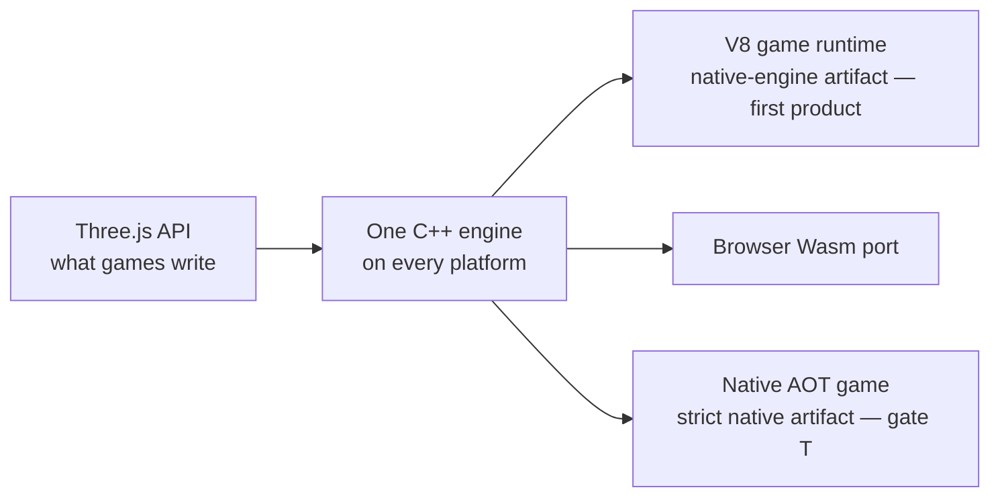

# Native engine — architecture decision record (N00)

**Status:** binding as the record of the owner decision taken 2026-10-04 (interview) and of the
agent calls the owner accepted the same day. It reverses standing product rules, so it is written
down before any engine code lands.

**What it changes today:** nothing in the charter's rule text. [`CHARTER.md`](CHARTER.md),
[`NATIVE-RUNTIME.md`](NATIVE-RUNTIME.md) and
[`packages/runtime-native/AGENTS.md`](../../packages/runtime-native/AGENTS.md) keep their current
wording and point here; their rule text is rewritten in the commit that ships the first
native-engine artifact (gate E, [PRD-499](../PRDs/native-engine/PRD-499-n02-the-host-links-without-a-js-engine.md)),
because primary docs name only shipped things.

**Work package:** N00 of the [native-engine batch](../PRDs/native-engine/README.md).
**Source PRD:** [PRD-497](../PRDs/native-engine/PRD-497-n00-architecture-decision-and-compatibility-inventory.md).

---

## 1. What is decided

ThreeNative stops hosting Three.js and starts owning the engine underneath it, in C++, behind the
same Three.js API. Every engine system runs in native code on every target; game code keeps its
JavaScript VM for now and loses it at a later gate. The compatibility denominator is measured from
what games actually import, not asserted as a percentage.

**Out of scope of this record:** the reference outputs and baselines
([PRD-498](../PRDs/native-engine/PRD-498-n01-baseline-and-differential-fixture-runner.md)) and the
API catalog that turns the inventory into bindings
([PRD-500](../PRDs/native-engine/PRD-500-n03-api-catalog-binding-abi-and-version-protocol.md)).

## 2. The charter rules this amends, in plain words

The charter outranks every `AGENTS.md`, so the reversal is quoted here rather than paraphrased.

- **"A second *renderer*."** The charter's closed list of things that killed v1 names a second
  renderer, and the row says the moment the host starts drawing instead of running Three.js, it has
  become v1. **Amended:** ThreeNative owns one C++ engine behind the Three.js API, on every
  platform. The row's objection — 32% of v1's commits went to a runtime no benchmark ever measured —
  is answered by measurement instead of by a ban: [CP1](../PRDs/native-engine/PRD-534-cp1-the-native-engine-earns-the-port.md)
  can stop the program.
- **"The runtime is a host, not a renderer."** The charter's platform section says the runtime must
  not own Three's renderer, fork Three.js, or replace the JavaScript `GLTFLoader`. **Amended:** the
  owned runtime *is* the renderer, and native glTF replaces the JavaScript loader in a strict build.
- **"An IR, a compiler, a serialized scene format."** The closed list keeps banning these. The ban
  is kept exactly where it was aimed: no authored IR, no scene format, and no compiler of game code
  as a **required authoring step**. The shader IR is internal and never authored. The gate-T
  compiler is an optional build mode over unchanged TypeScript.
- **`packages/runtime-native/AGENTS.md`, "Non-goals until evidence says otherwise":** "no custom C++
  renderer, no deep Three.js fork, no native GLTF replacement". **Amended:** the custom C++ renderer
  and the native glTF path are the program; the deep fork of Three.js as a *bundle* is not — no
  upstream Three.js bundle ships inside the native engine.
- **`packages/runtime-native/AGENTS.md`, "a host, not a renderer" with upstream `WebGPURenderer`
  primary.** **Amended:** upstream stays primary while it is the only engine that works, and is
  deleted once the native engine is the default ([N21](../PRDs/native-engine/PRD-535-n21-the-js-engine-is-deleted.md)).

Everything else in the charter stands, including the kill switch, "never own the look", and the
rule that the supported API is the measured denominator.

## 3. The ten decisions

Owner decisions, João, 2026-10-04 (interview):

1. **The engine is JS-free.** Every engine system runs in C++: traversal, transforms, animation,
   batching, materials and TSL, visibility, streaming and rendering. No JS implementation of an
   engine system ships on any target. Gate E is mandatory.
2. **Speed first; a JS-free game binary later.** Game code keeps running on a JS VM (V8 on desktop
   and Android, the browser's own engine on web) through generated bindings. That makes
   [PRD-531 (N18)](../PRDs/native-engine/PRD-531-n18-v8-game-runtime-adapter.md) the first shipping
   game runtime. Gate T
   ([N05](../PRDs/native-engine/N05-native-typescript-qualification/README.md),
   [PRD-530](../PRDs/native-engine/PRD-530-n17-strict-native-typescript-game-packaging.md)) is a
   later milestone. The N05 spike still runs early, but it gates nothing on the path to promotion.
3. **An early perf checkpoint can stop the program.**
   [PRD-534 (CP1)](../PRDs/native-engine/PRD-534-cp1-the-native-engine-earns-the-port.md) measures
   native against current ThreeNative after N06 + N09. With no CPU win in the engine hot paths,
   N11–N15 do not start until the owner re-plans.
4. **One engine everywhere.** The web runs the same C++ core in Wasm
   ([PRD-532 (N19)](../PRDs/native-engine/PRD-532-n19-webassembly-native-core-browser-port.md) is
   mandatory). The TS framework-system implementations and the upstream Three.js runtime are deleted
   once it ships
   ([PRD-535 (N21)](../PRDs/native-engine/PRD-535-n21-the-js-engine-is-deleted.md)). The core is
   Wasm-safe from day one: single-thread fallback, retained views that survive memory growth, no
   blocking waits.

Calls made from the code by the agent, accepted by the owner ("go with what you think will be
best"), 2026-10-04:

5. **Charter amendment, in plain words:** "a second renderer" and "the runtime is a host, not a
   renderer" become "ThreeNative owns one C++ engine behind the Three.js API on every platform". The
   closed list keeps banning an authored IR, a scene format and a compiler of game code *as a
   required authoring step*. The shader IR is internal and never authored. The later gate-T compiler
   is an optional build mode over unchanged TypeScript.
6. **The game API stays vanilla Three.js.** The charter's training-data thesis is the reason. The
   supported surface is the measured denominator
   ([§7](#7-the-pinned-reference) and
   [`native-engine-inventory.json`](native-engine-inventory.json)), published in
   `packages/create-threenative/capabilities.json`. An unsupported symbol fails at build, or at
   scene preparation, with a named diagnostic. There is no fallback, because there is no JS engine
   to fall back to.
7. **`ctx.renderer.raw` survives as the compatible `WebGPURenderer`.** Templates read only public
   renderer fields through it (`toneMapping`, `toneMappingExposure`, `shadowMap`, and setup passed
   to `setupLighting`), so it returns the engine's Three-compatible renderer object.
   Renderer-private fields and the raw GPU device are unsupported and named as such.
8. **Bindings are generated from one catalog for several VMs:** V8 first (N18), browser JS over
   Wasm next (N19), JSC when iOS returns. iOS is out of the first program but not designed out.
9. **Binding crossing cost:** the per-object API stays Three-compatible. Bulk typed-array paths,
   shaped like the existing physics ABI, are added only where CP1 shows that crossings cost real
   frame time.
10. **The legacy JS-owned engine is deleted** one release after
    [PRD-533 (N20)](../PRDs/native-engine/PRD-533-n20-platform-qualification-performance-default-promotion.md)
    makes native the default
    ([PRD-535 (N21)](../PRDs/native-engine/PRD-535-n21-the-js-engine-is-deleted.md)).

11. **The game-code compiler is Perry (owner decision, 2026-10-05).** Perry (`PerryTS/perry`,
    MIT, LLVM back end) compiles the game's TypeScript and the generated Three-compatible facade;
    it does not compile the engine. It replaces ASDAlexander77/TypeScriptCompiler ("tslang"),
    which is dropped: its pinned v0.0-pre-alpha87 segfaults compiling its default library for any
    non-host target, and alpha89 and alpha90 fail the same way, so no arm64 library resolves its
    runtime. Rules that follow from this decision:
    - **One boundary.** Compiled game code reaches the engine only through the versioned C ABI of
      [PRD-500 (N03)](../PRDs/native-engine/PRD-500-n03-api-catalog-binding-abi-and-version-protocol.md),
      through a small Perry adapter that owns Perry's value representation, GC roots for retained
      callbacks and completion routing. The engine knows nothing of Perry. Changing the compiler
      later is a new adapter, not an engine change.
    - **Pinned together.** The Perry compiler, its runtime and the adapter are pinned as one
      version and upgraded on purpose: Perry's 0.5.x FFI surface has changed without a major
      version bump.
    - **Strict builds reject, at compile time,** every unsupported dynamic path (`eval`,
      `new Function`, dynamic import) with Perry's strict controls, and the artifact audit still
      proves no interpreter or JIT is present. A compiled executable alone proves nothing.
    - **Resource lifetimes are explicit.** Perry's `WeakMap`, `WeakSet` and `WeakRef` retain their
      targets and `FinalizationRegistry` callbacks do not run, so no native texture, geometry,
      scene or callback registration depends on a finalizer. Repeated scene load/unload and UI
      mount/dispose are acceptance tests.
    - **The HUD is qualified separately.** The native CSS backend stays; Perry's TSX is not React's
      reconciler, so the game's React HUD (`react-reconciler`, hooks, handlers, scheduler) must
      compile and behave under Perry before a game with a React HUD is called strict native.
    - **Stopping rule.** If Perry needs broad compiler or runtime redesign to pass the gameplay and
      HUD corpus, its integration stops expanding and the same C ABI is tried with another
      compiler. A strict build never falls back to V8 silently.

Fixed by the proposal: C++20 for the engine, Dawn and wgpu-native retained, no upstream Three.js
bundle inside the native engine. The proposal named TypeScriptCompiler as the first AOT candidate;
decision 11 replaces it with Perry.

## 4. The two gates

**E — native engine.** A native application creates a scene, runs engine systems and renders with
no dependency on V8, QuickJS, JavaScriptCore, Hermes, an engine JavaScript bundle or a WebView. A
C++ test driver can establish it. **Mandatory**, per decision 1.

**T — strict native TypeScript.** A representative supported TypeScript game using the familiar
imports and APIs compiles into native code, runs on that same engine, and requires no JavaScript
interpreter or JIT. **A later milestone**, per decision 2: passing E is not passing T.

Both gates are proved from the build dependency graph, linker and symbol inspection, the packaged
resource inventory and runtime module inspection together — a filename scan for `.js` proves
neither, since a binary can embed a VM.

## 5. Definitions

| Term | Means |
| --- | --- |
| **Native engine** | The C++ implementation of scene state, traversal, transforms, animation, materials and TSL, visibility, streaming and rendering, behind the Three.js API. One engine, every platform, including web in Wasm. |
| **Game runtime** | Whatever executes the game's own code: V8 on desktop and Android, the browser's own engine on web, JSC when iOS returns, or a native AOT build. |
| **Native-engine artifact** *(the first product)* | The engine is JS-free and the game code runs on a VM. This is what ships first. |
| **Strict native artifact** *(gate T)* | No VM at all: the engine is JS-free **and** the game code is native. |
| **WebView-UI labelling** | A WebView UI carries its own browser runtime, so a native-engine artifact shipping one is labelled as such and never called a JS-free application. A strict artifact disables it or uses native UI. |

**JS-free** is scoped to the shipped application: it is a promise of *no JavaScript engine executing
it*, not of no garbage collection and no supporting runtime libraries. Build tools, binding
generation, asset cooking and test drivers may use Node.js or TypeScript.

**Non-goals.** No new Vulkan/Metal/D3D12 backend, no universal ECMAScript compiler, no mandatory ECS
programming model, no replacement physics engine, no complete browser/DOM implementation, no editor
rewrite. No iOS qualification in the first program. No Unreal-level visuals from changing the
implementation language. No determinism claim from AOT alone.

## 6. Configuration dimensions and rejected combinations

Three dimensions are configured separately: **engine implementation** × **game runtime** × **UI**.
Contradictory combinations are rejected at packaging time, not tolerated at runtime.

| Engine | Game runtime | UI | Artifact |
| --- | --- | --- | --- |
| Native C++ | VM (V8, browser JS, JSC) | WebView or native | **native-engine artifact** — the first product |
| Native C++ | Native AOT or C++ | Native or disabled | **strict native artifact** — gate T |
| Native C++ | any | WebView | allowed, labelled per §5 — never called JS-free |
| Native C++ | native, but dynamically loading a JS runtime | any | **rejected** — that is not a strict artifact |

Two rules follow. **There is no automatic fallback** from a strict native artifact to the legacy JS
engine; the legacy backend stays available only as a separately selected build, preserved until N21.
And a target that claims native-engine independence must be inspected and proved as one, not assumed
from a build flag.

## 7. The pinned reference

**`three@0.185.1` plus the ThreeNative patch
[`packages/core/patches/three@0.185.1.patch`](../../packages/core/patches/three@0.185.1.patch) is
the behavioural oracle.** Every compatibility claim — object semantics, numerics, animation,
materials, shader packages — is measured against that exact pair, resolved through the workspace
`catalog:` in [`pnpm-workspace.yaml`](../../pnpm-workspace.yaml).

**Upgrading it is a deliberate batch, never drift.** TSL's API changes between three releases with no
deprecation cycle, so a bump re-opens the measured denominator, the reference outputs and the
baseline it was measured against; it is its own change with its own evidence, and never rides along
with engine work.

The compatibility denominator itself is committed as
[`native-engine-inventory.json`](native-engine-inventory.json), regenerated by
`pnpm tsx scripts/native-engine-inventory.ts --write` and enforced by
`pnpm tsx scripts/native-engine-inventory.ts --check --symbols`: every module reachable from
`packages/core/src` is classified, and every `three*` symbol templates and examples actually import
becomes the first rows of the N03 catalog.
