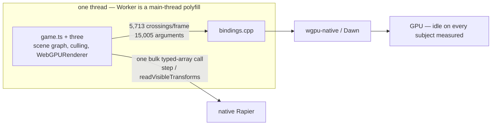

# Native performance — where the frame time goes

**Current as of 2026-08-28.** The JavaScript↔C++ seam owns most of a native frame. Not the GPU, not
the render backend, and not the interpreter — **V8 is the default on desktop and Android**
(`-PthreenativeJsEngine=quickjs` survives only as the rollback), so every row that once blamed a
missing JIT is history.

## The budget

**Desktop, profiled Xvfb lane, 619 eligible frames** (`work = threadCpu − present` = 23.9 ms/frame,
[PATH-TO-60FPS](../verification/runtime-perf-state.md)):

| Term | ms | Share | Instrument |
|---|---:|---:|---|
| JavaScript + non-bridge render-thread work | 14.77 | 61.8% | `work − bridgeNs` |
| Bridge marshalling + handle churn | 3.79 | 15.8% | `bridgeOverheadNs` |
| In-handler work (arg parse, wrapper create) | 3.32 | 13.9% | derived by subtraction |
| Backend commands (wgpu) | 2.04 | 8.5% | `commandNs` |
| **Bridge total** | **7.11** | **29.7%** | overhead + in-handler |

Per frame: **5,713 crossings, 15,005 marshalled arguments.**

PRD-226's ablation ladder splits the same frame independently — **backend command recording plus its
GPU work is 17%, JavaScript + bridge is 83%** — and its backend term (1.95 ms) lands **0.09 ms** from
`commandNs` (2.037 ms). Two unrelated mechanisms agreeing is what makes this a measurement rather
than a definition.

**Quote the shares, not the absolute ms.** The ablation's absolutes were taken on `:0`, which a
sibling lane voided in favour of Xvfb, and the machine has drifted since: PRD-224's same-session
control arm reads **12.3–12.5 ms** `render.p50` today where 22.2 ms was recorded a day earlier
([record](../verification/runtime-perf-state.md)). Any A/B here must be a
**same-session pair**; cross-day desktop absolutes mean nothing.

**Pixel 8, Bayview, symbolized simpleperf, 37.7 ms/frame:**

| Term | ms | Fate under the fix |
|---|---:|---|
| JavaScript actually running three.js | 10.1 | stays |
| V8 machinery around it | 12.8 | removed |
| Bridge dispatch + backend | 8.1 | mostly removed |
| `libc`/scudo allocator churn | 4.3 | mostly removed |
| Mali driver | 2.3 | stays |

**The seam is 22.3 ms of that 37.7** — per-crossing V8 scaffolding, bridge dispatch, allocator
churn, and the megamorphic inline caches our dynamically-shaped wrappers force on three.js. **Chrome
runs the same three.js on the same phone at 59.99 fps.** The JavaScript is not the problem; what
surrounds it is. The device split is inherited from one profile on a Bayview build that is not
today's — desktop gate P1 tests the model before anyone spends a device night.

The device meter was audited against `dumpsys SurfaceFlinger --latency` and agrees within 2%: the
game truly runs at ~20 fps. **`dumpsys gfxinfo` reads ~5× flattering** because it meters the Skia
view pipeline a `SurfaceView` game bypasses; do not quote it.

## The shape of the problem

Removing the WebView removed the *packaging* tax, not the *execution* tax. JavaScript still owns
`THREE.Scene`, still owns `WebGPURenderer`, and still issues every draw.

Physics got this right: one coarse crossing per frame, typed arrays across the boundary. Rendering
is the outlier, and [PRD-227](../PRDs/PRD-227-the-frame-crosses-once.md) is making it cross once too
— the design is in [NATIVE-RENDER-TRANSPORT](NATIVE-RENDER-TRANSPORT.md).

## Open, ranked

🟢 a day or two · 🟡 days to a week · 🔴 weeks · ⛔ not fixable at any price

| Effort | Bottleneck | Where | Status |
|---|---|---|---|
| 🔴 | **The seam — 22.3 ms of 37.7 on device.** Two changes that only work together: the frame crosses once (predicted −13.4 ms) and wrapper objects get fixed shapes via `ObjectTemplate` + internal fields (predicted −8.9 ms) → 15.4 ms ⇒ 65 fps against a 16.67 ms target | PRD-227 | Change 1 is working-tree code; Change 2 not started; **gate P1 not yet run.** Margin is 1.3 ms — achievable, not comfortable |
| 🟢 | **Per-object JS work in three.js.** ~11.3 µs of CPU per drawn object against Godot's ~5.3 µs, all of it inside three.js's WebGPU submission path — upstream, not framework plumbing | the game's `src/render/`: instancing, LOD, merged geometry. `SceneRenderProjection` (`packages/core/src/renderProjection.ts`) mirrors an authored scene into instanced draws without consuming it | Permanent lever. Submitting fewer objects is the only thing that has ever moved this term |
| 🟡 | **Cold start: the bundle is parsed as source every launch.** V8's code cache or a startup snapshot is the remedy; neither is wired up. Plus runtime SWC transpile on desktop | `src/js/v8_engine.cpp`, `src/js/ts_transpiler.cpp` | **Never measured under V8.** Measure before fixing |
| 🟡 | **The draw-count knee** — marginal cost per mesh jumps ~5.6× between 500 and 1,000 draws | PRD-069 | Unexplained. A *constant* per-crossing tax cannot produce this shape; inline-cache degradation and stub-cache thrash can. Re-run the hunt under the seam model before assuming a separate mechanism |
| 🔴 | **Everything is on one thread.** `Worker` runs worker code on the main thread and there is no JobSystem; only file I/O and image decode use the libuv pool | `src/runtime.cpp` | An owed correctness gate. Build it because it is owed, not because it is fast |
| 🟡 | **First-frame shader hitches.** TSL builds WGSL in JS, then wgpu compiles the pipeline mid-frame | upstream `WebGPURenderer` | PRD-070 found the persisted-cache half unreachable. A warm-up pass kills hitches, not average frame time |
| ⛔ | **iOS JSC is interpreter-only.** Apple grants the JIT entitlement to WKWebView, not to embedded JavaScriptCore, and no third-party engine gets it either | `src/js/jsc_engine.mm` | Unfixable. The one sidestep is AOT — compile the bundle with `shermes`, benchmark scene traversal, close the branch if untyped JS gains little. A spike, not a plan |

## Where we already stand against Godot 4.7.1

Instanced rendering is a win on all three platforms and unbatched per-object rendering is a loss
([summary](../verification/runtime-perf-state.md), scorer equivalence gate PASS):

| Platform, instanced | ThreeNative p50 | Godot p50 | Margin |
|---|---:|---:|---:|
| Web, 65 536 | 17.9–20.3 ms | 65.8–67.8 ms | 3.5× |
| Desktop, 65 536 | 13.85 ms | 39.70 ms | 2.9× |
| Pixel 8, 65 536 | 12.51 ms | 40.02 ms | 3.2× |

The loss is web L1 — one `Mesh` per cube, no batching on either side — where the knee is 1,024
against Godot's 4,096 and the frame-time gap is 1.45–1.55×. That is three.js issuing draw calls in
JavaScript, not a framework defect and not a renderer bug; flipping the knee needs ~25–30% off.

## Closed, with evidence

- **QuickJS had no JIT.** The largest item on this list for months, closed by one build flag rather
  than a transport rewrite: **8.34 ms against QuickJS's 101.24 ms** at 16,384 cubes on a Pixel 8,
  and V8 has been the Android default since PRD-130
  ([record](../verification/prd-130-phase-6-2026-08-16.md)). Held still at 4,096 collapsed cubes,
  only the engine differing: 20.01 ms → **8.31 ms**. iOS stays JSC by construction, so this closes
  nothing there.
- **Fixed-arity hot bindings (PRD-072)**, closed unimplemented on the ~2% reading described below.
  The same target returns as PRD-227 Change 2, priced off the whole seam instead of a slice.

## Levers that were spent and did not move the frame

Worth reading before proposing the next one — each was locally correct and globally irrelevant:

| Lever | What it did | Frame effect |
|---|---|---|
| **PRD-224** binding tables installed once per class | `createCommandEncoder` **31–34× faster** per call (30.4 µs → 0.9 µs, Chrome parity); `beginRenderPass+end` 8.2–8.7× | **NO-MOVE** — +0.50/+0.59 ms across two matched pairs, inside noise. Only ~6 calls/frame use those classes |
| **F12** batched render pass | removed 1,900 of 5,713 crossings (33%), encoder subset only | predicted ~4%, **measured +5% slower** |
| **A2** null backend | removed the backend entirely | 1.95 ms of 11.21 — the ceiling on all backend work |

The pattern: **per-call speed is not frame time, and a partial cut of the seam pays the cost of both
paths.** PRD-227 refuses to ship half for exactly this reason.

## The record — what was believed, and what corrected it

This file began on 2026-08-10 as a hypothesis list ranking a per-crossing tax first. PRD-068 §1.2
demoted it: the six hot render commands timed on a Pixel 8 came to ~2% of frame, and every layer of
transport work was declined on that number.

**That instrument was too narrow.** It measured time *inside* six native handlers. The trampoline
that gets each call from JavaScript into C++, the per-crossing V8 API work, the allocator churn and
the JS-side inline-cache tax all sat outside it. PRD-226 measured the seam whole and reinstated it.

The lesson worth keeping: **pricing a slice of the seam is not a price for the seam.**

## Next action

**Gate P1 of PRD-227** — nothing 🟡 or 🔴 above starts before it returns. Run the profiled desktop
control pair (`packages/runtime-native/scripts/measure-desktop-frame-pair.mjs`, Xvfb lane) with the
op stream live and paste `bridgeNs` before/after against the pre-registered **9.15 → under 1.5 ms**,
`work` **23.9 → ≤ 17 ms**. **If `bridgeNs` collapses but `work` does not, the model is wrong and
Change 2 dies with it** — stop there.

## The caveat that outlives every row

Desktop and the iOS simulator execute; one physical Pixel 8 carries every device number here. An
emulator or simulator result is not phone-performance evidence, and no row is a measurement until a
record names the target, hardware, scene, build and sample duration.
