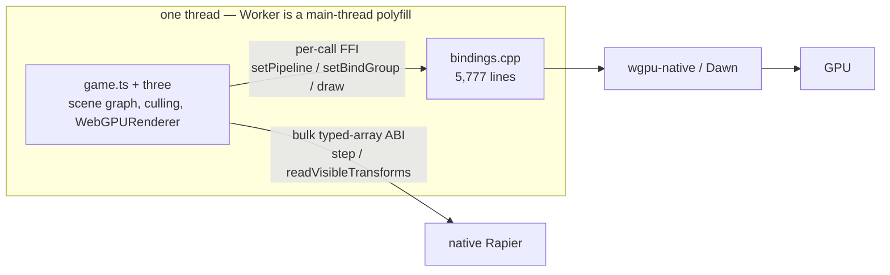

# Native performance bottlenecks — where the time goes once the WebView is gone

2026-08-10. A ranked read of what limits native frame rate now that the host runs without
Chromium, WebView or Electron. **Nothing here is measured.** `docs/G5-profiling.md` is NOT
STARTED, so every row is a hypothesis backed by what the code does, not by a profile. No
optimization lands before a profile names the bottleneck.

> **Superseded in part, same day.** Pixel 8 measurements landed after this file was written and
> they contradict its top ranking: frame time is **not linear in draw count** — there is a knee
> between 500 and 1,000 submitted draws where marginal cost per mesh jumps ~5.6×, and a
> per-crossing tax cannot produce that shape. Read this file as the hypothesis list it says it
> is; the current state of each row lives in `docs/PRDs/native-performance-fixes/` — **PRD-068**
> owns the Android engine, **PRD-069** owns per-draw cost, **PRD-070** owns launch time and
> hitches. Where they disagree with this file, they measured and this file did not.

## The shape of the problem

Removing the WebView removed the *packaging* tax, not the *execution* tax. The JavaScript
runtime still owns `THREE.Scene`, still owns `WebGPURenderer`, and still issues every draw
call. So the ceiling is set by how fast that JavaScript runs and how expensively it reaches
C++ — not by the GPU.

Physics already got this right: one coarse call per frame, typed arrays across the boundary.
Rendering did not — it crosses per command.

## Ranked — easy wins first

🟢 a day or two · 🟡 days to a week · 🔴 weeks · ⛔ not fixable at any price
⭐⭐⭐⭐⭐ = biggest frame-time recovery on the platform named. **Impact is guessed, not
profiled** — which is exactly why the next action is G5 and not a fix.

| Effort | Impact | Bottleneck | Evidence in tree | Platforms | Fixable? | The fix |
|---|---|---|---|---|---|---|
| 🟢 | ⭐⭐⭐⭐ | **Three.js does culling and matrix updates in JS, per object, per frame.** Cost scales with object count on the slowest engine you ship to. | upstream `three` at catalog version; no custom renderer, by design | All, worst on Android/iOS | **Partly** | Instancing, static-transform flags, render bundles — in the game's `src/render/`, never in a package. Zero framework code |
| 🟢 | ⭐⭐⭐ | **Cold start: the whole bundle is parsed as source every launch.** QuickJS supports precompiled bytecode (`JS_ReadObject`); the host only ever calls `JS_Eval`. Plus runtime SWC transpile on the desktop path. | `src/js/quickjs_engine.cpp:210–307`, `src/js/ts_transpiler.cpp` | Android mainly | **Yes, cheaply** | Precompile the bundle to QuickJS bytecode at package time. Launch time only — zero steady-state frame time |
| 🟡 | ⭐⭐⭐⭐⭐ *(challenged — see PRD-069)* | **Per-command JS→C++ FFI for rendering.** `setPipeline`, `setBindGroup`, `draw`, `drawIndexed` are each a JS function call marshalling `std::vector<JSValueHandle>`. A 1,000-draw scene is thousands of boundary crossings per frame, on an interpreter. | `src/webgpu/bindings.cpp:3091–3230` | All, worst on Android/iOS | **Yes** | Lean on the already-bound `RenderBundleEncoder` for static geometry, or add a batched command ABI shaped like the physics one |
| 🟢 | ⭐⭐⭐ | **The marshalling itself, separately from the number of crossings.** Every binding goes through one universal `std::function<…(const std::vector<JSValueHandle>&)>` signature, so each crossing pays a heap vector, a boxed handle per argument and a `getPrivateData` lookup before `wgpu-native` is reached. `beginRenderPass` also rebuilds its encoder wrapper — 13 closures — every call. | `include/mystral/js/engine.h:32`, `src/webgpu/bindings.cpp:3087–3330` | All, worst on Android/iOS | **Yes** | Fixed-arity entry points for the hot commands and an integer handle table. Much cheaper than a batched ABI, and it must be priced first or our own convenience layer gets billed to "the boundary" — PRD-069 §3.4 |
| 🟡 | ⭐⭐⭐ | **First-frame shader hitches.** TSL/node materials build WGSL in JavaScript, then wgpu compiles the pipeline, on demand, mid-frame. | upstream `WebGPURenderer`; no pipeline cache in `src/webgpu/context.cpp` | All | **Yes** | Persisted pipeline cache plus a warm-up pass. Kills hitches, not average frame time |
| 🔴 | ⭐⭐⭐⭐⭐ | **QuickJS has no JIT.** Every frame's scene-graph walk, matrix math and renderer bookkeeping runs bytecode-interpreted. | `src/js/quickjs_engine.cpp` — `JS_Eval` only | Android | **Yes, expensively** | Host V8 on Android; `src/js/v8_engine.cpp` already exists for desktop. Costs an arm64/x86_64 build lane, binary size, startup memory |
| 🔴 | ⭐⭐⭐ | **Everything is on one thread.** `Worker` is a polyfill that runs worker code on the main thread; there is no JobSystem. Only file I/O and image decode use the libuv pool. | `src/runtime.cpp:2493`, `:2625`; `docs/G4-*.md` marks the thread model still owed | All | **Yes** — already an open gate, not new debt | Build the owed worker/thread model and JobSystem. Payoff depends entirely on what the game does off the render path |
| ⛔ | — | **iOS JSC is interpreter-only.** Apple grants the JIT entitlement to WKWebView, not to embedded JavaScriptCore. Swapping engines does not help — no third-party engine gets JIT on iOS either. | `src/js/jsc_engine.mm` | iOS | **No JIT, ever.** But see the row below | Design around it — the mitigations are the rows above |
| 🔴 | ⭐? | **The interpreter ceiling assumes the JavaScript is interpreted at all.** Static Hermes compiles JS ahead of time to native code, which needs no JIT entitlement from anyone — so *"no JIT"* and *"no fast execution"* are not the same statement. Unmeasured research tooling; the gain on untyped, megamorphic Three.js code is the open question, not the compiler's existence. | none — nothing in this tree uses it | Android + iOS | **Unknown.** A feasibility spike, not a plan | Compile the bundle with `shermes` on desktop, benchmark scene traversal, close the branch if untyped JS gains little — PRD-068 §4.3a |

### When to reach for each

| Do this | When |
|---|---|
| 🟢 Instancing / render bundles in game source | Per game, whenever a scene gets heavy |
| 🟢 Bytecode precompile | Now. Cheapest real win, and launch time needs no profile to observe |
| 🟡 Batch the render FFI | After a profile confirms boundary cost dominates |
| 🟡 Pipeline cache | When hitches are the complaint, not average FPS |
| 🔴 V8 on Android | Only if a profile shows interpreter cost, not FFI cost, dominates |
| 🔴 Thread model | It is an owed gate anyway; schedule as G4, not as an optimization |

## What this means in one line per platform

- **Desktop (V8 + Dawn):** render FFI, threading and shader hitches dominate. Nothing
  structural blocks good numbers.
- **Android (QuickJS + wgpu-native):** the missing JIT, the render FFI and cold start
  dominate, and they compound — an interpreter paying per-call FFI is the worst combination
  on the list.
- **iOS (JSC + wgpu-native):** the interpreter-only floor is one nobody can lift. Batching
  the boundary and cutting per-object JS work are the only levers, which makes them worth
  more here than anywhere else.

## The honest caveat

Desktop and the iOS simulator execute. The Android emulator is red on the hosted lane.
Physical hardware and performance parity are open, and an emulator or simulator number is
not phone-performance evidence. Nothing above should be treated as a measurement until a
profile names the target, hardware, scene, build and sample duration.

## Next action

Do the bytecode precompile or start G5 profiling — not both at once, and nothing 🟡 or 🔴
before a profile exists.
