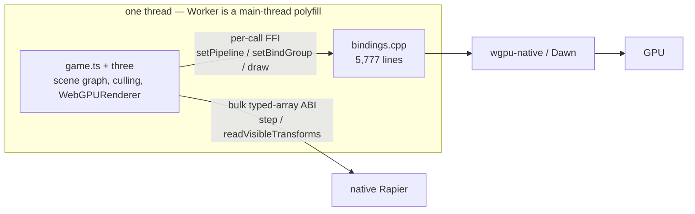

# Native performance bottlenecks — where the time goes once the WebView is gone

2026-08-10. A ranked read of what limits native frame rate now that the host runs without
Chromium, WebView or Electron. **Most rows remain unmeasured.** G5 profiling is in progress;
PRD-068 measured the six hot render-command bindings while PRD-069 measured a nonlinear
draw-count knee. Every other row remains a hypothesis backed by what the code does. No
optimization lands before a profile names the bottleneck.

> **Superseded in part, same day.** Pixel 8 measurements landed after this file was written and
> they contradict its top ranking: frame time is **not linear in draw count** — there is a knee
> between 500 and 1,000 submitted draws where marginal cost per mesh jumps ~5.6×, and a
> per-crossing tax cannot produce that shape. Read this file as the hypothesis list it says it
> is; the current state of each row lives in `docs/PRDs/native-performance-fixes/` — **PRD-069**
> owns per-draw cost, **PRD-070** owns launch time and hitches, **PRD-071** bundles the fixes that
> need no profile — plus two now archived in `docs/PRDs/done/`: **PRD-068** (the Android engine)
> and **PRD-072** (fixed-arity bindings). Where they disagree with this file, they measured and
> this file did not. The stack those fixes would eventually add up to — JS shim, command stream,
> render thread — is evaluated layer by layer in
> [`NATIVE-RENDER-TRANSPORT.md`](NATIVE-RENDER-TRANSPORT.md).

> **Where it actually landed, 2026-08-16.** Two answers arrived after this file and outrank every
> row in it. **The cost is interpreted JavaScript per object, not the boundary** — the render
> bindings measure ~2% of a CPU-bound frame — so `SceneCollapse` (`packages/core/src/collapse.ts`)
> removes the per-object work instead of speeding up the crossing. And the **engine** was worth
> more than any of it: PRD-118 swapped Android's QuickJS for V8 and cut script time 22× on a
> Pixel 8. The current numbers, against Godot 4.7.1 on three platforms, are in
> [`../verification/engine-load-test-summary-2026-08-15.md`](../verification/engine-load-test-summary-2026-08-15.md).

## The shape of the problem

Removing the WebView removed the *packaging* tax, not the *execution* tax. The JavaScript
runtime still owns `THREE.Scene`, still owns `WebGPURenderer`, and still issues every draw
call. So the ceiling is set by how fast that JavaScript runs and how expensively it reaches
C++ — not by the GPU.

Physics already got this right: one coarse call per frame, typed arrays across the boundary.
Rendering did not — it crosses per command.

## Ranked — easy wins first

🟢 a day or two · 🟡 days to a week · 🔴 weeks · ⛔ not fixable at any price
⭐⭐⭐⭐⭐ = biggest frame-time recovery on the platform named. **Impact is guessed, not
profiled** — which is exactly why the next action is G5 and not a fix.

| Effort | Impact | Bottleneck | Evidence in tree | Platforms | Fixable? | The fix |
|---|---|---|---|---|---|---|
| 🟢 | ⭐⭐⭐⭐ | **Three.js does culling and matrix updates in JS, per object, per frame.** Cost scales with object count on the slowest engine you ship to. | upstream `three` at catalog version; no custom renderer, by design | All, worst on Android/iOS | **Partly** | Instancing, static-transform flags, render bundles — in the game's `src/render/`, never in a package. Zero framework code |
| 🟢 | ⭐⭐⭐ | **Cold start: the whole bundle is parsed as source every launch.** QuickJS supports precompiled bytecode (`JS_ReadObject`); the host only ever calls `JS_Eval`. Plus runtime SWC transpile on the desktop path. | `src/js/quickjs_engine.cpp:210–307`, `src/js/ts_transpiler.cpp` | Android mainly | **Yes, cheaply** | Precompile the bundle to QuickJS bytecode at package time. Launch time only — zero steady-state frame time |
| 🟡 | ⭐ *(measured for one shared-material subject)* | **The six hot render-command bindings are not the dominant cost in the measured subject.** `setPipeline`, `setBindGroup`, `draw`, `drawIndexed`, `setVertexBuffer` and `setIndexBuffer` together consumed roughly 2% of the physical Pixel 8 frame in PRD-068. This does not price every binding or every material shape. | `src/webgpu/bindings.cpp`; PRD-068 §1.2 | Android measurement; other targets unmeasured | **Yes, but small in this subject** | Keep counting varied-material calls and price fixed-arity marshalling before any batched ABI; perfect removal of the measured term recovers only about half a millisecond |
| 🟢 | ⭐ *(closed — inside the measured 2%)* | **The marshalling itself, separately from the number of crossings.** Every binding goes through one universal `std::function<…(const std::vector<JSValueHandle>&)>` signature, so each crossing pays a heap vector, a boxed handle per argument and a `getPrivateData` lookup before `wgpu-native` is reached. `beginRenderPass` also rebuilds its encoder wrapper — 13 closures — every call. | `include/mystral/js/engine.h:32`, `src/webgpu/bindings.cpp:3087–3330` | All, worst on Android/iOS | **Yes, and not worth it** | **PRD-072 is CLOSED UNIMPLEMENTED.** The marshalling sits *inside* the 2% measured above, so fixed-arity entry points can recover only a slice of it — too little to fund a second calling convention across three engine adapters. Reopens only if a varied-material subject puts the six bindings above ~10% of frame. The per-frame wrapper rebuild survives as a cleanup in PRD-071 §3.3 |
| 🟡 | ⭐⭐⭐ | *(retained for the record; PRD-070 found the persisted-cache half unreachable)* **First-frame shader hitches.** TSL/node materials build WGSL in JavaScript, then wgpu compiles the pipeline, on demand, mid-frame. | upstream `WebGPURenderer`; no pipeline cache in `src/webgpu/context.cpp` | All | **Yes** | Persisted pipeline cache plus a warm-up pass. Kills hitches, not average frame time |
| 🔴 | ⭐⭐⭐⭐⭐ *(hypothesis; attribution incomplete)* | **QuickJS has no JIT.** The measured six-binding term is small, but the current repeatable artifact still labels the remainder `javascriptAndUninstrumented`: it has not separated JavaScript execution from all other native work. No candidate engine has a device number. | `src/js/quickjs_engine.cpp` — `JS_Eval` only; `packages/runtime-native/docs/G5-profiling.md` | Android | **Yes, expensively** | Finish the physical split, then price V8, JSC, Hermes and tuned QuickJS against the same bundle. A branch with no device number remains UNMEASURED |
| 🔴 | ⭐⭐⭐ | **Everything is on one thread.** `Worker` is a polyfill that runs worker code on the main thread; there is no JobSystem. Only file I/O and image decode use the libuv pool. | `src/runtime.cpp:2493`, `:2625`; `docs/G4-*.md` marks the thread model still owed | All | **Yes** — already an open gate, not new debt | Build the owed worker/thread model and JobSystem. Payoff depends entirely on what the game does off the render path |
| ⛔ | — | **iOS JSC is interpreter-only.** Apple grants the JIT entitlement to WKWebView, not to embedded JavaScriptCore. Swapping engines does not help — no third-party engine gets JIT on iOS either. | `src/js/jsc_engine.mm` | iOS | **No JIT, ever.** But see the row below | Design around it — the mitigations are the rows above |
| 🔴 | ⭐? | **The interpreter ceiling assumes the JavaScript is interpreted at all.** Static Hermes compiles JS ahead of time to native code, which needs no JIT entitlement from anyone — so *"no JIT"* and *"no fast execution"* are not the same statement. Unmeasured research tooling; the gain on untyped, megamorphic Three.js code is the open question, not the compiler's existence. | none — nothing in this tree uses it | Android + iOS | **Unknown.** A feasibility spike, not a plan | Compile the bundle with `shermes` on desktop, benchmark scene traversal, close the branch if untyped JS gains little — PRD-068 §4.3a |

### When to reach for each

| Do this | When |
|---|---|
| 🟢 Instancing / render bundles in game source | Per game, whenever a scene gets heavy |
| 🟢 Bytecode precompile | Now. Cheapest real win, and launch time needs no profile to observe |
| ~~🟢 Fixed-arity hot bindings~~ | **Closed.** Inside the measured 2%; reopens only above ~10% of frame on a varied-material subject — PRD-072 §11 |
| ~~🟡 Batch the render FFI~~ | **Demoted by measurement.** Perfect removal recovers ~0.5 ms of a 22–29 ms frame on the measured subject. Not a first move on any evidence we have |
| 🟡 Pipeline cache | When hitches are the complaint, not average FPS |
| 🔴 V8 on Android | Only if a profile shows interpreter cost, not FFI cost, dominates |
| 🔴 Thread model | It is an owed gate anyway; schedule as G4, not as an optimization |

## What this means in one line per platform

- **Desktop (V8 + Dawn):** render FFI, threading and shader hitches dominate. Nothing
  structural blocks good numbers.
- **Android (QuickJS + wgpu-native):** the missing JIT, the render FFI and cold start
  dominate, and they compound — an interpreter paying per-call FFI is the worst combination
  on the list.
- **iOS (JSC + wgpu-native):** no JIT is available and nobody can lift that. Cutting per-object
  JS work and making the boundary cheaper are the levers that exist today, which makes them
  worth more here than anywhere else. The one idea that would sidestep the floor rather than
  work around it is AOT-compiling the bundle so nothing hot is interpreted — unmeasured, and
  filed as a spike in PRD-068 §4.3a rather than a plan.

## The honest caveat

Desktop and the iOS simulator execute. The Android emulator is red on the hosted lane.
Physical hardware and performance parity are open, and an emulator or simulator number is
not phone-performance evidence. Nothing above should be treated as a measurement until a
profile names the target, hardware, scene, build and sample duration.

## Next action

**Overtaken by events, and left here so the change of direction is visible.** This file said
"do the bytecode precompile or start G5 profiling". Profiling started, and it did two things to
this document: it found a knee that none of the rows above predicts, and it measured the
top-ranked row at **~2% of frame** — retiring it rather than re-ranking it.

The next action is no longer at the boundary. It is to finish the attribution split PRD-068 §1.2
started, so the remaining ~98% stops being labelled `javascriptAndUninstrumented` and starts
naming which JavaScript. Alongside it, PRD-069 Phase 0 still owes the threshold: locate it
between 500 and 1,000 draws and rule out thermal/DVFS first. **Nothing 🟡 or 🔴 above starts
before those return**, and two rows above are now closed rather than waiting.
