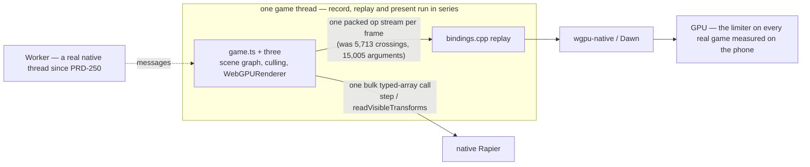

# Native performance — where the frame time goes

**Current as of 2026-09-02.** The budget below was measured before PRD-227 Change 1 landed; it is
kept because the shares explain why the seam was attacked. **Since then the frame crosses once,
desktop `bridgeNs` fell 9.31 → 0.81 ms, and the phone's frame rate did not move** — the frame on a
real game is GPU-bound (720p: CPU chain 9.3 ms, GPU 18–19 ms; see
[runtime-perf-state](../verification/runtime-perf-state.md) §1.3.2). The work that is worth doing
now, in order, is in [`docs/PRDs/performance/critical/README.md`](../PRDs/performance/critical/README.md).
**V8 is the default on desktop and Android** (`-PthreenativeJsEngine=quickjs` survives only as the
rollback), so every row that once blamed a missing JIT is history.

## The budget

**Desktop, profiled Xvfb lane, 619 eligible frames** (`work = threadCpu − present` = 23.9 ms/frame,
[PATH-TO-60FPS](../verification/runtime-perf-state.md)):

| Term | ms | Share | Instrument |
|---|---:|---:|---|
| JavaScript + non-bridge render-thread work | 14.77 | 61.8% | `work − bridgeNs` |
| Bridge marshalling + handle churn | 3.79 | 15.8% | `bridgeOverheadNs` |
| In-handler work (arg parse, wrapper create) | 3.32 | 13.9% | derived by subtraction |
| Backend commands (wgpu) | 2.04 | 8.5% | `commandNs` |
| **Bridge total** | **7.11** | **29.7%** | overhead + in-handler |

Per frame: **5,713 crossings, 15,005 marshalled arguments.**

PRD-226's ablation ladder splits the same frame independently — **backend command recording plus its
GPU work is 17%, JavaScript + bridge is 83%** — and its backend term (1.95 ms) lands **0.09 ms** from
`commandNs` (2.037 ms). Two unrelated mechanisms agreeing is what makes this a measurement rather
than a definition.

**Quote the shares, not the absolute ms.** The ablation's absolutes were taken on `:0`, which a
sibling lane voided in favour of Xvfb, and the machine has drifted since: PRD-224's same-session
control arm reads **12.3–12.5 ms** `render.p50` today where 22.2 ms was recorded a day earlier
([record](../verification/runtime-perf-state.md)). Any A/B here must be a
**same-session pair**; cross-day desktop absolutes mean nothing.

**Pixel 8, Bayview, symbolized simpleperf, 37.7 ms/frame:**

| Term | ms | Fate under the fix |
|---|---:|---|
| JavaScript actually running three.js | 10.1 | stays |
| V8 machinery around it | 12.8 | removed |
| Bridge dispatch + backend | 8.1 | mostly removed |
| `libc`/scudo allocator churn | 4.3 | mostly removed |
| Mali driver | 2.3 | stays |

**The seam is 22.3 ms of that 37.7** — per-crossing V8 scaffolding, bridge dispatch, allocator
churn, and the megamorphic inline caches our dynamically-shaped wrappers force on three.js. The
device split is inherited from one profile on a Bayview build that is not today's.

> **Corrected 2026-09-02.** This paragraph used to end *"Chrome runs the same three.js on the same
> phone at 59.99 fps. The JavaScript is not the problem; what surrounds it is."* **Both halves are
> withdrawn.** The 59.99 fps figure was PRD-222 Phase 0's, and it is falsified — by rAF plus
> SurfaceFlinger on the same phone, Chrome runs Bayview at **~30 fps at 864×303** while native runs
> it at ~20 fps at 2400×1080, and the record states that **no matched parity claim remains**
> ([runtime-perf-state](../verification/runtime-perf-state.md) §1.0, §5, and the §8 index row for
> `prd-222-2026-08-25.md`). The inference drawn from it is refuted independently: PRD-227 Change 1
> removed the seam (desktop `bridgeNs` 9.31 → 0.81 ms) and the device read **20.02 fps against
> 20.39** — if the surround had been the problem, deleting it would have moved the frame.
> The matched-pixel comparison that would settle the question has still never been run; it is
> PRD-329.

The device meter was audited against `dumpsys SurfaceFlinger --latency` and agrees within 2%: the
game truly runs at ~20 fps. **`dumpsys gfxinfo` reads ~5× flattering** because it meters the Skia
view pipeline a `SurfaceView` game bypasses; do not quote it.

## The shape of the problem

Removing the WebView removed the *packaging* tax, not the *execution* tax. JavaScript still owns
`THREE.Scene`, still owns `WebGPURenderer`, and still issues every draw.

Physics got this right: one coarse crossing per frame, typed arrays across the boundary. Rendering
was the outlier; [PRD-227](../PRDs/performance/PRD-227-the-frame-crosses-once.md) Change 1 made it
cross once (landed and accepted) — the design is in [NATIVE-RENDER-TRANSPORT](NATIVE-RENDER-TRANSPORT.md).

## Open, ranked

🟢 a day or two · 🟡 days to a week · 🔴 weeks · ⛔ not fixable at any price

| Effort | Bottleneck | Where | Status |
|---|---|---|---|
| — | **The seam — was 22.3 ms of 37.7 on device.** Change 1 (the frame crosses once) landed and was accepted: desktop `bridgeNs` 9.31 → 0.81 ms, work −40 %; **device fps did not move** (20.39 → 20.02). Change 2 (fixed-shape wrappers) was executed and measured **worse than baseline** — the megamorphic-IC owner is three's node-material graph, which Chrome pays too | PRD-227, ledger §2.1 rows 12–13 | **Closed as a frame-rate lever.** The seam was real and is gone; the frame rate was never seam-bound. Do not re-open without a new device profile |
| 🟡 | **Launch: 12–14 s of synchronous first-frame pipeline compilation** behind the loading screen (8,038 ms across 105 compiles on Bayview); `createRenderPipelineAsync` is the synchronous call in a resolved promise, so warm-up compiles nothing on native | [PRD-327](../PRDs/performance/critical/PRD-327-first-use-pipeline-compilation-leaves-the-main-loop.md) | **Mechanism landed 2026-09-03** (§5a): the async entry holds the main thread 0.27 ms of a 70 ms compile; Phase 4 names a late sync compile inside `TN_FRAME_HITCH` (`pipelineCompileMs/Calls`, read by `playtest perf`); desktop second-launch compile is 77 % of the first on three tiny pipelines — noise, not a decision. **The launch claim (≤ 8 s median) is still unmade**: the phone arm owes the device acceptance and the cache decision |
| 🟡 | **The phone's GPU frame has never been compared to Chrome's at matched pixels** — every prior comparison mixed a 2400×1080 native buffer against ~864×303 CSS pixels | [PRD-329](../PRDs/performance/critical/PRD-329-the-native-gpu-frame-matches-chrome-at-matched-pixels.md) | Filed 2026-09-02; decides whether the runtime owns any of the GPU term before content LOD work starts |
| 🟢 | **Per-object JS work in three.js.** ~11.3 µs of CPU per drawn object against Godot's ~5.3 µs, all of it inside three.js's WebGPU submission path — upstream, not framework plumbing | the game's `src/render/`: instancing, LOD, merged geometry. `SceneRenderProjection` (`packages/core/src/renderProjection.ts`) mirrors an authored scene into instanced draws without consuming it | Permanent lever. Submitting fewer objects is the only thing that has ever moved this term |
| 🟢 | **Cold start: the bundle is parsed as source every launch.** Measured under V8 as of 2026-09-03 (PRD-328): the compile/execute markers now fire in V8, JSC and the desktop CLI, and `pnpm native:verify:desktop` fails when one goes missing. Desktop V8 13.1, `native-smoke`, five launches: parse+compile **51 ms (9.7 %)**, top-level execution 45 ms (8.6 %), launch 524 ms. The Pixel 8 process-cold median is compile **54.1 ms (10.4 %)** of 519 ms, with runtime creation at 1,635 ms (69.1 %) of the genuinely cold launch. (SWC transpiles only `.ts` sources in `module_system.cpp`; a packaged bundle is `.js` and never goes through it) | [PRD-328](../PRDs/done/PRD-328-launch-is-measured-on-the-engine-that-ships.md), `src/js/v8_engine.cpp`, `docs/verification/runtime-perf-state.md` §5b | Instrument landed. The pre-registered code-cache rule tripped on the phone's 10 % limb; [PRD-335](../PRDs/performance/PRD-335-the-bundle-is-not-parsed-as-source-twice.md) is filed and ranked below runtime creation. The native-smoke launch was provisional on AC and is not an fps claim |
| 🔴 | **Record, replay and present run in series on one game thread.** `Worker` is a real native thread since PRD-250 (web + Linux desktop verified; mobile `UNVERIFIED`); what is missing is a render thread that replays frame N while JS records N+1, and a job system | `src/runtime.cpp`, `bindings_frame_stream.cpp` | Gated by the direction document: overlapping threads cannot beat an 18–19 ms GPU frame. File only after PRD-329's verdict and PRD-308's per-pass numbers |
| ⛔ | **iOS JSC is interpreter-only.** Apple grants the JIT entitlement to WKWebView, not to embedded JavaScriptCore, and no third-party engine gets it either | `src/js/jsc_engine.mm` | Unfixable. The one sidestep is AOT — compile the bundle with `shermes`, benchmark scene traversal, close the branch if untyped JS gains little. A spike, not a plan |

## Where we already stand against Godot 4.7.1

Instanced rendering is a win on all three platforms and unbatched per-object rendering is a loss
([summary](../verification/runtime-perf-state.md), scorer equivalence gate PASS):

| Platform, instanced | ThreeNative p50 | Godot p50 | Margin |
|---|---:|---:|---:|
| Web, 65 536 | 17.9–20.3 ms | 65.8–67.8 ms | 3.5× |
| Desktop, 65 536 | 13.85 ms | 39.70 ms | 2.9× |
| Pixel 8, 65 536 | 12.51 ms | 40.02 ms | 3.2× |

The loss is web L1 — one `Mesh` per cube, no batching on either side — where the knee is 1,024
against Godot's 4,096 and the frame-time gap is 1.45–1.55×. That is three.js issuing draw calls in
JavaScript, not a framework defect and not a renderer bug; flipping the knee needs ~25–30% off.

## Closed, with evidence

- **QuickJS had no JIT.** The largest item on this list for months, closed by one build flag rather
  than a transport rewrite: **8.34 ms against QuickJS's 101.24 ms** at 16,384 cubes on a Pixel 8,
  and V8 has been the Android default since PRD-130
  ([record](../verification/prd-130-phase-6-2026-08-16.md)). Held still at 4,096 collapsed cubes,
  only the engine differing: 20.01 ms → **8.31 ms**. iOS stays JSC by construction, so this closes
  nothing there.
- **Fixed-arity hot bindings (PRD-072)**, closed unimplemented on the ~2% reading described below.
  The same target returned as PRD-227 Change 2, priced off the whole seam instead of a slice —
  and was **measured worse than baseline** (ledger §2.1 row 12). Closed twice.
- **The draw-count knee (PRD-069).** Re-measured under V8 on the Pixel 8 (2026-08-21): frame time
  is flat ~4.0 ms from 100 through 1,000 scene objects and linear at ≈ 0.70 µs/object beyond.
  The historical 5.6× step was a QuickJS artefact on a frustum-culled subject whose x-axis was
  never draws. Do not re-hunt it.
- **The seam as a frame-rate lever (PRD-227).** Change 1 removed it (desktop `bridgeNs`
  9.31 → 0.81 ms) and the device read 20.02 fps against 20.39. The remaining frame is GPU work
  plus the ~8 ms native replay on the phone; neither is a crossing cost.

## Levers that were spent and did not move the frame

Worth reading before proposing the next one — each was locally correct and globally irrelevant:

| Lever | What it did | Frame effect |
|---|---|---|
| **PRD-224** binding tables installed once per class | `createCommandEncoder` **31–34× faster** per call (30.4 µs → 0.9 µs, Chrome parity); `beginRenderPass+end` 8.2–8.7× | **NO-MOVE** — +0.50/+0.59 ms across two matched pairs, inside noise. Only ~6 calls/frame use those classes |
| **F12** batched render pass | removed 1,900 of 5,713 crossings (33%), encoder subset only | predicted ~4%, **measured +5% slower** |
| **A2** null backend | removed the backend entirely | 1.95 ms of 11.21 — the ceiling on all backend work |

The pattern: **per-call speed is not frame time, and a partial cut of the seam pays the cost of both
paths.** PRD-227 refuses to ship half for exactly this reason.

## The record — what was believed, and what corrected it

This file began on 2026-08-10 as a hypothesis list ranking a per-crossing tax first. PRD-068 §1.2
demoted it: the six hot render commands timed on a Pixel 8 came to ~2% of frame, and every layer of
transport work was declined on that number.

**That instrument was too narrow.** It measured time *inside* six native handlers. The trampoline
that gets each call from JavaScript into C++, the per-crossing V8 API work, the allocator churn and
the JS-side inline-cache tax all sat outside it. PRD-226 measured the seam whole and reinstated it.

The lesson worth keeping: **pricing a slice of the seam is not a price for the seam.**

## Next action

**Gate P1 of PRD-227 ran (2026-08-27) and the model was wrong in exactly the way the gate
anticipated:** `bridgeNs` collapsed (9.31 → 0.81 ms), `work` fell 23.19 → 14.32 ms on desktop, and
the phone stayed at 20 fps. Change 2 died with it, and was then executed anyway and measured
worse. The frame is GPU-bound on every real game measured since.

The next action is **step 2 of
[`docs/PRDs/performance/critical/README.md`](../PRDs/performance/critical/README.md)** — the
launch stall (PRD-327), then the matched-pixel GPU comparison (PRD-329). Nothing 🔴 above starts
before PRD-329's verdict.

## The caveat that outlives every row

Desktop and the iOS simulator execute; one physical Pixel 8 carries every device number here. An
emulator or simulator result is not phone-performance evidence, and no row is a measurement until a
record names the target, hardware, scene, build and sample duration.
