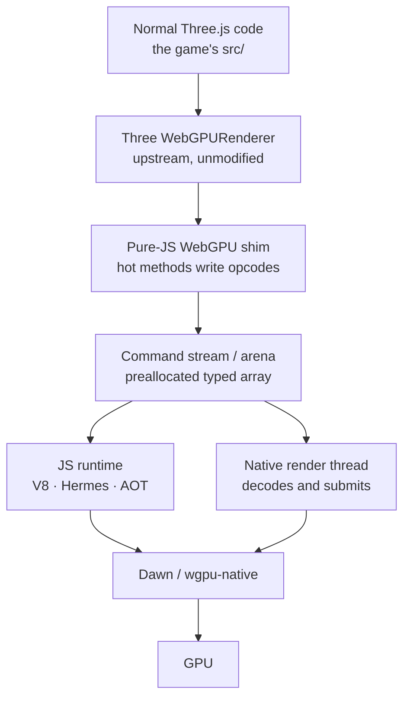
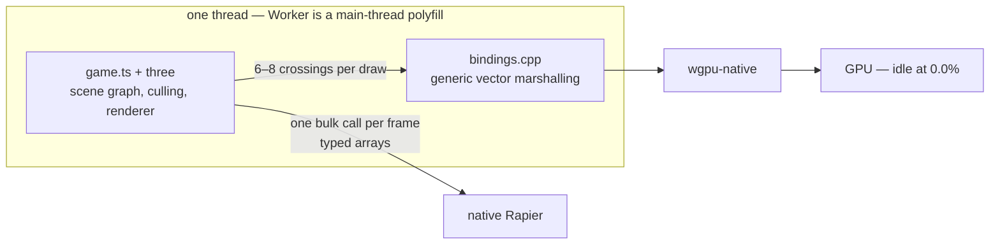
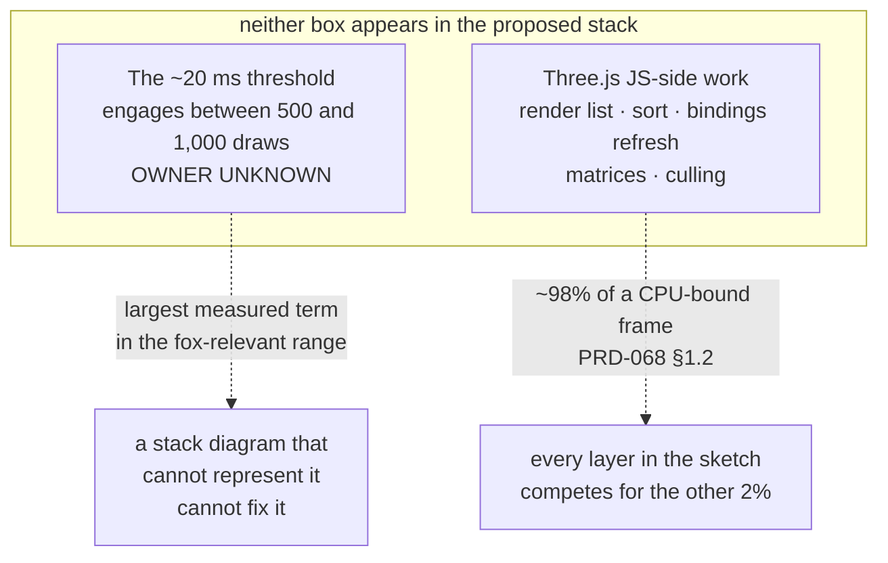
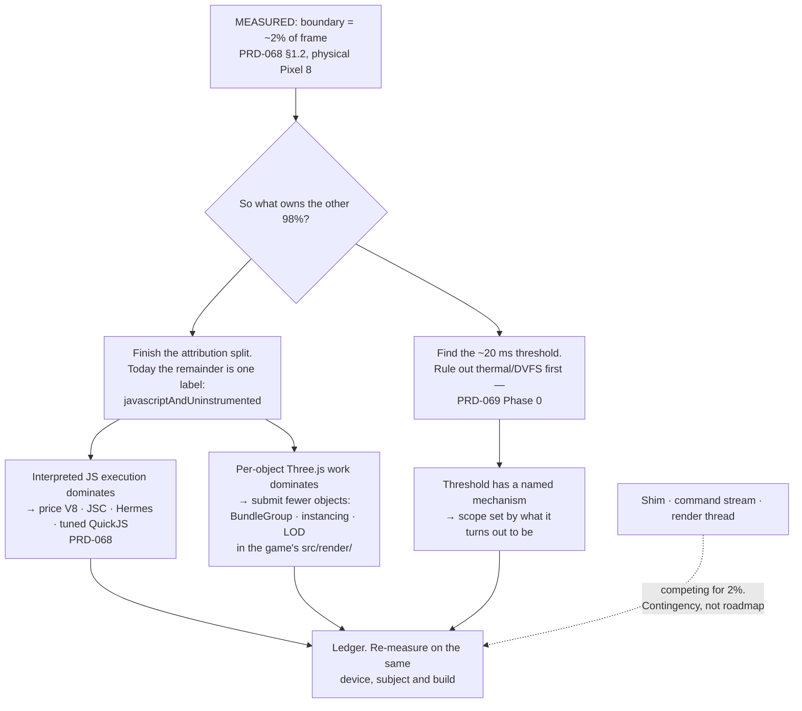

# The proposed native render transport — the stack, layer by layer, and where I disagree

2026-08-10. **Evaluated and declined as a roadmap; kept as a contingency.** It documents an
architecture sketched in review — Three.js unchanged on top, a pure-JS WebGPU shim beneath it,
a command stream into native, a separate render thread, and an AOT-compiled JS runtime — and
gives a verdict on each layer against what this repository has actually measured.

The one-line summary: **the top of the stack is right and mostly already true, the middle is now
measured small, and the bottom two layers are not supported by any evidence we have.** A stack
diagram is a claim about where time goes, and the largest term we have measured does not appear
anywhere in this one.

**The number that decides most of this page, added after it was first written.** PRD-068 §1.2
put a per-crossing timer on the six render-command bindings and ran it on a physical Pixel 8:
**all time inside them is ~2% of a CPU-bound frame** — 0.21–0.38 ms of a 22–29 ms frame. The
middle three layers of the proposed stack exist to reduce that 2%. The other ~98% is
JavaScript-side work in Three.js — render-list build and sort, node and binding refresh,
per-object matrix updates and culling — and **no layer in this diagram touches it.**

**What did touch it, added 2026-08-16.** One layer of this sketch was right and is now built,
and it is not one of the three middle ones: the **JS runtime**. PRD-118 put V8 behind
`-PthreenativeJsEngine=v8` on Android and script time fell 22× on the same Pixel 8. The other
answer came from outside the stack entirely — `SceneCollapse` deletes the per-object JavaScript
work rather than transporting it faster. Both are cheaper than a shim, a command stream and a
render thread, and together they are why this page stays declined.

## The sketch, as proposed

The appeal is real and worth stating before the objections: **Three.js never learns that any of
this happened.** `GPURenderPassEncoder.setPipeline` still exists and still behaves; it just
stops being a native function and becomes a few lines of JavaScript writing into a buffer. That
preserves the upstream renderer, which is the constraint that rules out most engine-shaped
answers to this problem.

## What exists today, for comparison

Measured on a Pixel 8 on 2026-08-10: `examples/native-smoke` at 2,000 visible meshes runs at
95.18 ms/frame with the GPU idle and one CPU thread saturated. Frame time is **not linear in
draw count** — there is a knee between 500 and 1,000 draws where marginal cost per mesh jumps
~5.6×. Details and caveats live in `docs/PRDs/native-performance-fixes/PRD-069-per-draw-cost.md`.

## Layer by layer

### 1. Normal Three.js code on top

**What it means.** Games write `three` — meshes, materials, TSL — and nothing framework-shaped
intrudes between the game and the renderer.

**Status: already true, and permanently so.** This is not a layer to build; it is the constraint
every other layer has to survive. Anything below it that changes what a scene looks like, or
what gets drawn, has broken the thing the stack exists to protect.

**Verdict: agree, and it is the test for every layer beneath.**

### 2. Upstream `WebGPURenderer`, unmodified

**What it means.** No forked renderer, no custom render path, no patched `three`. The pinned
`three@0.185.1` is the renderer, on web and native alike.

**Status: already true.** It is also the reason the layer below is interesting at all — a shim
is worth building precisely because it does not require touching this.

**Verdict: agree. This is the load-bearing constraint of the whole design.**

### 3. Pure-JS WebGPU shim

**What it means.** The hot `GPURenderPassEncoder` methods stop being C++ bindings and become
small JavaScript functions that append to a buffer. Resource creation — anything that returns a
value Three.js needs immediately — stays a conventional native call.

**Why it works structurally.** The object Three.js receives from `beginRenderPass()` is already
ours; the host constructs it in `bindings.cpp`. So the swap is invisible to the renderer by
construction, not by luck.

**The condition nobody should skip.** The appenders must be *JavaScript*. If they are native
functions writing into a buffer, the crossings are all still there and the entire win is
imaginary. That sounds obvious written down and is easy to get wrong in code.

**Verdict: agree it is the right shape — and the profile has now priced what that shape is
worth.** Removing *every* crossing perfectly recovers ~0.5 ms of a 22–29 ms frame on the
measured subject. That is not a first move, a second move, or a third. It is `PRD-069 §3.2`,
and it stays unbuilt until a subject exists where the boundary is worth more than that.

### 4. The command stream / arena

**What it means.** A preallocated typed array holding `(opcode, args…)` tuples, flushed to
native once or a few times per frame. GPU objects become integer ids so the buffer holds numbers
rather than object references.

**The precedent is real.** Physics already works exactly this way — `step()` and
`readVisibleTransforms(Float32Array)`, one coarse crossing per frame, typed arrays across the
boundary, never per-object. Rendering is the outlier, not the pioneer.

**What it costs, and these are the parts that make it weeks rather than days:**

- A handle table for every GPU object, with a lifetime story. Getting it wrong is a
  use-after-free, not a wrong pixel.
- **Complete opcode coverage or a loud failure.** Partial coverage that silently drops a command
  is the fail-open failure mode this repository was built to avoid — a frame that renders almost
  correctly and reports success.
- Native LOC against a review trigger that is already crossed.

**Verdict: agree as a candidate, and the candidacy is now weak.** The physics precedent is real
and the design is sound; the win it is competing for has been measured at ~2% of frame. Paying a
handle-lifetime story and a complete-opcode contract for a slice of 2% is a bad trade, and the
honest reading of the measurement is that this layer stops being a plan and becomes a
contingency — one that a varied-material subject could revive, and nothing else can.

**One caveat that keeps this from being over-claimed.** The measured subject shares one geometry
and one material — about 1.8 crossings per mesh. A game with varied materials crosses more often
per draw. PRD-068 §1.2's own arithmetic says even at **four times** the crossing count the
boundary stays under 10% of frame, which is why 2% is a floor for that subject shape rather than
a universal figure, and why the verdict is "weak candidate" rather than "dead".

### 5. The JS runtime — V8 / Hermes / AOT

**What it means.** Swap QuickJS on Android for something faster, and possibly compile the bundle
ahead of time to native code so nothing hot is interpreted at all.

**Status: the swap is DONE, and it was the largest win in this document.** PRD-118 measured V8 at 22×
less script time on a Pixel 8 and **PRD-130 made V8 the Android default on 2026-08-16** — 8.34 ms
against QuickJS's 101.24 ms at 16,384 cubes, a 12× lower bound, with the rollback exercised on the
same phone ([`prd-130-phase-6`](../verification/prd-130-phase-6-2026-08-16.md)).

**Read that against the rest of this document.** Every transport layer below was proposed while "the
interpreter is the problem" was a conclusion by elimination. It turned out to be the answer, and it
was reached by changing one build flag rather than by building any of these layers. The AOT half —
Static Hermes and friends — remains unexplored, and iOS is still JSC by construction, so that part of
this row is genuinely open. Static Hermes AOT is filed there too, as the one idea that could make the iOS
no-JIT rule stop being the binding constraint — and as research tooling with three unchecked
prerequisites, not a plan.

**Verdict: agree it belongs in the picture. Disagree with drawing it as a chosen layer.** The
engine is a variable this stack is measured *against*, not a component of it.

### 6. The native render thread

**What it means.** JS records frame N+1 into one arena while a native thread decodes and submits
frame N from another, with triple-buffered arenas so neither waits on the other.

**Why I disagree, on the numbers we have.** The whole 95 ms lives on the JavaScript thread and
the GPU sits at 0.0%. Moving native submission onto its own thread hides the native encode
share — which every reading so far says is small, and which PRD-069 Phase 0 exists to size. You
cannot parallelise away work that is not on the critical path.

Two further points against it as a *near-term* item: it cannot start before layer 4 exists,
because there is no frame packet to hand across; and the thread model is an owed correctness
gate in its own right — `Worker` is currently a main-thread polyfill — which should not be
smuggled in as a performance optimisation.

**Verdict: disagree for now.** Revisit if Phase 0 shows native-side work is a large term. Build
the thread model because it is owed, not because it is fast.

### 7. Dawn / wgpu-native → GPU

**Status: already true, and not where the time is going.** Every measurement so far has the GPU
idle. This layer is not the problem on any subject we have run.

**Verdict: agree, trivially.**

## Verdict table

| Layer | Verdict | Why |
|---|---|---|
| Normal Three.js code | **Agree** | Already true; it is the constraint, not a build item |
| Upstream `WebGPURenderer` | **Agree** | Already true; makes the shim possible at all |
| Pure-JS WebGPU shim | **Agree in shape, disagree on value** | Right design; perfect removal of every crossing is worth ~0.5 ms of a 22–29 ms frame — PRD-069 §3.2 |
| Command stream / arena | **Weak candidate, not a plan** | Physics precedent is real, but it is competing for the measured 2%; the cost is a handle-lifetime story and complete opcode coverage |
| JS runtime / AOT | **Agree it is in the picture, not that it is a layer** | An open spike with an attribution question in front of it — PRD-068 |
| Native render thread | **Disagree, for now** | The frame is on the JS thread and the GPU is idle; also an owed correctness gate, not a perf lever |
| Dawn / wgpu → GPU | **Agree** | Already true; not the bottleneck on anything measured |

## What the sketch omits, and both omissions matter

**1. The threshold.** A per-crossing tax is constant per crossing: it cannot make the 3,001st
crossing dearer than the 3,000th. Something else — a collector, a cache eviction, a pool resize,
possibly a thermal artefact — adds roughly 20 ms per frame once a scene passes some point
between 500 and 1,000 draws. **Every layer in the proposed stack attacks the linear term.** If
the step owns most of the frame in the range real games live in, a perfect command stream leaves
it untouched. Finding the step is the first measurement in PRD-069 Phase 0 for exactly this
reason.

**2. The 98%.** This is the omission that decides the page. The proposed stack is a transport
architecture, and transport was measured at 2% of the frame. What is actually expensive is
Three.js doing per-object work in an interpreter — building and sorting a render list,
refreshing nodes and bindings, updating matrices, frustum-culling — none of which appears as a
box anywhere in the sketch, and none of which a faster boundary makes cheaper.

**The two levers that do attack the 98% are both unglamorous.** Submit fewer objects — instancing,
`BundleGroup`, merged geometry, LOD, all of it in the game's own `src/render/` — or run the same
JavaScript on a faster engine, which is PRD-068 and its attribution question. That is the whole
list. A JS-side command stream is a good design aimed at the small term.

**An earlier draft of this page had a third omission — the generic marshalling inside each
crossing — and proposed fixing it as `PRD-072`.** That PRD is now closed unimplemented: the
marshalling sits *inside* the measured 2%, so it can recover only a slice of a slice. The
reasoning was sound and the target was too small, which is worth recording because it is the same
mistake the sketch makes one level up.

## The version I would agree to

The difference between this and the proposed stack is not the components — it is **which term
each one is aimed at.** The proposed stack aims three layers of engineering at a term that has
been measured at 2% of the frame. This one starts from the 98% and asks what it is made of,
because nobody can currently name it: the instrumented artifact still labels the remainder
`javascriptAndUninstrumented`, which is an honest name for "we have not split this yet" and a
terrible basis for choosing an architecture.

## Where each piece lives, if it happens

| Piece | Home |
|---|---|
| Instancing, `BundleGroup`, merged geometry, LOD | the game's `src/render/` — always. Deciding what a scene contains is the user's, and a package that decides it for them is the failure mode this framework exists to avoid |
| Command stream, handle table — if a varied-material subject ever justifies them | `packages/runtime-native/`. Fixed-arity bindings were the cheap version of this and are closed: PRD-072 |
| Draw-count and warm-up reachability | `packages/core/src/renderer.ts` — PRD-071 |
| Engine choice, AOT spike | `packages/runtime-native/src/js/` — PRD-068 |
| A read-only "what is slow in this scene" report | the existing playtest `diagnostics` surface. It reports; it never rewrites a scene |

## The line that must not move

A shim that replays what it was told is a transport. **The moment it starts deciding what to
draw — culling, LOD selection, visibility — it is a custom C++ renderer with its own semantics,
and a scene that renders differently on native than in the browser is a fork that no gate in
this repository would catch.** That is the boundary for every layer above, and it is the reason
GPU-driven culling, however attractive the frame times, belongs upstream in Three.js rather than
here.

## Status of every claim on this page

**Measured**, on a physical Pixel 8, 2026-08-10: the 95.18 ms frame, the idle GPU, the saturated
single thread, the draw-count knee, and the ~2% share of the frame spent inside the six render
commands (PRD-068 §1.2, one shared-material subject at 500 and 600 boxes).

**Not measured**: what the remaining ~98% is actually made of, where the 20 ms step comes from,
what any candidate engine would recover, and what a crossing costs on a varied-material scene.
Those are the open questions, and every verdict on this page is a verdict about *priority* given
what is known — not a claim that the unmeasured items are small.

No claim here applies to iOS. No Apple hardware is attached to this repository and the hosted
runner produces simulator-class evidence only.
