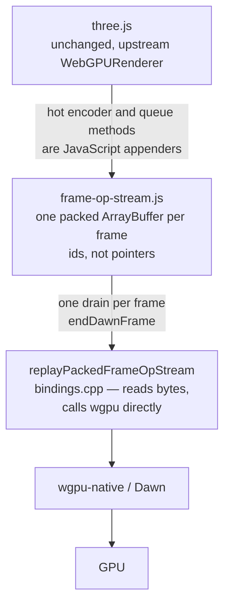

# The native render transport

**How the frame gets from three.js to the GPU on native, what is built, and the one rule it must not
break.** Budget and priorities live in
[NATIVE-PERF-BOTTLENECKS](NATIVE-PERF-BOTTLENECKS.md); this page is the design.

**Status, 2026-09-02.** The op stream ([PRD-227](../PRDs/performance/PRD-227-the-frame-crosses-once.md) Change 1)
**landed and passed gate P1**: desktop `bridgeNs` 9.31 → 0.81 ms, `work` 23.19 → 14.32 ms
([record](../verification/runtime-perf-state.md) §2.2). On the phone the same work moved out of
the JS meter into an ~8 ms `frameReplay` host segment and the frame rate did not change — the frame
is GPU-bound. Change 2 (fixed-shape wrappers) was executed and measured worse than baseline
(ledger §2.1 row 12). What is built below is shipped code; what is not built is gated as stated.

## What is built

- **The appenders are JavaScript** — the condition that decides whether any of this is real. If they
  were native functions writing into a buffer, every crossing would still be there and the win would
  be imaginary. `device.createCommandEncoder`, every render- and compute-pass method, the four
  copies, `clearBuffer` and all `queue` entry points (`writeBuffer`, `writeTexture`,
  `copyExternalImageToTexture`, `submit`) write little-endian records into one growing `ArrayBuffer`
  (magic `0x544e4652`, version 1).
- **Resource creation still crosses per call.** Anything returning a value three.js needs
  immediately stays a conventional native call; only steady-state per-frame commands are recorded.
- **Handles, not pointers.** `_bufferId`, `_bindGroupId`, `_pipelineId`, `_textureId`,
  `_textureViewId`, `_renderBundleId`, `__tnCommandBufferId`, each resolved through a registry in
  `BindingsState` and erased on release. An unknown id throws.
- **Fail-closed by construction.** Bad magic, version or declared length; a malformed record header;
  non-zero padding; an operation-count census mismatch; or a frame ending with unfinished GPU
  objects all throw, and the replay releases what it created. The failure mode this repository
  exists to avoid — a frame that renders almost correctly and reports success — is held by the
  format, not by review.
- **Uploads are eager-copied** at record time. The replay test's negative control mutates the source
  array after `writeBuffer` and asserts the recorded bytes survived.
- **One crossing per frame.** The drain runs in `endDawnFrame` after all rAF callbacks and before
  `clearFrameHandles` (`src/runtime.cpp`), while descriptors and upload payloads are still live.
  `frameOpStreamDirectCommandCalls` counts steady-state commands that bypassed the stream; the
  replay contract test asserts zero.

## What is not built

- **Change 2 — fixed-shape wrappers** (`ObjectTemplate` + internal fields, predicted −8.9 ms on
  device). **Executed, measured worse than baseline, reverted** (ledger §2.1 row 12): the
  megamorphic inline caches belong to three's node-material graph, not to our wrappers, and Chrome
  pays them too. Not a lever; do not re-propose without a new IC profile.
- **A native render thread.** JS recording frame N+1 while a native thread replays and presents
  frame N. The three run in series on the game thread today (`frameReplay` ≈ 8 ms and a GPU-tail
  `present` wait on the phone), so there is now work that could overlap — but overlapping cannot
  beat an 18–19 ms GPU frame, which is why the direction document gates it behind PRD-329's
  verdict and PRD-308's per-pass numbers. `Worker` is no longer the reason to build it: since
  PRD-250 it is a real native thread (web + Linux desktop verified; mobile `UNVERIFIED`).
- **AOT compilation** (`shermes`). The one idea that would stop iOS's no-JIT rule being the binding
  constraint. Unmeasured; a feasibility spike.

## The line that must not move

A replay of what it was told is a **transport**. The moment it starts deciding what to draw —
culling, LOD selection, visibility — it is a custom C++ renderer with its own semantics, and a scene
that renders differently on native than in the browser is a fork **no gate in this repository would
catch**. That is why GPU-driven culling, however attractive the frame times, belongs upstream in
three.js rather than here. The current replay executes what was recorded and decides nothing.

## Layer verdicts

The original 2026-08-10 sketch — three.js on top, a JS shim, a command stream, a JS runtime, a
render thread — was reviewed layer by layer and declined. It was reactivated in part on 2026-08-27.

| Layer | Verdict | Why |
|---|---|---|
| Normal three.js code on top | **Agree, permanently** | Not a layer to build; the constraint every other layer must survive |
| Upstream `WebGPURenderer`, unmodified | **Agree** | Already true, and the reason a shim is possible at all: the object three.js gets from `beginRenderPass()` is already ours |
| Pure-JS WebGPU shim | **Built** | Declined in 2026-08 as worth ~0.5 ms; reinstated when the seam was measured whole |
| Command stream / arena | **Built** | The physics precedent was always real — `step()` and `readVisibleTransforms(Float32Array)`, one coarse crossing per frame. Rendering was the outlier |
| JS runtime (V8 · Hermes · AOT) | **Not a layer** | A variable the stack is measured *against*. Swapping QuickJS for V8 was the single largest win in this document and cost one build flag |
| Native render thread | **Disagree, for now** | Cannot start before the arena exists, and there is no work off the critical path to hide. An owed correctness gate, not a perf lever |
| Dawn / wgpu-native → GPU | **Agree, trivially** | Idle on every subject measured |

**Why the verdicts on rows 3 and 4 flipped.** They were declined on PRD-068 §1.2's ~2% — an
instrument that timed only the *interiors* of six native handlers. The trampoline, the per-crossing
V8 API scaffolding, the allocator churn and the megamorphic inline caches three.js pays for our
dynamically-shaped wrappers all sat outside it. Measured whole, the seam is 22.3 ms of the Pixel 8's
37.7 ms frame. The design was right and the price was wrong.

## What a transport still cannot fix

**Per-object JavaScript work in three.js** — render-list build and sort, node and binding refresh,
matrix updates, frustum culling. No box in any transport diagram touches it. The two levers that do
are unglamorous: **submit fewer objects** (instancing, merged geometry, LOD, all in the game's own
`src/render/`, plus `SceneRenderProjection` mirroring an authored scene into instanced draws), or
**run the same JavaScript on a faster engine**, which is already spent.

**Correction, 2026-09-02:** this section used to name *"the draw-count knee — the ~20 ms step
between 500 and 1,000 draws"* as a second open problem. There is no knee under the shipped engine
(PRD-069 Phase 0, 2026-08-21); the step was a QuickJS artefact measured on a frustum-culled
subject. The linear term above is the whole of it.

## Where each piece lives

| Piece | Home |
|---|---|
| Recorder | `packages/runtime-native/src/runtime-scripts/frame-op-stream.js`, installed at `requestDevice` |
| Replay | `replayPackedFrameOpStream` in `packages/runtime-native/src/webgpu/bindings.cpp` |
| Handle registries | `packages/runtime-native/src/webgpu/bindings_state.h` |
| Desktop pair harness | `packages/runtime-native/scripts/measure-desktop-frame-pair.mjs` |
| Instancing, merged geometry, LOD | the game's `src/render/` — always. Deciding what a scene contains is the user's |
| Engine choice, AOT spike | `packages/runtime-native/src/js/` |
| "What is slow in this scene" | the playtest `diagnostics` surface. It reports; it never rewrites a scene |

## Status of every claim here

**Measured:** the desktop ablation split and its 0.09 ms cross-check, the 5,713-crossing /
15,005-argument frame, the 22.3 ms device seam, and the GPU sitting idle on every subject run.

**Built and verified:** the op stream. **Gate P1 passed** — desktop `bridgeNs` 9.31 → 0.81 ms,
`work` 23.19 → 14.32 ms ([record](../verification/runtime-perf-state.md) §2.2) — and the device
frame rate did not move (20.39 → 20.02 fps), which is the result, not a missing one.

**Withdrawn, 2026-09-02:**

- *Chrome's 59.99 fps on the same phone.* Falsified by rAF plus SurfaceFlinger: Chrome runs Bayview
  at ~30 fps at 864×303, native at ~20 fps at 2400×1080, and **no matched parity claim remains**
  ([runtime-perf-state](../verification/runtime-perf-state.md) §1.0, §5). PRD-329 owns the
  matched-pixel comparison that would replace it.
- *The draw-count knee.* Refuted under the shipped engine (PRD-069 Phase 0, 2026-08-21): frame time
  is flat ~4.0 ms from 100 to 1,000 objects and linear at ≈0.70 µs/object beyond. The historical
  5.6× step was a QuickJS artefact on a frustum-culled subject whose x-axis was never draws.
  **Do not re-hunt it.**

**Not measured:** what the remaining JavaScript term is made of (now owned by
[PRD-334](../PRDs/performance/PRD-334-the-javascript-render-term-is-named.md)); how many render
passes, encoders, command buffers and submits a real frame contains, in any shipped build (now
owned by [PRD-333](../PRDs/performance/PRD-333-the-frames-shape-is-a-first-class-meter.md)); cold
start under V8; and what a crossing costs on a varied-material scene.

**No claim here applies to iOS.** No Apple hardware is attached to this repository and the hosted
runner produces simulator-class evidence only.
