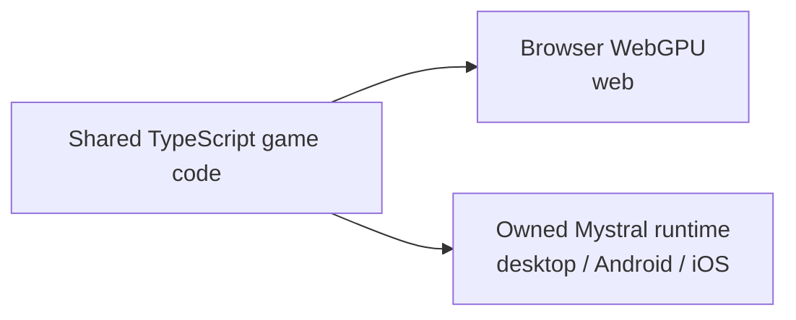
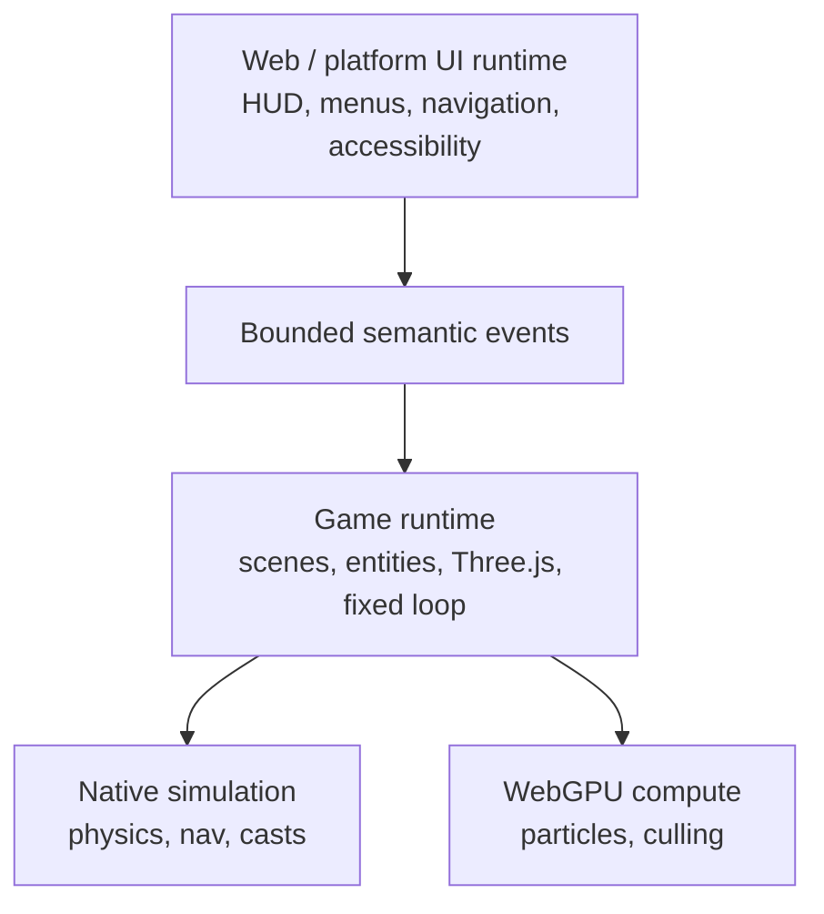

# Native runtime

**This document is the design.** Its task state lives in
[`docs/strategy/ROADMAP.md` → Phase 3 → Native lane](../strategy/ROADMAP.md#native-lane--done-and-left),
with `docs/PRDs/native/README.md` holding the per-PRD sequence and evidence pointers. Do not
re-record status here; it drifts.

**One-line status (2026-08-09):** desktop, Android emulator and iOS simulator execute;
**no physical hardware and no published prebuilt distribution.**
**Charter authority:** `CHARTER.md` §6b, §7; execution: PRD-047.

## The path



One game codebase, two release lanes. Mystral's host source, CMake and platform projects
live in the single `packages/runtime-native/` workspace package. Its third-party dependency
trees never enter git: `scripts/download-deps.mjs` reconstructs them in the package's
gitignored `third_party/`. Native builds are opt-in, produce one import-free bundle and use
the runtime's browser-compatible globals. Runtime/catalog Three.js compatibility is exact
and fail-closed.

## Why physics needs a native binding

Rapier ships as WebAssembly. That is not viable on Mystral Android because QuickJS has no
WebAssembly implementation. The earlier React Native engine research remains historical
support for the same conclusion:

| Engine | WebAssembly | Evidence |
|---|---|---|
| **Hermes** (RN default) | **No, and never** | `facebook/hermes#429`, open since 2020-12-04. Maintainer, 2023-10-04: adding a Wasm interpreter or JIT "does not fit with the goals of the project" |
| **JSC, iOS 18.4+** | **Yes**, unverified in RN | WebKit removed the JIT gate in `b01e7b6920` (2025-02-17); wasm runs on the IPInt interpreter. RN's `React-jsc.podspec` uses `weak_framework "JavaScriptCore"`, so RN inherits it free. Nobody has empirically confirmed it in an RN app |
| **JSC, iOS ≤18.3** | No | `safari-7620-branch`: `if (!useWasm() \|\| !useJIT()) disableAllWasmOptions();` |
| **JSC, Android** | **No, deliberately** | `jsc-android-buildscripts/scripts/compile/jsc.sh:62` passes `--no-webassembly`. Pinned to WebKitGTK 2.26.4 (2019). Issue #113 still open |

Three further findings: `WebAssembly.instantiateStreaming` does not exist in bare JSC
(ArrayBuffer path only); where wasm does run it is **interpreter-tier throughput**, wrong
for a 60 Hz step; and every workaround library is dead — `react-native-webassembly`
(abandoned 2023-11), `polygen` (stalled, iOS-only), `react-native-wasm` (archived).

Best case is "maybe on iOS 18.4+, definitely not on Android, at interpreter speed." That
is not a foundation.

> **Rapier compiled into the owned runtime, exposed through a versioned bulk typed-array
> ABI and selected from the existing `@threenative/physics` package.** No JSI, no WASM,
> no per-object hot-path crossing, and no additional workspace package.

## Thread and process split



## Both boundaries must be coarse

**UI boundary — already built this way.** `createGameStore` coalesces writes and flushes
on an interval (default 100 ms), so `ctx.state.set()` may run at 60 Hz while React
re-renders at ~10 Hz through `useSyncExternalStore`. React receives small semantic events:

```ts
type GameUIEvent =
  | { type: "health-changed"; health: number }
  | { type: "coins-changed"; coins: number }
  | { type: "pause-requested" }
  | { type: "game-over"; score: number };
```

Never thousands of transforms per frame. The UI renders the HUD; it never touches
`THREE.Scene`.

**Native boundary — design it the same way.** Bulk in, bulk out:

```ts
simulation.step(deltaTime, inputSnapshot);
simulation.readVisibleTransforms(renderBuffer);
```

Not:

```ts
for (const entity of entities) nativePhysics.setPosition(entity.id, entity.position);
```

Otherwise the JS↔native crossing becomes the next bottleneck, and the binding that was
supposed to buy performance spends it back per call.

## Evidence gates, in order

**0a — rendering.** Upstream `three/webgpu` runs the unchanged framework bundle at the
catalog version, on every target claimed.

**0b — physics.** Native Rapier drops a cube onto a plane through the versioned bulk ABI,
PRD-045 asserts the trajectory and demonstrates a deliberately broken run failing, and
PRD-049 measures web/host/device agreement with negative controls.

Both are passed on emulated and simulated targets and open on physical hardware — the
roadmap's native-lane table is where that state is tracked. **Emulator and simulator results
never become physical-driver, arm64-performance or phone frame-rate evidence**, and no
combination of them is a mobile-ready claim.

## Explicitly not doing

A framework-owned or forked rendering backend. Dual-renderer parity is a permanent ~2x
tax. Mystral remains a host for upstream Three.js, and native modules are added there only
for capabilities such as physics that cannot run through the JavaScript engine. Its source
is owned here; Dawn, V8, QuickJS, SDL3, wgpu-native and other dependencies are not vendored.
