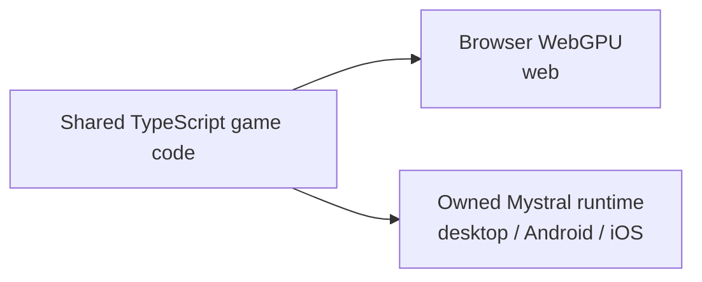
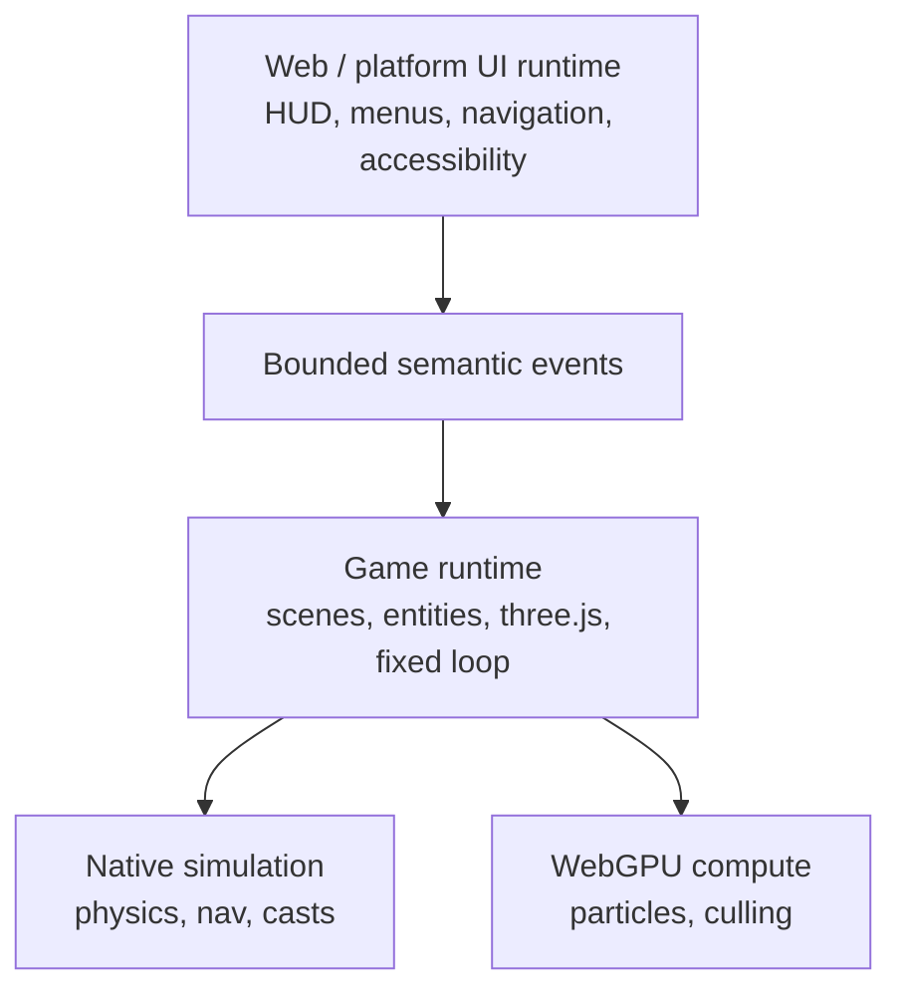

# Native runtime

**This document is the design.** Task state lives in
[`docs/strategy/ROADMAP.md` → Phase 3 → Native lane](../strategy/ROADMAP.md#native-lane--done-and-left)
— do not re-record status here; it drifts. Frame budget and priorities are in
[NATIVE-PERF-BOTTLENECKS](NATIVE-PERF-BOTTLENECKS.md), the render path in
[NATIVE-RENDER-TRANSPORT](NATIVE-RENDER-TRANSPORT.md).

**Status, 2026-08-28.** Desktop, the Android emulator and the iOS simulator execute, and one
physical Pixel 8 (arm64) has run measured load tests. **No iOS hardware, no signed release build, no
published prebuilt distribution** — phone runs are benchmark evidence, not a mobile-readiness claim
(the qualification split is [PRD-128](../PRDs/mobile/PRD-128-android-qualification-split.md)). The
frame budget is attributed and the path to 60 fps is filed as
[PRD-227](../PRDs/performance/PRD-227-the-frame-crosses-once.md).

## The path



One game codebase, two release lanes. **The runtime is a host for cross-platform plumbing; the game
and its look stay in shared three.js source** (execution: PRD-047).

Mystral's host source, CMake and platform projects live in the single `packages/runtime-native/`
workspace package. Third-party dependency trees never enter git — `scripts/download-deps.mjs`
reconstructs them in the gitignored `third_party/`. Native builds are opt-in, produce one
import-free bundle, and use the runtime's browser-compatible globals. Runtime/catalog three.js
compatibility is exact and fail-closed.

**JavaScript engines:** V8 on desktop and Android (`-PthreenativeJsEngine=quickjs` is the kept
rollback), JSC on iOS by construction.

## Why physics needs a native binding

Rapier ships as WebAssembly, and the native backend exists because that was not viable on Android.

**The original premise has expired.** The reason was that QuickJS has no WebAssembly implementation
and QuickJS was the Android default; V8 is now the default and V8 does implement WebAssembly.

**The binding stays anyway, and this is why it is now an open measurement rather than a settled
fact.** Nobody has measured Rapier-as-WebAssembly on the V8 Android path; iOS remains JSC; and the
coarse bulk ABI was chosen for per-object call cost as much as for the missing engine feature, which
V8 does not address. Whoever picks this up should read this paragraph as the thing to disprove.

The React Native engine research remains historical support for the same conclusion:

| Engine | WebAssembly | Evidence |
|---|---|---|
| **Hermes** (RN default) | **No, and never** | `facebook/hermes#429`, open since 2020-12-04. Maintainer, 2023-10-04: a Wasm interpreter or JIT "does not fit with the goals of the project" |
| **JSC, iOS 18.4+** | **Yes**, unverified in RN | WebKit removed the JIT gate in `b01e7b6920` (2025-02-17); wasm runs on the IPInt interpreter. `React-jsc.podspec` uses `weak_framework "JavaScriptCore"`, so RN inherits it free — nobody has empirically confirmed it |
| **JSC, iOS ≤18.3** | No | `safari-7620-branch`: `if (!useWasm() \|\| !useJIT()) disableAllWasmOptions();` |
| **JSC, Android** | **No, deliberately** | `jsc-android-buildscripts/scripts/compile/jsc.sh:62` passes `--no-webassembly`. Pinned to WebKitGTK 2.26.4 (2019) |

Three further findings: `WebAssembly.instantiateStreaming` does not exist in bare JSC (ArrayBuffer
path only); where wasm does run it is **interpreter-tier throughput**, wrong for a 60 Hz step; and
every workaround library is dead. Best case is "maybe on iOS 18.4+, definitely not on Android, at
interpreter speed" — not a foundation.

> **Rapier is compiled into the owned runtime and exposed through a versioned bulk typed-array ABI,
> selected from the existing `@threenative/physics` package.** No JSI, no WASM, no per-object
> hot-path crossing, no additional workspace package.

## Both boundaries must be coarse



**UI boundary — already built this way.** `createGameStore` coalesces writes and flushes on an
interval (default 100 ms), so `ctx.state.set()` may run at 60 Hz while React re-renders at ~10 Hz
through `useSyncExternalStore`. React receives small semantic events — `health-changed`,
`coins-changed`, `pause-requested`, `game-over` — never thousands of transforms per frame. The UI
renders the HUD; it never touches `THREE.Scene`.

**Native boundary — bulk in, bulk out:**

```ts
simulation.step(deltaTime, inputSnapshot);
simulation.readVisibleTransforms(renderBuffer);
```

Not `for (const entity of entities) nativePhysics.setPosition(entity.id, entity.position);` —
otherwise the crossing becomes the bottleneck and the binding spends back per call what it was
supposed to buy. **That is exactly what happened to rendering**, measured at 5,713 crossings per
frame, and PRD-227 is bringing it onto the same coarse footing: three.js records the frame's WebGPU
commands into one packed `ArrayBuffer` in JavaScript
(`packages/runtime-native/src/runtime-scripts/frame-op-stream.js`) and C++ replays and submits it in
a single crossing at the `endDawnFrame` boundary. The replay is pure transport and fail-closed, so
the no-forked-renderer rule below is untouched.

## Evidence gates, in order

**0a — rendering.** Upstream `three/webgpu` runs the unchanged framework bundle at the catalog
version, on every target claimed.

**0b — physics.** Native Rapier drops a cube onto a plane through the versioned bulk ABI, PRD-045
asserts the trajectory and demonstrates a deliberately broken run failing, and PRD-049 measures
web/host/device agreement with negative controls
([divergence report](../verification/PRD-049.md)).

Both pass on emulated and simulated targets. **On physical hardware only 0a has moved**: a Pixel 8
rendered and was measured against Godot 4.7.1
([summary](../verification/runtime-perf-state.md)) on an unsigned release build.
Physics on a phone, iOS hardware, signing and soak are all open. **Emulator and simulator results
never become physical-driver, arm64-performance or phone frame-rate evidence**, and no combination
of them is a mobile-ready claim.

## Explicitly not doing

**A framework-owned or forked rendering backend.** Dual-renderer parity is a permanent ~2× tax.
Mystral stays a host for upstream three.js, and native modules are added only for capabilities such
as physics that cannot run through the JavaScript engine. Its source is owned here; Dawn, V8,
QuickJS, SDL3 and wgpu-native are not vendored.
