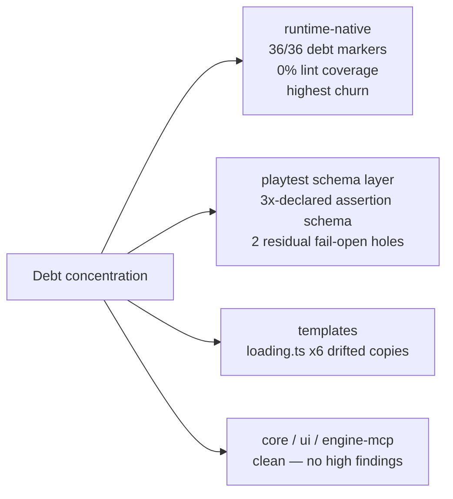

# Tech-debt / SRP / KISS / DRY scan — 2026-08-23

Checkout audited: `62fac4d5ed598de7e3a6e9fa3ed2b08eb64f2cb9`. Method: four parallel read-only
lanes (`packages/core`, `packages/runtime-native` C++, `packages/playtest` + `scripts/`,
peripheral packages + templates) plus objective gates run locally (`pnpm quality`, marker greps,
commit-activity counts). Every high finding was re-verified against source before publication.
A companion Codex audit pass explored the tree for ~30 min but hung in its verification phase and
was cancelled before emitting a report; nothing below depends on it.

Relation to `docs/verification/tech-debt-audit-2026-08-20.md`: that audit's process/gate items have
largely been paid down since (verified: `collapse.ts` deleted, `assertions.ts` 3,078 → 29 lines,
`runner.ts` 1,800 → 626, census generated by `scripts/generate-native-census.ts`, `.worktrees/`
warning now in root AGENTS.md). This scan is the code-level complement; it found no overlap with
items still open there.

## Objective anchors

| Metric | Value | Reading |
|---|---|---|
| TODO/FIXME/HACK markers, all packages | 36 — **all in runtime-native**, zero elsewhere | Debt is concentrated, not spread |
| Biome coverage of runtime-native | **entire package ignored** (`biome.json`) while it is also the most active package (141 commits/90 d) | The only unlinted code is the hottest |
| File-length offenders (`pnpm quality`) | `physics/simulation.ts` 1,244 · `create-threenative/config.ts` 1,107 · `playtest/schema-validate.ts` 946 · `core/game.ts` 779 · `core/projection-apply.ts` 739 | Gated as non-fatal reports |
| `as any` / ts-ignore in core+physics+ui+playtest | ~0 (2 justified biome-ignores) | Type hygiene stays clean |
| Commented-out code-like lines in runtime-native | 27 | Plus 37 raw `delete` sites |

## Scoreboard — ranked by impact ÷ effort

### Tier 1 — fix this week (high impact, ≤ small effort)

| # | Finding | Where | Sev | Eff |
|---|---|---|---|---|
| 1 | TLS peer verification permanently disabled on WebTransport | `runtime-native/src/webtransport/webtransport.cpp:790` | high | S |
| 2 | Raytracing returns success while the result never leaves its staging buffer | `raytracing/vulkan_rt.cpp:1552`, `dxr_rt.cpp:1286`, accepted at `raytracing/bindings.cpp:406` | high | S to gate |
| 3 | Fail-open parity-animation/resource validation silently shrinks parity comparisons | `playtest/src/scenario/schema-validate.ts:115-124` | high | S |
| 4 | Scaffold prints a hardcoded 3-template list while 7 kits ship — misleads the cold agent that builds next | `create-threenative/src/index.ts:495` | high | S |
| 5 | Triviality-guard predicate hand-copied 18× across evaluators — the vacuous-green control has 18 independent copies | `evaluators/movement-evidence.ts` ×16, `world-gameplay.ts` ×2 | med | S |
| 6 | `buildReport` takes 14–16 positional args per target, four bare `undefined`s in a row | `runner/runner.ts:515`, `androidRunner.ts:362` | med | S |
| 7 | Missing null checks on `createBindGroup`/`createSampler` wrap garbage handles that dereference at submit | `webgpu/bindings.cpp:4620,4384` | med | S |

Details:

1. **TLS verify off** — `quiche_config_verify_peer(s->config, false); // TODO: serverCertificateHashes`. Any WebTransport endpoint is trusted regardless of certificate. Until `serverCertificateHashes` is implemented, verification should default on with an explicit dev override.
2. **Silent-success raytracing** — Vulkan/DXR traceRays compute into a readback buffer, then TODO the copy-out ("next phase"), while the JS binding accepts an `outputTexture` and resolves success. ~2,800 lines Vulkan + 1,294 DXR + 878 Metal deliver a result nothing can display. Mirror the deprecated-native-GLTF handling: gate the surface off until interop exists.
3. **Fail-open parity validation** — `validateParityAnimation` returns `undefined` for malformed entries and callers `.filter(x => x !== undefined)` them out (same for non-string `parity.resources`, unknown targets). This is exactly the silent-drop the playtest rule bans. A mistyped animation shrinks the comparison instead of failing load.
4. **Stale template list** — post-scaffold message names "minimal, starter, platformer" while `discoverKitManifests()` finds action-rpg, defense, racing, shooter too. The primary consumer (an agent) reads this message and builds against wrong facts. One line: derive from the discovered list.
5. **Triviality guard ×18** — `pass = comparisonPass && (!trivial || typeof assertion.allowTrivial === "string")` repeated verbatim across settled/occluded/animation/contact evaluators (~100–150 lines). One helper removes the copies and makes the anti-vacuous predicate single-sourced.
6. **Positional report args** — transposing two same-typed adjacent params compiles clean and corrupts one target's report only. Options object.
7. **Null-check asymmetry** — `createBuffer` and both pipeline factories check-and-throw; bind groups and samplers do not.

### Tier 2 — high value, medium effort

| # | Finding | Where | Sev | Eff |
|---|---|---|---|---|
| 8 | Device runner duplicates six browser-path helpers; two already diverged — incl. path-length math (web vs device can report different distances for the same walk) | `androidRunner.ts:592-668` vs `steps.ts:218-242,664-709` | high | M |
| 9 | `loading.ts` copy-pasted into 6 templates, ~1,660 total lines, structurally drifted (factory names, `if (done)` guard shapes, platformer grew to 338) | `templates/*/src/render/loading.ts` | high | M-L |
| 10 | Texture-wrapper construction duplicated between windowed/offscreen paths + render/compute pipeline lambdas copy-pasted (~200+ removable lines) | `webgpu/bindings.cpp` | med | M |
| 11 | Assertion schema declared three times (registry prose types → string→predicate map → ~20 hand-written validators, 106 inline type checks) | `schema-validate.ts` + `assertion-schema.ts` + `schema-accessors.ts:505` | med | L |
| 12 | `initBindings`: one ~4,715-line function registering all 100 API surfaces as nested lambdas (up to ~8 deep); 279 `newFunction` sites package-wide, no table-driven registration; house-style counter-example exists in `physics/native_bindings.cpp` | `webgpu/bindings.cpp:1006-5721` | med | L |
| 13 | `movement-evidence.ts` = one 600-line function evaluating ~15 assertion kinds as sequential if-blocks | `evaluators/movement-evidence.ts:7-605` | med | M |
| 14 | `sampling.ts` holds seven unrelated subsystems (HUD sampling, movement math, camera eval, vec3 helpers, server lifecycle, crash diagnostics, adapter probe) | `runner/sampling.ts` | med | M |
| 15 | Timer stubs that never schedule get installed by both engines, then overwritten by the real system later — install-order change silently kills timers | `js/v8_engine.cpp:1137`, `quickjs_engine.cpp:886`, `runtime.cpp:1206` | med | S-M |
| 16 | Viewport validation coerces wrong-typed viewport to 1280×720 defaults instead of throwing (every other present-but-wrong key throws) | `scenario/schema-accessors.ts:445-452` | med | S |
| 17 | `main.cpp` does ≥10 jobs incl. a ~900-line bundler and lightmap baking — build-time tools living in the runtime binary | `cli/main.cpp` | med | L |

Details worth keeping:

- **#8 is a correctness issue, not just tidiness**: `accumulatedPathLength` reimplemented with `Math.hypot` on device vs `length(subtract())` on browser — a parity harness whose own distance math differs by lane. Also `setupRequest`/`observedResourceIds` verbatim duplicates, `failureReport` field sets differ, and `throwIfAborted` always says *"Desktop playtest interrupted"* even on Android/iOS (`androidRunner.ts:437`). Consolidate into one shared module; fixes #8 and its wrong-target message together.
- **#9 options**: templates' `src/render/` must stay dependency-free user source, so either a scaffold-time shared-source step or a consistency test diffing the copies. Today `loading-screen.spec.ts` catches absence per template, not divergence.
- **#11**: not a zod question (package deliberately dep-free). The registry already carries name/type/required/cardinality and already generates docs (`scripts/generate-assertion-reference.ts`); generating the validators from it deletes several hundred lines and makes drift impossible. Until then every new assertion field costs edits in 3 places + docs.
- **#12**: quantified repetition — 100 `newFunction` registrations in this file alone, each with hand-rolled arg parsing (44 `args.empty()` guards, 51 throwException sites), plus 100 file-static globals making the whole WebGPU layer unreentrant/untestable. Table-driven registration + named parse helpers (the physics-bindings style) is the direction.
- **#16**: `viewport: {"width": "1280"}` currently runs at defaults and screenshots get compared at a resolution nobody asked for.

### Tier 3 — medium severity, small effort (batchable quick wins)

| # | Finding | Where | Eff |
|---|---|---|---|
| 18 | `pressed()`/`#latchedPressed()` walk the identical binding tree; `#isHeld`/`#isLatched` are the same 6-line fn twice (~35 dup lines) | `core/src/input.ts:291-317,403-439` | S |
| 19 | `IThreeNativeTexturesConfig` declared verbatim in two packages; same file re-exports core's other types | `create-threenative/src/config.ts:74` ≡ `core/src/config.ts:27` | S |
| 20 | Client→canvas pointer conversion hand-rolled twice (comment admits coupling) | `core/src/game.ts:465` vs `replay.ts` | S-M |
| 21 | `isSmallBufferError` regex duplicated — it *is* the native ABI error contract; C++ message change breaks one backend silently | `physics/plugin.ts:94` ≡ `native/host.ts:208` | S |
| 22 | `NavigationAgent3D.isTargetReachable` re-implements the target-path chain; tolerance change can make "reachable" and "finishes" disagree | `navigation/NavigationAgent3D.ts:254` vs `184-252` | S-M |
| 23 | Physics plugin `sceneExit` and `dispose` are parallel teardown blocks — new registry leaks asymmetrically if one is missed | `plugin.ts:275-307` | S |
| 24 | Two independent PNG parsers with copied `PNG_SIGNATURE` and duplicated tRNS alpha rule | `create-threenative/config.ts:190` vs `assets/health.ts:57` | M |
| 25 | Same 8-package list enumerated twice in the scaffolder (type union + flag table) | `create-threenative/index.ts:23,457` | S |
| 26 | Template-variable substitution loop implemented twice | `create-threenative/index.ts:178,216` | S |
| 27 | JS-in-C++ raw strings: ~2,900 of runtime.cpp's 4,743 lines are embedded JS (fetch/gltf/draco polyfills — gltf/draco persist though native GLTF is deprecated) | `runtime.cpp:1873+` | M |
| 28 | `JSValueHandle` is bare `void*` ownership-by-comment; QuickJS heap-allocates `new JSValue` with "(caller must free)" convention, no free method on Engine | `include/mystral/js/engine.h`, `quickjs_engine.cpp:271` | L |
| 29 | 11 sleep-poll(1 ms) loops instead of fences/condvars | `cli/main.cpp` ×5, `context.cpp`, `bindings.cpp`, `gpu_readback_recorder.cpp` | M |

### Tier 4 — low (fold into neighbouring work)

Dead/speculative API: `AudioBus.reparent()` alias with zero callers (`core/audio.ts:151`);
`export type ProjectionCamera = Camera` unreferenced (`core/renderProjection.ts:334`).
Drift-risk constants: gesture event list written twice (`core/audio.ts:124,243`); assets layout
constants mirrored in `watch.ts` + `messageOf` ×3 (`assets/compile.ts:146` vs `watch.ts:64`).
Tribal knowledge: `["ma"+"terial"]` split-string idiom at 3 sites with no explaining comment
(`core/assets.ts:435`, `renderer.ts:58,69`). Stale anchors: "Extracted verbatim from runner.ts
(PRD-182)" markers sit over code they did not extract, 13 occurrences / 11 files — re-anchor or
delete before an agent preserves a defect to honour the comment. Scripts: `isRecord` ×6,
`freePort` duplicated, `verify-golden-path.ts` (971 lines) carries its own MCP JSON-RPC client
that belongs in a reusable module. UI: `DebugOverlay` polls at 10 Hz even closed (`ui/DebugOverlay.tsx:23`).
Navigation glue: `finitePositive` ×3, `toNavigationVector` ×2 within one subpath. Host seam:
four copies of the optional-actuation pattern + inconsistent disposed-guards (`readBodySleepStates`
inlines check, `removeJoint` silently returns where siblings throw) (`native/host.ts:398-450`).

## What is in good shape

- **core is genuinely clean**: 0 TODO/FIXME, 0 ts-ignore, 2 justified biome-ignores, all 12 findings med-or-low, and the kill-switch rule visibly honoured (`renderProjection` declines work rather than always-on batching).
- **ui is exemplary** — a 22-line `useSyncExternalStore` bridge, zero subscribe/cleanup boilerplate across components.
- **The RT backends are NOT duplication**: `vulkan_rt`/`dxr_rt` share an interface and factory; bodies are genuine per-API code.
- **Fail-closed posture is otherwise strong**: wrong-typed known keys throw, vacuous assertions reject at load; the 59 `.catch(() => undefined)` sites are teardown/probe paths, and the residual fail-open holes are exactly findings #3 and #16.
- **Cross-template configs are byte-identical** (`.mcp.json`, vite config, index.html, main bootstrap, playtest-events) — the drift is confined to `loading.ts`.
- **engine-mcp consumes the generated manifest** — no hand-maintained capability list anywhere.

## Suggested execution order

1. Tier 1 (#1–#7): seven small fixes, each red-green per house rules — about a day total.
2. #8 runner-helper consolidation (+ wrong-target abort message) — half a day, closes the parity-harness self-bug class.
3. #10 + #12 together as one bindings.cpp pass (table-driven registration, shared wrapper factories) — multi-day, biggest structural win in the C++ host; pair with extending Biome over runtime-native so regressions stop being invisible.
4. #9 loading.ts decision (shared-source step vs consistency test) and #11 registry-generated validators — each an afternoon of design, then mechanical.
