# Final PRD-345 default template captures

All twelve conventional templates pass strict matched hardware WebGPU readiness captures
at the fixed tick-60 default camera: 1280×720, NVIDIA Turing, 4× MSAA, identical per-pair
camera/game state/clock/backend/buffer and cooked assets. Candidate generated runtime
source matches checkpoint `dca2d8d4b`, including read-only light matrices. All 24 full PNGs
were personally inspected by root and a separate reviewer. The original authored palettes
and surrounding geometry/shadows remain stable. Bright photographed IBL suppresses extra
analytic fill; difficult backlit/black-environment controls are separately qualified.

This custom boot capture is not a full gameplay/playtest matrix, native proof, pipeline
compile-completion claim or a final per-frame/startup performance budget. Source manifests,
readiness session, runtime snapshots and adapter provenance are preserved in each gzip
report and the complete matrix. Earlier attempts and rejected racing frames remain in
separate historical evidence; they were not overwritten or silently filtered.

Platformer flags and runner smoke can vary with presentation time despite matched gameplay
clock. Tower-defense HUD hover differs slightly. These differences are disclosed, not
claimed as lighting improvements or exact whole-frame pixel equivalence. Puzzle/tower
extra material rim/fill remain zero to preserve authored lights; runner/snow extra fill
remains zero. Custom RTS terrain/water and snow materials stay original. Rain's custom
raymarched shader is explicitly unqualified; native/mobile/software/WebGL retain originals.

| Template | Before | After |
| --- | --- | --- |
| racing |  | 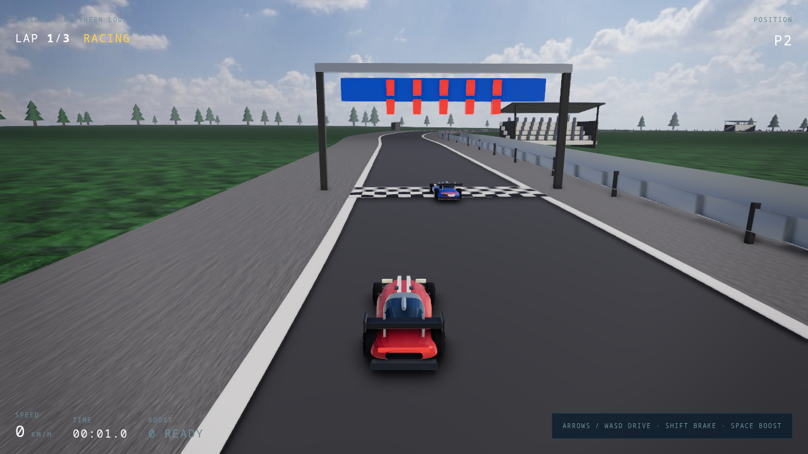 |
| minimal |  | 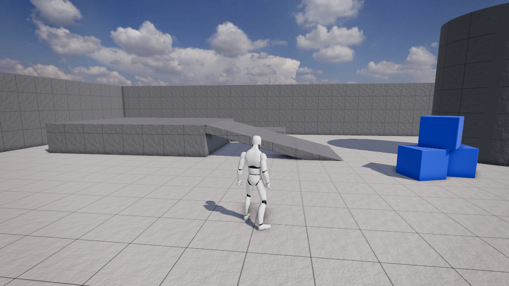 |
| starter | 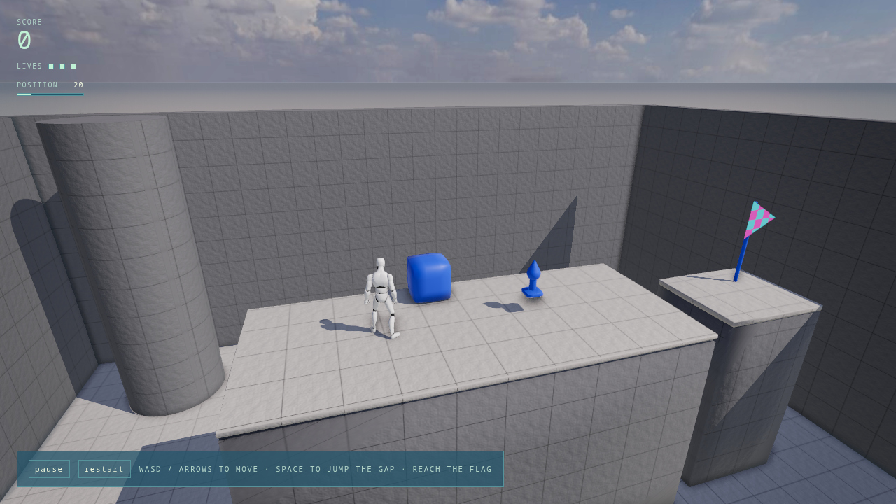 |  |
| platformer | 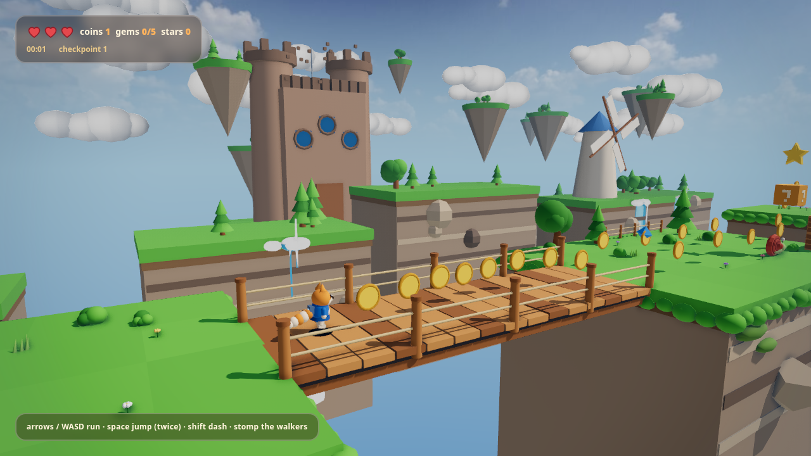 |  |
| runner | 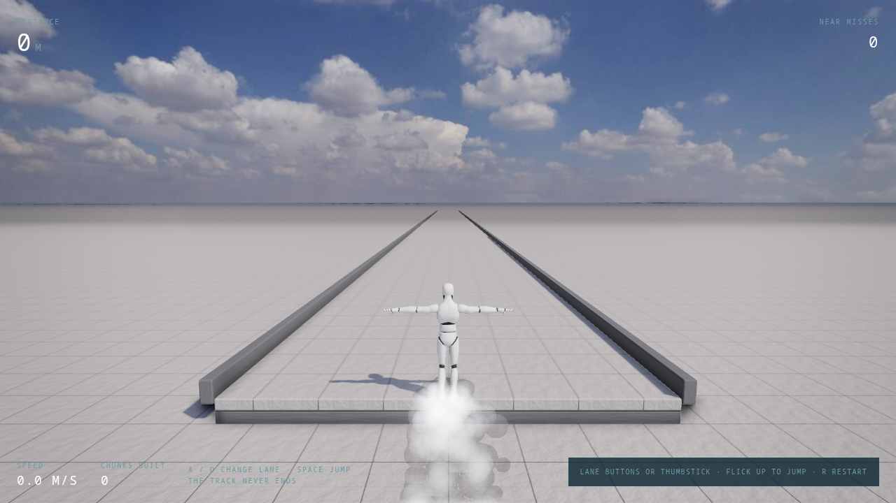 |  |
| shooter | 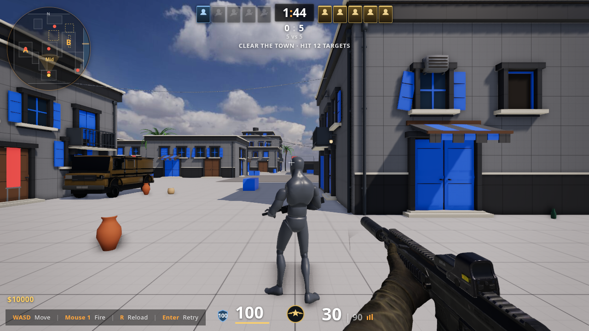 |  |
| action-rpg |  | 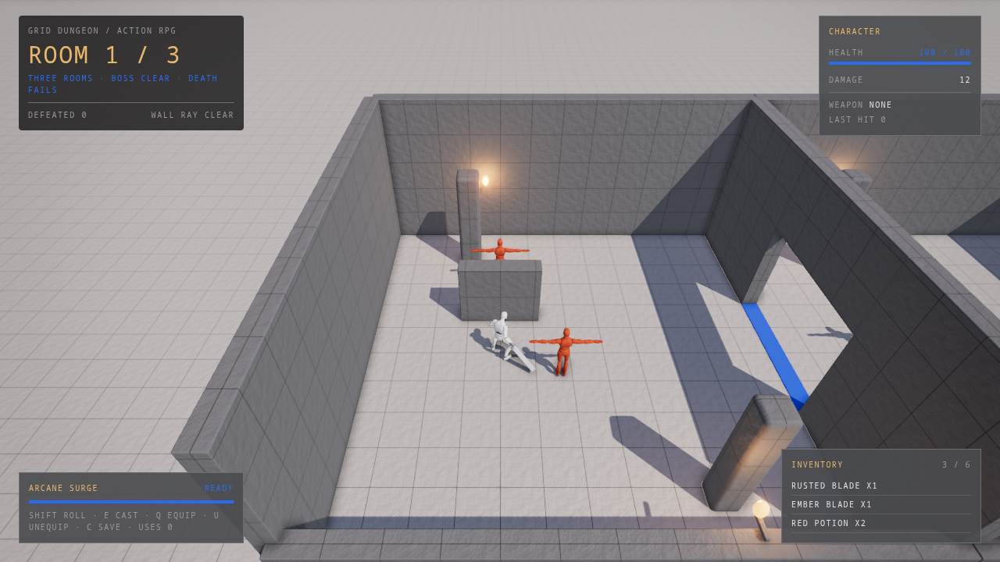 |
| rts | 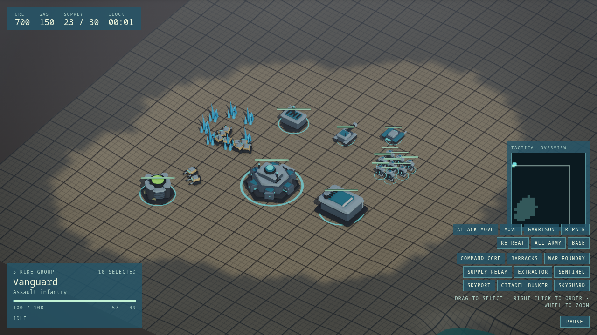 |  |
| tower-defense | 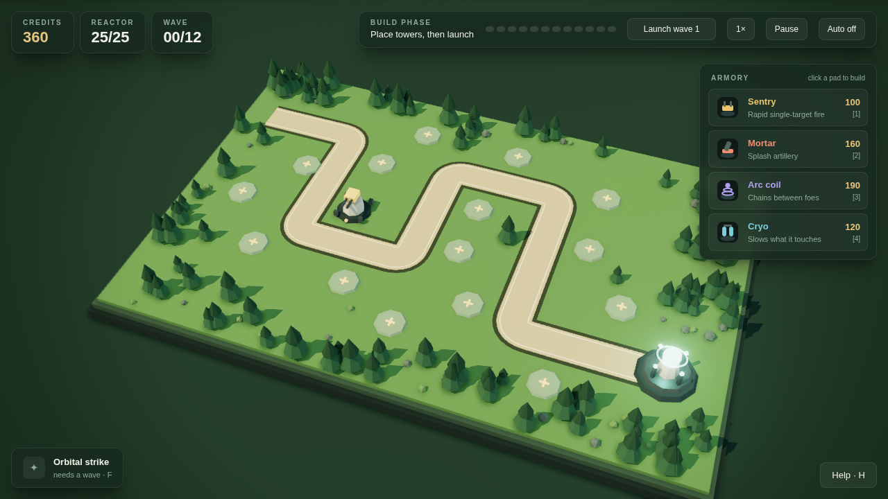 |  |
| puzzle |  | 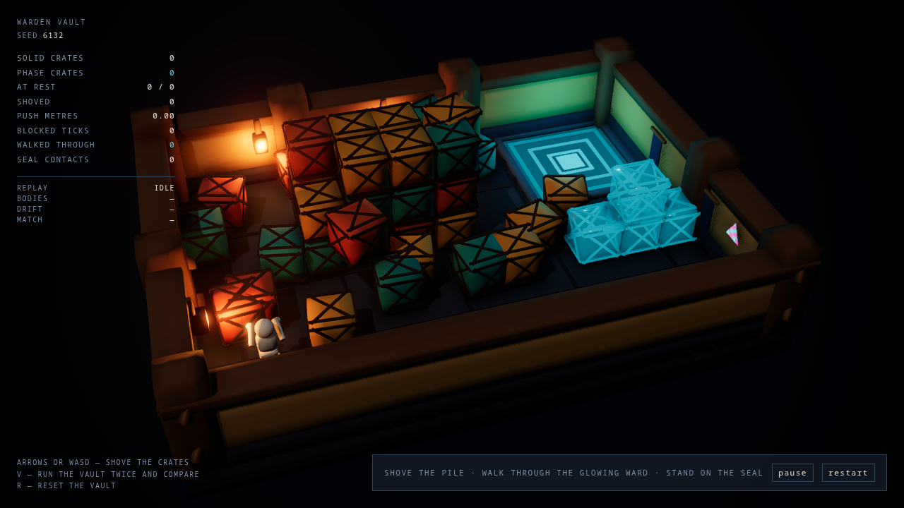 |
| sailing | 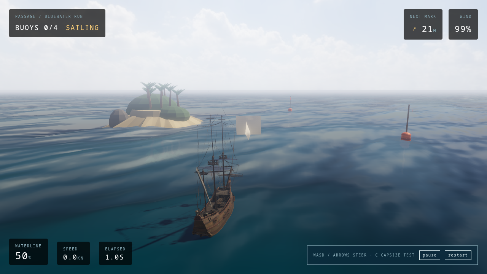 |  |
| snow |  |  |
