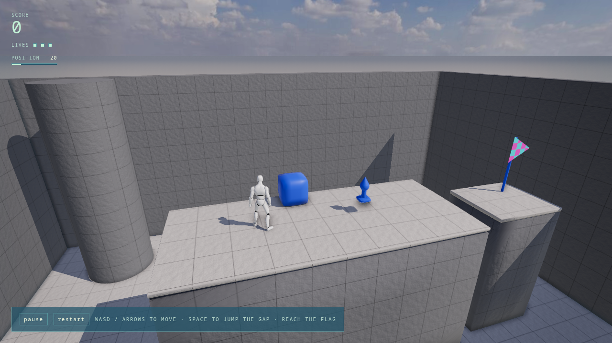
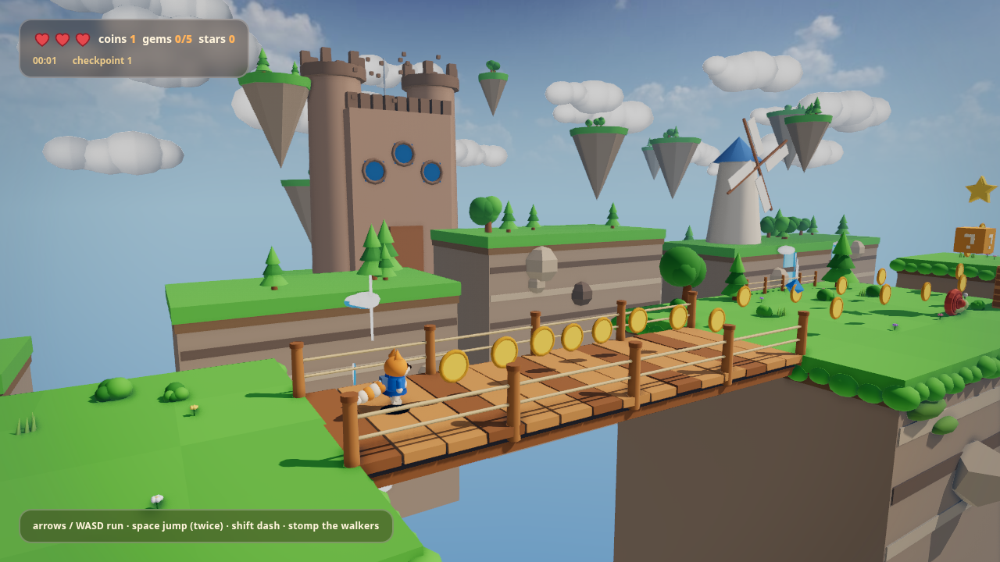
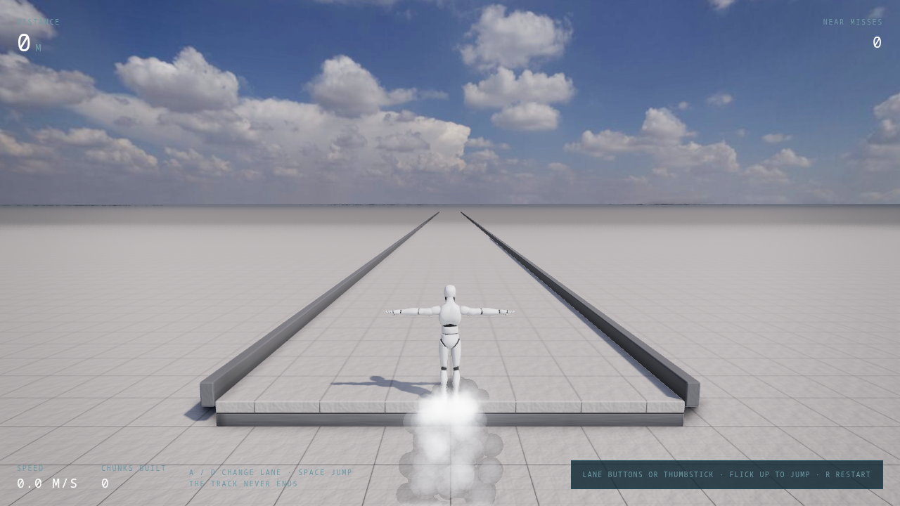
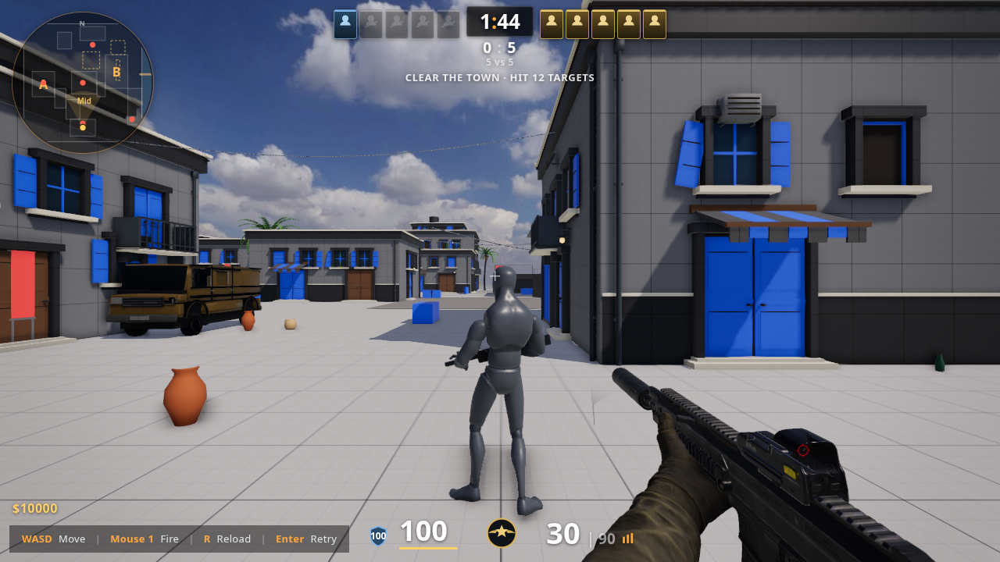
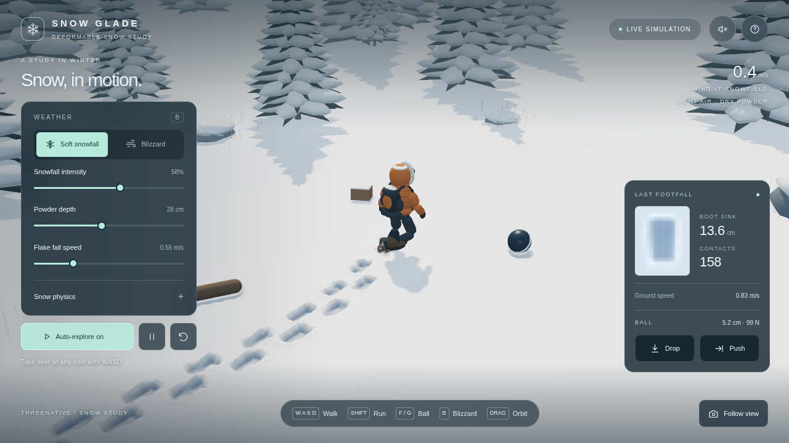
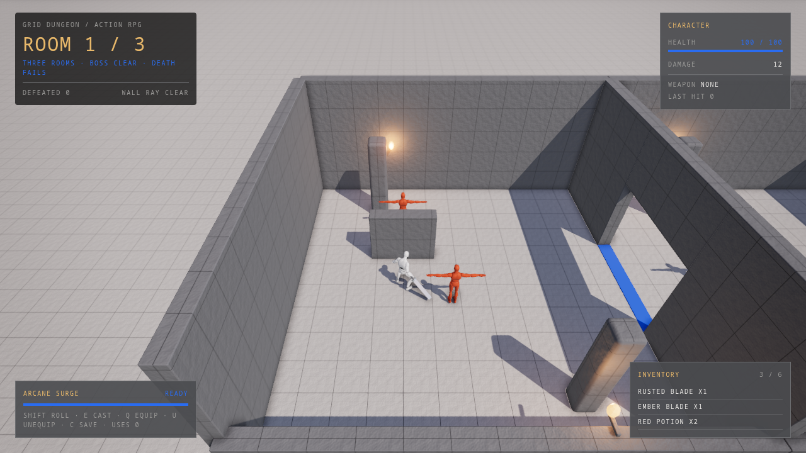
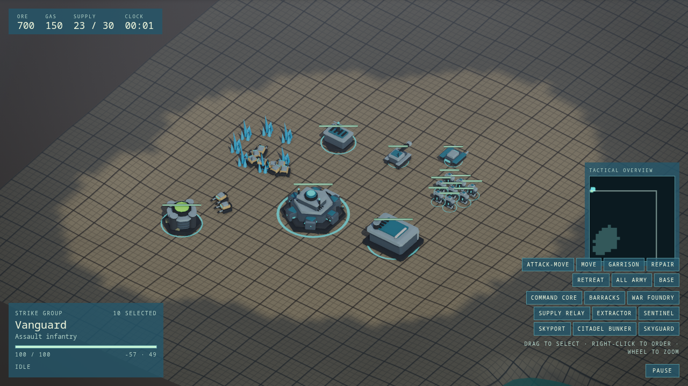
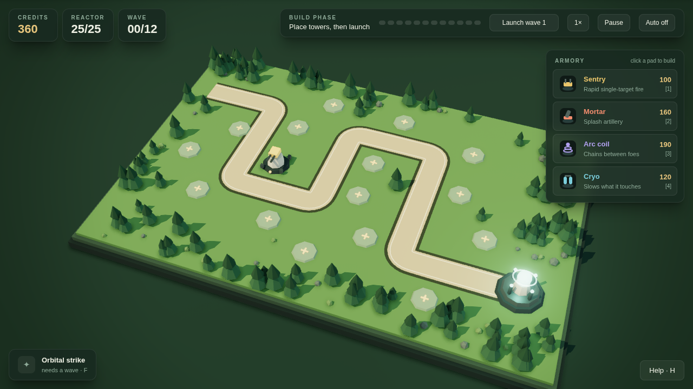
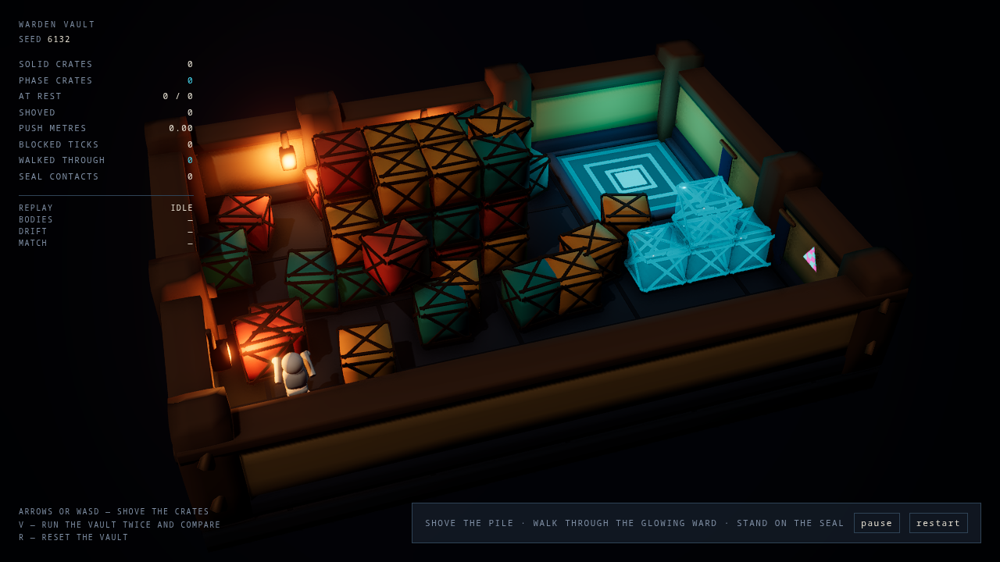
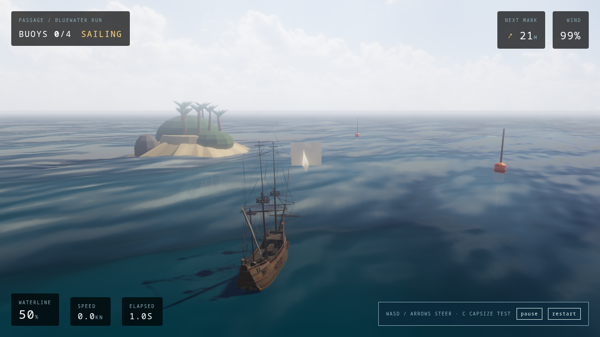

# PRD-345 generated template comparisons

These are full, unscaled 1280×720 PNGs from actual generated projects. Each pair uses the
same cooked assets, default scene/camera, fixed tick 60, NVIDIA Turing hardware WebGPU and
4× MSAA. The reports retain source manifests, observed camera/backend/buffer settings,
readiness capture session, runtime snapshot and adapter provenance. The before source is
our isolated checkpoint `8cb5d3e8b`; candidate source is the captured plural-template
working tree recorded in each manifest. Later changes require fresh qualification.

The driver uses a bounded custom boot/capture scenario. Successful readiness capture is
not a full template gameplay/playtest verdict, native qualification, or proof that every
pipeline has finished compiling. `matrix1.full.json.gz`, `matrix2.full.json.gz` and `matrix3.full.json.gz` retain
failed attempts as well as successful retries. Asset-worker/WASM failures during a
concurrent local dependency rebuild were retained and retried after dependencies froze.

The default opening views are deliberately modest: bright photographed IBL suppresses
additional analytic fill. Backlit and black-environment positive/negative acceptance
controls are separately retained under `docs/verification/prd345`. Authored puzzle and
tower-defense fill/rim defaults remain zero to preserve their explicit lights; runner and
snow extra fill remains zero. RTS custom node terrain/water and snow custom surfaces stay
original. Flag or smoke phases can vary with wall time despite the same gameplay clock;
those differences are not claimed as improvements or pixel-identical controls.

| Template | Before | After |
| --- | --- | --- |
| minimal |  |  |
| starter |  |  |
| platformer |  |  |
| runner |  |  |
| shooter |  |  |
| snow |  |  |
| action-rpg |  |  |
| rts |  |  |
| tower-defense |  |  |
| puzzle |  |  |
| sailing |  |  |

Racing is not admitted: its successful capture shows broad road/shadow differences that
persist with zero rim and original materials restored later. Fresh startup controls
show the delta follows node-material admission, not GPU environment sampling. Its causal
investigation and all original frames remain under the task capture artifacts.
Puzzle and sailing pass fresh strict readiness retries after dependencies froze; the original
failures and doctor results remain retained. Doctor checks alone were not treated as acceptance.
Rain uses a custom raymarched shader, so standard-material conversion does not apply and
cloud radiance remains unknown. Native/mobile/software/WebGL keep original materials;
those fallback policies are covered by CPU checks, with native execution still open.

## Historical capture coordination limitation

A reported `held` capture lease establishes ownership within that process's temporary namespace. `defaultCaptureLockRoot()` derives its path from `TMPDIR`; durable-TMPDIR gameplay/native-opening and matched performance runs used private namespaces. We manually serialized our own jobs, but shared global GPU exclusion and external workload isolation were not established for those historical runs. Their measured outcomes remain retained with this limitation; they must not be described as globally exclusive qualification. Future timing runs use an explicit outer existing-API shared `/tmp/threenative-playtest-capture` lease and durable child temps.
