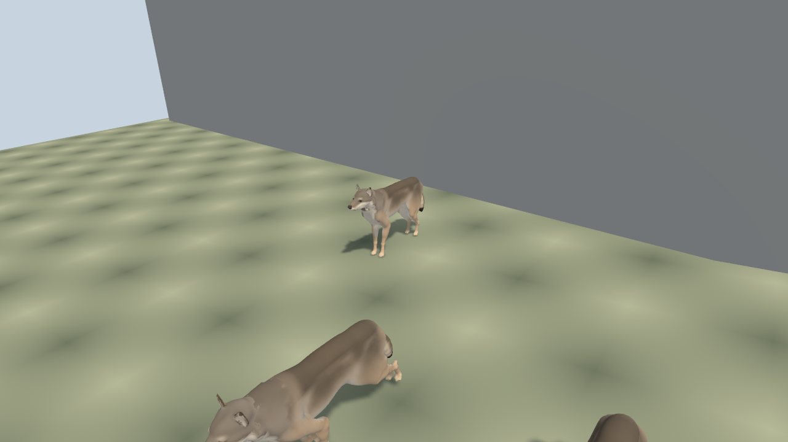
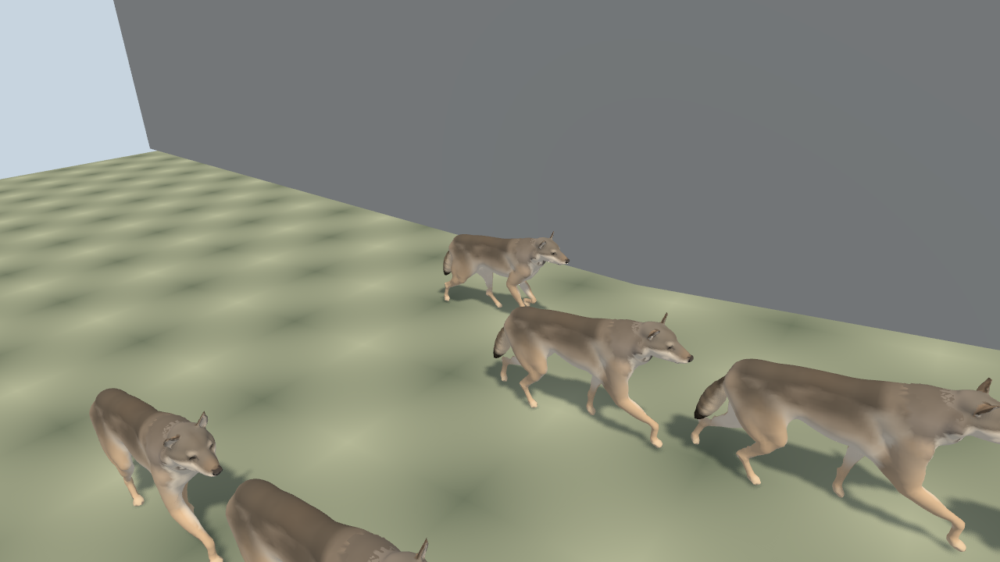
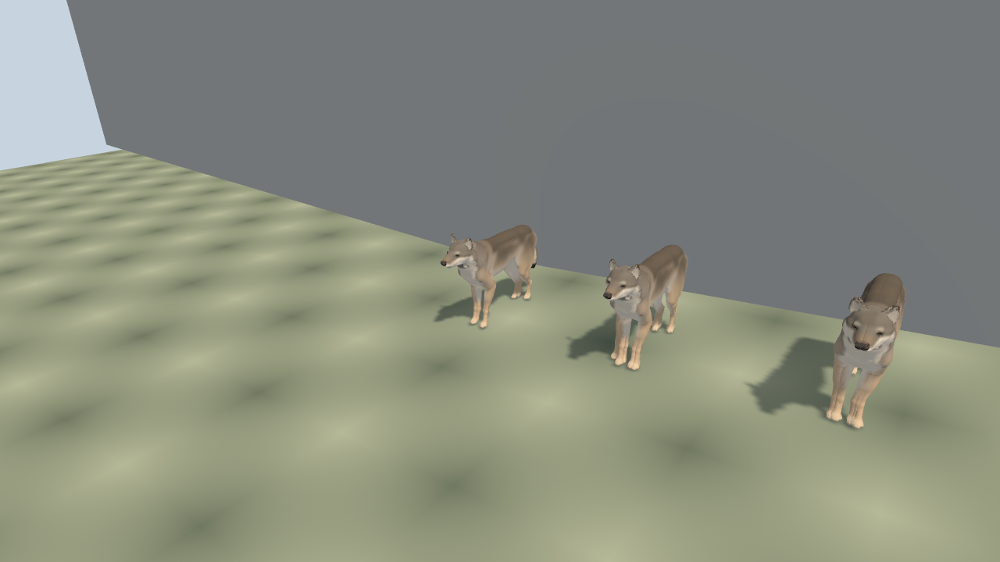
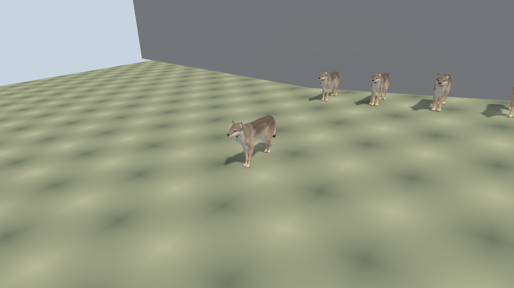
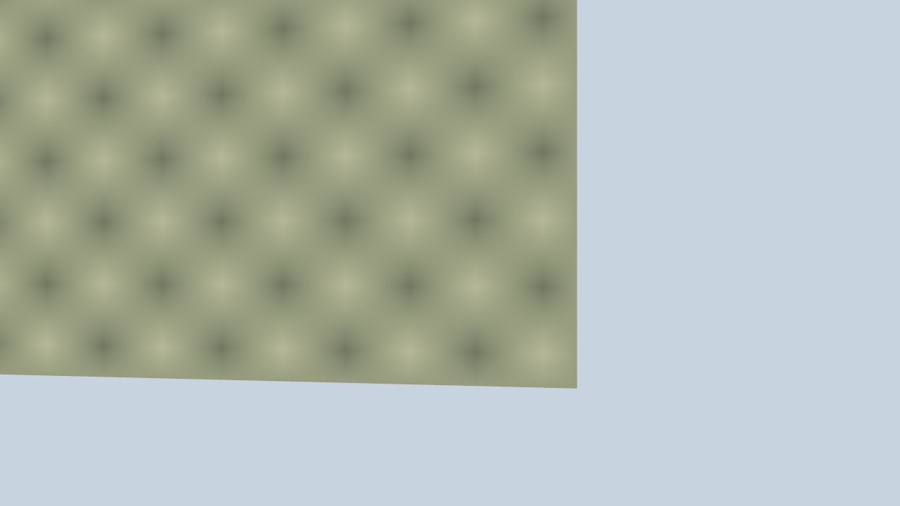

# Frozen Linux-native wolf qualification

Executed source `472925d7b42eae2b4c1de89604334a5d7552b693` passed animal 20/20 and frustum 19/19 original supported assertions. [The exact attempt receipt](attempt.json) records source/package/payload/bundle/host provenance, actual times, nine GPU DQS cases per arm and ownership before host spawn. [Cleanup](cleanup.json) confirmed no owned host or canonical holder at 15:22:37 UTC, with no foreign process modified.

Actual producer bridge responses report wall-clock; the raw reports retain their config-derived fixed-step label. The [animal clock observations](native-animals/clock-observations.json) and [frustum clock observations](native-frustum/clock-observations.json) preserve that distinction. Native runtimeDiagnostics and network channels are unavailable. The complete [animal captured-console guard](native-animals/console-check.json) and [frustum captured-console guard](native-frustum/console-check.json) separately pass with zero errors. Per-arm [animal exits](native-animals/exits.json), [frustum exits](native-frustum/exits.json) and lease records preserve the successful launches and cleanup.

These are the original drawing-buffer PNG bytes, all 1280×720. [Independent review](native-independent-image-review.md) confirms intact articulated wolves, shadows, wall stand-off and nonblank outside captures. Final standing images do not independently establish sit/lie pixels, exact paw contact or pixel parity.

| Capture | Original image |
| --- | --- |
| Wall |  |
| Turn |  |
| Stopped |  |
| Posture |  |
| Animal final |  |
| Outside |  |
| Frustum final |  |

[Publication hashes](publication-receipt.json) bind every copied file here to its original bytes. The original [full artifact receipt](artifact-receipt.json) describes the larger immutable attempt; it does not claim that every original log/input is published in this folder. All 2055 original inputs and full logs remain in the sealed attempt workspace.

This proves AC6 for the frozen consumer. Later observer/performance changes have separate provenance. Three original paired 1800-frame measurements and 50 real GPU lifecycle cycles remain open; no AC7 or 100% claim follows from these captures.
