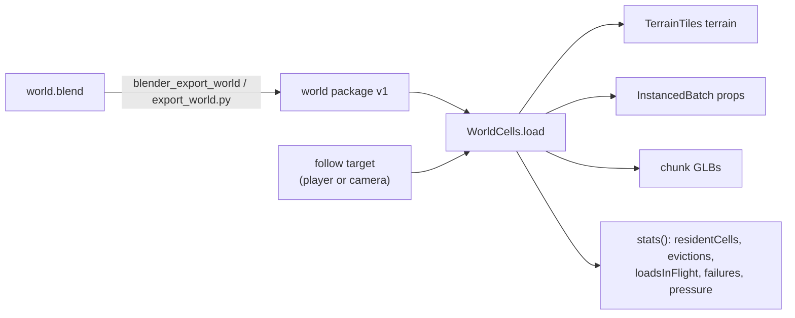

# Stream a Blender-authored world by cell

A world larger than a few hundred metres does not fit one GLB, and loading it whole spends memory
and startup time on cells the player never sees. ThreeNative splits the job in three: Blender
authors a **world package**, the exporter writes the **v1 package format**, and `WorldCells`
streams that package around a followed point at runtime.

This guide is the authoring-to-streaming path. The format is binding in
[`world-package.ts`](../../packages/core/src/world-package.ts) — read the types there rather than
a copy here.



## 1. Author the .blend

The exporter reads plain custom properties. Nothing is mandatory beyond the terrain marker.

| Marker | Where | Meaning |
| --- | --- | --- |
| `tn_world_terrain` | mesh object | Marks the heightmap mesh. Exactly one is required. |
| `tn_asset_id` | scatter emitter object | Stable id for an instanced asset. Falls back to the object name with a warning. |
| `tn_world_chunk` | collection | The collection's objects export as per-cell chunk GLBs. |
| `tn_max_distance` | scatter emitter | Cull distance in metres for that asset at runtime. |
| `tn_lod_distance` | scatter emitter | Overrides the default 60 m range at which the LOD1 is used. |

Hidden collections, excluded collections and `_`-prefixed collections are skipped, which is how a
game keeps construction geometry in the file without exporting it.

Scatter is read from the **render-mode** depsgraph, so a Geometry Nodes distribution switched by
`Is Viewport` exports at render density, not at the viewport share the author tuned for editing.
The emitter's Object Info node must set `As Instance = True`, or `instance_object` reports the
emitter instead of the asset and `tn_asset_id` is lost.

The exporter decides nothing about looks. Materials, colours, lights and curves come from the
.blend untouched; the runtime's terrain surface and any lighting are the game's, not the package's.

## 2. Export the package

Through the Blender MCP server (`threenative-blender`, package `threenative-blender-mcp`), call the
`blender_export_world` tool with `source`, `out` and `cell` (and optional `spacing`, default `2`).

From a shell, run the same recipe directly:

```sh
blender -b world.blend --python export_world.py -- --out /tmp/world --cell 64
```

The recipe is [`export_world.py`](../../packages/blender-mcp/gpl/recipes/export_world.py); it
imports `collapse_decimate` from `_common.py` for the LOD1 rather than reimplementing it.

The output directory is a package:

- `world.json` — the manifest: extent, cell size, terrain description, asset table, cell → run
  map and chunk list.
- `terrain/heightmap.u16` — raw little-endian `uint16`, `columns * rows` samples.
- `placements.bin` — little-endian `float32`, eight values per instance
  (`x, y, z, qx, qy, qz, qw, scale`), indexed by each run's `offset` and `count`.
- `assets/<id>.glb` and `assets/<id>_lod1.glb` — one model and one decimated LOD per referenced
  asset.
- `chunks/<collection>_<x>_<z>.glb` — per-cell chunks for every `tn_world_chunk` collection.

The exact shape of every field is in `world-package.ts` (`IWorldPackage`, `IWorldCell`,
`IWorldRun`, `IWorldAsset`). `validateWorldPackage` checks a parsed manifest — including the
heightmap and placement byte lengths — and collects every error with a named code instead of
throwing on the first.

## 3. Stream it at runtime

`WorldCells` lives at the `@threenative/core/world` subpath. Load a package, add it to the scene,
and let the frame drive it:

```ts
import { WorldCells } from "@threenative/core/world";
import { MeshNormalMaterial } from "three";

const world = await WorldCells.load({
  url: "/world/world.json",
  surface: new MeshNormalMaterial(),
  follow: player,
  ring: 1,
  budgets: { residentCells: 25, instances: 20_000, bytes: 8_000_000 },
});
scene.add(world);
```

- `url` is `world.json`; every other path a manifest names resolves relative to it.
- `surface` is the game's terrain material, handed straight to the composed `TerrainTiles`. The
  class creates no material, colour or geometry of its own.
- `follow` is read once per update; any object with a `position` (`x`, `z`) works, including the
  camera.
- `ring` is the Chebyshev radius in cells kept resident. A cell is only evicted beyond `ring + 1`, so
  residency has hysteresis and does not thrash on a cell boundary.
- `budgets` are hard caps. A cap that is reached increments `stats().pressure` and skips the
  farthest cell; it never throws mid-frame.
- `createCollider`, `terrain` (tile size, resolution, LOD distances, skirt depth) and `loadModel`
  are optional overrides.

`WorldCells` implements the framework's compute-driven contract with `processCadence: "render"`, so
registering it with `ctx.add(world)` is enough: the loop calls `update(renderer)` once per rendered
frame. Prop `maxDistance` batches are refiltered only after the follow point has moved an eighth of
the cull distance, and a chunk or asset load that completes after its cell was evicted is disposed
rather than attached.

Read back what is happening with `stats()`:

| Field | Meaning |
| --- | --- |
| `residentCells` / `residentKeys` | Cells resident right now. |
| `instances` | Placement instances the resident cells hold, before the `maxDistance` filter. |
| `loadsInFlight` | Asset and chunk loads that have not settled. |
| `evictions` | Cells released so far. |
| `failures` | Asset or chunk loads that rejected. |
| `pressure` | Requests rejected by a budget: `cells`, `instances`, `bytes`. |

Call `dispose()` to release every cell, batch, chunk model and the terrain.

## 4. Prove it

The in-repo fixture
[`world-flythrough.playtest.json`](../../examples/abyss-framework/playtests/world-flythrough.playtest.json)
flies the camera across the committed fixture package and asserts residency rises, cells are
evicted, loads settle and no load fails, with a measured p95 frame budget. The scene behind it is
[`WorldProbe.ts`](../../examples/abyss-framework/src/scenes/WorldProbe.ts), which uses only the
public exports.

```sh
CI=true node packages/playtest/dist/runner/cli.js \
  examples/abyss-framework/playtests/world-flythrough.playtest.json \
  --url 'http://127.0.0.1:5180/?world' \
  --server-command 'pnpm --filter abyss-framework dev --host 127.0.0.1 --port 5180 --strictPort' \
  --browser-recipe webgpu --headed
```

`--headed` matters: headless Chromium cannot capture WebGPU here and silently serves it from a CPU
rasteriser. A run that does not report a real `adapter.info` is not evidence — check
`artifacts/playtest/capture.json`.
