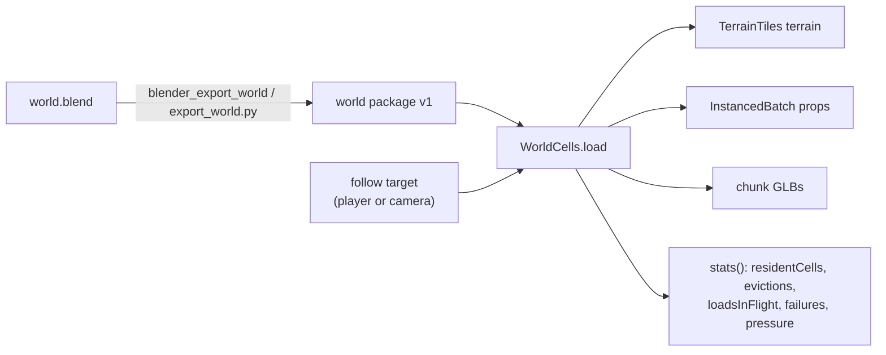

# Stream a Blender-authored world by cell

A world larger than a few hundred metres does not fit one GLB, and loading it whole spends memory
and startup time on cells the player never sees. ThreeNative splits the job in three: Blender
authors a **world package**, the exporter writes the **v1 package format**, and `WorldCells`
streams that package around a followed point at runtime.

This guide is the authoring-to-streaming path. The format is binding in
[`world-package.ts`](../../packages/core/src/world-package.ts) — read the types there rather than
a copy here.


```mermaid
flowchart LR
  Blend["world.blend"] -->|blender_export_world / export_world.py| Package["world package v1"]
  Package --> Runtime["WorldCells.load"]
  Runtime --> Terrain["TerrainTiles terrain"]
  Runtime --> Instances["InstancedBatch props"]
  Runtime --> Chunks["chunk GLBs"]
  Follow["follow target<br/>(player or camera)"] --> Runtime
  Runtime --> Stats["stats(): residentCells, evictions,<br/>loadsInFlight, failures, pressure"]
```

## 1. Author the .blend

The exporter reads plain custom properties. Nothing is mandatory beyond the terrain marker.

| Marker | Where | Meaning |
| --- | --- | --- |
| `tn_world_terrain` | mesh object | Marks the heightmap mesh. Exactly one is required. |
| `tn_asset_id` | scatter emitter object | Stable id for an instanced asset. Falls back to the object name with a warning. |
| `tn_world_chunk` | collection | The collection's objects export as per-cell chunk GLBs. |
| `tn_max_distance` | scatter emitter | Cull distance in metres for that asset at runtime. |
| `tn_lod_distance` | scatter emitter | Overrides the default 60 m range at which the LOD1 is used. |

Hidden collections, excluded collections and `_`-prefixed collections are skipped, which is how a
game keeps construction geometry in the file without exporting it.

Scatter is read from the **render-mode** depsgraph, so a Geometry Nodes distribution switched by
`Is Viewport` exports at render density, not at the viewport share the author tuned for editing.
The emitter's Object Info node must set `As Instance = True`, or `instance_object` reports the
emitter instead of the asset and `tn_asset_id` is lost.

The exporter decides nothing about looks. Materials, colours, lights and curves come from the
.blend untouched; the runtime's terrain surface and any lighting are the game's, not the package's.

## 2. Export the package

Through the Blender MCP server (`threenative-blender`, package `threenative-blender-mcp`), call the
`blender_export_world` tool with `source`, `out` and `cell` (and optional `spacing`, default `2`).

From a shell, run the same recipe directly:

```sh
blender -b world.blend --python export_world.py -- --out /tmp/world --cell 64
```

The recipe is [`export_world.py`](../../packages/blender-mcp/gpl/recipes/export_world.py); it
imports `collapse_decimate` from `_common.py` for the LOD1 rather than reimplementing it.

The output directory is a package:

- `world.json` — the manifest: extent, cell size, terrain description, asset table, cell → run
  map and chunk list.
- `terrain/heightmap.u16` — raw little-endian `uint16`, `columns * rows` samples.
- `placements.bin` — little-endian `float32`, eight values per instance
  (`x, y, z, qx, qy, qz, qw, scale`), indexed by each run's `offset` and `count`.
- `assets/<id>.glb` and `assets/<id>_lod1.glb` — one model and one decimated LOD per referenced
  asset.
- `chunks/<collection>_<x>_<z>.glb` — per-cell chunks for every `tn_world_chunk` collection.

The exact shape of every field is in `world-package.ts` (`IWorldPackage`, `IWorldCell`,
`IWorldRun`, `IWorldAsset`). `validateWorldPackage` checks a parsed manifest — including the
heightmap and placement byte lengths — and collects every error with a named code instead of
throwing on the first.

## 3. Stream it at runtime

`WorldCells` lives at the `@threenative/core/world` subpath. Load a package, add it to the scene,
and let the frame drive it:

```ts
import { WorldCells } from "@threenative/core/world";
import { MeshNormalMaterial } from "three";

const world = await WorldCells.load({
  assets: ctx.assets,
  url: "world/world.json",
  surface: new MeshNormalMaterial(),
  follow: player,
  ring: 1,
  budgets: { residentCells: 25, instances: 20_000, bytes: 8_000_000 },
});
scene.add(world);
```

- `url` is a **logical** path: the package's own `world.json`, every other file it names, and every
  model GLB resolve through `IAssetLoader`, so a package under `assets/world/` served as
  content-addressed output with an `assets.manifest.json` loads like a raw one. A leading `/` is
  accepted and stripped, so an uncompiled `public/world` still works.
- `assets` is the loader those paths resolve through. Pass `ctx.assets` inside a game — it is the
  one built with the renderer, so a KTX2 texture decodes; the default is a fresh
  `createAssetLoader()` per load, which reads a manifest and falls back to the authored name and
  the project's `assets/` sources, but cannot transcode.
- `surface` is the game's terrain material, handed straight to the composed `TerrainTiles`. The
  class creates no material, colour or geometry of its own.
- `follow` is read once per update; any object with a `position` (`x`, `z`) works, including the
  camera.
- `ring` is the Chebyshev radius in cells kept resident. A cell is only evicted beyond `ring + 1`, so
  residency has hysteresis and does not thrash on a cell boundary.
- `budgets` are hard caps. A cap that is reached increments `stats().pressure` and skips the
  farthest cell; it never throws mid-frame.
- `rebuildsPerUpdate` caps how many cell-asset batches one `update` refilters, nearest cell first;
  it defaults to 16. A cell that did not get its turn keeps drawing what it has.
- `terrain` carries the composed `TerrainTiles` options: tile size, resolution, LOD factors and
  distances, skirt depth, plus the two radii below.
- `transparentScatter` is how a scattered part whose own material is `transparent` is drawn —
  `"cutout"` (default) or `"blend"`.
- `createCollider` and `loadModel` are optional overrides.

### Terrain reaches further than the props

`terrain.streamRadius` is the terrain residency radius in tiles, and it defaults to `ring`, so a
world streams ground and props over the same square. Raise it alone to put the ground out to the
horizon while the props stay near: the default `lodDistances` are `tileSize` multiples, so the far
tiles of the wider ring take the coarser levels on their own. `terrain.colliderRadius` is the
separate Chebyshev radius that gets a `createCollider` body, and it also defaults to `ring`; a tile
crossing it has its body created or disposed as it goes, so a wide render ring does not cost a
physics body for every tile in it.

```ts
const world = await WorldCells.load({
  assets: ctx.assets,
  url: "world/world.json",
  surface: new MeshNormalMaterial(),
  follow: player,
  ring: 2,
  budgets: { residentCells: 49, instances: 200_000, bytes: 8_000_000 },
  // Ground out to 81 tiles, colliders only on the 25 nearest, props over the ring's 25 cells.
  terrain: { streamRadius: 4, colliderRadius: 2 },
});
```

`WorldCells` implements the framework's compute-driven contract with `processCadence: "render"`, so
registering it with `ctx.add(world)` is enough: the loop calls `update(renderer)` once per rendered
frame. Prop `maxDistance` batches are refiltered only after the follow point has moved an eighth of
the cull distance, and a chunk or asset load that completes after its cell was evicted is disposed
rather than attached.

A refilter that cannot change anything is skipped, not deferred. Every placement of a cell lies
inside that cell's `cellSize` square, so the distances from where the batch was built and from where
the follow point is now bracket every distance its placements can have had; when no `lods` switch or
cull distance of the asset falls in that span, the same placements draw at the same levels, and the
batch is measured against the position it was actually built from on the next move. What is genuinely
stale is refiltered nearest cell first, `rebuildsPerUpdate` of them per frame, so a fast player
streams a few stale-but-drawn batches rather than rebuilding every resident cell in one frame.

An asset's `lods` are consumed with it: every level is loaded through the same loader, limiter and
asset pipeline as the asset's own GLB, and each placement is drawn by the level its own distance
selects — `lods[i]` beyond its `distance`, the asset's own GLB nearer than that. That is one
`InstancedBatch` per level per cell, refiltered on the same trigger as `maxDistance` (an eighth of
the nearest distance the batching can be crossed at, whichever boundary that is), so the switch is a
hard one: nothing crossfades and a placement that crosses pops. A level that will not load falls
back to the one above it and is counted like any other failed load, and a `lods` entry at or beyond
`maxDistance` is never loaded at all, because an instance that far out is culled anyway.

A GLB is drawn per part, not per model. Several primitives in one GLB — a tree's bark `OPAQUE` and
needles `BLEND` — load as a `Group` of one child `Mesh` each, and each of them gets its own
`InstancedBatch` with its own geometry and material, named `cell:asset:level:part`. The placement's
instance matrix is the placement composed with the part's own transform inside the model, so a part
that sits above the model origin draws above the placement. `SkinnedMesh` parts are skipped: an
instanced copy would draw one rest pose.

A part whose own material is `transparent` draws as an alpha cutout by default, because an
`InstancedMesh` cannot sort its instances: a blended material would draw in submission order and pay
overdraw. The part gets one clone of its material per asset — never per cell, and never by mutating
the GLB's own — with `transparent: false`, `depthWrite: true` and an `alphaTest` of the material's
own cutout point, or `0.5` when it names none. The clone is released with the rest of the asset.
`transparentScatter: "blend"` draws the material as authored instead.

Read back what is happening with `stats()`:

| Field | Meaning |
| --- | --- |
| `residentCells` / `residentKeys` | Cells resident right now. |
| `instances` | Placement instances the resident cells hold, before the `maxDistance` filter. |
| `loadsInFlight` | Asset and chunk loads that have not settled. |
| `evictions` | Cells released so far. |
| `rebuilds` | Cell-asset batches refiltered so far, across every update. |
| `failures` | Asset or chunk loads that rejected. |
| `pressure` | Requests rejected by a budget: `cells`, `instances`, `bytes`. |

Call `dispose()` to release every cell, batch, chunk model and the terrain.

### Virtualized geometry, and what is not culled yet

Clustered geometry ships: `ClusteredMesh` (a `Mesh` that culls and LOD-selects clusters on the GPU
and draws them through an indirect record) and `ClusteredBatch` are exported from `@threenative/core`,
and a `WorldCells` package gets the same treatment through `gpuScene`, which is **on by default**
wherever the backend can run it. Nothing here needs to be enabled to get it, and a backend without
compute or `drawIndexedIndirect` falls back to the CPU path and says so in `stats().gpuScene`.

What does not ship is occlusion culling. Nothing in `packages/core/src` reads a previous frame's
depth to skip geometry — no depth pyramid, no HZB — so a cell behind a hill is submitted and culled
by frustum only. It was declined twice on measured headroom and is now a single go/no-go:

[PRD-489](../PRDs/done/PRD-489-gpu-scene-occlusion-culling.md) — occlusion culling re-tested
on the GPU scene. Read it before assuming a cell is free to stream wide; the answer today is that it
is not.

## 4. Prove it

The in-repo fixture
[`world-flythrough.playtest.json`](../../examples/abyss-framework/playtests/world-flythrough.playtest.json)
flies the camera across the `world-v1` package committed as the example's own
[`assets/world/`](../../examples/abyss-framework/assets/world) source and asserts residency rises,
cells are evicted, loads settle and no load fails, with a measured p95 frame budget. The scene
behind it is
[`WorldProbe.ts`](../../examples/abyss-framework/src/scenes/WorldProbe.ts), which uses only the
public exports. Build first: the scenario runs against compiled, content-addressed output, not
against a dev server.

```sh
pnpm --filter abyss-framework build
CI=true node packages/playtest/dist/runner/cli.js \
  examples/abyss-framework/playtests/world-flythrough.playtest.json \
  --url 'http://127.0.0.1:5181/?world' \
  --server-command 'pnpm --filter abyss-framework preview --host 127.0.0.1 --port 5181 --strictPort' \
  --browser-recipe webgpu --headed
```

`--headed` matters: headless Chromium cannot capture WebGPU here and silently serves it from a CPU
rasteriser. A run that does not report a real `adapter.info` is not evidence — check
`artifacts/playtest/capture.json`.
