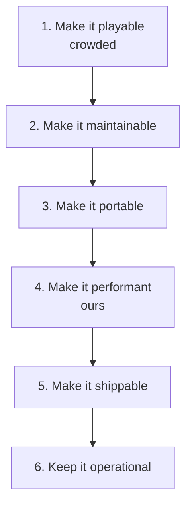

# Positioning

**Status:** proposal, 2026-08-02. Not binding. See [CONFLICTS.md](CONFLICTS.md). The
charter wins wherever this file disagrees with it.

## The one-line claim

> **Build real games with TypeScript and AI. One project. Web, iOS, Android. You own the code.**

**Not yet earned — "iOS, Android" has no physical-device evidence.** Use the evidence-bound
wording in [VALUE-PROPOSITION.md](VALUE-PROPOSITION.md) in anything a stranger reads.

Internally: *NestJS for Three.js* — standardize architecture, integrate lower-level
pieces, hide nothing. Externally that analogy means nothing to a buyer. The buyer-facing
frame is **Expo for AI-native Three.js games**.

## What we do not build

**Not another prompt-to-browser-game generator.** That category is filling fast, and the
demo is the easy half.

| Product | What it already does well |
|---|---|
| Rosebud | Prompt → editable JS/Three.js game, asset generation, instant web publish |
| GDevelop | No-code + AI, cloud projects, exports to mobile/desktop/web |
| PlayCanvas | Polished collaborative browser 3D editor, paid private/org projects |
| Unity, Roblox | Contextual AI assistants and MCP-style project control |

*(Vendor claims as of the 2026-08-02 strategy input; not independently verified in this
repo. Treat as directional, not as data.)*

"There is a chat box in the editor" is now a baseline feature, not a moat.

## The stage we own

This restates the cross-platform promise — *"ships to iOS; still works after the 20th
change; has proof it isn't broken"* — in market terms. Stages 2 and 4 are already
partly real in this repo: `ctx.entities` (PRD-006) makes state addressable,
`@threenative/playtest` makes "it isn't broken" checkable.

## Three product surfaces

| Surface | What it is | Exists today? |
|---|---|---|
| **Runtime** | Open-source engine and framework: `@threenative/core`, `physics`, `ui`, `playtest`, `create-threenative`, `runtime-native`, `studio` | **Yes** — seven packages |
| **Studio** | Local-first creation, inspection, testing | **Barely** — `DebugOverlay`, `window.__THREENATIVE__.snapshot()`. Full Studio is deferred (CONFLICTS #1) |
| **Cloud** | Builds, device testing, releases, operations | **No.** Gated on a native render path running on a physical phone |

Runtime stays permissively licensed and fully usable offline. That is what makes the
paid layer credible rather than extractive.

## Who this is for

**Primary: TypeScript developers who want to make games.**

- React / React Native / TypeScript developers
- Indie hackers and creative technologists
- Three.js and R3F developers
- Studios and agencies of 1–5 engineers

Their job to be done:

> "I can build a game in TypeScript. I do not want to assemble rendering, mobile input,
> native builds, worker runtimes, asset optimization, lifecycle, profiling and store
> deployment myself."

They read code, use Git, tolerate an early product, and pay for build and deploy
productivity. They are also the only audience for which *"the framework
must win even when the AI ignores it"* is a selling point rather than a curiosity.

**Secondary, later: AI-first creators.** Same project on disk, simpler surface. The
hard rule: **developer mode and creator mode produce the same real TypeScript project.**
No opaque proprietary format that becomes a dead end the moment the model gets stuck.

## Genres we aim at

Platformers and endless runners · top-down action and survival · small racing and arcade ·
puzzle · cozy exploration · turn-based and card · educational and branded games.

Small multiplayer, much later.

## Genres we refuse

AAA open worlds · console production · photorealistic cinematics · large-scale physics
simulation · MMO worlds · Unity Asset Store compatibility.

The refusal is not modesty. A narrow genre set is what makes templates, performance
budgets and automated playtests reliable enough to be worth paying for.
