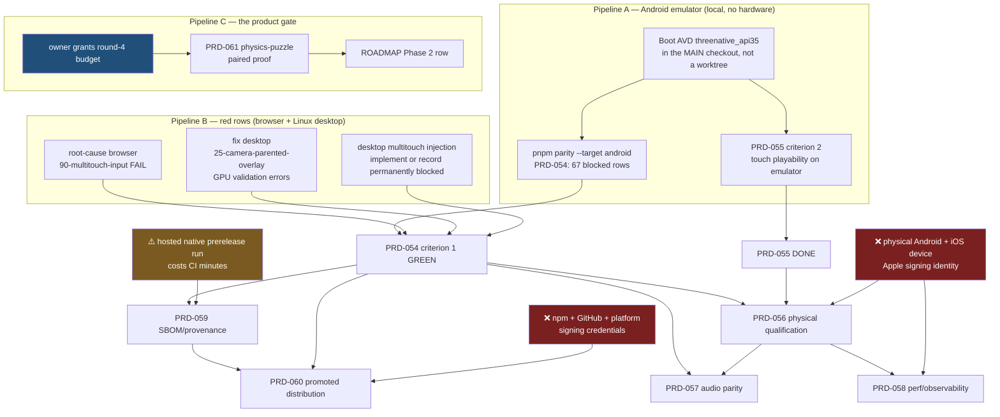

# Unblock chain — what unblocks what, 2026-08-10

**Proposal, not a commitment.** `CHARTER.md` wins if it disagrees; `ROADMAP.md` owns phase
state and this file owns only the ordering between the open and blocked PRDs. Every claim
below is either a file that exists on disk or a literal line from a verification report —
nothing here is a run result. **No pipeline in this file has been executed.**

Reconciled against: `docs/verification/prd-054-aggregate-rerun-2026-08-10.md`,
`docs/verification/prd-055-touch-criterion-2-2026-08-10.md`,
`docs/verification/prd-061-round-4-2026-08-10.md`, and `docs/PRDs/native/blocked/README.md`.

## The state in one paragraph

`docs/PRDs/` holds exactly one open PRD — **PRD-061** — and it is stopped on an owner budget
grant, not on any technical prerequisite. Every other PRD (045, 054–060) sits in
`docs/PRDs/native/blocked/`. Three pipelines can start without any hardware or credential
this machine lacks; the rest are downstream of them or terminal here.

## The chain



## Ranked starts

| # | Pipeline | Unblocks | Effort | Needs from the owner |
|---|---|---|---|---|
| 1 | **A** — emulator parity rerun | PRD-054 Android rows + PRD-055 | 1–2h if the rows pass; a day if they fail | nothing |
| 2 | **C** — PRD-061 round 4 | beta row 3, the Phase 2 exit gate | most of a day | **a round-budget grant** |
| 3 | **B** — two red rows | the rest of PRD-054 criterion 1 | half a day each; root cause unknown | nothing |
| 4 | PRD-059 SBOM | PRD-060 | after PRD-054 | approve a hosted prerelease run (CI minutes are scarce) |
| 5 | PRD-056 / 058 / 060 | — | — | physical devices, an Apple identity, release credentials — **terminal on this machine** |

**A and C are independent** and can run at the same time. B joins A at the same node
(PRD-054 criterion 1); it does not need A to finish first.

## Pipeline A — why it is environment, not hardware

The 2026-08-10 aggregate rerun reported Android `0 pass / 0 fail / 67 blocked`. Both stated
reasons are environmental:

1. `TN_PARITY_ANDROID_DEVICE_BLOCKED: No online Android device found (none listed).` Four
   AVDs exist on this machine, including `threenative_api35` and `threenative-prd050`. None
   was booted for that run.
2. The Android multitouch supplemental reached Gradle and failed because
   `packages/runtime-native/third_party/sdl3-android/SDL3-3.2.8.aar` was absent. That file is
   present in the main checkout. The failing run's paths are under
   `.worktrees/batch-2026-08-10-final-contract-repair/`, and `third_party/` is untracked by
   charter, so no worktree ever has the downloaded deps.

Neither is an SDK, NDK, toolchain or sandbox blocker — the report says so explicitly. Running
parity from the main working tree with an emulator online is therefore expected to produce a
real Android result for the first time. **Expected, not observed.** If the 67 rows then fail
on their merits, that is a genuine PRD-054 finding and belongs in the ledger, not a retry.

This is also the highest-leverage single action on the board: PRD-054 gates PRD-056, 057, 059
and 060.

## Pipeline B — the two rows that are not about Android

| Row | Target | Observed | What clearing it needs |
|---|---|---|---|
| `90-multitouch-input` | browser | red/failing | a root cause; the aggregate rerun explicitly did not establish one |
| `25-camera-parented-overlay` | Linux desktop | red with GPU validation errors | a fix in the native render path |
| desktop multitouch | Linux desktop | blocked | native injection is unsupported; either implement it or record it permanently blocked with the reason |

The third row is a decision, not a bug. Recording it blocked is a legitimate outcome as long
as PRD-054's criterion states it — the aggregate must never round a blocked row up to pass.

## Pipeline C — PRD-061, the only PRD pointing at beta row 3

`pnpm round:next` prints:

```text
stop round 3
Stop condition recorded: budget. Resolve it before resuming the round.
```

That is an owner decision with no technical prerequisite: PRD-061 needs no device, no
credential and no toolchain beyond what `pnpm test` already requires. Its phases:

1. Phase 0 — `docs/benchmark/genres/physics-puzzle/` (brief, reference, sealed proof), plus a
   no-op-physics build **observed failing** that proof.
2. Phase 1 — the vanilla arm's dependency-freedom sentence, pinned by a test in
   `scripts/__tests__/` that fails if the sentence is removed.
3. Phase 2 — both arms built uninformed under the PRD-021 firewall → archive, proof, capture,
   blind judge, pair.
4. Phase 3 — `docs/verification/round-4-<date>.md` with gaps, dispositions, deletions, gates.
5. Phase 4 — the `ROADMAP.md` Phase 2 row states the measured outcome, **including "still not
   green"** if that is the result.

Round 3 lost on `open-world` because every brief requirement was user-space by §11 rule 3.
`physics-puzzle` is chosen so the sealed proof cannot pass without physics the framework
ships. Screenshot and visual steps need `xvfb-run -a -s '-screen 0 1600x900x24'`.

## Terminal blockers — what no pipeline here can reach

| Blocker | PRDs it stops |
|---|---|
| A physical Android device and a physical iOS device | 056, 058, and the physical rows of 045 |
| An Apple signing identity and provisioning profile | 056, 060, every iOS row |
| npm, GitHub and platform-signing release credentials | 060 |
| A hosted same-candidate native prerelease with artifact URLs and hashes | 059 |

Emulator and simulator results never become physical-driver, arm64-performance or phone
frame-rate evidence. No pipeline above licenses a "mobile works" claim.

## Known stale pointer

`ROADMAP.md`'s Open table routes PRD-057…060 to `docs/PRDs/production-readiness/`. That
directory is now empty — all four moved to `docs/PRDs/native/blocked/` in the 2026-08-10
batch. Fixing the pointer is a separate one-line change.
