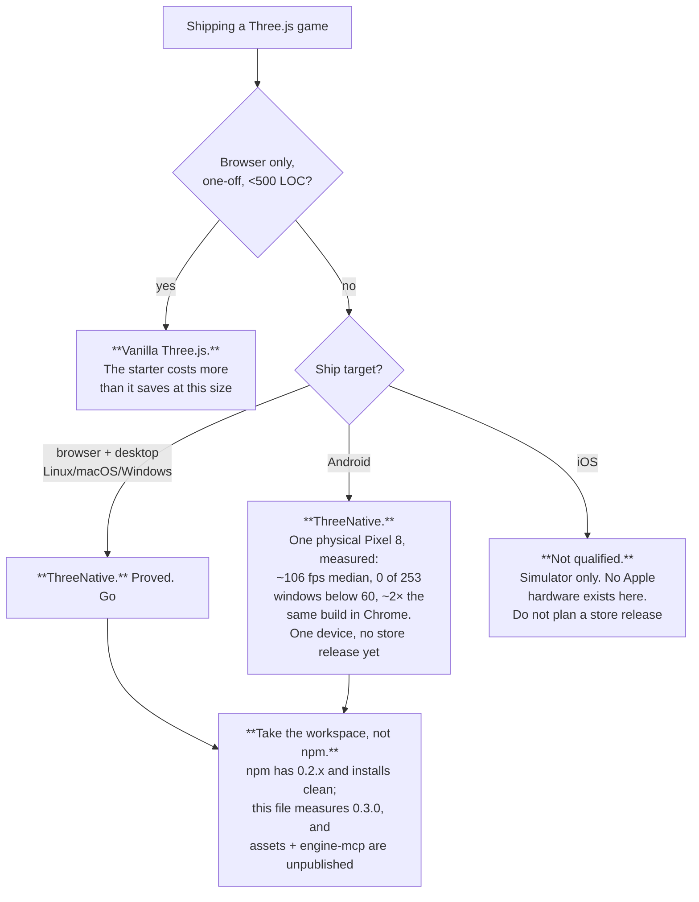

# Value proposition — "would I use this instead of vanilla Three.js?"

> **Open limitations live in [`CURRENT-CHALLENGES.md`](../CURRENT-CHALLENGES.md).** This document
> is a strategy record; it is not the place to look for what is currently broken or unproven.

*Last measured 2026-08-30.* Axes 1, 4 and 5 were re-run; axes 2 and 3 were re-evidenced without
moving. Two claims that no longer had a command behind them were replaced rather than softened:
`scripts/count-loc.ts` stopped printing the ratio this file quoted (it writes
[LOC.md](../benchmark/LOC.md) now), and `SceneCollapse` is called `SceneRenderProjection`.

This is the only place that answers the title question. It owns the score — the five axes,
what measures each one, the number it last returned, and whether the claim is earned yet.
The roadmap used to carry a copy of that table; it was deleted there rather than kept in
sync.

Two rules, and they are the whole point of the file:

1. **Every claim cites a run.** A row with no verification file or command behind it gets
   deleted, not softened.
2. **The charter wins any disagreement.** Nothing here changes what the framework is.

Neighbours: [POSITIONING.md](POSITIONING.md) is what we'd tell a buyer,
[BUSINESS-MODEL.md](BUSINESS-MODEL.md) is what we'd charge them. Both are untested
2026-08-02 proposals, and where they claim more than this file does, this file is right.

## The short answer

> **Today: use it if you are shipping a Three.js game to the browser, a desktop binary and
> an Android phone, you want an agent to author the content, and you want the result
> asserted rather than eyeballed — taking the workspace rather than the registry if you want
> the engine this file measures. Vanilla Three.js is still the defensible choice for a
> browser-only one-off, and for anything that must ship to iOS hardware.**

**The registry clause is new on this pass, and it is narrower than it sounds.** It installs:
`npx create-threenative@0.2.2` scaffolds a project whose `npm install` resolves every package from
`registry.npmjs.org` with zero `file:` or `link:` specifiers and whose `npm run build` succeeds —
alpha row A2 is green on exactly that run. What is not on the registry is *this* engine. The
published line is **0.2.x**; the workspace is **0.3.0**, so every number below is measured on
source a stranger cannot `npm install` today, and two packages have never been published at all
(`@threenative/assets`, `threenative-engine-mcp`).

**The publish pipeline is not the gap.** `.github/workflows/npm-release.yml` names all eight
publishable packages in its generated publish set, and `pnpm publish:check` fails the release if a
package that exists and is not private is missing from that list — a package cannot be silently
dropped. `scripts/release.ts` then publishes them in dependency order as one consistent set. The
lane has simply never fired: it triggers on a `v*` tag push, **no `v*` tag has ever been pushed**,
`gh run list --workflow npm-release.yml` is empty, and `gh release list` is empty. The 0.2.x line
on npm predates two of the packages, which is why they are absent.

Three things gate the first real run, in the order they bite:

1. **CI has never had a green run, for any commit.** `main` is green locally (`pnpm typecheck`,
   `pnpm lint`, `pnpm test` 2585/2585) and the same tree fails in CI on four native tests whose
   binaries the CI job never builds
   ([the record](../verification/ci-has-never-been-green-2026-08-29.md)).
2. **No native release exists**, because `native-release.yml` refuses to build without a successful
   CI push run on `main`. `pnpm publish:check` reports the consequence directly: *"No prebuilt
   release exists at …/runtime-native-v0.3.0/prebuilt-lock.json"*.
3. **No tag.** Everything above is a precondition of pushing `v0.3.0`, and nothing has pushed it.

So publication is a chain that starts at one green CI run, not at a missing package in a list.

That sentence is narrower than [POSITIONING.md](POSITIONING.md)'s *"Build real games with
TypeScript and AI. One project. Web, iOS, Android."* — the gap is iOS, and it is the honest
subject of this document.

## The score — axis by axis

**Out of 100, five axes of 20, each tied to an instrument that already exists.** No axis
scores on opinion; if the instrument has not run, the axis does not move.

The axes measure **what a user gets**, not the delta against a vanilla control. That is a
deliberate change from the previous version of this file, which scored all five axes as
"beats vanilla" and so could never exceed a tie: the paired benchmark hands the vanilla arm
our own scaffolding *and* `playtest` on purpose, which is correct benchmark design and a
useless value ledger. **Standing total: 72/100** (was 67 on 2026-08-12: axis 1 +1, axis 2 +3, axis 5 +1), on a scale that
is not comparable to the ~60/100 the old axes reported.

| # | Axis | The claim a user would care about | Instrument | Measured | Score |
|---|---|---|---|---|---|
| 1 | **Start a project** | "There is something to run in a minute, and an agent can find what already exists" | CI `scaffold-smoke`, `pnpm test:templates`, [default-retention measurement](../verification/scaffold-default-2026-08-12.md), `packages/create-threenative/capabilities.json` | Seven templates — `minimal`, `platformer`, `starter`, `action-rpg`, `defense`, `racing`, `shooter` — are scaffolded and playtested by the template gate; the one standing red in that gate was diagnosed as a scenario bug and closed (the shooter capture photographed the loading screen, not a capture-lane fact). The small endless-runner arm retained 15/18 starter source paths (83.33%), so starter remains the default. **New since the last pass:** a **194-entry capability manifest**, regenerated by `pnpm build` and served to a project by `threenative-engine-mcp`; every template ships the render chain and `resolutionScale: "auto"` and says what ran; `npx threenative doctor` answers all three questions a game author has | **17/20** — **+1 for the manifest**, the first thing that answers "what is already installed" before an agent writes it again; still docked because 42.89% of original starter lines survive as rewrite cost |
| 2 | **Author the content** | "An agent can find and make my assets" | the two pinned MCP servers, `asset-mcp-tools.json`, [the 2026-08-30 rerun](../verification/prd-032-rerun-2026-08-30.md) | `threenative-asset-mcp@0.4.0` (32 tools) and `threenative-sculpt-mcp@0.1.0` (5 tools + 31 resources) install and launch in all seven templates via `.mcp.json`. **On a sealed scenery brief, the MCP arm beat the no-MCP control 4/4/4/4 against 2/3/2/2, `VERDICT` for the MCP arm at high confidence** — and gameplay readability, the criterion that killed the 2026-08-09 gate 2/5 against 5/5, inverted to 4 against 2 in its favour. Six CC0 ambientCG textures, every licensing line traced to a tool result | **13/20** — first honest win, **but the run's typecheck precondition was compromised by a template defect that predates both arms**, the evidence is one brief and one critic, and the sculpt MCP still has no preference or token telemetry. The 2026-08-09 crate failure stands unretouched |
| 3 | **Know it works** | "My game is asserted, not eyeballed" | `@threenative/playtest`, exit codes, alpha-bar row A3 | Fails closed: malformed assertion throws, missing bridge exits `2`, a pre-satisfied assertion reports `TN_PLAYTEST_ASSERTION_TRIVIAL`. **Re-proved 2026-08-29 against the shipped runner**: an empty assertion set exits `1` with `TN_PLAYTEST_SCENARIO_NO_ASSERTIONS` while the true-positive control passes on the same runner, project and browser recipe. The runner now also refuses to grade a lane it cannot observe, names each scenario's verdict as it finishes, carries tick counts in the summary, and declares a software adapter out loud instead of silently accepting SwiftShader. Same scenario runs on device with `--target android` or `--target ios` | **18/20** — score unchanged, evidence stronger; still docked only because a plain Three.js project can install the same bridge |
| 4 | **Run it natively** | "It ships where vanilla can't, and faster" | the device matrix, `pnpm native:verify:desktop`, `pnpm parity:ledger` | Browser, Linux/macOS/Windows desktop, iOS **simulator**, and a **physical Pixel 8**: 2,282-mesh platformer, **~106 fps median, 0 of 253 windows below 60**, ~2× the same build in Chrome on the same phone. On an identical-scene load test, **3.0–3.9× Godot 4.7.1** on web, desktop and the same phone, all three pairs `GATE PASS`. **Tier 1 recomputed 2026-08-29** from three reports that exist on this machine, every cell recomputable: browser **73 pass / 0 fail / 1 blocked**, desktop **71 / 1 / 2** (up from 65/1), Android emulator **0 executed of 74** — blocked before Gradle on a stale SDL3 pin. The frame budget now reports **real GPU milliseconds from a timestamp query** rather than an estimate, and the adaptive resolution scaler says out loud when it runs out of room | **15/20** — desktop improved and the ledgers became recomputable, but the Android emulator lane went from partly-run to not-run, so the axis does not move; still **one phone, one thermal state, no iOS hardware, no store release** |
| 5 | **Write less code** | "You will write less than vanilla" | `pnpm sweep:pair` → `authoredLoc`, `pnpm tsx scripts/count-loc.ts` | Wins 2 of 5 genres on the corpus measure: platformer **−187**, topdown **−695**; loses endless **+442**, exploration **+95**, open-world **+8**. **The owner settled the cost column on authored lines on 2026-08-15**, and on that measure the framework won both rounds that have run since — round 9's platformer pair **authored 379 fewer lines** while shipping 162 more. `count-loc`'s newest kill-switch row: cloth is **46 framework lines against 759 hand-written** (711 implementation + 48 callers) across flag, cape and curtain — **93.9% smaller**, and the script throws if that margin ever falls below 2× | **9/20** — **+1** for two paired rounds on the settled measure and a mechanism that clears the kill switch by 16×; against it, the frozen-source ratchet drifted the wrong way (below) |

Evidence: [phase-1-2026-08-08.md](../verification/phase-1-2026-08-08.md) (axis 5, four
genres), [round-3-2026-08-09.md](../verification/round-3-2026-08-09.md) (open-world),
[runtime-perf-state.md](../verification/runtime-perf-state.md),
[native-visual-parity-2026-08-11.md](../verification/native-visual-parity-2026-08-11.md),
[cold-start-and-hitches-2026-08-11.md](../verification/cold-start-and-hitches-2026-08-11.md)
and
[runtime-perf-state.md](../verification/runtime-perf-state.md)
(axis 4, physical device, plus the browser and Godot comparison),
[tier-1-2026-08-29.md](../verification/tier-1-2026-08-29.md) (axis 4 reliability — it supersedes
the 08-10 and 08-15 ledgers, whose `--out` reports name a checkout that no longer exists on this
machine and so cannot be recomputed at all),
[PRD-032](../PRDs/done/PRD-032-asset-discovery-mcp.md) and
[PRD-049](../PRDs/done/PRD-049-sculpt-from-reference-mcp.md) (axis 2),
[round-9-2026-08-15.md](../verification/round-9-2026-08-15.md) and
[LOC.md](../benchmark/LOC.md) (axis 5),
[alpha-a3-2026-08-29.md](../verification/alpha-a3-2026-08-29.md) (axis 3),
[ci-has-never-been-green-2026-08-29.md](../verification/ci-has-never-been-green-2026-08-29.md)
(the install clause above).

### Why LOC cannot get us to 80 on axis 5

Plumbing is ~30% of a game and is **already halved** — 138 → 74 on the static control, **53.6%** —
and gameplay is permanently the user's to write. **The ceiling on the cost axis alone is roughly
40/100.** No amount of further framework code moves it, so a proposal justified by "it will
save the user lines" is arguing against arithmetic.

The cloth number is the exception that proves the shape of the rule, not a counter-example: 46
against 759 is a **93.9%** cut because a soft body is repeated mechanism a game writes three times
and never wants to own, which is exactly the narrow band the ceiling argument leaves open. It moves
the axis by one point, not by ten, and a second such win would move it by one more.

The win condition on that axis is the paired arm, agent against agent (`pnpm sweep:pair`),
not the static `abyss` ratio. That ratio is a **regression ratchet** against frozen
hand-written source — see `docs/benchmark/PROTOCOL.md` — and `scripts/count-loc.ts` no longer
prints it, it writes [LOC.md](../benchmark/LOC.md). Vanilla still wins it on the total, and **the
number moved the wrong way since the last pass: 91.3% → 93.2%**, plumbing 52.9% → 53.6%. That is
the ratchet reporting correctly, not a defeat being hidden, and it is the reason axis 5 gained one
point rather than two.

### What the paired benchmark cannot show

The benchmark deliberately gives the vanilla arm the scaffolding and the `playtest` bridge,
so **axes 1 and 3 win no benchmark column by construction**. That is a scoring artifact, not
a verdict on their worth, and it is recorded as one in [OPPORTUNITY-AREAS.md](../PRDs/OPPORTUNITY-AREAS.md) #2. Read the
benchmark for what it is: a control on cost and polish, not a census of what ships.

## The seven claims that are actually defensible

Each has a run behind it.

**1. Your game gets asserted, not eyeballed.** `@threenative/playtest` drives the real build
and fails closed: a malformed assertion throws, a missing bridge exits `2`, an assertion
already satisfied before the scenario ran reports `TN_PLAYTEST_ASSERTION_TRIVIAL` rather than
passing. The same scenario runs on device. A plain Three.js project can install the same
bridge, so it wins no benchmark column and is still the strongest reason to adopt.

**2. One source runs on web and on an owned native runtime.** The same `src/game.ts` runs in
the browser, in a desktop binary, and on a physical Android phone, with physics agreeing
across the C ABI. No WASM on native; the native bundle is one import-free ESM file, asserted
on every build by `examples/native-smoke`.

**3. The same Three.js game runs at roughly half the frame cost of the same game in a browser
on the same phone.** This is the cleanest comparison the project has, because both arms are
the *identical codebase* — only the runtime under it differs. On a physical Pixel 8, a
2,282-mesh platformer runs **~106 fps median uncapped with 8–9 ms frames, minimum 83.4, 0 of
253 rolling windows below 60**. The same build in Chrome on that phone is pinned at 60 fps
with worst frames of **19.6–22.5 ms** — past the 16.7 ms budget. Chrome cannot be uncapped at
all (`requestAnimationFrame` is bound to the display refresh), so its ceiling is structural,
not a tuning choice. Against its own past, the same game went from **21.8 fps to ~106 fps**.

**And the game contains no code that makes that happen.** The old in-game hack cost ~600
lines plus scene-graph annotations and lost the sky, clouds, HUD, animation and toon shading;
`SceneRenderProjection` in the framework keeps all of them with **zero game-side lines**. That is
the engine-bug/game-bug rule paying out in a measurement. (It was called `SceneCollapse` when this
file last measured; the rename came with the fix for it eating the scene it was optimising, and
with picking being preserved through it.)

**4. The scaffold hands an agent two working asset servers.** All seven templates pin and
launch `threenative-asset-mcp@0.4.0` (32 tools, surface recorded by running the pinned server
from inside a scaffolded project) and `threenative-sculpt-mcp@0.1.0` (5 tools, 31
technique-safe resources), with the generated `AGENTS.md` routing conventional assets,
trivial geometry, bespoke objects, landmarks and scenery to the right one. Both are external,
MIT, on their own release lanes — never vendored. **This is a capability claim, not a quality
claim:** see the next section.

**5. The plumbing you would rewrite each time is halved.** Framework plumbing is **53.6%** of
the frozen hand-written control's — 74 lines against 138 (`pnpm tsx scripts/count-loc.ts`, which
writes [LOC.md](../benchmark/LOC.md)). Total ratio **93.2%**, and **vanilla still wins the total** —
the regression ratchet working, not a win being hidden. Both numbers are slightly worse than the
2026-08-12 pass (52.9% and 91.3%) and they are printed here rather than dropped.

The same script carries a second, larger measure: **cloth costs 46 framework lines against 759
hand-written** across a flag, a cape and a curtain, and the script *throws* if that margin ever
narrows to less than 2×. That is the kill switch running as a gate rather than as an argument.

**6. Against Godot 4.7.1, on an identical scene, on all three platforms.** This was the open
question the fox platformer could not answer — different codebases, different scenes, so
"indicative" at best. PRD-117 built the workload that settles it: the same procedurally placed
cubes, the same triangle counts to the unit, both engines uncapped on the same display, and
every pair run through the scorer's equivalence gate before it was quoted.

| L2, instanced | ThreeNative | Godot 4.7.1 | margin |
|---|---|---|---|
| Web, 16 384 | **4.60 ms** | 17.95 ms | **3.9×** |
| Desktop, 16 384 | **3.49 ms** | 10.37 ms | **3.0×** |
| Pixel 8, 65 536 | **12.51 ms** | 40.02 ms | **3.2×** |

Knee at ≤20 ms p95 is **65 536 against 16 384** on desktop and on the phone. All three pairs
report `GATE PASS`. The record is
[runtime-perf-state.md](../verification/runtime-perf-state.md).

**And against vanilla Three.js, 11.6× on the same authored scene** — 20.90 ms to 1.80 ms at
4 096 objects, because `SceneRenderProjection` turns 9 400 draw calls into 3. `defineGame`
constructs it unconditionally (`packages/core/src/game.ts:752`), so a game gets that without
asking, which is claim 3's "zero game-side lines" showing up a second time. Since the last pass it
also culls its projection batches by camera, and `InstancedBatch` gives a game the same collapse
deliberately — placements first, count after — for the repeated shapes it authors itself.

**7. An agent can ask what already exists before it writes it.**
`packages/create-threenative/capabilities.json` — **194 entries**, regenerated by `pnpm build` and
searchable by plain-words situation — did not exist when this file was last measured; it was added
2026-08-19. A project reaches the same manifest through `engine_search_capabilities` and
`engine_capability_detail` on the shipped `threenative-engine-mcp`, wired by the `.mcp.json` that
installing `@threenative/core` writes. The failure it exists to prevent is measured: a game once
hand-wrote 446 lines that were already installed and ran at 9 FPS.

**The caveat belongs in the same breath:** `threenative-engine-mcp` is one of the two packages
alpha row A1 reports absent from the registry, so a project installing from npm today gets the
manifest that ships inside `create-threenative` and not the server that serves it. The server is
real; its distribution is not.

**Where it loses, stated plainly:** unbatched per-object rendering on the web, where Godot is
~1.5× ahead on frame time. That is JavaScript issuing thousands of draw calls against compiled
C++, not a framework defect and not a Three.js defect either — a standalone plain-three page
shows Three's WebGPU backend already beating its own WebGL backend on that case. It is also the
path `defineGame` collapses away, so a normally written game does not sit on it. See
[runtime-perf-state.md](../verification/runtime-perf-state.md).

## Where the claim is not earned — read before quoting any of the above

| Not earned | Why, precisely |
|---|---|
| **"You can install the engine this file measures"** | npm has the **0.2.x** line and it installs clean (A2 green); the workspace is **0.3.0** and unpublished, and `@threenative/assets` and `threenative-engine-mcp` have never been published at all. The publish workflow does name all eight packages and `pnpm publish:check` refuses a release that omits one — it has never run, because no `v*` tag has ever been pushed and the chain above it starts at a green CI run that has never happened |
| **"A heavy authored game holds 60 fps on a phone"** | The 2,282-mesh platformer does. Bayview — 830 meshes, ~818 draws — reaches **63.45–72.52 fps only on the 120 Hz arm**; on the acceptance baseline decided 2026-08-28 (60 Hz panel, `maxFps: 60`, accept at presented p95 ≤ 14 ms) SurfaceFlinger measured **49.932 fps** and it does not pass. Both numbers are real and they are not interchangeable |
| **"Ships to iOS"** | **iOS-simulator evidence exists from the hosted `macos-15` lane.** No arm64-device, Metal-driver, signing, touch-hardware, thermal or battery evidence follows, so this is not a physical-device or mobile-readiness claim ([PRD-045](../PRDs/done/PRD-045-playtest-on-device.md), [PRD-065](../PRDs/BLOCKED/requires-ios-ecossystem/PRD-065-ios-evidence-lane.md)) |
| **"Ships to Android"** as a *product* claim | One physical Pixel 8 (`shiba`, arm64-v8a, Android 17), one thermal state, no second device, no Play Store release. The frame-rate numbers are real; the fleet claim is not. The emulator conformance lane is worse than it was: on 2026-08-29 it executed **0 of 74 rows**, blocking before Gradle on a stale SDL3 pin |
| **"The asset MCP improves your game"** as a *general* claim | Earned for **scenery only**, on one sealed brief: [the 2026-08-30 rerun](../verification/prd-032-rerun-2026-08-30.md) went to the MCP arm on all four criteria at high confidence. It is one brief, one scene, one critic, and its typecheck precondition was compromised by a template defect predating both arms. The 2026-08-09 crate gate **failed** and stands — the no-MCP control produced the better frame there, and nothing about the scenery win reverses it. PRD-049 still ships with preference and token telemetry **unavailable** |
| **"Less code than vanilla"** as a general claim | True in 2 of 5 genres. Gameplay is permanently the user's to write, so that axis tops out near 40/100 — a ceiling, not a backlog item |
| **"Better looking"** as a general claim | Phase 1's own ledger forbids it: *"should not claim universal visual superiority from the two winning genres."* Wins platformer 3.8 vs 2.4 and exploration 4.4 vs 2.8; **loses** topdown 3.2 vs 3.8 on HUD hierarchy |
| **"Production ready"** | Beta rows 3–5 are open. Tier 1 is not reached, on numbers recomputed 2026-08-29 from reports that exist on this machine: browser `73/0/1`, Desktop Linux `71/1/2` (the one real failure is `25-camera-parented-overlay`), Android emulator `0/0/74`. The two older tier-1 ledgers are superseded — their reports name a checkout that no longer exists, so not one of their cells can be recomputed |
| **Any adoption claim at all** | **No stranger has ever played a ThreeNative game for five minutes.** That is the project's own decisive test and it is still open. [METRICS.md](METRICS.md) is right that until it closes, every other metric is a plan to measure something |

## Who should not use this

- **A one-off browser demo under ~500 lines.** The starter costs more than it saves; the
  endless-runner arm is the measured case (+442 LOC).
- **Anyone planning an App Store release.** Nothing here qualifies iOS hardware at all.
- **Anyone planning a Play Store release on one device's numbers.** One Pixel 8 is evidence;
  it is not a fleet.
- **Anyone who wants an editor, a scene format or visual scripting.** Each was closed with
  evidence and is not coming back.
- **Anyone needing navmesh pathfinding on native.** Browser-only by decision (PRD-052), and
  re-declined in Phase 0 on 2026-08-29 after `navcat` was evaluated as a pure-JavaScript backend
  ([PRD-260](../PRDs/done/PRD-260-standard-navigation-reaches-native-without-webassembly.md)) — no
  product code and no dependency were added.
- **Anyone who must install the current engine from npm.** The published line is 0.2.x. Take the
  workspace or wait for the first tagged release.

## What would change the answer

Ranked by how much the sentence at the top would move, cheapest first.

| # | Change | Moves | Blocked on |
|---|---|---|---|
| 1 | **One green CI run on `main`** | Unblocks the whole chain: native release → `v*` tag → the publish lane that already names all eight packages → A1 → A6. Nothing else on this list can be reached first | Four native tests whose binaries CI never builds — a workflow fix, not an engine fix |
| 2 | **A stranger plays for five minutes** | Every adoption claim — the project's decisive test. It is currently *unmeasurable*, not merely unmeasured: A6 was made a deferred row on 2026-08-29 because a stranger installs from the registry, which is row 1 | Row 1, then an afternoon and one external person |
| 3 | **The Android emulator lane executing at all** | Restores the 74 rows it did not run; a precondition of tier 1, and the cheapest item here after row 1 | A stale SDL3 pin that blocks before Gradle |
| 4 | **A second physical Android device** | Turns one device into a fleet claim; axis 4 → 18 | Hardware |
| 5 | **The scenery rerun repeated on a template that typechecks** | Removes the one documented weakness in the 2026-08-30 result and would license the rest of axis 2 | 14 type errors in the starter's render chain, unrelated to the MCP |
| 6 | **A five-genre re-measure on authored lines** | Axis 5's corpus number still reports the retired measure; only platformer has been run on the settled one, and it wins | `pnpm sweep:pair` across the corpus |

Below the cut, unchanged from the last pass and still true: two consecutive green iOS-simulator
lanes (lets us say *iOS simulator*, never *iPhone*;
[PRD-045](../PRDs/done/PRD-045-playtest-on-device.md)), tier 1 aggregate green
([PRD-064](../PRDs/native/PRD-064-tier-1-native-reliability.md)), and a controlled engine benchmark with
everything moving so no pass can fold it — the last of which
[the benchmark record](../verification/runtime-perf-state.md) already specifies.

## The one-line claim, in two versions

| Version | Text | Status |
|---|---|---|
| Buyer-facing ([POSITIONING.md](POSITIONING.md)) | *Build real games with TypeScript and AI. One project. Web, iOS, Android. You own the code.* | **Proposal.** "iOS" is not executable evidence today |
| Evidence-bound (this file) | *Write the game once in TypeScript; run it on browser WebGPU, a desktop binary and an Android phone at roughly twice the frame rate of the same build in Chrome, with an agent authoring your assets against a 194-entry capability manifest and a harness that fails closed asserting your gameplay. iOS is simulator-only, and the current engine comes from the workspace — npm has the previous line.* | Every clause traces to a verification file above |

**Use the second one in anything a stranger reads** until the first is earned.
