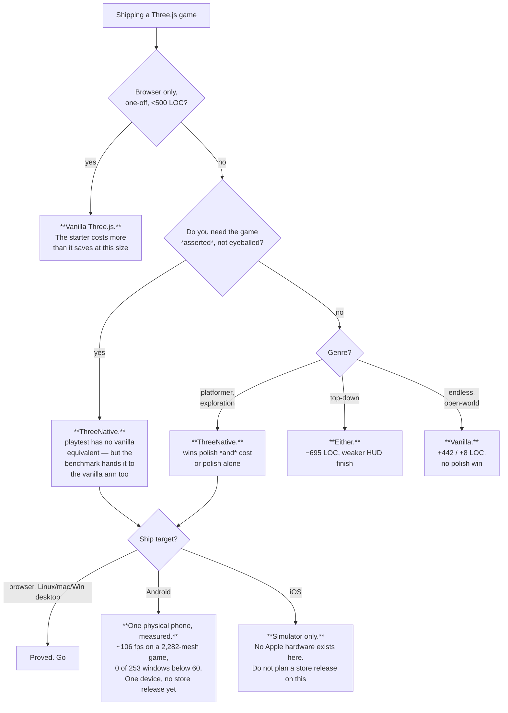

# Value proposition — "would I use this instead of vanilla Three.js?"

*Last measured 2026-08-11.*

This is the only place that answers the title question. It owns the score — the five axes,
what measures each one, the number it last returned, and whether the claim is earned yet.
The roadmap used to carry a copy of that table; it was deleted there rather than kept in
sync.

Two rules, and they are the whole point of the file:

1. **Every claim cites a run.** A row with no verification file or command behind it gets
   deleted, not softened.
2. **The charter wins any disagreement.** Nothing here changes what the framework is.

Neighbours: [POSITIONING.md](POSITIONING.md) is what we'd tell a buyer,
[BUSINESS-MODEL.md](BUSINESS-MODEL.md) is what we'd charge them. Both are untested
2026-08-02 proposals, and where they claim more than this file does, this file is right.

## The short answer

> **Today: use it if you are shipping a platformer or an exploration game to the browser and
> a desktop binary, and you want your game asserted rather than eyeballed. Otherwise vanilla
> Three.js is still the defensible choice.**

That sentence is narrower than [POSITIONING.md](POSITIONING.md)'s *"Build real games with
TypeScript and AI. One project. Web, iOS, Android."* The gap between them is the honest
subject of this document.

## The score — axis by axis

**Out of 100, five axes of 20, each tied to an instrument that already exists.** No axis
scores on opinion; if the instrument has not run, the axis does not move. **Earned** means it
ran and the framework arm won or tied; **unearned** means it ran and we lost, or it has not
run. **Standing total: ~60/100** — Gate 0 and Phase 1 are closed (`+30`); Phase 2's `+15` and
Phase 3's `+5–20` are not earned. All five axes are ⚠️.

| # | Axis | The claim a user would care about | Instrument | Measured | Earned? |
|---|---|---|---|---|---|
| 1 | Ships working | "Your game will work" | `pnpm sweep:pair` → `passed/total` | 4 sealed genres tie the vanilla arm (2/2, 2/2, 1/1, 1/1); round 3 open-world is **0/1 in both arms** | ⚠️ **tie, never a win** — parity is the ceiling by construction |
| 2 | Looks good | "It will look better" | `pnpm sweep:judge`, blind session | Wins 2/5: platformer 3.8 vs 2.4, exploration 4.4 vs 2.8. Ties endless 3.4. **Loses** topdown 3.2 vs 3.8 and open-world | ⚠️ **genre-specific, not universal** |
| 3 | Costs less | "You will write less code" | `pnpm sweep:pair` → `authoredLoc` | Wins 2/5: platformer **−187**, topdown **−695**. Loses endless **+442**, exploration **+95**, open-world **+8** | ⚠️ **half the corpus** |
| 4 | Does what vanilla can't | "It does what vanilla can't" | package inventory, reach rate | `physics` and `playtest` ship; the benchmark deliberately hands `playtest` to the vanilla arm too, so it wins no comparison. Round-3 reach rate **0.55** — a fresh uninformed build touched just over half the surface. The census dispositioned 167 unreached exports as 48 external / 106 internal-only / 8 public-by-contract / 5 dead | ⚠️ **12/20** |
| 5 | Survives the platform | "It ships where vanilla can't" | the device matrix | Browser, Linux/macOS/Windows desktop, iOS **simulator**, and now a **physical Pixel 8**: a 2,282-mesh platformer at ~106 fps median, 0 of 253 windows below 60 | ⚠️ **one phone, no iOS hardware** — but no longer emulator-only |

Evidence: [phase-1-2026-08-08.md](../verification/phase-1-2026-08-08.md) (axes 1–3, four
genres), [round-3-2026-08-09.md](../verification/round-3-2026-08-09.md) (open-world),
[tier-1-2026-08-10.md](../verification/tier-1-2026-08-10.md) and
[parity-2026-08-10-r2.md](../verification/parity-2026-08-10-r2.md) (axis 5),
[deletions-2026-08-10.md](../verification/deletions-2026-08-10.md) (axis 4 reach),
[native-performance-benchmarks-2026-08-11.md](../verification/native-performance-benchmarks-2026-08-11.md)
(axis 5, physical device, and the browser and Godot comparison).

### Why LOC cannot get us to 80

Plumbing is ~30% of a game and is **already halved** — 138 → 68 on the static control — and
gameplay is permanently the user's to write. **The ceiling on the cost axis
alone is roughly 40/100.** No amount of further framework code moves it, so a proposal
justified by "it will save the user lines" is arguing against arithmetic.

**The win condition is the paired arm, agent against agent** (`pnpm sweep:pair`), not the
static `abyss` ratio. That ratio is a **regression ratchet** against frozen hand-written
source — see `docs/benchmark/PROTOCOL.md`. Vanilla still wins it on the total (91.3%), and
that is the ratchet reporting correctly, not a defeat being hidden.

## The three claims that are actually defensible

Everything above is hedged. These three are not — each has a run behind it and no vanilla
equivalent.

**1. Your game gets asserted, not eyeballed.** `@threenative/playtest` drives the real build
and fails closed: a malformed assertion throws, a missing bridge exits `2`, an assertion
already satisfied before the scenario ran reports `TN_PLAYTEST_ASSERTION_TRIVIAL` rather than
passing. A plain Three.js project can install the same bridge — the benchmark deliberately
gives it to the vanilla arm — so **it wins no benchmark column and is still the strongest
reason to adopt.** That is a scoring artifact, recorded as such in
`OPPORTUNITY-AREAS.md` #2, not a reason to underinvest.

**2. One source runs on web and on an owned native runtime.** The same `src/game.ts` runs in
the browser, in a desktop binary, and on the Android emulator, with physics agreeing across
the C ABI. No WASM on native; the native bundle is one import-free ESM file, asserted on
every build by `examples/native-smoke`.

**3. The plumbing you would rewrite each time is halved.** Framework plumbing is **52.9%** of
the frozen hand-written control's — 68 lines against 138 (`pnpm tsx scripts/count-loc.ts`).
Total ratio 91.3%, and **vanilla still wins the total** — that is the regression ratchet
working, not a win being hidden.

**4. On a real phone it holds the frame budget where a browser and Godot sit on the cap.**
A 2,282-mesh platformer runs at **~106 fps median on a physical Pixel 8, 0 of 253 windows below
60**, with 8–9 ms frames. The same game in Chrome on the same phone is pinned at 60 with worst
frames of 19.6–22.5 ms; a comparable fox platformer in Godot 4.7.1 runs 50–60 fps with worst
frames of 19.5–33.3 ms. **Read the caveats before quoting this**: both comparisons were
vsync-locked while ours was not, the Godot subject is a different codebase, and our frame rate is
bought by `SceneCollapse` folding 2,282 objects into ~25 draws — a scene where everything moves
independently cannot be folded and is untested
([native-performance-benchmarks-2026-08-11.md](../verification/native-performance-benchmarks-2026-08-11.md)).

## Where the claim is not earned — read before quoting any of the above

| Not earned | Why, precisely |
|---|---|
| **"Ships to iOS and Android"** | **Android now has one physical phone measured**, and iOS has none. Simulator only there. The iOS lane ran on an **Apple Vision Pro** until PRD-065 Phase 0; its first genuine iOS run passed and its next run failed. No arm64, Metal-driver, signing, touch-hardware, thermal or battery evidence exists ([PRD-045](../PRDs/native/blocked/PRD-045-playtest-on-device.md), [PRD-065](../PRDs/PRD-065-ios-evidence-lane.md)) |
| **"Less code than vanilla"** as a general claim | True in 2 of 5 genres. Gameplay is permanently the user's to write, so the cost axis alone tops out near **40/100** — a ceiling, not a backlog item |
| **"Better looking"** as a general claim | Phase 1's own ledger forbids it: *"should not claim universal visual superiority from the two winning genres."* Top-down lost on HUD hierarchy |
| **"Production ready"** | Beta rows 3, 4 and 5 are open. Tier 1 is not reached: Desktop Linux `65/1/1/1`, Android emulator `27/40/0/1`, all three Phase 4 performance controls **UNVERIFIED** at exit `254` |
| **Any adoption claim at all** | **No stranger has ever played a ThreeNative game for five minutes.** That is the project's own decisive test and it is still open. [METRICS.md](METRICS.md) is right that until it closes, every other metric is a plan to measure something |

## Who should not use this

- **A one-off browser demo under ~500 lines.** The starter costs more than it saves; the
  endless-runner arm is the measured case (+442 LOC).
- **Anyone planning an App Store or Play Store release on this evidence.** Nothing here
  qualifies a physical device.
- **Anyone who wants an editor, a scene format or visual scripting.** Each was closed with
  evidence and is not coming back.
- **Anyone needing navmesh pathfinding on native.** Browser-only by decision (PRD-052).

## What would change the answer

Ranked by how much the sentence at the top would move, cheapest first.

| # | Change | Moves | Blocked on |
|---|---|---|---|
| 1 | **Round 4 paired capability proof** — a brief the vanilla arm cannot match inside the same spec | Axis 1 from *tie* to *win*; closes beta row 3 and Phase 2 | Nothing. [PRD-061](../PRDs/night-watch-26-08-10/PRD-061-round-4-paired-capability-proof.md), needs no hardware — **the only open PRD pointing at the top-line claim** |
| 2 | **A stranger plays for five minutes** | Every adoption claim — this is the project's decisive test | An afternoon and one external person |
| 3 | **Two consecutive green iOS-simulator lanes** | Lets us say *iOS simulator*, still never *iPhone* | [PRD-045](../PRDs/native/blocked/PRD-045-playtest-on-device.md) criterion 7, reopened; the attach-race fix landed in `0e4897a` |
| 4 | **Tier 1 aggregate green** | Beta rows 4–5; licenses the desktop+emulator sentence outright | [PRD-064](../PRDs/night-watch-26-08-10/PRD-064-tier-1-native-reliability.md) — the Android emulator lane is `27/40` |
| 5 | **A controlled engine benchmark** — one scene spec built in both engines, everything moving so no pass can fold it | Turns "holds the budget on this game" into a defensible engine-class claim | Nothing but time. The uncontrolled version is measured; §5 of [the benchmark record](../verification/native-performance-benchmarks-2026-08-11.md) specifies the controlled one |
| 6 | **A second physical Android device** | Guards the one-device, one-thermal-state caveat | Hardware |

## The one-line claim, in two versions

| Version | Text | Status |
|---|---|---|
| Buyer-facing ([POSITIONING.md](POSITIONING.md)) | *Build real games with TypeScript and AI. One project. Web, iOS, Android. You own the code.* | **Proposal.** "iOS, Android" is not executable evidence today |
| Evidence-bound (this file) | *Write the game once in TypeScript; run it on browser WebGPU and a desktop binary, with your gameplay asserted by a harness that fails closed. Mobile is emulator-proved, not device-proved. You own every line a screenshot shows.* | Every clause traces to a verification file above |

**Use the second one in anything a stranger reads** until the first is earned.
