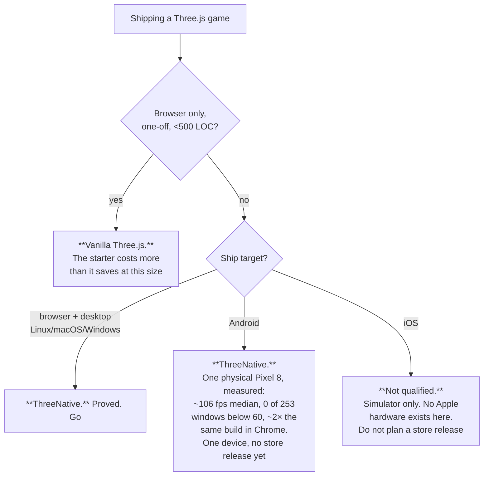

# Value proposition — "would I use this instead of vanilla Three.js?"

*Last measured 2026-08-11.*

This is the only place that answers the title question. It owns the score — the five axes,
what measures each one, the number it last returned, and whether the claim is earned yet.
The roadmap used to carry a copy of that table; it was deleted there rather than kept in
sync.

Two rules, and they are the whole point of the file:

1. **Every claim cites a run.** A row with no verification file or command behind it gets
   deleted, not softened.
2. **The charter wins any disagreement.** Nothing here changes what the framework is.

Neighbours: [POSITIONING.md](POSITIONING.md) is what we'd tell a buyer,
[BUSINESS-MODEL.md](BUSINESS-MODEL.md) is what we'd charge them. Both are untested
2026-08-02 proposals, and where they claim more than this file does, this file is right.

## The short answer

> **Today: use it if you are shipping a Three.js game to the browser, a desktop binary and
> an Android phone, you want an agent to author the content, and you want the result
> asserted rather than eyeballed. Vanilla Three.js is still the defensible choice for a
> browser-only one-off, and for anything that must ship to iOS hardware.**

That sentence is narrower than [POSITIONING.md](POSITIONING.md)'s *"Build real games with
TypeScript and AI. One project. Web, iOS, Android."* — the gap is iOS, and it is the honest
subject of this document.

## The score — axis by axis

**Out of 100, five axes of 20, each tied to an instrument that already exists.** No axis
scores on opinion; if the instrument has not run, the axis does not move.

The axes measure **what a user gets**, not the delta against a vanilla control. That is a
deliberate change from the previous version of this file, which scored all five axes as
"beats vanilla" and so could never exceed a tie: the paired benchmark hands the vanilla arm
our own scaffolding *and* `playtest` on purpose, which is correct benchmark design and a
useless value ledger. **Standing total: 67/100**, on a scale that is not comparable to the
~60/100 the old axes reported.

| # | Axis | The claim a user would care about | Instrument | Measured | Score |
|---|---|---|---|---|---|
| 1 | **Start a project** | "There is something to run in a minute" | CI `scaffold-smoke`, `pnpm test:templates` | Three templates — `minimal`, `platformer`, `starter` — each scaffolded and playtested on every CI run. All pin real versions; CI asserts no `catalog:` survives scaffolding | **16/20** — gated and green, but the starter is a net *cost* below ~500 LOC (+442 on the endless-runner arm) |
| 2 | **Author the content** | "An agent can find and make my assets" | the two pinned MCP servers, `asset-mcp-tools.json` | `threenative-asset-mcp@0.4.0` (32 tools) and `threenative-sculpt-mcp@0.1.0` (5 tools + 31 resources) install and launch in all three templates via `.mcp.json`. Surface recorded by running the pinned server, never from its docs | **10/20** — ships and runs, **but the asset MCP's own visual-improvement gate lost to the no-MCP control**; the sculpt MCP has no preference or token telemetry at all |
| 3 | **Know it works** | "My game is asserted, not eyeballed" | `@threenative/playtest`, exit codes | Fails closed: malformed assertion throws, missing bridge exits `2`, a pre-satisfied assertion reports `TN_PLAYTEST_ASSERTION_TRIVIAL`. Same scenario runs on device with `--target android` or `--target ios` | **18/20** — the strongest thing here; docked only because a plain Three.js project can install the same bridge |
| 4 | **Run it natively** | "It ships where vanilla can't, and faster" | the device matrix, `pnpm native:verify:desktop` | Browser, Linux/macOS/Windows desktop, iOS **simulator**, and a **physical Pixel 8**: 2,282-mesh platformer, **~106 fps median, 0 of 253 windows below 60**, ~2× the same build in Chrome on the same phone | **15/20** — one phone, one thermal state, **no iOS hardware**, no store release |
| 5 | **Write less code** | "You will write less than vanilla" | `pnpm sweep:pair` → `authoredLoc` | Wins 2 of 5 genres: platformer **−187**, topdown **−695**. Loses endless **+442**, exploration **+95**, open-world **+8** | **8/20** — half the corpus, and the ceiling is arithmetic, not backlog (below) |

Evidence: [phase-1-2026-08-08.md](../verification/phase-1-2026-08-08.md) (axis 5, four
genres), [round-3-2026-08-09.md](../verification/round-3-2026-08-09.md) (open-world),
[native-gameplay-frame-rate-2026-08-11.md](../verification/native-gameplay-frame-rate-2026-08-11.md),
[native-visual-parity-2026-08-11.md](../verification/native-visual-parity-2026-08-11.md),
[cold-start-and-hitches-2026-08-11.md](../verification/cold-start-and-hitches-2026-08-11.md)
and
[native-performance-benchmarks-2026-08-11.md](../verification/native-performance-benchmarks-2026-08-11.md)
(axis 4, physical device, plus the browser and Godot comparison),
[tier-1-2026-08-10.md](../verification/tier-1-2026-08-10.md) (axis 4 reliability),
[PRD-032](../PRDs/done/PRD-032-asset-discovery-mcp.md) and
[PRD-049](../PRDs/done/PRD-049-sculpt-from-reference-mcp.md) (axis 2).

### Why LOC cannot get us to 80 on axis 5

Plumbing is ~30% of a game and is **already halved** — 138 → 68 on the static control — and
gameplay is permanently the user's to write. **The ceiling on the cost axis alone is roughly
40/100.** No amount of further framework code moves it, so a proposal justified by "it will
save the user lines" is arguing against arithmetic.

The win condition on that axis is the paired arm, agent against agent (`pnpm sweep:pair`),
not the static `abyss` ratio. That ratio is a **regression ratchet** against frozen
hand-written source — see `docs/benchmark/PROTOCOL.md`. Vanilla still wins it on the total
(91.3%), and that is the ratchet reporting correctly, not a defeat being hidden.

### What the paired benchmark cannot show

The benchmark deliberately gives the vanilla arm the scaffolding and the `playtest` bridge,
so **axes 1 and 3 win no benchmark column by construction**. That is a scoring artifact, not
a verdict on their worth, and it is recorded as one in [OPPORTUNITY-AREAS.md](../PRDs/OPPORTUNITY-AREAS.md) #2. Read the
benchmark for what it is: a control on cost and polish, not a census of what ships.

## The five claims that are actually defensible

Each has a run behind it.

**1. Your game gets asserted, not eyeballed.** `@threenative/playtest` drives the real build
and fails closed: a malformed assertion throws, a missing bridge exits `2`, an assertion
already satisfied before the scenario ran reports `TN_PLAYTEST_ASSERTION_TRIVIAL` rather than
passing. The same scenario runs on device. A plain Three.js project can install the same
bridge, so it wins no benchmark column and is still the strongest reason to adopt.

**2. One source runs on web and on an owned native runtime.** The same `src/game.ts` runs in
the browser, in a desktop binary, and on a physical Android phone, with physics agreeing
across the C ABI. No WASM on native; the native bundle is one import-free ESM file, asserted
on every build by `examples/native-smoke`.

**3. The same Three.js game runs at roughly half the frame cost of the same game in a browser
on the same phone.** This is the cleanest comparison the project has, because both arms are
the *identical codebase* — only the runtime under it differs. On a physical Pixel 8, a
2,282-mesh platformer runs **~106 fps median uncapped with 8–9 ms frames, minimum 83.4, 0 of
253 rolling windows below 60**. The same build in Chrome on that phone is pinned at 60 fps
with worst frames of **19.6–22.5 ms** — past the 16.7 ms budget. Chrome cannot be uncapped at
all (`requestAnimationFrame` is bound to the display refresh), so its ceiling is structural,
not a tuning choice. Against its own past, the same game went from **21.8 fps to ~106 fps**.

**And the game contains no code that makes that happen.** The old in-game hack cost ~600
lines plus scene-graph annotations and lost the sky, clouds, HUD, animation and toon shading;
`SceneCollapse` in the framework keeps all of them with **zero game-side lines**. That is the
engine-bug/game-bug rule paying out in a measurement.

**4. The scaffold hands an agent two working asset servers.** All three templates pin and
launch `threenative-asset-mcp@0.4.0` (32 tools, surface recorded by running the pinned server
from inside a scaffolded project) and `threenative-sculpt-mcp@0.1.0` (5 tools, 31
technique-safe resources), with the generated `AGENTS.md` routing conventional assets,
trivial geometry, bespoke objects, landmarks and scenery to the right one. Both are external,
MIT, on their own release lanes — never vendored. **This is a capability claim, not a quality
claim:** see the next section.

**5. The plumbing you would rewrite each time is halved.** Framework plumbing is **52.9%** of
the frozen hand-written control's — 68 lines against 138 (`pnpm tsx scripts/count-loc.ts`).
Total ratio 91.3%, and **vanilla still wins the total** — the regression ratchet working, not
a win being hidden.

**Godot is not part of claim 3, deliberately.** A comparable fox platformer in Godot 4.7.1 ran
53.7–59.5 fps uncapped on the same phone against our ~106, which is favourable — but the two
games are different codebases and the Godot one renders the heavier scene, so the result is
indicative and not defensible line by line. The workload that would settle it is one where no
merge pass can help, and it is untested. Specified in
[ENGINE-PARITY-SPEC.md](../benchmark/ENGINE-PARITY-SPEC.md).

## Where the claim is not earned — read before quoting any of the above

| Not earned | Why, precisely |
|---|---|
| **"Ships to iOS"** | **No Apple hardware exists here.** Simulator only, and the lane ran on an **Apple Vision Pro** until PRD-065 Phase 0; its first genuine iOS run passed and its next run failed. No arm64-device, Metal-driver, signing, touch-hardware, thermal or battery evidence ([PRD-045](../PRDs/native/blocked/PRD-045-playtest-on-device.md), [PRD-065](../PRDs/PRD-065-ios-evidence-lane.md)) |
| **"Ships to Android"** as a *product* claim | One physical Pixel 8 (`shiba`, arm64-v8a, Android 17), one thermal state, no second device, no Play Store release. The frame-rate numbers are real; the fleet claim is not |
| **"The asset MCP improves your game"** | PRD-032's live-agent exit gate **failed**: the no-MCP control produced the better frame. The owner retained the capability as a disposition, not a pass. Frames, hashes and reviewer scores in `docs/verification/PRD-032-asset-proof/`. PRD-049 shipped with preference and token telemetry recorded **unavailable** |
| **"Less code than vanilla"** as a general claim | True in 2 of 5 genres. Gameplay is permanently the user's to write, so that axis tops out near 40/100 — a ceiling, not a backlog item |
| **"Better looking"** as a general claim | Phase 1's own ledger forbids it: *"should not claim universal visual superiority from the two winning genres."* Wins platformer 3.8 vs 2.4 and exploration 4.4 vs 2.8; **loses** topdown 3.2 vs 3.8 on HUD hierarchy |
| **"Production ready"** | Beta rows 3–5 are open. Tier 1 is not reached: Desktop Linux `65/1/1/1`, Android emulator `27/40/0/1` |
| **Any adoption claim at all** | **No stranger has ever played a ThreeNative game for five minutes.** That is the project's own decisive test and it is still open. [METRICS.md](METRICS.md) is right that until it closes, every other metric is a plan to measure something |

## Who should not use this

- **A one-off browser demo under ~500 lines.** The starter costs more than it saves; the
  endless-runner arm is the measured case (+442 LOC).
- **Anyone planning an App Store release.** Nothing here qualifies iOS hardware at all.
- **Anyone planning a Play Store release on one device's numbers.** One Pixel 8 is evidence;
  it is not a fleet.
- **Anyone who wants an editor, a scene format or visual scripting.** Each was closed with
  evidence and is not coming back.
- **Anyone needing navmesh pathfinding on native.** Browser-only by decision (PRD-052).

## What would change the answer

Ranked by how much the sentence at the top would move, cheapest first.

| # | Change | Moves | Blocked on |
|---|---|---|---|
| 1 | **A stranger plays for five minutes** | Every adoption claim — the project's decisive test | An afternoon and one external person |
| 2 | **A second physical Android device** | Turns one device into a fleet claim; axis 4 → 18 | Hardware |
| 3 | **An honest asset-MCP win** — a rerun where the MCP arm beats the no-MCP control | Axis 2 is capped at 10/20 until then | A rerun of PRD-032's live-agent gate |
| 4 | **Two consecutive green iOS-simulator lanes** | Lets us say *iOS simulator*, still never *iPhone* | [PRD-045](../PRDs/native/blocked/PRD-045-playtest-on-device.md) criterion 7, reopened; the attach-race fix landed in `0e4897a` |
| 5 | **Tier 1 aggregate green** | Beta rows 4–5; licenses the desktop+Android sentence outright | [PRD-064](../PRDs/night-watch-26-08-10/PRD-064-tier-1-native-reliability.md) — the Android emulator lane is `27/40` |
| 6 | **A controlled engine benchmark** — one scene spec built in both engines, everything moving so no pass can fold it | Turns "holds the budget on this game" into a defensible engine-class claim | Nothing but time; §5 of [the benchmark record](../verification/native-performance-benchmarks-2026-08-11.md) specifies it |

## The one-line claim, in two versions

| Version | Text | Status |
|---|---|---|
| Buyer-facing ([POSITIONING.md](POSITIONING.md)) | *Build real games with TypeScript and AI. One project. Web, iOS, Android. You own the code.* | **Proposal.** "iOS" is not executable evidence today |
| Evidence-bound (this file) | *Write the game once in TypeScript; run it on browser WebGPU, a desktop binary and an Android phone at roughly twice the frame rate of the same build in Chrome, with an agent authoring your assets and a harness that fails closed asserting your gameplay. iOS is simulator-only. You own every line a screenshot shows.* | Every clause traces to a verification file above |

**Use the second one in anything a stranger reads** until the first is earned.
