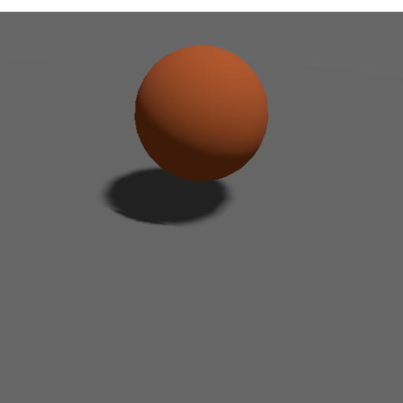

# PRD-315 virtual shadow mapping proof — 2026-09-02

The headed WebGPU proof ran from delivery branch `linchpin/vsm-pr-20260902` on
`nvidia | turing`.

## Browser WebGPU

Command:

```sh
pnpm --filter @threenative/core exec tsup --config scripts/vsm-proof/tsup.config.ts
sh scripts/xvfb.sh pnpm exec tsx packages/core/scripts/vsm-proof/run.mjs
```

Observed result:

- Stock shadow: under `39`, beside `102`.
- Virtual shadow: under `41`, beside `102`, visible shadow `true`.
- Three levels: frame 1 rendered `3`; frames 2–12 reused `3` cached levels.
- Tracked mover: `1`; mover-map renders: `3` on every frame.
- Frame-12 reuse ratio: `0.9166666666666666`; changed-pixel ratio: `0.0022`.
- The proof runner's fail-closed assertions passed, including adapter, visibility, cache history,
  mover coverage, level assignment, marker shape, and stock/virtual pixel change.



Raw runner output: [PRD-315-vsm-proof-2026-09-02.json](./PRD-315-vsm-proof-2026-09-02.json).

## Native desktop

The handoff's native conformance run is carried by the `33-virtual-shadow` registry row from
`cd738d9f`, now included in this branch. Its recorded desktop result was
`pixelMismatchRatio 0`, `perceptualDeltaE 0`, with no GPU validation errors.

The native binary was not rebuilt in this verification pass. The repository test remains
setup-blocked by the absent optional executables under `packages/runtime-native/build/tn-linux*`;
the browser proof above is the executed visual result for this branch.
