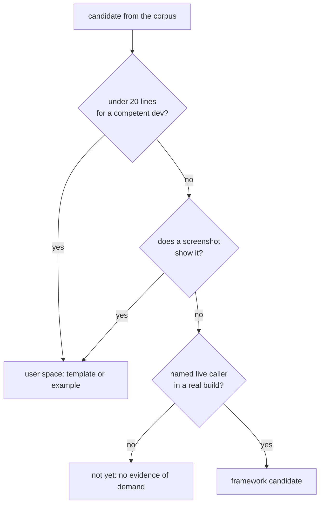

# Abstraction mining over the sweep archives — 2026-08-16

What the 105 archived blind builds in `docs/benchmark/sweeps/` say about which abstractions the
framework should ship. Nothing here is a new run: every number is recomputed from evidence already
in the repository. Scripts are in the reproduce section at the bottom.

The question this set out to answer: **do independent agent builds converge on the same
hand-written code, and if so, is any of it worth owning?** The answer to the first half is no, and
that changes what the rest of the analysis can claim.

## Corpus

| | |
| --- | --- |
| Archives | 105 |
| Distinct `src` trees | 96 |
| Lineages after collapsing sibling attempts | 48 |
| **Independent build groups** (genre × arm × brief × date) | **25** — 15 framework, 10 vanilla |
| Genres | endless-runner, exploration, open-world, physics-puzzle, platformer, topdown-action |
| Dates | 2026-08-05 → 2026-08-16 |
| Archives carrying a frozen `*-baseline/` | 80 |
| Top-level declaration blocks ≥ 12 LOC in authored files | 518 |

**Authored** means a file whose content differs from the archive's own frozen template baseline, the
same definition `scripts/measure-sandbox.ts` uses. Vanilla arms have no baseline, so everything they
wrote counts. 35 of the 105 archives are iterations of a single platformer session
(`platformer-2026-08-07-16` … `-50`); counting those as 35 builds would have inflated every
recurrence number in this document by an order of magnitude, which is why the unit of analysis is
the build group, not the archive.

## Finding 1 — independent builds do not converge on code

Of the 482 agent-written blocks ≥ 12 LOC, near-duplicate clustering at 0.4 token-shingle similarity
produced exactly **one cluster spanning more than one genre**: a hemisphere-light-plus-directional-sun
pair, 13 lines, in an open-world and a platformer build. Every other cluster is confined to one
genre and usually one session.

So the cheapest theory of abstraction discovery — mine the corpus for repeated code, promote what
repeats — returns nothing that clears the 20-line rule. Two independent agents given two different
briefs write two different games, all the way down.

What *does* repeat is the **concept**, never the code:

| Concept hand-written | Build groups | Functions | Median LOC | Total LOC | Example names |
| --- | --- | --- | --- | --- | --- |
| ground / terrain / platforms | 10 / 23 | 12 | 27 | 443 | `makeRoad`, `addGround`, `createTerrain`, `addFloatingIsland` |
| crate / box prop | 9 / 23 | 14 | 24 | 364 | `addStaticBox`, `GhostCrate`, `addCrates` |
| tree / foliage | 9 / 23 | 14 | 17 | 269 | `makeTree`, `pineTree`, `addSouthGrove` |
| goal / flag | 6 / 23 | 8 | 26 | 234 | `makeGoal`, `goalFlag`, `GoalProbe` |
| enemy / NPC | 5 / 23 | 6 | 47 | 277 | `Enemy`, `makeMushroom`, `EnemyTarget` |
| pickup / coin | 5 / 23 | 5 | 18 | 91 | `createCollectible`, `makeCoin` |
| building | 4 / 23 | 4 | 36 | 155 | `clockTower`, `makeCastle` |
| cloud | 4 / 23 | 4 | 23 | 86 | `addCloud`, `makeCloud` |
| character rig | 3 / 23 | 3 | 50 | 157 | `buildCharacter`, `makeFox` |

None of these names appears in any of the 80 frozen template baselines. They are authored every
time, from scratch, differently. The vanilla platformer ledger measured the same mass independently
and put a number on it: **628 hand-written lines of scene primitives, 37% of that build.**

## Finding 2 — what the framework has already earned, measured

Concern lines per build group, counted on authored files only, median across the groups that touch
the concern at all. A low framework number against a high vanilla number is the framework doing its
job.

| Concern | FW groups | FW median lines | VA groups | VA median lines |
| --- | --- | --- | --- | --- |
| fixed-step / RAF loop | **0 / 15** | 0 | 10 / 10 | 3 |
| physics body wiring | 11 / 15 | 2 | 4 / 10 | **36** |
| HUD text / DOM | 8 / 15 | 1 | 10 / 10 | 7 |
| respawn / checkpoint | 11 / 15 | 2 | 3 / 10 | 5 |
| health / damage | 3 / 15 | 7 | 1 / 10 | 15 |
| smoothing / damping | 10 / 15 | 2 | 5 / 10 | 3 |
| follow camera | 12 / 15 | 2 | 9 / 10 | 1 |
| coyote / jump buffer | 6 / 15 | 6 | 1 / 10 | 8 |
| input handling | 3 / 15 | 4 | 10 / 10 | 2 |
| hit flash / feedback | 11 / 15 | 3 | 8 / 10 | 1 |

Not one framework build hand-rolls a frame loop. Physics goes from 36 lines to 2. The React HUD
takes DOM text handling from 7 lines to 1. Those three are the framework's real product and the
corpus states it without being asked.

Two rows point the other way and are worth naming. **Input handling**: three framework builds still
attach their own listeners, and at twice the vanilla line count — an abstraction being worked
around, not used. **Follow camera**: both arms hand-write it, at 1–2 lines, which is the 20-line
rule saying leave it alone.

### The one number that needs a better instrument

Authored LOC, framework arm against vanilla arm, largest build per genre:

| Genre | Framework | Vanilla | FW / VA |
| --- | --- | --- | --- |
| platformer (2026-08-16, same brief, same day) | 1493 | 1708 | 0.87 |
| physics-puzzle (2026-08-15, same brief) | 1269 | 1345 | 0.94 |
| topdown-action | 1204 | 936 | 1.29 |
| exploration | 1054 | 714 | 1.48 |
| open-world | 666 | 451 | 1.48 |
| endless-runner (2026-08-08, same brief, same day) | 810 | 316 | 2.56 |

The two most recent paired runs favour the framework by 6–13%. The four older ones do not, and
endless-runner is a same-day pair that goes 2.6× against it. **This comparison is confounded and
should not be quoted as a kill-switch result.** A framework build starts from a ~900-line template
and its authored count charges it for every template line it rewrites; a vanilla build starts from
nothing and writes one `main.ts`. Rewriting an existing line is not the same cost as authoring one,
and the instrument cannot currently tell them apart. Fixing that is a prerequisite to reading this
table as a verdict either way.

## Finding 3 — the assets path is not reached

| Check across all 105 archives | Result |
| --- | --- |
| Archives loading a `.glb` / `.gltf` at all | **1** |
| Archives referencing `threenative-asset-mcp` | **0** |
| Archives importing `RoundedBoxGeometry` from three | 24 |
| `createAssetLoader` (exported) reached by any sweep | never |

Every build models its props out of `BoxGeometry` and `SphereGeometry` by hand while an
asset-discovery MCP sits pinned in the template it scaffolded from. The trees, crates and castles in
Finding 1 are the direct cost of that. Note the contrast in the same table: agents *do* find
`RoundedBoxGeometry` in `three/addons` — 24 archives import it — so this is not agents refusing to
use libraries. It is one specific path they never discover.

## Finding 4 — the friction ledgers repeat where the code does not

33 real friction rows across the 11 `docs/verification/sweep-*.md` ledgers (36 rows, 3 of which say
"None"). Unlike the code, these recur across rounds and genres:

- **`CharacterBody3D` contract — 4 rows, 3 rounds, 2 genres.** `gravity: 0` needed for a planar game
  or the character falls through the floor (topdown-action, 2026-08-05, twice); `gravity: 24`
  accelerates *upward* because the value is added to `velocity.y` (platformer, 2026-08-16); the
  capsule origin is its centre, so a character modelled on its own origin floats
  `halfHeight + radius` above every surface (same round).
- **`Object3D` is second-class — 2 rows, 2 rounds.** `CharacterBody3D` needed `object` rather than
  `mesh` for a `Group` character (2026-08-05); the playtest `visibility` assertion still fails on a
  `Group` mesh and was worked around with an invisible proxy `Mesh` (2026-08-16).
- **Headless WebGPU capture — 3 rows, 3 ledgers**, spanning `createBuffer failed`, blank framework
  screenshots, and SwiftShader serving WebGPU silently without `--headed`.
- **Gradient sky — 3 independent sources.** The vanilla ledger: "There is no built-in gradient sky,
  so every project rewrites it", ~18 lines, and that arm independently arrived at the same
  `fog: false` fix round 9 applied to the templates. Round 10 then found `defense` and `racing` have
  no gradient at all.

## Ranked candidates



Ordered by expected value, with the verdict each one gets from the rules already in force.

**1. Scene prop content — the largest un-served cost, and not a framework abstraction.**
10 of 23 build groups wrote a terrain builder, 9 a crate, 9 a tree; 628 lines and 37% of one
measured build. Anything a screenshot shows ships as generated user source, so this can never be
package code. The two shapes that are open: a per-template `src/render/props.ts` of generated
primitives, or making the asset path in Finding 3 actually reachable. Both are template work; the
second is the one that scales past one template.

**2. `CharacterBody3D`'s contract — highest ratio of silent bugs to lines of fix.**
Four friction rows over three rounds, each costing a build an hour and each indistinguishable on
screen from a collider bug. The abstraction is right; its contract is invisible. Candidates: a
signed gravity vector or a `gravityDown` name that cannot be read backwards, and an explicit capsule
`origin: "base" | "centre"`. Small, typed, and it retires a whole recurring row family.

**3. An escape hatch on `SceneCollapse`.**
Round 9: the pass merged 2,642 meshes into 26 and dropped every shadow while
`renderer.shadowMap.enabled` still read `true`, with no way to opt out or exclude an object. The
workaround was a `whenReady()` traverse re-setting flags on every mesh — game code annotating its own
scene graph to survive a framework pass, which is the shape of an engine bug wearing game-code
clothes. The framework already holds that a backend which cannot honour an option must throw rather
than discard it; a pass that rewrites the user's scene owes the same honesty.

**4. Accept `Object3D` wherever a `Mesh` is accepted.**
Two rounds, two different subsystems, same cause. Cheap and mechanical.

**5. Discriminate `IInputAction`.**
`down` means "keys that press this action" for a button and "the down direction" for a vector, with
no discriminator in the type and no worked `move` binding in the template. Three framework builds
bypassed the abstraction entirely. This is a type change plus a template example, not new API.

**6. Playtest defaults, not playtest features.**
Playtest is the framework's strongest earned win — the vanilla arm spent 151 lines building a
screenshot-and-state-dump harness by hand and named it its single largest incidental cost. Four
round-9 rows are all about its defaults: SwiftShader without `--headed`, a `console.json` the runner
names but never writes, scenarios wired to `pnpm dev` that only pass against `vite preview`, and a
scaffolded `AGENTS.md` documenting the SwiftShader configuration.

### What was changed on 2026-08-16, and what was not

Five of the six candidates were implemented in the same pass, each with a test that fails when the
change is reverted. `pnpm typecheck` and `pnpm lint` are clean (215 pre-existing warnings, zero
errors); `pnpm test` is green apart from two `packages/runtime-native` failures that predate this
work — `tests/parity-contract.test.mjs` expects `PRD-064` where commit `5e554485` set the registry
owner to `PRD-077`, reproduced with these changes stashed, and `tests/conformance-runner.test.mjs`
times out at 60s on a loaded machine.

| Candidate | Change | Proof |
| --- | --- | --- |
| 2 — `CharacterBody3D` contract | `gravity` documented as a signed velocity component with the failure mode named; `CollisionShape3D.capsule` documents the centre origin and the `-(halfHeight + radius)` rig offset | `physics/__tests__/character.spec.ts`: a positive gravity rises and a negative one falls; a capsule body rests with its origin between `halfHeight + radius` and `+0.05`. `documentation.spec.ts` gates both doc comments so they cannot be silently deleted |
| 4 — `Object3D` acceptance | Nothing to change. **The round 9 diagnosis does not reproduce**: a `Group` of parts observes 177×124 px through `Box3.setFromObject`, not zero | `playtest/__tests__/group-entity-visibility.spec.ts` pins Group bounds, a Group's bounds exceeding any single part's, and an empty Group reporting none. The row stays open against a real reproduction rather than a ruled-out cause |
| 5 — `IInputAction` | Added `keys` for button actions; `down`/`up`/`left`/`right` documented as axis directions; `pressed` honours `keys`, `vector` ignores it. All seven templates now declare `move` explicitly and bind buttons with `keys` — six had been inheriting the axis from an invisible default | `core/__tests__/input.spec.ts`: `keys` presses, `keys` stays out of the vector, and the older `down` form still presses. `create-threenative/__tests__/template.spec.ts` asserts every template declares the axis and binds no button with `down` |
| 6a — named artifacts | `console.json`, `network.json` and `runtime-trace.json` are written when a channel has content or `artifacts.*` asked for it. `artifacts.console`, `artifacts.network` and `artifacts.runtimeTrace` were accepted and discarded | `playtest/__tests__/artifact-files.spec.ts`, 4 cases including "writes nothing when nothing was asked for and nothing has content" |
| 6b — software adapter | A WebGPU run whose `adapter.info` names SwiftShader, llvmpipe, lavapipe or a basic render driver fails `TN_PLAYTEST_SOFTWARE_ADAPTER`; `--allow-software` accepts it deliberately, borrowing the flag `scripts/profile-starter.ts` already uses. Scoped to `rendererKind === "webgpu"`, because the repo runs WebGL fixtures headless on purpose | `playtest/__tests__/runner.spec.ts`: three fields that can carry the giveaway each fail, a hardware adapter does not, and `--allow-software` clears it |
| 6c — scaffolded instructions | Three template `AGENTS.md` files stopped instructing `xvfb-run` and stopped listing flags without `--enable-features=Vulkan`; they now point at `--browser-recipe webgpu --headed` and explain the exit-status trap | `template.spec.ts` fails on any AGENTS.md that mentions `xvfb-run` outside a warning, or that explains WebGPU capture without naming the recipe or the flag |

Two candidates were **not** implemented, on purpose:

- **1 — scene prop content.** The largest measured cost and not a framework change: a screenshot
  shows every one of those props, so they can only ship as generated user source or come through the
  asset path. Which of those two, and whether `minimal` should look richer, are product decisions.
- **3 — a `SceneCollapse` escape hatch.** `packages/core/src/collapse.ts` states the opposite
  commitment in its own header: "deliberately invisible to the game: nothing here reads a `userData`
  flag… where the picture cannot be preserved the pass declines and says why". Round 9 fixed the
  shadow-flag loss inside the pass, which is what that commitment requires. Adding an opt-out
  reverses a stated design decision and is the owner's call, not a defect fix.

Also left alone, with reasons already on the record: `templates/starter/playtests/seed.playtest.json`
asserting a starter internal (round 9 deferred it with an open coverage question), and the template
`test` script targeting `pnpm dev` (round 9 declined to change it as unreproduced on a quiet machine).

### Closed by this data, so they do not need re-arguing

| Candidate | Why not |
| --- | --- |
| Follow-camera helper | 1–2 lines in both arms. Under the 20-line rule. |
| Coyote time / jump buffer | 6 lines median, and 6 of 15 groups invented it independently — that is platformer *template* content, not framework. |
| Gradient sky helper | ~18 lines, and a screenshot shows it. Templates own it; rounds 9 and 10 already moved it there. |
| Rounded-box geometry cache | The starter template already ships `render/shapes.ts` with it; 42 baselines contain it. The corpus recurrence was template inheritance, not invention. |
| Object pooling / spawner | No cross-genre recurrence. Appears only in the genres that need it. |
| Screen shake, day/night cycle, steering, hand-rolled LOD | **Zero occurrences in 105 archives.** No build has ever wanted them. |

## Finding 5 — the deletion side

Aggregated from the `Used exports` / `Unused exports` lines the 11 sweep ledgers already record:

- **23 distinct exports have ever been used by any sweep.** 14 of them in three or more:
  `GameCanvas`, `Scene`, `defineGame`, `playtest`, `useGameState`, `CharacterBody3D`,
  `CollisionShape3D`, `Ctx`, `DebugOverlay`, `Game`, `RigidBody3D`, `rapier`, `PhysicsContext`,
  `Area3D`. That is the earned core, and it is small.
- **325 exported names of four characters or more have never been reached by any sweep** — 157
  `I`-prefixed interfaces, 89 classes and types, 63 functions, 16 constants. Much of that is
  legitimately not game-facing (playtest CLI internals, Android and iOS drivers), so the number is
  an upper bound on dead surface, not a delete list.
- The game-facing part of it is the interesting part: `AnimationPlayer`, `GPUParticles3D`,
  `NavigationAgent3D`, `NavigationObstacle3D`, `NavigationRegion3D`, `PathFollow3D`, `ScenePicker`,
  `Scheduler`, `PhysicsBody3D`, `PhysicsDirectSpaceState3D`, plus `createAssetLoader`,
  `createGameStore`, `createRenderer`, `createRandom`, `interactionGroups`.
- Reach rate on the framework arm, by date: 0.53, 0.50, 0.56, 0.50, 0.47 → **0.40** on 2026-08-16.
  It falls as the surface grows, which is the same fact from the other direction.

`pnpm round:deletions` already reports exports unreached across consecutive rounds; this is that
signal aggregated over every sweep rather than adjacent pairs.

## What this cannot tell you

- **Sandbox agent transcripts no longer exist.** There is no
  `~/.claude/projects/-home-joao-projects-threenative-*` and no `.jsonl` inside the ~25
  `projects/threenative-*` sandboxes. Where a ledger recorded time-to-first-game-code ("tool call 16
  of ~139"), that number survives; it cannot be recomputed for any other run, and no new
  wrong-turn or dead-end analysis is possible on past sweeps.
- **No human has played any of these builds.** Every judgement in the corpus is a model score or an
  assertion result.
- **Concern line counts are regex counts, not semantic ones.** They support "this build touches this
  concern, at roughly this weight"; they do not support a precise cost per feature.
- **Vanilla and framework authored counts are not like-for-like**, for the reason given under
  Finding 2.

## Reproduce

The four scripts that produced every number above are in the session scratchpad and are not checked
in; they read only `docs/benchmark/sweeps/`, `docs/verification/sweep-*.md` and
`packages/create-threenative/templates/`. The three checks worth keeping in the repository if this
gets repeated:

```sh
# concept recurrence across independent build groups (Finding 1)
# concern lines per build group, framework against vanilla (Finding 2)
# used/unused export aggregation across every sweep ledger (Finding 5)
```

The asset check in Finding 3 is one command:

```sh
cd docs/benchmark/sweeps
grep -rl "GLTFLoader\|\.glb" --include='*.ts' */src | cut -d/ -f1 | sort -u | wc -l   # 1
grep -rl "asset-mcp" --include='*.ts' */src | wc -l                                    # 0
```
